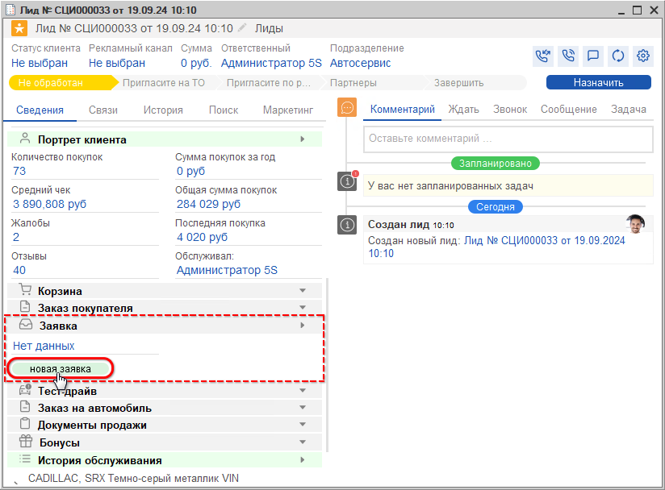
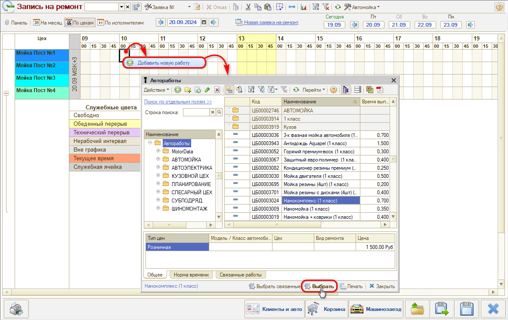
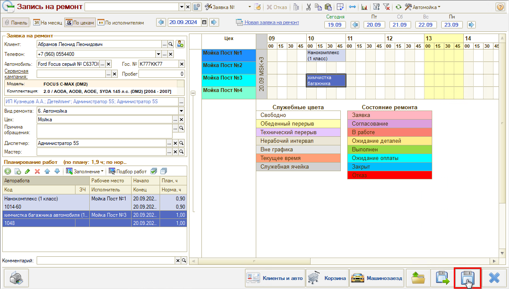

# Как подобрать автоработы из АРМ Запись на ремонт

<table><tr><td><b>Время чтения:</b> 3 мин.</td><td><b>Обновлено:</b> 01.09.2026</td></tr></table>

Источник: https://www.5systems.ru/help/kak-podobrat-avtoraboty-iz-arm-zapis-na-remont

Время просмотра — 0:46 мин.

В АРМ «Запись на ремонт» можно производить подбор авторабот.

Для перехода в АРМ «Запись на ремонт» из Сделки следует нажать кнопку **«Новая заявка»**:

В открывшемся планировщике необходимо выбрать нужный день, пост и время, кликнуть по ячейке правой кнопкой мыши, нажать кнопку **«Добавить новую работу»**, найти и выбрать в справочнике нужную работу:

Работа занимает место в планировщике в соответствии с ее нормой времени. Можно произвольно выделить нужное количество времени и запланировать работу в выбранный интервал.

После того, как работы спланированы, нужно сохранить заявку:

---

**Теги:** запись на ремонт, автоработы, подбор работ, планировщик, сделка

