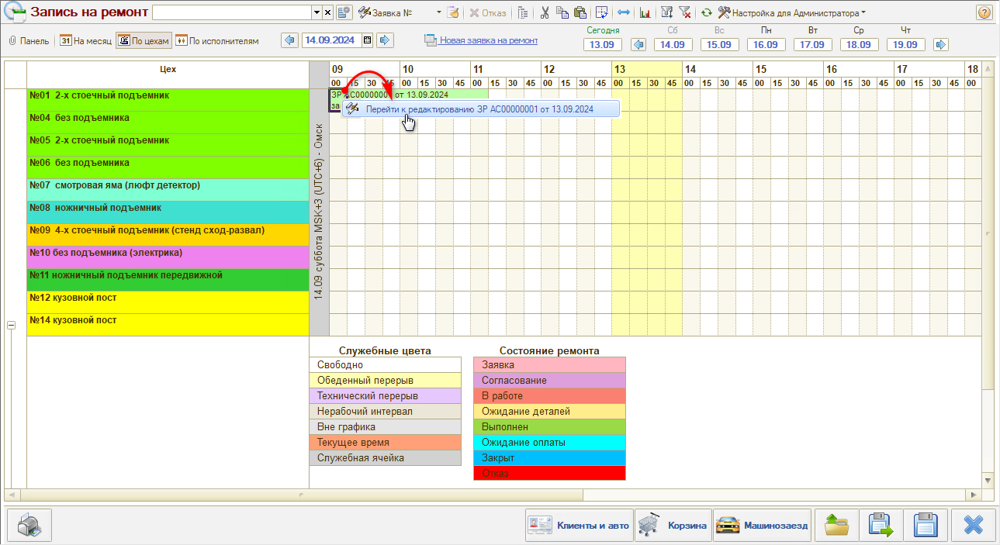
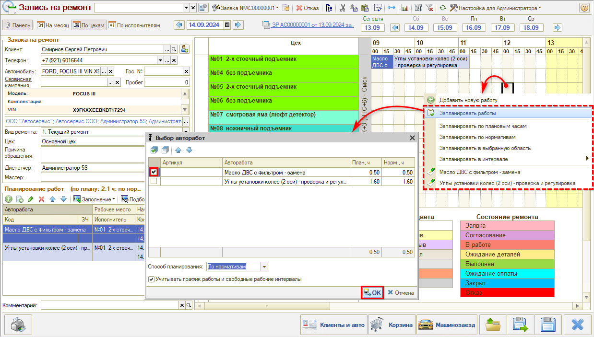
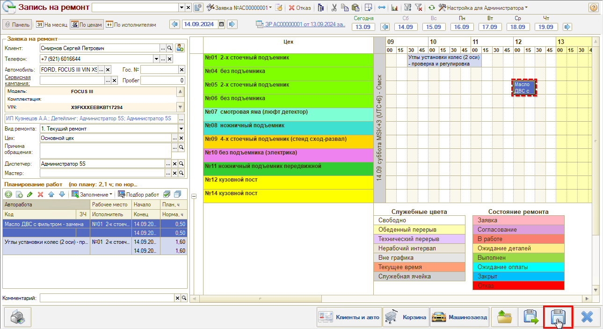

# Как редактировать запись на ремонт

<table><tr><td><b>Время чтения:</b> 3 мин.</td><td><b>Обновлено:</b> 01.09.2026</td></tr></table>

Источник: https://www.5systems.ru/help/kak-redaktirovat-zapis-na-remont

Время просмотра — 1:04 мин.

Для того, чтобы перепланировать работы или полностью перенести заявку на другой день, требуется найти нужную запись в планировщике, кликнуть по ней правой клавишей мыши и нажать кнопку **«Перейти к редактированию»**:

Далее следует выбрать в планировщике новое время, а также другой пост при необходимости и выбрать работы, которые необходимо перенести:

После перенесения работ необходимо сохранить изменения в заявке нажатием кнопки **«Сохранить»**:

---

**Теги:** запись на ремонт, редактирование, перенос записи, планировщик

