

# Календарь для планирования работ

<table><tr><td><b>Время чтения:</b> 9 мин.</td><td><b>Обновлено:</b> 01.09.2026</td></tr></table>

Источник: https://www.5systems.ru/help/kalendar-dlya-planirovaniya-rabot

## Содержание

- [Интерфейс планировщика](#интерфейс-планировщика)
- [Настраиваемые параметры календаря](#настраиваемые-параметры-календаря)
- [Видеоинструкции по работе с АРМ «Запись на ремонт»](#видеоинструкции-по-работе-с-арм-запись-на-ремонт)

*Также см. статьи «[Начальные настройки для работы в АРМ «Запись на ремонт»»](../Начальные%20настройки%20для%20работы%20в%20АРМ%20Запись%20на%20ремонт/nachalnye-nastroyki-dlya-raboty-v-arm-zapis-na-remont.md), [Планирование работ и подготовка к заезду](../Планирование%20работ%20и%20подготовка%20к%20заезду/planirovanie-rabot-i-podgotovka-k-zaezdu.md) и [Цветовое оформление планировщика](../Цветовое%20оформление%20планировщика/cvetovoe-oformlenie-planirovschika.md).*

## Интерфейс планировщика

При переходе в **АРМ «Запись на ремонт»** открывается *календарь для планирования работ* на текущий месяц:

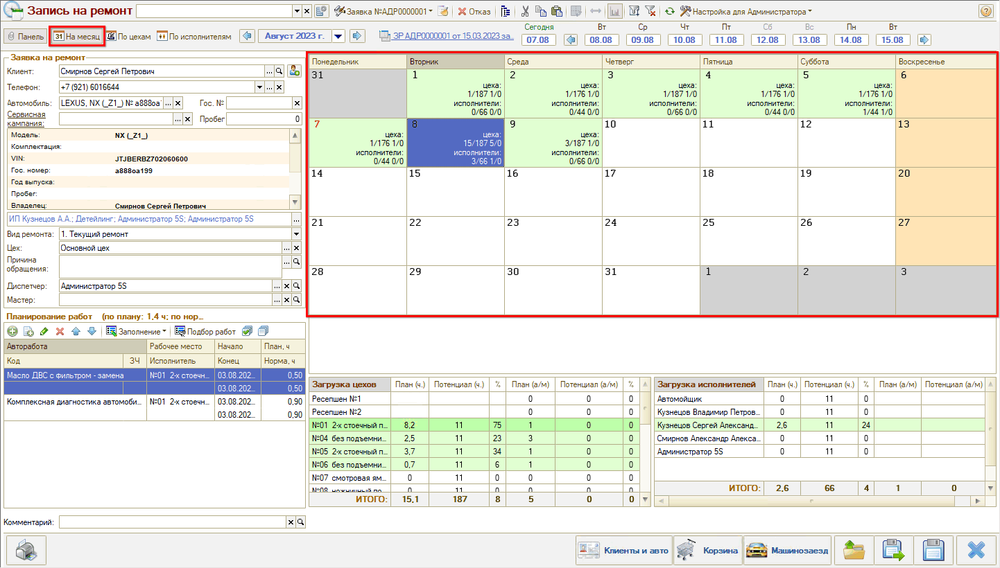

Дни в календаре выделены различным цветом: доступные для записи дни выделены *белым* — рабочие дни, где нет еще ни одной записи на ремонт, и *зеленым* — дни, где есть минимум одна запись. Оранжевым цветов выделены выходные дни. Подробную расшифровку цветового оформления календаря см. в статье «[Цветовое оформление планировщика](../Цветовое%20оформление%20планировщика/cvetovoe-oformlenie-planirovschika.md#цвета-календаря-в-режиме-на-месяц)».

Выходные и рабочие дни определяются по графику работ, заданному в параметре настройки календаря «Использование графиков» (см. [ниже](#настраиваемые-параметры-календаря)).

Внизу АРМ расположены таблицы с показателями загруженности цехов и исполнителей. Степень загрузки обозначается оттенками зеленого цвета от светлого к темному. Загруженность определяется по параметру настройки календаря «Критерий оценки загруженности» (см. [ниже](#настраиваемые-параметры-календаря)).

Для перехода к планированию на день необходимо дважды кликнуть на день в календаре. В результате откроется календарь в разбивке по цехам или исполнителям, в зависимости от настройки календаря (см. [ниже](#настраиваемые-параметры-календаря)):

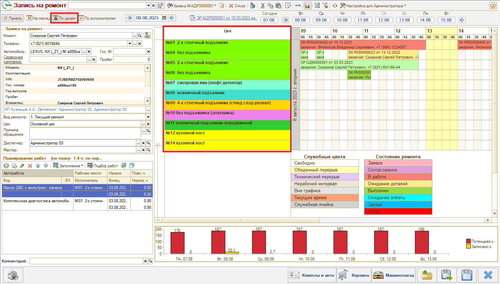

Режим планирования на день можно в любой момент переключить на командной панели:

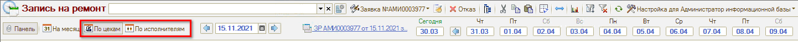

Также можно переключить ориентацию календаря по горизонтали/по вертикали:

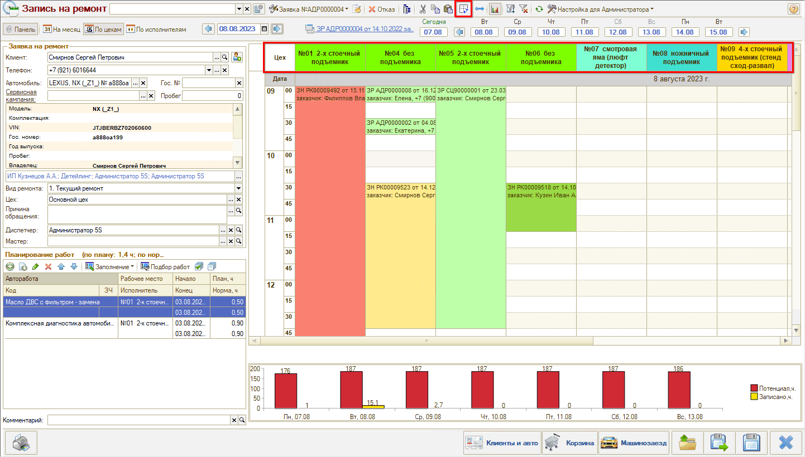

Помимо этого можно перейти в окно настройки параметров календаря и настроить сразу все нужные параметры — см. [ниже](#настраиваемые-параметры-календаря).

Для перехода к другому дню для планирования есть два варианта:

Вернуться к режиму календаря «На месяц» и выбрать нужный день:

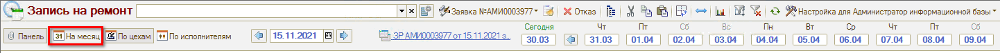

Выбрать день через поле выбора даты:

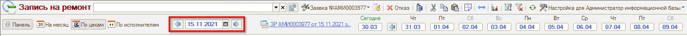

## Настраиваемые параметры календаря

Для перехода в окно настройки параметров следует нажать кнопку выбора варианта настроек → «Изменить настройку»:

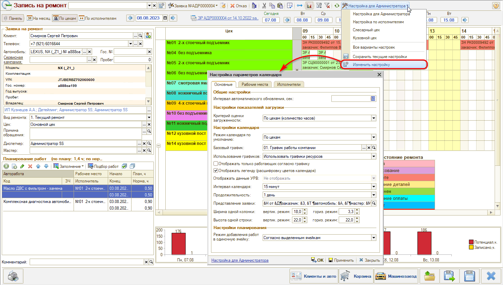

**Вкладка «Общие параметры»**

| Параметр | Описание | Значения |
| --- | --- | --- |
| Интервал автоматического обновления, сек | Интервал, с которым обновляются данные на графике. | По умолчанию 60 сек. |
| Критерий оценки загруженности | Критерий, по которому определяется степень загруженности цехов и исполнителей в таблицах под календарем в режиме «На месяц», чтобы подсветить их зеленым цветом разных оттенков (см. скриншот [выше](#интерфейс-планировщика)): 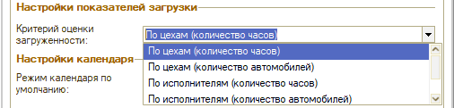 | ●  По цехам (количество часов) ●  По цехам (количество автомобилей) ●  По исполнителям (количество часов) ●  По исполнителям (количество автомобилей) |
| Режим календаря по умолчанию | Режим, который отображается по умолчанию: 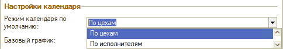 | ●  По цехам ●  По исполнителям |
| Базовый график | [График](../Начальные%20настройки%20для%20работы%20в%20АРМ%20Запись%20на%20ремонт/nachalnye-nastroyki-dlya-raboty-v-arm-zapis-na-remont.md#особенности-настройки-справочника-графики-работ) для календаря планирования работ в режиме «На день»: 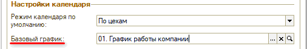 | Выбор из справочника «[Графики работы](../Начальные%20настройки%20для%20работы%20в%20АРМ%20Запись%20на%20ремонт/nachalnye-nastroyki-dlya-raboty-v-arm-zapis-na-remont.md#особенности-настройки-справочника-графики-работ)» |
| Использование графиков | Выходные и рабочие дни в календаре в режиме «На месяц» (см. скриншот [выше](#интерфейс-планировщика)) определяются согласно [графику](../Начальные%20настройки%20для%20работы%20в%20АРМ%20Запись%20на%20ремонт/nachalnye-nastroyki-dlya-raboty-v-arm-zapis-na-remont.md#особенности-настройки-справочника-графики-работ) работ, который задан в настройке данного параметра: 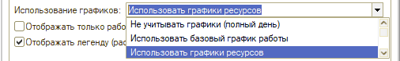 | ●  Не учитывать графики (полный день); ●  Использовать базовый график работы; ●  Использовать графики ресурсов. |
| Отображать только работающих согласно графику | При установке в календаре не выводятся сотрудники, которые не работают в выбранный день. | ●  Да ●  Нет |
| Отображать легенду (расшифровку цветов календаря) | Выводить внизу календаря в режиме «На день» легенду с расшифровкой цветов состояний заказ-нарядов и видов отметок времени: 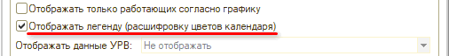 См. в статье «[Цветовое оформление планировщика](../Цветовое%20оформление%20планировщика/cvetovoe-oformlenie-planirovschika.md#цвета-календаря-в-режиме-на-день)». | ●  Да ●  Нет |
| Отображать данные УРВ | Отображать или нет данные УРВ (работа, перерывы, опоздания). | |
| Интервал календаря | Интервал планирования в календаре: 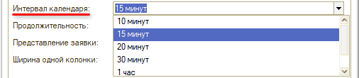 | ●  10 минут ●  15 минут ●  20 минут ●  30 минут ●  1 час |
| Продолжительность | Можно выводить на графике сразу 2 дня, например, чтобы планировать ночные смены: 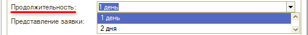 | ●  1 день ●  2 дня |
| Представление заявки | Формат отображения данных из заявки на ремонт в календаре при наведении мышью на ячейку с работой: 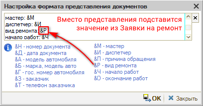 | |
| Ширина одной колонки | Настройка размеров ширины ячеек в горизонтальном и вертикальном режиме календаря: 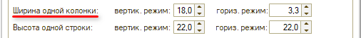 | От 10.0 до 50.0 в вертикальном режиме. От 3.0 до 10.0 в горизонтальном режиме. |
| Высота одной строки | Настройка размеров высоты ячеек в горизонтальном режиме календаря: 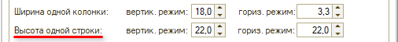 Можно настроить так, что представление заявки на ремонт будет влезать в ячейку полностью. | От 10.0 до 50.0 в вертикальном режиме. От 3.0 до 10.0 в горизонтальном режиме. |
| Режим добавления работ в одиночную ячейку | Продолжительность работ при добавлении работ на график определяется нормативом или выделенной областью: 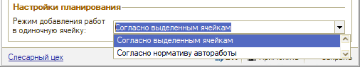 | ●  Согласно выделенным ячейкам ●  Согласно нормативу автоработы |

**Вкладка «Рабочие места»**

Добавление и настройка рабочих мест, которые должны отображаться в календаре:

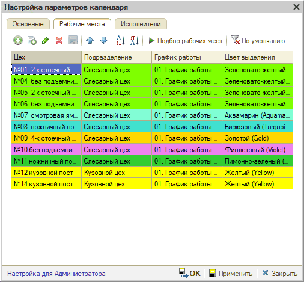

Есть возможность задать цветовое оформление для цехов — см. в статье «[Цветовое оформление планировщика](../Цветовое%20оформление%20планировщика/cvetovoe-oformlenie-planirovschika.md#3-цеха)».

**Вкладка «Исполнители»**

Настройка исполнителей, которые должны отображаться в календаре.

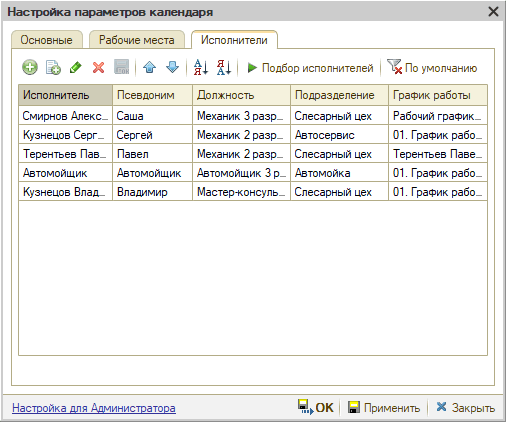

Если после применения настроек отображение календаря не изменилось, нажмите кнопку **«Обновить календарь»** командного меню АРМ «Запись на ремонт».

Новые настройки следует **сохранить** — для этого нужно в меню выбора вариантов настроек нажать кнопку «Сохранить текущие настройки → Создать новый». Можно создать несколько различных вариантов настроек, например, в зависимости от подразделения или должности пользователя. Затем все сохраненные варианты будут доступны для выбора по кнопке на верхней панели. *Подробнее см. статью [Сохранение настроек АРМ «Запись на ремонт»](../Сохранение%20настроек%20АРМ%20Запись%20на%20ремонт/sokhranenie-nastroek-arm-zapis-na-remont.md).*

## Видеоинструкции по работе с АРМ «Запись на ремонт»

**1. [Назначение и интерфейс АРМ Запись на ремонт](../Назначение%20и%20интерфейс%20АРМ%20Запись%20на%20ремонт/naznachenie-i-interfeys-arm-zapis-na-remont.md):**

**2. [Как записать клиента из Корзины](../Как%20записать%20клиента%20из%20Корзины/kak-zapisat-klienta-iz-korziny.md):**

**3. [Как записать клиента из Заказ наряда](../Как%20записать%20клиента%20из%20Заказ%20наряда/kak-zapisat-klienta-iz-zakaz-naryada.md):**

**4. [Как подобрать автоработы из АРМ Запись на ремонт](../Как%20подобрать%20автоработы%20из%20АРМ%20Запись%20на%20ремонт/kak-podobrat-avtoraboty-iz-arm-zapis-na-remont.md):**

**5. [Как редактировать запись на ремонт](../Как%20редактировать%20запись%20на%20ремонт/kak-redaktirovat-zapis-na-remont.md):**

**6. [Настройки АРМ Запись на ремонт](../Настройки%20АРМ%20Запись%20на%20ремонт/nastroyki-arm-zapis-na-remont.md):**

---

**Теги:** запись на ремонт, календарь, планировщик, настройки календаря, интерфейс планировщика

