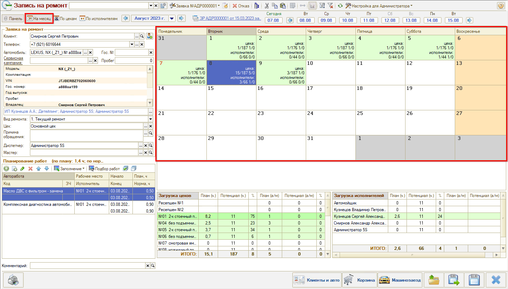
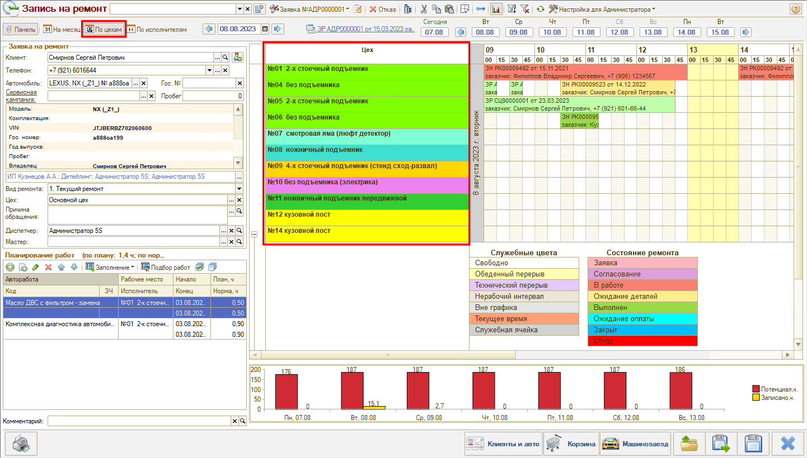
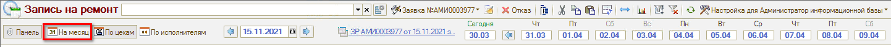
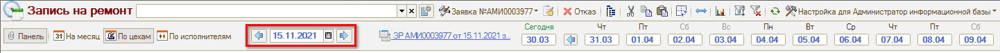
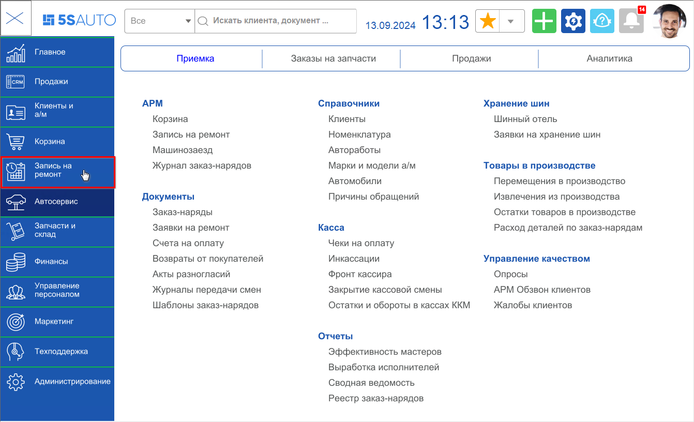
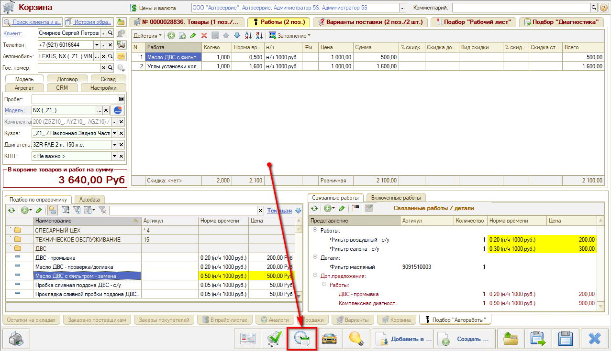

# Назначение и интерфейс АРМ Запись на ремонт

<table><tr><td><b>Время чтения:</b> 4 мин.</td><td><b>Обновлено:</b> 31.08.2026</td></tr></table>

Источник: https://www.5systems.ru/help/obzor-interfeysa-arm-zapis-na-remont

Время просмотра — 1:58 мин.

**Назначение и интерфейс АРМ «Запись на ремонт»**

АРМ «Запись на ремонт» представляет собой календарь для планирования работ. Используется, чтобы определить свободное время для записи и записать клиента на определенное время и пост.

При переходе в АРМ «Запись на ремонт» открывается планировщик на текущий месяц:

На левой панели отображается информация о клиенте и автомобиле, параметры Заявки на ремонт и планируемые работы.

Дни в планировщике выделены различным цветом:

- Серый цвет — дни, относящиеся к другому месяцу, недоступны для планирования.
- Оранжевый цвет — выходные дни.
- Белый цвет — рабочие дни, где нет еще ни одной записи на ремонт.
- Зеленый цвет — дни, где есть минимум одна запись на ремонт.

Кликнув на дату, можно увидеть загрузку цехов и исполнителей в таблицах под календарем.

Для перехода к планированию на день необходимо дважды кликнуть на день в календаре. В результате откроется календарь в разбивке по цехам или по исполнителям — в зависимости от настройки календаря:

Режим планирования на день можно в любой момент переключить на командной панели:

Также можно переключить ориентацию календаря по горизонтали/по вертикали. Помимо этого можно перейти в окно настройки параметров календаря и настроить сразу все нужные параметры.

Для перехода к другому дню для планирования есть два варианта:

**1.** Вернуться к режиму календаря «На месяц» и выбрать нужный день:

**2.** Выбрать день через поле выбора даты:

**Способы перехода в АРМ «Запись на ремонт»**

**1.** Через главное меню — в случае, если нужно посмотреть запись:

**2.** Через другие АРМ и документы — чтобы записать клиента. Например, через Корзину:

При переходе в Запись на ремонт из других АРМ все параметры из них будут автоматически подтягиваться в заявку.

---

**Теги:** Запись на ремонт, назначение, интерфейс, планировщик, календарь

