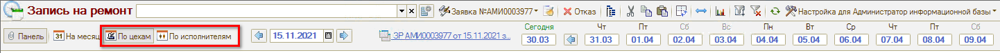
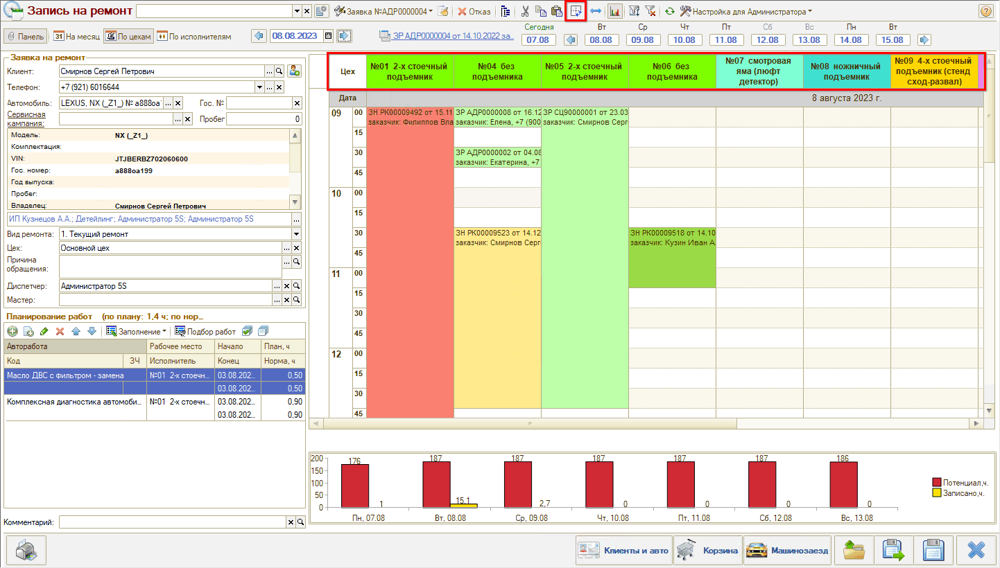
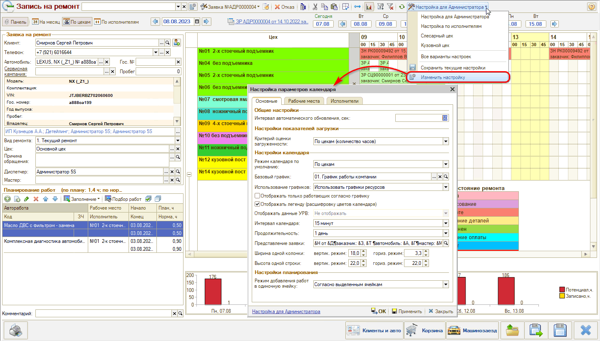
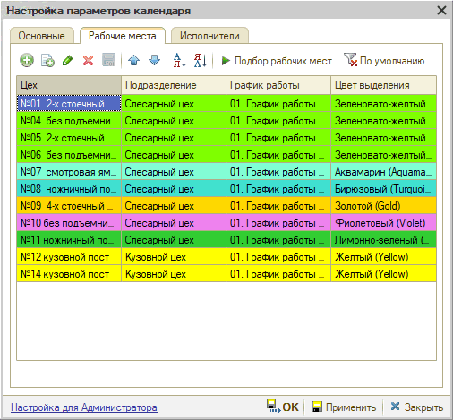

# Настройки АРМ Запись на ремонт

<table><tr><td><b>Время чтения:</b> 3 мин.</td><td><b>Обновлено:</b> 01.09.2026</td></tr></table>

Источник: https://www.5systems.ru/help/nastroyki-arm-zapis-na-remont

Время просмотра — 1:55 мин.

Для изменения отображения АРМ «Запись на ремонт» используются кнопки на командной панели и специальное окно настроек.

Режим планирования на месяц / на день и «По цехам» / «По исполнителям» можно в любой момент переключить на командной панели:

Также можно переключить ориентацию календаря по горизонтали/по вертикали:

Для перехода в окно настроек следует нажать кнопку выбора варианта настроек → «Изменить настройку»:

Можно установить параметры:

1. Режим календаря по умолчанию — «По цехам» или «По исполнителям».
2. Изменить интервал календаря — 15 мин., 20 мин., 30 мин. и др.
3. На соответствующих вкладках настроить рабочие места и исполнителей, которые должны отображаться в календаре. Набор постов для планирования задается под каждого пользователя — используется кнопка **«Подбор рабочих мест»**, лишние посты можно удалить:

4. Для вида календаря «На месяц» можно в параметре «Использование графиков» выбрать график работ, согласно которому будет задано отображение выходных и рабочих дней в календаре.

Если после применения настроек отображение календаря не изменилось, нажмите кнопку **«Обновить календарь»** командного меню АРМ «Запись на ремонт».

Новые настройки следует **сохранить** — для этого нужно в меню выбора вариантов настроек нажать кнопку «Сохранить текущие настройки → Создать новый». Можно создать несколько различных вариантов настроек, например, в зависимости от подразделения или должности пользователя. Затем все сохраненные варианты будут доступны для выбора по кнопке на верхней панели. *Подробнее см. статью «[Сохранение настроек АРМ «Запись на ремонт»»](../Сохранение%20настроек%20АРМ%20Запись%20на%20ремонт/sokhranenie-nastroek-arm-zapis-na-remont.md).*

---

**Теги:** запись на ремонт, настройки, планировщик, рабочие места, календарь

