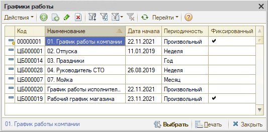
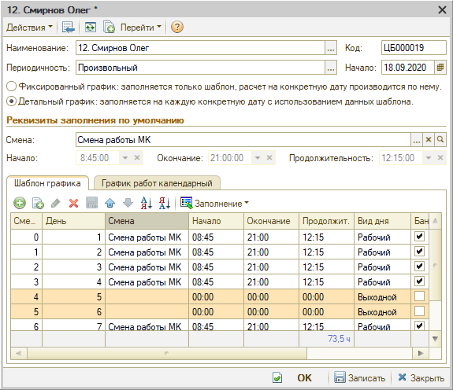
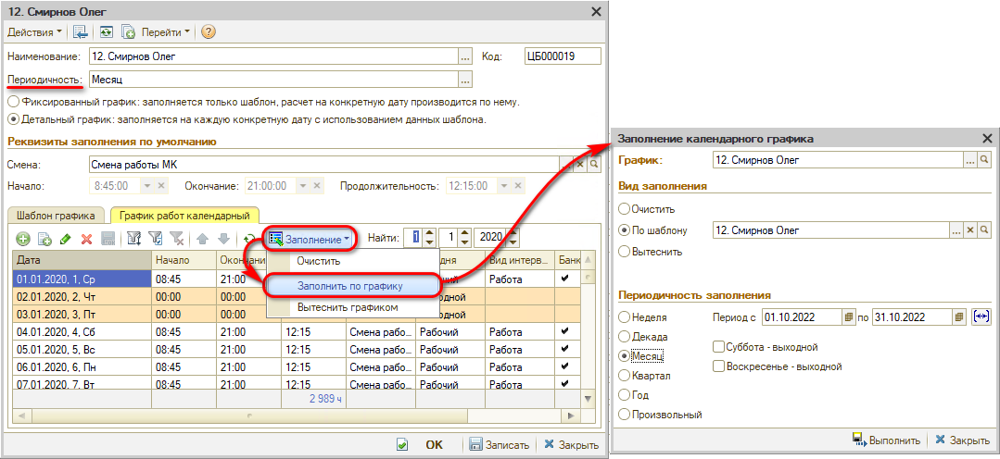
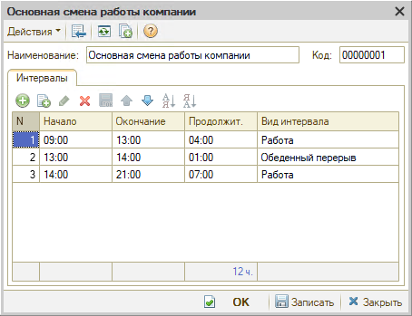
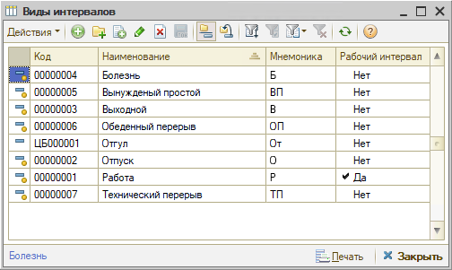
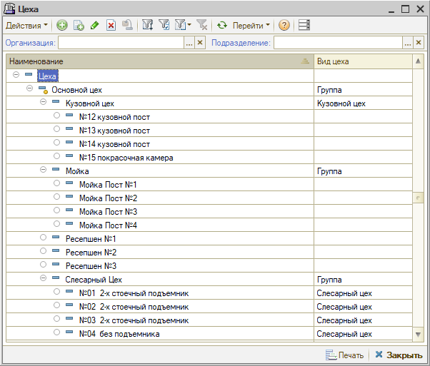
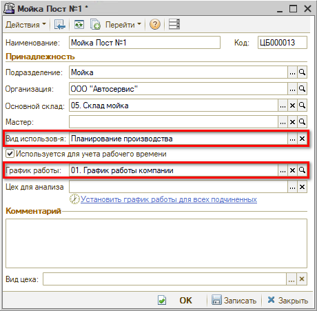
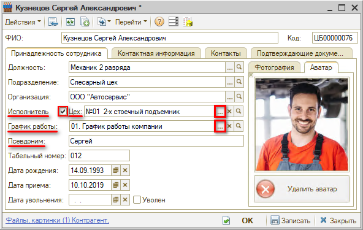
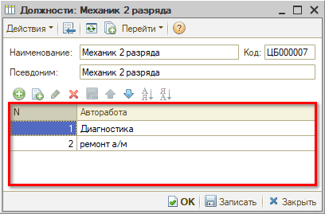
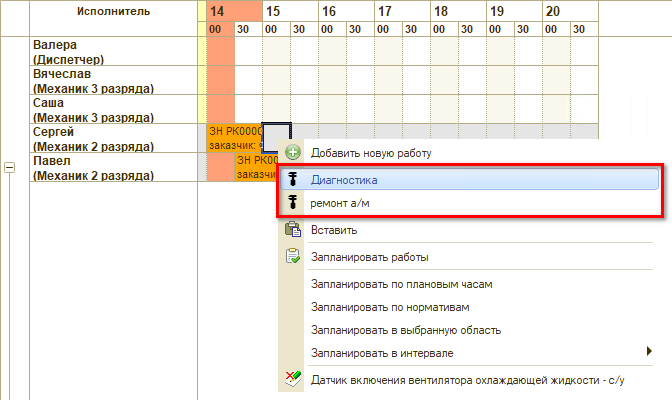

# Начальные настройки для работы в АРМ «Запись на ремонт»

<table><tr><td><b>Время чтения:</b> 7 мин.</td><td><b>Обновлено:</b> 17.06.2022</td></tr></table>

Источник: https://www.5systems.ru/help/nachalnye-nastroyki-dlya-raboty-v-arm-zapis-na-remont

## Содержание

- [Введение](#введение)
- Особенности настройки справочников:
  - ["Графики работ"](#особенности-настройки-справочника-графики-работ)
  - ["Смены" и "Виды интервалов"](#особенности-настройки-справочников-смены-и-виды-интервалов)
  - ["Цеха"](#особенности-настройки-справочника-цеха)
  - ["Сотрудники"](#особенности-настройки-справочника-сотрудники)
  - ["Должности"](#особенности-настройки-справочника-должности)

## Введение

Для [планирования работ](../Календарь%20для%20планирования%20работ/kalendar-dlya-planirovaniya-rabot.md) через АРМ «Запись на ремонт» должны быть заполнены справочники:

- Графики работ — если используется детальный график по дням, то он должен быть заполнен.
- Смены и Виды интервалов — используются для задания графика работы.
- Цеха — если планирование будет вестись по цехам (рабочим местам автосервиса).
- Сотрудники — если планирование будет вестись по исполнителям.
- Должности — определение должности сотрудника.

## Особенности настройки справочника «Графики работ»

Графики работы можно использовать общие для ряда сотрудников или создавать для каждого индивидуальный.

Требуется задать наименование графика, выбрать периодичность (рекомендуется «Произвольный»). Установить «Детальный график», — это нужно для синхронизации с [Табелем](https://5systems.ru/help/tabel-ucheta-rabochego-vremeni), — выбрать смену и задать непосредственно график работы.

Шаблон графика при выборе периодичности «Произвольный» заполняется вручную, при выборе определенной периодичности можно произвести автозаполнение по смене. Вкладка «Календарный график работ» становится активна при установке флажка «Детальный график». Календарный график работ можно заполнить/очистить при помощи кнопки «Заполнение».

*Ряд примеров настройки графиков приведен в уроке «[Как настроить график работы цеха](https://www.5systems.ru/help/kak-nastroit-grafik-raboty-cekha)».*

## Особенности настройки справочников «Смены» и «Виды интервалов»

Требуется задать наименование Смены и интервалы работы.

Рекомендуется задавать интервалы: «Работа» с начала рабочего дня до начала обеденного перерыва, интервал «Обеденный перерыв» и «Работа» с конца обеденного перерыва до конца рабочего дня.

Виды интервала выбираются из соответствующего справочника:

## Особенности настройки справочника «Цеха»

В справочнике «Цеха» (меню программы: Справочники → Структура компании → Цеха) задаются все рабочие места автосервиса в виде иерархической структуры:

У рабочего места, по которому будет происходить планирование работ, необходимо установить параметр «Вид использования» = «Планирование производства» и задать график работ:

Если для цеха планирование не предусмотрено (например, цех имеет дочерние рабочие места, которые участвуют в планировании), то для него необходимо установить вид использования «Не участвует в планировании».

## Особенности настройки справочника «Сотрудники»

Для того, чтобы вести планирование по сотрудникам, у сотрудника должен быть установлен флажок «Исполнитель», задан цех и график работ. Также можно указать значение в поле «Псевдоним», тогда вместо Ф.И.О. в календаре записи на ремонт будет отображаться указанный псевдоним.

## Особенности настройки справочника «Должности»

У должности исполнителя можно настроить регулярно выполняемые им работы:

Это позволяет быстро добавлять данные работы при записи по исполнителю:

---

**Теги:** запись на ремонт, начальные настройки, графики работ, смены, виды интервалов, цеха, сотрудники, должности

