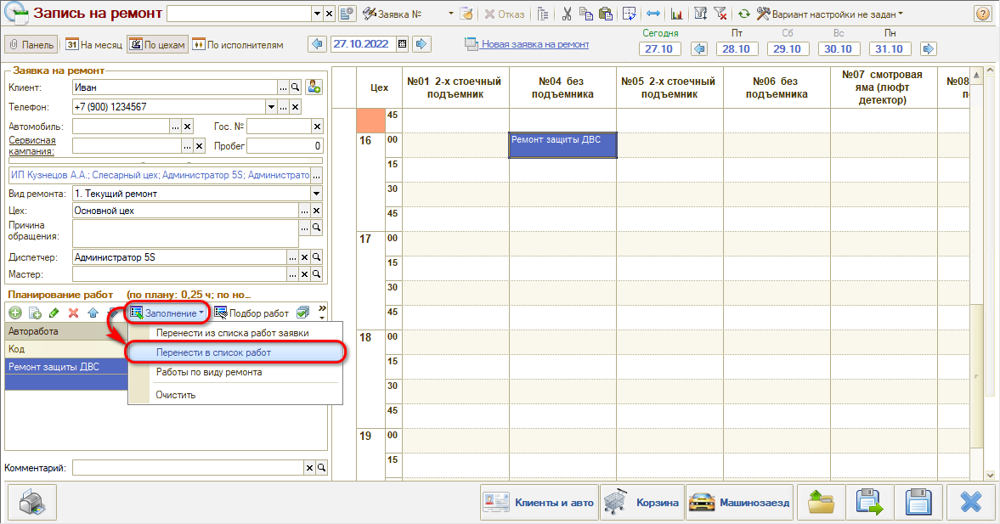
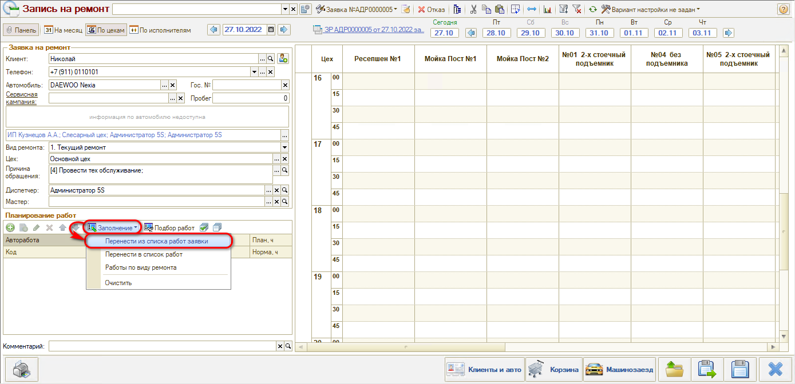

# Планирование работ и подготовка к заезду

<table><tr><td><b>Время чтения:</b> 5 мин.</td><td><b>Обновлено:</b> 21.06.2022</td></tr></table>

Источник: https://www.5systems.ru/help/planirovanie-rabot-i-podgotovka-k-zaezdu

## Взаимосвязь планирования и калькуляции работ

В **АРМ Запись на ремонт** идет работа с документом «Заявка на ремонт». На форме документа «Заявка на ремонт» есть две вкладки для наполнения работ:

1. *Работы* — автоработы, которые продаются клиенту.
2. *Планирование* — автоработы, которые планируются и используются для быстрой записи на ремонт.

Деление работ по вкладкам происходит в зависимости от параметра автоработы «Вид использования»:

- *Планирование* — используется только для планирования (вкладка «Планирование» заявки на ремонт). Например, для обобщения нескольких мелких работ с целью быстрой записи клиента на ремонт.
- *Производство* — используется только для калькуляции работ (вкладка «Работы» заявки на ремонт) и не используется в АРМ «Запись на ремонт».
- *Планирование и производство* — используется везде: для калькуляции, при планировании и предварительной записи на ремонт.

Если работа используется и для калькуляции и для планирования, то есть возможность:

1. сначала запланировать работы через календарь, а затем заполнить вкладку «Работы» заявки на ремонт с помощью кнопки «Заполнение» → «Перенести в список работ»:

2. сначала сделать калькуляцию работ, в ходе которой заполняется вкладка «Работы» заявки на ремонт, а затем заполнить планируемые работы и распределить их в календаре с помощью кнопки «Заполнение» → «Перенести из списка работ заявки»:

## Подготовка к заезду

Если в ходе записи на ремонт выясняется, что для выполнения планируемой работы необходимо подобрать запчасти, то можно сделать отметку о том, что требуются запчасти для работы. В результате будет создана задача «Подобрать запчасти» для подготовки к заезду.

Отследить готовность принять автомобиль клиента можно по состоянию Заявки на ремонт:

- *Подготовить запчасти* — не готовы принять автомобиль, так как создана и не выполнена задача на подбор запчастей.
- *Ожидание заезда* — готовы принять автомобиль.

Реализация такой возможности описана в статье [Задача на подбор запчастей](../../Склад%20и%20запчасти/Задача%20на%20подбор%20запчастей/zadacha-na-podbor-zapchastey.md).

---

**Теги:** запись на ремонт, планирование работ, калькуляция, заявка на ремонт, подготовка к заезду

