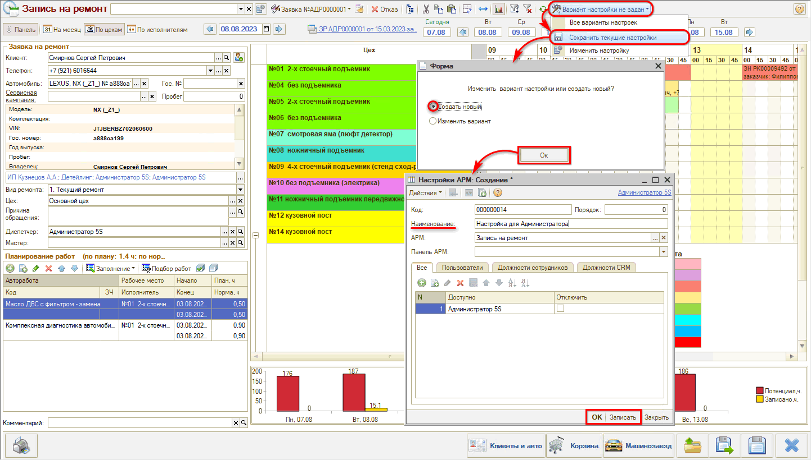
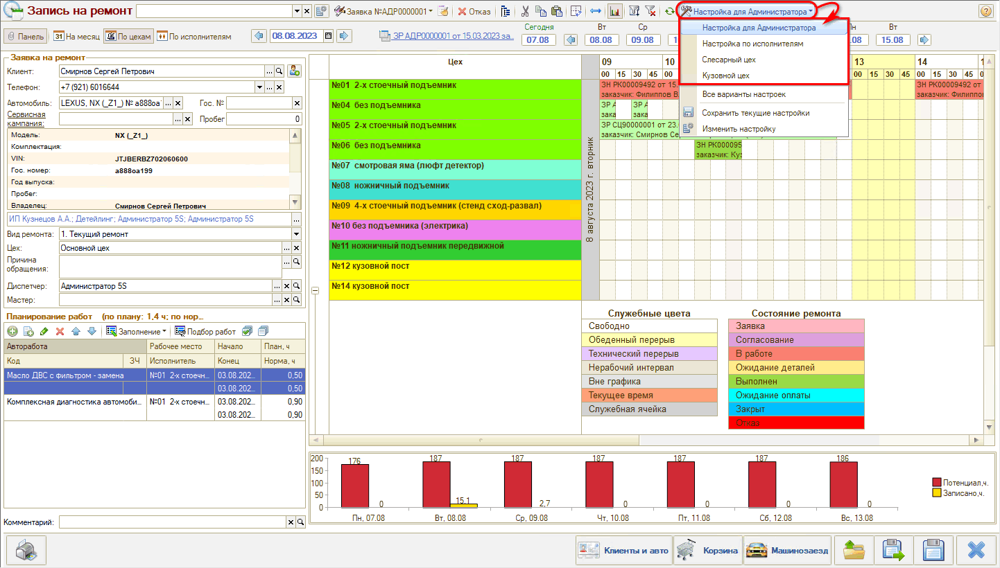
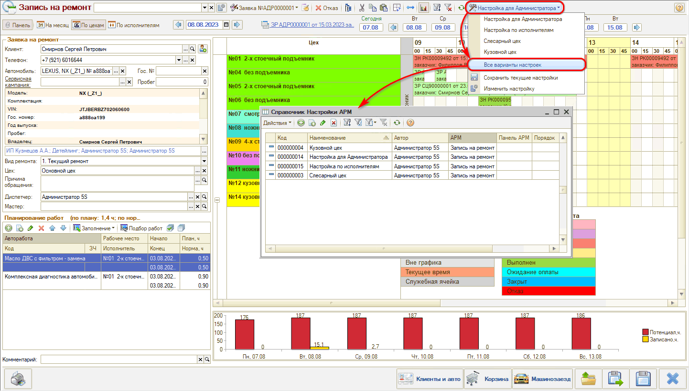
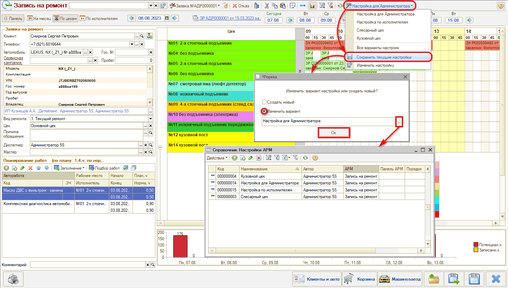

# Сохранение настроек АРМ «Запись на ремонт»

<table><tr><td><b>Время чтения:</b> 5 мин.</td><td><b>Обновлено:</b> 01.09.2026</td></tr></table>

Источник: https://www.5systems.ru/help/sokhranenie-nastroek-arm-zapis-na-remont

## Содержание

- [Сохранение настройки](#сохранение-настройки)
- [Выбор варианта настройки](#выбор-варианта-настройки)
- [Справочник Настройки АРМ](#справочник-настройки-арм)
- [Изменение настроек](#изменение-настроек)

## Сохранение настройки

Настройка календаря планирования работ в АРМ Запись на ремонт описана в статье «[Календарь для планирования работ](../Календарь%20для%20планирования%20работ/kalendar-dlya-planirovaniya-rabot.md)».

После того, как установлены все нужные параметры настроек календаря планирования работ, их следует записать как новый вариант настройки. Для этого нужно в меню выбора вариантов настроек нажать кнопку *«Сохранить текущие настройки»* и выбрать вариант *«Создать новый»:*

В открывшемся окне создания новой настройки АРМ следует задать новое наименование настройки, также можно настроить доступность данной настройки для определенных пользователей или по должностям сотрудников, и *сохранить* нажатием на кнопку «Записать» или «ОК».

## Выбор варианта настройки

Можно создать несколько различных вариантов настроек, например, в зависимости от подразделения, от должности пользователя, а также каждый пользователь может сохранить удобный для себя вариант отображения АРМ. Затем все сохраненные варианты настроек будут доступны для выбора по кнопке на верхней панели:

## Справочник Настройки АРМ

Также все сохраненные варианты настроек собраны в справочнике «Настройки АРМ»:

Через данный справочник можно внести изменения в наименование и доступы настройки, а также можно пометить на удаление ненужную настройку.

## Изменение настроек

В случае необходимости внести изменения в текущий вариант настроек можно сохранить их как новый вариант (см. [выше](#сохранение-настройки)), либо при сохранении выбрать «Изменить вариант», указать настройку, которую следует изменить, и нажать «ОК»:

Каждый пользователь может вносить изменения в те варианты настроек, автором которых он является, то есть, в сохраненные им самим варианты. Но редактировать *любые* варианты настроек могут только пользователи со включенным **правом** *«Разрешить редактировать все варианты настроек АРМ Запись на ремонт»*.

---

**Теги:** запись на ремонт, настройки, сохранение настроек, вариант настройки, справочник

