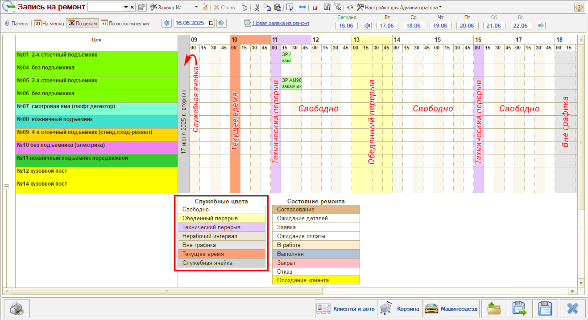
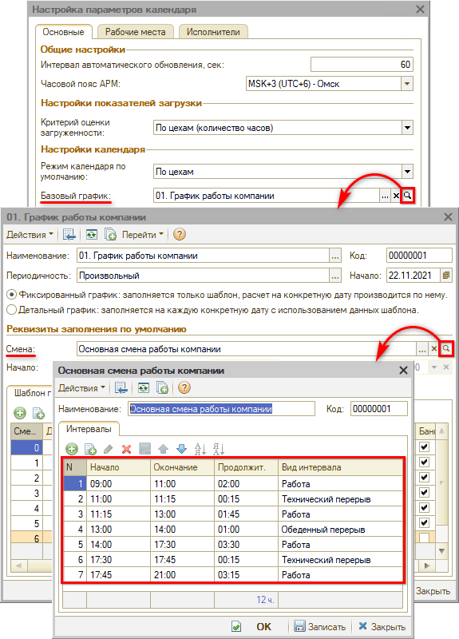
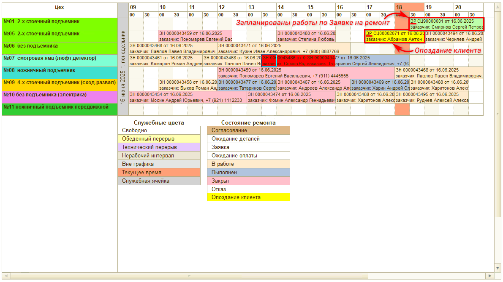
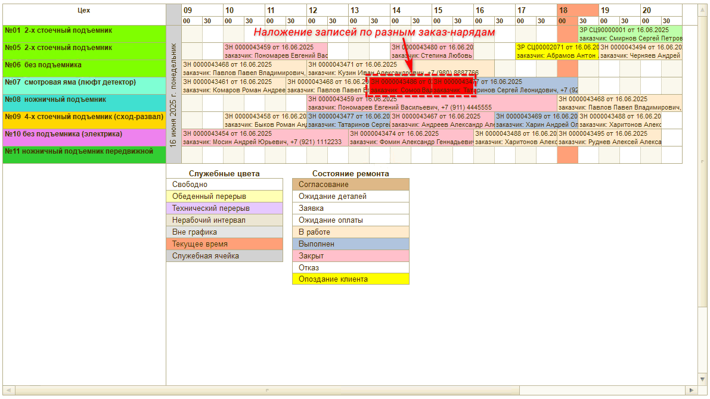
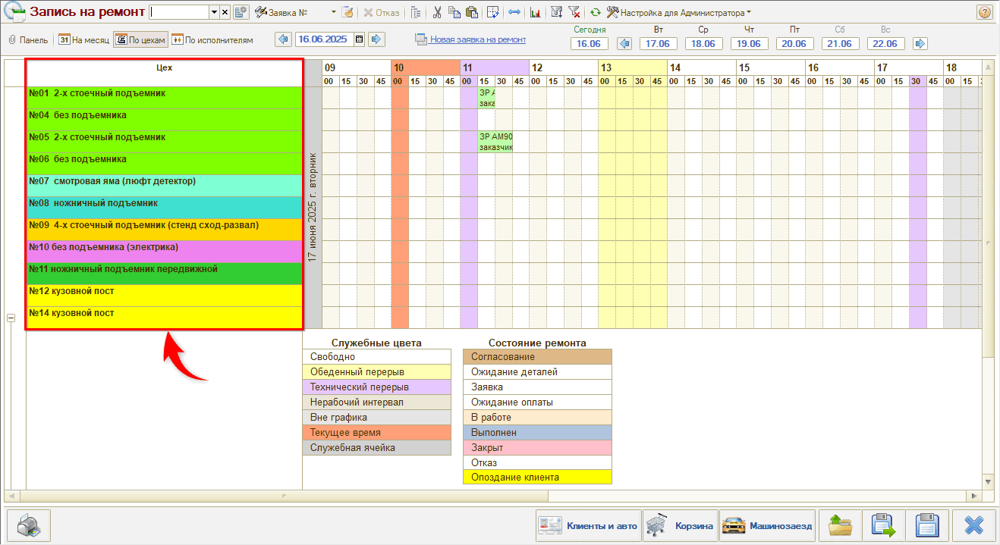
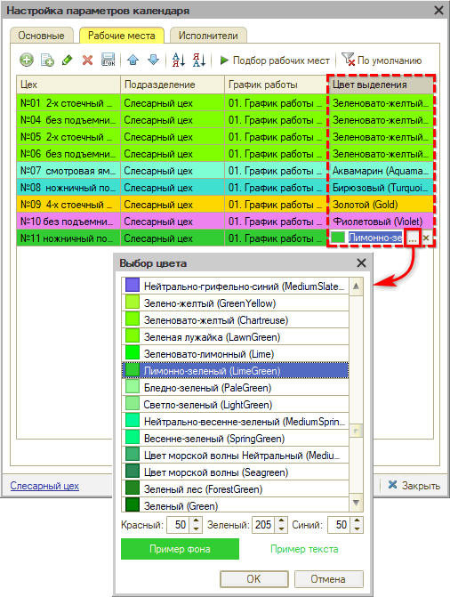

# Цветовое оформление планировщика

<table><tr><td><b>Время чтения:</b> 6 мин.</td><td><b>Обновлено:</b> 01.09.2026</td></tr></table>

Источник: https://www.5systems.ru/help/cvetovoe-oformlenie-planirovschika

## Содержание

- [Введение](#введение)
- [Цвета календаря в режиме на месяц](#цвета-календаря-в-режиме-на-месяц)
- [Цвета календаря в режиме на день](#цвета-календаря-в-режиме-на-день)
  - [1. Интервалы времени](#1-интервалы-времени)
  - [2. Запланированные работы](#2-запланированные-работы)
    - [Заказ-наряды](#1-заказ-наряды)
    - [Заявки на ремонт](#2-заявки-на-ремонт)
    - [Пересечение записей](#3-пересечение-записей)
  - [3. Цеха](#3-цеха)

## Введение

Для удобства работы с АРМ «Запись на ремонт» предусмотрено *цветовое оформление календаря* и записей в нем. Цвета выделения цехов и записей можно настроить по своему усмотрению. Некоторые системные цвета выделения недоступны для настройки — в статье рассмотрена их расшифровка.

Также см. статьи «[Календарь для планирования работ](../Календарь%20для%20планирования%20работ/kalendar-dlya-planirovaniya-rabot.md)» и «[Начальные настройки для работы в АРМ «Запись на ремонт»»](../Начальные%20настройки%20для%20работы%20в%20АРМ%20Запись%20на%20ремонт/nachalnye-nastroyki-dlya-raboty-v-arm-zapis-na-remont.md).

## Цвета календаря в режиме на месяц

При переходе в **АРМ «Запись на ремонт»** открывается *календарь для планирования работ* на текущий месяц. Дни выделены различным цветом:

- *Серый цвет* — дни, относящиеся к другому месяцу, недоступны для планирования в рамках данного месяца.
- *Оранжевый цвет* — выходные дни*.
- *Белый цвет* — рабочие дни*, где нет еще ни одной записи на ремонт.
- *Зеленый цвет* — дни, где есть минимум одна запись на ремонт.

Пример отображения *календаря для планирования работ:*

\*Выходные и рабочие дни в календаре определяются по *графику работ,* который задан в параметре настройки календаря «Использование графиков» (см. в статье «[Календарь для планирования работ](../Календарь%20для%20планирования%20работ/kalendar-dlya-planirovaniya-rabot.md#настраиваемые-параметры-календаря)»).

Внизу расположены таблицы с показателями *загруженности* цехов и исполнителей. Степень загрузки обозначается оттенками зеленого цвета от светлого к темному. Загруженность определяется по параметру настройки календаря «Критерий оценки загруженности» (см. в статье «[Календарь для планирования работ](../Календарь%20для%20планирования%20работ/kalendar-dlya-planirovaniya-rabot.md#настраиваемые-параметры-календаря)»).

*Примечание:* Цветовое оформление дней и показателей загрузки недоступно для настройки, т.е. нет возможности выбрать другой цвет для их выделения.

## Цвета календаря в режиме на день

### 1. Интервалы времени

Ячейки в планировщике окрашиваются в служебные цвета системы согласно *видам интервалов времени,* заданным для текущей *смены\*.* Также подсвечивается *текущее время:*

Расшифровку цветов календаря можно увидеть в легенде под таблицей записи на ремонт (отображение легенды включается в настройках параметров календаря — см. в статье «[Календарь для планирования работ](../Календарь%20для%20планирования%20работ/kalendar-dlya-planirovaniya-rabot.md#настраиваемые-параметры-календаря)»).

\*Перейти к настройкам интервалов текущей смены можно через график работы, указанный в [Настройках параметров календаря](../Календарь%20для%20планирования%20работ/kalendar-dlya-planirovaniya-rabot.md#настраиваемые-параметры-календаря):

Описание особенностей настройки смен см. в статье «[Начальные настройки для работы в АРМ «Запись на ремонт»»](../Начальные%20настройки%20для%20работы%20в%20АРМ%20Запись%20на%20ремонт/nachalnye-nastroyki-dlya-raboty-v-arm-zapis-na-remont.md#особенности-настройки-справочников-смены-и-виды-интервалов).

*Примечание:* Цветовое оформление интервалов времени недоступно для настройки, т.е. нет возможности выбрать другой цвет для их выделения.

### 2. Запланированные работы

#### 1) Заказ-наряды

В случае если на основании заявки на ремонт, отраженной в планировщике, *создан Заказ-наряд,* цвета ячеек запланированных работ соответствуют *цвету* **состояния Заказ-наряда**. Цветовое оформление подтягивается из справочника *«Состояния заказ-нарядов»* — см. [статью](https://www.5systems.ru/help/sostoyaniya-zakaz-naryada):

Расшифровку цветов состояний ремонта можно увидеть также в легенде под таблицей (отображение легенды включается в настройках параметров календаря — см. в статье «[Календарь для планирования работ](../Календарь%20для%20планирования%20работ/kalendar-dlya-planirovaniya-rabot.md#настраиваемые-параметры-календаря)»).

#### 2) Заявки на ремонт

В случае если на основании данной заявки на ремонт заказ-наряд еще не введен, запланированная работа выделяется **светло-зеленым** системным цветом (без возможности изменения).

Если запланированное время работ наступило, а работы по данной заявке не начаты, то запись на ремонт будет выделена **желтым** цветом (по умолчанию). Цвет выделения в этом случае соответствует цвету состояния заказ-наряда «Опоздание клиента» из справочника *«Состояния заказ-нарядов»* (см. [выше](#1-заказ-наряды)):

#### 3) Пересечение записей

В случае если в календаре были запланированы работы по одному заказ-наряду (или заявке на ремонт), а выполнялись по другому, т.е. записи *наложились друг на друга,* то ячейки с запланированными работами *в месте пересечения* будут выделены **красным** системным цветом (без возможности изменения):

### 3. Цеха

Есть возможность настроить цветовое оформление для *цехов* в календаре:

Для этого следует перейти в *Настройки параметров календаря* на вкладку **«Рабочие места»** (см. в статье «[Календарь для планирования работ](../Календарь%20для%20планирования%20работ/kalendar-dlya-planirovaniya-rabot.md#настраиваемые-параметры-календаря)») и задать желаемые цвета выделения:

---

**Теги:** запись на ремонт, цветовое оформление, планировщик, календарь, заказ-наряд, цеха

