

# Интеграция с Audatex (AudaPad Web)

<table><tr><td><b>Время чтения:</b> 12 мин.</td><td><b>Обновлено:</b> 21.08.2026</td></tr></table>

## Содержание

- [Введение](#введение)
- [Место интеграции в процессе урегулирования убытков](#место-интеграции-в-процессе-урегулирования-убытков)
- [Что дает интеграция](#что-дает-интеграция)
- [Что потребуется](#что-потребуется)
- [Настройки](#настройки)
- [Регистр сведений «Обмен с Audatex»](#регистр-сведений-обмен-с-audatex)
- [Режимы обмена](#режимы-обмена)
- [Получение данных из AudaPad Web](#получение-данных-из-audapad-web)
  - [Создание дела и расчет калькуляции](#создание-дела-и-расчет-калькуляции)
  - [Загрузка калькуляции в заказ-наряд](#загрузка-калькуляции-в-заказ-наряд)
- [Передача данных в AudaPad Web](#передача-данных-в-audapad-web)
- [Лицензирование](#лицензирование)
- [Материалы для изучения](#материалы-для-изучения)

## Введение

Компания **«Аудатэкс»** — мировой лидер в области разработки программного обеспечения для расчета стоимости восстановительного ремонта транспортного средства.

**AudaPad Web** — комплексное интернет-решение «Аудатэкс» для организаций, участвующих в процессе урегулирования убытков при страховании транспортных средств. Оно позволяет быстро и точно выполнить описание повреждений автомобиля, составить расчет стоимости ремонта и обмениваться результатами расчетов с другими участниками.

5S AUTO работает на платформе **«Альфа-Авто, редакция 5»**, поэтому обмен с Audatex подключается дополнением **«Альфа-Авто: Интерфейс с Аудатэкс, редакция 5»** — совместной разработкой компаний «Аудатэкс» и «1С-Рарус».

Дополнение направлено на улучшение взаимодействия двух программ и на интеграцию расчетов с платформы Audatex с их загрузкой в заказ-наряды. За счет сокращения ручных действий оно повышает производительность работы и исключает дублирование информации.

Основной принцип работы: данные вводятся непосредственно в AudaPad Web, а затем загружаются в документ **«Заказ-наряд»**.

## Место интеграции в процессе урегулирования убытков

Интеграция рассчитана на автосервисы и станции кузовного ремонта, которые работают по направлениям страховых компаний и с частными клиентами. Порядок урегулирования зависит от того, куда клиент обратился первым.

**Схема 1. Клиент обратился в отдел урегулирования убытков СТО:** осмотр ТС, создание дела, калькуляция и документы → признание страхового случая и направление на СТО → дефектовка и корректировка калькуляции → анализ повреждений и повторная корректировка → ремонт, оформление и закрытие заказ-наряда, документы и счет для страховой → оплата счета → выдача автомобиля клиенту.

**Схема 2. Клиент обратился в страховую компанию:** осмотр ТС, создание дела и калькуляция выполняются на стороне страховой, дальше процесс тот же — дефектовка, корректировка калькуляции, ремонт, закрытие заказ-наряда и расчеты со страховой.

В обеих схемах калькуляция живет в AudaPad Web, а ремонт оформляется в программе — интеграция и связывает эти два места.

## Что дает интеграция

- Авторизация на сайте «Аудатэкс» выполняется непосредственно из программы.
- Загрузка калькуляций с платформы «Аудатэкс» непосредственно в заказ-наряд.
- Доступ ко всем ранее загруженным калькуляциям для повторной загрузки в заказ-наряд.
- Просмотр результатов загрузки перед сохранением в заказ-наряд.
- Выгрузка заказ-наряда в структурированном формате в дело на платформе «Аудатэкс».
- Создание нового дела в AudaPad Web, не покидая интерфейс программы.
- Закрытие дела в AudaPad Web и переназначение задания другому пользователю системы.

## Что потребуется

- Дополнение **«Альфа-Авто: Интерфейс с Аудатэкс, редакция 5»**.
- Платформа **«Альфа-Авто ред. 5»** не ниже релиза **5.0.04.02**.
- Действующая учетная запись **AudaPad Web**. Регистрация оформляется на сайте Audatex либо прямо из программы — кнопкой **«Регистрация»** в окне обмена.
- Доступ в Интернет и установленное программное обеспечение **Java**.
- Для многопользовательского режима — лицензии на «Альфа-Авто редакции 5» и клиентские лицензии «1С:Предприятие 8».

**Сетевые требования.** Обмен построен на веб-сервисах Audatex и идет через tcp-порты **http (80)** и **https (443)** — они должны быть открыты в фаерволе. В клиент-серверном варианте информационной базы порты открываются и на сервере, и на клиенте.

## Настройки

Перед началом работы:

1. Укажите адрес сервера AudaPad Web для подключения — в правах и настройках.
2. Авторизуйтесь через обработку **«Обмен данными с AudaPad Web»**.
3. Выполните настройки обмена с Audatex — форма открывается кнопкой **«Настройки»** в окне обмена.

## Регистр сведений «Обмен с Audatex»

Регистр хранит записи о текущих связях дел Audatex с документами «Заказ-наряд» после загрузки калькуляций.

| Графа | Содержимое |
|---|---|
| Автор | Пользователь, под учетной записью которого осуществляется обмен данными. Выбирается из справочника «Пользователи» |
| Заказ-наряд | Ссылка на документ, в который загружаются данные калькуляции |
| Идентификатор дела | Уникальный идентификатор дела Audatex |
| Идентификатор задания | Уникальный идентификатор задания Audatex |

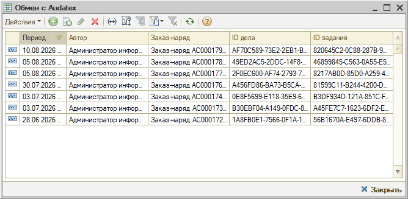

## Режимы обмена

Обработку обмена можно вызвать двумя способами:

- **из заказ-наряда** — выберите в списке заказ-нарядов нужный документ и нажмите **«Импорт данных из Audatex»** на командной панели;
- **через типовое меню** — *Обработки → Обмен с AudaPad Web* в верхнем меню программы.

Откроется окно **«Обмен данными с AudaPad Web»**:

| Реквизит | Содержимое |
|---|---|
| Получение данных из AudaPad Web | Переход в режим загрузки в заказ-наряд калькуляции, рассчитанной в AudaPad Web |
| Передача данных в AudaPad Web | Переход в режим передачи данных в AudaPad Web: передача сериализованного заказ-наряда, перенаправление калькуляции страховой компании |
| Создание нового дела в AudaPad Web | Переход в режим создания нового дела: передача сведений об автомобиле и заказчике |
| Регистрация | Открывает диалоговое окно для оформления заявки на регистрацию учетной записи AudaPad Web |
| Настройки | Открывает форму настроек обмена с Audatex |

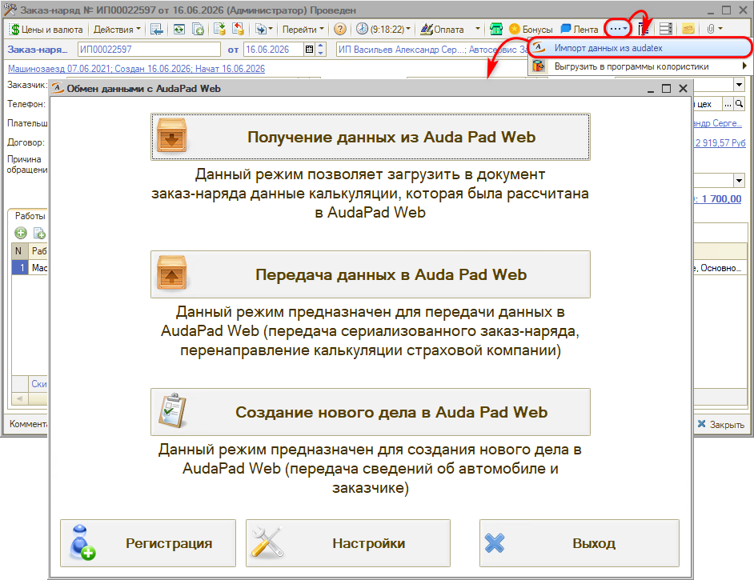

## Получение данных из AudaPad Web

Режим предназначен для составления калькуляции в AudaPad Web и загрузки ее в заказ-наряд.

1. Нажмите **«Получение данных из AudaPad Web»** — откроется страница входа на сайт AudaPad Web.
2. В области **«Учетная запись»** справа введите логин и пароль пользователя Audatex — получателя задания АХ — и нажмите **«Авторизация»**.
3. Нажмите **«Далее»** внизу страницы.

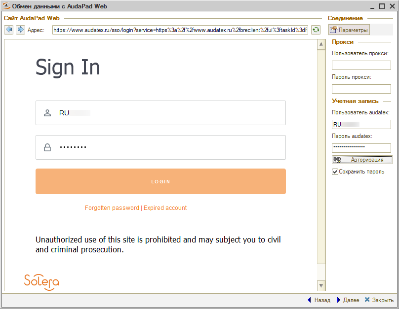

Откроется окно со списком заданий AudaPad Web: в области **«Документ-приемник»** указывается заказ-наряд, ниже — задания по заданному отбору (период и статус), а в нижней части — калькуляции выбранного задания.

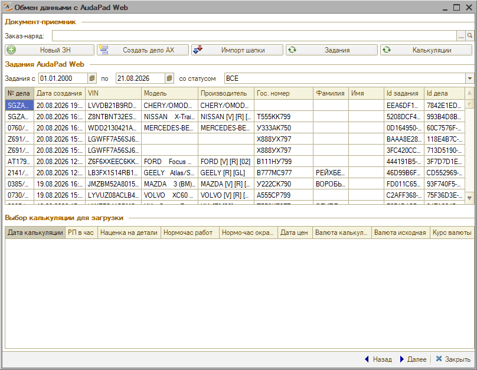

Дальше возможны два пути: рассчитать новую калькуляцию либо сразу загрузить уже готовую.

### Создание дела и расчет калькуляции

Для заказ-наряда можно создать новое дело в AudaPad Web:

**1. Заполните обязательные поля** и административную информацию нового дела, сохраните его.

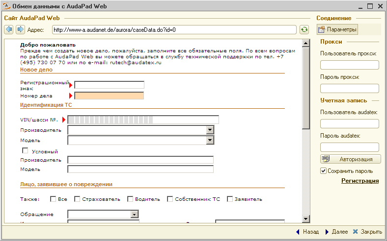

**2. Заполните административные разделы** — вкладки **«Данные дела»**, **«Идентификация ТС»** и **«Сведения о ТС»**: описание дела, данные о страховке, собственнике и СТО, подробные сведения об автомобиле и его состоянии. Здесь же доступны поиск по VIN-запросу, AudaHistory и расшифровка комплектации ТС.

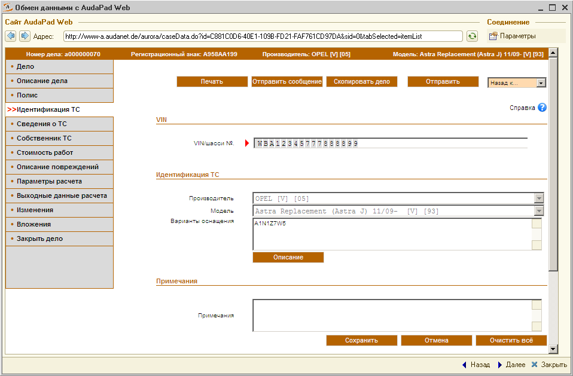

**3. Задайте стоимость работ** — стоимость нормо-часа или одно из предустановленных партнерств, а также метод окраски. От этих значений зависит расчет.

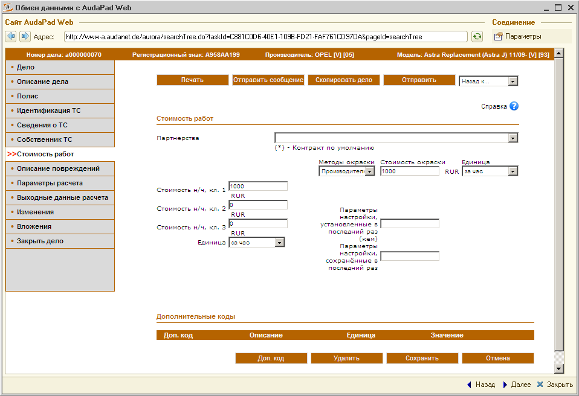

**4. Опишите повреждения.** На вкладке **«Описание повреждений»** запустите **OnePad** и подберите ремонтные воздействия, уточнения комплектации и нестандартные позиции.

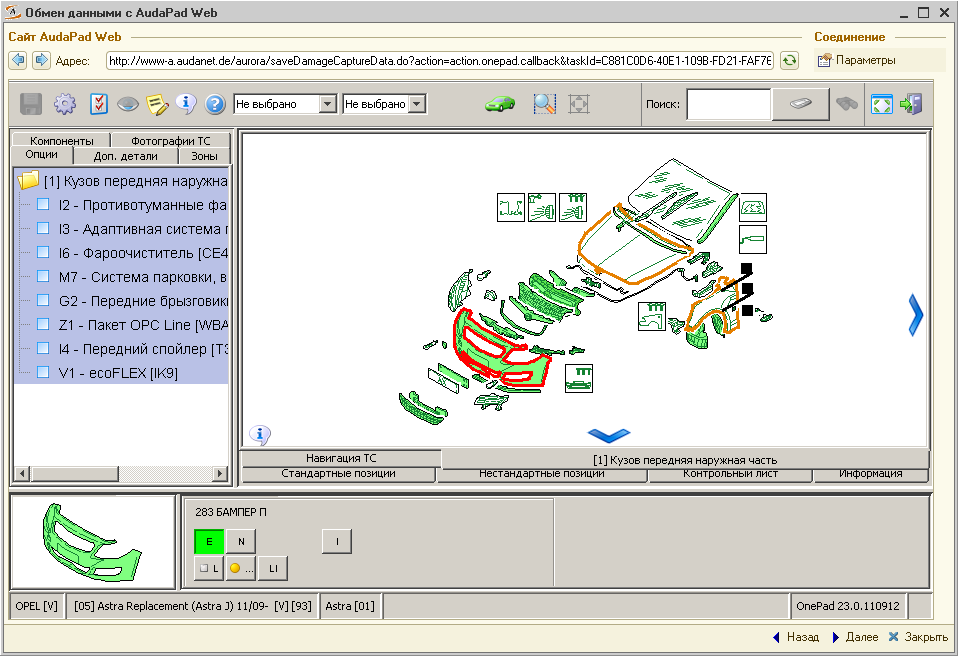

**5. Рассчитайте калькуляцию.** Задайте параметры на вкладке **«Параметры расчета»** и выполните расчет. Результат виден на вкладке **«Выходные данные расчета»**.

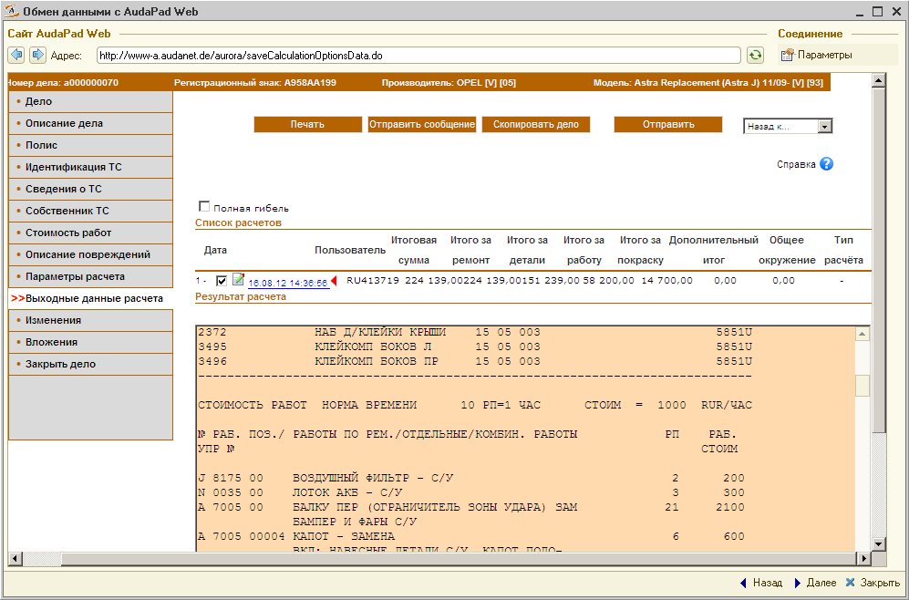

### Загрузка калькуляции в заказ-наряд

1. Перейдите к списку дел в интерфейсе программы. В нем отображаются дела из AudaPad Web, а рядом — калькуляции выбранного дела.
2. Выделите нужное дело и калькуляцию для загрузки.
3. При необходимости настройте **таблицу соответствий** — она сопоставляет ремонтные воздействия Audatex с номенклатурой и автоработами программы и не дает задвоить позиции.
4. Посмотрите результат в **предварительном просмотре** и перенесите данные в заказ-наряд.
5. В заказ-наряд загружаются работы, запчасти и стоимость ремонта — цены рассчитываются в AudaPad Web. Внесите корректировки при необходимости, запишите и закройте документ.

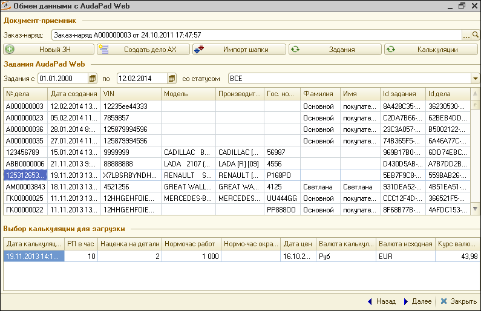

Таблица соответствий состоит из двух частей — для авторабот и для номенклатуры. Строки, которым соответствие еще не задано, помечаются как **«Нет записи в таблице соответствий»**: для них значение подбирается из справочников **«Автоработы»** и **«Номенклатура»**. Заданные соответствия запоминаются и применяются при следующих загрузках.

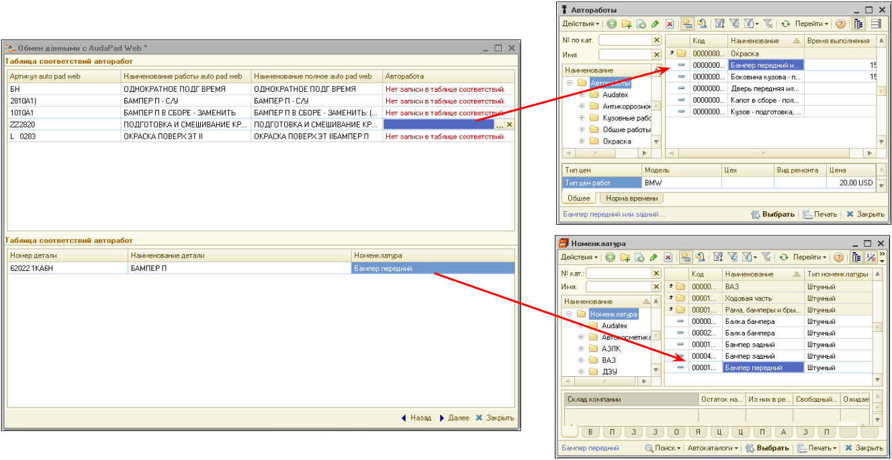

В предварительном просмотре видно, что именно уйдет в заказ-наряд: клиент и автомобиль, список работ и запчастей с ценами и итоговые суммы.

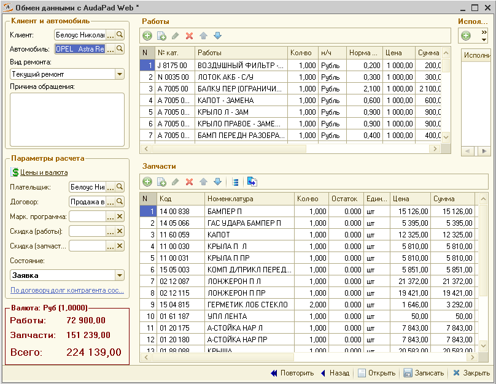

В форме выбора также можно создать новый заказ-наряд, создать новое дело AudaPad с номером указанного заказ-наряда и загрузить в шапку заказ-наряда данные текущего задания.

## Передача данных в AudaPad Web

Режим предназначен для переноса данных заказ-наряда в дело AudaPad Web. В нем доступны:

- вложение заказ-наряда в дело AudaPad Web;
- переназначение дела другому пользователю системы AudaPad Web;
- закрытие дела;
- перенаправление калькуляции страховой компании.

Здесь же виден список дел, которые ранее загружались в этот заказ-наряд, а в нижней части — сформированное вложение заказ-наряда в задание.

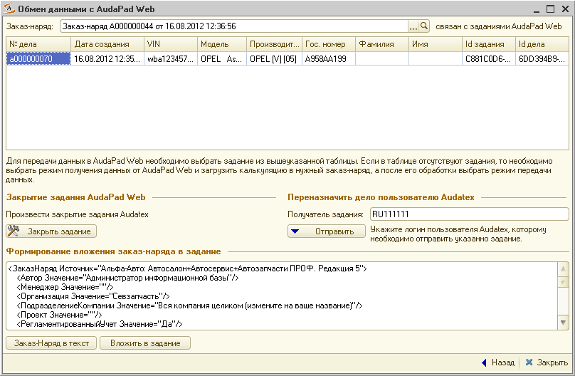

## Лицензирование

Дополнение не является самостоятельной программой и используется только в составе конфигураций «Альфа-Авто, редакция 5»:

- «Альфа-Авто: Автосалон+Автосервис+Автозапчасти Проф, редакция 5»;
- «Альфа-Авто: Автосервис+Автозапчасти Проф, редакция 5, комплект на 5 пользователей».

Чтобы задействовать модуль, нужно заключить лицензионное соглашение с компанией Audatex, приобрести лицензию на дополнение, активировать ее и обновить ключ защиты. Количество пользователей дополнения определяется количеством приобретенных лицензий на «Альфа-Авто, редакция 5».

Стоимость уточняйте у поставщика.

*Примечание:* для подключения интеграции обратитесь на портал технической поддержки 5SYSTEMS.

## Материалы для изучения

- «[Дополнение Альфа-Авто: Интерфейс с Аудатэкс, редакция 5](https://rarus.ru/1c-auto/dopolnenie-alfa-avto-interfeys-s-audateks-redaktsiya-5/)» — описание продукта и функциональные возможности на сайте «1С-Рарус».
- «[Интерфейс с Audatex](https://alfa-avto-1c.ru/dop5/28-audatex.html)» — состав, требования и условия поставки дополнения.
- «[Новые возможности интеграции «Альфа-Авто» и «Аудатэкс»](https://rarus-soft.ru/press/news/159644/)» — новость о выпуске решения.
- Сайт компании «Аудатэкс»: [www.audatex.ru](https://www.audatex.ru).

---

**Теги:** Audatex, Аудатэкс, AudaPad Web, интеграция, калькуляция, восстановительный ремонт, кузовной ремонт, урегулирование убытков, заказ-наряд, Альфа-Авто, OnePad, страховые компании

