

# Интеграция с BioTime

<table><tr><td><b>Время чтения:</b> 21 мин.</td><td><b>Обновлено:</b> 28.12.2022</td></tr></table>

Источник: https://www.5systems.ru/help/integraciya-s-biotime

## Содержание

1. [Введение](#введение)
   - [Что такое BioTime](#что-такое-biotime)
   - [Возможности интеграции с системой BioTime](#возможности-интеграции-с-системой-biotime)
2. [Настройка интеграции](#настройка-интеграции)
   - [Создание](#создание)
   - [Подключение](#подключение)
      - [1. Прямое подключение](#1-прямое-подключение)
      - [2. Подключение через 5S CLOUD](#2-подключение-через-5s-cloud)
   - [Синхронизация сотрудников](#синхронизация-сотрудников)
      - [Ручная синхронизация](#ручная-синхронизация)
      - [Автоматическая синхронизация](#автоматическая-синхронизация)
   - [Настройка регламентного задания](#настройка-регламентного-задания)

## Введение

### Что такое BioTime

***BioTime*** - биометрическая система учета рабочего времени и контроля доступа. *Подробное описание системы см. на сайте* [*biotime.ru*](https://www.biotime.ru/)*.*

Биометрические технологии применяются для идентификации личности, в их основе лежит измерение уникальных, присущих конкретному человеку характеристик.

*BioTime, интегрированная с 1С* – современная биометрическая система идентификации по отпечаткам пальцев, 3D геометрии лица. Прикладывая палец к сканеру, сотрудник подтверждает свою личность – это действие фиксирует время прихода или ухода и открывает замок. Для сканирования применяются USB-сканеры, напольные и настенные киоски, терминалы. Оборудование интегрируется с замками, турникетами, калитками, проходными.

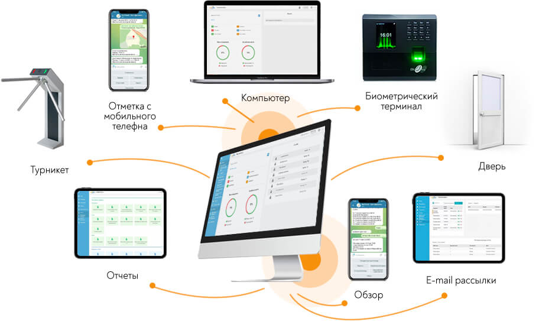

Как работает система BioTime:

- создается структура компании, заносятся сотрудники и их данные, графики работы могут быть созданы или импортированы из 1С;
- сотрудники регистрируют события с помощью биометрии и геолокации;
- система моментально узнает сотрудника, фиксирует приход / уход,
- ведется точный и достоверный учет времени: BioTime рассчитывает время работы, опоздания, ранние уходы, строит отчеты, отправляет сведения в Telegram bot.

Возможности:

- быстрый обзор по сотрудникам: кто вышел, кто не пришел, кто опоздал;
- визуальное планирование работы сотрудников, онлайн-расчет по сменам с учетом потребностей в персонале;
- интерактивная карта помещений с визуализацией расположения устройств, гостевой допуск;
- централизованный учет времени персонала на удаленных объектах.

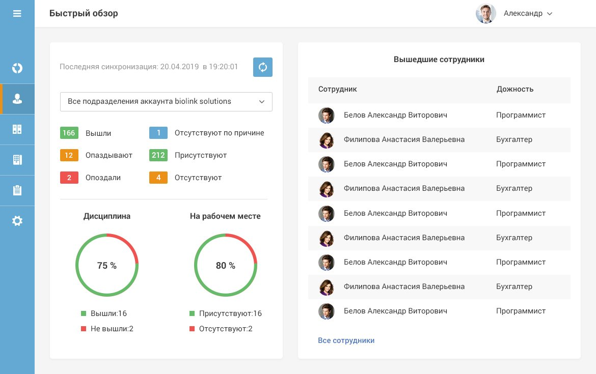

### Возможности интеграции с системой BioTime

В программе 5S AUTO предусмотрена *интеграция с BioTime,* в рамках которой:

***1.*** *Заполняется фактическое рабочее время* в табеле учета (см. [*Табель учета рабочего времени → Заполнение из BioTime*](https://5systems.ru/help/tabel-ucheta-rabochego-vremeni#zapolnizbiotime)*);*

***2.*** *Создаются нарушения* за опоздания или отсутствие отметки в BioTime (см. [*Выявление и разбор нарушений*](https://5systems.ru/help/vyyavlenie-i-razbor-narusheniy)*).*

Кроме того, можно запретить запуск программы без отметки прихода на работу в BioTime с помощью права “Проверять авторизацию в BioTime при входе в систему” (Расширенные → ПЕРСОНАЛ, значение = Да):

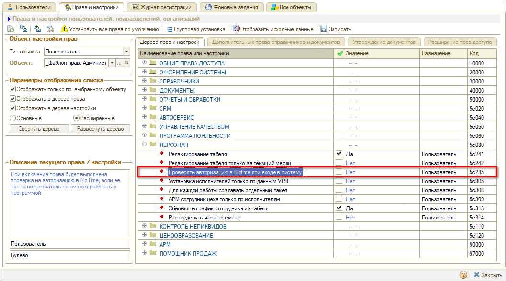

*Примечание:* BioTime 8 работает на релизе по подписке начиная с релиза 2.3.1.2.

## Настройка интеграции

### Создание

Для настройки интеграции требуется перейти в справочник “Интеграции” – *Администрирование → Компания → CRM → Интеграции* или через стандартное меню *CRM → Все операции → Справочники → Интеграции:*

**

В справочнике следует создать новую интеграцию, заполнить наименование и выбрать вид интеграции *“BioTime”:*

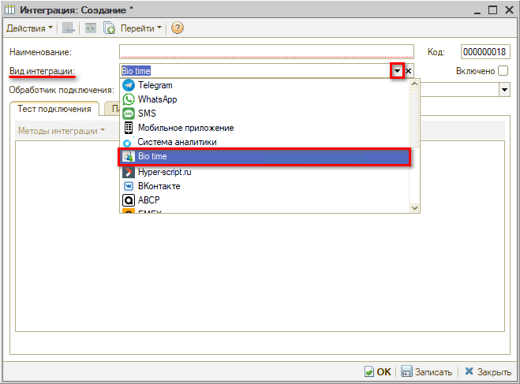

### Подключение

**Способы подключения BioTime:**

***1.** Прямое подключение:* данный способ подключения используется для настройки интеграции клиентами с собственным сервером.

***2.** Подключение через 5S CLOUD:* данный способ подключения используется для подключение через сервер 5S AUTO.

#### 1. Прямое подключение

Для настройки прямого подключения следует выбрать обработчик *“BioTime 8 (прямое подключение)”:*

*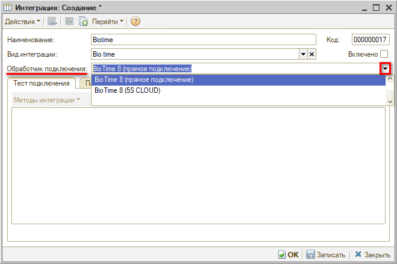*

После выбора обработчика автоматически заполняется *наименование* интеграции – при необходимости его можно отредактировать – а также отображаются *параметры сервиса* на соответствующей вкладке:

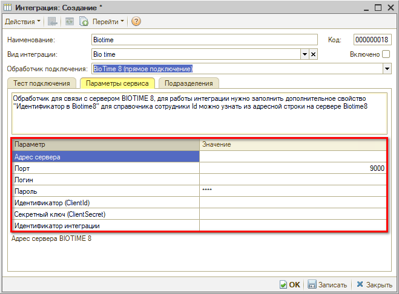

***Параметры:***

- *Адрес сервера* – адрес сервера BIOTIME 8.
- *Порт* – порт подключения к серверу API BIOTIME 8 (отличается от порта сервера BIOTIME). Значение по умолчанию: 9000. 
  *Примечание: Если не удалось подключиться по данному порту, уточните порт у специалиста, который устанавливал вам Biotime.*
- *Логин\** – логин для подключения к серверу BIOTIME 8.
- *Пароль\** – пароль для подключения к серверу BIOTIME 8.
- *Идентификатор (ClientId)\*\** – идентификатор ключа доступа приложения для получения токена BIOTIME 8.
- *Секретный ключ (ClientSecret)\*\** – ключ доступа приложения для получения токена BIOTIME 8.
- *Идентификатор интеграции* – используется, если необходимо создать несколько интеграций с одним и тем же видом интеграции.

*\*Логин* и *Пароль* – это логин и пароль от входа в личный кабинет на сайте BioTime.

*\*\*Идентификатор (ClientId)* и *Секретный ключ* необходимо скопировать в личном кабинете на сайте BioTime: *Управление → Настройки системы →* вкладка *Приложения*. Если ключи доступа не созданы или если уже существует интеграция BioTime с другим приложением помимо 1С, следует создать новый ключ – нажать кнопку “Добавить ключ доступа для приложения”:

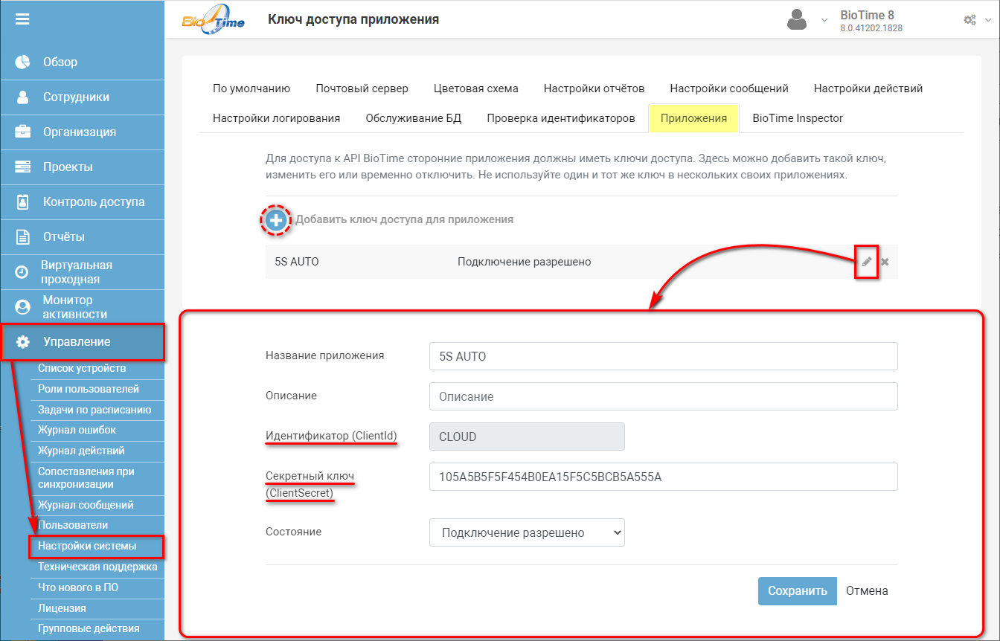

Чтобы проверить подключение, следует на вкладке “Тест подключения” нажать кнопку “Методы интеграции → Тест подключения”:

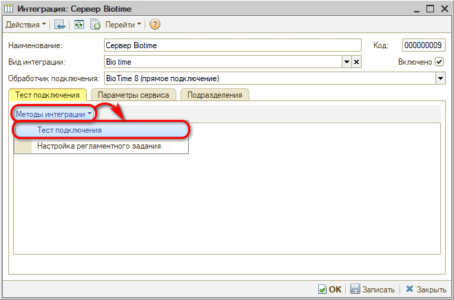

Если всё работает корректно, появится сообщение об успешно выполненном тесте подключения:

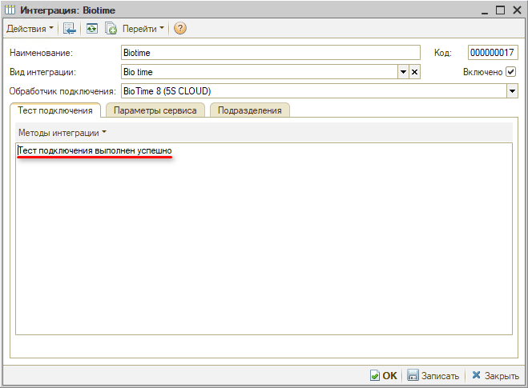

После заполнения параметров интеграции следует установить флажок “Включено” и нажать кнопку “ОК” для сохранения данных:

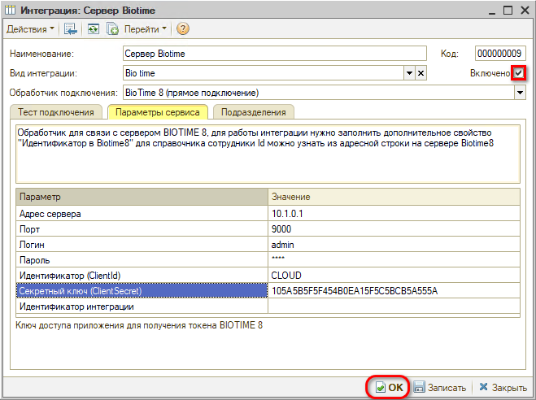

Настройка интеграции завершена.

#### 2. Подключение через 5S CLOUD

Для подключения через сервер 5S AUTO необходимо выбрать обработчик подключения “BioTime 8 (5S CLOUD)”. После этого отображаются параметры подключения – при данном методе подключения требуется заполнить только параметры “Логин” и “Пароль”:

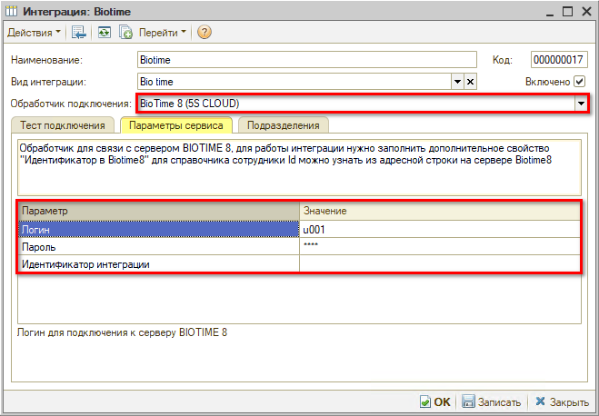

После заполнения параметров интеграции и тестирования подключения следует установить флажок *“Включено”* и нажать кнопку *“ОК”* для сохранения данных.

### Синхронизация сотрудников

#### Ручная синхронизация

Инструкция для настройки работы интеграции с Biotime8 указана в программе в карточке интеграции, во вкладке “Параметры сервиса”:

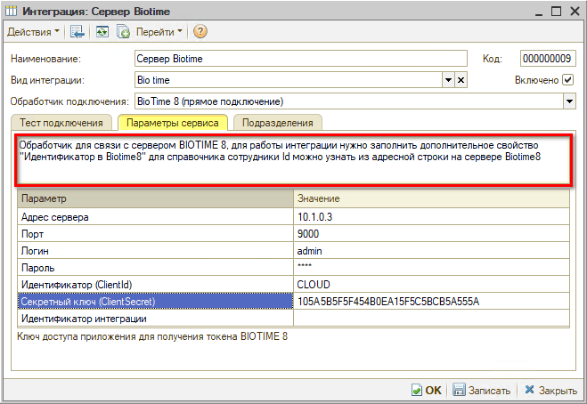

Для корректной работы интеграции с BioTime следует заполнить у каждого сотрудника в программе идентификатор. Для этого на сайте BioTime в списке сотрудников следует открыть сотрудника и скопировать значение *“Employees”* из адресной строки (Id сотрудника).

Затем в программе открыть панель *свойств* из карточки этого же сотрудника, в значение свойства *“Идентификатор в Biotime8”* вставить скопированное значение. Записать.

Произвести данную процедуру по каждому сотруднику.

#### Автоматическая синхронизация

Для *синхронизации сотрудников* между системами BioTime и 5S AUTO необходимо нажать кнопку "Факт → BioTime → Синхронизация сотрудников”:

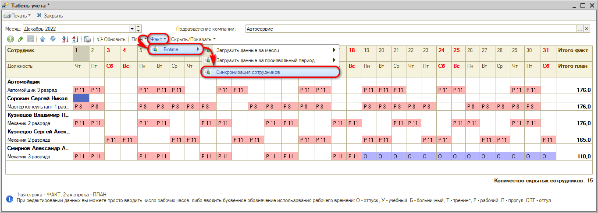

Система выводит в таблице сотрудников из 1С и сотрудников из BioTime. Если в карточке сотрудника заполнен идентификатор (см. *[выше](#identif))*, то программа сразу их сопоставляет:

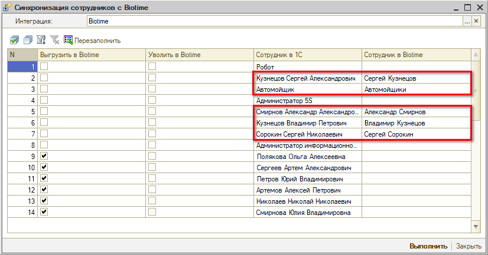

Если сотрудники не созданы в BioTime, нужно отметить галочками в столбце *“Выгрузить в BioTime”* сотрудников из 1C, которых требуется создать в BioTime, и нажать *“Выполнить”:*

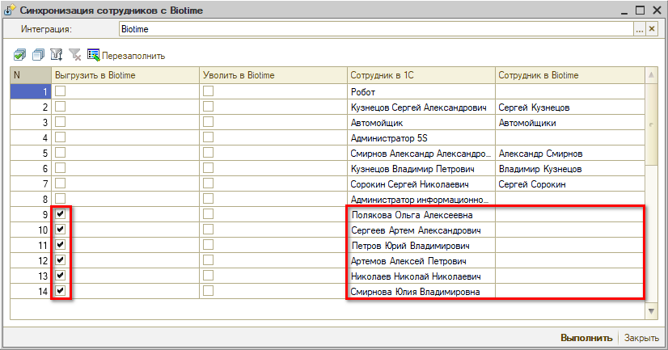

Будут созданы сотрудники в BioTime и установлено соответствие.

Если сотрудники есть в BioTime, но идентификатор не заполнен, то они не будут сопоставлены автоматически. Следует в столбце “Сотрудник в BioTime” вручную выбрать сотрудника из BioTime, отметить галочками в столбце “Выгрузить в BioTime” и нажать “Выполнить”: произойдет сопоставление.

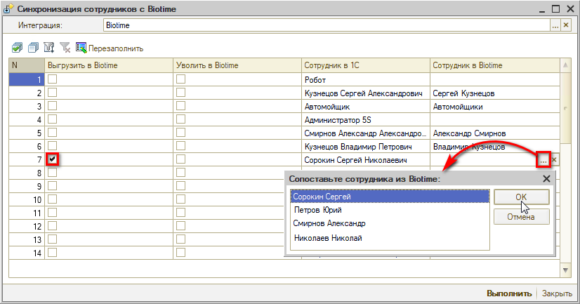

При необходимости *уволить в BioTime* сотрудника следует поставить галочку в столбце “Уволить в BioTime” и нажать “Выполнить”:

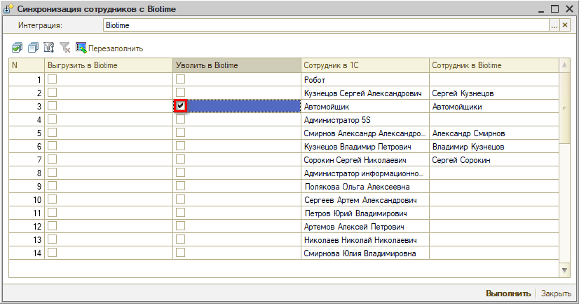

Сотрудник будет отображаться в BioTime как уволенный сотрудник, но не удалится из системы.

Предусмотрена возможность\* удаления сотрудника из BioTime: для этого можно кликнуть на него правой клавишей мыши и нажать в выпадающем меню кнопку *“Удалить сотрудника из BioTime”:*

*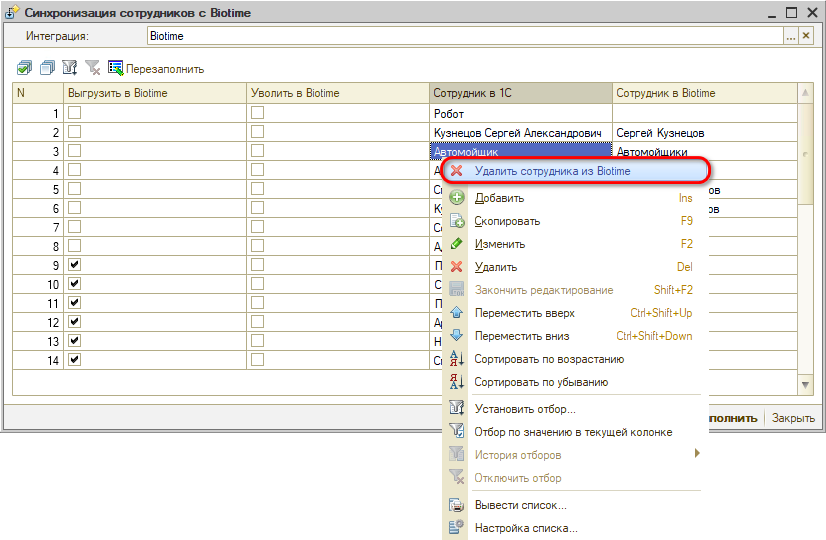*

*\*Удалять сотрудников таким способом не рекомендуется!*

### Настройка регламентного задания

Для автоматической загрузки данных BioTime необходимо настроить регламентное задание. Для этого следует нажать кнопку “Методы интеграции → Настройка регламентного задания” и задать необходимые параметры:

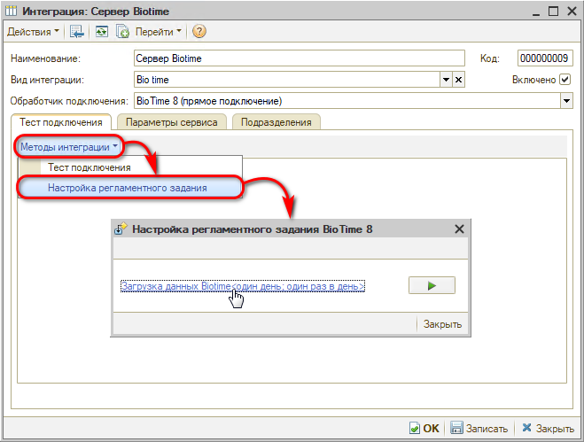

Либо перейти через *Установку прав и настроек → Вкладка “Фоновые задания”* и найти в списке задание “Загрузка данных из BioTime”.

Следует задать расписание, когда должно выполняться задание:

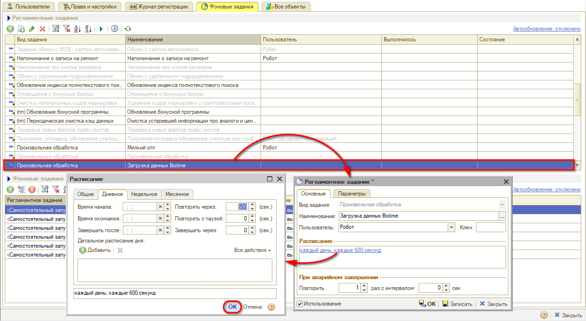

Либо можно выполнить регламентное задание по загрузке данных из BioTime вручную нажатием на соответствующую кнопку:

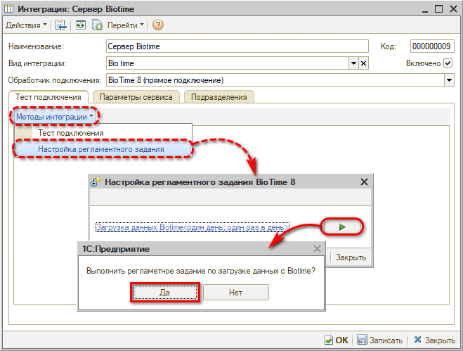

Интеграция с системой BioTime используется для заполнения *фактического рабочего времени* в *табеле учета* (см. *[Табель учета рабочего времени → Заполнение из BioTime](https://5systems.ru/help/tabel-ucheta-rabochego-vremeni#zapolnizbiotime)*)*.*

---

**Теги:** BioTime, учет рабочего времени, интеграция, настройка, персонал

