

# Интеграция с MotorData

<table><tr><td><b>Время чтения:</b> 24 мин.</td><td><b>Обновлено:</b> 13.03.2024</td></tr></table>

Источник: https://www.5systems.ru/help/integraciya-s-motordata

> *Функционал доступен начиная с релиза 2.6.1.1 в рамках* *[отдельной подписки](https://www.5systems.ru/services/integraciya-s-motordata) (актуальную стоимость см. в [Каталоге услуг](https://www.5systems.ru/services?field_tags_target_id%5B21%5D=21&sort_by=created&sort_order=ASC))*

## Содержание

1. [Введение](#введение)
2. [Расшифровка автомобиля](#расшифровка-автомобиля)
3. [Подбор авторабот по каталогу MotorData](#подбор-авторабот-по-каталогу-motordata)
   - [Переход к подбору работ](#переход-к-подбору-работ)
   - [Навигация по группам каталога](#навигация-по-группам-каталога)
   - [Поиск работ по каталогу](#поиск-работ-по-каталогу)
   - [Получение нормы времени](#получение-нормы-времени)
   - [Сохранение работ в справочник](#сохранение-работ-в-справочник)
   - [Сопоставление работ](#сопоставление-работ)
   - [Добавление в Корзину](#добавление-в-корзину)
   - [Заполнение справочника работ](#заполнение-справочника-работ)
4. [Настройка интеграции](#настройка-интеграции)
   - [Установка параметров](#установка-параметров)
   - [Тест подключения](#тест-подключения)

## Введение

*MotorData (МоторДата)* – это справочно-информационная система по диагностике и ремонту автомобилей.

Интеграция 5S AUTO с MotorData предназначена для получения *норм времени* выполнения авторабот.

База данных норм времени на ремонт автомобилей от MotorData содержит 86 марок, более 2000 моделей и более 270 000 нормативов с регулярными обновлениями и гибким выбором тарифного плана.

Преимущества:

- оперативное получение информации по нормочасам;
- точное планирование загрузки;
- повышение рентабельности.

Подробнее см. на сайте: [https://motordata.net/ru/repairtimes](https://motordata.net/ru/repairtimes).

Механизм интеграции с MotorData позволяет быстро и четко проценить автоработы, что бывает особенно актуально для новых сотрудников автосервиса и непрофильных специалистов.

[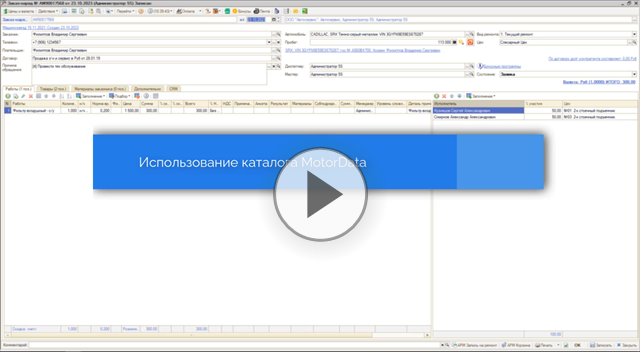](https://www.5systems.ru/sites/default/files/2024-03/MotorData.mp4)

Функционал интеграции с MotorData доступен пользователям программы 5S AUTO, действует начиная с релиза 2.6.1.1.

Для начала работы необходимо *зарегистрироваться в [личном кабинете](https://motordata.net/ru/sign/in)* на сайте MotorData. Логин и пароль от личного кабинета потребуются при [настройке интеграции](#настройка-интеграции).

Функционал доступен при покупке лицензии на год: *актуальную стоимость см. на сайте [5systems.ru](https://5systems.ru) в разделе в [Каталог услуг → Онлайн-сервисы → Интеграция с MotorData](https://www.5systems.ru/services/integraciya-s-motordata).* В стоимость включена только *лицензия на интеграцию с MotorData.* Доступ к веб-сервису норм времени необходимо приобрести отдельно у компании MotorData – см. актуальную *стоимость лицензий* на сайте сервиса: [https://motordata.net/ru/purchase/tariffs](https://motordata.net/ru/purchase/tariffs).

## Расшифровка автомобиля

Функционал интеграции с MotorData используется при работе с [подбором работ в Корзине](../../Проценка%20запчастей%20и%20работ/Работа%20в%20АРМ%20Корзина/rabota-v-arm-korzina.md).

Первое, что необходимо сделать – идентифицировать, т.е. расшифровать автомобиль. Для этого нужно в Корзине нажать кнопку “Расшифровка по VIN”.

Сначала следует выбрать марку, модель и модификацию автомобиля *в основном каталоге TecDoc* – подробнее см. статью “[Расшифровка автомобиля по VIN](../../Автосервис/Расшифровка%20автомобиля%20по%20VIN/rasshifrovka-avtomobilya-po-vin.md)”.

Затем нужно перейти на вкладку “MotorData”\*:

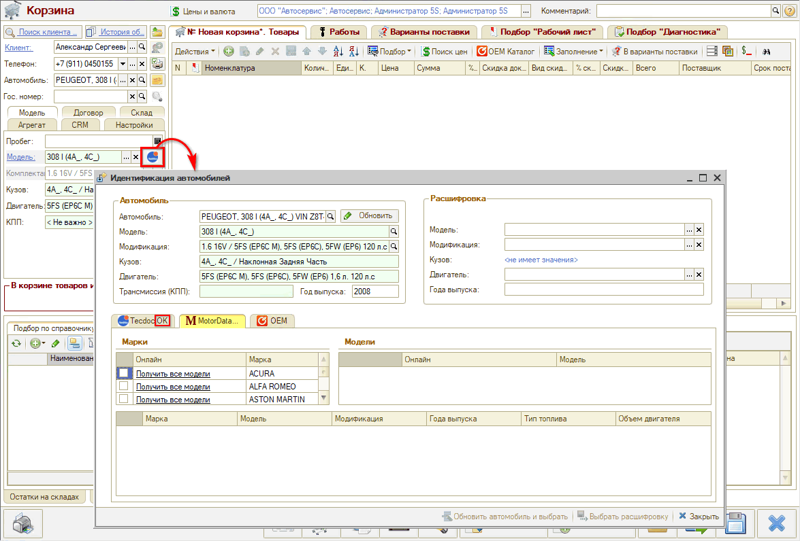

*\*Вкладка “MotorData” в окне идентификации автомобиля становится активной после настройки и включения интеграции – см. раздел “[Настройка интеграции](#настройка-интеграции)”.*

*Примечание: Данных о кузове в каталогах MotorData нет.*

Важно, чтобы был заполнен *год выпуска* автомобиля.

Следует выбрать марку и модель автомобиля, после этого в нижнюю таблицу выводится список всех модификаций. Подходящие модификации выделяются синим цветом шрифта:

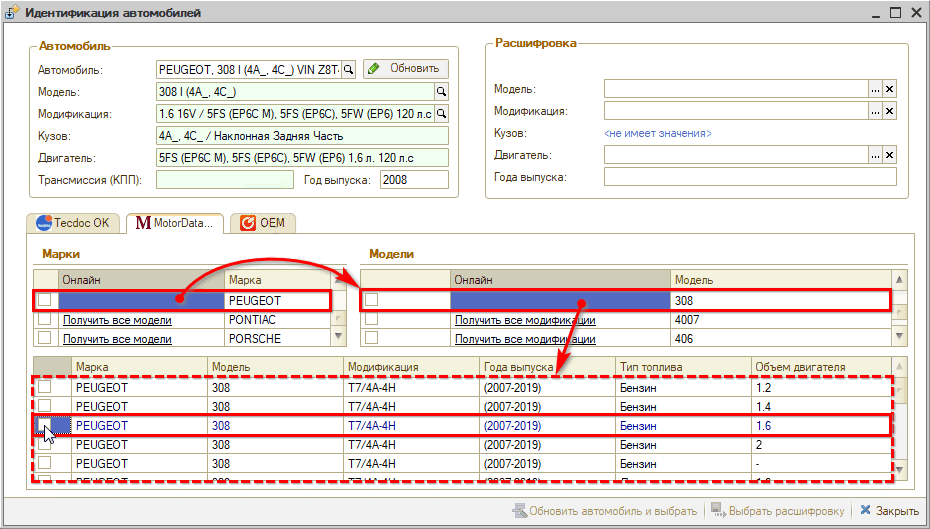

Подходящие модификации программа определяет исходя из типа, мощности и объема двигателя.

Следует отметить галочкой выбранную модель и нажать кнопку “Обновить автомобиль и выбрать”:

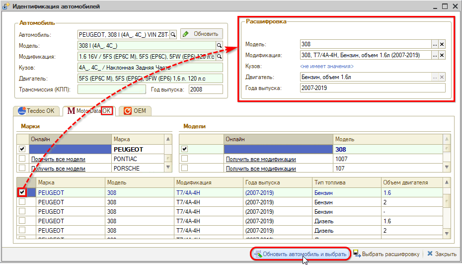

Когда расшифровка автомобиля по каталогу MotorData выполнена, на вкладке “MotorData” появляется обозначение “ОК”.

Выбранная расшифровка подсвечивается зеленым цветом.

Все выбранные параметры расшифровки автоматически сохраняются в следующих справочниках со ссылкой на каталог MotorData:

1. “Модели автомобилей”:

   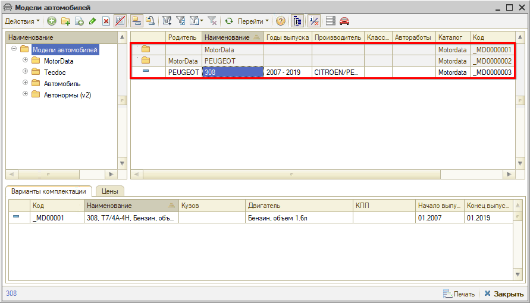

2. “Варианты комплектации”:

   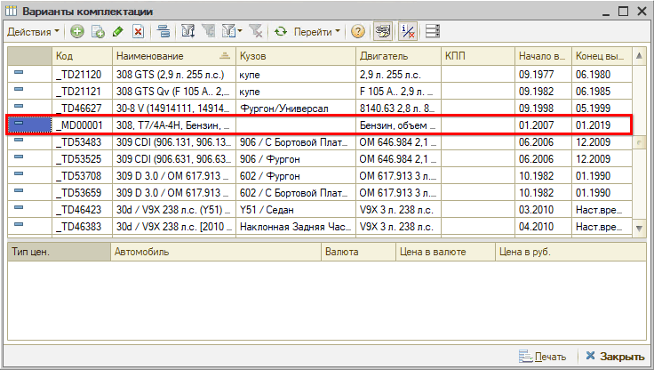

В карточке автомобиля во вкладке “Каталоги автомобиля” сохраняются расшифрованные данные: каталог, модель, комплектация (модификация) автомобиля. После однократной расшифровки эти данные остаются в карточке автомобиля:

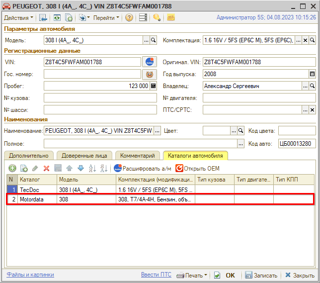

После уточнения модификации автомобиля становится доступен подбор работ по каталогам MotorData.

По мере работы с каталогом будут накапливаться данные по сопоставлению марок, моделей и модификаций автомобилей, и производить расшифровку автомобиля через MotorData будет не нужно – расшифровка будет сопоставляться автоматически.

## Подбор авторабот по каталогу MotorData

### Переход к подбору работ

Подбор работ по каталогам MotorData производится в АРМ Корзина в “Подборе “Автоработы”” (см. [статью](https://5systems.ru/help/rabota-v-arm-korzina#podbor_autoraboty) и [видеоурок](../../Проценка%20запчастей%20и%20работ/Как%20подбирать%20автоработы%20в%20АРМ%20Корзина/kak-podbirat-avtoraboty-v-arm-korzina.md)) на вкладке “MotorData”. Данная вкладка становится активной после расшифровки автомобиля через MotorData (см. [выше](#расшифровка-автомобиля)).

На командную панель автоматически подтягивается выбранная в результате расшифровки модификация автомобиля:

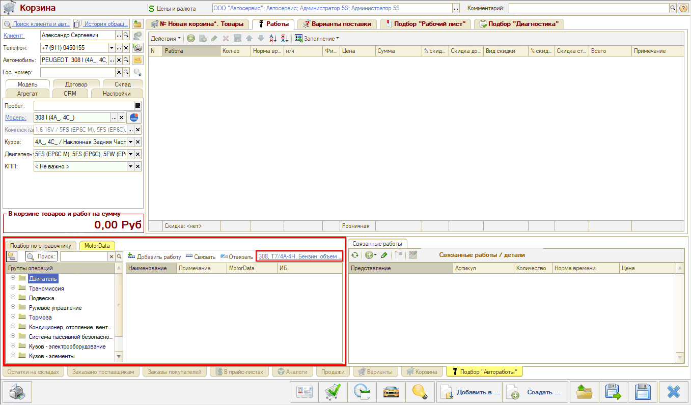

### Навигация по группам каталога

Поиск работ в каталоге можно вести вручную по узлам, т.е. подсистемам автомобиля:

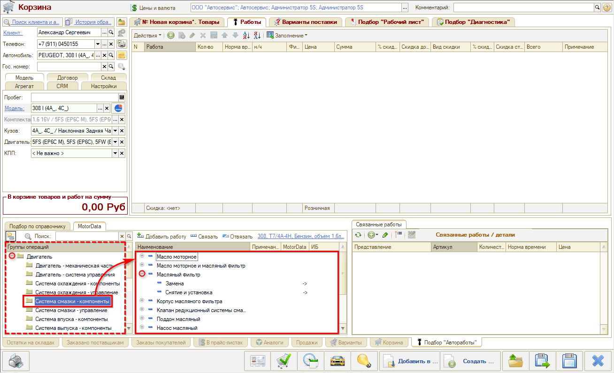

В область “Группы операций” выводится список подсистем автомобиля. Структура узлов может быть различной – в зависимости от модели.

При выборе определенной группы в соседнее окно выводится список операций данной группы каталога в разбивке на следующие столбцы:

- *Наименование* – наименование операции в каталоге MotorData.
- *Примечание* – некоторые операции содержат примечание из каталога MotorData, например, об особенностях установки данной детали, о совместимости с механической или автоматической КПП и другие.
- *MotorData* – данные по норме времени из каталога MotorData.
- *ИБ* – значение нормы времени по связанной работе из *информационной базы –* внутреннего справочника авторабот.

Также можно вывести дополнительные столбцы с помощью настройки списка.

В каталоге могут быть две и более операций с *одинаковым наименованием,* но отличающиеся *примечанием* – они обе будут сопоставлены *с одной работой* внутреннего справочника “Автоработы”, но это *разные операции* в каталоге MotorData, и они могут иметь *разные нормы времени* и примечания:

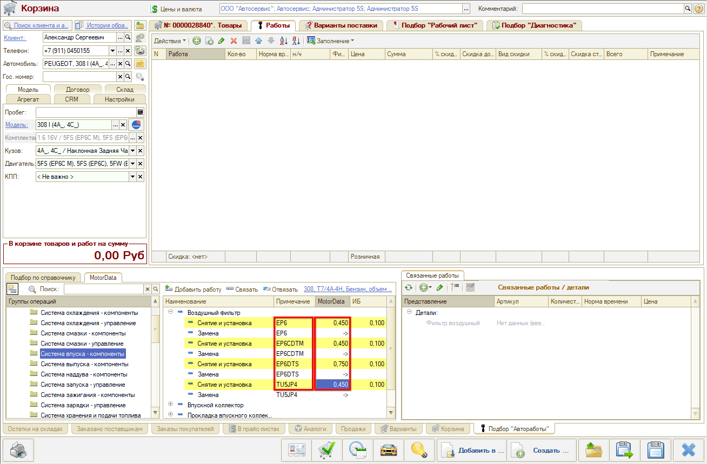

По умолчанию установлен *режим иерархического просмотра* каталога. Если отключить иерархический просмотр, выбор узлов автомобиля становится неактивен, и все операции каталога MotorData выводятся в единый список в алфавитном порядке:

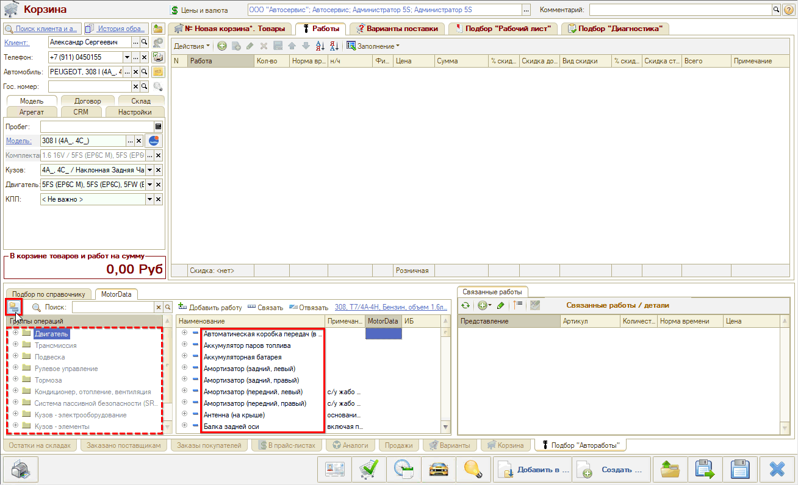

### Поиск работ по каталогу

В программе реализован “умный” поиск работ по каталогу:

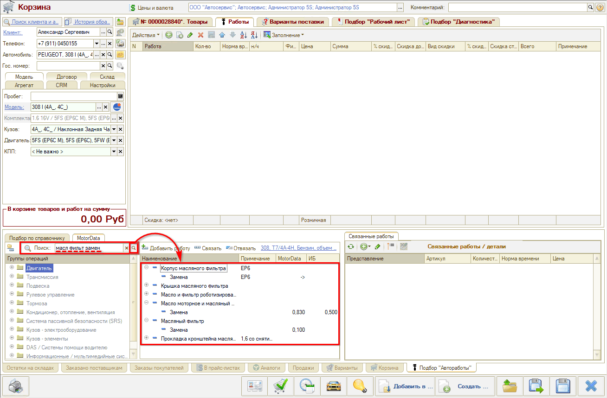

Выбор узлов автомобиля при использовании поиска также становится неактивен и снова активируется при очистке окна поиска.

При клике на найденную операцию производится ее позиционирование на группе каталога, в которой она находится – т.е. разворачивается дерево групп операций и выделяется группа:

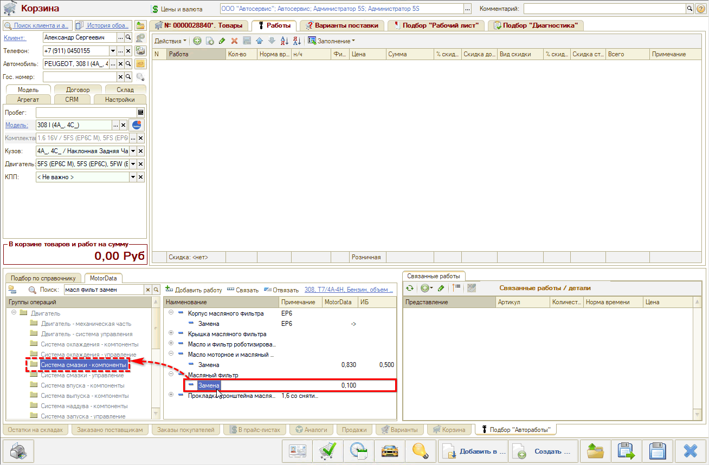

### Получение нормы времени

Чтобы получить норму времени по найденной работе, нужно *дважды кликнуть на строку* либо вызвать контекстное меню кликом правой кнопки мыши и выбрать “Получить данные MotorData”\*:

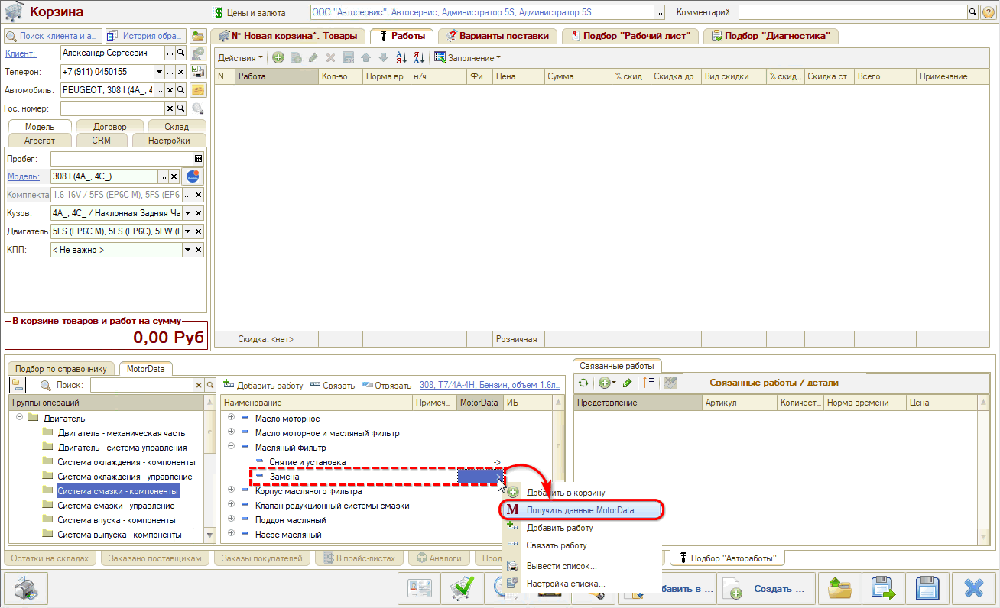

*\*За каждый запрос норм времени взимается плата в соответствии с подключенным тарифом.*

Ячейка будет заполнена данными о норме времени из каталога MotorData:

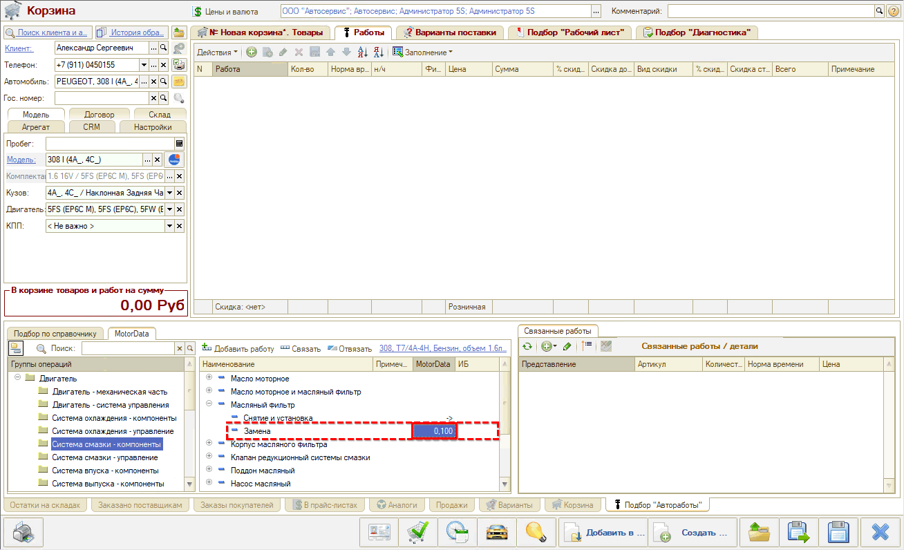

Если дважды кликнуть по строке с заполненной нормой времени, работа добавится в таблицу Корзины – см. [ниже](#добавление-в-корзину).

### Сохранение работ в справочник

Найденную работу можно сохранить в свой внутренний справочник “Автоработы” в программе. Для этого нужно выделить ее и нажать кнопку “Добавить работу”:

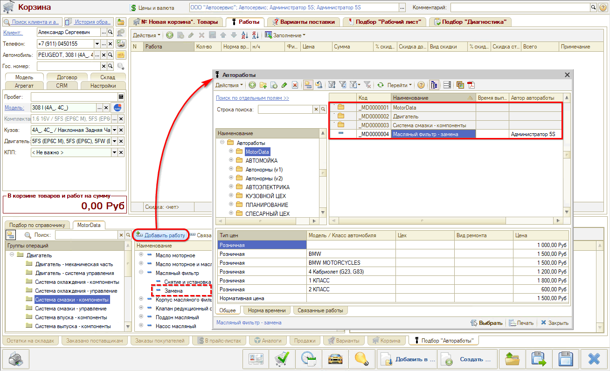

При этом в справочнике “Автоработы” автоматически создается элемент в группе “MotorData” со структурой, которая внутренне соответствует структуре каталога MotorData.

Также работа сохранится в справочник “Автоработы”, если добавить ее в Корзину – см. [ниже](#добавление-в-корзину).

### Сопоставление работ

Если в базе уже есть заполненный справочник авторабот с проверенными нормами времени, то можно не добавлять найденную в каталоге MotorData операцию в свой справочник, а *привязать* ее к существующей автоработе. Для этого нужно выделить операцию и нажать кнопку “Связать” – открывается справочник "Автоработы" с автоматическим отбором по текущей работе (если нужная работа не найдена, можно скорректировать значение в поисковой строке). Следует выделить в справочнике нужную работу и нажать кнопку "Выбрать":

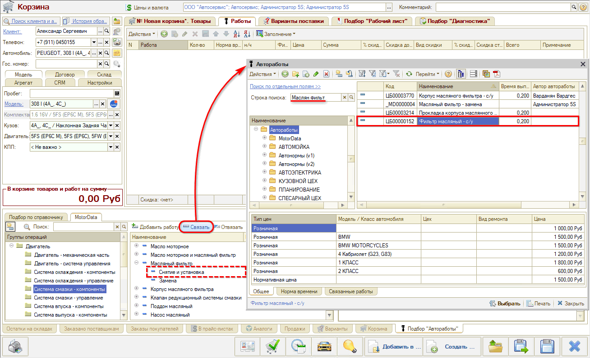

В карточку автоработы на вкладку “MotorData” запишется норма времени, полученная от MotorData:

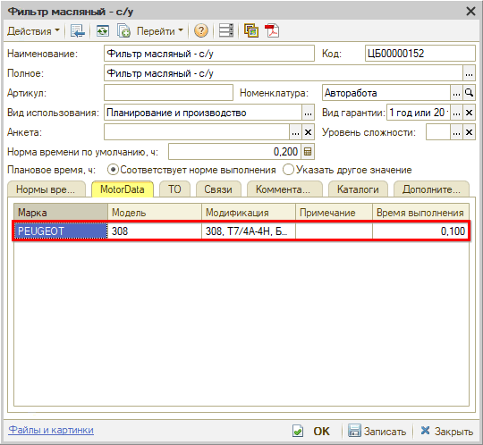

В случае если в каталоге есть несколько вариантов операций по данной работе (см. [выше](#varianty_operacij)), на вкладку “MotorData” будут записываться все эти операции – при запросе норм времени по каждой из них:

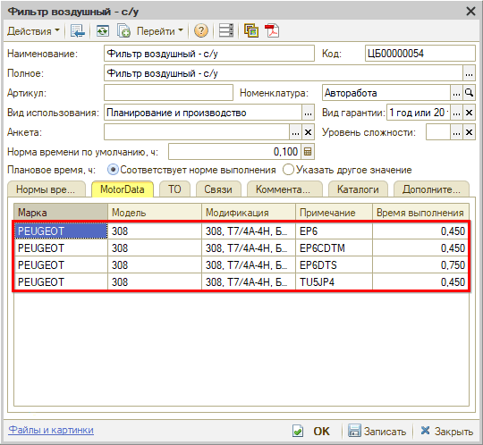

Также при сопоставлении работ добавляется информация на вкладку “Каталоги”:

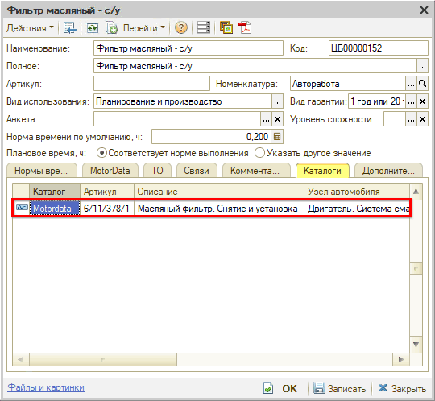

Если работа уже связана, то при нажатии на кнопку “Связать” система предложит на выбор следующие действия:

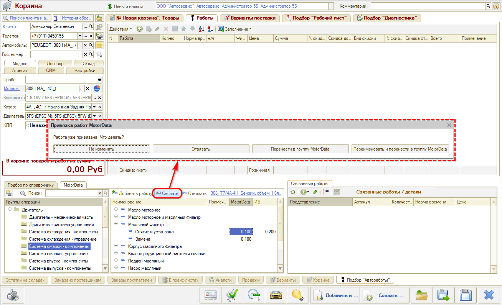

- *Не изменять* – оставить связь работ без изменения;
- *Отвязать* – удалить связь работ, если она была установлена по ошибке;
- *Перенести в группу MotorData* – авторабота, с которой связана данная операция из каталога MotorData, будет перенесена в группу “MotorData”, т.е. в другую папку в справочнике авторабот;
- *Переименовать и перенести в группу MotorData* – помимо переноса связанной работы в справочнике в группу “MotorData” у нее автоматически будет изменено название на наименование операции в каталоге MotorData.

При переносе работы в другую группу справочника сама работа остается прежней, а также сохраняются без изменений все завязанные на нее механизмы программы и документы, в которых она использовалась.

Также можно отвязать работу нажатием на кнопку “Отвязать”   на командной панели.

### Добавление в Корзину

Найденную в каталоге MotorData операцию с заполненной нормой времени можно добавить в Корзину.

Для этого следует *дважды кликнуть* по ней, либо вызвать контекстное меню кликом правой кнопки мыши и нажать кнопку “Добавить в Корзину”.

При попытке выбрать в Корзину найденную в каталоге MotorData работу, которая не сохранена и не сопоставлена с внутренним справочником, система выведет вопрос, нужно ли сохранить работу в справочник или связать с имеющейся работой:

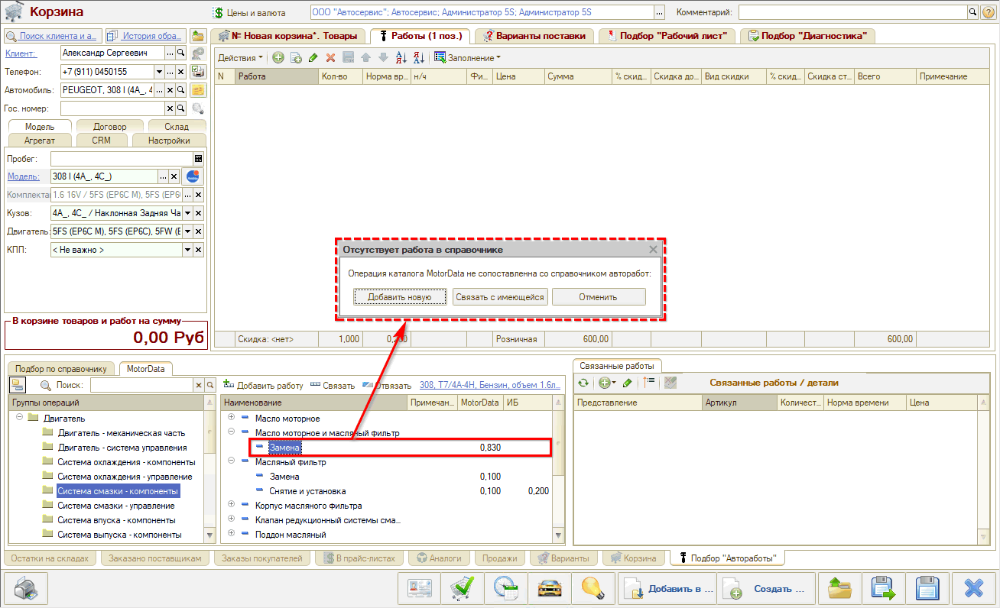

После установки связи или сохранения новой работы в справочник работа из подбора по каталогу MotorData может быть добавлена в Корзину. В таблицу Корзины переносится значение *нормы времени,* а также *примечание* из каталога MotorData:

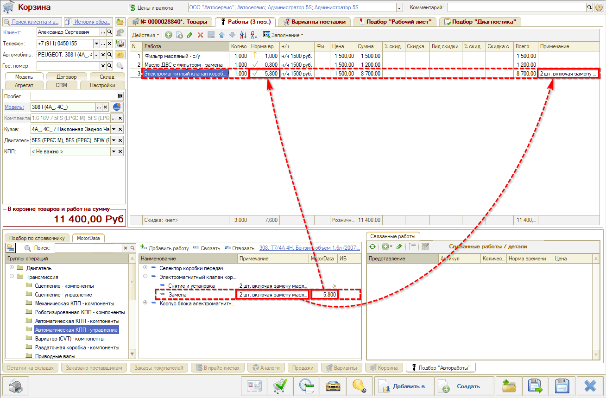

Значение нормы времени подтягивается из карточки автоработы в программе, либо из каталога MotorData – в зависимости от настроек (см. [ниже](#установка-параметров)).

В столбце “Норма времени” отображается *индикатор* соответствия ее текущего значения в Корзине значению в каталоге MotorData:

 – текущее значение нормы времени точно совпадает со значением в каталоге.

– значение нормы времени отличается от значения в каталоге менее, чем на 10% (в обе стороны).

 – текущее значение нормы времени превышает значение в каталоге.

 – текущее значение нормы времени ниже значения в каталоге.

 – есть несколько вариантов операций данной автоработы, и текущее значение нормы времени совпадает с одной из них.

 – есть несколько вариантов операций данной автоработы, и текущее значение нормы времени отличается от одной из них менее, чем на 10%.

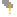– есть несколько вариантов операций данной автоработы, но текущее значение нормы времени не соответствует ни одному из них.

Если значение нормы времени отличается от каталога, можно вручную ввести нужное значение.

### Заполнение справочника работ

В случае, если нет своего справочника авторабот, можно воспользоваться кнопкой “Сохранить в справочник”, которая вызывается кликом правой кнопки мыши по группе работ каталога MotorData:

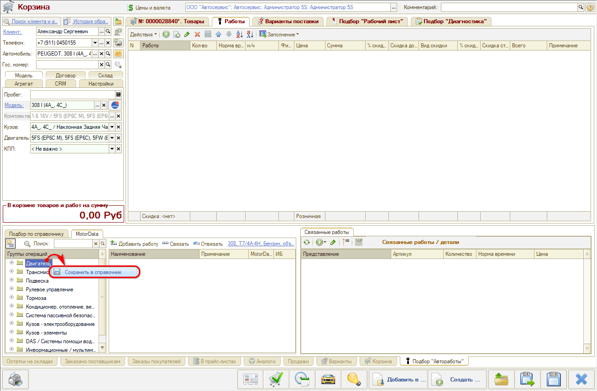

Для возможности сохранения групп каталога должна быть установлена *настройка “Автоматическое добавление операций в справочник Автоработы”* – значение *“Да”* (см. [ниже](#установка-параметров)).

## Настройка интеграции

### Установка параметров

Настройка интеграции с MotorData производится в справочнике “Интеграции”. Необходимо настроить Параметры сервиса:

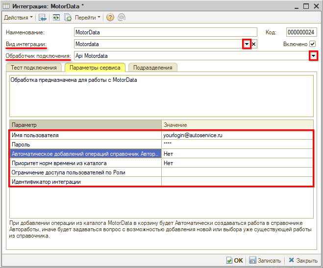

1. *Имя пользователя* и *Пароль* – обязательные параметры, логин и пароль из личного кабинета на сайте MotorData.
2. *Автоматическое добавление операций в справочник Автоработы*

Значения: Да / Нет.

При добавлении *операции* из каталога MotorData в Корзину будет автоматически создаваться работа в справочнике “Автоработы”, иначе будет задаваться вопрос с возможностью добавления новой или выбора уже существующей работы из справочника.

Рекомендуется устанавливать данную настройку в том случае, если база норм времени еще не заполнена. Если уже есть своя база норм времени, оставить значение “Нет”.

3. *Приоритет норм времени из каталога*

Значения: Да / Нет.

При добавлении операции из каталога MotorData в Корзину будет устанавливаться норма времени каталога вне зависимости от установленной нормы в Информационной базе.

В случае если уже есть своя база проверенных норм времени, рекомендуется оставить значение “Нет”.

4. *Ограничение доступа пользователей по Роли*

Если роль не указана, то доступ не ограничен. Иначе доступ открыт для пользователей с указанной Ролью. Настройка доступа ведется в Регистре “Сведения адресации”.

Другими словами, сотрудникам, которые должны иметь доступ к работе с функционалом, следует установить определенную Роль и выбрать данную Роль в данном параметре:

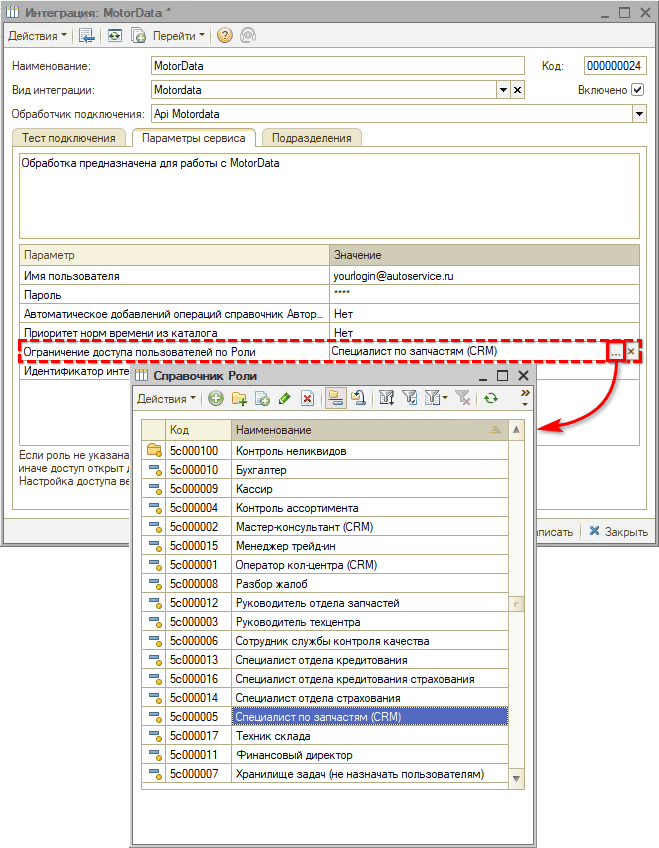

Эти сотрудники будут работать с функционалом MotorData. Сотрудники, которым данная роль не установлена, не будут иметь доступа к MotorData.

После заполнения всех настроек следует установить галочку “Включено” и сохранить настройки интеграции нажатием на кнопку *“Записать”* или *“ОК”:*

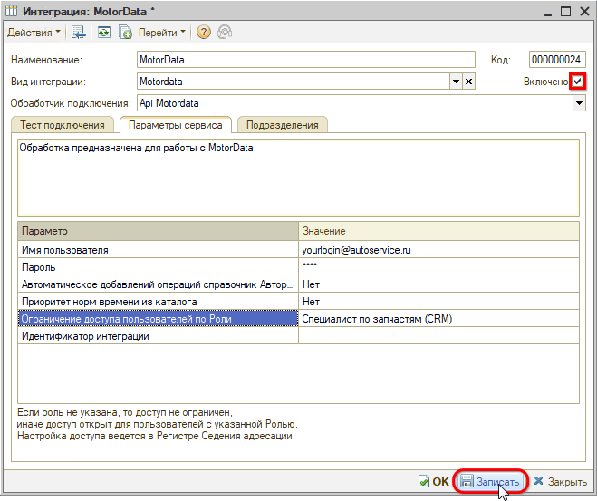

### Тест подключения

После настройки параметров следует сделать тест подключения:

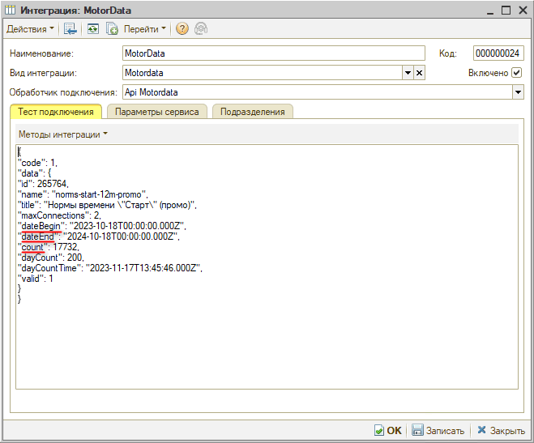

В ответ на запрос приходят данные, среди которых *дата начала и окончания лицензии* и *оставшееся количество запросов.*

После ввода авторизационных данных и включения интеграции становится активной вкладка “MotorData” в окне идентификации автомобиля – можно переходить к [работе с функционалом](#расшифровка-автомобиля).

---

**Теги:** MotorData, каталог, нормативы, интеграция, подбор запчастей

