

# Интеграция с сервисом "Безбумажный офис F.Doc"

<table><tr><td><b>Время чтения:</b> 27 мин.</td><td><b>Обновлено:</b> 04.09.2026</td></tr></table>

Источник: https://www.5systems.ru/help/integraciya-s-servisom-bezbumazhnyy-ofis-fdoc

> *Актуально начиная с версии релиза 2.6.1.1.*

## Содержание

1. [Введение](#введение)
2. [Работа с F.Doc в 5S AUTO](#работа-с-fdoc-в-5s-auto)
   - [Отправка документов](#отправка-документов)
      - [1. Формирование печатной формы документа](#1-формирование-печатной-формы-документа)
      - [2. Открытие документа в браузере](#2-открытие-документа-в-браузере)
      - [3. Получение согласия об обмене электронными документами](#3-получение-согласия-об-обмене-электронными-документами)
      - [4. Подписание документа](#4-подписание-документа)
   - [Уведомления](#уведомления)
   - [Смена статусов](#смена-статусов)
   - [Авторизация сотрудников в F.Doc](#авторизация-сотрудников-в-fdoc)
3. [Настройка сервиса](#настройка-сервиса)
   - [Отправка заявки на подключение к сервису](#отправка-заявки-на-подключение-к-сервису)
   - [Регистрация сотрудников в F.Doc](#регистрация-сотрудников-в-fdoc)
   - [Настройка интеграции](#настройка-интеграции)
      - [1. Создание интеграции](#1-создание-интеграции)
      - [2. Заполнение параметров интеграции](#2-заполнение-параметров-интеграции)
      - [3. Настройка параметров подключения к F.Doc](#3-настройка-параметров-подключения-к-fdoc)
      - [4. Тест подключения](#4-тест-подключения)
   - [Подготовка печатных форм](#подготовка-печатных-форм)
4. [Автоматическая отправка документов](#автоматическая-отправка-документов)

## Введение

В программе 5S AUTO реализована интеграция с сервисом "Безбумажный офис F.Doc".

**F.Doc** – это сервис для подписания документов между организацией и клиентами – физ. лицами в электронном виде.

F.Doc работает с простой электронной подписью (ПЭП). ПЭП с помощью кодов, паролей и других способов формирует зашифрованную подпись конкретного человека.

Подписываемые через F.Doc документы имеют юридическую силу, электронная подпись имеет такую же значимость, как подпись на бумаге – сервис соответствует требованиям ФЗ “Об электронной подписи” № 63 от 06.04.2011 г.

*Примечание:* Для электронного документооборота с юр. лицами с квалифицированной электронной подписью (КЭП) предусмотрен отдельный сервис – см. статью “[Интеграция с ЭДО](../Интеграция%20с%20ЭДО/integraciya-s-edo.md)”.

Подписывать документы от лица компании может любой сотрудник, имеющий учетную запись в F.Doc и обладающий соответствующими должностными полномочиями. Можно подключить любое количество сотрудников.

**Преимущества:**

- Возможность подписывать документы электронной подписью в офисе компании или удаленно.
- Для подписания документа не требуется установка приложений – ссылка на подписание приходит на номер телефона и открывается в браузере.
- Подписание документов занимает меньше времени.
- Когда клиент подписывает документ, это сразу отражается в системе.
- Электронный документ удобно хранить и невозможно потерять – подписанный документ доступен в любое время по ссылке в смартфоне.
- Возможность автоматической отправки документов в фоновом режиме.
- Данные клиента надежно защищены, подпись работает только для документов между клиентом и данной компанией.
- Подписание онлайн документов абсолютно бесплатно для клиентов.
- Экономия бумаги и забота об экологии.

Чтобы документы имели юридическую силу, при первом обращении клиенту нужно будет подписать *Соглашение об обмене электронными документами –* также через F.Doc.

*Обратите внимание:* Для работы с сервисом *браузер по умолчанию* может быть *любой, кроме Internet Explorer.*

В 5S AUTO реализована *интеграция с сервисом F.Doc,* позволяющая подписывать с клиентами электронные документы прямо из программы.

## Работа с F.Doc в 5S AUTO

### Отправка документов

[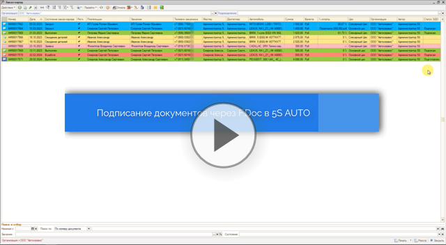](https://www.5systems.ru/sites/default/files/2024-03/%D0%9F%D0%BE%D0%B4%D0%BF%D0%B8%D1%81%D0%B0%D0%BD%D0%B8%D0%B5%20%D0%B4%D0%BE%D0%BA%D1%83%D0%BC%D0%B5%D0%BD%D1%82%D0%BE%D0%B2%20%D1%87%D0%B5%D1%80%D0%B5%D0%B7%20F.Doc%20%D0%B2%205S%20AUTO.mp4)

Интеграция используется для подписания документов Заказ-наряд, Реализация товаров, Заказ покупателя и Заявка на ремонт.

В реестре документов отображается колонка “Статус ЭДО”, в которой можно отследить статус документа ЭДО – “Подготовлен”, “Подписан” и т.д.:

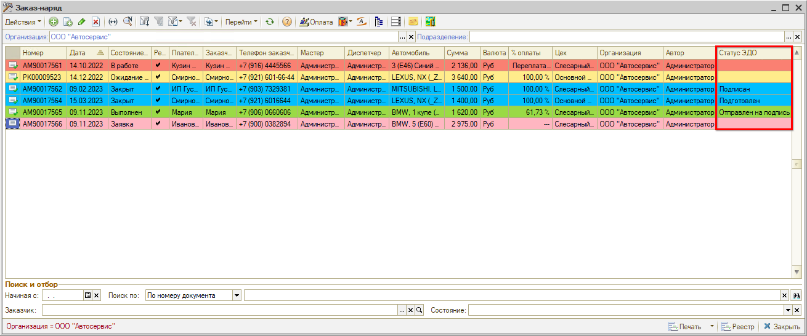

#### 1. Формирование печатной формы документа

Для отправки документа клиенту на подпись следует в реестре документов выбрать нужный документ, выделить кликом мыши и нажатием на кнопку “Печать” открыть печатную форму документа.

*Примечание:* Печатные формы должны соответствовать определенным критериям – см. п. [Подготовка печатных форм](#подготовка-печатных-форм).

На верхней панели печатной формы следует нажать кнопку *“Отправить в ЭДО → Отправить в F.Doc”:*

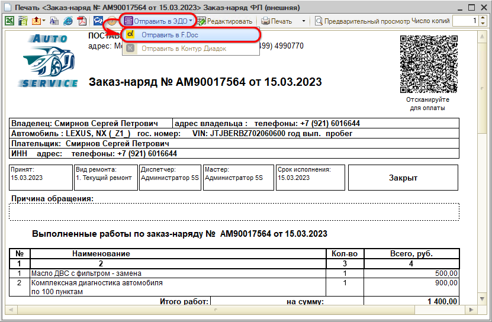

Открывается окно записи документов ЭДО:

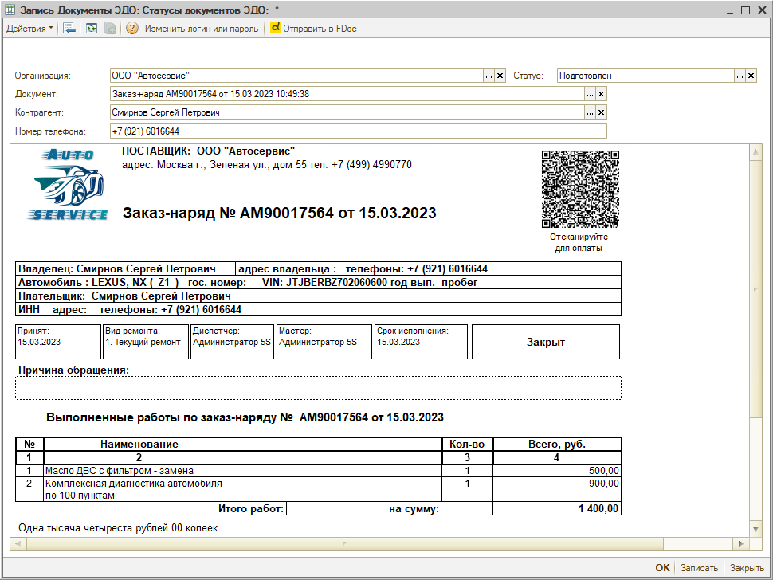

*Примечание 1: При первой отправке, в случае отсутствия подключения к сервису сначала также откроется форма отправки заявки на подключение – см.* [*ниже*](#отправка-заявки-на-подключение-к-сервису)*.* После подключения к сервису становится доступна отправка документа в F.Doc.

*Примечание 2:* В случае если данный документ уже был отправлен на подпись клиенту, программа выдаст *предупреждение пользователю о повторной отправке:*

****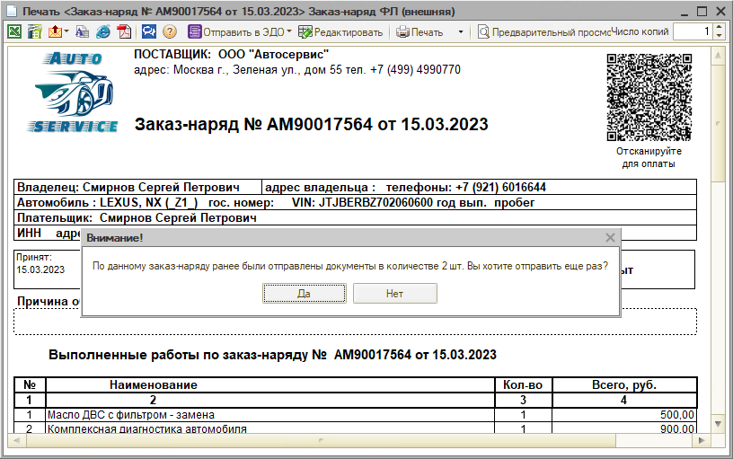****

В открывшемся окне записи документов ЭДО следует проверить все параметры, при необходимости заполнить или изменить.

*Внимание!* Обязательно должен быть правильно заполнен номер телефона клиента, а также полные фамилия, имя и отчество, т.к. они будут указаны в штампе электронной подписи.

Затем нужно нажать кнопку *“Отправить в F.Doc”:*

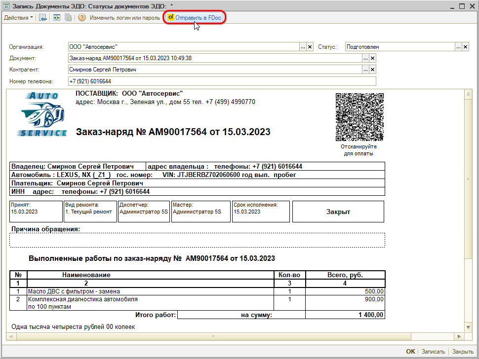

После этого документ открывается в браузере\* на сайте F.Doc.

*\*Внимание: Браузер по умолчанию* должен быть *любой, кроме Internet Explorer!*

#### 2. Открытие документа в браузере

На открывшейся веб-странице F.Doc проверьте правильность заполнения документа и номер телефона клиента:

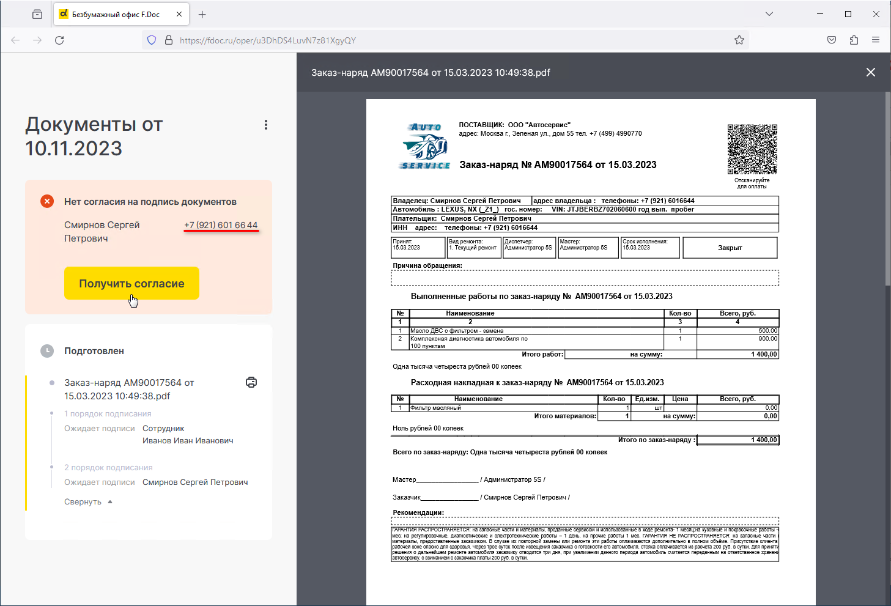

#### 3. Получение согласия об обмене электронными документами

Если клиент уже подписывал документы с компанией через F.Doc, а также не менял номер телефона или Ф. И. О., можно сразу перейти к [Подписанию документа](#4-подписание-документа). При первой отправке документов данному клиенту или при изменении его данных сначала необходимо получить его согласие на подпись.

Для этого нужно нажать кнопку “Получить согласие” (см. выше). Статус документа изменяется на “Ожидаем подписи”:

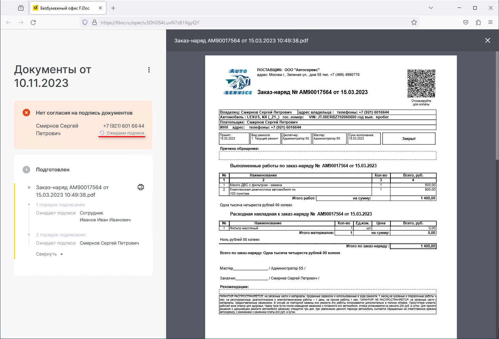

Клиенту на телефон приходит SMS со ссылкой на подписание согласия вида *“F.Doc. Документы: https://fdoc.ru/cln/UXeMJZYM?c=888888, код: 888888”:*

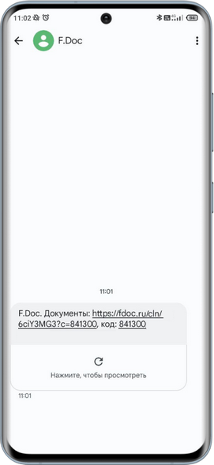

Клиенту необходимо перейти по ссылке и подтвердить автоматически подтянутый код из SMS:

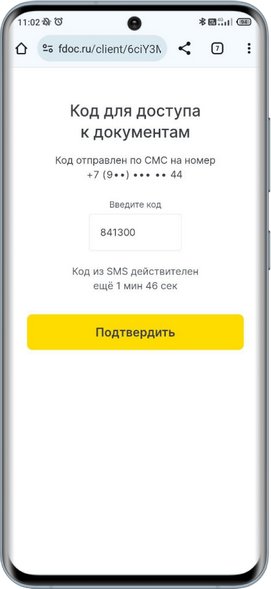

После этого клиент получает доступ к документам F.Doc, необходимо ознакомиться с согласием на ЭП и подписать его:

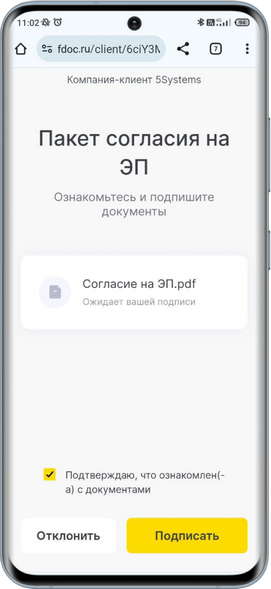 &nbsp;&nbsp;&nbsp;&nbsp;&nbsp;&nbsp;&nbsp; 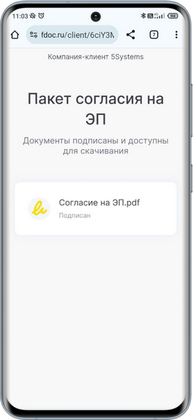

На форме в браузере появляется отметка о получении согласия клиента на подпись документа:

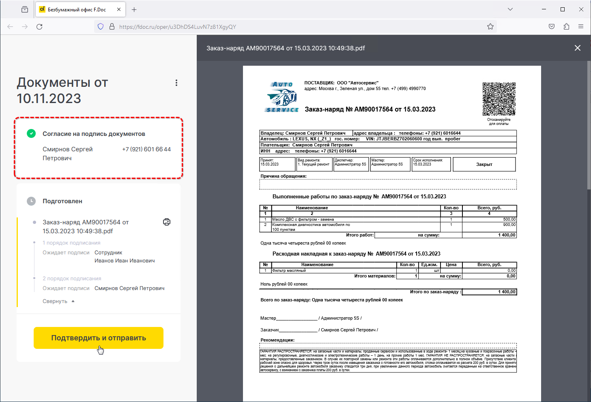

После этого можно перейти к подписанию самого документа.

#### 4. Подписание документа

Для подписи документов от лица компании и отправки документа клиенту следует нажать кнопку “Подтвердить и отправить” (см. [выше](#knopka_otprav)). Появляется уведомление “Вы успешно подписали документы”, и сразу статус меняется на “Отправлен на подпись. Ожидаем подписания”:

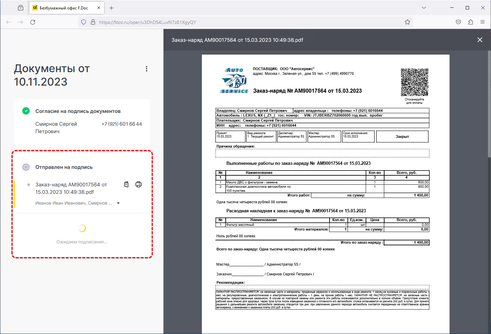

Клиенту снова приходит сообщение со ссылкой на подпись документа вида *“F.Doc. Документы: https://fdoc.ru/cln/UXeMJZYM?c=888888, код: 888888”.*

Если вы ошиблись, аннулируйте документ и отправьте новый.

При переходе по ссылке клиенту также нужно ввести код доступа и нажать кнопку “Подтвердить” (см. [выше](#podtverd)). Затем подписать документ:

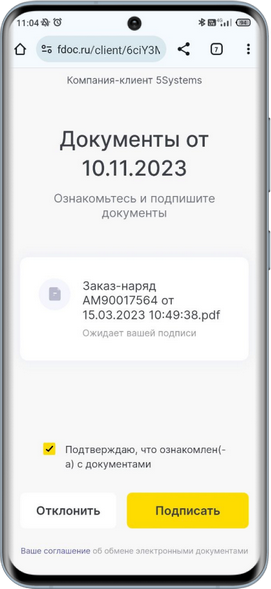 &nbsp;&nbsp;&nbsp;&nbsp;&nbsp;&nbsp;&nbsp;&nbsp; 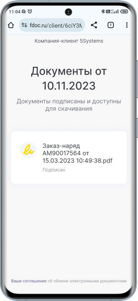

После подписания документа обеими сторонами на документе отобразится синий штамп визуализации электронной подписи, а статус изменится на “Подписан”:

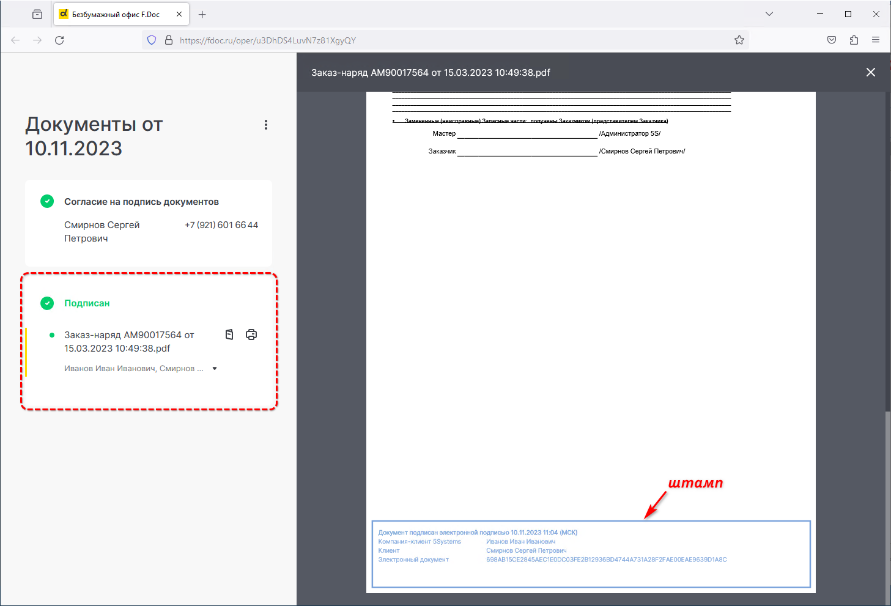

На штампе подписанного документа будут указаны фамилия, имя и отчество авторизованного сотрудника. При установке подписи со стороны компании будут использованы те Ф. И. О., которые были указаны при регистрации сотрудника в F.Doc – вне зависимости от Ф. И. О. в программе.

Просмотреть и скачать документ можно в любое время. Документы доступны: клиентам по ссылке из SMS, сотрудникам – в системе.

См. инструкцию: [https://fdoc.ru/documents/instruktsiya-dlya-sotrudnika.pdf](https://fdoc.ru/documents/instruktsiya-dlya-sotrudnika.pdf).

### Уведомления

При подписании клиентом документа в программе всплывает уведомление:

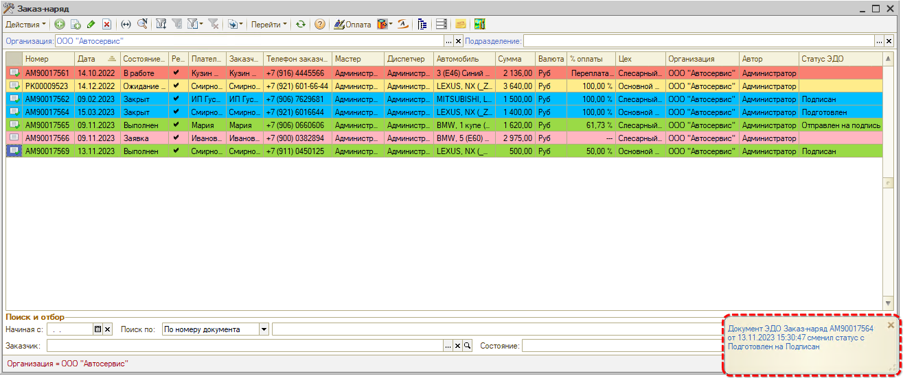

При клике на текст уведомления производится переход в документ, с которым можно продолжить работу.

Уведомление о смене статуса документов ЭДО подключается автоматически при включении интеграции. Настройка уведомления производится через справочник "Уведомления" – подробнее см. статьи "[Работа с уведомлениями](../../CRM/Работа%20с%20уведомлениями/rabota-s-uvedomleniyami.md)" и "[Настройка параметров уведомлений](../../CRM/Настройка%20параметров%20уведомлений/nastroyka-parametrov-uvedomleniy.md)".

### Смена статусов

Статусы документов ЭДО меняются автоматически с помощью регламентного задания – см. в разделе "[Настройка параметров подключения к F.Doc](#вкладка-основные-настройки)". Смену статуса можно отследить в реестре документов – см. [выше](#status_v_reestre).

Также для проверки смены статуса у документа можно перейти из документа по кнопке *“Перейти → Статусы документов ЭДО”:*

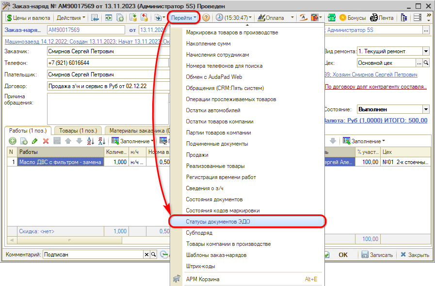

Либо из формы записи документа нажатием на кнопку “Найти в списке”:

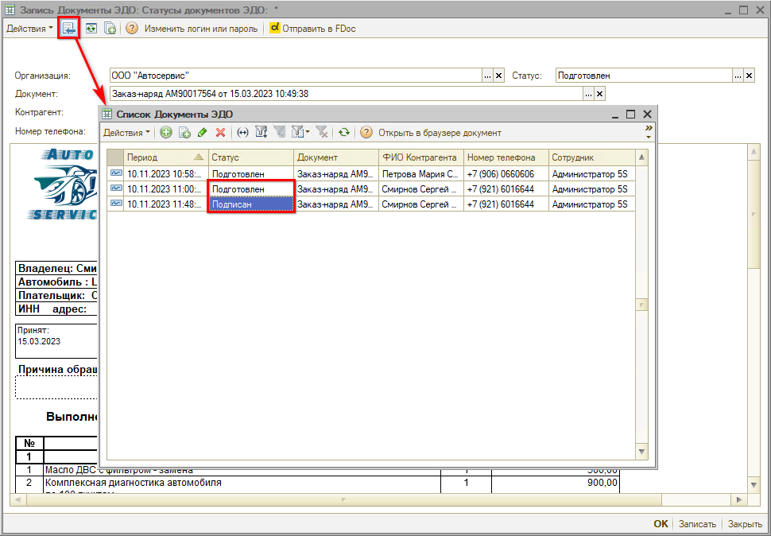

В рассматриваемом примере статус документа изменился на “Подписан”.

Список документов выводится с отбором по текущему сотруднику.

Кнопка *“Открыть в браузере документ”* позволяет открыть любой из документов списка в браузере для просмотра:

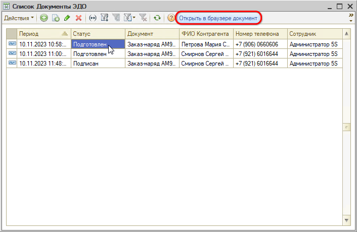

При необходимости можно продолжить отправку документов:

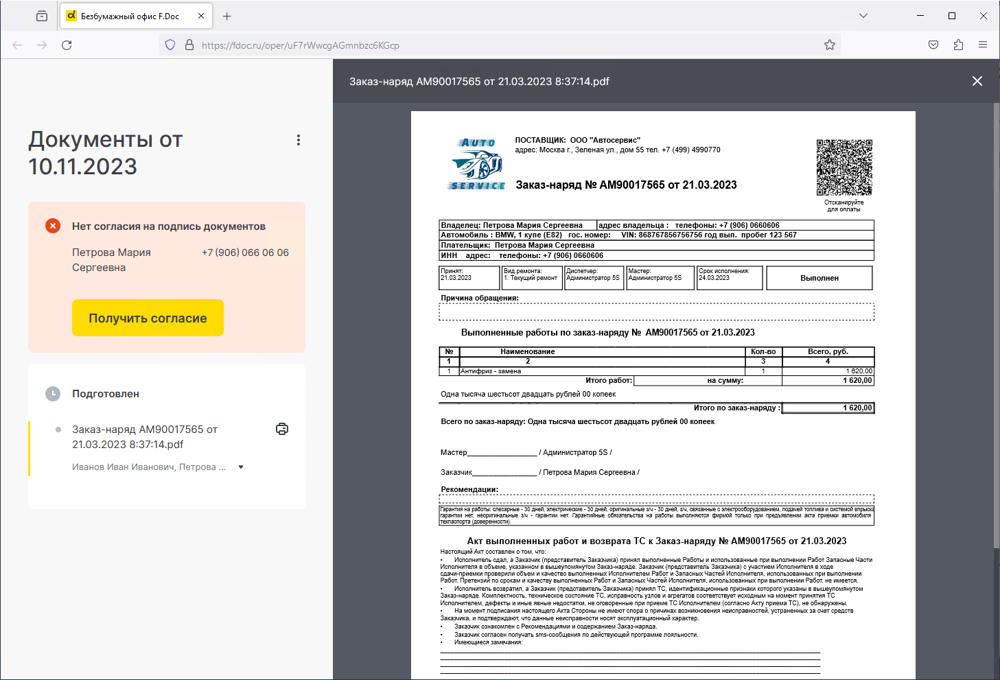

В случае внесения изменений в документ необходимо отправить его полностью заново, начиная с [открытия печатной формы](#1-формирование-печатной-формы-документа).

### Авторизация сотрудников в F.Doc

Для того, чтобы получить возможность отправлять документы на подпись через F.Doc и подписывать их от лица компании, сотрудник должен быть предварительно зарегистрирован в сервисе. У каждого сотрудника должен быть логин и пароль.

Администратор предварительно регистрирует всех нужных сотрудников в F.Doc – см. п. [Регистрация сотрудников в F.Doc](#регистрация-сотрудников-в-fdoc). Затем настраивает доступ в карточке интеграции – см. “[Доступ к F.Doc](#вкладка-доступ-к-fdoc)”.

Зарегистрированные сотрудники получают на указанные при регистрации контактные данные личные логин и пароль.

У зарегистрированного в F.Doc пользователя при отправке документа в ЭДО открывается форма авторизации:

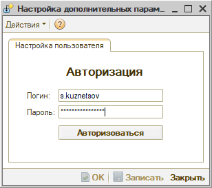

Требуется ввести логин и пароль, *полученные от F.Doc* на указанные при регистрации адрес электронной почты и мобильный телефон, и нажать на кнопку "Авторизоваться".

При необходимости можно переавторизоваться в сервисе – войти под другими авторизационными данными. Для этого нужно нажать кнопку “Изменить логин и пароль”:

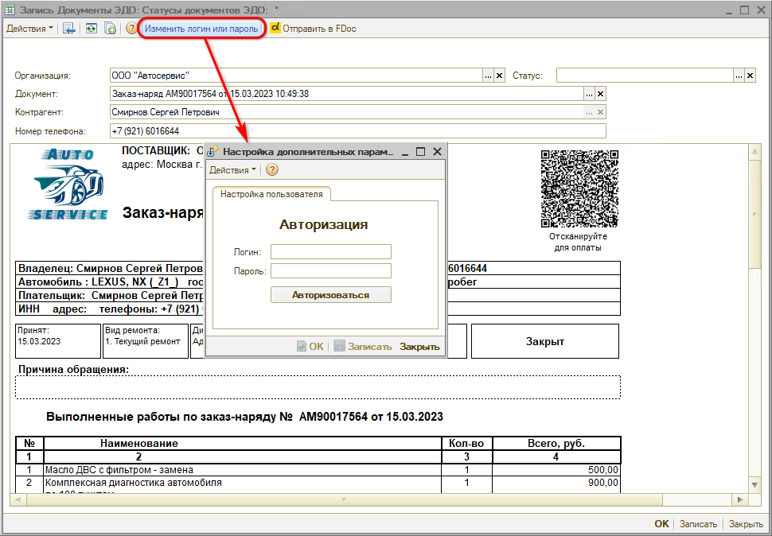

## Настройка сервиса

### Отправка заявки на подключение к сервису

При первой попытке отправить документ через F.Doc, в случае отсутствия подключения к сервису, открывается форма отправки *заявки на подключение:*

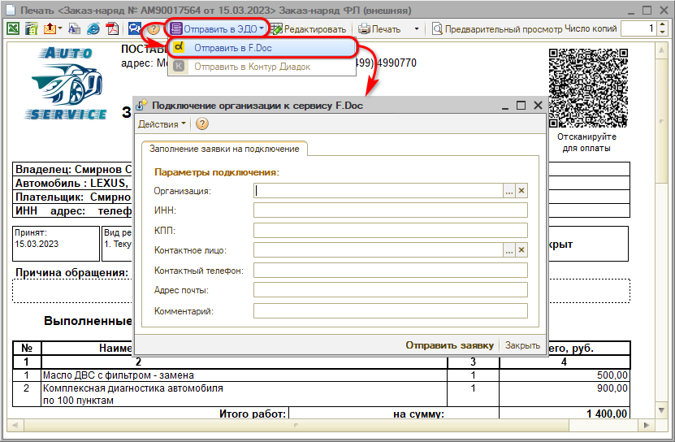

Также открыть форму заявки на подключение можно через настройку интеграции нажатием на кнопку *“Методы интеграции → Заявка на подключение к F.Doc”:*

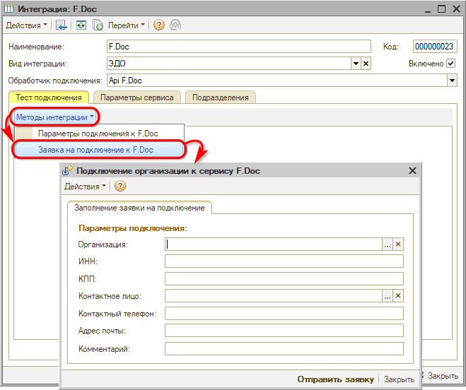

На форме заявки необходимо заполнить все авторизационные данные:

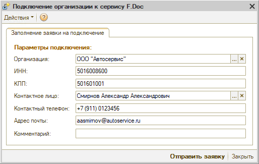

- *Организация* – требуется выбрать нужную организацию из справочника;
- *ИНН* и *КПП* подтягиваются автоматически из карточки организации;
- *Контактное лицо* – сотрудник, от имени которого отправляется заявка, по умолчанию подтягивается Ф. И. О. текущего пользователя;
- *Контактный телефон* и *Адрес почты* – заполняются автоматически, если контактная информация предварительно заполнена в карточке сотрудника. Почта должна быть в определенном формате: в виде *ххх@хх.хх,* без пробелов и недопустимых символов – см. подсказку при наведении курсора на данное поле.

После заполнения всех параметров следует нажать кнопку “Отправить заявку”. Программа выдаст следующее сообщение:

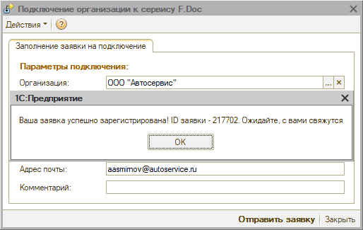

Далее следует ожидать, пока по указанным контактам с вами свяжутся сотрудники F.Doc.

При попытке повторно отправить заявку на подключение по этой же организации программа выдаст предупреждение:

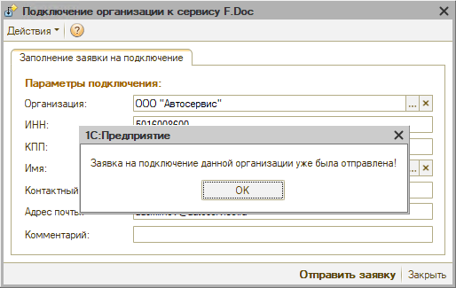

### Регистрация сотрудников в F.Doc

Чтобы сотрудник мог работать с F.Doc, сначала нужно зарегистрировать его в системе:

*Шаг 1:* Пройдите по ссылке, полученной на e-mail при заключении договора.

*Шаг 2:* Введите код доступа (API Key), полученный вами в email-сообщении вместе со ссылкой на страницу регистрации сотрудников.

*Шаг 3:* Введите данные сотрудника: Ф. И. О., номер телефона, e-mail и логин.

Логин и пароль для авторизации придут сотруднику на указанные телефон и e-mail. Регистрационные данные нужно будет использовать при [авторизации](#авторизация-сотрудников-в-fdoc) в сервисе.

*Подробную информацию см. на сайте F.Doc:* [*https://fdoc.ru/instructions*](https://fdoc.ru/instructions)*,* [*https://fdoc.ru/faq*](https://fdoc.ru/faq)*.*

После регистрации в сервисе F.Doc можно переходить к настройке интеграции в системе.

### Настройка интеграции

#### 1. Создание интеграции

Необходимо создать новый элемент справочника “Интеграции”:

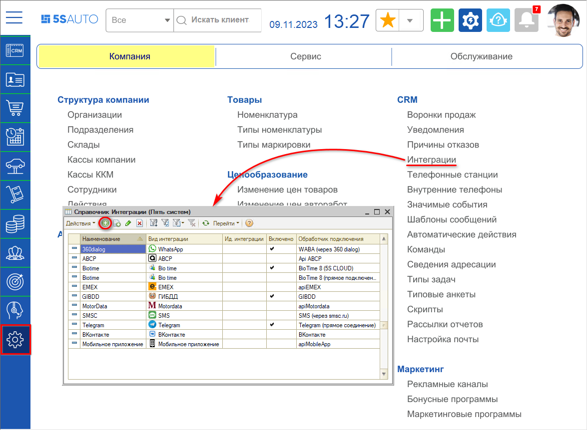

#### 2. Заполнение параметров интеграции

В карточке интеграции следует выбрать вид интеграции “ЭДО”, обработчик подключения “F.Doc”, установить галочку “Включено” и сохранить:

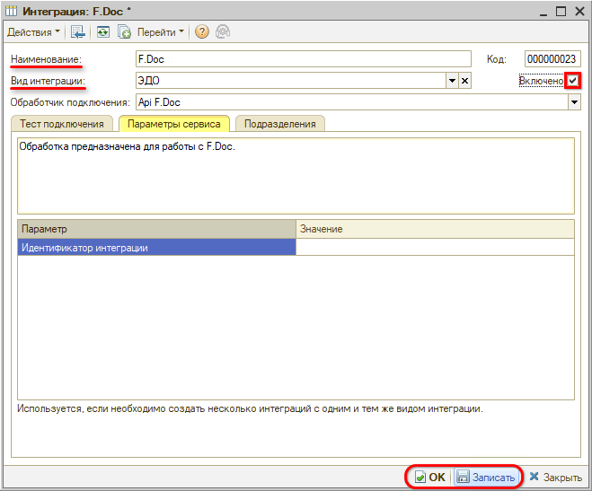

Затем нужно закрыть форму настройки интеграции и открыть снова.

При включении интеграции также автоматически подключаются [уведомления](#уведомления) о смене статусов документов.

#### 3. Настройка параметров подключения к F.Doc

Для перехода к настройке параметров подключения следует на вкладке “Тест подключения” нажать кнопку *“Методы интеграции → Параметры подключения к F.Doc”:*

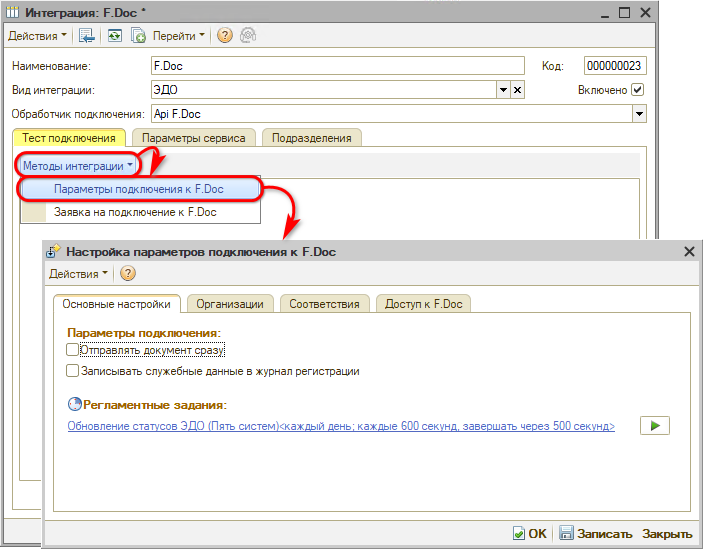

Настройки осуществляются на следующих вкладках:

##### Вкладка “Основные настройки”

1. Параметры подключения:
   - *Отправлять документ сразу* – при включении документ будет оправляться в F.Doc без нажатия кнопки на форме записи;
   - *Записывать служебные данные в журнал регистрации*.
2. Параметры для *Регламентного задания* заданы по умолчанию:

   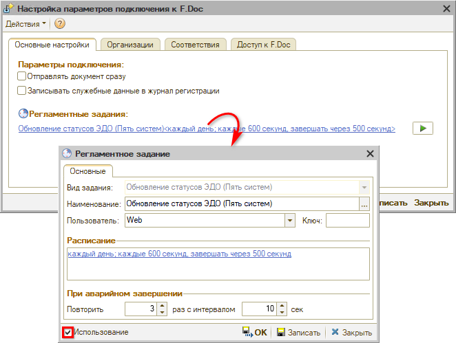

Фоновое задание "Обновление статусов ЭДО" запускается под роботом. Для пользователя "Робот" в интеграции должен быть настроен доступ к работе с сервисом F.Doc, т.е. указаны логин и пароль – см. [ниже](#вкладка-доступ-к-fdoc).

*Примечание:* Логин и пароль для робота можно взять из авторизационных данных одного из реальных сотрудников, которому настроен доступ к сервису.

##### Вкладка “Организации”

На вкладке “Организации” производится настройка подключения организаций к сервису F.Doc:

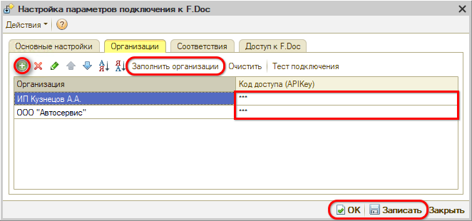

Для заполнения таблицы следует воспользоваться кнопкой “Заполнить организации” либо добавить организации по одной вручную. При необходимости можно удалить лишние строки, использовать сортировку либо изменить порядок строк.

Необходимо заполнить параметр “Код доступа (APIKey)”, присланный ранее сотрудниками F.Doc (см. [выше](#отправка-заявки-на-подключение-к-сервису)), для каждой организации и нажать кнопку “Записать” или “ОК”.

Кнопка “Тест подключения” используется для проверки подключения – см. раздел “[Тест подключения](#4-тест-подключения)”.

##### Вкладка “Соответствия”

Предварительно должен быть заполнен справочник соответствия статусов “Статусы документов ЭДО”. В карточке каждого статуса в таблице подбора синонимов должно быть указано наименование статуса в интеграции F.Doc, соответствующее наименованию данному элементу справочника:

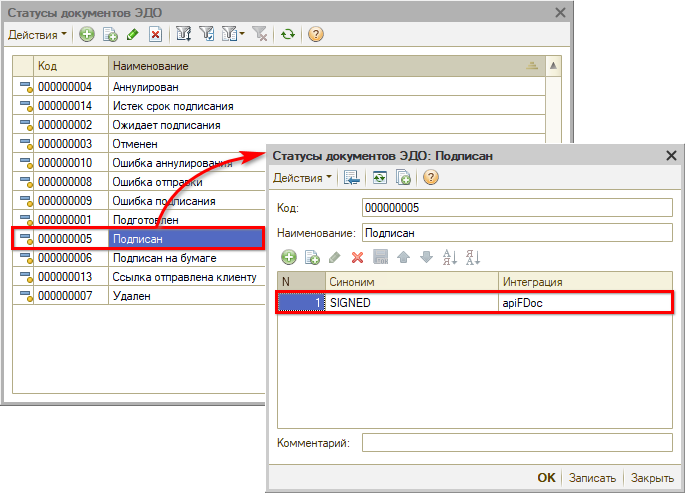

Если справочник заполнен, нажатием на кнопку “Заполнить статусы F.Doc” производится заполнение таблицы соответствия статусов:

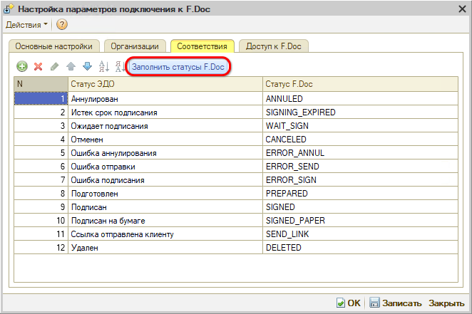

##### Вкладка “Доступ к F.Doc”

На вкладке “Доступ к F.Doc” производится настройка доступа сотрудников к работе с сервисом F.Doc.

Нажатием кнопки “Заполнить сотрудников” производится автозаполнение таблицы сотрудниками с отбором по текущей организации:

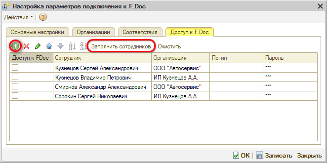

Также можно добавить сотрудников вручную, изменить порядок строк или удалить лишние.

В столбце “Доступ к F.Doc” необходимо установить признак *пользователя F.Doc* для тех пользователей, которые будут работать с сервисом – отметить галочками сотрудников.

“Пользователь F.Doc” – это свойство Сотрудника:

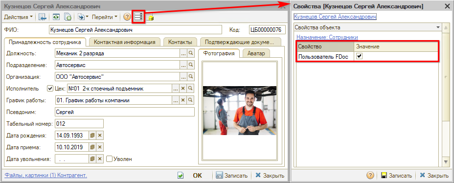

Если эта галочка установлена, то при нажатии в печатной форме “[Отправить в F.Doc](#1-формирование-печатной-формы-документа)” производится проверка на получение логина и пароля.

Если галочка не установлена – у пользователя появится уведомление “У вас нет доступа к F.Doc”.

После этого пользователи F.Doc получают доступ к авторизации в системе – каждый сотрудник должен самостоятельно ввести свои логин и пароль, полученные на свой телефон или email при регистрации в сервисе.

Внесенные логины и пароли сохраняются в справочнике "Доступ к F.Doc" в зашифрованном виде – для обеспечения безопасности хранения личных данных:

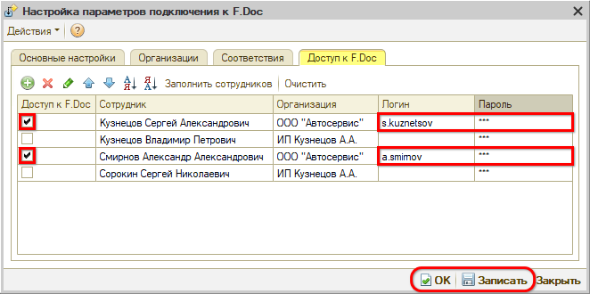

Внесенные данные необходимо записать нажатием на кнопку “ОК” или “Записать”.

#### 4. Тест подключения

Для проверки подключения используется кнопка *“Тест подключения”* на вкладке “Организации”:

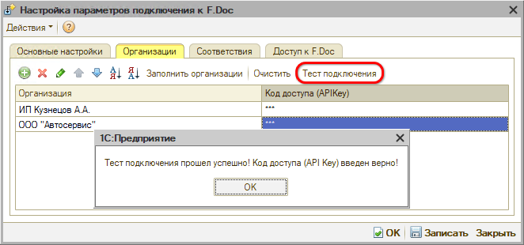

Если код доступа введен неверно, система выдаст сообщение об ошибке подключения:

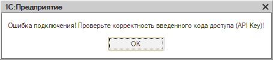

### Подготовка печатных форм

Печатные формы, используемые для подписания в электронном виде, должны соответствовать следующим критериям:

- не должно быть лишних формулировок, нехарактерных для электронного подписания, например, “Подписано собственноручно”, “Подписано в двух экземплярах” и др.;
- должно быть место для штампа;
- при необходимости (опционально) может быть добавлена формулировка “Документ подписан при помощи ПЭП”.

## Автоматическая отправка документов

### Описание

В системе есть возможность настроить отправку документов на подпись через F.Doc автоматически при записи документа, без открытия печатных форм и перехода в другие окна.

При нажатии кнопки “Записать” в документе, например, заказ-наряде, документ сразу будет отправляться клиенту на подпись:

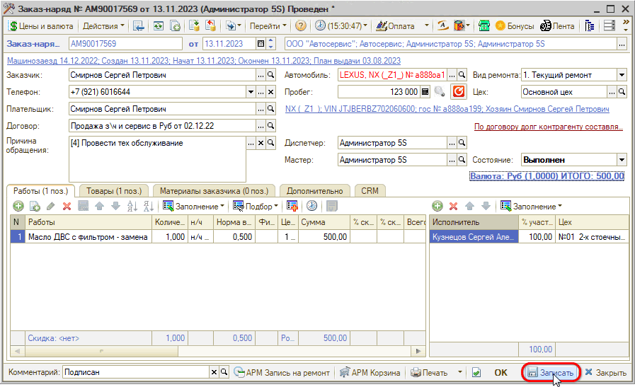

Для клиентов, с которыми еще не подписано согласие на электронный документообмен, сначала будет отправляться согласие на подпись, затем автоматически сам документ.

Для использования механизма необходимо предварительно тщательно настроить условия, при которых документ будет отправляться на подпись, и внимательно проверять правильность заполнения всех полей документа.

При подписании документа клиентом будет [изменяться статус](https://docs.google.com/document/d/1SXZWZbaxYPNfgKRjiNPL2w2RVVg2kSPezEx8gDL9QBw/edit#heading=h.q5wt557p0fj8) документа: отследить смену статуса можно в реестре документов, либо в списке документов ЭДО. Также программа будет отправлять пользователю [уведомления](https://docs.google.com/document/d/1SXZWZbaxYPNfgKRjiNPL2w2RVVg2kSPezEx8gDL9QBw/edit#heading=h.d1720pwxnrar) о смене статуса.

### Настройка автоматической отправки документов ЭДО

Настройка отправки документов в фоновом режиме осуществляется через механизм *значимых событий.* См. статьи [Преднастроенные значимые события](../../Сообщения/Преднастроенные%20значимые%20события/prednastroennye-znachimye-sobytiya.md) и [Настройка автоматической отправки сообщений](../../Сообщения/Настройка%20автоматической%20отправки%20сообщений%20через%20мессенджеры/nastroyka-avtomaticheskoy-otpravki-soobscheniy-cherez-messendzhery.md#настройка-значимого-события).

В справочнике “Значимые события” следует создать новый элемент и задать параметры:

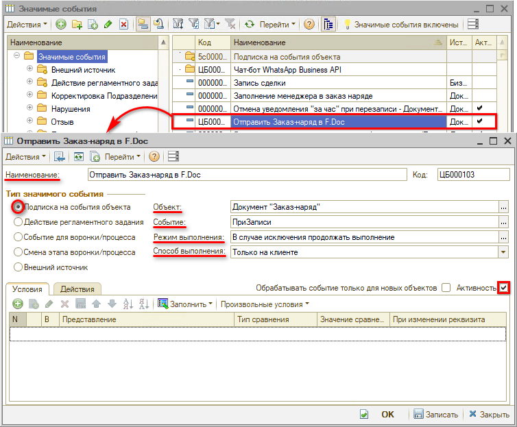

Параметры:

- *Тип события* – Подписка на событие.
- *Источник* – необходимо выбрать документ\*, например, документ “Заказ-наряд”. 
  *\*Для каждого типа документа, отправляемого на подпись через F.Doc – Заказ покупателя, Реализация товара, Заявка на ремонт – должно быть создано отдельное значимое событие.*
- *Событие* – вид события “При записи”.
- *Режим выполнения* – “В случае исключения продолжать выполнение”.
- *Способ выполнения* – “Только на клиенте”.

Также должен быть установлен флаг *“Активность”*.

Затем следует задать *наименование* события, например, “Отправить Заказ-наряд в F.Doc”. При необходимости можно настроить нужные условия для созданного значимого события на вкладке “Условия”.

Затем необходимо *записать* созданное значимое событие нажатием на кнопку “Записать” или “ОК”.

После этого требуется настроить *действие на значимое событие.* Для этого нужно перейти на вкладку “Действия” и нажать кнопку “Добавить”:

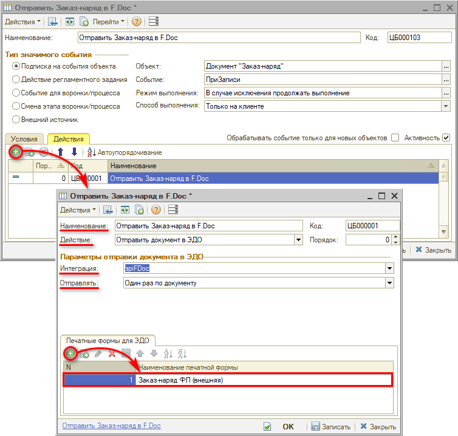

Для создаваемого действия необходимо задать параметры:

- *Действие* – выбрать Вид действия “Отправить документ в ЭДО”.
- *Интеграция* – Api F.Doc.
- *Отправлять* – “Один раз по документу” либо “При каждой записи документа”.

Также следует задать *наименование* действия, например, “Отправить Заказ-наряд в F.Doc”.

Затем в таблице нужно выбрать *[печатную форму](../../Автосервис/Работа%20с%20Заказ-нарядами/Заказ-наряды/zakaz-naryady.md#печать-заказ-наряда)* документа, которую следует отправлять клиентам на подпись.

Есть возможность добавить несколько печатных форм, и отправлять на подпись пакет документов. В данном случае печатные формы будут отправляться по одной – каждая отдельным сообщением.

Созданное действие необходимо *записать* нажатием на кнопку “Запись” или “ОК”, а также сохранить изменения в значимом событии.

Затем следует аналогично создать значимые события для остальных типов документов ЭДО – Заказов покупателя, Реализаций товаров и Заявок на ремонт.

---

**Теги:** F.Doc, безбумажный офис, электронная подпись, документы, интеграция

