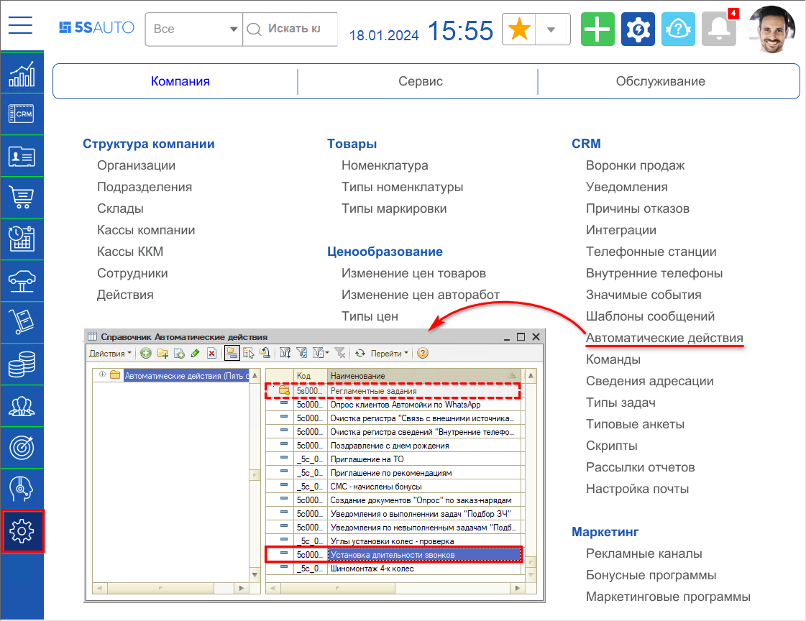
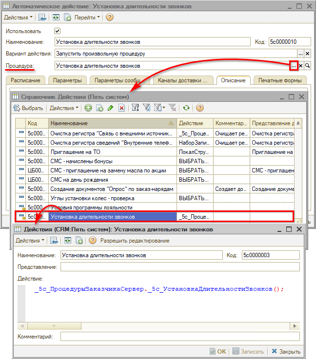
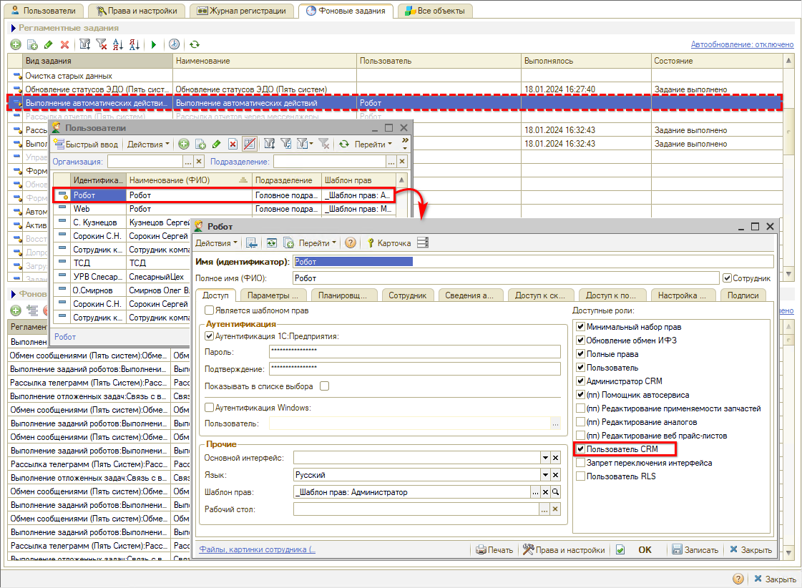
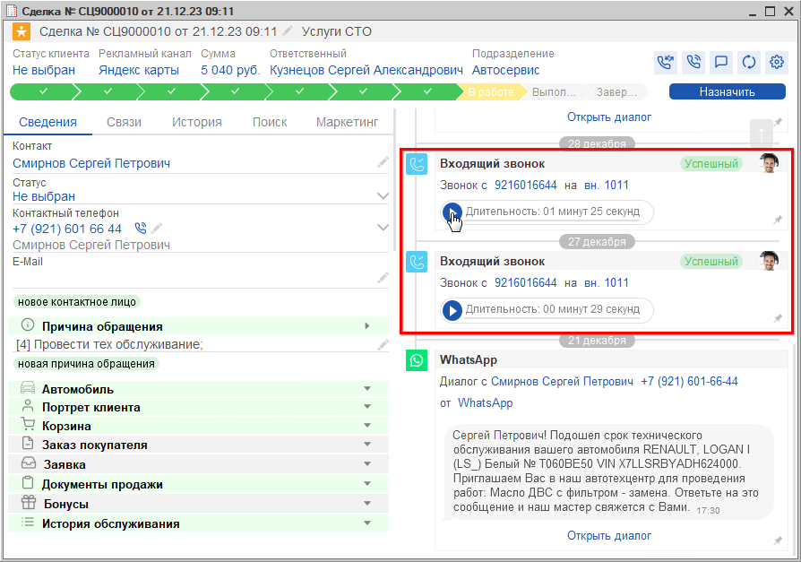
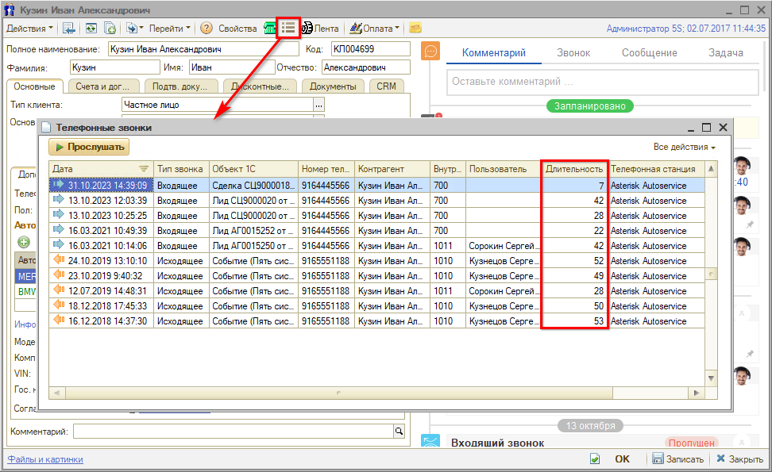
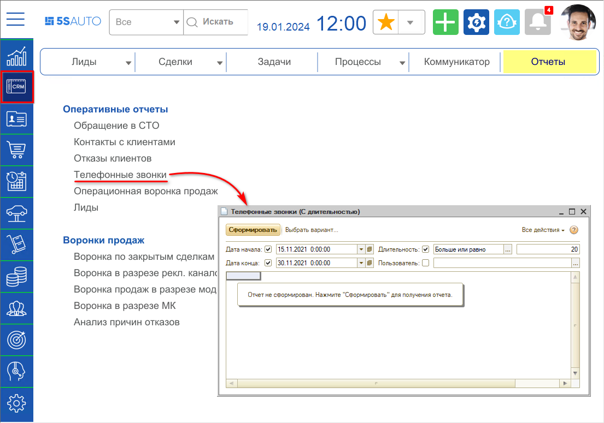
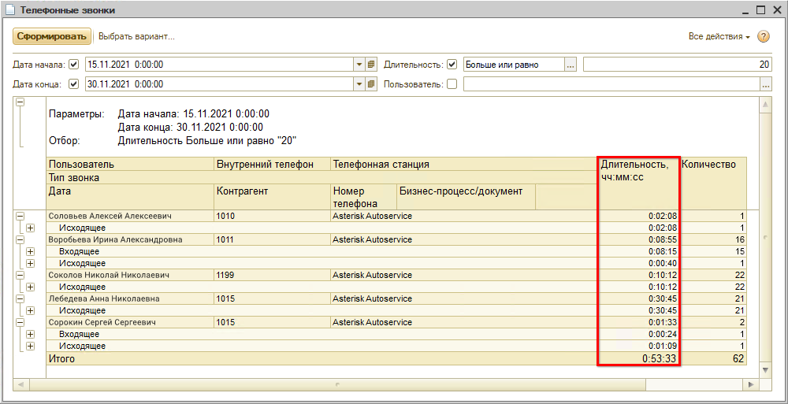

# Импорт и отображение длительности звонков из телефонии

<table><tr><td><b>Время чтения:</b> 8 мин.</td><td><b>Обновлено:</b> 19.01.2024</td></tr></table>

Источник: https://www.5systems.ru/help/import-i-otobrazhenie-dlitelnosti-zvonkov-iz-telefonii

## Содержание

1. [Введение](#введение)
2. [Настройка импорта длительности звонков](#настройка-импорта-длительности-звонков)
3. [Настройка прав Робота регламентных операций](#настройка-прав-робота-регламентных-операций)
4. [Отображение длительности звонков](#отображение-длительности-звонков)

## Введение

В программе предусмотрена фиксация и отображение длительности звонков сотрудников клиентам из телефонии.

## Настройка импорта длительности звонков

Чтобы длительность звонков импортировалась из телефонии и сохранялась в программе необходимо активировать регламентное задание. Для этого выполните следующие действия:

1. Откройте справочник "Автоматические действия" *(Администрирование → Компания → CRM → Автоматические действия)*. Перейдите в группу "Регламентные задания", найдите и откройте действие "Установка длительности звонков":  
   
2. Установите флажок "Использовать" и проверьте наполнение "Процедуры". 
   Чтобы к настраиваемому автоматическому действию подтягивалась *Процедура*, требуется правильная настройка Действия:  
     
   Для проверки перейдите к справочнику "Действия (Пять систем)", откройте (кнопкой "Изменить") действие "Установка длительности звонков". Текст действия должен быть: *_5с_ПроцедурыЗаказчикаСервер._5с_УстановкаДлительностиЗвонков();*
3. Нажмите "Записать" и "Ок".

## Настройка прав Робота регламентных операций

Для того чтобы исполнялись автоматические действия, у "Робота регламентных операций" должна быть установлена [роль](https://5systems.ru/help/polzovateli#sozd) "Пользователь CRM".

Для этого требуется в справочнике "Пользователи" найти пользователя "Робот регламентных операций", открыть карточку пользователя, в поле "Доступные роли" установить флажок на роли "Пользователь CRM" и записать:

## Отображение длительности звонков

Длительность звонков можно посмотреть:

1. В сделке:

   

2. В истории звонков с клиентом:

   

3. В отчете "Телефонные звонки":

   

   

---

**Теги:** телефония, длительность звонков, импорт, отчеты, звонки

