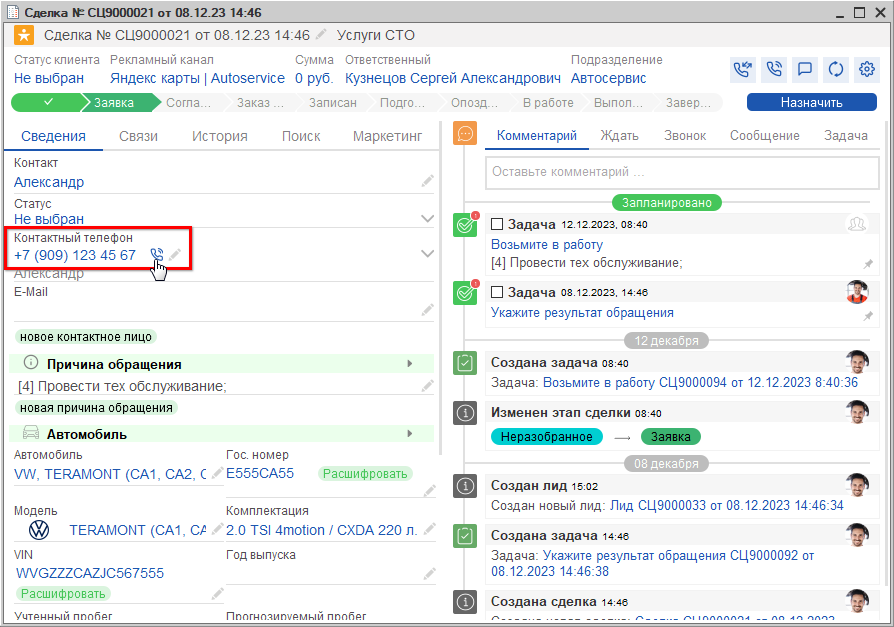
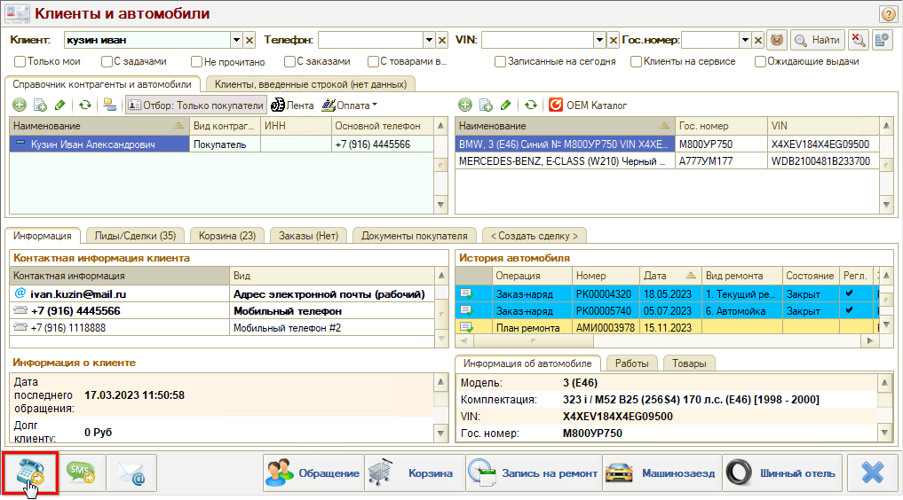
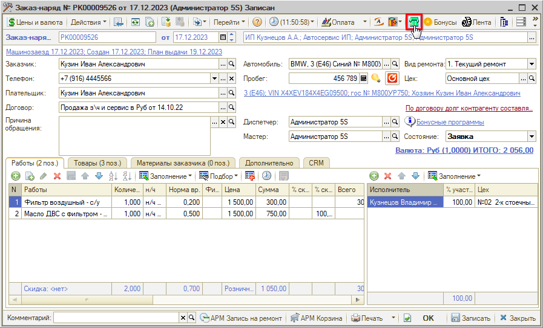
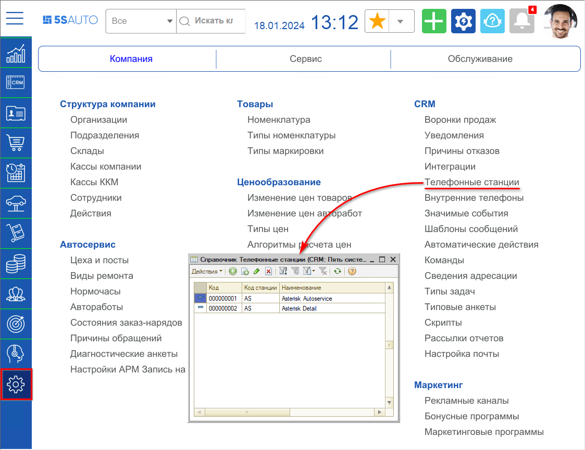
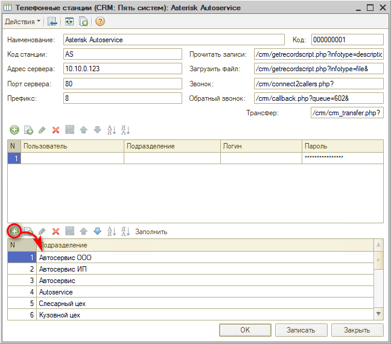
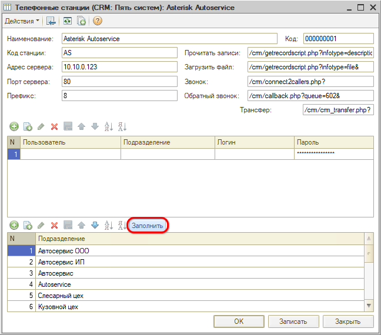
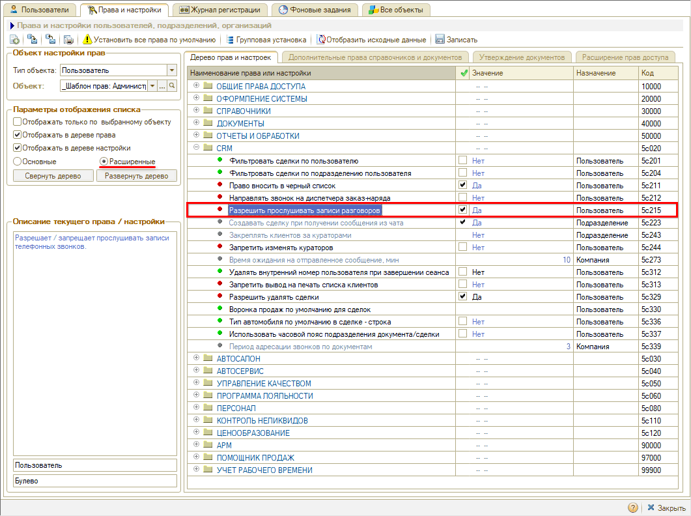

# Настройка интеграции с телефонией

<table><tr><td><b>Время чтения:</b> 10 мин.</td><td><b>Обновлено:</b> 12.03.2026</td></tr></table>

Источник: https://www.5systems.ru/help/nastroyka-integracii-s-telefoniey

## Содержание

1. [Введение](#введение)
2. [Пример работы настроенной интеграции](#пример-работы-настроенной-интеграции)
   - [При звонке](#при-звонке)
   - [При прослушивании записи разговора](#при-прослушивании-записи-разговора)
3. [Настройка](#настройка)
   - [Настройка телефонных станций](#настройка-телефонных-станций)
   - [Настройка прав](#настройка-прав)

## Введение

Для того, чтобы совершать звонки из программы и прослушивать телефонные разговоры, должна быть настроена интеграция с телефонной станцией.

## Пример работы настроенной интеграции

### При звонке

Когда пользователь программы инициирует звонок клиенту, например, из Сделки:

из АРМ "Клиенты и автомобили":

или Заказ-наряда:

программа по подразделению пользователя ищет телефонную станцию в справочнике "Телефонные станции".

Через адрес[:порт] сервера плюс значение, указанное в поле "Звонок", найденной телефонной станции вызывается скрипт для осуществления звонка.

### При прослушивании записи разговора

Когда пользователь программы инициирует прослушивание разговора из *[Ленты событий](../../../Работа%20с%20клиентами/Лента%20событий/lenta-sobytiy.md#прослушивание-разговоров-с-клиентами)* или из Сделки:

программа по подразделению пользователя ищет телефонную станцию в справочнике "Телефонные станции".

Через адрес[:порт] сервера плюс значение, указанное в поле "Прочитать файл", вызывается скрипт, который находит файл с записью.

Через адрес[:порт] сервера плюс значение, указанное в поле "Загрузить файл", вызывается скрипт, который загружает файл для прослушивания записи.

*Примечание:* У пользователя должно быть включено право "Разрешить прослушивать записи разговоров" – см. [ниже](#настройка-прав).

## Настройка

### Настройка телефонных станций

***<В разработке новый функционал>***

Настройка осуществляется через справочник *"Телефонные станции" (Администрирование → Компания → CRM → Телефонные станции):*

Возможна ситуация, когда для части подразделений подключена одна телефония, а для части — другая. Для этого в записи справочника "Телефонные станции" указывается принадлежность к подразделению(-ям).

Если в организации используется несколько телефонных станций, то принадлежность к подразделению(-ям) для конкретной телефонной станции заполняется по кнопке "Добавить" командного меню таблицы с подразделениями:

Если в организации используется одна телефонная станция, то принадлежность к подразделению(-ям), заполняется по кнопке "Заполнить" командного меню таблицы с подразделениями:

В данном случае автоматически добавляются все подразделения.

Помимо принадлежности к подразделениям для телефонной станции необходимо указать ее наименование, код и **параметры интеграции**:

- *Адрес сервера* - адрес веб-сервера телефонии.
- *Порт сервера* - порт веб-сервера телефонии.
- *Префикс* - первый символ номера телефона.
- Скрипты, через которые будет происходить интеграция с телефонией. Скрипты прописываются в полях:
  - *Прочитать записи*
  - *Загрузить файл*
  - *Звонок*

Для самостоятельной настройки телефонной станции запросите скрипты у технической поддержки компании "5 СИСТЕМ".

### Настройка прав

Для того, чтобы пользователь имел доступ к прослушиванию записей телефонных звонков, у него должно быть настроено расширенное право *"Разрешить прослушивать записи разговоров"* – установлено в значение "Да":

---

**Теги:** телефония, интеграция, настройка, АТС, звонки

