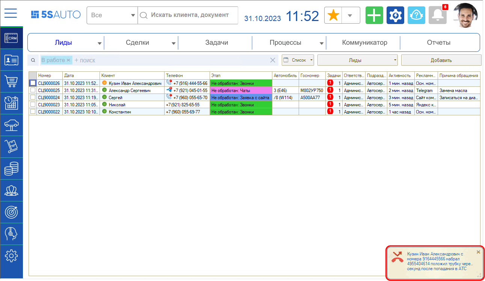
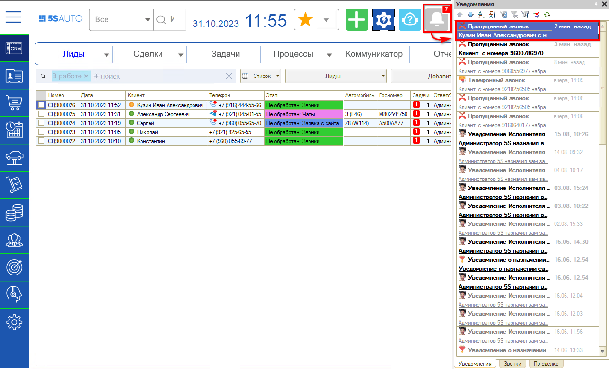
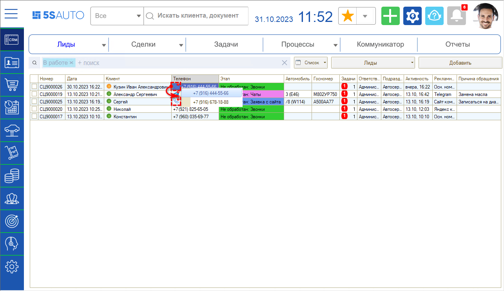
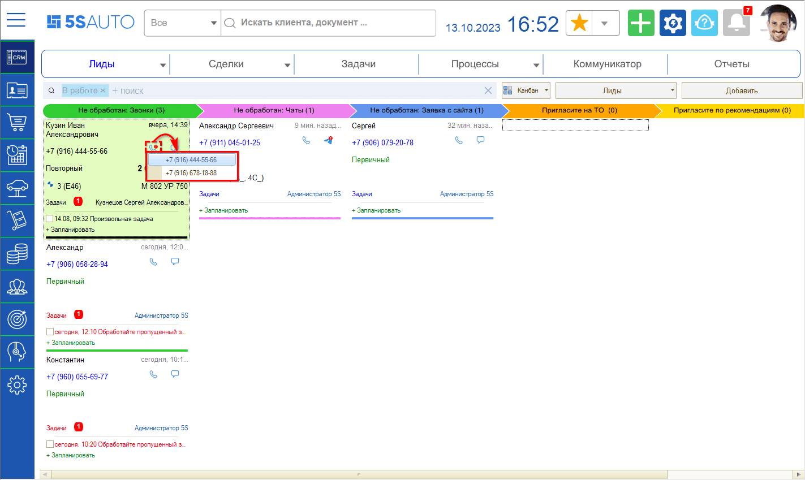
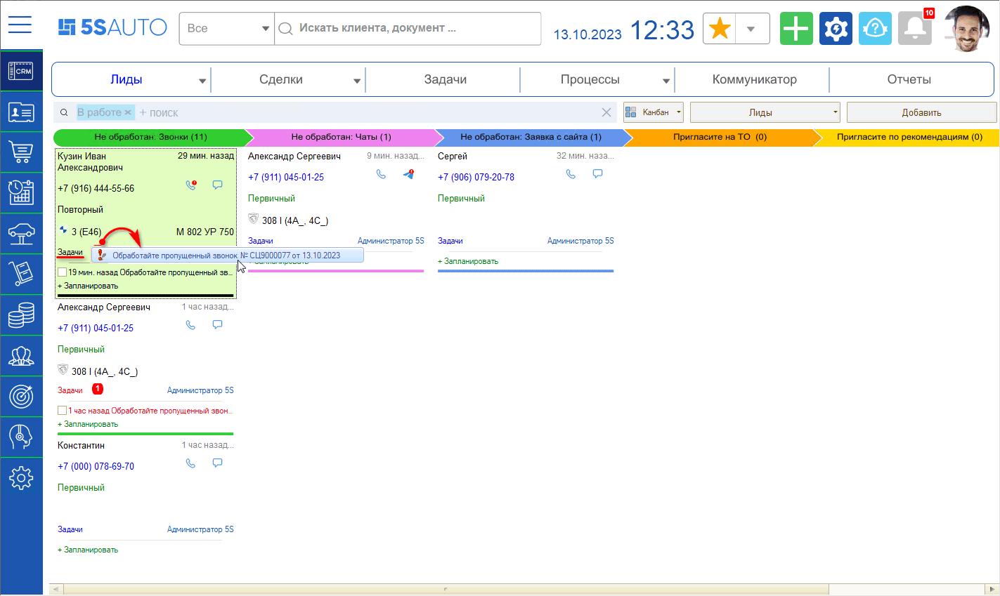
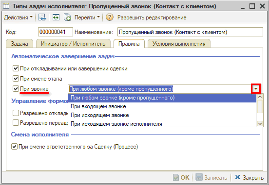
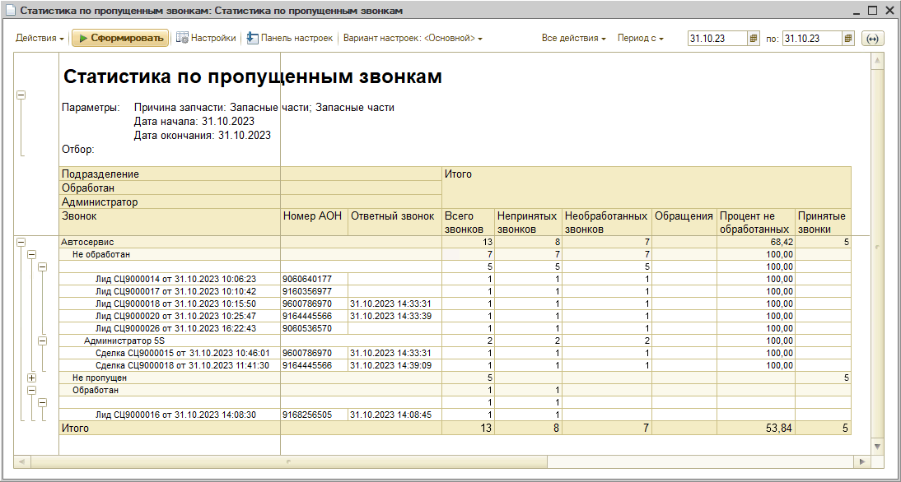

# Работа с пропущенными звонками

<table><tr><td><b>Время чтения:</b> 12 мин.</td><td><b>Обновлено:</b> 31.10.2023</td></tr></table>

Источник: https://www.5systems.ru/help/rabota-s-propuschennymi-zvonkami

## Содержание

1. [Введение](#введение)
2. [Обработка пропущенных звонков в 5S AUTO](#обработка-пропущенных-звонков-в-5s-auto)
   - [1. Уведомления](#1-уведомления)
   - [2. Фиксация в CRM](#2-фиксация-в-crm)
   - [3. Индикация](#3-индикация)
   - [4. Задача](#4-задача)
3. [Отчет по пропущенным звонкам](#отчет-по-пропущенным-звонкам)

## Введение

*Пропущенный звонок* – это событие сервера телефонии, при котором поступил входящий звонок, но никто из сотрудников на него не ответил.

Телефония фиксирует каждый звонок в CRM и передает следующую *информацию по пропущенным звонкам:*

- номер телефона звонившего;
- номер телефона компании, на который поступил звонок;
- время ожидания ответа – сколько секунд дозванивался клиент, пока не положил трубку.

Важно *своевременно обработать каждый пропущенный звонок,* т.к. среди них могут быть:

- первичные клиенты, которым необходимо перезвонить, чтобы не упустить *потенциальную заявку* и не потерять будущую прибыль и уже потраченные деньги на привлечение клиента;
- постоянные клиенты – в этом случае своевременная обработка пропущенного звонка показывает *высокий уровень качества* обслуживания и *повышает репутацию* компании в глазах клиентов.

Для работы с пропущенными звонками важно:

1. Настроить *многоканальную телефонию.* Для корректной фиксации пропущенных звонков в CRM необходимо убедиться, что телефонные линии подключены в многоканальном режиме. Важно, чтобы сервер телефонии принимал все звонки клиентов. Если клиент не сможет дозвониться из-за отсутствия свободной линии, то такой звонок не будет зафиксирован в CRM.
2. Настроить *уведомления* пользователей о пропущенных звонках.
3. Продумать *мотивацию* сотрудников, чтобы они были заинтересованы своевременно отрабатывать каждый пропущенный звонок – в этом поможет специальный *отчет.*

Рассмотрим подробнее работу с пропущенными звонками в 5S AUTO.

## Обработка пропущенных звонков в 5S AUTO

Программа отслеживает все пропущенные звонки, по каждому уведомляет сотрудников, а также создает задачу перезвонить клиенту.

### 1. Уведомления

При пропущенном звонке у сотрудников, которым он был адресован, всплывает push-уведомление о пропущенном звонке:

Также уведомление добавится в общий список уведомлений:

Таким образом, *система напомнит* пользователям *обработать пропущенный звонок.*

При клике на текст уведомления происходит переход на форму Лида или Сделки, откуда можно быстро *перезвонить клиенту.*

Есть возможность настроить отправку уведомлений в Telegram – каждый сотрудник может выбрать для себя удобный канал доставки уведомлений.

Подробнее о работе с уведомлениями см. [статью](../../../CRM/Работа%20с%20уведомлениями/rabota-s-uvedomleniyami.md).

### 2. Фиксация в CRM

Система автоматически фиксирует каждый пропущенный звонок в CRM.

- В случае если пропущен *новый звонок* от клиента, у которого нет открытых лидов или сделок, то система автоматически создаст новый Лид или Сделку, – в зависимости от [настроек](../../../CRM/Режимы%20работы%20CRM/rezhimy-raboty-crm.md). Подробнее см. статьи "[Работа со сделкой](../../../CRM/Работа%20со%20сделкой/rabota-so-sdelkoy.md)", “[Канбан сделок](../../../CRM/Канбан%20сделок/kanban-sdelok.md)” и “[Список сделок](../../../CRM/Список%20сделок/spisok-sdelok.md)”.

◇  Если пропущен звонок от повторного клиента, то система подтянет в Лид все данные по нему.

◇  Если пропущен звонок от нового клиента, то система сохранит в Лиде номер телефона, с которого был совершен звонок.

- Если пропущен звонок *в рамках уже открытой Сделки* – то звонок свяжется с этой Сделкой, а карточка Сделки поднимется вверх списка, т.к. по ней была совершена активность.

В обоих случаях на карточке Сделки появится индикатор пропущенного звонка.

### 3. Индикация

Лиды или сделки, по которым был пропущенный звонок, отображаются с красным *индикатором пропущенного звонка* на кнопке с телефонной трубкой.

Индикация помогает менеджеру *сразу увидеть* сделку, которой необходимо уделить внимание, и *быстро перезвонить* клиенту или ответить в мессенджере.

Индикация в списке:

Индикация на канбане:

Чтобы связаться с клиентом, нужно нажать на кнопку звонка, выбрать нужный номер телефона и кликнуть по нему.

После созвона с клиентом индикатор пропущенного звонка исчезает.

### 4. Задача

Создается задача перезвонить клиенту, привязанная к данному Лиду – сделка поднимается вверх также и по этой причине:

После созвона с клиентом задача по пропущенному звонку автоматически завершается. Если клиент перезвонил сам – задача также закроется. Автозавершение задачи нужно для того, чтобы после созвона с клиентом задачи не висели на канбане, и другой пользователь повторно не побеспокоил клиента.

Настройки по умолчанию автоматического завершения задач по пропущенному звонку можно изменить в справочнике “Типы задач”:

Варианты настройки:

  - При любом звонке (кроме пропущенного) – задача будет завершаться при входящих и исходящих звонках;
  - При входящем звонке – задача будет завершаться только при входящем звонке от клиента;
  - При исходящем звонке – задача будет завершаться только в случае исходящего звонка клиенту;
  - При исходящем звонке исполнителя – программа проверяет, кто совершал звонок клиенту, и завершает задачу только если это был исполнитель задачи. Проверка осуществляется по внутреннему телефону сотрудника, если они настроены.

Подробнее см. [*статью “Типы задач”*](../../../CRM/Типы%20задач/tipy-zadach.md#3-правила)*.*

## Отчет по пропущенным звонкам

Для контроля работы сотрудников с пропущенными звонками предусмотрен ***отчет “Статистика по пропущенным звонкам”****.*

Отчет показывает, насколько быстро обрабатываются пропущенные звонки.

Пропущенный звонок, поступивший в рабочее время, необходимо обработать в течение 10 минут. Если был пропущенный звонок в ночное время – он должен быть обработан до 10 утра следующего рабочего дня.

Если оператор перезванивает по пропущенному звонку позже установленного срока, то в программе он все равно фиксируется как пропущенный.

Таким образом, в отчет попадают звонки, по котором вообще не перезвонили либо перезвонили, но позже положенного срока.

Отчет “Статистика по пропущенным звонкам” можно строить как по всей организации, так и по конкретному подразделению или оператору. Отчет позволяет видеть количество принятых и пропущенных звонков за выбранный период времени – за день или месяц:

Отчет содержит список всех звонков за выбранный период. Отдельно выделены непринятые звонки, видно, сколько из них было своевременно обработано и сколько не обработано, либо обработано поздно – дата и время в столбце "Ответный звонок". Можно понять, сколько пропущенных звонков и перезвонов было у сотрудника в определенный день.

С такой информацией руководитель имеет возможность точно оценивать эффективность отдельного сотрудника или call-центра компании в целом и использовать данную информацию для мотивации сотрудников. Также отчет позволяет проанализировать слабые места в организации работы и принять необходимые меры по улучшению ситуации.

---

**Теги:** телефония, пропущенные звонки, обработка, лиды, звонки

