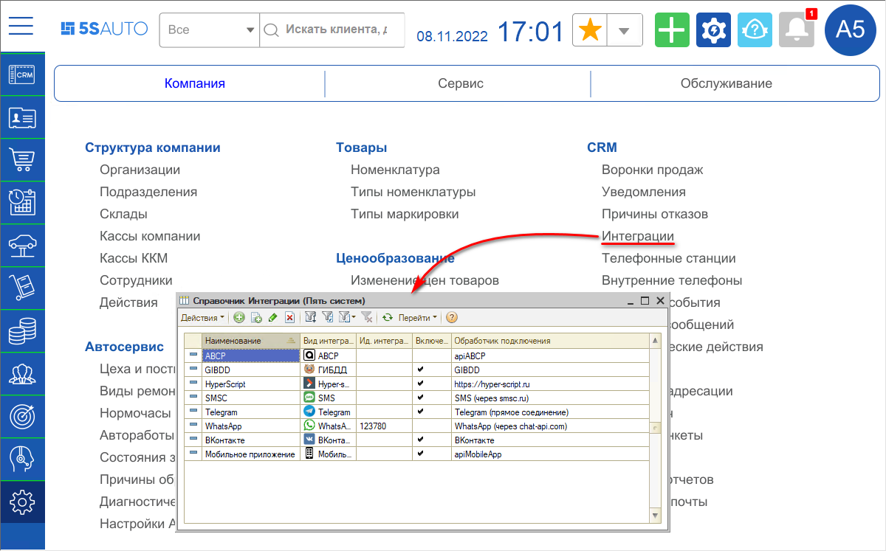
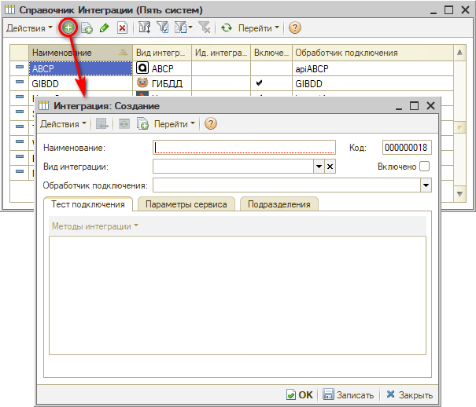
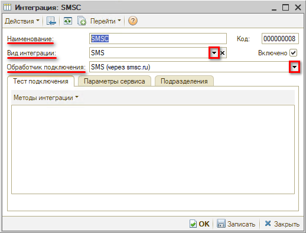
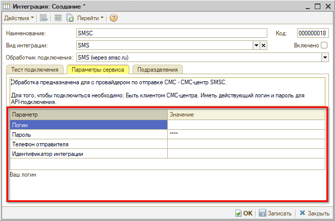
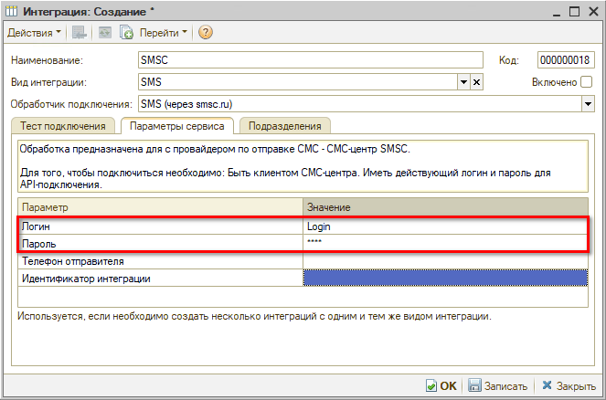
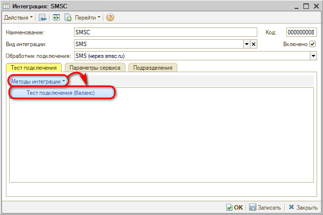
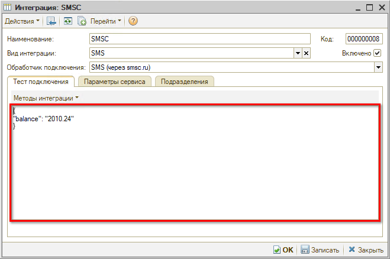
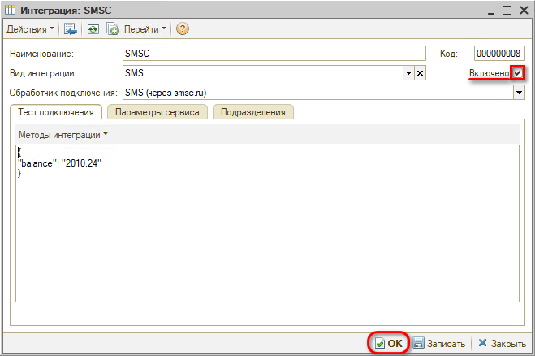

# Настройка интеграции с SMS Центр

<table><tr><td><b>Время чтения:</b> 9 мин.</td><td><b>Обновлено:</b> 23.06.2022</td></tr></table>

Источник: https://www.5systems.ru/help/nastroyka-integracii-s-sms-centr

## Содержание

1. [Введение](#введение)
2. [Настройка](#настройка)

## Введение

В системе предусмотрена интеграция с провайдером [SMS Центр](https://smsc.ru/) для отправки SMS сообщений клиентам или пользователям системы.

***Внимание!*** Перед настройкой интеграции необходимо стать клиентом провайдера [SMS Центр](https://smsc.ru/) и получить логин/пароль.

## Настройка

Для настройки интеграции перейдем в справочник "Интеграции": *Администрирование → Компания → CRM → Интеграции* или через стандартное меню *CRM → Все операции → Справочники → Интеграции:*

Создадим новую интеграцию:

В форме создания интеграции выберем *вид интеграции* *"SMS"*, *обработчик подключения* *"SMS (через smsc.ru)"*, при этом *наименование интеграции* *"SMSC"* заполнится автоматически:

После выбора обработчика отображаются параметры на вкладке "Параметры сервиса":

Заполним *логин* и *пароль*, полученные у провайдера, в соответствующих полях:

При необходимости можно указать *номер телефона отправителя*, который клиент будет видеть при получении сообщений. *Указанный телефон должен быть зарегистрирован в SMS центре*. Если телефон не указан, то сообщения будут отправляться от номера телефона SMS Центра.

*Идентификатор интеграции* заполняется в случае необходимости создания двух и более интеграций с одним и тем же видом интеграции.

Готово! Все настройки внесены. Теперь запишем изменения, нажав кнопку "Записать", и протестируем соединение. Для теста соединения перейдем на вкладку "Тест подключения" и нажмем кнопку *"Методы интеграции → Тест подключения (баланс)":*

При успешном подключении отобразится информация о вашем балансе у провайдера:

Если все успешно настроено, проверьте наличие флажка у параметра "Включено", который активирует интеграцию, и нажмите на кнопку *"ОК":*

---

**Теги:** SMS Центр, sms, интеграция, настройка, рассылка сообщений

