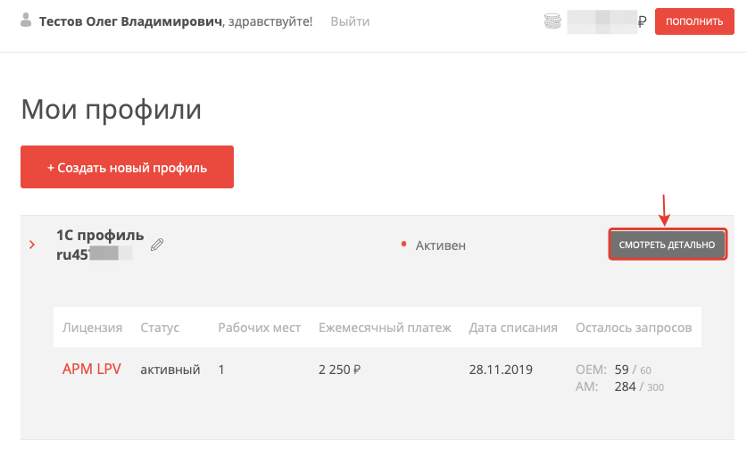
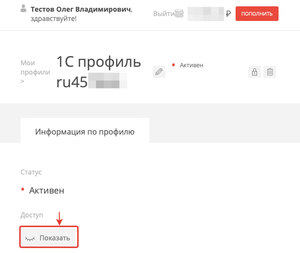
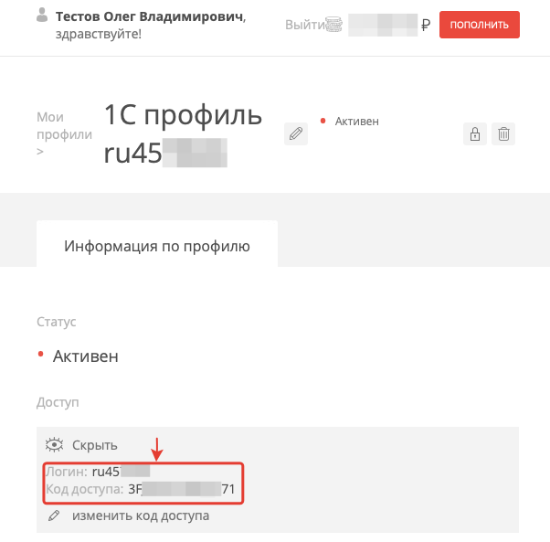
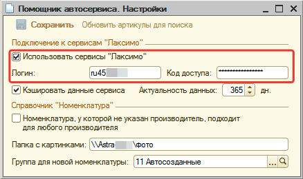

# Настройка интеграции с каталогами Laximo

<table><tr><td><b>Время чтения:</b> 4 мин.</td><td><b>Обновлено:</b> 23.06.2022</td></tr></table>

Источник: https://www.5systems.ru/help/nastroyka-integracii-s-katalogami-laximo

В программе предусмотрена возможность просматривать и использовать данные из оригинальных каталогов Laximo.

Для подключения к сервисам Laximo, необходимо:

1. Приобрести лицензию для внедрения в 1С на [сайте Laximo](https://www.laximo.ru/).
2. Произвести настройки подключения к сервисам Laximo в программе.

Для настройки подключения к сервисам Laximo перейдите в [*настройки Помощника автосервиса*](https://5systems.ru/help/nastroyki-pomoschnika-avtoservisa).

Установите флажок у параметра "Использовать сервисы "Лаксимо".

Скопируйте параметры подключения (Логин, Код доступа) из своего профиля на [сайте Laximo](https://www.laximo.ru/):

1. 
2. 
3. 

Заполните параметры "Логин", "Код доступа" настроек Помощника автосервиса:

и нажмите кнопку "Сохранить".

---

**Теги:** Laximo, каталоги, интеграция, подбор запчастей, настройка

