

# Фотофиксации

<table><tr><td><b>Время чтения:</b> 23 мин.</td><td><b>Обновлено:</b> 04.09.2026</td></tr></table>

Источник: https://www.5systems.ru/help/fotofiksacii

## Содержание

1. [Введение](#введение)
2. [Настройка интеграции](#настройка-интеграции)
   - [1. Настройка камер в программе](#настройка-камер-в-программе)
   - [2. Настройка события по обнаружению автомобильного номера в Revisor](#настройка-события-по-обнаружению-автомобильного-номера-в-revisor)
   - [3. Настройка рассылки сообщений об отклонении в Telegram](#настройка-рассылки-сообщений-об-отклонении-в-telegram)
      - [Настройка группы рассылки для Телеграм](#настройка-группы-рассылки-для-телеграм)
      - [Настройка шаблона сообщения об отклонении](#настройка-шаблона-сообщения-об-отклонении)
      - [Настройка черного/белого списка автомобилей](#настройка-черногобелого-списка-автомобилей)
3. [Обработка событий по обнаружению автомобильного номера в программе](#обработка-событий-по-обнаружению-автомобильного-номера-в-программе)

## Введение

В программе предусмотрена возможность интеграции с системой видеонаблюдения ***Revisor VMS*** с целью контроля въезда/выезда автомобилей в Автосервис.

В рамках интеграции можно настроить обработку события *Отслеживание номеров автомобилей*. При этом камера фиксирует обнаруженный номер автомобиля, сохраняет фото на локальный диск и отправляет информацию в 1С. В 1С фиксируется факт въезда/выезда автомобиля и ищется Заказ-наряд на автомобиль. Сохраненное фото отсылается в чат Telegram с сообщением о выявленном отклонении (*нет открытого заказ-наряда*, *нет номера у автомобиля*).

## Настройка интеграции

### Настройка камер в программе

Камеры, с которых будет происходить обработка события *Отслеживание номеров автомобилей*, создаются в справочнике "Камеры фотофиксации" (Администрирование → Сервис → Фотофиксация → Камеры фотофиксации):

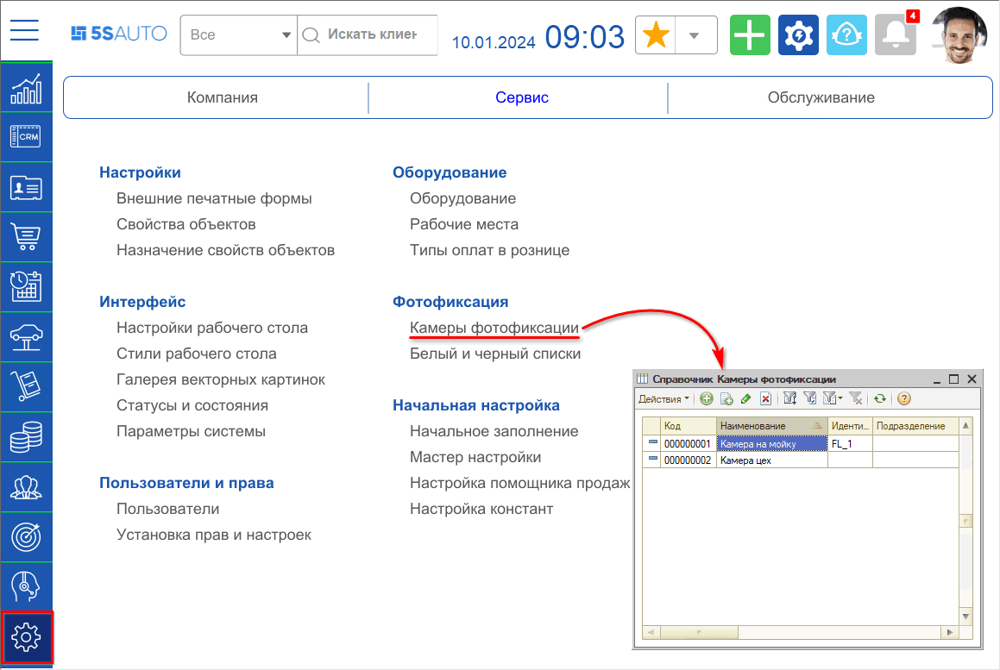

Форма камеры фотофиксации выглядит следующим образом:

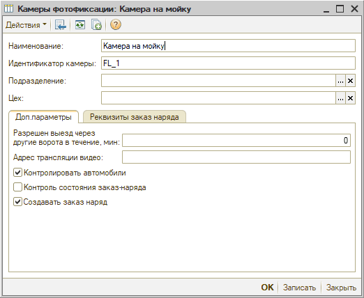

**Описание элементов справочника:**

<table><tr><th><b>Элемент</b></th><th><b>Тип элемента</b></th><th><b>Описание</b></th></tr><tr><td colspan="3"><b><i>Основные параметры</i></b></td></tr><tr><td><b>Наименование</b></td><td>Поле ввода</td><td>Наименование камеры</td></tr><tr><td><b>Идентификатор камеры</b></td><td>Поле ввода</td><td>Идентификатор, по которому будет происходить интеграция с системой видеонаблюдения. Рекомендуется использовать только латинские буквы, цифры и символы.</td></tr><tr><td><b>Подразделение</b></td><td>Поле выбора из справочника</td><td>Если указано подразделение, заказ-наряд на автомобиль будет искаться только в указанном подразделении. Контроль заезда автомобиля в конкретное подразделение. Поддерживается иерархия подразделений - все дочерние подразделения тоже учитываются в поиске заказ-нарядов.</td></tr><tr><td><b>Цех</b></td><td>Поле выбора из справочника</td><td>Если указан цех, заказ-наряд на автомобиль будет искаться только в указанном цехе. Контроль заезда автомобиля в конкретный цех.</td></tr><tr><td colspan="3"><b><i>Доп. параметры</i></b></td></tr><tr><td><b>Разрешен выезд через другие ворота в течение, мин.</b></td><td>Поле ввода</td><td>Если в Автосервисе автомобиль может въехать в одни ворота, а выехать в другие, то указывается время, за которое разрешен такой проезд. Сделано, для того чтобы не было сообщений об отсутствии заказ-наряда при выезде.</td></tr><tr><td><b>Контролировать автомобили</b></td><td>Флажок</td><td>При включении отправляются сообщения в чат Telegram. При выключении только фиксируются события в регистре сведений "Фотофиксации", а сообщения не отправляются.</td></tr><tr><td><b>Контролировать состояния заказ-наряда</b></td><td>Флажок</td><td>При включении происходит контроль наличия заказ-наряда в состоянии "Заявка", а при выезде в состоянии "Выполнен".</td></tr><tr><td><b>Создавать заказ-наряд</b></td><td>Флажок</td><td>При включении автоматически создается заказ-наряд с реквизитами, заданными на вкладке "Реквизиты заказ-наряда":  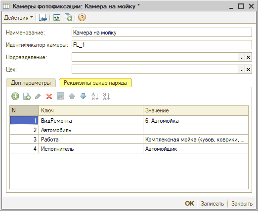</td></tr></table>

### Настройка события по обнаружению автомобильного номера в Revisor

В системе видеонаблюдения Revisor необходимо настроить обработку события по обнаружению автомобильного номера. Рассмотрим пример настроек.

Настройка обработки события происходит через создание сценария:

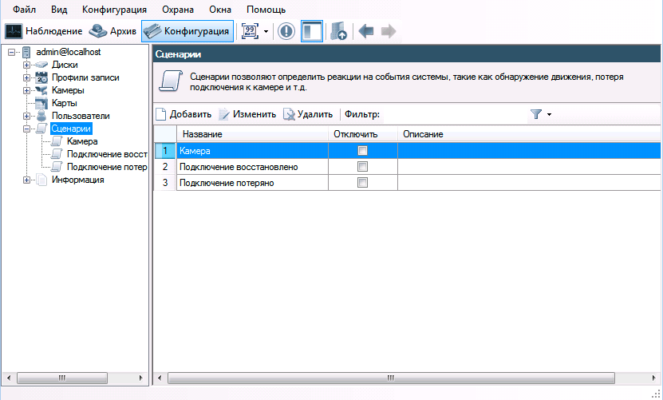

По событию должен быть выбран тип "Обнаружен автомобильный номер" и только одна камера:

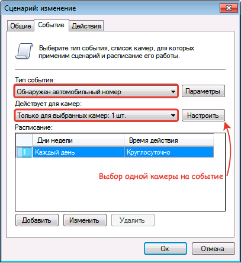

Если нужно обрабатывать события с нескольких камер, то для каждой камеры создайте свой сценарий.

При наступлении события должны выполняться два действия:

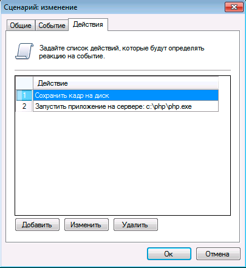

1. *Сохранить кадр на диск* - в настройках указывается каталог, где будут хранится файлы, и ограничение по размеру (как правило, достаточно 1 Гб).
2. *Запустить приложение на сервере* - в настройках указывается путь к php-файлу, который запускает скрипт, взаимодействующий с 1С: передает информацию о событии, запрашивает информацию о наличии заказ-наряда и настройки для отправки сообщений в Telegram.  
   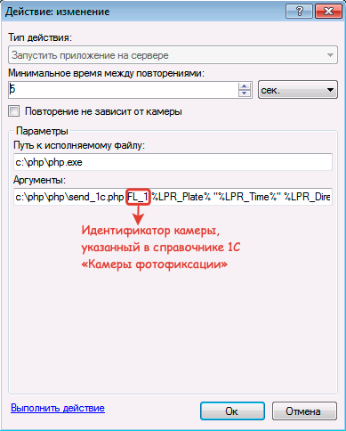

Адрес и аргументы php-файла настраиваются при внедрении. Сам скрипт также настраивается при внедрении. В нем прописываются:

- адрес Веб-сервера,
- код и токен чата Telegram.

### Настройка рассылки сообщений об отклонении в Telegram

Отклонения (отсутствует открытый заказ-наряд, нет номера автомобиля) по въезжающему/выезжающему автомобилю можно отправлять сообщением в Telegram (Телеграм).

Для настройки отправки сообщения об отклонении в Telegram необходимо:

1. Создать чат-бот (см. [Настройка интеграции с Telegram](../../Сообщения/Интеграция%20с%20Telegram/integraciya-s-telegram.md)).
2. Получить код чата через запрос в Telegram (выполняется разработчиком компании "Пять систем").
3. *Настроить группу рассылки для Телеграм*.
4. *Настроить шаблон сообщения* при необходимости.
5. Установить флажок "Контролировать автомобили" в справочнике "Камеры фотофиксации" (см. *Настройка камер в программе*).

В созданный чат-бот Телеграм из Revisor можно отправлять сообщения о типах событий "Подключение к камере потеряно", "Подключение к камере восстановлено" - настраиваются сценарии для типа события. 1С при этом не участвует.

#### Настройка группы рассылки для Телеграм

Настройка группы рассылки происходит в справочнике "Группы рассылок" *(Маркетинг → Маркетинговые программы → Сообщения → Группы рассылок):*

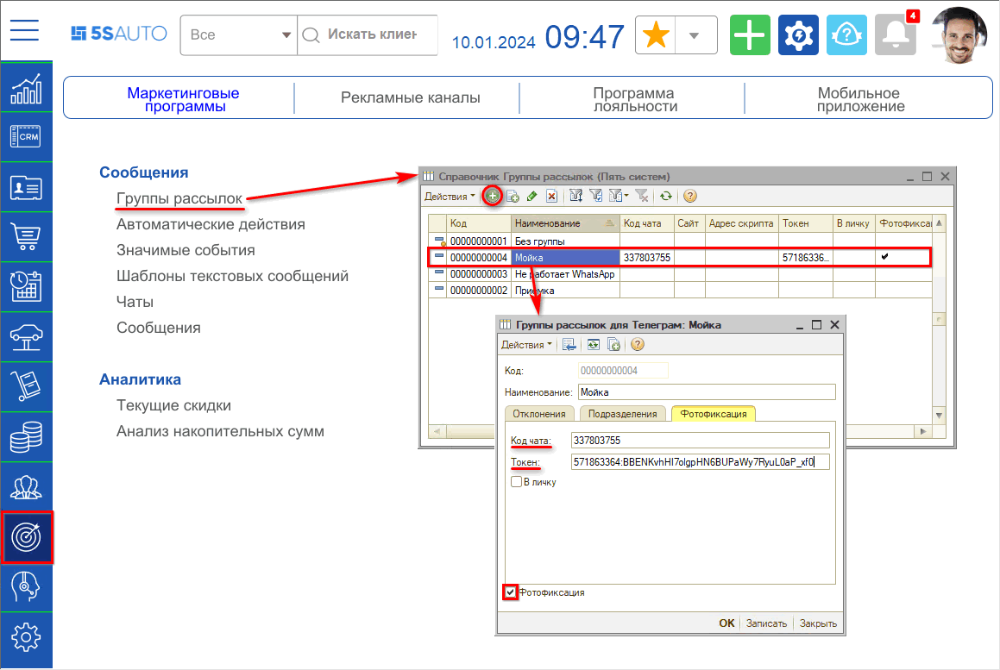

В настройках группы рассылки указываются:

1. Список подразделений, по которым отсылать сообщения (вкладка "Подразделения").
2. Параметры Телеграм: код чата и токен.
3. Виды отклонений, по которым отсылать сообщения:  
   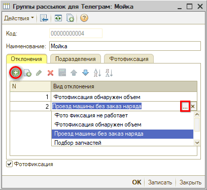

Можно выбрать следующие виды отклонений:

1. *Фотофиксация обнаружен объем* - не обнаружен автомобильный номер.
2. *Проезд машины без заказ-наряда* - нет открытого заказ-наряда.

#### Настройка шаблона сообщения об отклонении

По умолчанию в Телеграм отправляется стандартное сообщение. При необходимости можно задать свой шаблон сообщения через включение автоматического действия:

1. Перейдите в справочник "Автоматические действия" (*CRM → Справочники → "Автоматические действия"*), в группу "Произвольные действия".
2. Найдите действие "Фотофиксация (отклонение)":  
   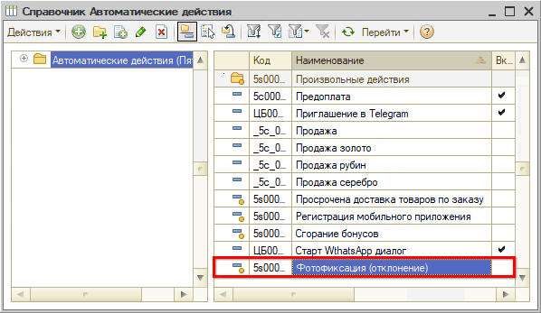
3. Перейдите к редактированию действия, где:
   - 1\. Выберите вариант действия "Отправить сообщение" или "Шаблон сообщения".
   - 2\. На вкладке "Параметры сообщения" выберите существующий или создайте и выберите новый шаблон сообщения (как настроить шаблон см. [*Шаблоны сообщений*](../../Сообщения/Шаблоны%20сообщений/shablony-soobscheniy.md)*):*  
         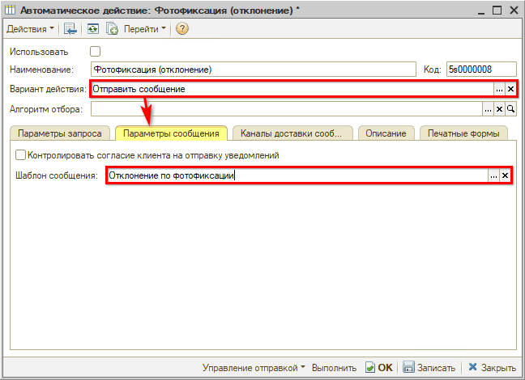

Пример шаблона:

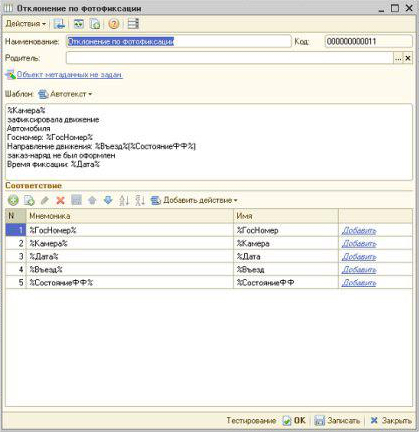

В шаблоне можно использовать действия (настраиваются при внедрении разработчиком "Пять систем"):

- %ГосНомер,
- %Въезд/Выезд,
- %СостояниеФФ,
- %Камера,
- %Дата (дата и время заезда),
- %ЧБ,
- %Подразделение,
- %Цех,
- %Автомобиль,
- %ЗаказНаряд,
- %Период (Дата и время открытия заказ-наряда),
- %ДатаЗакрытия,
- %ПричинаУведомления,
- %Ошибка,
- %ИнфОбОшибке,
- %ТекстСообщения.

#### Настройка черного/белого списка автомобилей

Есть возможность настроить белые и черные списки автомобилей. *Белый список* - автомобили, по которым никогда не отправляются сообщения. *Черный список* - автомобили, по которым всегда отправляются сообщения независимо от того, были ли отклонения.

Настройка происходит в справочнике "Белый и черный списки":

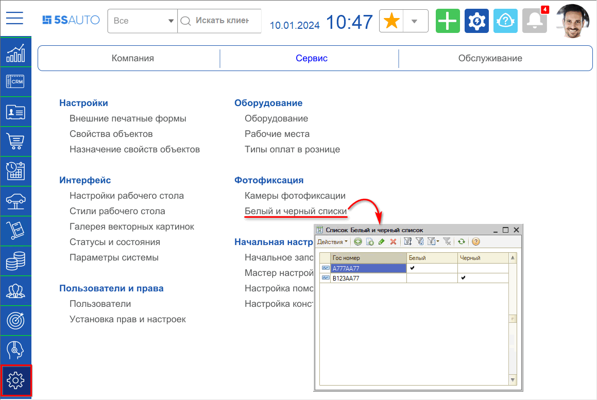

В список добавляется гос. номер автомобиля формата Y999YY999 - буквы пишутся латиницей в верхнем регистре (заглавные буквы). По автомобилю отмечается принадлежность к списку:

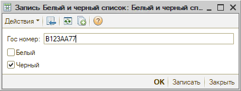

## Обработка событий по обнаружению автомобильного номера в программе

Все события по обнаружению автомобильного номера, приходящие из Revisor, записываются в регистре сведений "События фотофиксации автомобилей" (*CRM → Фотофиксация → "События фотофиксации автомобилей"*):

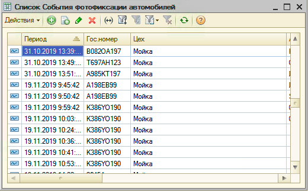

Если включен контроль автомобилей у камеры фотофиксации, то:

- при наличии группы рассылки направляется сообщение в Телеграм:  
  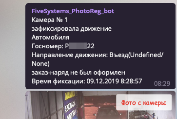
- создается документ "Нарушение" (*CRM → Документы → Нарушение*).

По найденным заказ-нарядам на распознанный номер автомобиля записывается регистр сведений "Открытые заказ-наряды" (*CRM → Фотофиксация → "Открытые заказ-наряды"*):

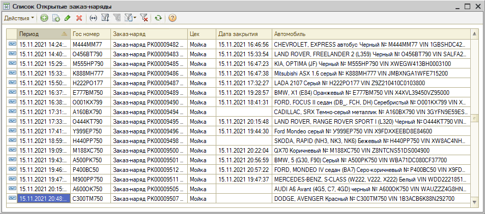

В регистрах сведений гос. номер преобразуется: убираются лишние символы, русские буквы заменяются на латинские. В сообщении отправляется уже преобразованный автомобильный номер.

---

**Теги:** фотофиксация, фото автомобиля, приемка, заказ-наряд, снимки

