

# Электронная почта

<table><tr><td><b>Время чтения:</b> 17 мин.</td><td><b>Обновлено:</b> 07.02.2024</td></tr></table>

Источник: https://www.5systems.ru/help/elektronnaya-pochta

## Содержание

1. [Введение](#введение)
2. [Отправка и получение писем](#отправка-и-получение-писем)
   - [Отправка писем](#отправка-писем)
   - [Получение писем](#получение-писем)
   - [Отправка печатных форм по почте](#отправка-печатных-форм-по-почте)
3. [Настройка](#настройка)
   - [Создание учетной записи почты](#создание-учетной-записи-почты)
   - [Параметры подключения к популярным Почтовым сервисам](#параметры-подключения-к-популярным-почтовым-сервисам)

## Введение

В системе предусмотрена интеграция с *электронной почтой.*

Для работы с электронной почтой используется [*АРМ Коммуникатор*](../../CRM/Работа%20в%20АРМ%20Коммуникатор/rabota-v-arm-kommunikator.md). В разделе *"Электронная почта и новости"* находятся добавленные учетные записи почты, с помощью которых можно принимать и отправлять электронные письма.

## Отправка и получение писем

### Отправка писем

Для создания нового электронного письма следует нажать кнопку *"Новое письмо"* на верхней панели Коммуникатора:

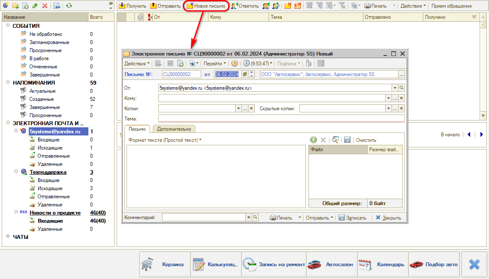

В открывшейся форме требуется заполнить параметры:

- *От* – следует выбрать учетную запись почты, с которой нужно отправить письмо;
- *Кому* – следует ввести адрес электронной почты либо выбрать из Адресной книги;
- Поля *Тема* и *Текст письма* обязательны для заполнения;
- К письму можно прикладывать вложения.

  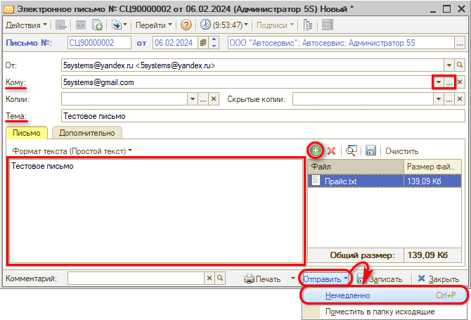

После заполнения параметров письмо можно записать и отправить. Для быстрой отправки следует нажать кнопку *Отправить → Немедленно*.

Если в учетной записи почты была настроена автоотправка писем или пользователь не имеет прав на отправку писем, то можно *"Поместить в папку исходящие"*. Письмо будет отправлено автоматически согласно интервалу времени, указанному для автоотправки.

После отправки письма, оно поместится в папку *"Отправленные"*.

### Получение писем

Для получения писем используется кнопка *"Получить":*

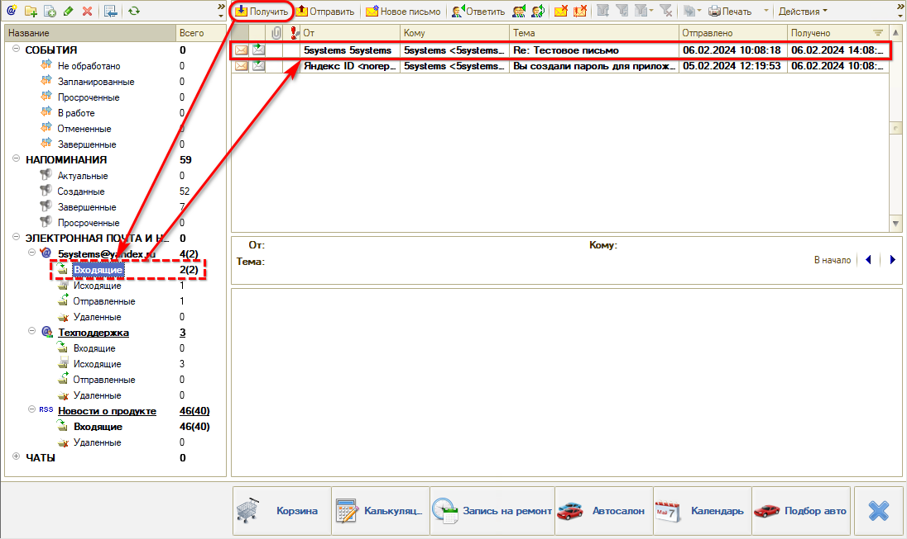

Если была настроена функция автополучения, то письма будут подгружаться с периодичностью, указанной в настройках учетной записи почты.

### Отправка печатных форм по почте

Часто возникает необходимость отправить *печатную форму документа* юридическому лицу. Для отправки по электронной почте нужно нажать кнопку *"Отправить по электронной почте"* на верхней панели формы. После выбора вида файла, в который требуется преобразовать документ, открывается форма создания электронного письма:

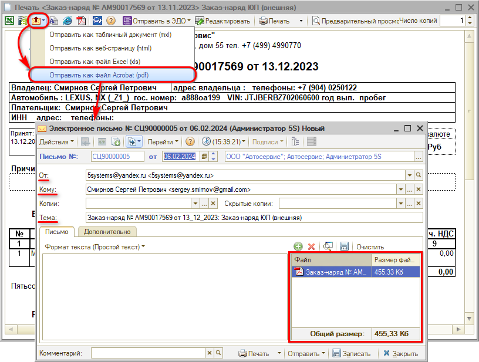

Тема заполняется автоматически из названия документа, в контексте которого была вызвана форма, адрес электронной почты подтягивается из карточки контрагента, а сам файл печатной формы подтягивается во вложение.

## Настройка

### Создание учетной записи почты

Для создания новой учетной записи требуется перейти в справочник "Учетные записи электронной почты" – *Администрирование → Компания → CRM → Настройка почты:*

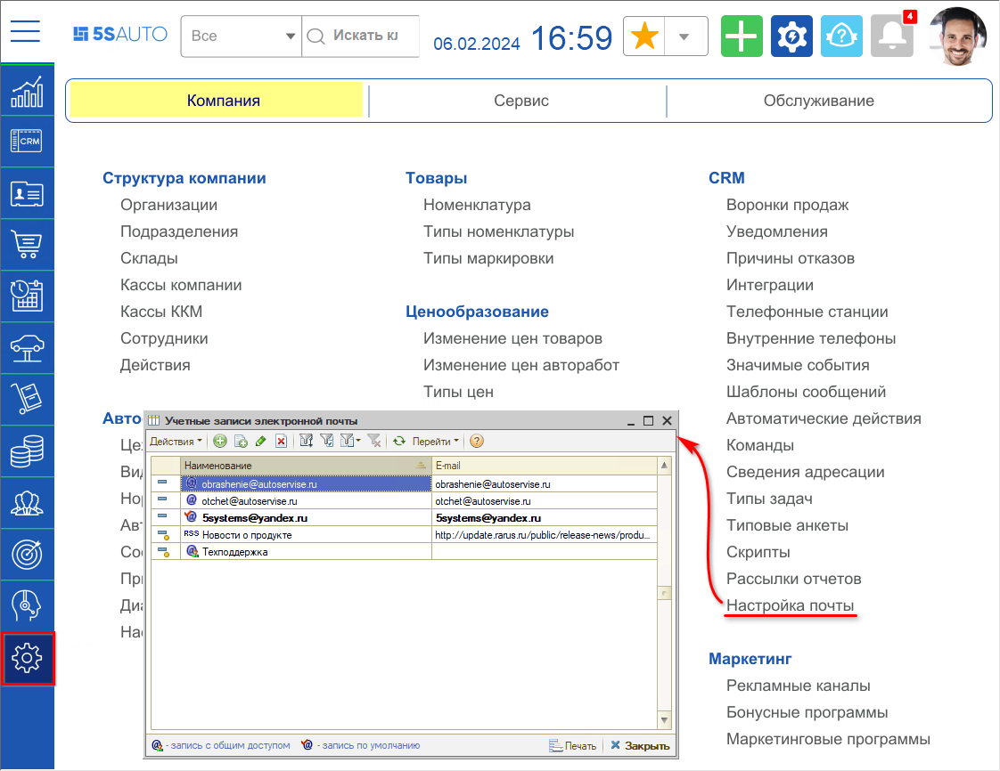

Либо можно в АРМ "Коммуникатор" нажать кнопку "Создать учетную запись". Откроется форма создания учетной записи. Необходимо заполнить *все* параметры в шапке и на вкладке *Параметры подключения:*

*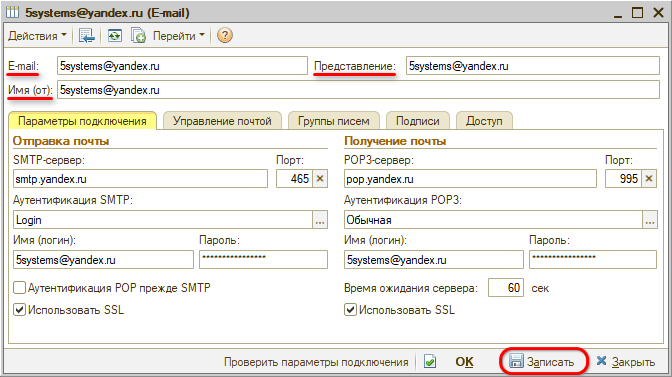*

На вкладке "Управление почтой" следует настроить авто получение/отправку писем:

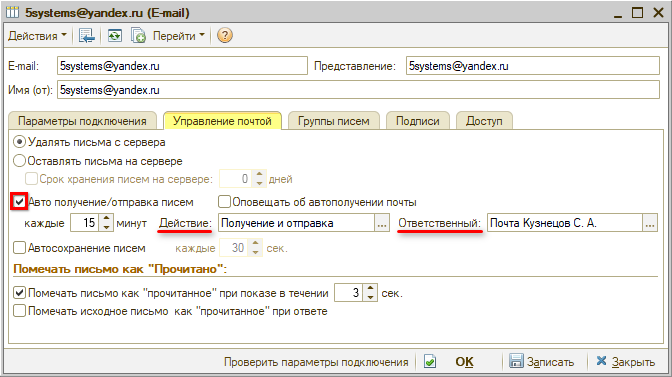

Необходимо назначить ответственного, при этом *рекомендуется создать отдельного пользователя* для работы с почтой. Для начала работы автоотправки после настройки ответственному пользователю нужно будет перезайти в программу.

*Примечание:* Не рекомендуется выбирать пользователя, под которым Вы работаете, а также пользователя, который каждый день заходит в базу, т.к. при входе в программу может выполняться обмен с почтовым сервером, что может занять *более 5 минут,* в течении которых вы *не сможете работать в программе.*

На вкладке "*Доступ"* требуется настроить доступ пользователям, которые будут работать с учетной записью почты. Важно наличие галочки в колонке "*Транспорт",* так как именно она отвечает за отправку/получение писем.

Если настроена функция авто получения/отправки, то достаточно дать права на транспорт только ответственному за авто получение/отправку:

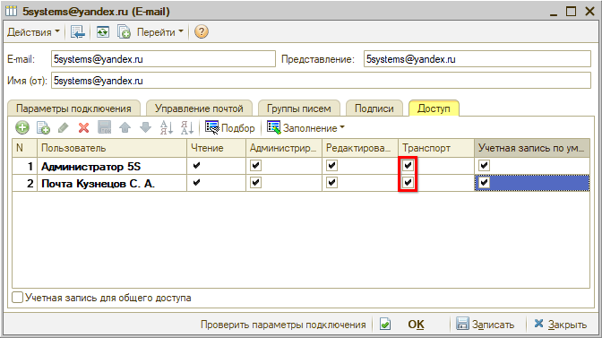

После настройки всех параметров необходимо нажать кнопку "Проверить параметры подключения":

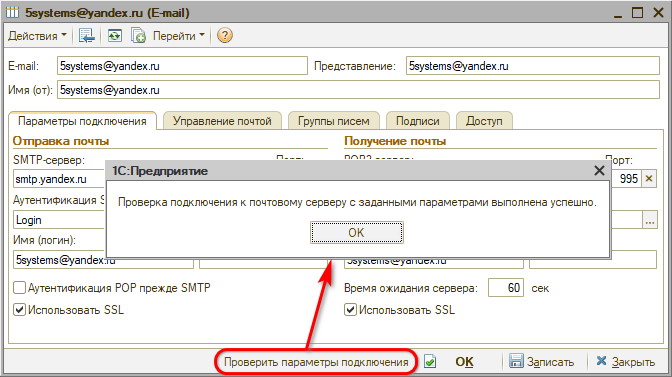

В случае успешного подключения следует проверить отправку почты через АРМ Коммуникатор.

### Параметры подключения к популярным Почтовым сервисам

У большинства почтовых сервисов по умолчанию закрыт доступ по POP3 и SMTP протоколам. В этом случае почта в 1С не будет работать, пока доступ не будет разрешен: сначала необходимо настроить доступ в личном кабинете почты — подробнее см. далее.

#### Яндекс Почта

Рекомендуемый сервис для подключения электронной почты. Инструкцию по настройке см. в личном кабинете: [https://yandex.ru/support/mail/mail-clients/others.html](https://yandex.ru/support/mail/mail-clients/others.html).

Необходимо *разрешить доступ к почтовому ящику* с помощью почтового клиента. Для этого в настройках "Яндекс Почты" необходимо открыть раздел "Почтовые программы", включить опцию "С сервера pop.yandex.ru по протоколу POP3" и сохранить изменения:

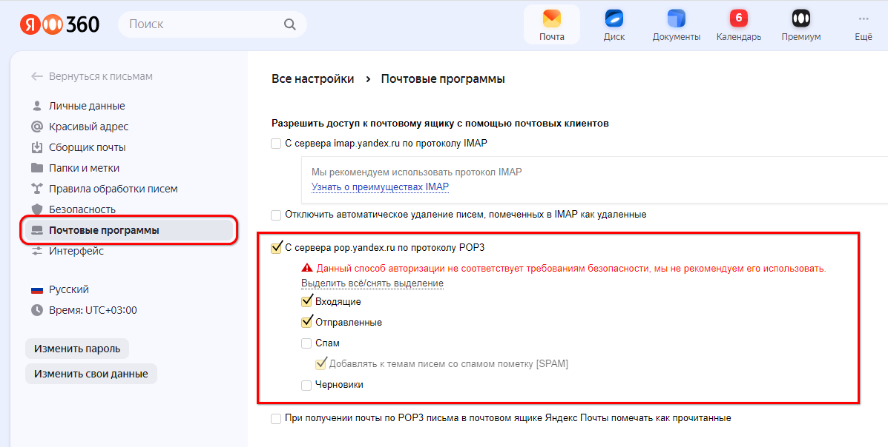

Затем необходимо создать *пароль приложения*. Для этого следует в аккаунте "Яндекс ID" открыть вкладку "Безопасность → Пароли приложений", выбрать тип приложения "Почта" и создать новый пароль. Необходимо придумать *имя* пароля – с этим названием пароль будет отображаться в списке паролей на данной странице ЛК:

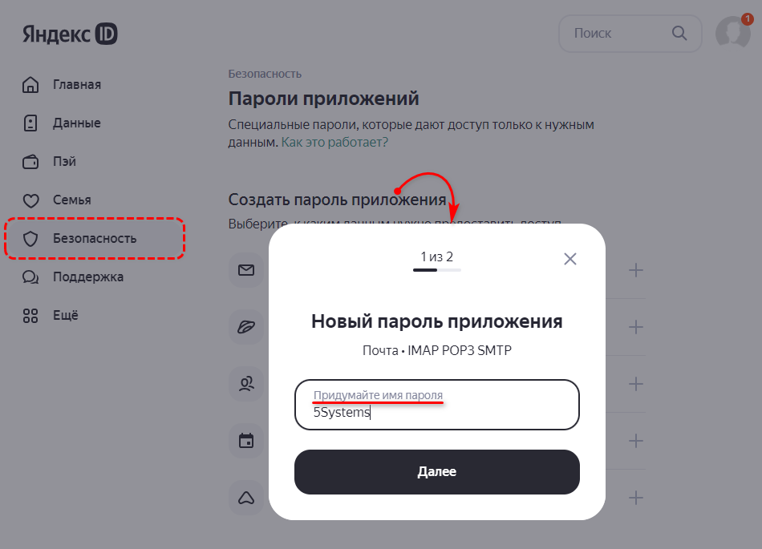

Скопируйте и сохраните сгенерированный пароль:

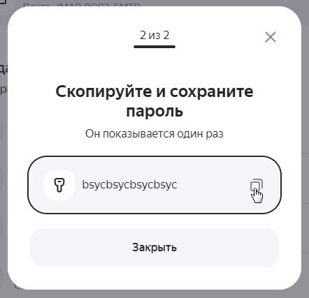

Имя пароля будет отображаться в списке, но сам созданный пароль можно увидеть только один раз. Если вы ввели его в программе неправильно и закрыли окно в ЛК, *удалите* текущий пароль и создайте новый. Подробнее см.: [https://yandex.ru/support/id/authorization/app-passwords.html](https://yandex.ru/support/id/authorization/app-passwords.html).

Параметры подключения для Яндекс Почты:

|  | **Входящая почта** | **Исходящая почта** |
| --- | --- | --- |
| **Адрес почтового сервера** | pop.yandex.ru | smtp.yandex.ru |
| **Защита соединения** | SSL | SSL |
| **Порт** | 995 | 465 |

Для доступа к почтовому серверу укажите логин и пароль приложения. Используйте тот пароль, который вы создали для почтового приложения на предыдущем шаге.

#### Mail.ru Почта

В настройках Mail.ru необходимо включить *доступ через почтовую программу* – см инструкцию: [https://help.mail.ru/mail/mailer/popsmtp](https://help.mail.ru/mail/mailer/popsmtp).

Чтобы войти в ящик Mail.ru через программу, обычный пароль от ящика не подойдет — необходимо создать специальный *пароль для внешнего приложения*. Для создания такого пароля перейдите  → "Безопасность" → "Пароли для внешних приложений". Подробнее см.: [https://help.mail.ru/mail/security/protection/external](https://help.mail.ru/mail/security/protection/external).

Параметры подключения к Mail.ru:

|  | **Входящая почта** | **Исходящая почта** |
| --- | --- | --- |
| **Адрес почтового сервера** | pop.mail.ru | smtp.mail.ru |
| **Защита соединения** | SSL | SSL |
| **Порт** | 995 | 465 |

В программе вместо основного пароля нужно вводить созданный пароль для внешнего приложения.

#### Google Gmail

***Внимание!** В настоящее время не поддерживается. С 30 мая 2022 года Gmail прекратил поддержку сторонних и "менее защищенных" приложений и устройств, которые позволяют входить в аккаунт, указывая только имя пользователя и пароль. Подробнее см. [на сайте](https://support.google.com/accounts/answer/6010255) сервиса.*

Инструкция по настройке в личном кабинете: [https://support.google.com/mail/answer/7104828?hl=ru](https://support.google.com/mail/answer/7104828?hl=ru).

Также в настройках Gmail необходимо включить доступ к аккаунту из небезопасных приложений.

Параметры подключения к Gmail:

|  | **Входящая почта** | **Исходящая почта** |
| --- | --- | --- |
| **Адрес почтового сервера** | pop.gmail.com | smtp.gmail.com |
| **Защита соединения** | SSL | SSL |
| **Порт** | 995 | 465 |

---

**Теги:** электронная почта, учетные записи, отправка писем, настройка, e-mail

