

# Интеграция с Webkassa.KZ

<table><tr><td><b>Время чтения:</b> 14 мин.</td><td><b>Обновлено:</b> 14.05.2025</td></tr></table>

Источник: https://www.5systems.ru/help/integraciya-s-webkassakz

> *Функционал доступен начиная с релиза 2.8.2.1.*

## Содержание

1. [Введение](#введение)
2. [Работа с облачной кассой](#работа-с-облачной-кассой)
   - [1. Прием оплаты](#1-прием-оплаты)
   - [2. Распечатка чека](#2-распечатка-чека)
   - [3. Возврат](#3-возврат)
   - [4. Закрытие смены](#4-закрытие-смены)
3. [Настройка](#настройка)
   - [1. Настройка на стороне сервиса](#1-настройка-на-стороне-сервиса)
   - [2. Настройка интеграции в программе](#2-настройка-интеграции-в-программе)
   - [3. Настройка оборудования](#3-настройка-оборудования)

## Введение

*Облачная касса Webkassa.kz* – это сервис, который позволяет учитывать и фискализировать продажи *на территории Казахстана.* См. информацию на сайте: [https://webkassa.kz/](https://webkassa.kz/).

Webkassa работает с любого стационарного ПК, ноутбука, планшета или смартфона, имеющего доступ к интернету. Полностью заменяет собой физический кассовый аппарат.

Для работы с облачной кассой тоже нужен фискальный накопитель, договор с ОФД и регистрация кассы в налоговых органах. Особенность в том, что компания подключается к цифровой кассе через интернет, а данные о расчетах собираются и хранятся в облаке. Подробнее см. на [сайте](https://promo.webkassa.kz/tpost/vbvvn6c0j1-chem-programmnaya-kassa-otlichaetsya-ot).

Как работает облачная онлайн-касса:

1. Клиент оплачивает покупку.
2. Банк-эквайер передает данные платежа облачной онлайн-кассе.
3. Облачная онлайн-касса формирует чек и передает его на сервер ОФД – оператора фискальных данных, определенного законодательством Республики Казахстан.
4. ОФД отправляет электронный чек клиенту и передает данные в налоговый орган через ОФД. Электронный чек равнозначен бумажному. Возможна также распечатка чека из программы или ЛК.

Сервис облачных касс выдает организации доступ в [личный кабинет](https://promo.webkassa.kz/tpost/e23osg6fv1-funktsional-i-lichnii-kabinet-webkassa), через который можно настраивать кассы, а также отслеживать все платежи и чеки.

За подключение, сервисное обслуживание и обновление прошивки облачной кассы отвечает провайдер.

## Работа с облачной кассой

### 1. Прием оплаты

*Прием оплаты* через облачную кассу в 5S AUTO производится *стандартным способом* – см. статьи “[Порядок работы с кассами ККМ](../Порядок%20работы%20с%20кассами%20ККМ/poryadok-raboty-s-kassami-kkm.md#оплата)”, “[Упрощенный Фронт кассира](../Упрощенный%20Фронт%20кассира/uproschennyy-front-kassira.md)”.

Возможен прием платежей по всем типам оплаты – банковские карты, [платежные системы](https://5systems.ru/help/rabota-s-sbp), наличные средства.

Поддерживаются способы оплаты: полная и частичная, предоплата и окончательный расчет[\*](#snoska).

*\*Внимание! Зачет аванса* в Webkassa *не поддерживается:* сумма предоплаты учитывается только в первом кассовом чеке при приеме предоплаты, в итоговом чеке передачи товара/услуги отображается только оставшаяся пробиваемая сумма, а не общая.

Данные о продажах автоматически отправляются в налоговые органы. Клиент получает электронный чек на email. При необходимости возможна распечатка чека из программы – см. *[далее](#2-распечатка-чека).*

### 2. Распечатка чека

Для распечатки чека следует через дерево документов перейти в *чек на оплату,* по которому был принят платеж, открыть из него форму приема оплаты, перейти в стандартный Фронт кассира, на вкладке “Касса” нажать кнопку “Печать чека облачной кассы”:

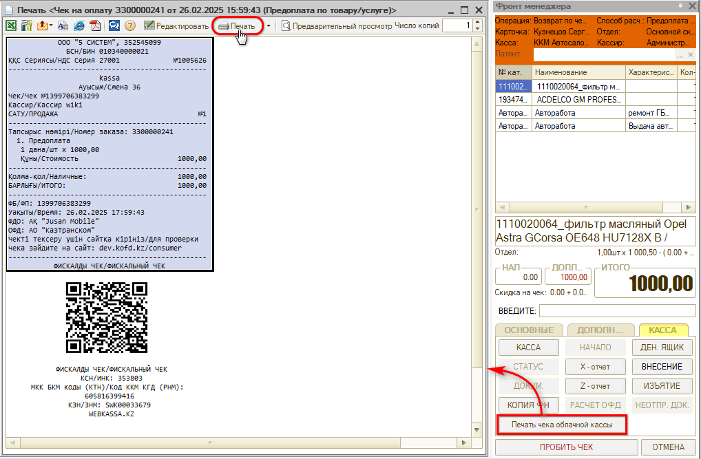

Также каждый чек можно проверить в ЛК на сайте. Для этого следует перейти в раздел *“Отчеты → История чеков”,* развернуть блок с нужной кассой и воспользоваться поиском по номеру смены, дате, номеру чека, кассиру или общей сумме. Для просмотра чека нужно нажать ссылку *“Просмотреть чек”* в колонке “Действие:

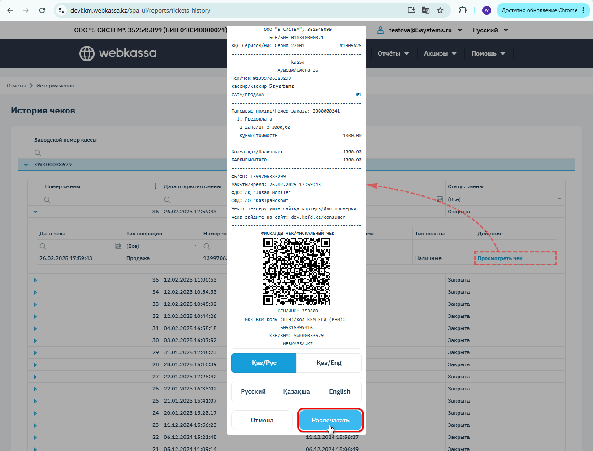

При необходимости чек также можно распечатать.

### 3. Возврат

Возврат оплаты покупателю производится на основании документа “Чек на оплату”. См. описание в статье “[Порядок работы с кассами ККМ](../Порядок%20работы%20с%20кассами%20ККМ/poryadok-raboty-s-kassami-kkm.md#возврат)”, а также видео в статье “[Упрощенный Фронт кассира](../Упрощенный%20Фронт%20кассира/uproschennyy-front-kassira.md#2-возврат-по-чеку-на-оплату)”.

*Примечание:* Могут возникнуть следующие затруднения при оформлении возврата, если в чеке участвовал аванс. В данном случае нет возможности просто сделать возврат, так как неизвестен тип оплаты у аванса – нал или безнал. Рекомендуемый вариант действий: найти документ, по которому подтянулся аванс/предоплата/зачет аванса, найти чек оплаты по этому документу, сделать возврат на сумму предоплаты, остальную сумму вернуть с текущего чека на оплату. Если точно известен тип оплаты у предоплаты, то можно просто во Фронте кассира заполнить типы оплат по суммам и пробить возврат.

### 4. Закрытие смены

Закрытие кассовой смены на облачной кассе следует делать через ***обработку "Закрытие кассовой смены"*** – см. [статью](../Обработка%20Закрытие%20кассовой%20смены/obrabotka-zakrytie-kassovoy-smeny.md).

Есть возможность снять Z-отчет через стандартный Фронт кассира. Также есть возможность распечатать в программе X-отчет и Z-отчет:

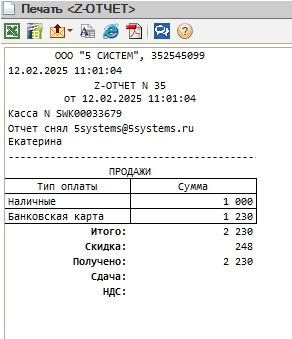

Также есть возможность найти их в ЛК на сайте в разделе *“Отчеты → Сменные отчеты”:*

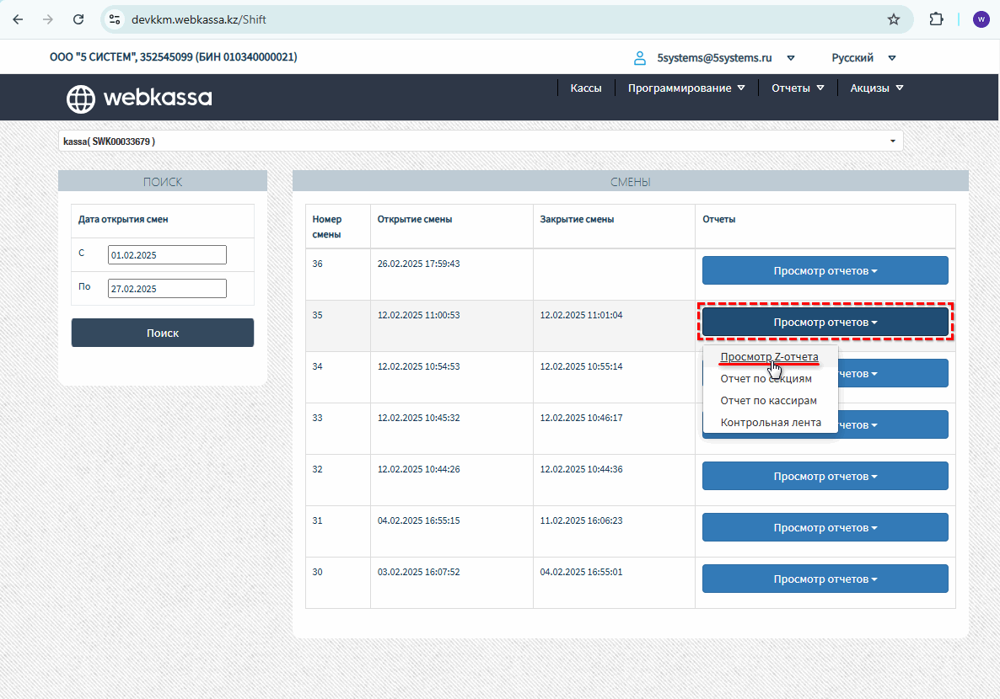

Можно открыть для просмотра, при необходимости распечатать:

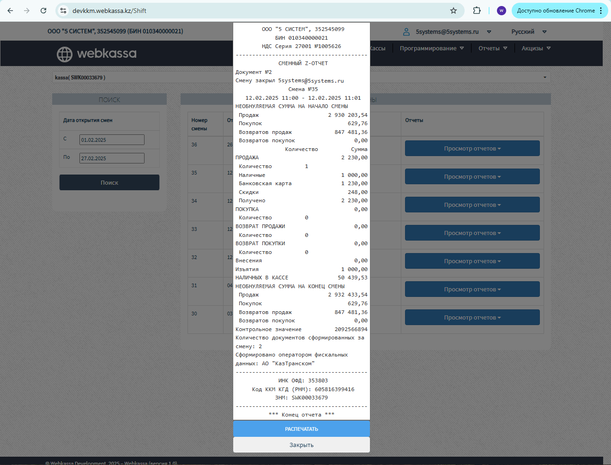

## Настройка

### 1. Настройка на стороне сервиса

Для подключения интеграции с облачной кассой предварительно необходимо:

1. Зарегистрироваться в ЛК на сайте Webkassa;
2. Выбрать тариф и подключить облачную кассу Webkassa;
3. Подключить ОФД;
4. Настроить работу облачной кассы в личном кабинете.

Подключение возможно самостоятельно или с помощью менеджеров Webkassa. 
См. материалы на ресурсах сервиса:

- порядок подключения и тарифы: [https://webkassa.kz](https://webkassa.kz/);
- инструкции по подключению API: [https://promo.webkassa.kz](https://promo.webkassa.kz/integrations);
- руководство по эксплуатации: [https://my.webkassa.kz/Docs/RukovodstvoPoEkspluataciiWebkassa-2.0.pdf](https://my.webkassa.kz/Docs/RukovodstvoPoEkspluataciiWebkassa-2.0.pdf).

Для подключения интеграции в программе необходимо будет получить ***API-Key*** для своей организации.

### 2. Настройка интеграции в программе

Для каждой кассы необходимо создавать отдельную интеграцию, т.е. каждая настроенная интеграция должна соответствовать своей кассе из справочника “Оборудование”.

#### 1) Добавление интеграции

В справочнике “Интеграции” необходимо создать новый элемент, заполнить следующие реквизиты:

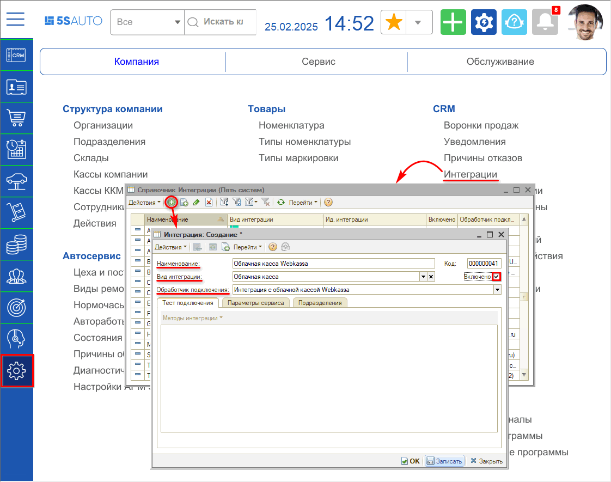

1. *Наименование* – Облачная касса Webkassa (заполняется автоматически);
2. *Вид интеграции* – Облачная касса;
3. *Обработчик подключения* – Интеграция с облачной кассой Webkassa;
4. Установить галочку *“Включено”;*
5. Нажать кнопку *“ОК”* для сохранения интеграции.

#### 2) Параметры сервиса

На вкладке *“Параметры сервиса”* необходимо заполнить следующие параметры:

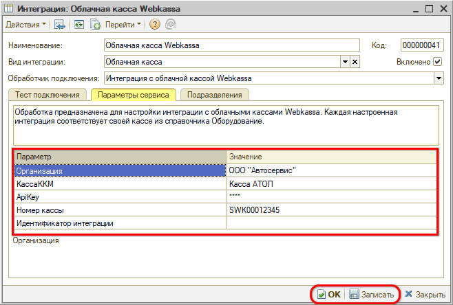

- *Организация* – выбрать организацию, на которую зарегистрирована облачная касса;
- *Касса ККМ* – выбрать кассу ККМ;
- *ApiKey* – необходимо получить у вашего менеджера в Webkassa;
- *Номер кассы* – номер кассы в ЛК на сайте Webkassa.

После заполнения параметров необходимо *записать* изменения.

#### 3) Дополнительные настройки

На вкладке “Тест подключения” следует перейти к дополнительным настройкам по кнопке *Методы интеграции → Настройки:*

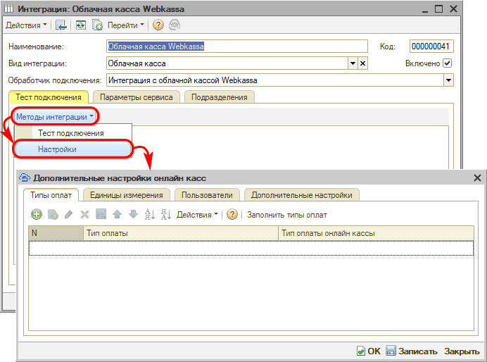

В таблице производится настройка соответствия следующих параметров:

**1) Типы оплат**

На данной вкладке необходимо сопоставить типы оплаты в программе с типами оплаты облачной кассы. Для этого следует нажать кнопку “Заполнить типы оплат”, затем для каждого типа оплаты из программы выбрать один из 3-х типов оплаты Webkassa:

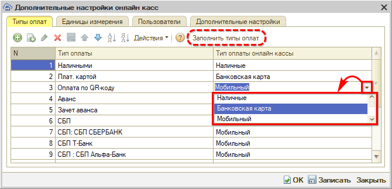

*Типы оплат Webkassa:*

- Наличные;
- Банковская карта;
- Мобильный.

***Примечание:*** В Webkassa нет типа оплаты “Зачет аванса”: сумма предоплаты учитывается только в первом чеке при приеме предоплаты, в итоговом чеке передачи товара/услуги отображается только оставшаяся пробиваемая сумма, а не общая.

В случае оплаты частями при необходимости возврата нужно будет искать документы, по которым была пробита предоплата, т.к. в качестве аванса могла быть зачтена переплата по другому документу. Документ можно найти только через стандартный Фронт кассира.

**2) Единицы измерения**

На данной вкладке производится сопоставление единиц измерения в программе с единицами измерения онлайн-кассы:

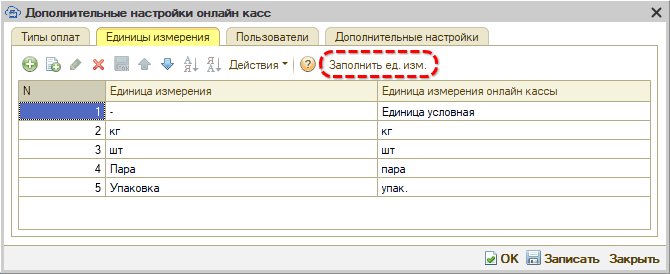

**3) Пользователи**

На данной вкладке необходимо сопоставить пользователей в программе с пользователями онлайн-касс из ЛК Webkassa:

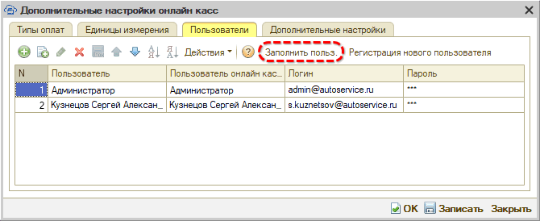

Для каждого пользователя требуется указать логин и пароль, которые были заданы при регистрации пользователей в ЛК Webkassa.

Также есть возможность зарегистрировать нового пользователя прямо из программы:

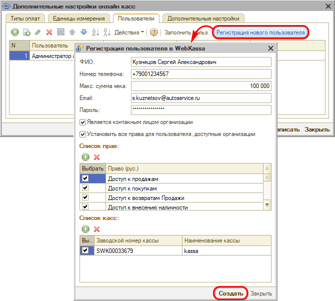

Необходимо заполнить все реквизиты, задать права и выбрать кассы, с которыми пользователь будет работать.

**4) Языки для печати чека**

На вкладке “Дополнительные настройки” есть возможность выбрать основной и дополнительный язык для чека:

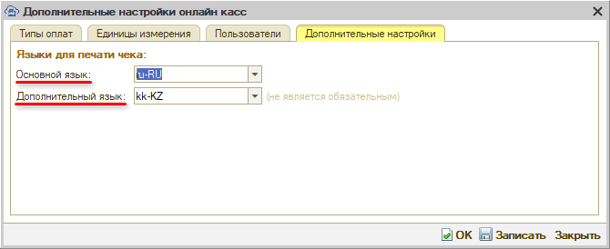

Данные на кассовом чеке будут выводиться на двух указанных языках через слэш (/):

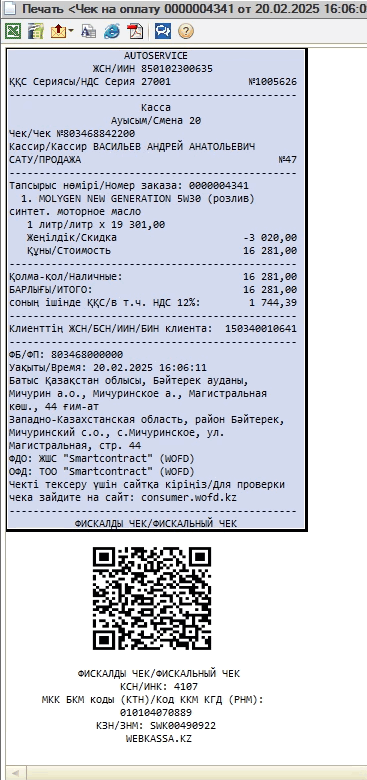

#### 4) Тест подключения

Для проверки корректности настройки интеграции следует на вкладке “Тест подключения” нажать кнопку *“Методы интеграции → Тест подключения”:*

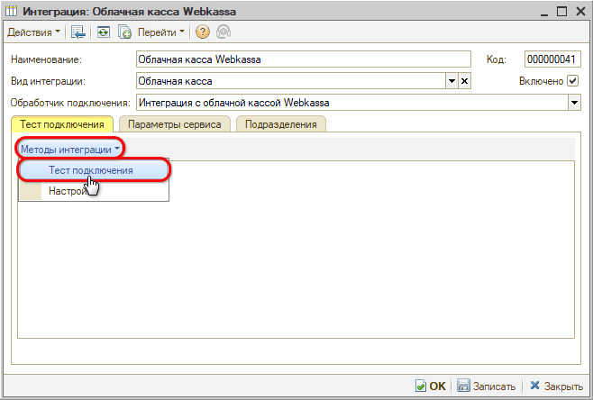

В случае правильной настройки появится сообщение “Тест подключения прошел успешно”:

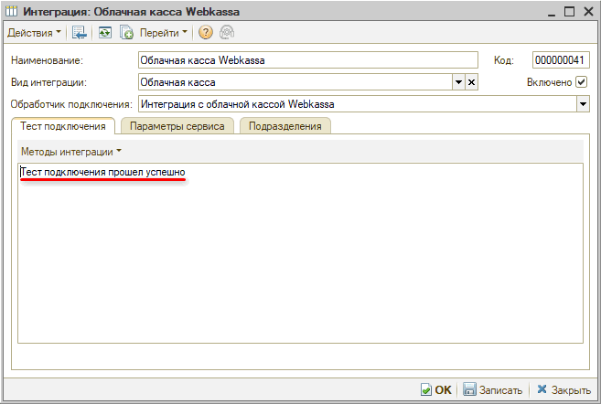

### 3. Настройка оборудования

Для создания онлайн-кассы в [справочнике “Оборудование”](https://www.5systems.ru/help/podklyuchenie-kassy-kkm) следует нажать кнопку “Добавить” и на первом шаге ***выбрать интеграцию*** *“5S AUTO”:*

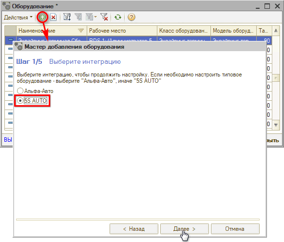

***Класс оборудования*** *“Облачная касса”* установлен по умолчанию:

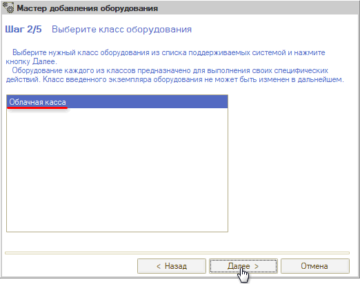

Следует выбрать ***обработчик*** *“Облачная касса Webkassa”,* – ***идентификатор*** и ***наименование*** при этом *будут заполнены автоматически,* – и *записать:*

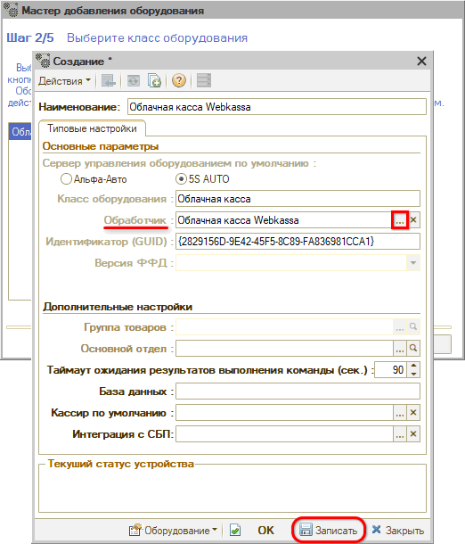

*Примечание:* Настройки для облачной кассы выполняются только *в личном кабинете на сайте.* В программе включение, выключение и настройки оборудования не производятся – кнопки “Включить”, “Выключить” и “Настроить параметры” неактивны:

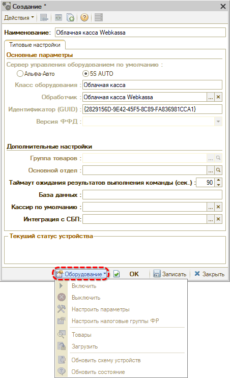

Созданную кассу необходимо указать в настройках [рабочего места](https://www.5systems.ru/help/rabochie-mesta) в параметре “ФР”:

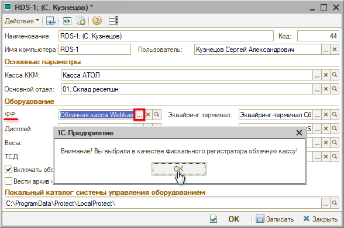

При этом выходит предупреждение программы для того, чтобы облачную кассу невозможно было выбрать случайно.

---

**Теги:** прием оплаты, webkassa, облачная касса, казахстан, интеграция

