

# Использование Чека коррекции

<table><tr><td><b>Время чтения:</b> 22 мин.</td><td><b>Обновлено:</b> 22.10.2024</td></tr></table>

Источник: https://www.5systems.ru/help/ispolzovanie-cheka-korrekcii

> *Функционал доступен начиная с релиза 2.8.1.*

## Содержание

1. [Введение](#введение)
2. [Помощник создания чеков коррекции](#помощник-создания-чеков-коррекции)
   - [Интерфейс](#интерфейс)
   - [Режимы](#режимы)
   - [Параметры](#параметры)
3. [Работа с чеком коррекции](#работа-с-чеком-коррекции)
   - [Неприменение ККТ](#неприменение-ккт)
   - [Исправление пробитого чека](#исправление-пробитого-чека)
   - [Корректировка движений по регистрам](#корректировка-движений-по-регистрам)
4. [Настройка для ввода новых чеков коррекции](#настройка-для-ввода-новых-чеков-коррекции)
5. [Дополнительно](#дополнительно)

## Введение

В программе реализована работа с кассовыми *чеками коррекции* в соответствии с п. 4 ст. 4.3 Федерального закона от 22.05.2003 № 54-ФЗ “О применении контрольно-кассовой техники при осуществлении расчетов в Российской Федерации” – см. [закон](https://www.consultant.ru/document/cons_doc_LAW_42359/c66f699f7114b0ac2d3309283162539ad93ea8d1/)[.]( www.consultant.ru=)

ФНС штрафует организации за невыдачу кассового чека при продаже товаров или выполнении работ или за ошибку в его реквизитах ([ст. 14.5 КоАП РФ](https://www.consultant.ru/document/cons_doc_LAW_34661/3824bbacc6e85f19f12895b0ee20f3bbae92f439/)). Если своевременно обнаружить и исправить нарушение, то привлечения к административной ответственности можно избежать. Для этого должны быть выполнены следующие условия:

- заявление о неприменении кассы поступило до того, как инспекция узнала о нарушении;
- представленные сведения и документы являются достаточными для установления события нарушения.

Именно для таких исправлений и нужен чек коррекции.

***Кассовый чек (БСО) коррекции*** – чек, который формируется для выполнения корректировки расчетов, произведенных ранее. Он должен быть сформирован не позднее отчета о закрытии смены.

Согласно закону, кассовый чек коррекции должен применяться пользователем ККТ в следующих случаях:

- когда операция по ККТ была проведена с нарушением – например, был пробит чек с ошибочной суммой;
- когда чек не был пробит совсем – например, при поломке кассы.

Также пользователь контрольно-кассовой техники должен сообщить в налоговый орган подробную информацию (см. [письмо ФНС](https://its.1c.ru/db/garant/content/71736044/hdoc), нужен доступ к Порталу 1С:ИТС) о произведенной корректировке расчетов, в том числе реквизиты чеков коррекции.

**Особенности применения кассового чека коррекции в зависимости от версии ФФД**

Особенности применения кассового чека коррекции зависят от *версии ФФД – формата фискальных данных,* поддерживаемых ФН – фискальным накопителем. По ФФД касса формирует документы, определяет, какие реквизиты должны быть в них – в том числе и в чеке коррекции.

В настоящее время существует три актуальных версии ФФД: 1.05, 1.1, 1.2. Версию ФФД можно узнать в личном кабинете оператора фискальных данных (ОФД), в личном кабинете налогоплательщика на официальном сайте Федеральной налоговой службы, распечатать на кассе “Отчет об открытии смены”, также версия ФФД отображается в реквизитах каждого пробитого кассового чека.

От версии ФФД зависит применение либо неприменение чека коррекции в случае необходимости *корректировки ошибочно пробитых чеков.*

В случае если ККТ *не применялась* во время оплаты, чек коррекции печатается независимо от того, с каким ФФД работает ФН, но при использовании формата 1.05 следует дополнительно составить акт и направить в ФНС.

<table><tr><td><b>Для форматов 1.1 и 1.2</b></td><td><b>Для формата 1.05</b></td></tr><tr><td colspan="2"><b><i>1) В случае неприменения ККТ</i></b></td></tr><tr><td>Следует сформировать на кассе чек коррекции, который автоматически уйдет в адрес ОФД, а оттуда – в налоговую. Поскольку в чеке есть реквизит “Наименование товара (работ, услуг)”, составлять дополнительно акт не нужно</td><td>Чек коррекции на этом формате не содержит реквизита “Наименование товара (работ, услуг)”. Поэтому следует пробить чек коррекции, и в дополнение к нему составить <i>акт</i> с описанием проданного товара и его цены. В акте проставляют даты расчетов без кассы, наименование товаров и их стоимость. Если мимо кассы прошло несколько товаров, их все нужно указать в акте, а чек коррекции выбить на общую сумму. Важно, чтобы суммы в чеке и акте совпадали. Также в акте нужно указать причину неприменения ККТ. Специальной формы для акта не предусмотрено, он составляется в произвольной форме. В обращении в ФНС необходимо описать обстоятельства совершения нарушения, а также сообщить об их устранении (пробитии чека коррекции). Чек коррекции уходит через ККТ в адрес ОФД и затем в налоговую. Акт направляется в ИФНС самостоятельно любым удобным способом (лично, по почте и т.д.)</td></tr><tr><td colspan="2"><b><i>2) В случае исправления ошибочно пробитого чека</i></b></td></tr><tr><td>Также применяется чек коррекции</td><td>Для исправления ошибочно пробитого чека применяются <i>чеки возврата,</i> чек коррекции не используется – подробнее см. в разделе <a href="#dlya_FFD_1_05"><i>ниже</i></a></td></tr></table>

Рекомендации о том, как правильно исправлять ошибки, даны в [письме ФНС от 6 августа 2018 г. № ЕД-4-20/15240@](https://www.garant.ru/products/ipo/prime/doc/71912330/).

Также рекомендуются для изучения источники:

- статья на сайте ФНС "[Чек коррекции: какие существуют способы и причины формирования таких чеков](https://www.nalog.gov.ru/rn28/news/activities_fts/13797617/)";
- [методический материал](https://its.1c.ru/db/retaildoc#content:80:hdoc) на Портале 1С:ИТС (требуется доступ к порталу);
- [методический материал](https://rarus.ru/kb/samouchitel-alfa-avto/kak-rabotat-s-chekom-korrektsii-v-alfa-avto/) на сайте 1С-Рарус.

## Помощник создания чеков коррекции

Для упрощения ввода документов в программе реализована обработка ***“Помощник создания чеков коррекции”**.*

Обработка открывается при вводе документа “Чек коррекции” на основании документов[\*](#snoska) “Чек на оплату”, “Чек”, “Приходный кассовый ордер”, “Расходный кассовый ордер”, “Чек коррекции”. 
*\*Примечание: У документа должен быть установлен признак "Для пробития на фискальном регистраторе".*

[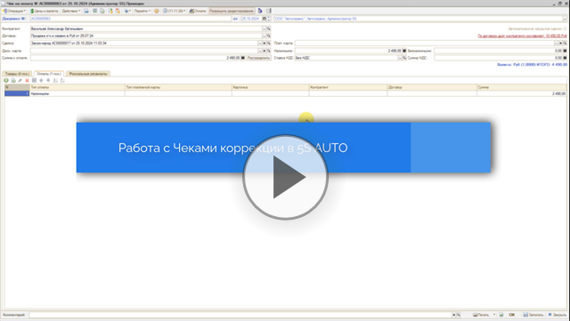](https://edu.5systems.ru/video/Cheki_korrekcii/Cheki_korrekcii.mp4)

### Интерфейс

Все необходимые параметры подтягиваются автоматически из документа оплаты на форму обработки:

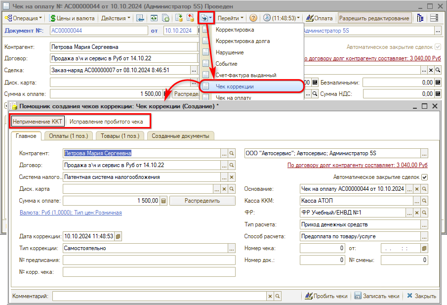

На верхней панели “Помощника” находятся кнопки-индикаторы режимов ввода чеков коррекции – “Неприменение ККТ” либо “Исправление пробитого чека” – описание см. *[ниже](#режимы).*

Заполнение параметров документа производится на четырех вкладках: *Главное, Оплаты, Товары, Созданные документы.* 
Описание параметров на вкладках см. [*ниже*](#параметры).

### Режимы

*Режим ввода чека коррекции* устанавливается автоматически в зависимости от того, *был ли пробит чек* по документу-*основанию:*

1. *Неприменение ККТ* – режим используется в случае если не пробит документ-основание, устанавливается при выборе в параметре “Основание” документа, по которому не был пробит чек, либо если параметр не заполнен;
2. *Исправление пробитого чека* – режим для корректировки пробитого чека, устанавливается при выборе документа, по которому был пробит чек ККМ, если документ-основание не заполнен – режим недоступен. Режим используется только для версий ФФД 1.1 и 1.2 – см. [*выше*](#versii_ffd).

В режиме *“Неприменение ККТ”* Помощник ввода чеков коррекции создает один документ, в который подгружаются данные, введенные в Помощнике. Полученный результат пробивается на ФР. Подробнее см. *[ниже](#неприменение-ккт).*

Помощник в режиме *"Исправление пробитого чека"* создает два документа: первый идентичен корректируемому документу-основанию, только с противоположным типом расчета (например, если был приход – будет возврат прихода), а второй чек содержит правильную информацию, внесенную через “Помощника”. Оба полученных документа также пробиваются на ФР. В “Помощник” следует вводить сразу правильные данные – программа сама сделает возврат и отменит некорректный чек, а данные, введенные в Помощнике, войдут в правильный чек. Подробнее см. *[ниже](#исправление-пробитого-чека).*

### Параметры

**Вкладка “Главное”**

На вкладке “Главное” доступна вся основная информация по транзакции:

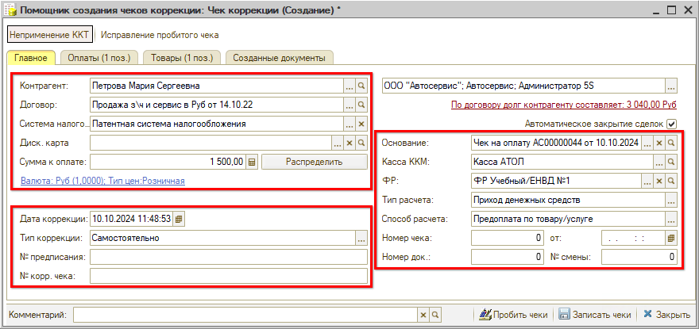

1. Параметры в левой части формы: *Контрагент, Договор, Система налогообложения, Диск. карта, Сумма к оплате, Дата корректируемого расчета, Тип коррекции, Номер предписания* (при наличии), *Номер корректируемого чека* (подтягивается автоматически при исправлении пробитого чека – см. *[ниже](#исправление-пробитого-чека)).*

   Особенности выбора *Типа коррекции:*

   - 1\) *Самостоятельно* – операция устанавливается по умолчанию, используется, если ошибку обнаружили сами, прежде чем о ней узнала ФНС.
   - 2\) *По предписанию* – операцию следует установить вручную, если ошибку обнаружила ФНС и обязала ее исправить, в данном случае также следует в следующем параметре заполнить номер предписания налогового органа.
2. Параметры в правой части формы: *Документ-основание, Касса ККМ, ФР, Тип расчета, Способ расчета, Номер и дата смены, Номер чека, Номер документа.*

   Варианты *Типа расчета:*

   - *Приход денежных средств* – устанавливается в случае, если кассу не применили при приеме денег;
   - *Возврат денежных средств* – в случае исправления пробитого чека устанавливается для первого, т.е. отменяющего чека коррекции (см. *[ниже](#vozvratnyj_chek)).*

   Варианты *Способов расчета:* Предоплата по товару/услуге, Передача товара/услуги, Постоплата по товару/услуге.

*Кнопка “Распределить”* – при внесении изменений суммы на любой из вкладок следует перейти на вкладку “Главное” и нажать данную кнопку для распределения оплат.

**Вкладка “Оплаты”**

В таблицу на вкладке “Оплаты” подтягиваются все оплаты из документа-основания, в т. ч. авансы. Есть возможность изменять любые нужные данные – добавлять и удалять оплаты разного типа, вводить сумму для каждого типа оплаты и другие параметры:

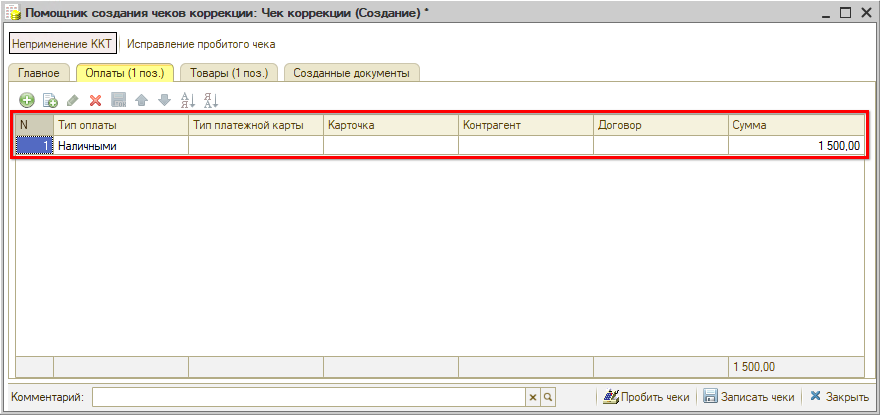

**Вкладка “Товары”**

В таблице на вкладке “Товары” представлен список товаров и услуг из документа-основания. Есть возможность изменить или внести сведения о товарах – добавить номенклатуру, изменить количество и единицу измерения, цену с учетом скидок, выбрать ставку НДС:

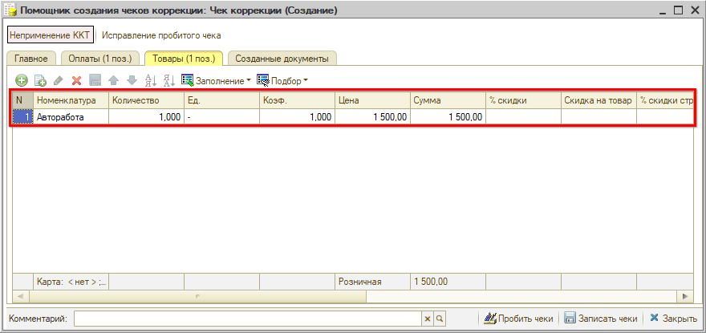

**Вкладка “Созданные документы”**

На вкладке “Созданные документы” при записи или при пробитии чеков коррекции появляются гиперссылки на созданные документы:

- для режима неприменения ККТ – только Чек коррекции;
- для режима исправления пробитого чека – Отменяющий чек и Чек коррекции (см. *[ниже](#vozvratnyj_chek)).*

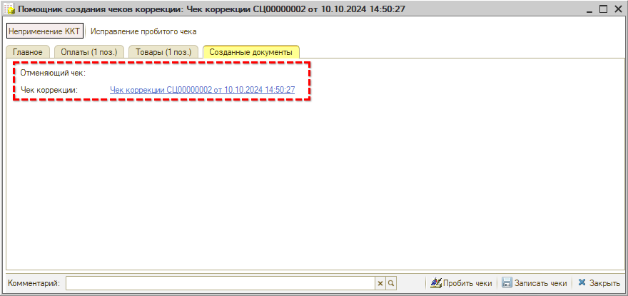

Если по какой-либо причине взаимодействие с ККТ в момент пробития чека будет прервано, пользователь может перейти в непробитый чек коррекции и пробить его уже из формы документа коррекции после восстановления работоспособности ККТ.

## Работа с чеком коррекции

### Неприменение ККТ

В случае неприменения ККТ, например, при поломке кассовой техники или отключении электричества во время принятия оплаты от клиента, либо если кассир принял оплату картой через терминал эквайринга, а про кассу забыл, необходимо пробивать чек коррекции – для любой версии ФФД.

В качестве основания следует выбрать проведенный, но не пробитый документ “Чек на оплату”. При этом Помощник создания чеков коррекции автоматически переключается на режим работы “Неприменение ККТ”, подтягиваются параметры из документа основания, а также заполняются вкладки "Оплаты" и "Товары":

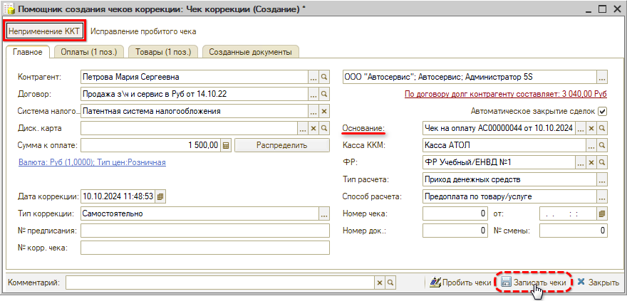

Подготовленный Чек коррекции можно *записать* и проверить все реквизиты и данные, либо сразу пробить нажатием на кнопку *“Пробить чеки”.* При этом открывается форма пробития кассового чека коррекции, на которой следует нажать кнопку *“Пробить чек”:*

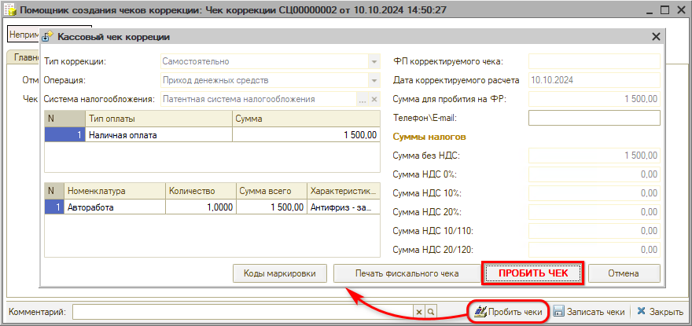

В результате создается документ “Чек коррекции” с типом расчета “Приход денежных средств”:

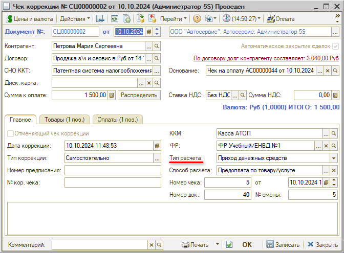

Также пробивается бумажный или электронный *кассовый чек коррекции* с операцией “Приход”.

После пробития чека документ становится недоступным для редактирования.

### Исправление пробитого чека

В случае пробития чека с ошибочными данными в качестве основания следует выбрать пробитый документ: при этом “Помощник” автоматически переключается на режим “Исправление пробитого чека”.

*Примечание: Данный режим используется только для ФФД версий 1.1 и 1.2. Для ФФД версии 1.05 коррекционные чеки не используются, вместо них следует использовать чеки возврата – см. пример [ниже](#dlya_FFD_1_05).*

Данные в Помощнике, в том числе вкладки “Оплаты” и “Товары”, заполняются согласно документу-основанию:

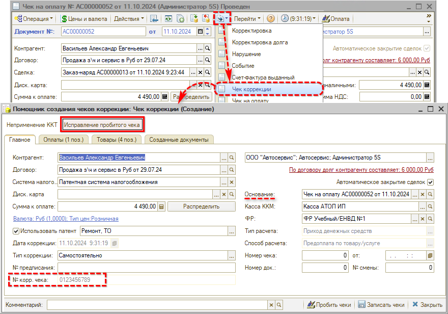

Например, была пробита сумма больше, чем требовалось (и чем было принято от клиента).

В Помощнике ввода чеков коррекции ошибочную стоимость необходимо исправить:

1. на вкладке “Товары” – если была сделана ошибка в стоимости самого товара или работы, например, изменить ошибочно пробитое количество товара или цену:

   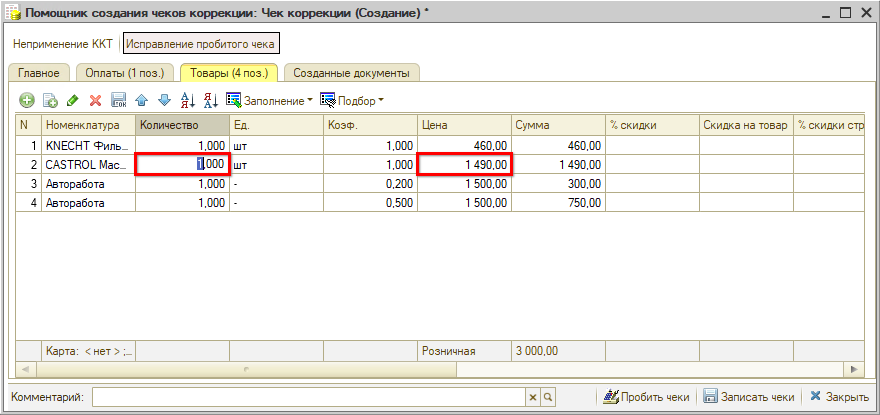

2. на вкладке “Оплаты” также необходимо скорректировать сумму оплаты:

   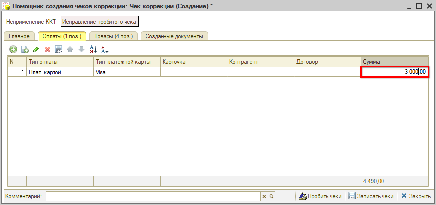

3. на вкладке “Главное” исправить сумму к оплате и *нажать кнопку “Распределить”:*

   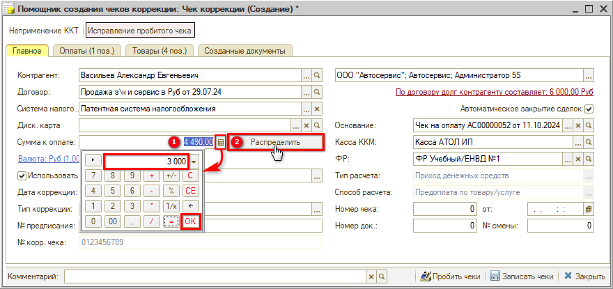

Далее следует *записать чеки* – при этом сохраненные документы будут указаны на вкладке “Созданные документы”:

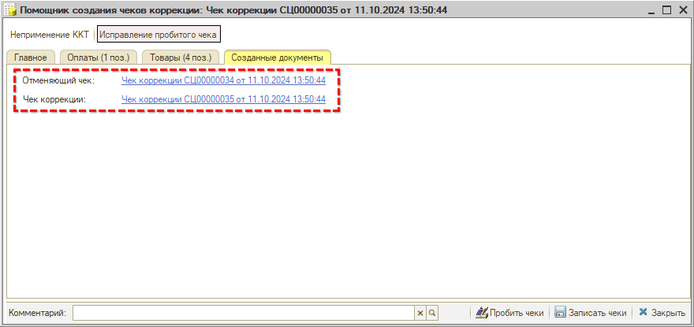

Затем необходимо нажать кнопку *“Пробить чеки”.* В открывшейся форме следует последовательно пробить два чека коррекции. При первом нажатии кнопки *“Пробить чек”* пробивается *отменяющий чек коррекции:*

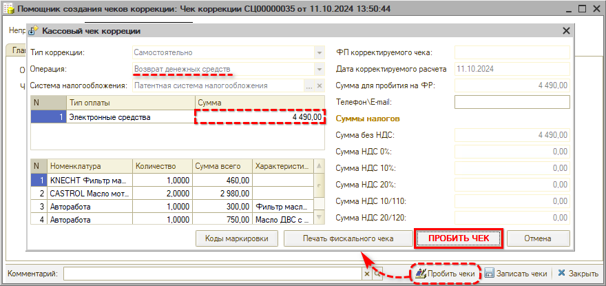

Затем следует второй раз нажать кнопку *“Пробить чек”* для пробития *правильного* *корректирующего чека:*

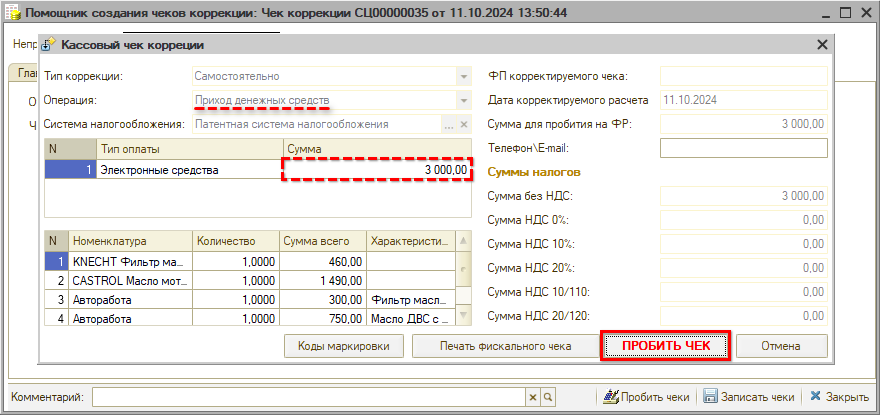

Первый коррекционный чек возвращает ошибочный платеж, имеет тип расчета “Возврат денежных средств” и признак “Отменяющий чек коррекции”. Второй чек коррекции содержит правильные данные и повторяет операцию ошибочного чека (в рассматриваемом примере – приход):

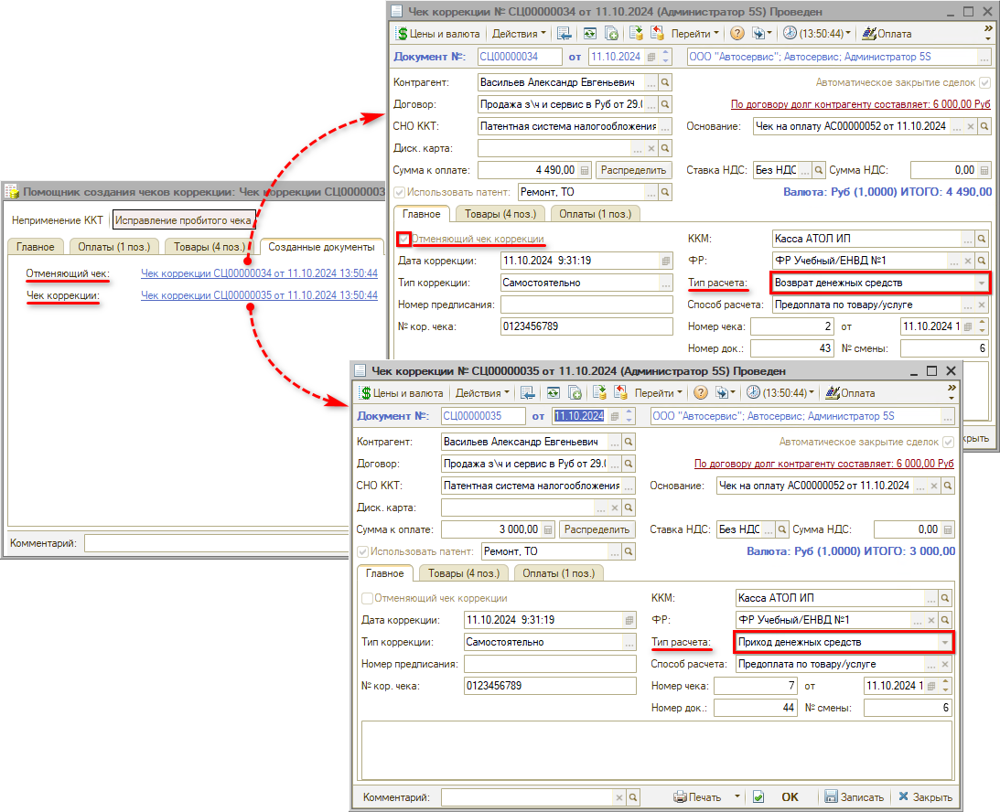

После пробития чеков на кассе в документы подтягиваются фискальные реквизиты – фискальный номер чека на ФР, дата пробития чека, сквозной номер документа ФР, номер смены ФР.

На вкладке “Главное” при этом также заполняются фискальные реквизиты пробитого корректирующего чека:

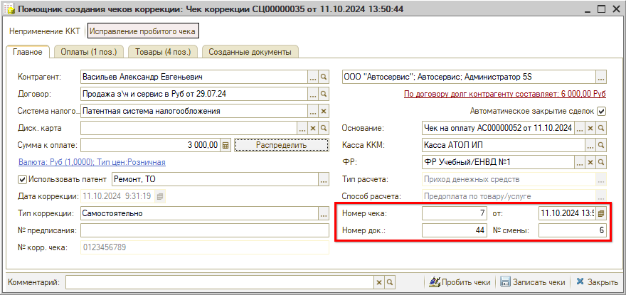

***Варианты исправлений:***

1. *Стоимость товара в чеке больше*

   Пример рассмотрен в описании *[выше](#исправление-пробитого-чека).*

2. *Стоимость товара в чеке меньше*

   Данный пример является обратным предыдущему: у товара, пробиваемого в чеке по ошибке, указывается меньшая стоимость, чем есть на самом деле. По законодательству корректировать такой чек не обязательно, и по умолчанию предполагается, что клиенту была предоставлена скидка. Однако в том случае, если ошибка была обнаружена сразу, и клиент еще не ушел, чек можно откорректировать – схема действий не будет отличаться от описанной выше. В результате также пробиваются два чека коррекции: возвратный и корректирующий.

3. *Ошибка в способе расчета*

   Например, клиент внес предоплату за товар наличными, но приняли деньги как безналичный платеж картой. 
   В данном случае следует на вкладке “Оплаты” изменить некорректный тип оплаты на правильный, а также очистить тип платежной карты. “Распределить” оплаты и пробить чеки. Также создаются два документа – отменяющий и корректирующий с правильной информацией об оплате. 
   Если тип оплаты в Чеке коррекции “Безналичные средства”, то эквайринг-терминал, подключенный к системе, не будет задействован в операции, т.к. подразумевается, что клиент уже оплатил покупку, и необходимо только передать в ОФД корректную информацию по сделке.

4. *В чеке указан не тот товар, который был реализован*

   В Помощнике создания чеков коррекции необходимо на вкладке “Товары” заменить ошибочную номенклатуру правильной. Если в чеке указан товар, который не был реализован, следует удалить ошибочную номенклатуру. В случае если у позиций также отличается стоимость, после изменения товара необходимо перейти на вкладку “Оплаты”, отредактировать внесенную сумму (в том случае, если клиент заплатил по верной стоимости), затем распределить оплаты по кнопке и пробить чеки.

5. *Ошибка в чеке коррекции*

   На основании Чека коррекции необходимо ввести еще один чек коррекции. 
   Следует сформировать чеки коррекции на основании второго – корректирующего – чека коррекции (через дерево документов). На основании отменяющего чека это сделать нельзя – программа заблокирует данное действие и выведет предупреждение. 
   В новом чеке коррекции нужно изменить стоимость в товарах и сумму в оплатах, распределить оплаты и пробить новые чеки – их также будет два: отменяющий и корректирующий.

6. *Для ФФД 1.05*

   Для ФФД 1.05 коррекционные чеки не используются, вместо них следует использовать чеки возврата. 
   На основании некорректного документа “Чек на оплату” необходимо ввести еще один документ “Чек на оплату”, он автоматически генерируется с хоз. операцией “Возврат по чеку на оплату”. Этот чек будет пробиваться с противоположным документу-основанию способом расчета, например, в случае исправления ошибочно пробитой суммы это возврат прихода. 
   После пробития возвратного чека необходимо ввести новый чек на оплату, который будет заполнен корректно.

7. *Расхождение в суммах реальных и пробитых средств обнаружили на следующий день, когда смена уже была закрыта и открыта новая*

   Для того, чтобы обнаруживать расхождение в суммах реальных и пробитых средств день в день, рекомендуется отключить право "Разрешить закрытие смены в случае расхождения суммы продаж" по Пользователю.

### Корректировка движений по регистрам

Формирование чеков коррекции методически предусмотрено, как правило, для случаев, когда продавец не имеет возможности взаимодействовать с покупателем – покупатель уже покинул торговую точку, а чек оформлен неправильно.

В связи с этим формирование документа “Чек коррекции” не делает движений по регистрам учета программы (кроме регистров регистрации продаж), – только отправляет исправленную информацию в ОФД.

Поэтому в случае необходимости внесения корректировок во внутренние данные системы при пробитии чека коррекции пользователь делает это самостоятельно, используя документы на свое усмотрение – например, оформляет списание или оприходование товаров – для корректировки складских остатков, *Приходный* или *Расходный ордер* – для корректировки остатков денежных средств.

Если же покупатель вернулся с товаром и предъявил претензию, то в этом случае необходимо оформить документ “Возврат товаров от покупателя” с последующей продажей. При этом документы сделают все движения товаров и денежных средств по регистрам учета.

## Настройка для ввода новых чеков коррекции

Настройка *“Ввод новых чеков коррекции только через Помощника ввода чеков коррекции”* запрещает создание новых документов “Чек коррекции” вручную, т.е. не через Помощник:

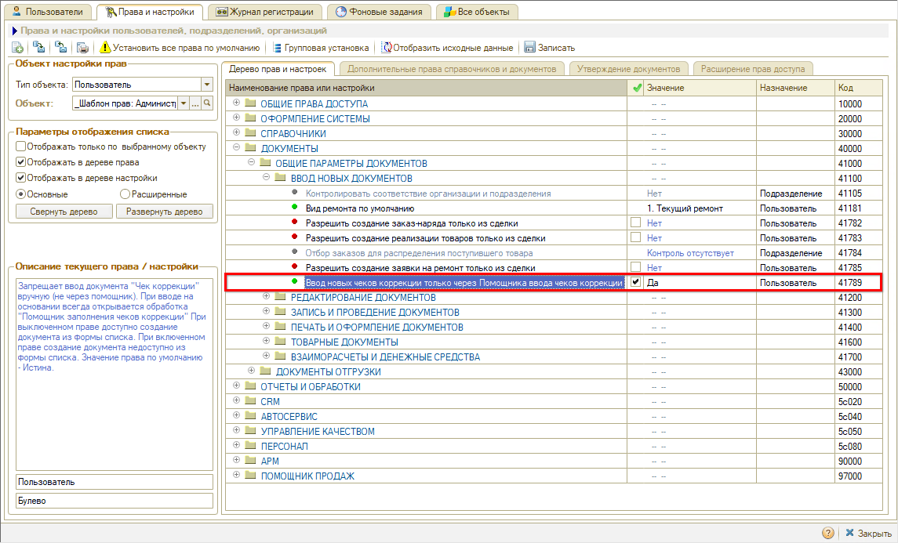

Настройка включена по умолчанию. Для того чтобы была возможность *создавать* коррекционные документы *вручную из списка,* следует ее отключить.

*Примечание:* При вводе документов “Чек коррекции” *на основании других документов* всегда открывается “Помощник” – независимо от значения данной настройки.

## Дополнительно

### Пример объяснительной

--------------------------------------------------------------------------------------------------------------------

**Индивидуальный предприниматель** 
**Фамилия Имя** 
**ИНН ___, ОГРНИП ___, ___ область, г. ____, ул. ___ , д. ___, кв. ___  тел. ___**

Исх.№ __ от 23.08.2021 г.

**Руководителю МИФНС России №3** 
**по Московской области**

Заявление-объяснительная по чеку ККТ

Индивидуальный предприниматель Фамилия Имя сообщает, что на кассовом аппарате АТОЛ FPrint-22ПТК, регистрационный номер № ____ произошла следующая ситуация.

При пробитии чека в 20:02:11 по заказу покупателя от 20.08.2021 г. на общую сумму 97780-00 руб. (в том числе электронными – 45580-00 руб., предварительная оплата – 52200-00 руб.) терминал дал сбой, денежные средства списались с карты клиента и поступили по эквайрингу на расчетный счет, а к ОФД чек не распечатался и не прошел.

В связи с вышеизложенной ситуацией был пробит чек коррекции с признаком «Приход» на сумму 97780-00 руб. ФД 7531 от 23.08.2021 г.

Приложение: чек коррекции.

Индивидуальный предприниматель                                        Фамилия И. О.

--------------------------------------------------------------------------------------------------------------------

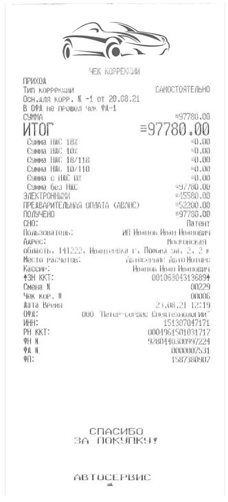

---

**Теги:** прием оплаты, чек коррекции, ккт, касса, исправление чека

