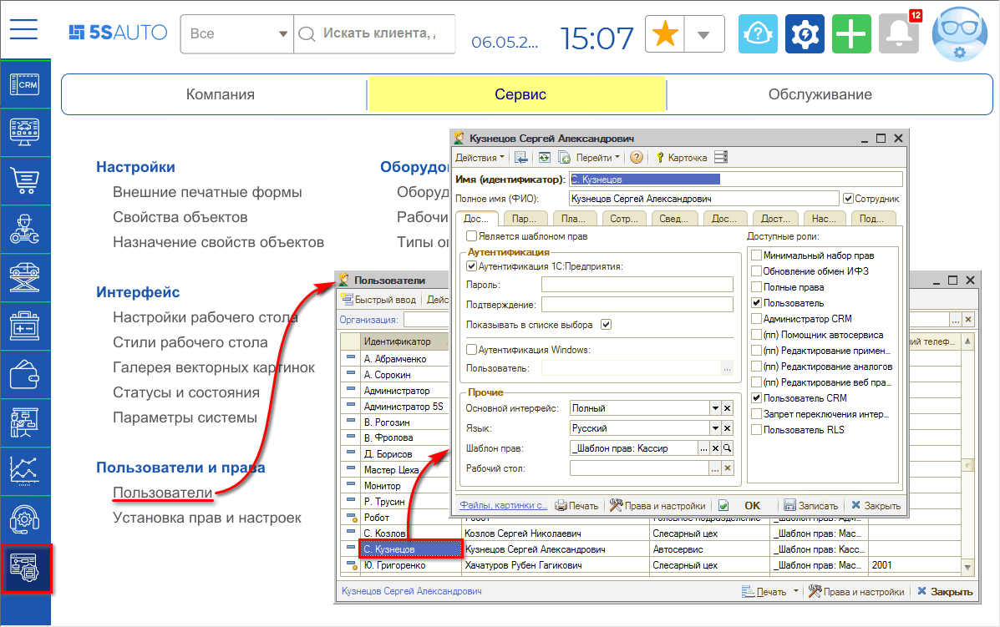
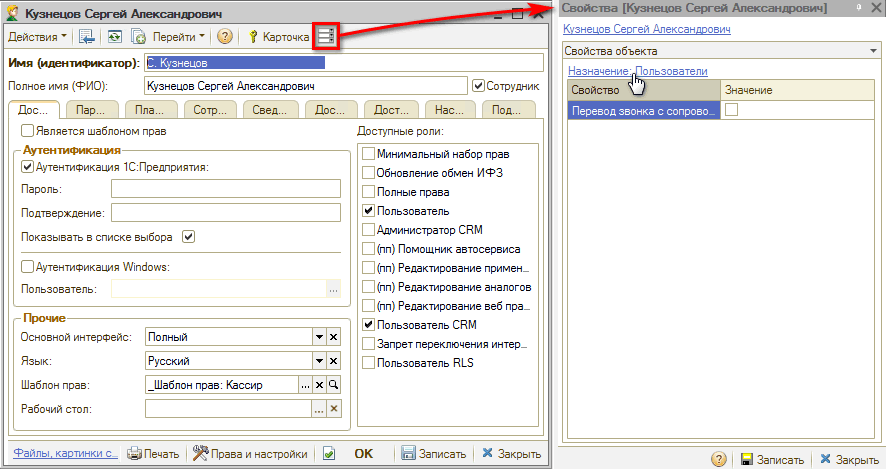
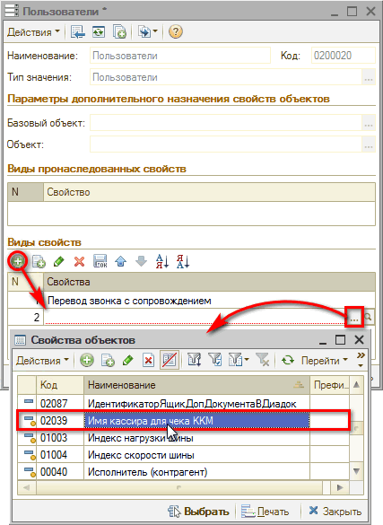
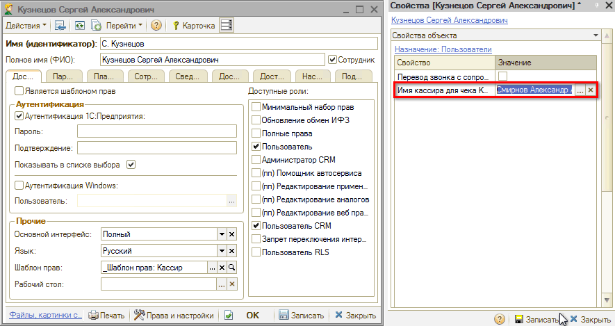

# Настройка имени кассира для чека ККМ

<table><tr><td><b>Время чтения:</b> 8 мин.</td><td><b>Обновлено:</b> 15.06.2022</td></tr></table>

Источник: https://www.5systems.ru/help/nastroyka-imeni-kassira-dlya-cheka-kkm

## Содержание

1. [Введение](#введение)
2. [Настройка](#настройка)

## Введение

В кассовом чеке в поле *“Кассир”* по умолчанию печатаются Ф.И.О. текущего пользователя, т.е. автора документа (чека на оплату или ПКО).

Если требуется, чтобы вместо текущего пользователя печатались Ф.И.О. определенного лица (например, ИП), следует произвести следующую настройку.

## Настройка

Настройка печати имени кассира в чеке ККМ производится в карточке пользователя. Требуется перейти в справочник “Пользователи” и открыть в нем нужный элемент:

В карточке пользователя необходимо открыть панель свойств и нажать ссылку *“Назначение: Пользователи”*:

В открывшемся окне требуется добавить свойство нажатием на кнопку "Добавить"  , выбрать из справочника “Свойства объектов” свойство *“Имя кассира для чека ККМ”* и нажать "Записать" или “ОК”:

На панели свойств появилось выбранное свойство\*. В поле *“Значение”* требуется ввести строкой нужные фамилию, имя и отчество кассира и *Записать* изменения в свойствах объекта и в карточке пользователя:

*\*Данное свойство при этом добавляется для всех элементов справочника "Пользователи", т.е. в дальнейшем для каждого пользователя добавлять его будет не нужно – только заполнять значение при необходимости.*

В результате для документов, автором которых будет являться данный пользователь, в чеке ККМ будет печататься имя кассира, указанное в свойствах.

---

**Теги:** прием оплаты, касса, кассир, чек ккм, настройка

