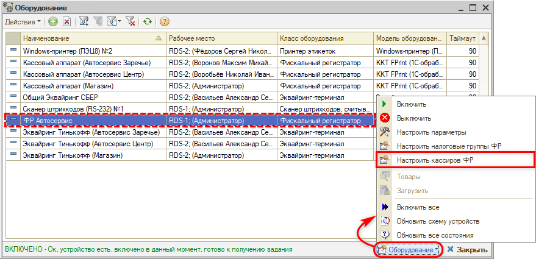
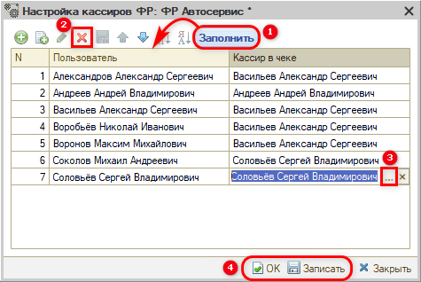
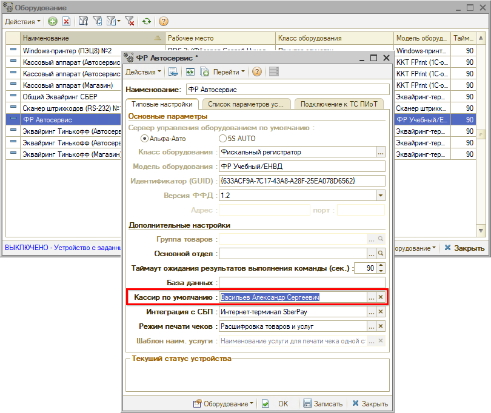

# Настройка кассиров ФР

<table><tr><td><b>Время чтения:</b> 3 мин.</td><td><b>Создано:</b> 24.09.2026</td></tr></table>

> *Актуально начиная с версии релиза 5S AUTO **2.8.5**.*

## Содержание

1. [Введение](#введение)
2. [Настройка кассиров ФР](#настройка-кассиров-фр)
3. [Другие способы задать кассира в чеке](#другие-способы-задать-кассира-в-чеке)

## Введение

По умолчанию в кассовом чеке в поле «Кассир» печатается ФИО текущего пользователя – автора документа.

Настройка **кассиров ФР** позволяет задать кассира по умолчанию для конкретного фискального регистратора **отдельно для каждого пользователя**. Например, если на одной кассе работают несколько сотрудников и в чеках каждого из них нужно печатать определенного кассира.

## Настройка кассиров ФР

1. Откройте [справочник «Оборудование»](../../Торговое%20оборудование/Справочник%20Оборудование/spravochnik-oborudovanie.md): **Администрирование → Сервис → Оборудование**.
2. Выделите в списке нужный фискальный регистратор, нажмите кнопку **«Оборудование»** и выберите **«Настроить кассиров ФР»**:

   

3. Откроется окно «Настройка кассиров ФР: <наименование ФР>»:

   

   **1)** Нажмите **«Заполнить»** – в таблицу добавятся все активные пользователи. 
   **2)** Удалите лишние строки кнопкой **«Удалить»**. 
   **3)** В колонке **«Кассир в чеке»** выберите для каждого пользователя кассира, ФИО которого будет печататься в чеке. 
   **4)** Нажмите **«ОК»** или **«Записать»**.

Настройка выполняется отдельно для каждого фискального регистратора.

## Другие способы задать кассира в чеке

- **Кассир по умолчанию** в карточке кассы – один кассир для всех чеков по этой кассе независимо от того, кто работает в программе. Реквизит находится на вкладке «Типовые настройки» в блоке «Дополнительные настройки» – см. «[Справочник «Оборудование» → Дополнительные настройки](../../Торговое%20оборудование/Справочник%20Оборудование/spravochnik-oborudovanie.md#дополнительные-настройки)»:

  

- **Имя кассира для чека ККМ** в свойствах пользователя – ФИО, которое печатается в чеках по документам этого пользователя на всех кассах, – см. статью «[Настройка имени кассира для чека ККМ](../Настройка%20имени%20кассира%20для%20чека%20ККМ/nastroyka-imeni-kassira-dlya-cheka-kkm.md)».

*Примечание:* Настройка кассиров ФР имеет приоритет: если для пользователя в ней указан кассир, в чеке по этому фискальному регистратору печатается он, даже если заполнены «Кассир по умолчанию» в карточке кассы или свойство «Имя кассира для чека ККМ».

---

**Теги:** касса, ККМ, фискальный регистратор, ФР, чек, кассир, кассир по умолчанию, кассиры ФР, оборудование, пользователь
