

# Настройка приложения 5S Pay

<table><tr><td><b>Время чтения:</b> 18 мин.</td><td><b>Обновлено:</b> 24.04.2025</td></tr></table>

Источник: https://www.5systems.ru/help/nastroyka-prilozheniya-5s-pay

> *Функционал доступен начиная с релиза 2.8.2.1.*

## Содержание

1. [Введение](#введение)
2. [Режимы работы](#режимы-работы)
   - [1. Терминал СБП](#1-терминал-сбп)
   - [2. Электронный кассир](#2-электронный-кассир)
3. [Запуск приложения](#запуск-приложения)
4. [Настройка](#настройка)
   - [1. Требования к оборудованию](#1-требования-к-оборудованию)
   - [2. Настройки в программе](#2-настройки-в-программе)
   - [3. Настройки в 5S Pay](#3-настройки-в-5s-pay)
      - [Настройки для режима терминала СБП](#настройки-для-режима-терминала-сбп)
      - [Настройки для режима электронного кассира](#настройки-для-режима-электронного-кассира)
      - [Настройка экрана ожидания](#настройка-экрана-ожидания)

## Введение

***5S Pay*** – это вспомогательное приложение для приема оплаты от клиентов. Приложение предлагает 2 режима работы:

1. *Терминал СБП* – в данном режиме телефон устанавливается рядом с кассой на подставке с запущенным приложением, при каждом открытии Фронта кассира в 5S AUTO на терминал выводится QR-код платежной ссылки СБП, сформированной под текущий чек.
2. *Электронный кассир* – в данном режиме планшет с запущенным приложением устанавливается в клиентской зоне, клиенты могут самостоятельно осуществить оплату документов на терминале.

Запустить приложение 5S Pay можно через браузер, открыв страницу [https://pay.5systems.ru/](https://pay.5systems.ru/). Далее необходимо войти под учетной записью 5S Cloud – см. *[ниже](#запуск-приложения).* После входа приложение предложит установить ярлык на устройство для упрощенного запуска в последующем (см. *[ниже](#ustan_yarl)).*

## Режимы работы

### 1. Терминал СБП

В случае работы 5S Pay в режиме терминала СБП при открытии [Фронта кассира](../Упрощенный%20Фронт%20кассира/uproschennyy-front-kassira.md) в программе 5S AUTO на экран устройства выводится QR-код для оплаты через [СБП](../../Банки%20и%20платежные%20системы/Система%20быстрых%20платежей/Работа%20с%20СБП/rabota-s-sbp.md):

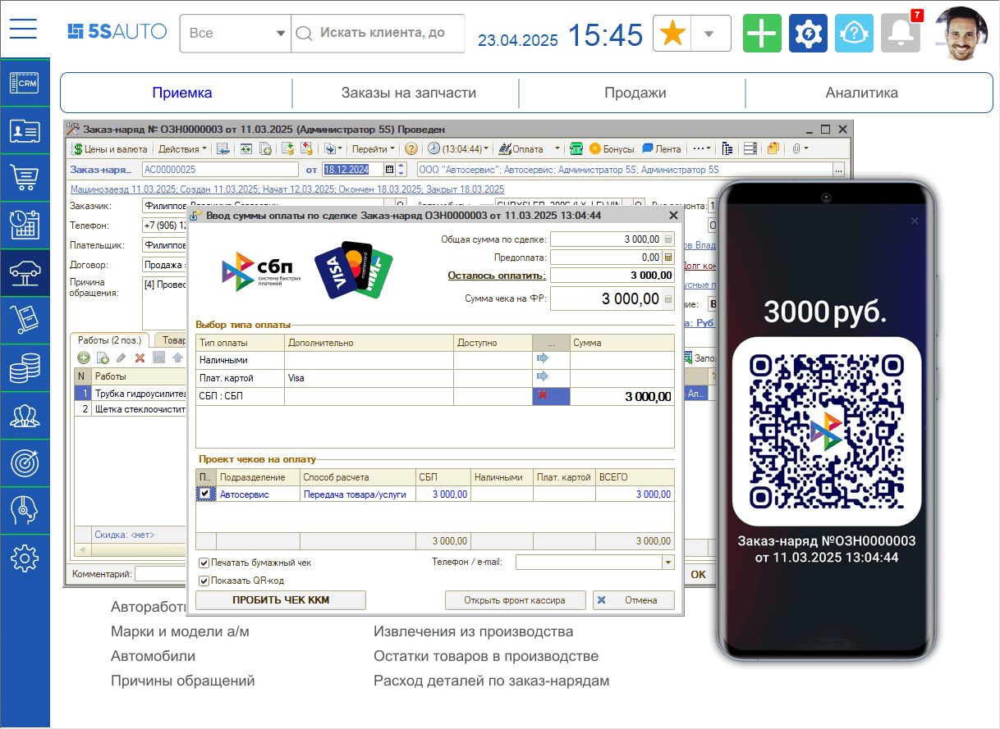

Если клиент желает оплатить через СБП, то он должен просканировать QR-код камерой в приложении своего банка и произвести оплату.

Фронт кассира автоматически получает данные о поступившей оплате (см. в статье “[Работа с СБП](../../Банки%20и%20платежные%20системы/Система%20быстрых%20платежей/Работа%20с%20СБП/rabota-s-sbp.md#уведомление)”), после устанавливает [тип оплаты](../../Банки%20и%20платежные%20системы/Система%20быстрых%20платежей/Работа%20с%20СБП/rabota-s-sbp.md#настройка-типа-оплаты) в чеке в соответствии с настройками интеграции с СБП, через которую поступил платеж, и пробивает чек.

После этого терминал возвращается на [экран ожидания](#настройка-экрана-ожидания). При отмене оплаты и закрытии Фронта кассира устройство также переходит на экран ожидания.

### 2. Электронный кассир

В случае работы в режиме электронного кассира клиенты, находясь в клиентской зоне рядом с терминалом, могут самостоятельно оплатить документы и списать бонусы со своего счета.

Клиент на экране устройства нажимает кнопку *“Оплатить документ”:*

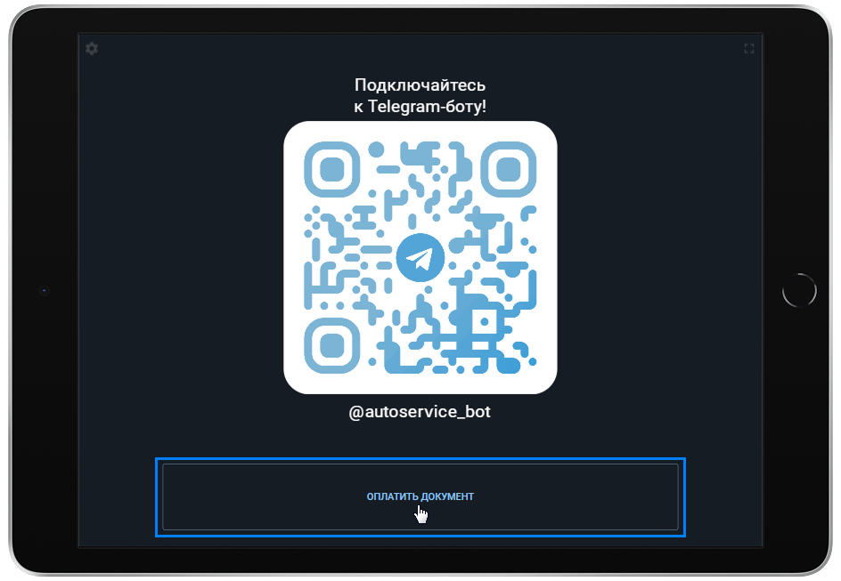

Приложение переходит на экран *“Поиск документа”:*

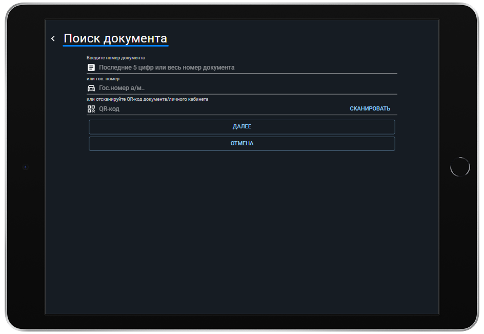

Есть возможность поиска документа следующими способами:

1. *указав номер документа* – требуется ввести последние 5 цифр или весь номер документа;
2. *указав гос. номер а/м;*
3. *отсканировав QR-код на печатной форме документа:*

   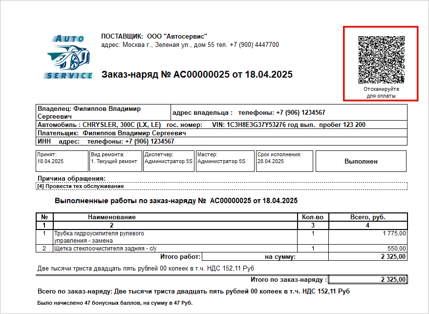

4. *отсканировав QR-код из приложения 5S Link:*

   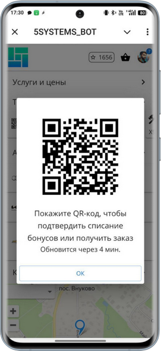

Далее следует выбрать нужный документ и нажать на него:

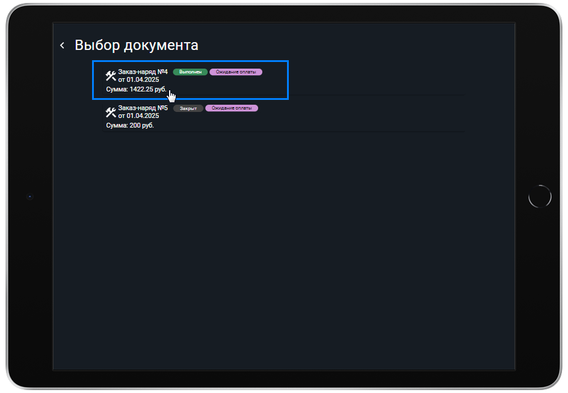

В целях защиты персональных данных для просмотра данных документа требуется подтверждение номера телефона:

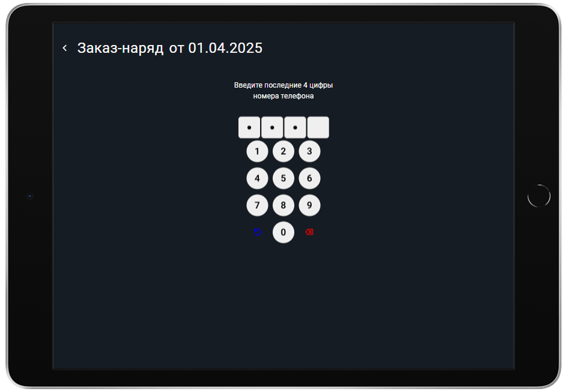

После успешного подтверждения доступа открывается форма оплаты документа:

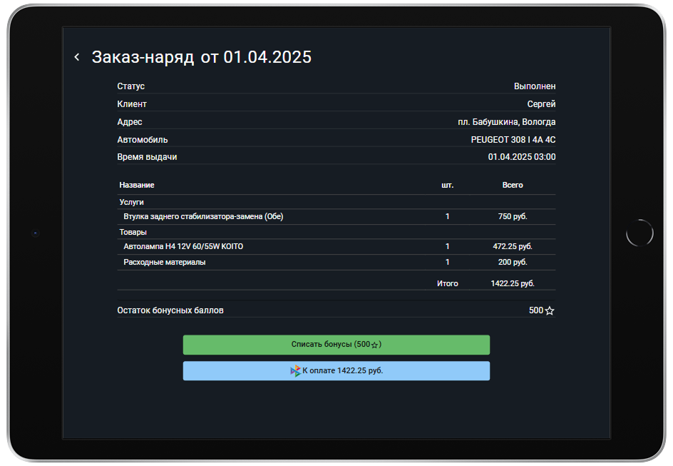

На данной форме выводится информация о статусе документа, клиенте, автомобиле, товарах и услугах, а также общий остаток бонусных баллов.

На кнопку *“Списать бонусы”* выводится сумма бонусов, доступная для оплаты текущего документа. При нажатии данной кнопки производится перерасчет суммы оплаты:

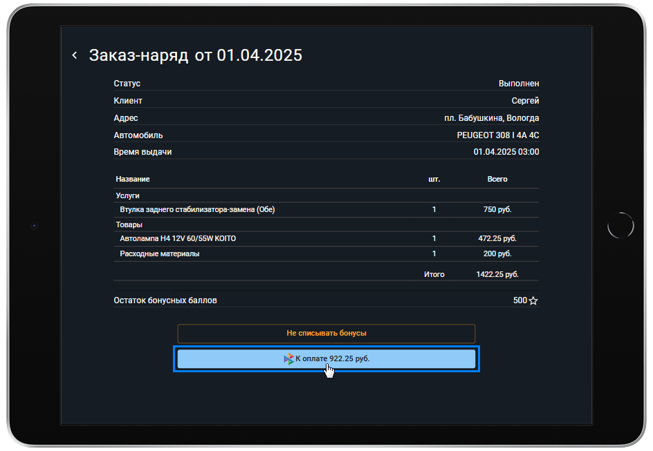

При нажатии кнопки “К оплате” на экране открывается QR-код для оплаты:

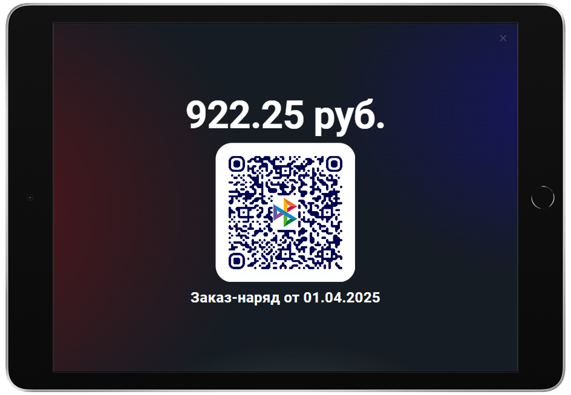

Клиент сканирует QR-код камерой своего телефона через приложение банка и оплачивает документ. В 5S AUTO поступает автоматическое уведомление о платеже, после создается непроведенный чек на оплату и отправляется уведомление сотрудникам в виде push-сообщения с информацией об оплате документа, смене статуса и необходимости пробить чек – см. в статье “[Работа с СБП](../../Банки%20и%20платежные%20системы/Система%20быстрых%20платежей/Работа%20с%20СБП/rabota-s-sbp.md#уведомление)”.

После оплаты документа устройство переходит на экран ожидания.

## Запуск приложения

Запустить приложение 5S Pay можно через браузер, открыв страницу [https://pay.5systems.ru/](https://pay.5systems.ru/). Далее необходимо войти под учетной записью [5S Cloud](../../Администрирование%20и%20настройка%20системы/Создание%20и%20редактирование%20пользователей%205S%20Cloud/sozdanie-i-redaktirovanie-polzovateley-5s-cloud.md):

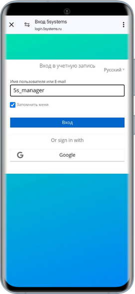

После входа приложение выполнит сбор данных об устройстве и через некоторое время предложит установить ярлык на устройство – следует нажать кнопку "Добавить":

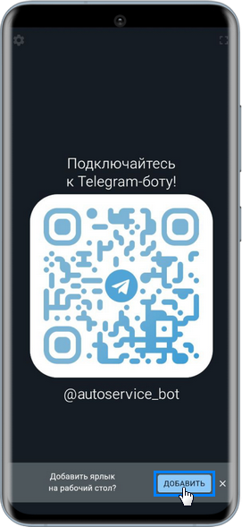

Затем подтвердить установку приложения:

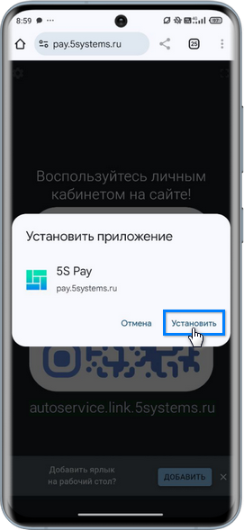

После успешной установки иконка приложения появится на рабочем столе устройства:

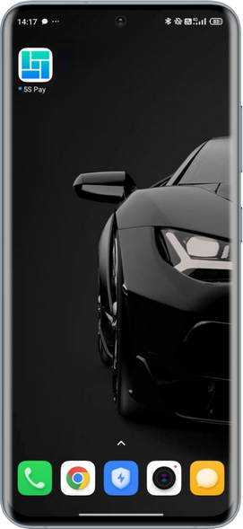

## Настройка

### 1. Требования к оборудованию

**Рекомендуемые требования к устройству:**

1. необходимое оборудование:
   - *смартфон* – для режима терминала СБП;
   - *планшет* – для режима “Электронный кассир”;
   - *bluetooth сканер штрихкодов и QR-кодов* – для режима “Электронный кассир”;
2. актуальная версия Google Chrome – *обязательное требование;*
3. стабильный wi-fi;
4. постоянное подключение устройства к зарядке;
5. надежная подставка для устройства;
6. отключение автоблокировки экрана (ухода в спящий режим через несколько минут бездействия).

**Рекомендации по настройке приложения:**

1. развернуть приложение на весь экран – нажать кнопку в правом верхнем углу (см. *[ниже](#na_ves_ekr));*
2. установить ярлык приложения на рабочий стол устройства (см. *[выше](#ustan_yarl)).*

### 2. Настройки в программе

**1) Настройка интеграции с API 5S AUTO**

Для работы с 5S Pay предварительно в программе должна быть настроена интеграция с [API 5S AUTO](../../Администрирование%20и%20настройка%20системы/API%205S%20AUTO/api-5s-auto.md).

**2) Настройка пользователя 5S Cloud**

Для доступа в приложение потребуется ввести логин и пароль пользователя [5S Cloud](../../Администрирование%20и%20настройка%20системы/Создание%20и%20редактирование%20пользователей%205S%20Cloud/sozdanie-i-redaktirovanie-polzovateley-5s-cloud.md). Рекомендуется для каждой кассы создать отдельного пользователя в справочнике Пользователей 5S AUTO и зарегистрировать его в 5S Cloud.

**3) Настройка интеграции с СБП**

Для приема платежей необходимо подключить в программе интеграцию с системой быстрых платежей одного из доступных банков – см. [статьи](../../Банки%20и%20платежные%20системы/Система%20быстрых%20платежей/) о настройке и работе с СБП.

**4) Настройка кассы**

Для пользователя 5S AUTO должно быть настроено [рабочее место](https://www.5systems.ru/help/rabochie-mesta) и привязано [оборудование](https://www.5systems.ru/help/podklyuchenie-kassy-kkm). В карточке оборудования необходимо выбрать используемую интеграцию с СБП (см. п. 3 [выше](#nastr_int_spb)):

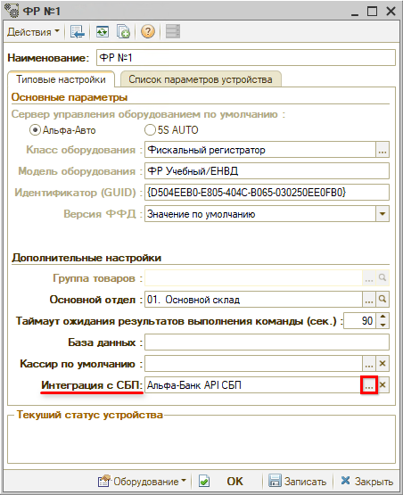

**5) Настройка доступа по подразделениям**

В случае сложной филиальной структуры компании рекомендуется *настроить видимость оборудования* в зависимости от *подразделения* пользователя.

Данный шаг настройки можно пропустить, если разграничение видимости не требуется.

В настройках [интеграции с СБП](../../Банки%20и%20платежные%20системы/Система%20быстрых%20платежей/Работа%20с%20СБП/rabota-s-sbp.md#добавление-интеграции) есть список доступных подразделений – он указывается в карточке интеграции на вкладке “Подразделения”:

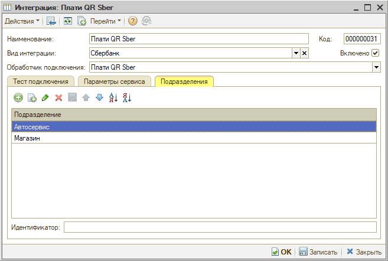

Если не выбраны подразделения, то доступ предоставляется для всей компании.

Если подразделения выбраны – доступ предоставляется только для указанных подразделений по иерархии. В таком случае [подразделение пользователя](../../Пользователи%20и%20права/Пользователи/polzovateli.md#вкладка-параметры-пользователя) 5S AUTO должно быть включено в иерархию одного из выбранных в интеграции подразделений.

### 3. Настройки в 5S Pay

#### Настройки для режима терминала СБП

**1. Кнопка “На весь экран”**

Рекомендуется развернуть приложение на весь экран с помощью специальной кнопки в правом верхнем углу:

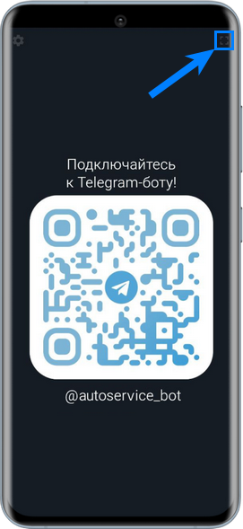

**2. Настройки**

Для перехода к настройкам следует нажать на “шестеренку” в левом верхнем углу экрана:

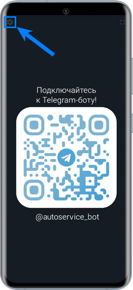

Открывается окно настроек:

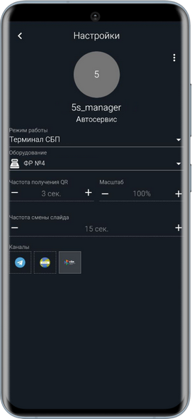

1. *Имя пользователя* – логин авторизованного пользователя 5S Cloud.
2. *Наименование компании* – наименование компании, в которой зарегистрирован пользователь 5S Cloud.
3. *Режим работы* – необходимо выбрать *“Терминал СБП”:*

   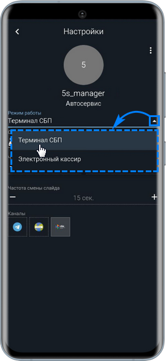

4. *Оборудование* – выбор доступной пользователю кассы:

   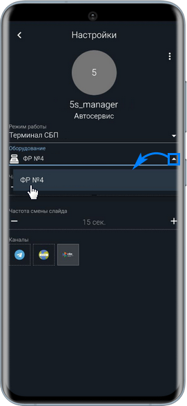

5. *Частота получения QR* – по умолчанию 3 сек., частота отправки запросов на получение из программы QR-кодов для оплаты;
6. *Масштаб* – по умолчанию 100%, есть возможность уменьшить или увеличить масштаб экрана для корректного отображения всех элементов интерфейса и для удобства сканирования QR-кодов.
7. *Частота смены слайда* – по умолчанию 15 сек., есть возможность задать частоту смены слайдов на экране в режиме ожидания.
8. *Каналы* – возможность подключить / отключить слайды с QR-кодами перехода к каналам взаимодействия с клиентами Telegram и 5S Link:

   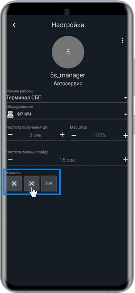

*Примечание:* Слайд с СБП выводится по умолчанию, без возможности отключения.

Переход к меню *дополнительных настроек* осуществляется нажатием на три точки в верхнем правом углу экрана:

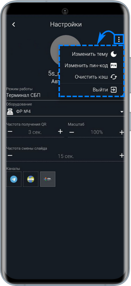

Дополнительные настройки позволяют:

- *Изменить тему* – темная или светлая;
- *Изменить пин-код* – см. [ниже](#pin_na_termin);
- *Очистить кэш* – обновление кэш приложения;
- *Выйти* – выйти из профиля.

Для ограничения доступа к настройкам приложения через данное устройство необходимо установить *пин-код:*

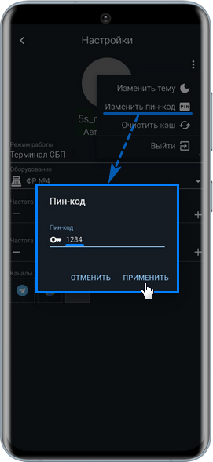

#### Настройки для режима электронного кассира

**1. Кнопка “На весь экран”**

Рекомендуется развернуть приложение на весь экран с помощью специальной кнопки в правом верхнем углу:

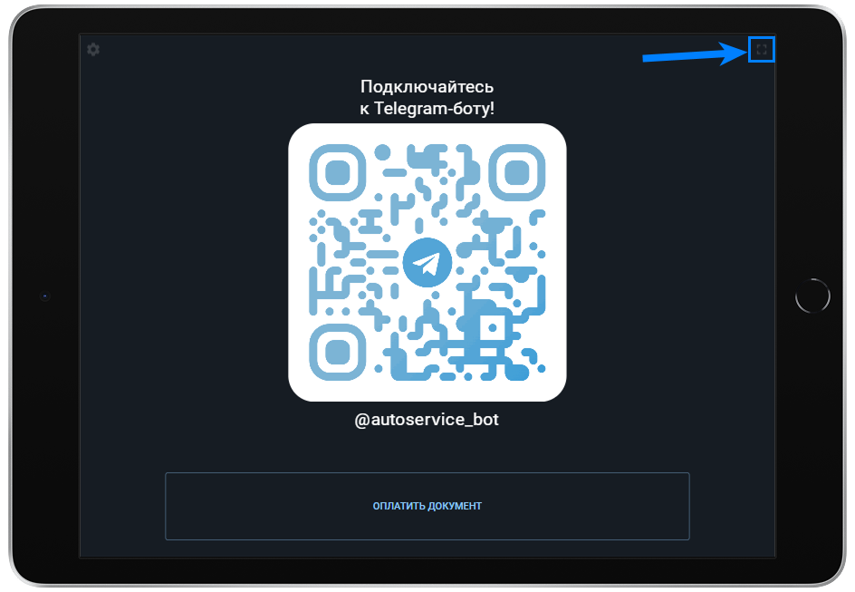

**2. Настройки**

Для перехода к настройкам следует нажать на “шестеренку” в левом верхнем углу экрана:

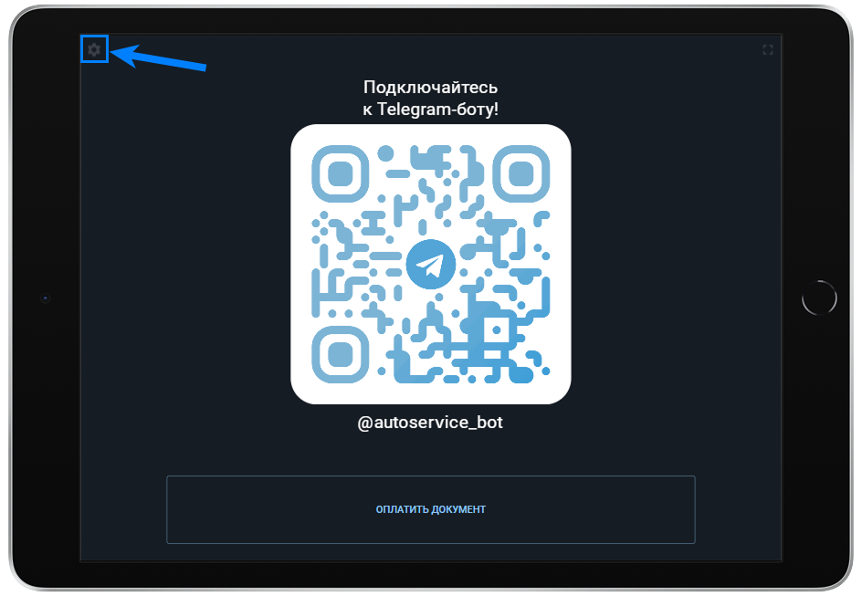

Открывается окно настроек:

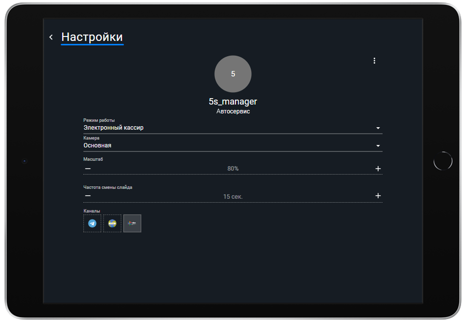

1. *Имя пользователя* – логин авторизованного пользователя 5S Cloud.
2. *Наименование компании* – наименование компании, в которой зарегистрирован пользователь 5S Cloud.
3. *Режим работы* – “Электронный кассир”:

   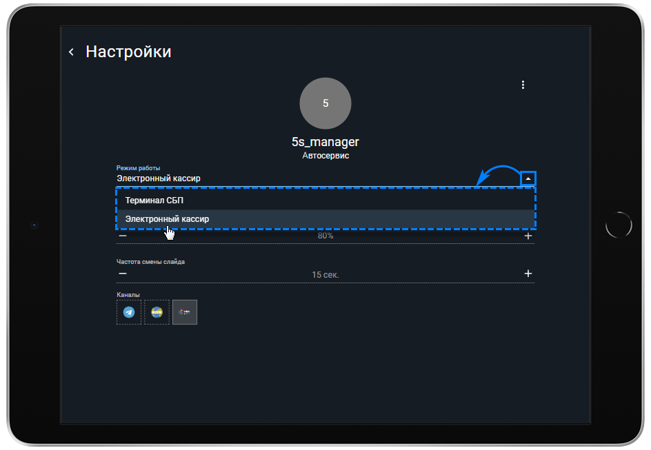

4. *Камера* – основная или фронтальная, в зависимости от расположения камеры, которая будет использоваться для сканирования QR-кода клиентами.
5. *Масштаб* – по умолчанию 100%, есть возможность уменьшить масштаб экрана для корректного отображения всех элементов интерфейса и для удобства сканирования QR-кодов с больших мониторов.
6. *Частота смены слайда* – по умолчанию 15 сек., есть возможность задать частоту смены слайдов на экране в режиме ожидания.
7. *Каналы* – возможность подключить / отключить слайды с QR-кодами перехода к каналам взаимодействия с клиентами Telegram и 5S Link:

   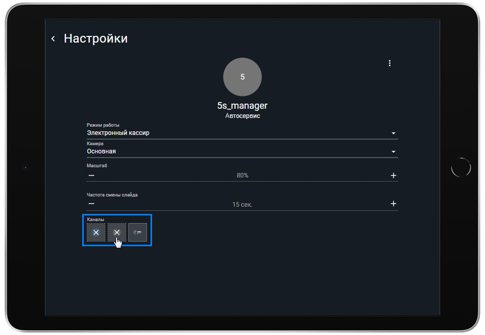

*Примечание:* Слайд с СБП выводится по умолчанию, без возможности отключения.

Переход к меню *дополнительных настроек* осуществляется нажатием на три точки в верхнем правом углу экрана:

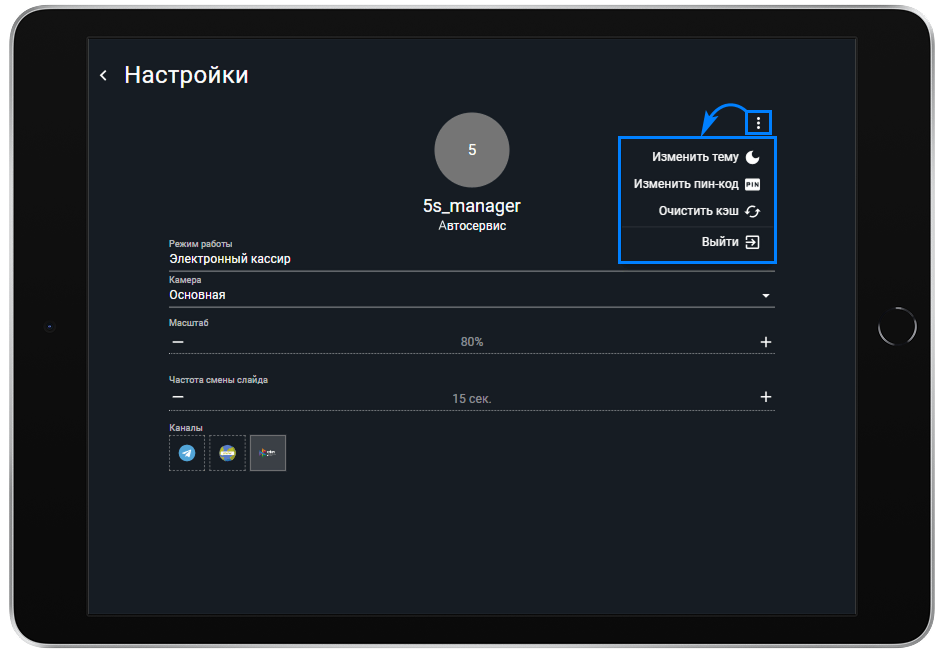

Дополнительные настройки позволяют:

- *Изменить тему* – темная или светлая;
- *Изменить пин-код* – см. [ниже](#pin_na_el_kassir);
- *Очистить кэш* – обновление кэш приложения;
- *Выйти* – выйти из профиля.

Для ограничения доступа к настройкам приложения необходимо установить *пин-код:*

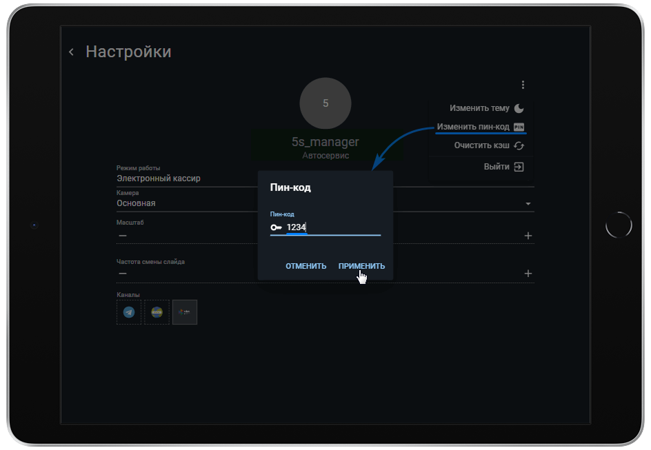

#### Настройка экрана ожидания

Есть возможность вывести на экран сменяющие друг друга слайды:

1. QR-код для перехода в [Telegram-бот](../../Сообщения/Интеграция%20с%20Telegram/integraciya-s-telegram.md) компании;
2. QR-код для перехода в приложение [5S Link](https://www.5systems.ru/help/nastroyka-prilozheniya-5s-link-v2);
3. логотип СБП:

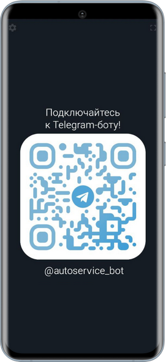 &nbsp;&nbsp; 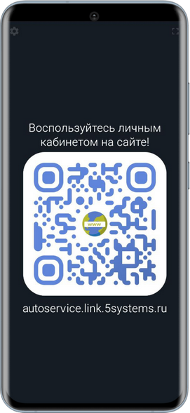 &nbsp;&nbsp; 

---

**Теги:** прием оплаты, торговое оборудование, платежные системы, 5s pay, терминал сбп

