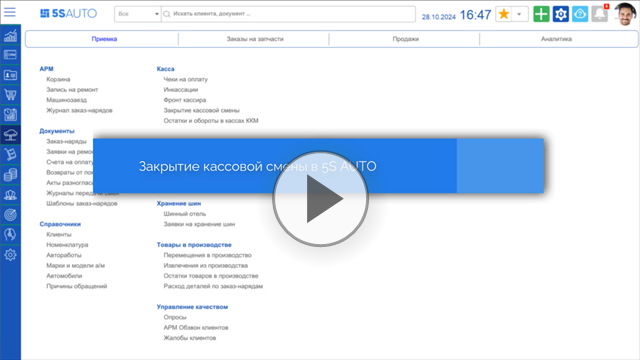
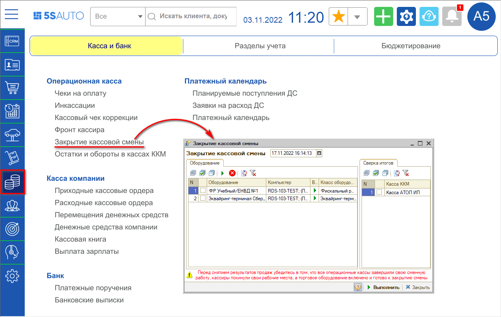
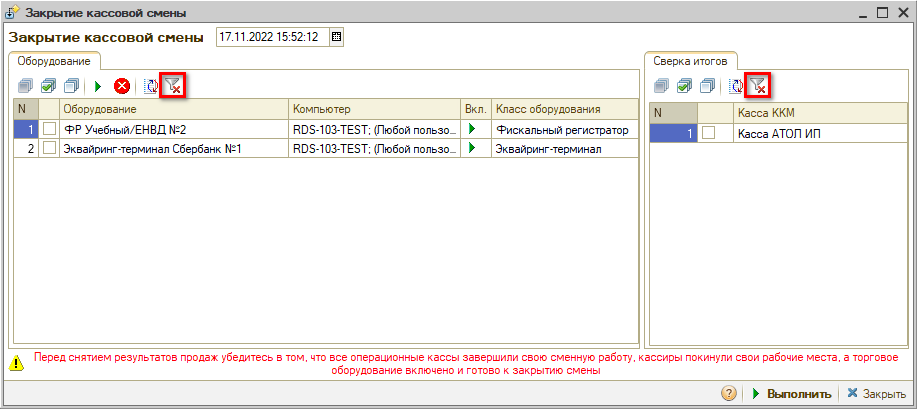
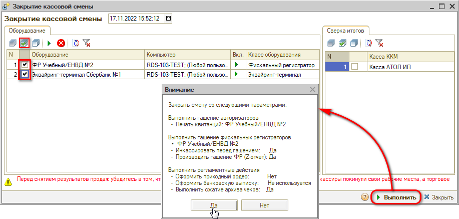
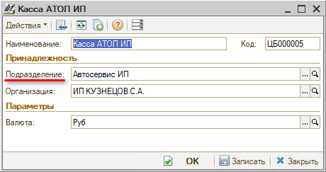
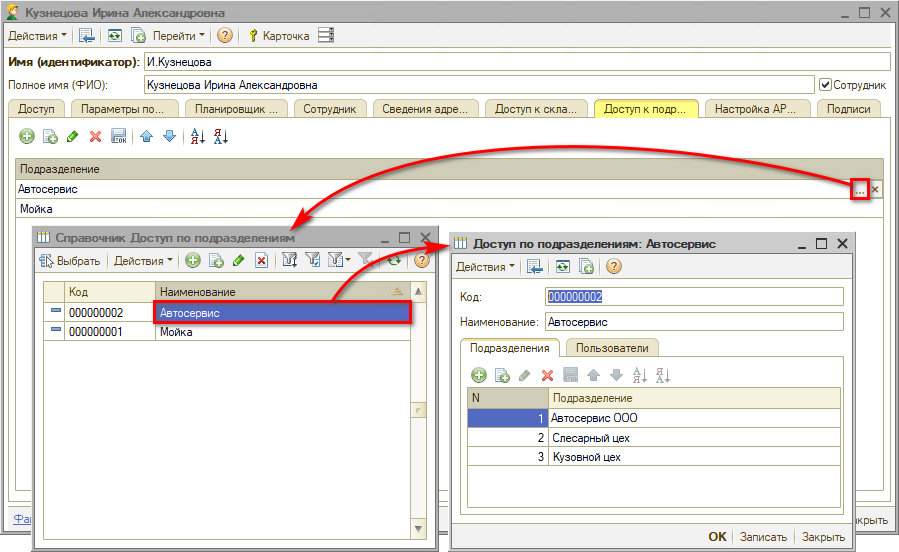
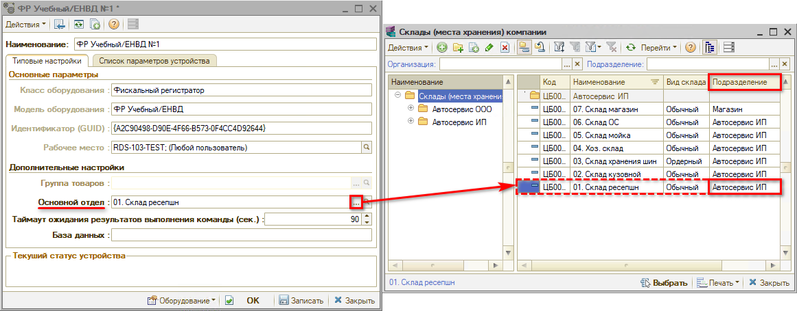
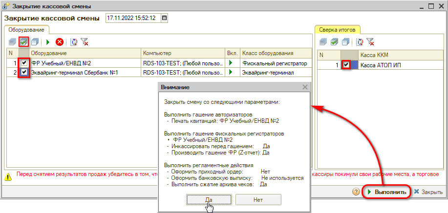
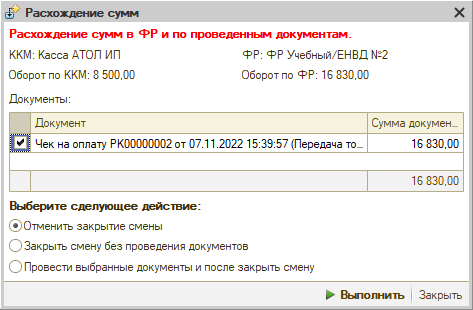

# Обработка Закрытие кассовой смены

<table><tr><td><b>Время чтения:</b> 8 мин.</td><td><b>Обновлено:</b> 24.11.2022</td></tr></table>

Источник: https://www.5systems.ru/help/obrabotka-zakrytie-kassovoy-smeny

> *Функционал доступен с релиза 2.3.1.1*

## Содержание

1. [Введение](#введение)
2. [Обработка "Закрытие кассовой смены"](#обработка-закрытие-кассовой-смены)
3. [Настройка доступа к кассам по подразделениям](#настройка-доступа-к-кассам-по-подразделениям)
4. [Настройка доступа к оборудованию по подразделениям](#настройка-доступа-к-оборудованию-по-подразделениям)
5. [Сверка итогов](#сверка-итогов)

*О работе с кассами ККМ см. основную статью: [Порядок работы с кассами ККМ](../Порядок%20работы%20с%20кассами%20ККМ/poryadok-raboty-s-kassami-kkm.md).*

## Введение

*Кассовой сменой* принято считать временной промежуток, начинающийся с момента формирования отчета об открытии и до составления отчета о завершении рабочего дня.

Согласно п.2 статьи 4.3 ФЗ-54 продолжительность смены на онлайн-кассе не должна превышать 24 часов, в противном случае предусмотрены штрафы в КоАП. Если продолжительность кассовой смены превысит 24 часа, работа фискального накопителя может быть заблокирована. Ежедневно открывайте смену и закрывайте смену, пусть это будет привычкой.

Открытие смены на ККТ "Штрих", как правило, происходит автоматически при пробитии первого чека с уведомлением. На некоторых ККТ "Атол" открытие смены происходит после нажатия "Открыть смену" на фронте кассира.

*Внимание!* Если кассир забыл закрыть смену в онлайн-кассе, продолжительность которой уже свыше 24 часов, то, чтобы не получить наказание от налоговой инспекции, не отбивайте чеки.

## Обработка "Закрытие кассовой смены"

Для закрытия кассовой смены следует открыть соответствующую обработку через меню *Финансы → Касса и банк → Операционная касса → Закрытие кассовой смены[\*](#snoska):*

**

*\*Примечание: В случае если данного пункта меню нет на рабочем столе, можно добавить его вручную – см. статью "[Настройка рабочего стола](https://www.5systems.ru/help/nastroyka-rabochego-stola#nastrrazdelov)".*

В обработке "Закрытие кассовой смены" на вкладке "Оборудование" приводится подключенное торговое оборудование, в частности, Фискальный регистратор. На вкладке "Сверка итогов" приводятся подключенные кассы ККМ (вкладка используется для сверки итогов: см. ниже раздел *["Сверка итогов"](#сверка-итогов))*.

Оборудование и кассы фильтруются согласно настройкам доступа. Если настроена принадлежность оборудования, то у пользователя будет выведено только то оборудование, которое относится к его подразделению, если не настроено, то в обработке отобразится всё оборудование (описание настройки доступа к кассам и оборудованию см. [ниже](#настройка-доступа-к-кассам-по-подразделениям)).

Пользователь с правами администратора может отключить отбор и вывести в обработку закрытия смен все кассы компании:

Для закрытия кассовой смены требуется отметить галочками активное оборудование и нажать кнопку “Выполнить”. В открывшемся окне проверить параметры закрытия и нажать “Да”:

## Настройка доступа к кассам по подразделениям

Кассы компании в обработку “Закрытие кассовой смены” выводятся по подразделению, т.к. кассы принадлежат подразделениям компании в соответствии с иерархией подразделений.

Настройка производится в карточке *[Пользователя](https://5systems.ru/help/polzovateli)* на вкладке “Доступ к подразделениям”. Необходимо выбрать настройки, которые заданы в справочнике “Доступ по подразделениям”:

## Настройка доступа к оборудованию по подразделениям

Для того, чтобы оборудование в обработке “Закрытие кассовой смены” фильтровалось по подразделению пользователя, следует в настройках оборудования задать параметр "Основной отдел". Нажатием на кнопку "Выбор" открывается справочник "Склады (места хранения) компании", у каждого склада задана принадлежность подразделению:

Оборудование будет выводится также в соответствии с иерархией подразделений.

## Сверка итогов

Расхождение итогов между *кассой ККМ* и *фискальным регистратором* (далее *ФР)* при закрытии кассовой смены может возникнуть в ряде случаев, например:

- была сделана *отмена проведения* чека в программе;
- в проведенном чеке изменили сумму и заново провели его;
- из-за потери связи с ФР данные на него не ушли, и чек не пробился, но при этом в программе чек провелся;
- чек не пробился в кассе и не провелся в программе, но был кем-то проведен в программе вручную;
- чек был помечен на удаление автоматически из-за кассового сбоя либо вручную пользователем.

Для использования функции следует при закрытии кассовой смены отметить галочками *фискальный регистратор на вкладке “Оборудование”* и *кассу на вкладке “Сверка итогов”* и нажать кнопку *“Выполнить → Да”:*

**

Если при закрытии смены в кассе ККМ и на ФР обнаруживаются разные суммы, то открывается окно “Расхождение сумм”. Выводятся данные “Оборот по ККМ” и “Оборот по ФР”. Программа находит в базе чек на сумму расхождения и выводит его в таблице “Документы”:

Далее следует выбрать одно из предложенных действий – “Отменить закрытие смены”, “Закрыть смену без проведения документов” или “Провести выбранные документы и после закрыть смену” и нажать кнопку *“Выполнить”*.

---

**Теги:** прием оплаты, кассовая смена, закрытие смены, касса, сверка итогов

