

# Отражение оплаты через СБП

<table><tr><td><b>Время чтения:</b> 16 мин.</td><td><b>Обновлено:</b> 19.07.2022</td></tr></table>

Источник: https://www.5systems.ru/help/otrazhenie-oplaty-cherez-sbp

> *Функционал доступен начиная с релиза 2.002.005*

## Содержание

1. [Введение](#введение)
2. [Описание](#описание)
3. [Настройки](#настройки)
   - [1. Создание типа оплаты СБП](#1-создание-типа-оплаты-сбп)
   - [2. Настройка подключения касс](#2-настройка-подключения-касс)

*Также см. статью "[Печать QR-кода для оплаты](https://5systems.ru/help/pechat-qr-koda-dlya-oplaty)".*

## Введение

***Система быстрых платежей (СБП)*** — система Банка России, позволяющая гражданам переводить средства по идентификатору (в настоящее время — по номеру телефона) получателя, даже если стороны перевода имеют счета в разных кредитных организациях. Также СБП позволяет совершать мгновенные платежи в режиме 24/7 за работу, товары и услуги, в том числе с использованием QR-кода. 
*См. описание на сайте Банка России по [ссылке](https://www.cbr.ru/PSystem/sfp/#:~:text=%D0%A1%D0%B8%D1%81%D1%82%D0%B5%D0%BC%D0%B0%20%D0%B1%D1%8B%D1%81%D1%82%D1%80%D1%8B%D1%85%20%D0%BF%D0%BB%D0%B0%D1%82%D0%B5%D0%B6%D0%B5%D0%B9%20(%D0%A1%D0%91%D0%9F)%20%E2%80%94,%D0%B1%D0%BE%D0%BB%D0%B5%D0%B5%20200%20%D0%B1%D0%B0%D0%BD%D0%BA%D0%BE%D0%B2%2C%20%D0%B2%D0%BA%D0%BB%D1%8E%D1%87%D0%B0%D1%8F%20%D0%BA%D1%80%D1%83%D0%BF%D0%BD%D0%B5%D0%B9%D1%88%D0%B8%D0%B5.).*

*QR-код СБП* - это графический код, в котором зашифрованы параметры платежа на расчетный счет получателя через СБП.

Обычно процесс оплаты по QR-коду происходит следующим образом:

- получатель показывает клиенту QR-код;
- клиент наводит на этот код камеру телефона;
- на экране телефона появляется окно, которое ведёт в приложение банка;
- клиент нажимает на это окно, оказывается в приложении банка, вводит сумму (при необходимости) и подтверждает оплату;
- деньги мгновенно перечисляются получателю.

Либо клиент сразу заходит в приложение своего банка и сканирует код из него.

*Например, Сбербанк предоставляет услугу СБП в виде сервиса SberPayQR. Подробное описание см. по ссылке:* [*https://www.sberbank.ru/ru/s_m_business/bankingservice/sberpayqr*](https://www.sberbank.ru/ru/s_m_business/bankingservice/sberpayqr)*.*

Для подключения подобного сервиса в своей компании необходимо обратиться в банк и подать заявку на использование СБП, либо подключить услугу в своем личном кабинете на сайте банка.

*Банк плательщика также должен быть подключён к СБП, и у клиента должно быть установлено приложение своего банка.*

Далее нужно решить, как будете показывать QR-код: его можно распечатать и разместить на видном месте, можно каждый раз генерировать в мобильном приложении и выводить на экран смартфона, а также можно настроить генерацию кода в кассовой программе и выводить на экран кассы.

О том, что *платеж прошел успешно*, клиент и компания получат уведомление. Клиенту уведомление придет в приложении банка, а также будет отражен код подтверждения в истории операций, который при необходимости нужно будет назвать кассиру. Продавцу уведомление придет в мобильном приложении банка для бизнеса: такое приложение должно быть установлено у каждого сотрудника компании, имеющего дело с приемом оплаты.

## Описание

Принятую по СБП оплату необходимо отразить у себя в учете особым порядком, т.к. это и не оплата наличными, и не оплата картой. Помимо этого, необходимо пробить чек клиенту: применять кассу обязательно в соответствии с требованиями ФЗ-54.

Особенность учета данного типа оплаты в том, что деньги на расчетном счете мы увидим только при [*загрузке банковской выписки*](https://5systems.ru/help/zagruzka-bankovskoy-vypiski) (хотя деньги поступают на расчетный счет моментально).

Поэтому реализован следующий механизм учета таких операций *(предварительно должны быть сделаны специальные настройки: см. ниже раздел “[Настройки](#настройки)”).*

Сначала необходимо перейти к приему оплаты: нажать кнопку “Оплата” в документе “Заказ-наряд” или “Реализация товаров” *(подробнее см. статью* [*Порядок работы с кассами ККМ*](../Порядок%20работы%20с%20кассами%20ККМ/poryadok-raboty-s-kassami-kkm.md)*):*

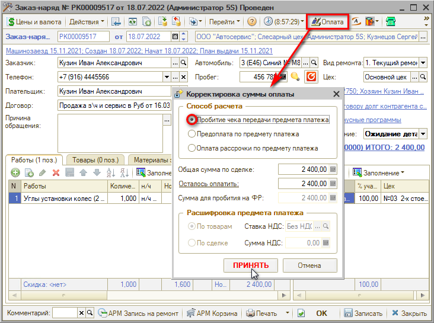

В открывшейся форме “Корректировка суммы оплаты” следует выбрать *способ расчета* (по умолчанию – “Пробитие чека передачи предмета платежа”), проверить сумму и нажать “Принять”. Открывается форма “Фронт менеджера”:

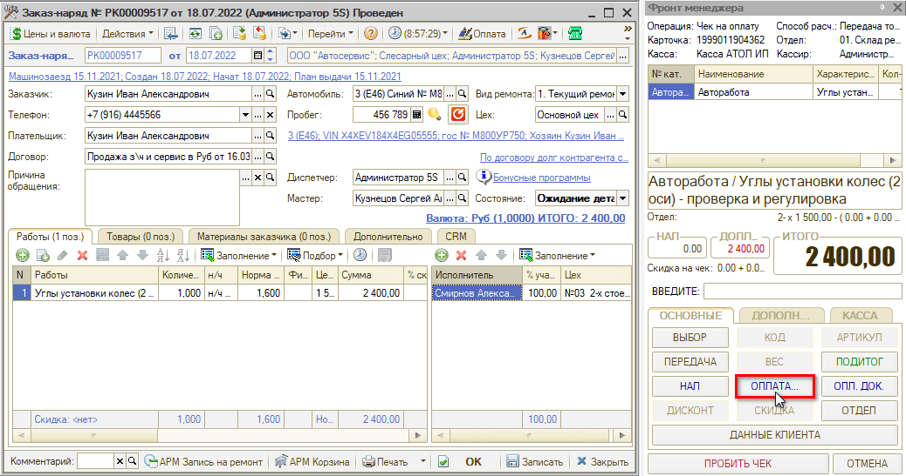

Нажатием на кнопку “Оплата” открывается форма *"Оплаты"* с доступными типами оплат – в случае приема оплаты по QR-коду нужно выбрать тип “СБП” (предварительно он должен быть добавлен в настройках кассы – см. [*ниже*](#настройки)*):*

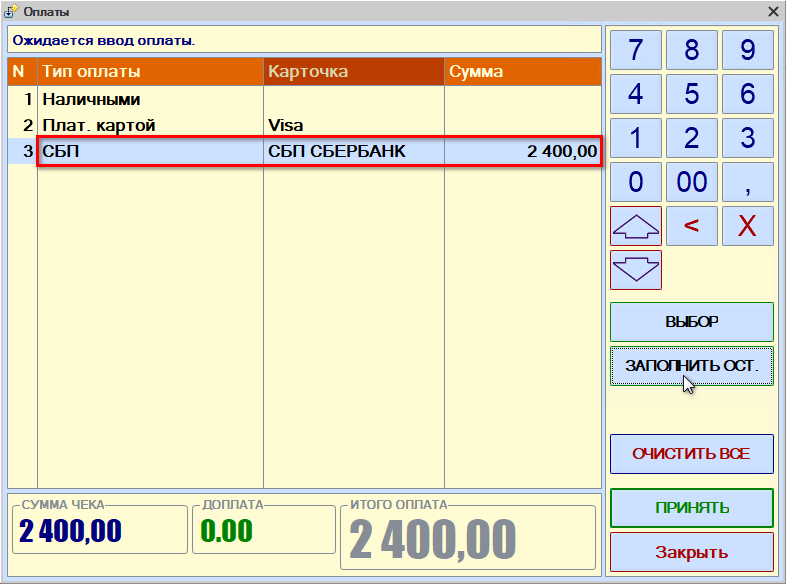

После выбора типа оплаты следует нажать кнопку “Заполнить остатком” и “Принять”, затем на Фронте менеджера “Пробить чек”:

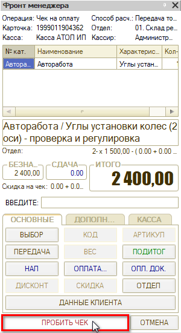

В созданном документе “Чек на оплату” на вкладке “Оплаты” отображается строка с типом оплаты “СБП”:

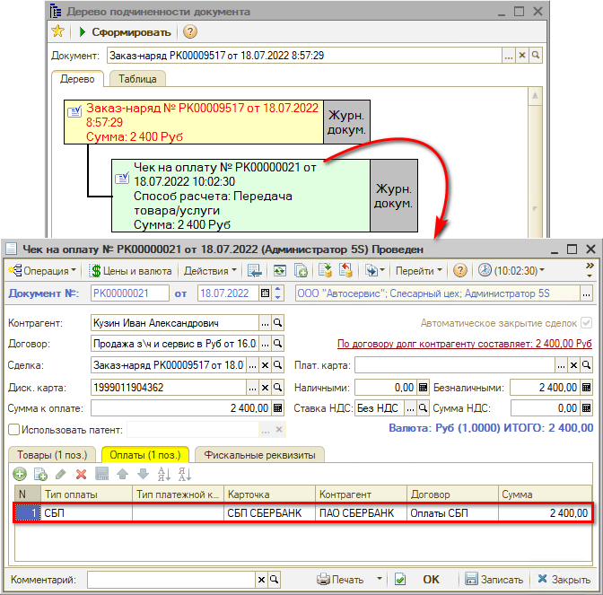

Для отражения оплат по СБП программа переносит сумму долга с клиента на банк, чтобы не было двойного учета оплаты.

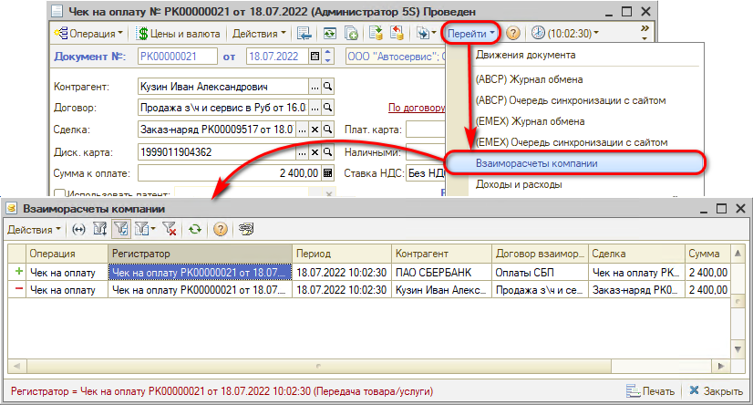

На следующий день производится загрузка выписки из банка.

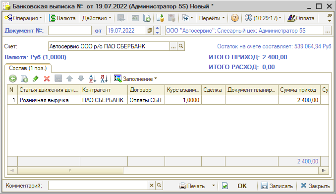

Вся оплата по СБП отображается общей суммой (если несколько человек платили через СБП). Требуется сделать разнесение платежа на банк по всей сумме.

Таким образом, операция должна закрываться созданием банковской выписки, которая производит учет взаиморасчетов с погашением долга контрагента.

## Настройки

### 1. Создание типа оплаты СБП

Для начала необходимо в справочнике “Типы оплат в рознице” создать тип оплаты “СБП” с привязкой к клубной карте и договору:

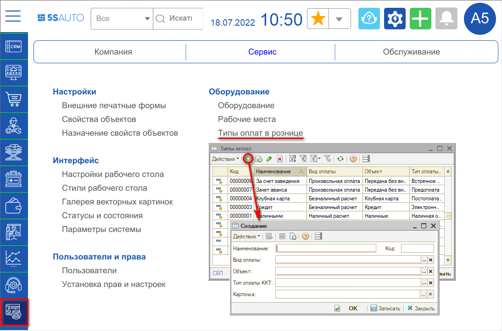

В создаваемом новом элементе требуется заполнить следующие параметры:

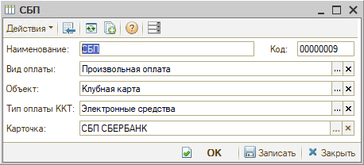

- ***Наименование:*** *СБП*
- ***Вид оплаты:*** *Произвольная оплата*
- ***Объект:*** *Клубная карта*
- ***Тип оплаты ККТ:*** *Электронные средства*
- ***Карточка*** - это та карта, которая будет выбираться во Фронте кассира при выборе данного типа оплаты. 
  Сначала требуется создать новый элемент справочника “Карточки” в группе “Клубная карта”:  
  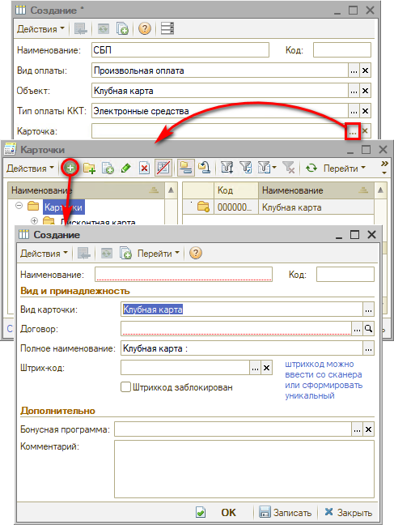  
  В карточке необходимо задать наименование и выбрать контрагента и договор, который будет участвовать в зачете долга при оплате по СБП (следует создать отдельный договор):  
  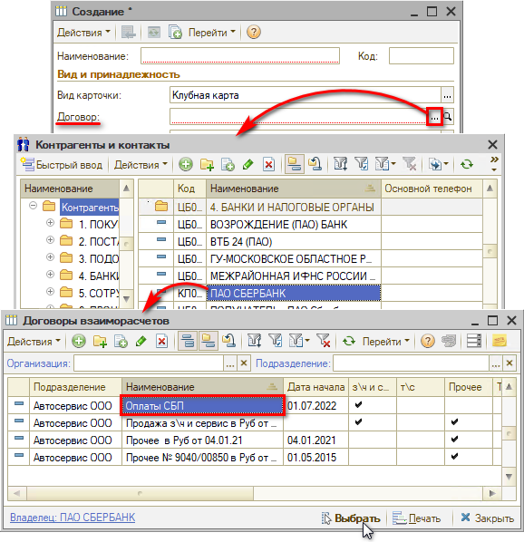  
  Заполненную карточку следует записать:  
  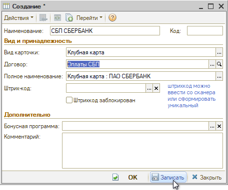  
  Затем ее необходимо выбрать в создаваемом элементе *тип оплаты “СБП”* в поле “Карточка".

### 2. Настройка подключения касс

*См. статью* [*Подключение кассы ККМ*](https://5systems.ru/help/podklyuchenie-kassy-kkm)*.*

Наименованию типа платежа “СБП” в справочнике “Типы оплат в рознице” должно соответствовать наименование вида платежа в числе перечисленных в параметре "Наименования видов платежей" в настройке оборудования:

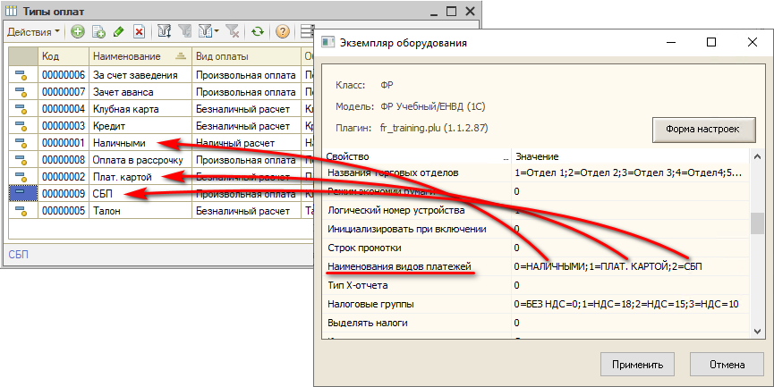

Необходимо прописать наименование вида платежа в настройках кассы, чтобы он появился на форме “Оплаты” при работе с Фронтом менеджера:

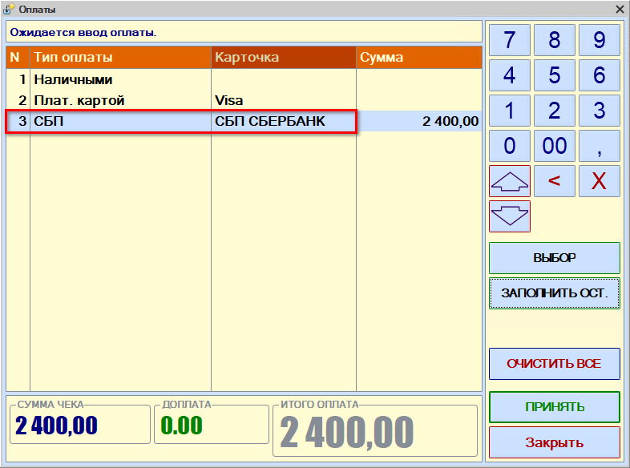

---

**Теги:** прием оплаты, платежные системы, сбп, оплата по qr-коду, касса

