

# Порядок работы с кассами ККМ

<table><tr><td><b>Время чтения:</b> 26 мин.</td><td><b>Обновлено:</b> 20.05.2024</td></tr></table>

Источник: https://www.5systems.ru/help/poryadok-raboty-s-kassami-kkm

> *Актуально начиная с версии релиза 5S AUTO **2.7.1**.*

## Содержание

1. [Введение](#введение)
2. [Оплата](#оплата)
3. [Возврат](#возврат)
   - [Возврат предоплаты](#возврат-предоплаты)
   - [Возврат денег по товарам](#возврат-денег-по-товарам)
   - [Возврат денег по работам](#возврат-денег-по-работам)
      - [1. Полный возврат](#1-полный-возврат)
      - [2. Частичный возврат](#2-частичный-возврат)
         - [Пробитие чека по РКО](#пробитие-чека-по-рко)
4. [Открытие/Закрытие кассовой смены](#открытиезакрытие-кассовой-смены)
   - [Возможные ошибки](#возможные-ошибки)
5. [Отправка электронной версии чека](#отправка-электронной-версии-чека)
6. [Прием оплаты по СБП](#прием-оплаты-по-сбп)

## Введение

В рамках данной статьи описан порядок пробития чека в случае реализации товаров и услуг при оплате наличными средствами или по терминалу. Рассмотрена оплата по документам "Реализация товаров" и "Заказ-наряд" при работе с физическими лицами.

Как подключить кассу ККМ см. [*Подключение кассы ККМ*](../../Торговое%20оборудование/Подключение%20кассы%20ККМ/podklyuchenie-kassy-kkm.md). Также см. статью *[Упрощенный Фронт кассира](../Упрощенный%20Фронт%20кассира/uproschennyy-front-kassira.md).*

## Оплата

По кнопке *"Оплата"* из документа (Реализация товаров, Заказ-наряд, Счет на оплату) переходим к формированию чека:

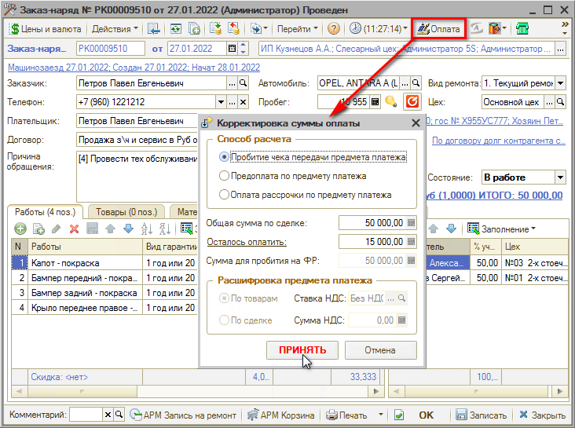

Для Заказ-наряда производится проверка, что вид ремонта – платный (см. *Справочники → Автосервис → Виды ремонта).*

Открывается форма *"Корректировка суммы оплаты"*, где указывается *Способ расчета*:

- При полной оплате выбираем пункт *"Пробитие чека передачи предмета платежа"* (устанавливается автоматически по умолчанию);
- Если нужно принять предоплату, то выбираем *"Предоплата по предмету платежа"* и корректируем *"Сумму для пробития на ФР"* – сколько укажете, на такую сумму и выйдет чек.

Если ранее была внесена предоплата по сделке, то появится форма для зачета аванса:

Нажимаем кнопку *"Да"*, если была предоплата и клиенту нужно доплатить оставшуюся сумму.

Открывается форма *"Фронт менеджера"*, данные которой заполнены в соответствии с документом, откуда инициирована оплата (в данном случае – Заказ-наряд):

Указываем *способ оплаты*:

- Кнопка *"НАЛ"* – вся оплата производится наличным способом.
- Кнопка *"ОПЛАТА…"* – открывается форма "Оплаты" с доступными типами оплат по данному фискальному регистратору, где указывается каким способом производится оплата (наличным, безналичным или комбинированным способом):  
  

После настройки способа оплаты нажмите кнопку *"Принять".*

После указания способа оплаты на форме "Фронт менеджера" нажимаем кнопку *"ПРОБИТЬ ЧЕК"*. В результате происходит печать чека на ФР и формирование документа "Чек на оплату":

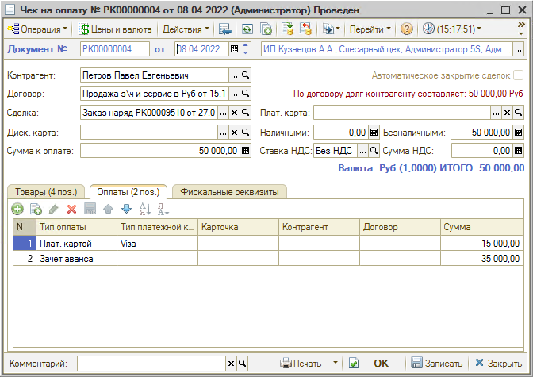

Если не указать способ оплаты, вся сумма оплаты фиксируется наличным способом оплаты.

В итоге, в чеке будет указан способ расчета – "ПОЛНЫЙ РАСЧЕТ" или "ПРЕДОПЛАТА", а сумма оплаты отображается в графе "БЕЗНАЛИЧНЫМИ", "НАЛИЧНЫМИ". Основание пробития чека:

- Покупка з/частей – для документа "Реализация товаров";
- Оплата услуг сервиса – для документа "Заказ-наряд".

На вкладке "Товары" заполнение и корректировка товаров заблокировано.

### Видео по теме

См. видеоинструкции:

- [Как принять оплату по Заказ-наряду](../../../../lessons/Урок%2010.%20Работа%20с%20Заказ-нарядами/Как%20принять%20оплату%20по%20Заказ-наряду/kak-prinyat-oplatu-po-zakaz-naryadu.md)

  

- [Прием предоплаты](https://youtu.be/lS67DJ8veYU)

  [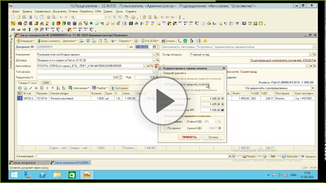](https://youtu.be/lS67DJ8veYU)

- [Зачет аванса](https://youtu.be/oHdoYVae3UM)

  [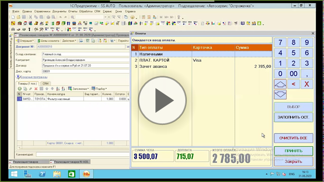](https://youtu.be/oHdoYVae3UM)

## Возврат

### Возврат предоплаты

Если предоплата вносилась наличными или банковской картой, то для возврата правильно использовать тот же способ предоплаты, что в документе "Чек на оплату". Для этого:

1. На форме документа "Чек на оплату" нажимаем на кнопку *"Оплата"*. В результате чего открывается форма "Фронт менеджера" с заполненными полями по документу возврата:  
   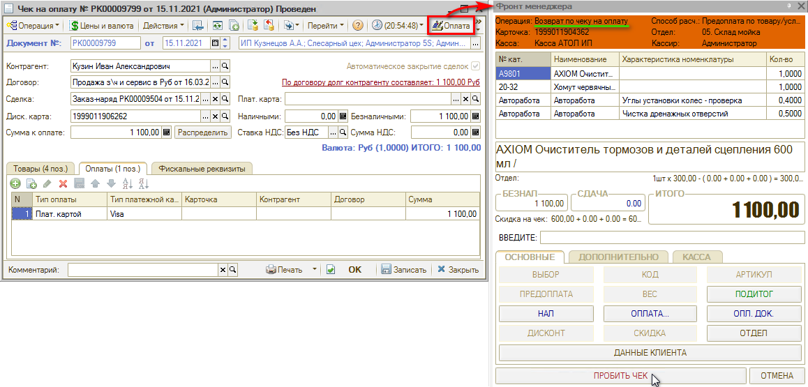
2. На форме "Фронт менеджера" нажимаем на кнопку *"ПРОБИТЬ ЧЕК"*. В результате выводится чек на ФР и на основании документа "Чек на оплату" создается документ "Чек на оплату" с хоз. операцией "Возврат по чеку на оплату":  
   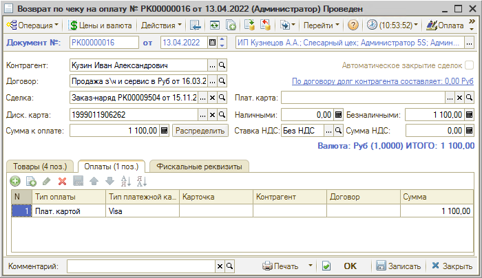

### Возврат денег по товарам

Если клиент возвращает товар по "Заказ-наряду", то в программе необходимо оформить документы возврата – ввести на основании Заказ-наряда:

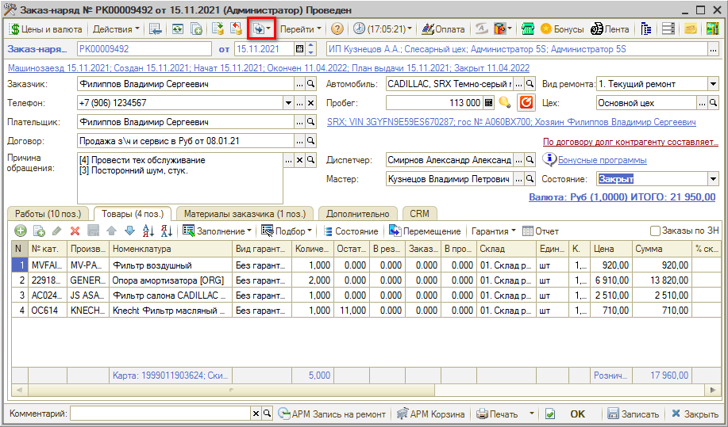

В документе *"Возврат товаров от покупателя"* можно удалить лишние позиции, оставив только те товары, по которым нужно сделать возврат, записать документ и провести:

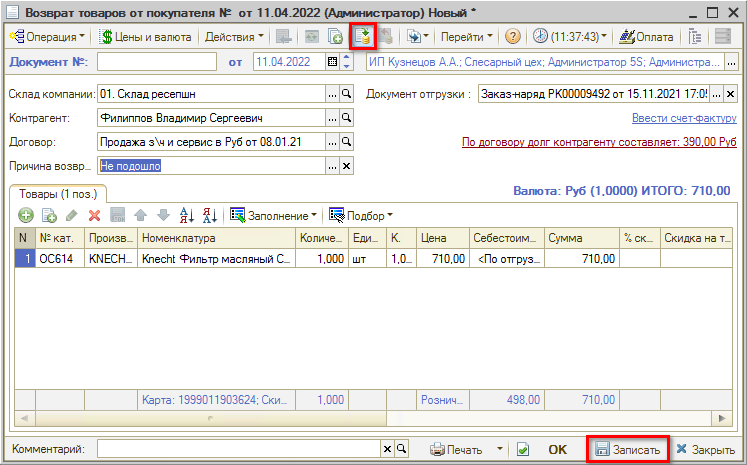

Чек будет пробит по товарным позициям – как в документе "Возврат товаров от покупателя".

Для осуществления возврата в документе "Возврат от покупателя" нажимаем кнопку *"Оплата"*.

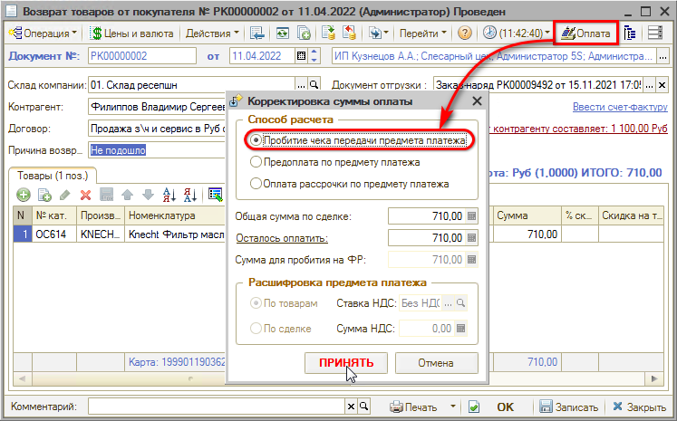

На форме "Фронт менеджера" указываем необходимые данные и нажимаем на кнопку *"ПРОБИТЬ ЧЕК"*:

Будет также сформирован "Чек" на оплату с хоз. операцией "Возврат по чеку на оплату".

Все поля будут заполнены автоматически, заполнение вкладки "Товары" идентично документу возврата.

### Возврат денег по работам

#### 1. Полный возврат

Если в Заказ-наряде есть только работы и нет товаров, и возврат нужно сделать только по работам, то "Возврат от покупателя" делать не требуется.

Нужно зайти в *Чек на оплату* (через Дерево документов Заказ-наряда) и нажать *“Оплата”*. Во "Фронте менеджера" удалить все кроме нужной автоработы и пробить чек возврата.

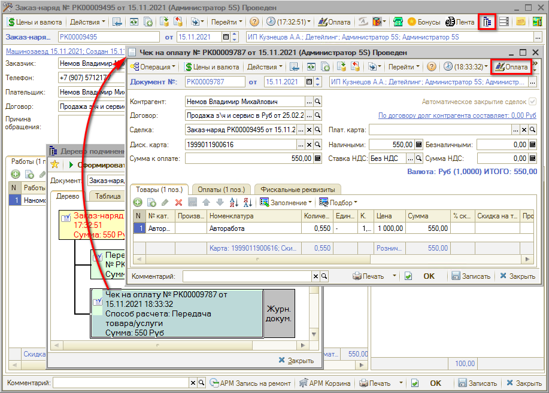

#### 2. Частичный возврат

Через Чек на оплату частичный возврат сделать невозможно. Можно сделать полный возврат работ/товаров по чеку, а затем пробить новый чек на правильную сумму. Либо возможны следующие варианты действий:

1. **Через Акт разногласий** 
   Если требуется сделать возврат оплаты по работам по закрытому Заказ-наряду, нужно ввести на его основании *Акт разногласий*:  
   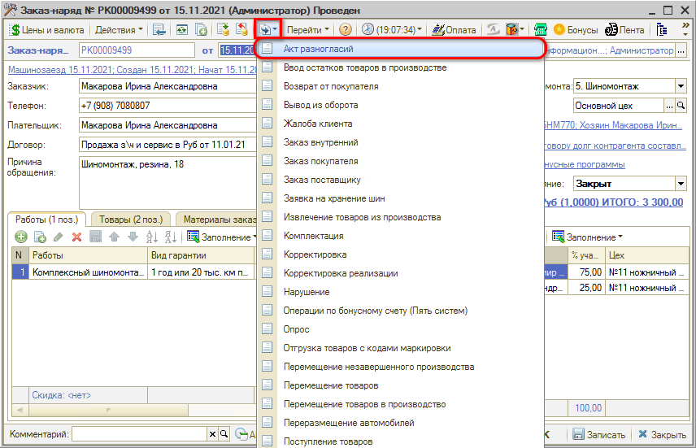  
   Документ заполняется выполненными работами и использованными при этом деталями. Актом разногласий можно скорректировать цены товаров/работ, их количество, а также убрать товар/работу из Заказ-наряда.  
   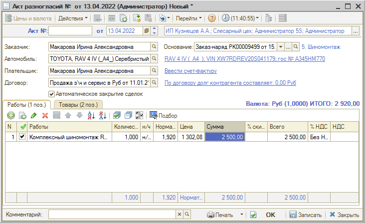  
   При проведении документа по контрагенту (плательщик) возникает корректировка взаиморасчетов на разницу между суммой заказ-наряда и суммой по акту разногласий. 
   Таким образом, если требуется корректировка стоимости работ, Акт разногласий нужно делать обязательно.
2. **Корректировка закрытого Заказ-наряда** 
   Данный способ может использоваться, если бизнес-процесс в компании построен таким образом, что внесение изменений в закрытый Заказ-наряд допускается. 
   При этом требуется учитывать, сколько времени прошло от закрытия Заказ-наряда, и не повлияет ли его корректировка на уже рассчитанную и выданную заработную плату. 
   Производится удаление из Заказ-наряда работ, затем создается Расходный кассовый ордер, и по нему пробивается чек (см. далее).

##### Пробитие чека по РКО

После проведения *Акта разногласий* (или корректировки закрытого заказ-наряда) необходимо создать *Расходный кассовый ордер* на клиента. Для этого можно перейти к карточке контрагента и создать документ на ее основании:

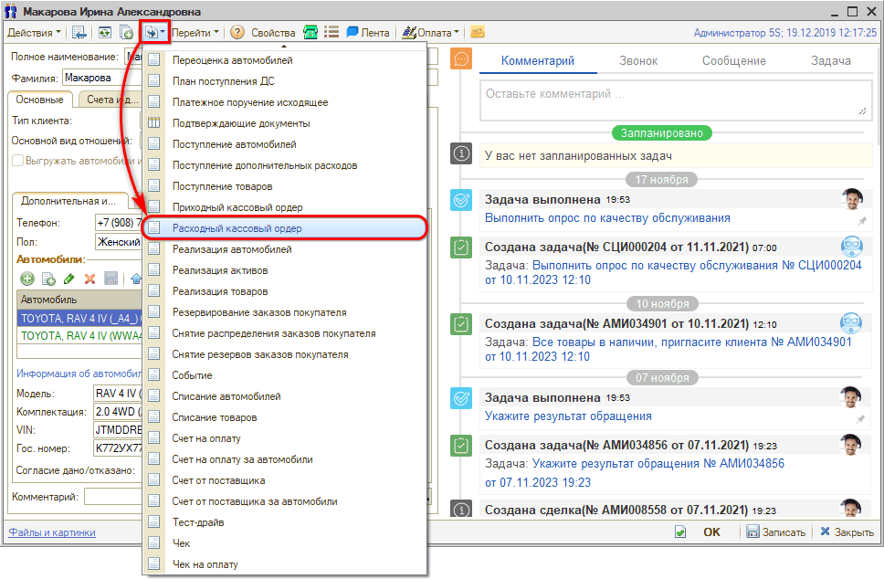

Контрагент и договор в документе при этом будут заполнены автоматически. Далее в создаваемом РКО нужно заполнить сумму, поставить галочку *"Для пробития на фискальном регистраторе"*, выбрать кассу, заполнить способ и тип расчета, сохранить документ и нажать кнопку *"Возврат":*

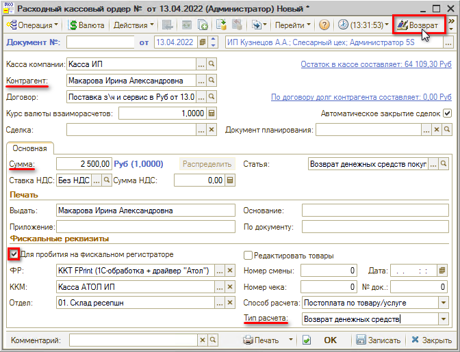

В открывшемся Фронте кассира пробить чек:

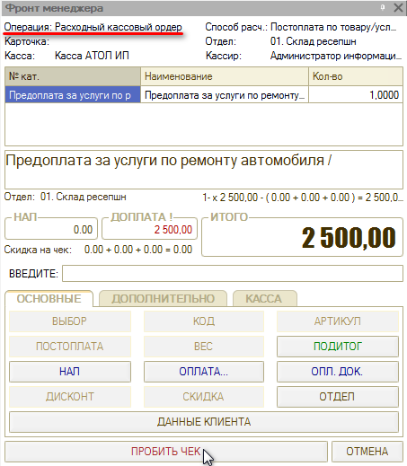

## Открытие/Закрытие кассовой смены

*Кассовой сменой* принято считать временной промежуток, начинающийся с момента формирования отчета об открытии и до составления отчета о завершении рабочего дня. Согласно п.2 статьи 4.3 ФЗ-54, продолжительность смены на онлайн-кассе не должна превышать 24 часа. Следует ежедневно открывать и закрывать смену.

Открытие смены на ККТ "Штрих", как правило, происходит автоматически при пробитии первого чека с уведомлением. На некоторых ККТ "Атол" открытие смены происходит после нажатия "Открыть смену" на фронте кассира.

Для закрытия кассовой смены используется соответствующая обработка *(Финансы → Касса и банк → Операционная касса → Закрытие кассовой смены):*

См. подробнее статью [*Обработка* *Закрытие кассовой смены*](../Обработка%20Закрытие%20кассовой%20смены/obrabotka-zakrytie-kassovoy-smeny.md).

***Внимание!*** Если кассир забыл закрыть смену в онлайн-кассе, продолжительность которой уже свыше 24 часов, то, чтобы не получить наказание от налоговой инспекции, не отбивайте чеки.

### Возможные ошибки

1. **В ККТ нет денег для выплаты**  
   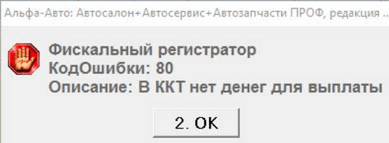  
   При возврате денег, при пробитии "Чека", работает контроль на остаток денег в кассе. Если средств недостаточно, пробитие чека невозможно.
2. **Оборудование не найдено**  
   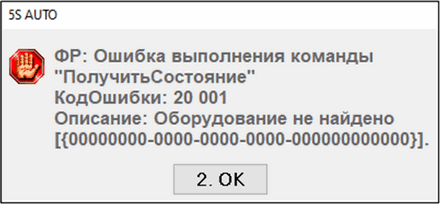  
   У нового пользователя может появиться такое окошко, если ККТ не до конца настроен. *Справочники → Розница и оборудование → Рабочие места*, добавляем по аналогии:  
   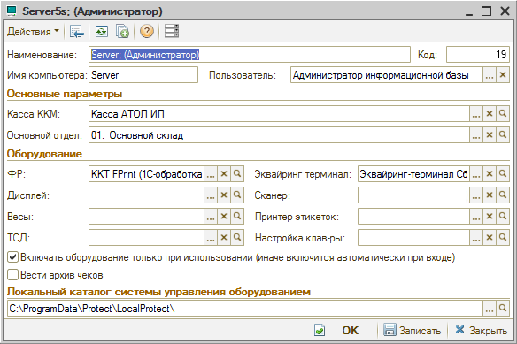

Более подробное описание доступно по ссылке: [*https://rarus.ru/press/publications/20190730-metodika-raboty-KKT-v-alfa-avto-avtosalon-avtoservis-avtozapchasti-prof-393386/*](https://rarus.ru/press/publications/20190730-metodika-raboty-KKT-v-alfa-avto-avtosalon-avtoservis-avtozapchasti-prof-393386/).

## Отправка электронной версии чека

Согласно Федеральному закону N 54-ФЗ «О применении контрольно-кассовой техники при осуществлении расчетов в Российской Федерации», кассовый чек клиенту можно отправить в электронном виде по номеру телефона или адресу электронной почты (если он их предоставил до момента расчета).

Для этого при приеме оплаты, перед пробитием чека, требуется во "Фронте менеджера" нажать кнопку *"ДАННЫЕ КЛИЕНТА"*, ввести в открывшееся поле адрес электронной почты или номер телефона клиента и нажать "ОК".

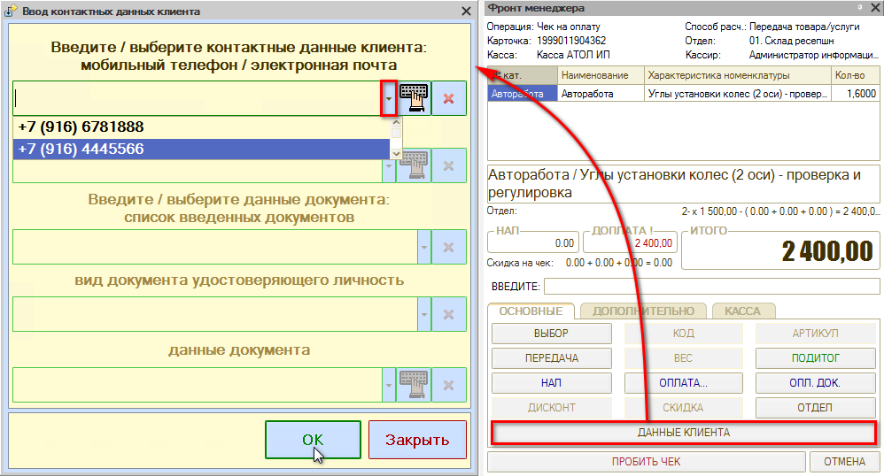

После пробития чека его электронная версия будет отправлена клиенту по указанному номеру или электронному адресу.

## Прием оплаты по СБП

*Описание работы с СБП и необходимых настроек в программе и на стороне банка см. в основной статье "[Работа с СБП](../../Банки%20и%20платежные%20системы/Система%20быстрых%20платежей/Работа%20с%20СБП/rabota-s-sbp.md)".*

Для приема оплаты по QR-коду с использованием системы СБП следует на форме принятия оплаты выбрать соответствующий тип оплаты, нажать кнопку “Заполнить ост.” и “Принять”:

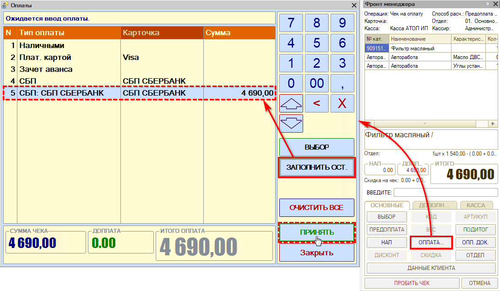

Затем перейти на вкладку “Дополнительно” – признак “Показать QR-код” будет активирован, флаг будет установлен по умолчанию. При нажатии кнопки “Пробить чек” открывается окно с QR-кодом, который можно отправить, скопировать, открыть в браузере либо отменить – подробнее см. в [основной статье](../../Банки%20и%20платежные%20системы/Система%20быстрых%20платежей/Работа%20с%20СБП/rabota-s-sbp.md#действия-с-платежной-ссылкой):

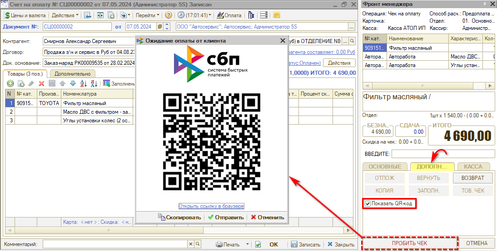

---

**Теги:** прием оплаты, торговое оборудование, касса, ккм, чек, возврат

