

# Режимы печати чеков

<table><tr><td><b>Время чтения:</b> 10 мин.</td><td><b>Обновлено:</b> 12.01.2026</td></tr></table>

Источник: https://www.5systems.ru/help/rezhimy-pechati-chekov

> *Актуально начиная с версии релиза 5S AUTO **2.8.3**.*

## Содержание

1. [Введение](#введение)
2. [Режимы пробития чеков](#режимы-пробития-чеков)
   - [1. Расшифровка товаров и услуг](#1-расшифровка-товаров-и-услуг)
   - [2. Стоимость товаров включена в работу](#2-стоимость-товаров-включена-в-работу)
   - [3. Одной строкой](#3-одной-строкой)
3. [Настройка](#настройка)
   - [1. Настройки для режима “Расшифровка товаров и услуг”](#1-настройки-для-режима-расшифровка-товаров-и-услуг)
   - [2. Настройки для режима “Стоимость товаров включена в работу”](#2-настройки-для-режима-стоимость-товаров-включена-в-работу)
   - [3. Настройки для режима “Одной строкой”](#3-настройки-для-режима-одной-строкой)

## Введение

[Постановлением Правительства Российской Федерации от 29.05.2025 № 780](http://publication.pravo.gov.ru/document/0001202505300055) утверждены *Правила оказания услуг (выполнения работ) по техническому обслуживанию и ремонту автомототранспортных средств.* 
Согласно п. 9 указанных Правил договор о ремонте автотранспортных средств заключается в письменной форме и должен содержать в том числе перечень оказываемых услуг, перечень запасных частей и материалов, предоставленных исполнителем, их стоимость и количество. 
Исполнитель обязан оказать услуги, определенные договором, с использованием собственных запасных частей и материалов, если иное не предусмотрено договором (п. 11 Правил).

Существует ряд писем[\*](#snoska) Минфина России, например, [от 06.11.2020 N 03-11-11/96971](http://base.garant.ru/74964764/), [от 07.02.2020 N 03-11-11/8074](http://base.garant.ru/73746374/), [от 28.06.2019 N 03-11-11/47760](http://base.garant.ru/72372450/), согласно которым договор (заказ-наряд, квитанция или иной документ) об оказании услуг по ремонту и техническому обслуживанию автотранспортного средства может предусматривать замену (установку) запасных частей, и ***стоимость данных запасных частей может быть включена в общую стоимость указанных услуг*** (независимо от того, выделяется ли стоимость таких запасных частей отдельной строкой в договоре об оказании услуг или нет). В этом случае использованные в рамках такого договора *запасные части не признаются товаром,* а сами исполнители не признаются розничными продавцами.

При таком способе оформления услуг по ремонту автотранспортных средств в чеке ККТ предполагается указание *только наименования оказанной услуги.* Наименование расходных материалов чеке допустимо не указывать, *при условии* что они подробно указаны в документе продажи (например, заказ-наряде).

*\* Разъяснения в указанных письмах даются для целей применения спецрежимов налогообложения. Также см. рекомендации ФНС в статье сервиса КонсультантПлюс: “[Как ИП на ПСН показать в чеке название услуг?](https://www.ivcons.ru/obzory-i-stati/stati-dlya-bukhgaltera/kak-ip-na-psn-pokazat-v-cheke-nazvanie-uslug/)”*

*Примечание:* В случае выделения товара отдельной строкой в договоре это уже считается розничной торговлей.

Примеры случаев, когда предполагается возможность включать стоимость использованных в производстве товаров в стоимость услуг:

*Пример 1.* Автосервис работает на патентной системе, позволяющей производить ремонт и ТО автомобилей. В данном случае пробивать чеки по патенту сервис может только на услуги.

*Пример 2.* Автосервис не является участником оборота [маркированных товаров](../../Маркировка/Маркировка%20товаров/markirovka-tovarov.md), но использует для оказания услуг товары, подлежащие обязательной маркировке – например, моторные масла и автожидкости (регистрация в системе ГИС МТ в данном случае не требуется – см. [пояснение 1](https://markirovka.ru/knowledge/tovarnye-gruppy/motornye-masla/organizatsiya-priobretet-motornye-masla-dlya-sobstvennykh-nuzhd-dolzhna-li-ona-registrirovatsya-i-vy), [пояснение 2](https://markirovka.ru/knowledge/tovarnye-gruppy/motornye-masla/kto-dolzhen-registrirovatsya-v-sisteme-markirovki-po-motornym-maslam), [вопрос 1](https://markirovka.ru/community/markirovka-motornykh-masel/avtoservis-i-markirovka-masel-i-zapchastey) и [вопрос 2](https://markirovka.ru/community/markirovka-motornykh-masel/top-5-voprosov-po-markirovke-motornykh-masel#comment-58455) на сайте "Честного знака").

Для учета стоимости использованных запчастей и материалов в кассовых чеках в программе предусмотрена настройка специальных режимов пробития чеков, при которых реализуемый в составе услуги товар не будет пробиваться отдельной строкой, но будет включен в стоимость пробиваемой услуги.

*Пробитие чеков возможно в одном из 3-х режимов:*

1. *Расшифровка товаров и услуг* – стандартный режим по умолчанию, когда каждые товар и услуга пробиваются отдельными строками;
2. *Стоимость товаров включена в работу* – специальный режим, при котором в чеке печатаются только автоработы, а стоимость использованных в ремонте товаров включается в стоимость работ через механизм связи;
3. *Одной строкой* – специальный режим, при котором услуги по заказ-наряду пробиваются в чеке одной строкой.

Описание режимов см. [ниже](#режимы-пробития-чеков).

*Примечание:* При выборе режима по умолчанию (расшифровка товаров и услуг) также есть возможность использовать функционал [раздельного пробития чеков](https://www.5systems.ru/help/razdelenie-chekov-kkm) для товаров и услуг. В случае использования двух других режимов данный функционал работать не будет.

## Режимы пробития чеков

### 1. Расшифровка товаров и услуг

Режим печати чека “Расшифровка товаров и услуг” – это *стандартный режим по умолчанию,* при котором каждая авторабота и каждый товар пробиваются отдельными строками в чеке:

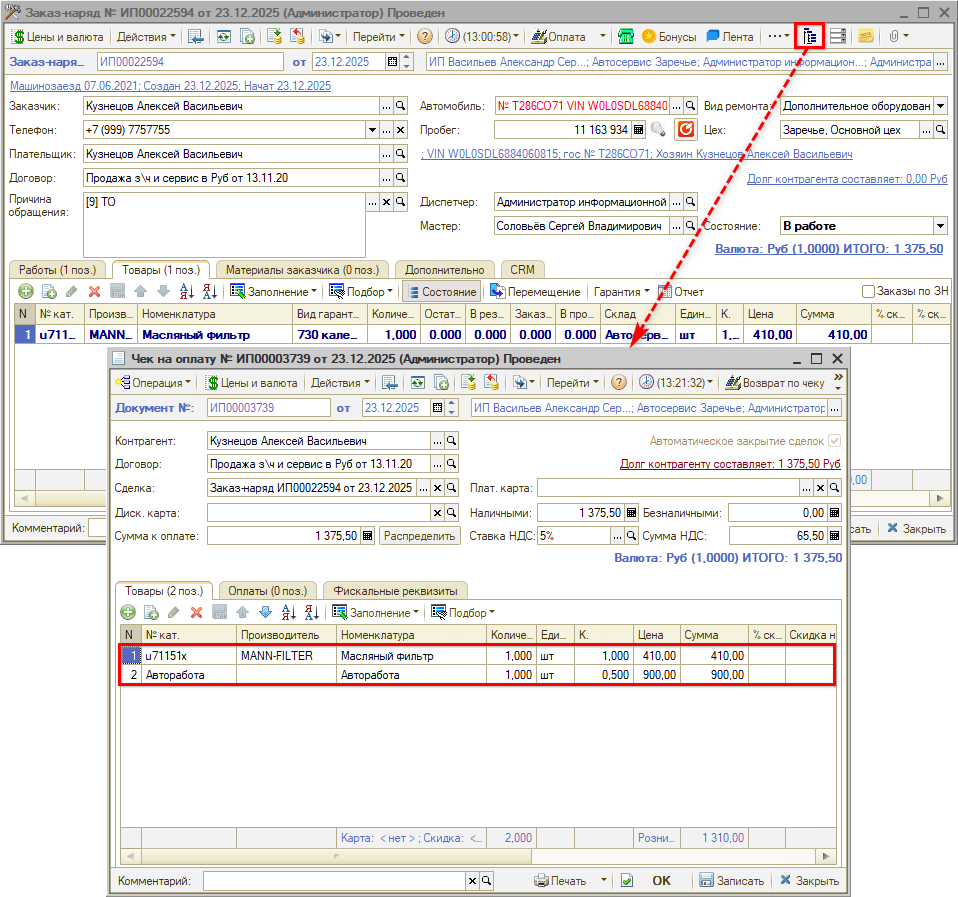

В печатной форме чека также будет печататься несколько строк – отдельная строка на каждую автоработу и на каждый товар:

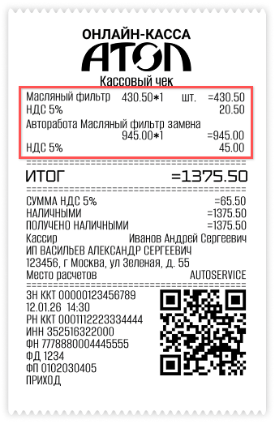

### 2. Стоимость товаров включена в работу

В режиме печати чека “Стоимость товаров включена в работу” стоимость запчастей, масла или автожидкостей *включается в стоимость работ* через *связь деталей и работ* в заказ-наряде:

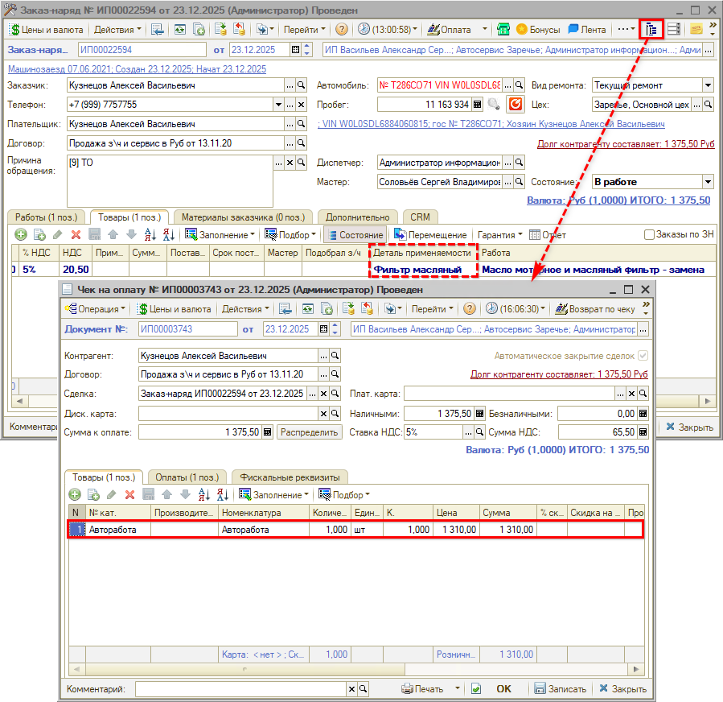

В печатной форме чека будут печататься только автоработы. Стоимость товаров включается в стоимость тех авторабот, с которыми они связаны:

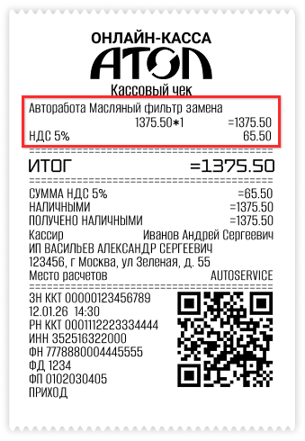

### 3. Одной строкой

При использовании режима печати чека “Одной строкой” в таблице “Товары” документа “Чек на оплату” будет содержаться одна строка с номенклатурой “Авторабота”:

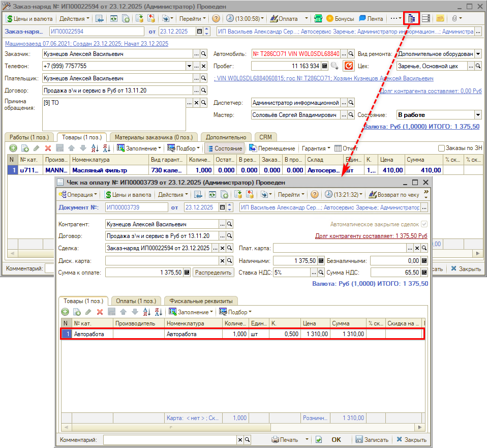

В печатной форме чека будет печататься одна строка следующего содержания: *“Оказание услуг по техническому обслуживанию и ремонту транспортного средства на основании заказ-наряда № ххххх от хх.хх.20хх”*

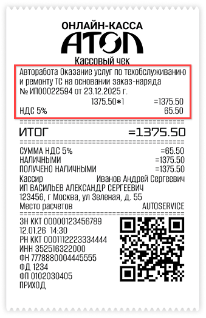

*Примечание:* Есть возможность задать свое описание в настройках вместо стандартного (см. [ниже](#3-настройки-для-режима-одной-строкой)).

## Настройка

Настройка режима пробития чека производится в карточке справочника “[Оборудование](https://www.5systems.ru/help/podklyuchenie-kassy-kkm)”.

В блоке “Дополнительные настройки” добавлен параметр *“Режим печати чеков”:*

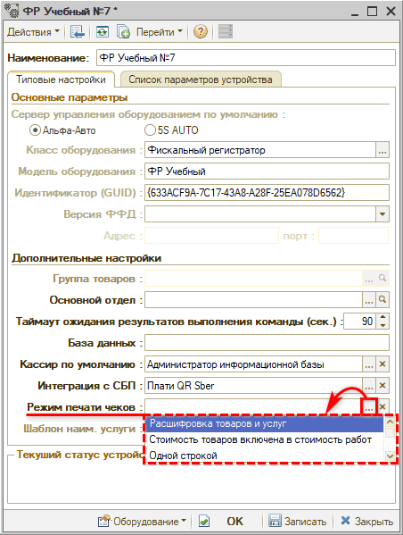

Возможен выбор одного из 3-х значений:

1. Расшифровка товаров и услуг
2. Стоимость товаров включена в работу
3. Одной строкой

Описание режимов см. [выше](#режимы-пробития-чеков).

### 1. Настройки для режима “Расшифровка товаров и услуг”

Для режима “Расшифровка товаров и услуг” дополнительных настроек не требуется: это стандартный режим пробития чеков по умолчанию.

*Примечание:* В случае если ранее был выбран какой-либо другой режим, то для возврата к режиму по умолчанию следует выбрать в настройках оборудования вариант "Расшифровка товаров и услуг".

### 2. Настройки для режима “Стоимость товаров включена в работу”

В случае выбора режима “Стоимость товаров включена в работу” предварительно должна быть установлена связь деталей и работ в заказ-наряде через механизм применяемости – подробное описание настройки см. в статье “[Автозаполнение применяемости из Заказ-наряда](../../Склад%20и%20запчасти/Применяемость%20запчастей/Автозаполнение%20применяемости%20из%20заказ-наряда/avtozapolnenie-primenyaemosti-iz-zakaz-naryada.md)”:

1. к *причине обращения* должны быть привязаны детали применяемости;
2. в параметрах *вида ремонта* должна быть установлена галочка “Контролировать детали применяемости” – она включает вывод столбца “Деталь применяемости” в Заказ-наряде в таблице “Работы”;
3. автоработы должны быть сопоставлены с деталями применяемости:

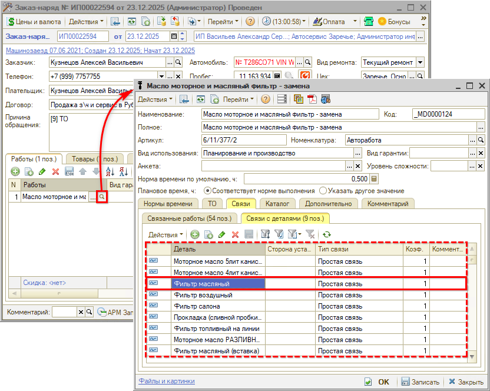

Далее требуется выбрать в настройках оборудования режим печати чеков “Стоимость товаров включена в стоимость работ”:

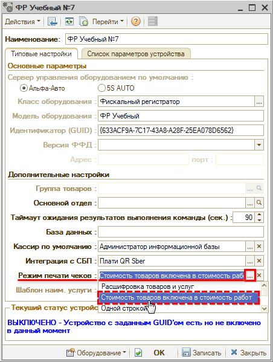

После произведенных настроек и установки данного режима в оборудовании при печати чека товары “схлопываются”, а их сумма переносится в стоимость работы.

*Внимание!* При выборе данного режима не рекомендуется использовать скидки, т.к. возможна их некорректная установка.

### 3. Настройки для режима “Одной строкой”

В случае выбора режима “Одной строкой” активируется параметр *“Шаблон наименования услуги”:*

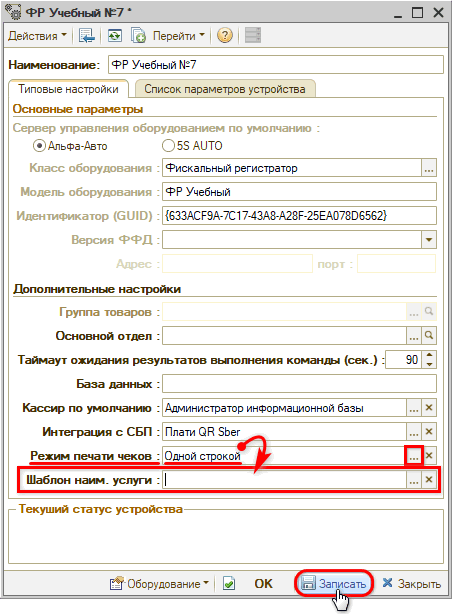

Следует нажать кнопку *“Записать”* – при этом в программе будет создан шаблон сообщения “Наименование услуги для печати чека одной строкой”:

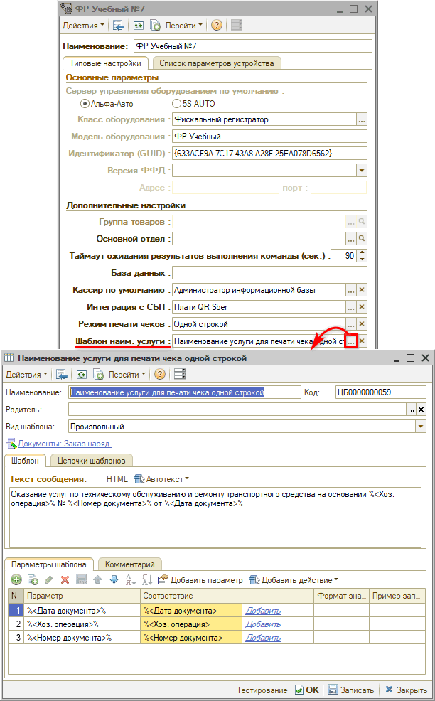

Это шаблон по умолчанию с предзаполненным описанием услуги, которое будет выводиться в чеках (см. [выше](#opisanie)). Также есть возможность задать свое описание услуги.

---

**Теги:** прием оплаты, торговое оборудование, маркировка, чек, режимы печати

