# Упрощенный Фронт кассира

<table><tr><td><b>Время чтения:</b> 26 мин.</td><td><b>Обновлено:</b> 29.03.2023</td></tr></table>

Источник: https://www.5systems.ru/help/uproschennyy-front-kassira

## Содержание

1. [Введение](#введение)
2. [Видео по теме](#видео-по-теме)
   - [1. Прием оплаты через Упрощенный Фронт кассира](#1-прием-оплаты-через-упрощенный-фронт-кассира)
   - [2. Возврат по чеку на оплату](#2-возврат-по-чеку-на-оплату)
3. [Интерфейс упрощенного Фронта кассира](#интерфейс-упрощенного-фронта-кассира)
   - [1. Сумма для пробития](#1-сумма-для-пробития)
   - [2. Выбор типа оплаты](#2-выбор-типа-оплаты)
      - [1) Зачет предоплаты](#1-зачет-предоплаты)
      - [2) Распределение по типам оплаты](#2-распределение-по-типам-оплаты)
   - [3. Проект чеков на оплату](#3-проект-чеков-на-оплату)
   - [4. Бумажный и электронный чек](#4-бумажный-и-электронный-чек)
   - [5. Открыть фронт кассира](#5-открыть-фронт-кассира)
   - [6. Пробитие чека ККМ](#6-пробитие-чека-ккм)
   - [7. Кнопка “Отмена”](#7-кнопка-отмена)
4. [Возврат переплаты](#возврат-переплаты)
5. [Права и настройки для упрощенного Фронта кассира](#права-и-настройки-для-упрощенного-фронта-кассира)
   - [1. Включение упрощенной формы Фронта кассира](#включение-упрощенной-формы-фронта-кассира)
   - [2. Настройки для печати и отправки чека](#настройки-для-печати-и-отправки-чека)
6. [Вызов отчета для контроля взаиморасчетов](#вызов-отчета-для-контроля-взаиморасчетов)

## Введение

В системе реализована упрощенная форма *Фронта кассира*. Отличия от стандартного Фронта кассира заключаются в следующем:

1. Максимальное упрощение работы кассира: сокращен функционал формы – оставлены только нужные в повседневной работе кнопки;
2. Усовершенствован контроль за правильностью взаиморасчетов: добавлена возможность зачесть сумму аванса, внесенного клиентом не только по текущей сделке;
3. Минимизация человеческого фактора: все данные подтягиваются автоматически, программа сводит к минимуму возможность ошибки со стороны кассира.

При приеме окончательного расчета по сделке кассир производит зачет авансовых платежей и, если требуется доплата, выбирает тип оплаты: наличными, картой или [СБП](../Отражение%20оплаты%20через%20СБП/otrazhenie-oplaty-cherez-sbp.md). Программа контролирует правильность действий пользователя.

При необходимости всегда есть возможность [перейти из упрощенной в стандартную](#5-открыть-фронт-кассира) форму *Фронта кассира*.

Следует отметить, что *необходимо каждый день закрывать кассовую смену.* Можно сделать это с помощью специальной обработки: см. статью [Обработка Закрытие кассовой смены](../Обработка%20Закрытие%20кассовой%20смены/obrabotka-zakrytie-kassovoy-smeny.md).

Для использования функционала необходимо, чтобы для права “Фронт кассира рабочего места” было выбрано значение “Форма упрощенная” (см. [ниже](#включение-упрощенной-формы-фронта-кассира)).

## Видео по теме

### 1. Прием оплаты через Упрощенный Фронт кассира

[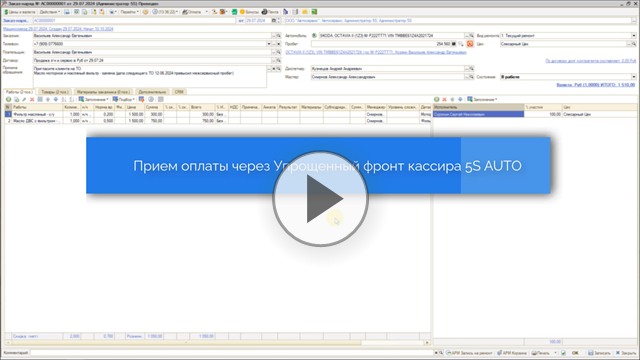](https://edu.5systems.ru/video/Forma_priema_oplaty/Priem_oplaty.mp4)

### 2. Возврат по чеку на оплату

[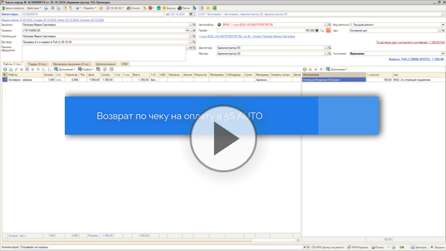](https://edu.5systems.ru/video/Forma_priema_oplaty/Vozvrat_po_cheku.mp4)

## Интерфейс упрощенного Фронта кассира

При нажатии в документе кнопки “Оплата” открывается окно “Ввод суммы оплаты”:

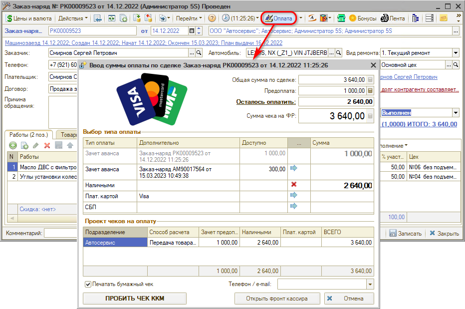

### 1. Сумма для пробития

В верхнее поле подтягивается сумма для пробития чека:

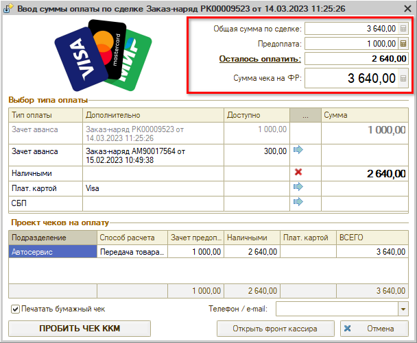

- *“Общая сумма по сделке”:* сумма оплаты по документу, на основании которого вводится оплата;
- *“Предоплата”:* сумма ранее внесенной предоплаты по документу;
- *“Осталось оплатить”:* если была внесена предоплата, то сумма в данном поле отображается за вычетом предоплаты;
- *“Сумма чека на ФР”:* сумма, которую необходимо оплатить через фискальный регистратор. В случае приема предоплаты ее можно корректировать. Если принимается окончательная оплата по документу, то сумма в данном поле недоступна для редактирования.

### 2. Выбор типа оплаты

В разделе “Выбор типа оплаты” производится разнесение вносимой суммы по всем возможным типам оплаты:

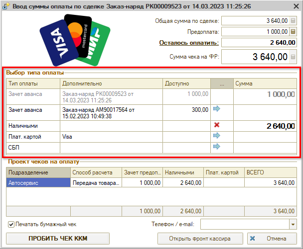

#### 1) Зачет предоплаты

Есть возможность зачесть предоплату, внесенную ранее клиентом:

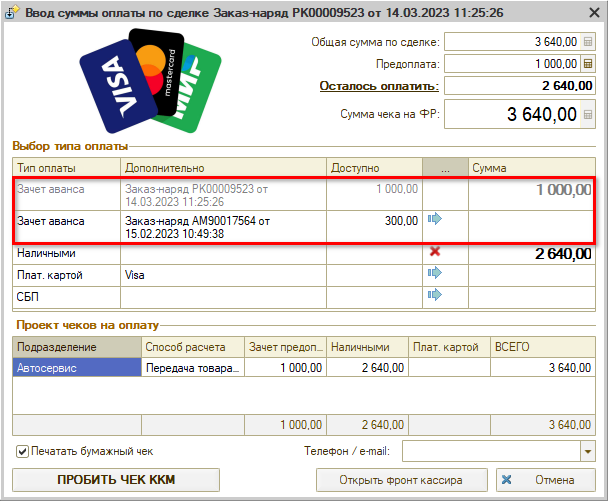

##### A) Зачет аванса по текущей сделке

В случае пробития чека передачи товара/услуги, если была предоплата по текущей сделке[\*](#snoska), а также если оплата была принята по документу, находящемуся в одном дереве связи с текущей сделкой, *зачет предоплаты* происходит *автоматически.* Внесенная сумма предоплаты отображается в поле *“Зачет аванса”* серым цветом и недоступна для редактирования.

##### B) Зачет авансов по другим сделкам клиента

Есть возможность зачесть авансовые платежи по другим сделкам[\*](#snoska) данного клиента – не связанным с текущей сделкой[\*](#snoska). Например, если была переплата по предыдущей сделке клиента, – т.е. уменьшилась сумма уже оплаченного заказ-наряда, – то можно зачесть образовавшуюся переплату в качестве аванса по новой сделке.

В таблицу выбора типа оплаты загружаются все сделки[\*](#snoska) клиента, по которым имеются авансы, со следующими исключениями:

1. Не попадают незакрытые Заказы покупателя;
2. Не включаются открытые Заказ-наряды.

Чтобы зачесть аванс по другой сделке, нужно выбрать данный тип оплаты: нажать кнопку “Заполнить” в соответствующей строке.

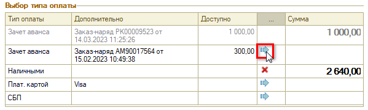

При пробитии чека формируется “Корректировка долга” по внесенному ранее авансовому платежу – происходит перенос суммы долга со старого документа на новый:

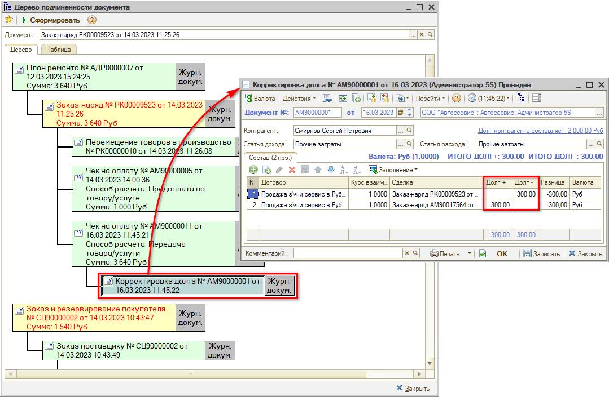

*\*Под **сделкой** в данном случае понимается документ взаиморасчетов – отгрузки, поставки, оплаты, – по которому формируется задолженность клиента перед компанией либо компании перед клиентом (см. статью* [*Учет взаиморасчетов*](../../Учет%20взаиморасчетов/Взаиморасчеты%20с%20контрагентами/vzaimoraschety-s-kontragentami.md#сделка-как-документ-взаиморасчетов)).

Также в таблице с типами оплаты отображаются переплаты клиента по другим организациям, но они недоступны для выбора, т.е. для зачета аванса – выводятся для информирования кассира, что за клиентом числится переплата:

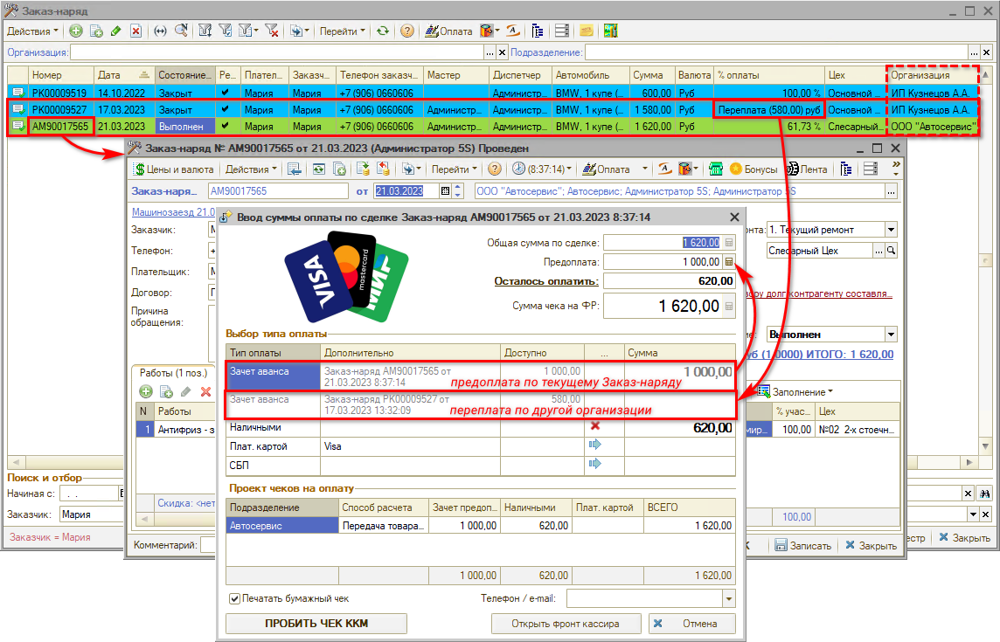

#### 2) Распределение по типам оплаты

Оставшуюся для приема сумму необходимо распределить по типам оплаты – “Наличными”, “Картой” или “СБП”, – используя ручной ввод в поле “Сумма”, а также кнопки   “Заполнить” и   “Очистить”. В случае приема окончательного расчета сумма должна быть разнесена полностью, иначе программа не позволит пробить чек:

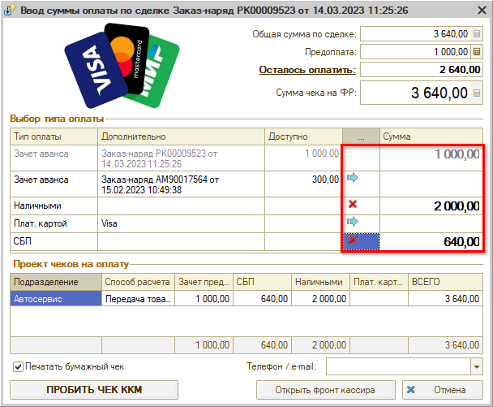

### 3. Проект чеков на оплату

В данном поле отображается информация, которая будет отражена в Чеке на оплату после нажатия кнопки “Пробить чек”. Данные заполняются автоматически и не редактируются.

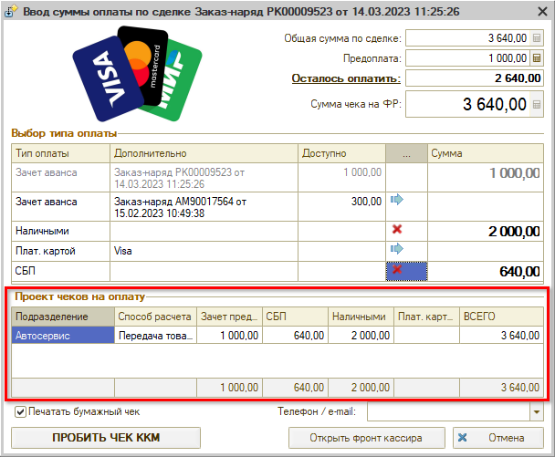

***Способ расчета*** устанавливается в зависимости от документа, по которому принимается оплата и его состояния:

- способ *“Предоплата по товару / услуге”* устанавливается при приеме оплаты по документам Заказ покупателя, Счет на оплату и Заказ-наряд в состояниях помимо “Выполнен” и “Закрыт”;
- способ *“Передача товара/услуги”* устанавливается при приеме оплаты по документам Реализация товаров и Заказ-наряд в состоянии “Выполнен” или “Закрыт”.

### 4. Бумажный и электронный чек

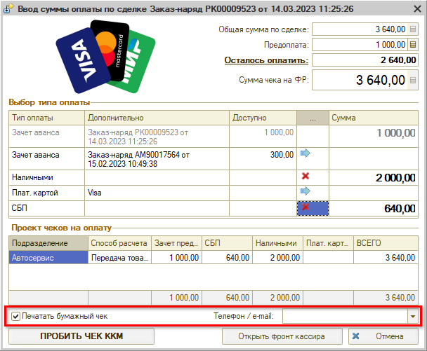

Галочку ***“Печатать бумажный чек”*** можно ставить либо снимать при необходимости. По умолчанию она будет стоять либо будет снята в зависимости от значения настройки “Не печатать фискальный чек” (см. [ниже](#печать-чека-по-умолчанию)).

Для отправки клиенту ***электронного чека*** используется поле “Телефон/e-mail:”. Можно установить контроль заполнения данных для отправки электронного чека (см. [ниже](#контроль-заполнения-данных-для-отправки-электронного-чека)): программа будет напоминать пользователю о заполнении телефона или электронного адреса клиента для отправки ему электронного чека.

Выбор телефона или адреса электронной почты для отправки чека производится из выпадающего списка: телефон подтягивается из документа, по которому принимается оплата, адрес почты – из карточки клиента.

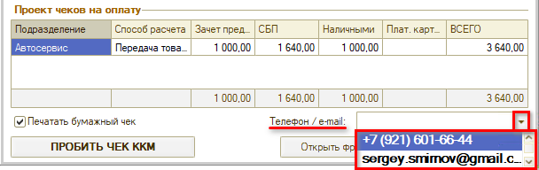

### 5. Открыть фронт кассира

Нажатием данной кнопки можно перейти в обычный *Фронт кассира* при необходимости:

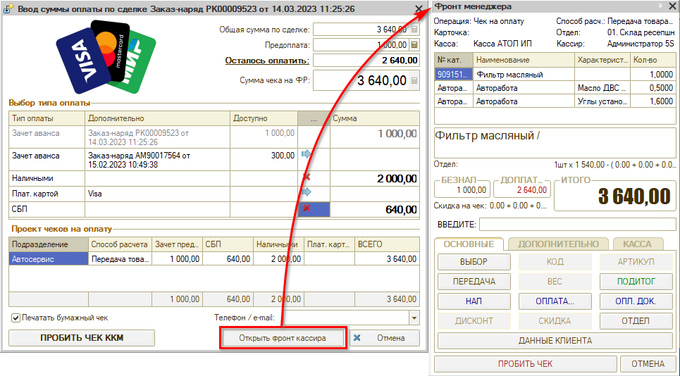

### 6. Пробитие чека ККМ

#### Открытие смены

Если еще не была открыта кассовая смена, и требуется пробить первый чек за день, то при нажатии кнопки “Пробить чек ККМ” выйдет сообщение программы:

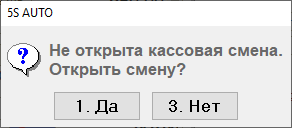

Следует нажать “Да” и затем – еще раз кнопку “Пробить чек ККМ”.

*Примечание: Закрывать кассовую смену необходимо в конце каждого рабочего дня через* [*обработку Закрытие кассовой смены*](../Обработка%20Закрытие%20кассовой%20смены/obrabotka-zakrytie-kassovoy-smeny.md).

#### Пробитие чека

При нажатии на кнопку “Пробить чек ККМ” открывается окно “Оплата покупки”, заполненное в соответствии с ранее введенными данными:

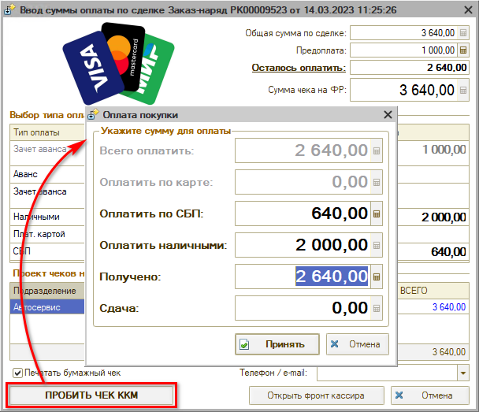

В случае оплаты наличными при вводе полученной от клиента суммы будет автоматически рассчитана сдача.

После проверки суммы следует нажать кнопку “Принять” – при этом:

- чек ККМ выводится на печать либо отправляется клиенту в электронном виде;
- форма Фронта кассира *закрывается;*
- в программе формируется документ “Чек на оплату”:

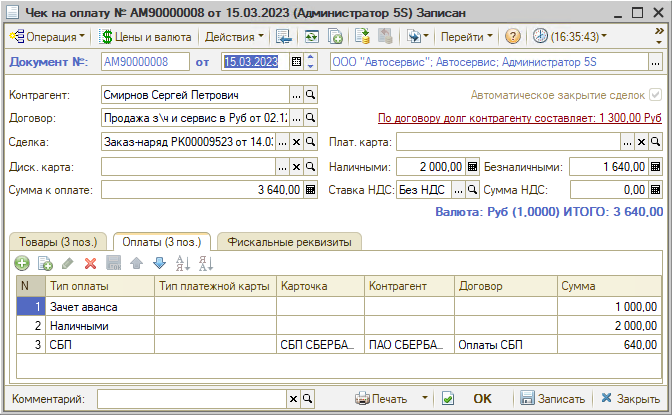

### 7. Кнопка “Отмена”

Для выхода из формы оплаты и упрощенной формы Фронта кассира прежде печати чека используется кнопка “Отмена”:

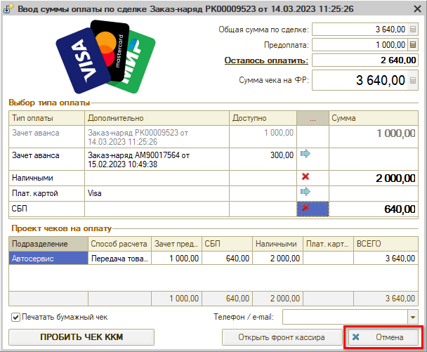

## Возврат переплаты

В случае, если клиент вносил предоплату по сделке в полном размере, но в результате проведенного ремонта сумма по документу уменьшилась, то можно:

1. Зачесть сумму данной переплаты в будущем в качестве аванса при следующем обращении клиента (см. п. [Зачет авансов по другим сделкам клиента](#b-зачет-авансов-по-другим-сделкам-клиента));
2. Вернуть переплату клиенту.

Для возврата клиенту переплаты по сделке следует в документе нажать на стрелку рядом с кнопкой “Оплата” и в выпадающем меню выбрать кнопку “Возврат остатка”:

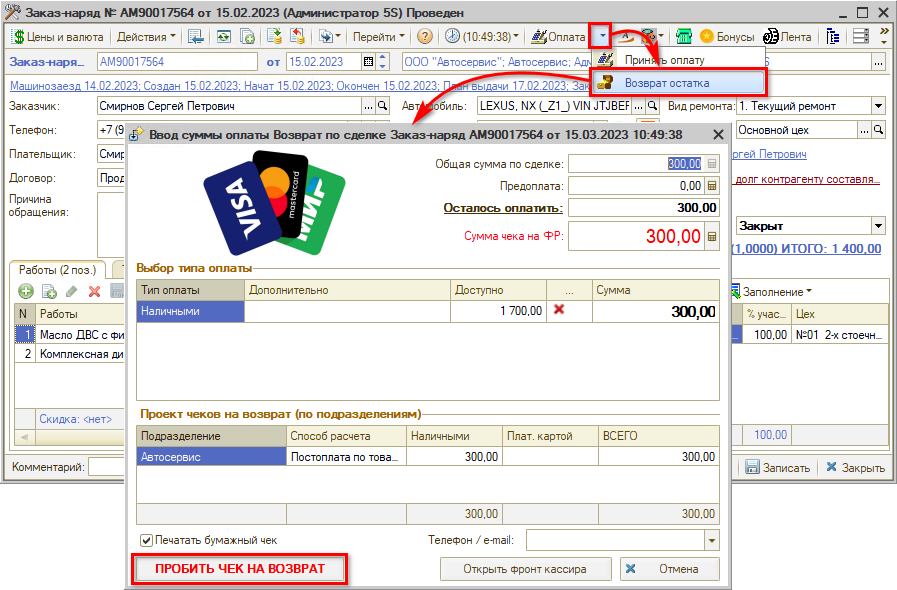

Форма будет автоматически заполнена данными из документа, нужно только проверить сумму и нажать кнопку *“Пробить чек на возврат”.*

## Права и настройки для упрощенного Фронта кассира

### Включение упрощенной формы Фронта кассира

Включение упрощенной формы Фронта кассира регулируется правом “Фронт кассира рабочего места” – должно быть выбрано значение “Форма упрощенная”:

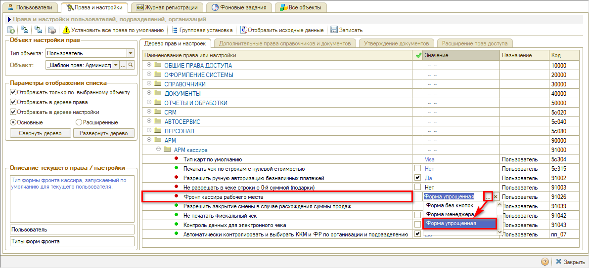

### Настройки для печати и отправки чека

#### Печать чека по умолчанию

Галочка “Печатать бумажный чек” будет стоять либо будет снята по умолчанию в зависимости от значения настройки “Не печатать фискальный чек”:

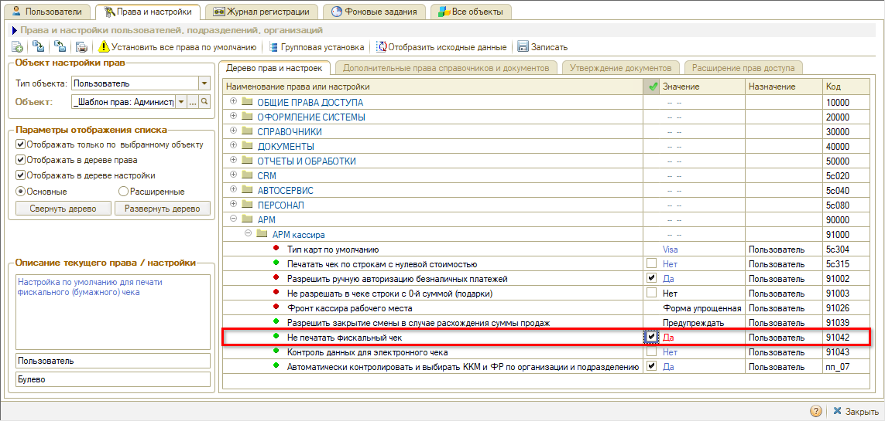

Если установить значение “Да”, то по умолчанию бумажный чек печататься не будет.

#### Контроль заполнения данных для отправки электронного чека

Для установки контроля заполнения данных для отправки электронного чека используется настройка “Контроль данных для электронного чека”:

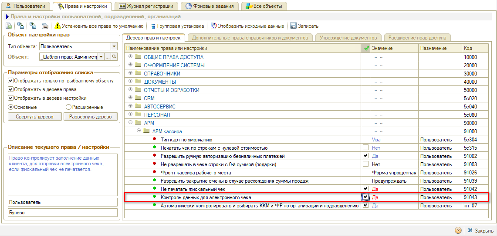

При установке значения “Да” для данной настройки программа будет напоминать пользователю о заполнении телефона или электронного адреса клиента для отправки ему электронного чека.

## Вызов отчета для контроля взаиморасчетов

Нажатием на ссылку *“Осталось оплатить”* можно вызвать отчет “[Взаиморасчеты с контрагентами](../../Учет%20взаиморасчетов/Отчет%20Взаиморасчеты%20с%20контрагентами/otchet-vzaimoraschety-s-kontragentami.md)” со специальными настройками, в разрезе сделок, в контексте текущего клиента:

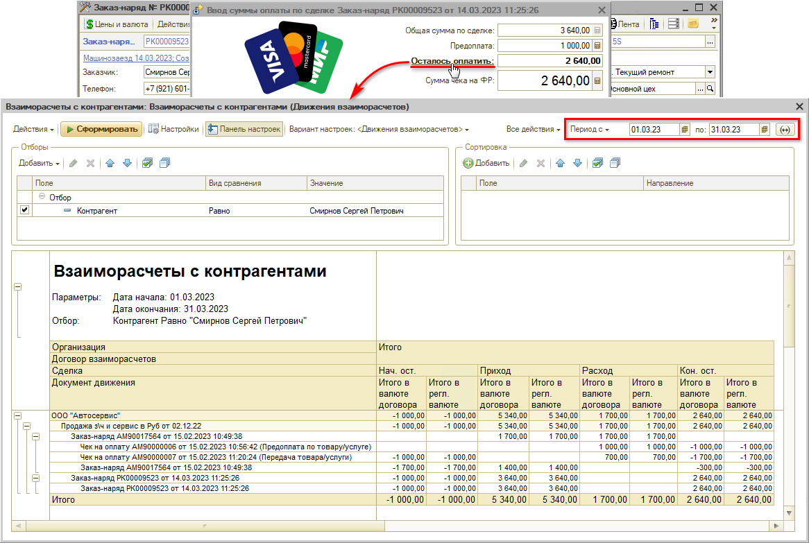

Для данного отчета по умолчанию настроен вывод данных на текущий месяц: если требуется вывести данные за другой период – необходимо задать нужные даты и нажать кнопку “Сформировать”.

---

**Теги:** прием оплаты, фронт кассира, касса, оплата, возврат по чеку
