

# Выявление неликвидов

<table><tr><td><b>Время чтения:</b> 22 мин.</td><td><b>Обновлено:</b> 14.06.2023</td></tr></table>

Источник: https://www.5systems.ru/help/vyyavlenie-nelikvidov

## Содержание

1. [Введение](#введение)
2. [Логика процесса Контроля неликвидов](#логика-процесса-контроля-неликвидов)
3. [Канбан процесса Контроля неликвидов](#канбан-процесса-контроля-неликвидов)
4. [Форма бизнес-процесса](#форма-бизнес-процесса)
5. [Право “Автоматический контроль неликвидов”](#право-автоматический-контроль-неликвидов)
6. [Регламентное задание “Контроль складских остатков”](#регламентное-задание-контроль-складских-остатков)

## Введение

Поскольку автосервисы и магазины запчастей реализуют запчасти под конкретные автомобили, то в случае отказа клиента от их покупки зачастую на складе остается труднореализуемая продукция, которая, пролежав продолжительное время, попадает под понятие ”неликвид”.

Как правило, под *неликвидом* понимается товар на складе, который числится на балансе предприятия и по каким-либо причинам не востребован у покупателей – т.е. остается нераспроданным в течение длительного периода времени. Срок, по истечении которого товар считается неликвидным, может различаться в зависимости от товаров и компании – например, 3 месяца или 6 месяцев. Неликвиды значительно снижают рентабельность компании, поэтому наилучшим решением является предотвратить их появление на складе.

Благодаря функционалу ***Контроля неликвидов*** система своевременно выявляет потенциальный неликвид и помогает оперативно разобрать и проконтролировать каждый случай. Выявление таких случаев должно быть сделано как можно раньше, чтобы была возможность вернуть товар поставщику. При разборе каждого выявленного потенциального неликвида принимается решение, что делать с обнаруженной запчастью:

- вернуть поставщику – у большинства крупных поставщиков в договоре четко прописывается срок возврата товара, например, 2 недели;
- взять на пополнение склада – для этого требуется определить, может ли данный товар быть реализован другим клиентам;
- установить лицо, виновное в образовании неликвида, и реализовать товар ему.

Данный механизм требует контроля руководителем и внедрения в культуру компании, но зато он помогает предотвратить появление неликвидов и повысить эффективность бизнеса.

Обобщенно процесс Контроля неликвидов состоит из следующих этапов:

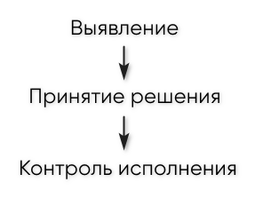

## Логика процесса Контроля неликвидов

***Процесс “Контроль неликвидов”*** – это специализированный бизнес-процесс, который фиксирует в программе выявленный неликвид, а также все связанные с ним задачи и документы:

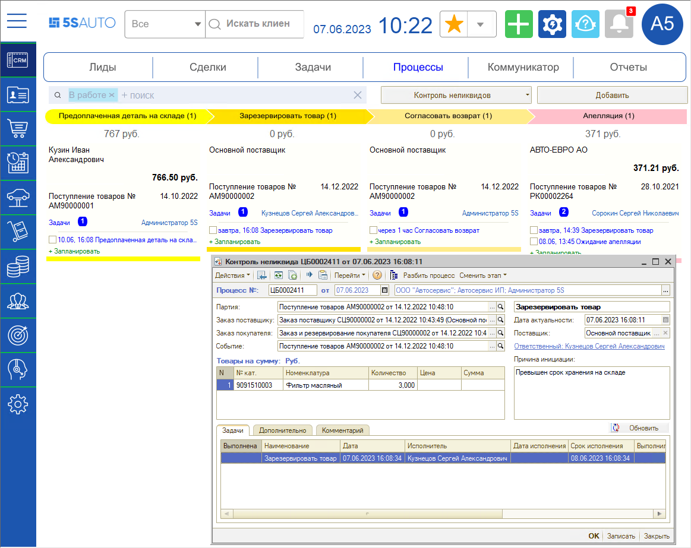

Под Контроль неликвидов попадают только запчасти, которые были куплены для определенного клиента и распределены под заказы покупателя либо заказ-наряды в документе поступления товаров на склад.

*Исключаются* из контроля товары, заказанные для пополнения склада:

- товары с минимальными остатками;
- внутренние заказы;
- заказы поставщикам без распределения по заказам покупателя;
- заказы, которые проведены без распределения – если последнее разрешено пользователям.

Подробнее см. статью [Распределение поступлений по заказам](../../Работа%20с%20заказами/Распределение%20поступлений%20по%20заказам/raspredelenie-postupleniy-po-zakazam.md).

***Варианты запуска процесса Контроля неликвидов:***

Система считает, что появился неликвид, при следующих событиях:

1. Снятие резерва заказа покупателя;
2. Корректировка заказа;
3. Возврат от покупателя;
4. Извлечение товаров из производства – если товар был передан в производство и возвращен обратно на склад;
5. Превышение сроков хранения товара.

В вариантах 1-4 по перечисленным событиям в момент проведения документов сразу создается процесс Контроля неликвидов. Для варианта 5 предусмотрено специальное регламентное задание (см. [ниже](#регламентное-задание-контроль-складских-остатков)), которое отслеживает все складские остатки товаров.

По каждому выявленному случаю ответственные сотрудники должны ***указать одно из решений:***

- продать запчасть клиенту – в этом случае созданный процесс автоматически закроется;
- продлить резерв: в логике бизнес-процесса заложена возможность продлить автоматически снятый резерв – можно до 3-х раз;
- вернуть товар поставщику;
- принять товар на пополнение склада;
- вручить сотруднику, который был виновен в закупке неликвидного товара.

Для того, чтобы в перечисленных случаях запускался Контроль неликвидов, необходимо, чтобы было включено право *“Автоматический контроль неликвидов”* (см. [ниже](#право-автоматический-контроль-неликвидов)).

***Варианты завершения процесса:***

1. Процесс полностью отработан – прошел через все этапы согласно логике канбана.
2. Товар реализован клиенту либо принят на пополнение склада – при этом процесс автоматически завершается.

## Канбан процесса Контроля неликвидов

### Переход к процессам

Переход к процессу Контроля неликвидов осуществляется через меню *CRM → вкладка “Процессы” → Контроль неликвидов:*

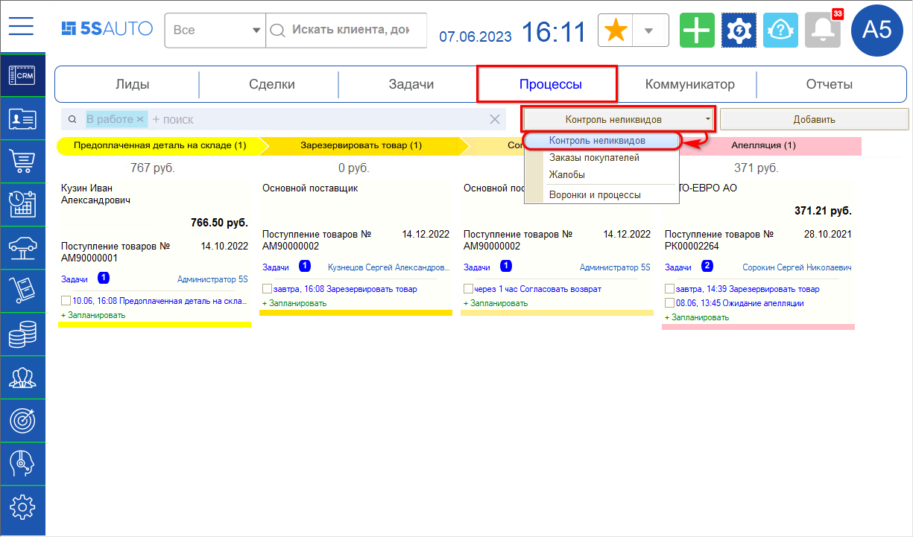

### Карточка просмотра

В карточке просмотра на канбане указаны наименование поставщика, сумма, основной документ процесса – Поступление товаров, дата поступления, задачи и ответственный:

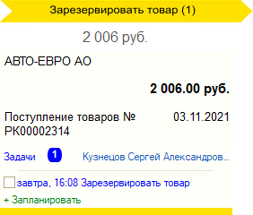

Из карточки на канбане можно *правой кнопкой мыши* открыть контекстное меню, которое позволяет перевести процесс на другие доступные этапы, отложить или завершить процесс:

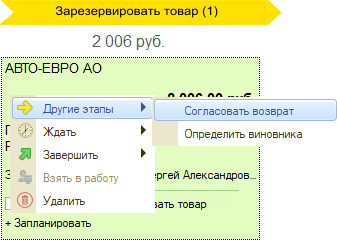

### Фильтры процессов

На рабочем столе отображены все текущие процессы по контролю неликвидов в различных стадиях. Таким образом, канбан содержит только актуальную информацию – у рядового пользователя, как правило, должны отображаться 1-2 столбца в канбане.

Пустые этапы автоматически скрываются. Если включить функционал, но не работать с ним, то бизнес-процессы будут копиться – поэтому важно своевременно исполнять задачи.

Помимо процессов “В работе” можно просматривать процессы в состояниях “Отложенные” и “Закрытые”. Решение по процессу может быть отложено на определенный срок – при этом карточка процесса переносится на канбан “Отложенные”. Для переключения на отложенные процессы следует нажать на кнопку отключения отбора **[Х]** рядом с наименованием отбора "В работе":

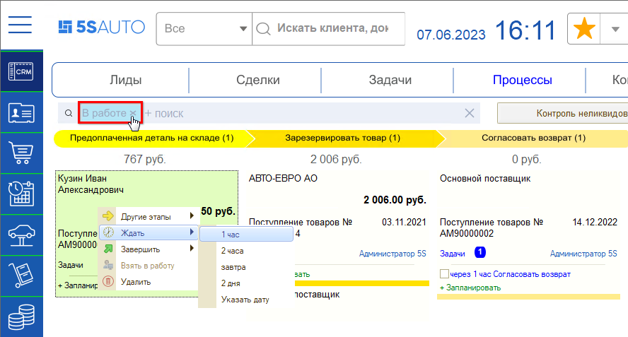

Происходит переход к канбану отложенных процессов:

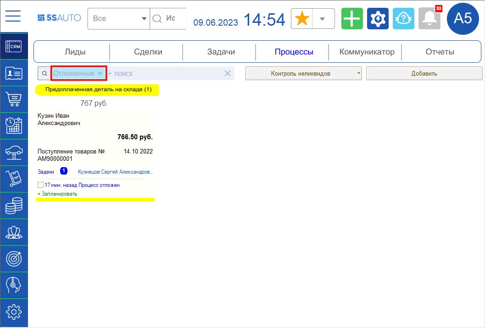

Если выполнить все текущие задачи, процесс переходит на завершающие этапы. Также процесс автоматически завершается, если продать деталь либо если взять ее на пополнение склада. Завершенный процесс пропадает с рабочего канбана и переносится на канбан “Закрытые”. Для перехода к нему следует установить отбор по закрытым сделкам и нажать кнопку “Найти”:

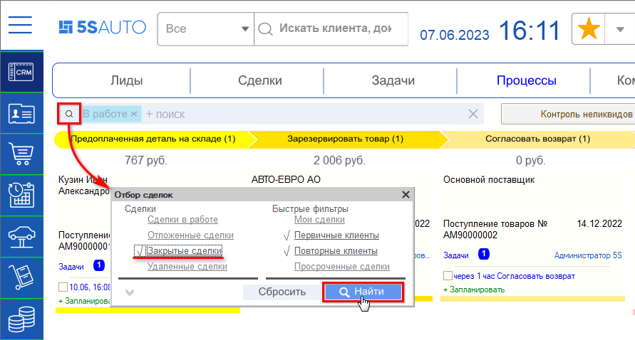

## Форма бизнес-процесса

Форма процесса создается в программе при выявлении неликвида. Открыть форму контроля неликвида можно двойным кликом по карточке на канбане процесса:

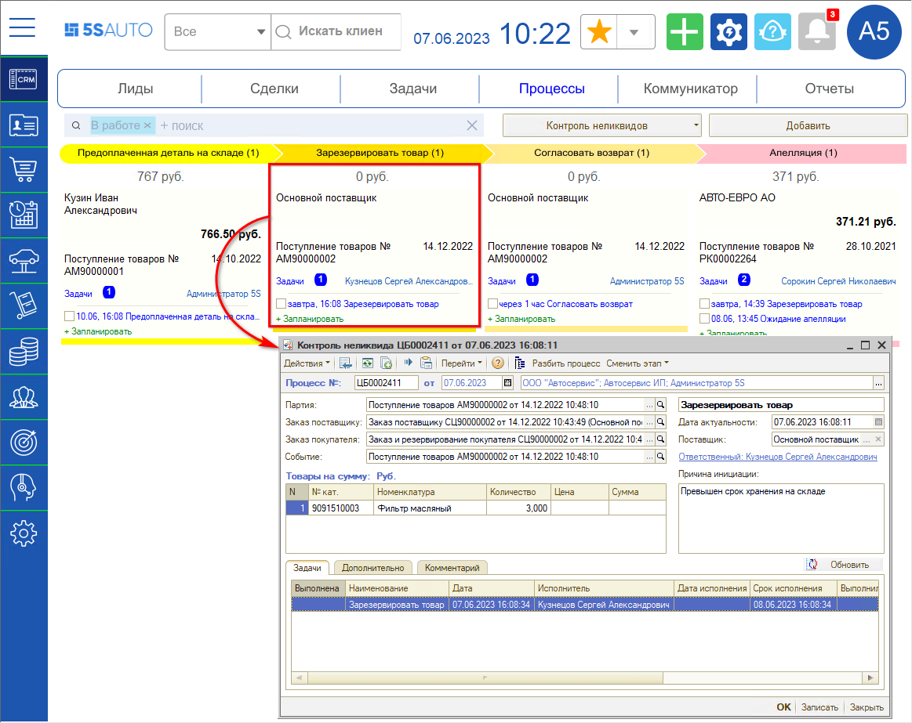

***Параметры формы:***

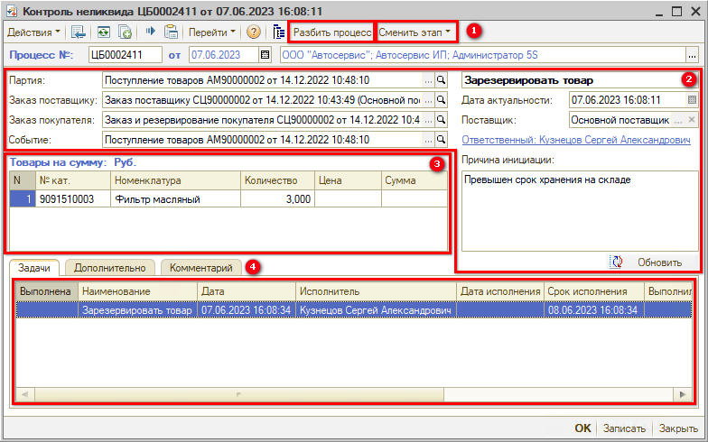

***1. Панель управления***

*1) Кнопка Разбить* *процесс* – используется, если требуется принять конкретное решение не по всей партии, а только по определенной товарной позиции. Нажатием на кнопку открывается форма “Разделение процесса”: в столбце “Новое количество” следует указать количество номенклатуры напротив товара, который нужно выделить в отдельный процесс, и нажать кнопку “Разбить”:

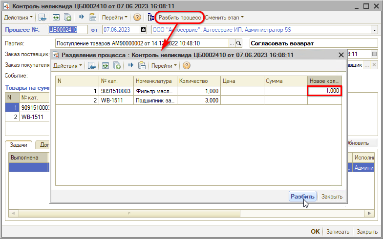

Процесс будет разделен на два отдельных процесса: будет создан новый процесс по указанному товару, а из текущего процесса данная номенклатура в указанном количестве удалится.

*2) Кнопка Сменить этап* – нажатием на кнопку открывается дополнительное меню с выбором доступных этапов для перевода либо завершения процесса. Список этапов для перевода определяется настройками этапов (см. [Настройки процесса Контроля неликвидов → Настройка этапов](../Настройки%20процесса%20Контроля%20неликвидов/nastroyki-processa-kontrolya-nelikvidov.md#настройка-этапов)). В качестве завершающих этапов могут быть доступны: “Продан”, “Зарезервирован”, “Принят на склад”.

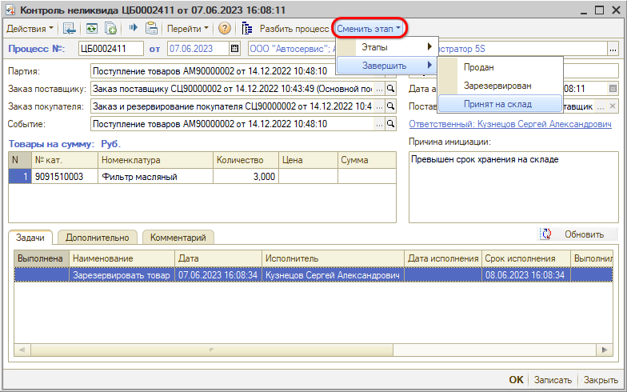

***2. Реквизиты***

1. *Партия* – документ Поступление товаров.
2. *Заказ поставщику* – документ подтягивается, если есть заказ поставщику.
3. *Заказ покупателя* – документ Заказ покупателя или Заказ и резервирование покупателя.
4. *Событие* – документ, на основании которого был запущен бизнес-процесс, например, Снятие резервов покупателя, Поступление товаров – когда превышен срок хранения на складе, и др.
5. В поле *“Причина инициации”* подтягивается причина, по которой был создан бизнес-процесс.
6. Можно сменить *ответственного* – задача перейдет к нему.

***3. Таблица***

В таблице отображается *товар* из документа – номенклатура, количество, цена, сумма.

***4. Вкладки***

В нижней части формы на *вкладке “Задачи”* отображается созданная задача. Задачу также можно открыть из карточки на канбане. Описание см. в статье [Настройки процесса Контроля неликвидов → Настройка задач процесса Контроля неликвидов](../Настройки%20процесса%20Контроля%20неликвидов/nastroyki-processa-kontrolya-nelikvidov.md#настройка-задач-процесса-контроля-неликвидов).

На *вкладке “Дополнительно”* находятся отметки о статусе бизнес-процесса: “Стартован”, “Завершен”, “На контроле” и “Решение на пополнение склада”. Данные отметки устанавливаются автоматически при ведении процесса по этапам.

Признак *“На контроле”* – это отметка о контроле исполнения процесса:

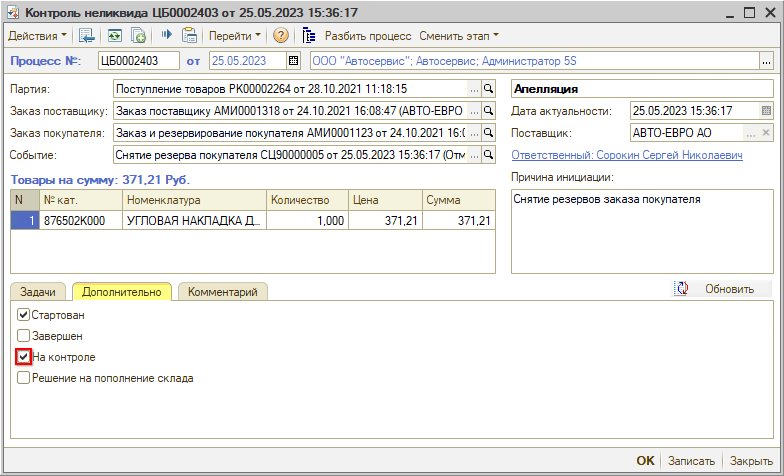

Процесс контроля неликвидов подразумевает контроль исполнения. После оформления документов для возврата поставщику либо реализации виновному лицу товар уходит с остатка. При этом сам процесс необходимо довести до конца: чтобы он не удалился вследствие отсутствия товара на складе – для этого и добавляется данный признак.

## Право “Автоматический контроль неликвидов”

Для работы бизнес-процесса Контроля неликвидов должно быть включено право *“Автоматический контроль неликвидов”*. В Правах и настройках данное право находится в группе “Контроль неликвидов”:

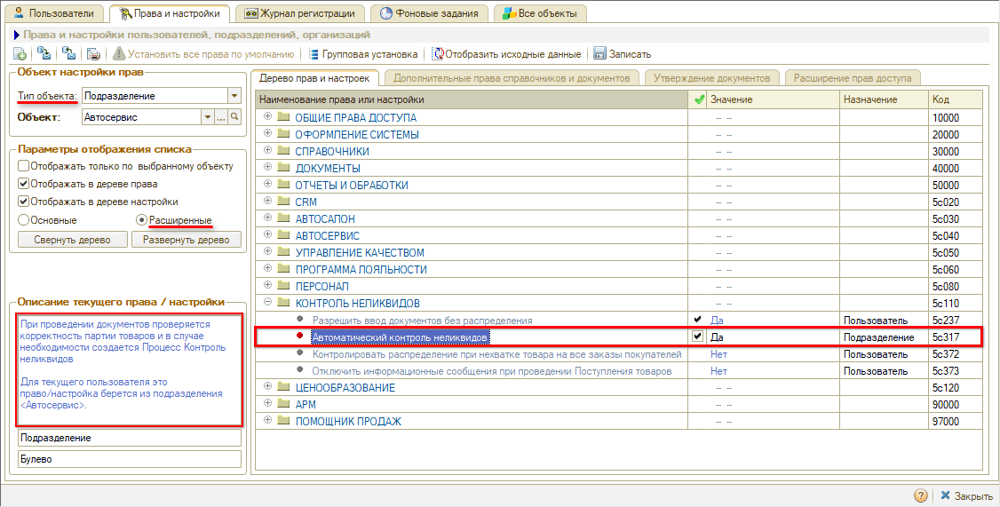

Описание права: *“При проведении документов проверяется корректность партии товаров и в случае необходимости создается процесс Контроль неликвидов”.*

Право назначается по подразделениям – можно настроить контроль только в нужных подразделениях, а не во всей компании. Для настройки права на несколько подразделений используется групповая установка права:

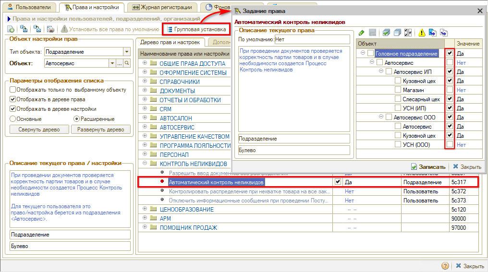

## Регламентное задание “Контроль складских остатков”

Для реализации варианта запуска контроля неликвидов по причине *превышения сроков хранения* в программе предусмотрено регламентное задание “Контроль складских остатков”. Также данное регламентное задание регулирует создание и закрытие процессов контроля неликвидов при продлении резерва.

Открыть регламентное задание можно через *Мастер настройки → Вкладка "Контроль неликвидов":*

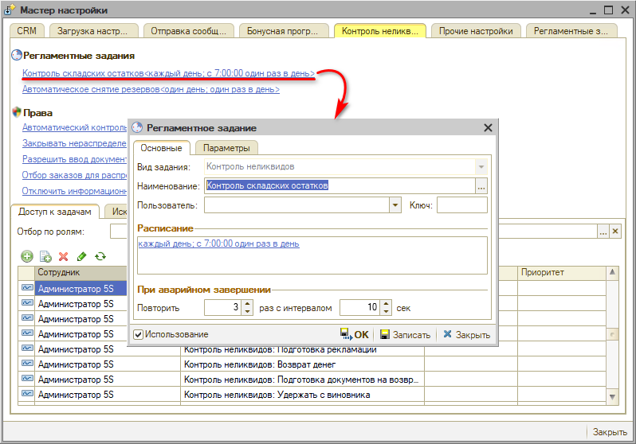

На вкладке *"Основные"* расположены основные параметры настройки, в частности, настройка расписания запуска регламентного задания.

На вкладке *“Параметры”* задаются условия, при которых будет запускаться процесс Контроля неликвидов при выявлении товара с просроченным периодом хранения.

***Параметры:***

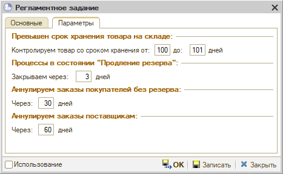

1. *Контроль сроков хранения товара на складе –* задается срок, от _ до _ дней, при отсутствии движений по товару на складе дольше указанного срока создается бизнес-процесс по контролю неликвидов. Ограничение “до” устанавливается для старта программы, чтобы не разбираться со слишком старыми неликвидами.
2. *Закрытие процессов в состоянии “Продление резерва” –* задается количество дней, через которое закрывается процесс при продлении резерва.

   При снятии резервов в состоянии “Продлить резервирование” создаются процессы контроля неликвидов для автора заказа покупателя. Можно продлить резерв снова на указанное в регламентном задании количество дней. Через данное количество дней следует перевести процесс из состояния резервирования в другое состояние – может быть 2 варианта: 1) запчасть осталась никому не нужна – переводим бизнес-процесс в состояние возврата поставщику; 2) запчасть уже продана – просто закрываем бизнес-процесс.

   Также предусмотрены 2 параметра, которые не создают бизнес-процессы, но нужны для наведения определенного порядка в регистрах заказов покупателей и заказов поставщику:

3. *Аннуляция заказов покупателей без резерва –* если был создан черновик заказа покупателя, но под него ничего не заказали и не зарезервировали в течение заданного количества дней, то он аннулируется, делается корректировка.
4. *Аннуляция заказов поставщикам –* аннулируется заказ-покупателя, если по нему не было никаких движений в течение заданного количества дней.

Также рекомендуется включить регламентное задание *“Автоматическое снятие резервов”,* которое позволяет регулировать сроки автоматического снятия резервов – неоплаченных и по которым была внесена предоплата, а также создает корректировки заказов. Описание см. в статье “[Автоматическое снятие резервов](../../Работа%20с%20заказами/Автоматическое%20снятие%20резервов/avtomaticheskoe-snyatie-rezervov.md)”.

---

**Теги:** контроль неликвидов, неликвиды, канбан, бизнес-процесс, регламентное задание, складские остатки

