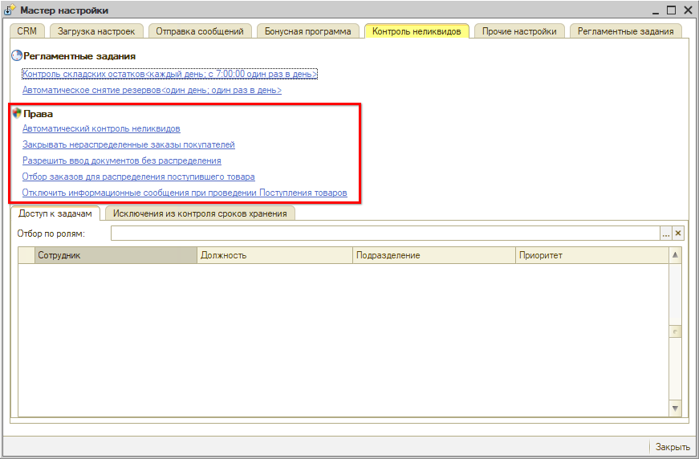
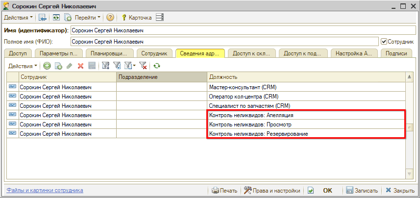
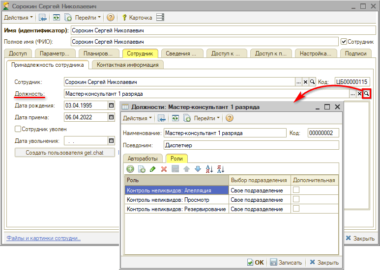
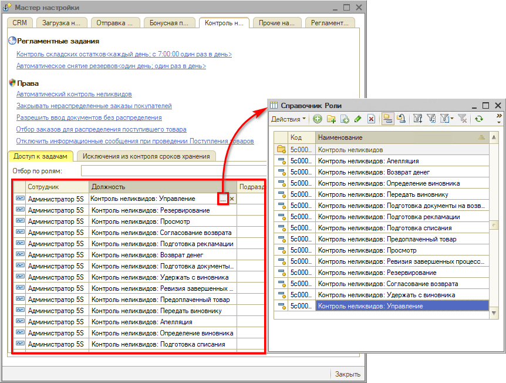
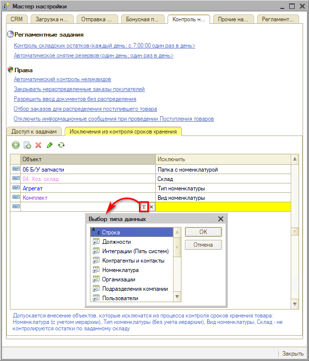
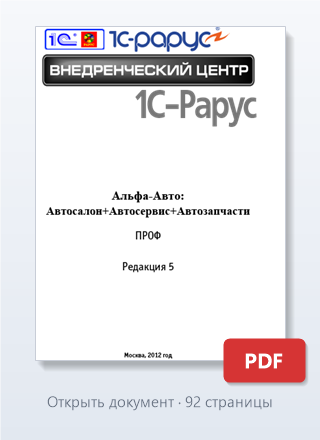

# Настройка прав доступа к Контролю неликвидов

<table><tr><td><b>Время чтения:</b> 14 мин.</td><td><b>Обновлено:</b> 14.06.2023</td></tr></table>

Источник: https://www.5systems.ru/help/nastroyka-prav-dostupa-k-kontrolyu-nelikvidov

## Содержание

1. [Введение](#введение)
2. [Права](#права)
3. [Доступ к задачам](#доступ-к-задачам)
   - [Список ролей](#список-ролей)
4. [Исключения из контроля сроков хранения](#исключения-из-контроля-сроков-хранения)

## Введение

Описание работы с процессом Контроля неликвидов см. в статьях “[Выявление неликвидов](../Выявление%20неликвидов/vyyavlenie-nelikvidov.md)” и “[Принятие решения по неликвидам](../Принятие%20решения%20по%20неликвидам/prinyatie-resheniya-po-nelikvidam.md)”. О настройке этапов процесса и задач по Контролю неликвидов см. статью “[Настройки процесса Контроля неликвидов](../Настройки%20процесса%20Контроля%20неликвидов/nastroyki-processa-kontrolya-nelikvidov.md)”.

Настройки прав доступа для работы с Контролем неликвидов собраны в *Мастере настройки* на вкладке *“Контроль неликвидов”:*

## Права

***Список прав для управления функционалом Контроля неликвидов:***

1. *“Автоматический контроль неликвидов*” – главное право, которое запускает всю систему Контроля неликвидов. Описание см. в статье *[Выявление неликвидов → Право “Автоматический контроль неликвидов”](../Выявление%20неликвидов/vyyavlenie-nelikvidov.md#право-автоматический-контроль-неликвидов).*
2. *“Закрывать нераспределенные заказы покупателей”:*

   Если отключено: при проведении Поступления товаров не будет резервироваться товар под заказы покупателей. Фиксируется только поступление товара на склад. 
   Если включено: при проведении Поступления товар будет резервироваться под Заказы покупателей, даже если на их основании не был создан Заказ поставщику. 
   Подробнее см. статью [Распределение поступлений по заказам](../../Работа%20с%20заказами/Распределение%20поступлений%20по%20заказам/raspredelenie-postupleniy-po-zakazam.md) → [Закрывать нераспределенные Заказы покупателей](../../Работа%20с%20заказами/Распределение%20поступлений%20по%20заказам/raspredelenie-postupleniy-po-zakazam.md#4-закрывать-нераспределенные-заказы-покупателей).

   При проведении Поступления товаров можно указать, для чего конкретно этот товар приобретен. Если есть заказы покупателей на этот товар, то они автоматом будут зарезервированы под него. Если затем снять резерв, который был назначен в поступлении товара, будет запускаться процесс Контроля неликвидов.

3. *“Разрешить ввод документов без распределения”:*

   Если поступивший товар не распределен, то рядовым пользователям не разрешается проводить документы по нему. Подробнее см. статью: [Распределение поступлений по заказам](../../Работа%20с%20заказами/Распределение%20поступлений%20по%20заказам/raspredelenie-postupleniy-po-zakazam.md) → [Разрешить ввод документов без распределения](../../Работа%20с%20заказами/Распределение%20поступлений%20по%20заказам/raspredelenie-postupleniy-po-zakazam.md#1-разрешить-ввод-документов-без-распределения).

   Можно обязать распределять весь приходуемый товар: под конкретного покупателя, либо внутренний заказ для пополнения склада, и т.д. Для автосервисов так будет правильнее, для магазинов такой запрет, скорее, неактуален. 
   Если разрешить проведение без распределения, то контроль неликвидов будет запускаться только по превышению сроков.

   Вне зависимости от данного права разрешается проводить без распределения по заказам товары, на которые заведен минимальный остаток – т.е. товары на пополнение склада, которые всегда должны быть в наличии. Бизнес-процессы по контролю неликвидов в этом случае не создаются.

4. *“Отбор заказов для распределения поступившего товара”:* право контролирует соответствие подразделения и организации в заказах, по которым распределяется поступивший товар при работе с формой “Распределение номенклатуры”. Подробнее см. в статье [Распределение поступлений по заказам](../../Работа%20с%20заказами/Распределение%20поступлений%20по%20заказам/raspredelenie-postupleniy-po-zakazam.md) → [Отбор заказов для распределения поступившего товара](../../Работа%20с%20заказами/Распределение%20поступлений%20по%20заказам/raspredelenie-postupleniy-po-zakazam.md#5-отбор-заказов-для-распределения-поступившего-товара).

   Если у организации несколько филиалов, и включен контроль, то пользователь сможет распределять товар на документы только своего филиала. Варианты распределения: только на заказы того подразделения, которое указано в документе, либо организации, либо все. Если контроль отсутствует – распределение производится на все заказы.

5. *“Отключить информационные сообщения при проведении Поступления товаров”:* если приходовать все поступающие товары без распределения (см. описание предыдущего права выше), то уведомления не нужны: данное право позволяет их отключить. Подробнее см. в [Распределение поступлений по заказам](../../Работа%20с%20заказами/Распределение%20поступлений%20по%20заказам/raspredelenie-postupleniy-po-zakazam.md) → [Отключить информационные сообщения при проведении поступления товаров](../../Работа%20с%20заказами/Распределение%20поступлений%20по%20заказам/raspredelenie-postupleniy-po-zakazam.md#3-отключить-информационные-сообщения-при-проведении-поступления-товаров).

## Доступ к задачам

Для работы с задачами по процессу Контроля неликвидов необходимо назначить отдельных сотрудников – в крупных компаниях за каждый этап процесса отвечают разные сотрудники: специалист по запчастям, бухгалтер, юрист и т.д. Если не настроить сотрудникам доступ, то они не смогут даже открыть форму бизнес-процесса.

Доступ к задачам процесса Контроля неликвидов определяется назначением ролей пользователям через [*Регистр сведений адресации*](../../Задачи/Адресация%20задач%20в%20CRM%20по%20исполнителям/adresaciya-zadach-v-crm-po-ispolnitelyam.md) (подробнее о назначении ролей см. в [статье](../../Пользователи%20и%20права/Пользователи/polzovateli.md#регистр-сведения-адресации)).

Настройка доступа может быть произведена следующими способами:

1. Через назначение всех необходимых *ролей* каждому сотруднику в карточке пользователя – значения выбираются из справочника "Роли":

   

2. Через назначение сотруднику *должности,* в которой предварительно были заполнены роли – значение выбирается из справочника "Должности":

   

3. Через *Мастер настройки* – на вкладке *“Доступ к задачам”* в настройке Контроля неликвидов можно привязать конкретные роли для каждого работающего с неликвидами сотрудника:

   

### Список ролей

| **Роль** | **Описание** |
| --- | --- |
| **Апелляция** | Позволяет сотруднику создать апелляцию на решение руководства взыскать ущерб с него за приобретение неликвида. |
| **Возврат денег** | Назначается, как правило, сотруднику бухгалтерии, ответственному за контроль взаиморасчетов с поставщиками. |
| **Определение виновника** | Назначается, как правило, руководителю подразделения, осуществляющему разбор инцидента с приобретением неликвида, и принимающему решение по данному расследованию. |
| **Передать виновнику** | Назначается сотруднику, оформляющему документы на передачу неликвида виновному сотруднику. |
| **Подготовка документов на возврат** | Назначается сотруднику, осуществляющему возврат неликвида поставщику. |
| **Подготовка рекламации** | Назначается сотруднику, подготавливающему документы по претензии к поставщику по факту поставки некачественной детали. |
| **Подготовка списания** | Назначается сотруднику, подготавливающему документы на списание детали. |
| **Предоплаченный товар** | Назначается сотруднику, ответственному за работу с клиентами по продаже уже оплаченного товара. |
| **Просмотр** | Позволяет просматривать все процессы по Контролю неликвидов без возможности их изменения. Роль может быть использована совместно с другими ролями по этапам процесса. |
| **Ревизия завершенных процессов** | Позволяет работать с завершенными процессами по Контролю неликвидов. |
| **Резервирование** | Назначается сотруднику, ответственному за заказ товаров для клиентов. |
| **Согласование возврата** | Назначается сотруднику, ответственному за работу с Поставщиками. На данном этапе выясняется возможность возврата неликвида поставщику. |
| **Удержать с виновника** | Назначается, как правило, работнику бухгалтерии, который удерживает сумму за неликвид из зарплаты сотрудника, или принимает от него денежные средства. |
| **Управление** | Назначается сотруднику, осуществляющему общий контроль за работой процессов “Контроль неликвидов”. Роль позволяет изменять этапы процессов, назначать исполнителями по процессу других сотрудников. |

Специальные роли предусмотрены для каждого этапа, кроме завершающих. Т.е. каждому активному этапу, который в работе, соответствует своя роль.

Исключение составляют роли:

- *“Просмотр” –* данная роль разрешает просмотреть любой этап: форму бизнес-процесса, задачу, но не позволяет ничего сделать.
- *“Управление” –* роль назначается супервизору, или администратору, который может делать все по процессу контроля неликвидов: просматривать, выполнять задачи, переназначать их другим пользователям, выполнять все действия за пользователей со всеми остальными ролями.
- *“Ревизия завершенных процессов” –* пользователь с данной ролью может смотреть только завершенные процессы по Контролю неликвидов.

Если пользователю назначена одна роль (кроме “Просмотра” и “Управления”), то он сможет работать с бизнес-процессом только в ее рамках. Либо если супервизор назначит его ответственным в конкретной задаче.

## Исключения из контроля сроков хранения

Есть возможность исключить из контроля отдельные подразделения – для этого необходимо в настройках права “Автоматический контроль неликвидов” по подразделениям отключить его для конкретного подразделения (см. статью [Выявление неликвидов → Право “Автоматический контроль неликвидов”](../Выявление%20неликвидов/vyyavlenie-nelikvidov.md#право-автоматический-контроль-неликвидов)).

По умолчанию из контроля сроков хранения исключается ряд видов номенклатуры: активы, основные средства (станки, инструменты), автомобили, услуги.

Дополнительно можно в настройках добавлять своё – склады, папки с видами и типами номенклатуры и т.д., которые не будут контролироваться на предмет сроков хранения:

Для добавления следует выбрать тип данных – становится доступным выбор объекта, затем выбрать объект и нажать “Enter”. В колонке “Исключить” автоматически заполняется значение типа данных.

## Аудио по теме

**Трек «Corporate Inspiration before Christmas» (для тестирования):**

## Документ по теме

**Руководство «Альфа-Авто: Автосалон + Автосервис + Автозапчасти ПРОФ», редакция 5 (для тестирования):**

---

**Теги:** контроль неликвидов, неликвиды, права доступа, роли, задачи, сроки хранения
