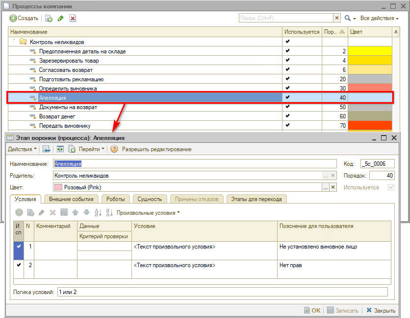
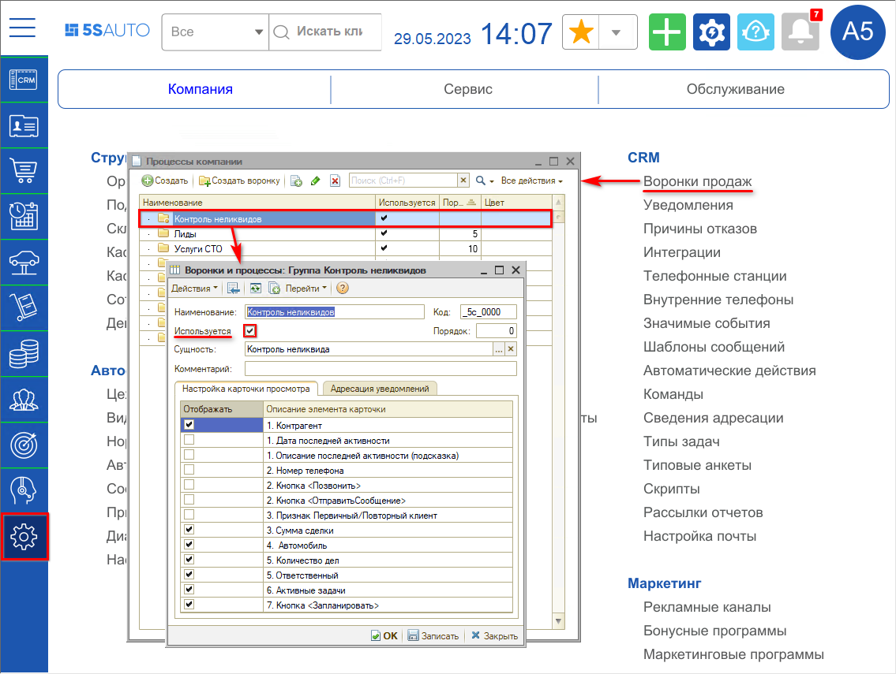
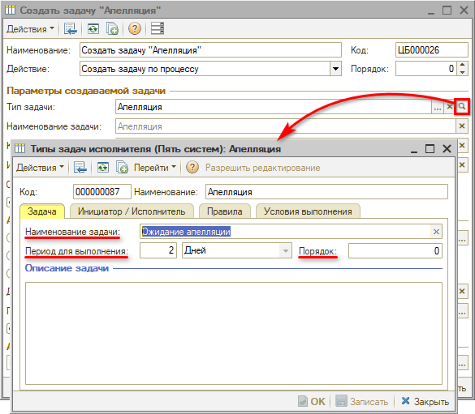

# Настройки процесса Контроля неликвидов

<table><tr><td><b>Время чтения:</b> 13 мин.</td><td><b>Обновлено:</b> 14.06.2023</td></tr></table>

Источник: https://www.5systems.ru/help/nastroyki-processa-kontrolya-nelikvidov

## Содержание

1. [Введение](#введение)
2. [Настройка этапов](#настройка-этапов)
3. [Включение канбана процесса](#включение-канбана-процесса)
4. [Настройка задач процесса Контроля неликвидов](#настройка-задач-процесса-контроля-неликвидов)

## Введение

Этапы процесса Контроля неликвидов являются предустановленными, с преднастроенной типовой логикой, но при необходимости их можно изменить под бизнес-процессы своего предприятия.

Описание работы с процессом Контроля неликвидов см. в статьях “[Выявление неликвидов](../Выявление%20неликвидов/vyyavlenie-nelikvidov.md)” и “[Принятие решения по неликвидам](../Принятие%20решения%20по%20неликвидам/prinyatie-resheniya-po-nelikvidam.md)”. Также см. статью “[Настройка прав доступа к Контролю неликвидов](../Настройка%20прав%20доступа%20к%20Контролю%20неликвидов/nastroyka-prav-dostupa-k-kontrolyu-nelikvidov.md)”.

## Настройка этапов

Воронка процесса настраивается [стандартным способом](../../CRM/Настройки%20воронки%20продаж/nastroyki-voronki-prodazh.md#настройки-этапов-воронки) через карточки этапов:

Настройки определяются списком условий, внешних событий, роботов, этапов для перехода.

Канбан открывается по умолчанию с настройками для текущего пользователя – пользователь видит только свои процессы с учетом заданных для него прав доступа (см. статью “[Настройка прав доступа к Контролю неликвидов → Доступ к задачам](../Настройка%20прав%20доступа%20к%20Контролю%20неликвидов/nastroyka-prav-dostupa-k-kontrolyu-nelikvidov.md#доступ-к-задачам)”).

Процессы, которые стали неактуальны – т.е. по которым продлили резерв или реализовали деталь – завершаются автоматически. Также есть возможность закрыть процесс вручную.

Пустые этапы автоматически скрываются. Таким образом, канбан содержит только актуальную информацию – у рядового пользователя, как правило, должны отображаться 1-2 столбца в канбане.

## Включение канбана процесса

Для включения процесса Контроля неликвидов в карточке настройки процесса должна стоять галочка “Используется”:

Здесь же настраиваются поля [карточки просмотра](../Выявление%20неликвидов/vyyavlenie-nelikvidov.md#карточка-просмотра) бизнес-процесса на канбане.

## Настройка задач процесса Контроля неликвидов

На каждом этапе бизнес-процесса Контроля неликвидов создаются задачи с отдельной логикой. Для работы функционала реализованы специальные типы задач. Для этих типов задач в системе созданы специальные формы задач: см. статью “[Принятие решения по неликвидам → Примеры работы с процессом](../Принятие%20решения%20по%20неликвидам/prinyatie-resheniya-po-nelikvidam.md#примеры-работы-с-процессом)”.

Создание задач осуществляется специальным ***Роботом создания задач***, на него создается новое действие. Для этого добавлен новый *тип действия* робота на значимое событие “Создать задачу по бизнес-процессу”.

Настройки процесса задаются установкой параметров в настройках этапов канбана. Пример настройки робота создания задачи “Апелляция”:

Настройки типового действия создания задачи:

1. **Поле “Параметры создаваемой задачи”**

   Значения параметров в данное поле подтягиваются из настроек ***типа задачи*** *(см. статью [Типы задач](../../CRM/Типы%20задач/tipy-zadach.md)):*

   

   *Примечание:* На вкладке “Правила” предусмотрена настройка управления формой – разрешение откладывать и переадресовывать задачу. Для задач процессе Контроля неликвидов данные параметры *не используются.*

2. **Поле “Адресация задачи”**

   

   Варианты назначения *исполнителя:*

   - 1\) Выбор определенного исполнителя, в частности, в приведенном примере при создании задач “Апелляция” исполнителем необходимо назначать виновное лицо.
   - 2\) *Исполнитель не указывается* – в данном случае создаваемые задачи данного типа будут видны всем пользователям.
   - 3\) *Исполнитель определяется по должности и подразделению* – в задаче будет указываться исполнитель по должности из настроек типа задачи и по подразделению из процесса.

   Галочка *“Ответственным за процесс назначить исполнителя задачи”* – для смены исполнителя при переходе процесса на определенный этап.

   В отличие от воронки лидов и сделок, где адресация осуществляется, как правило, на менеджера, в бизнес-процессе контроля неликвидов при смене этапов предусмотрена адресация на других исполнителей и другие должности, например, на бухгалтера, на юриста и т.д.

3. **Алгоритм создания задачи**

   Можно вручную написать свой произвольный код для расчета алгоритма создания задачи.

---

**Теги:** контроль неликвидов, неликвиды, этапы, канбан, задачи процесса, настройка
