# Принятие решения по неликвидам

<table><tr><td><b>Время чтения:</b> 20 мин.</td><td><b>Обновлено:</b> 14.06.2023</td></tr></table>

Источник: https://www.5systems.ru/help/prinyatie-resheniya-po-nelikvidam

## Содержание

1. [Введение](#введение)
2. [Этапы процесса Контроля неликвидов](#этапы-процесса-контроля-неликвидов)
3. [Примеры работы с процессом](#примеры-работы-с-процессом)
   - [Пример № 1. Продление резерва по заказу без предоплаты](#пример--1-продление-резерва-по-заказу-без-предоплаты)
   - [Пример № 2. Продление резерва по заказу с предоплатой](#пример--2-продление-резерва-по-заказу-с-предоплатой)
   - [Пример № 3. Возврат поставщику](#пример--3-возврат-поставщику)
   - [Пример № 4. Вручение виновному лицу](#пример--4-вручение-виновному-лицу)

## Введение

Процесс контроля неликвидов представляет собой выявление на складе товара, который затруднительно или невозможно реализовать. Программа определяет потенциально неликвидные товары, например, по превышению срока хранения, либо если был снят резерв товара по заказу – см. статью “[Выявление неликвидов](../Выявление%20неликвидов/vyyavlenie-nelikvidov.md)”.

При обнаружении такого товара в системе запускается бизнес-процесс Контроля неликвидов. Для работы с данным функционалом в программе реализован специальный канбан процессов:

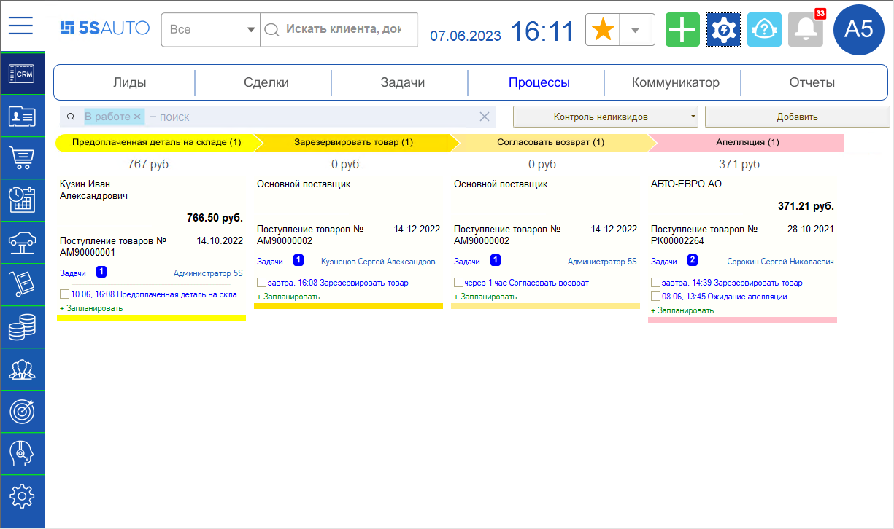

Подробнее см. статью “[Выявление неликвидов → Канбан процесса Контроля неликвидов](../Выявление%20неликвидов/vyyavlenie-nelikvidov.md#канбан-процесса-контроля-неликвидов)”.

## Этапы процесса Контроля неликвидов

Процесс контроля неликвидов состоит из следующих 18 этапов:

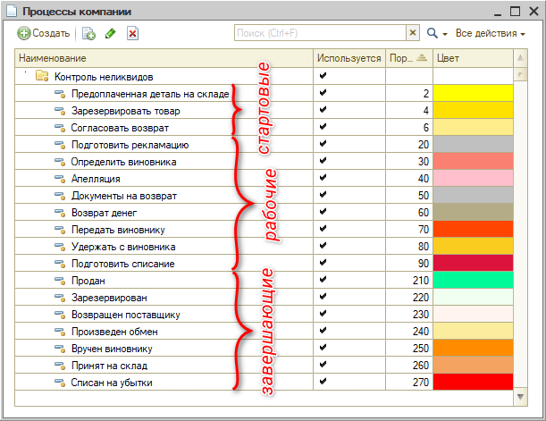

Если включено право автоматического контроля неликвидов, при проведении документов будут создаваться бизнес-процессы и попадать на три различных стартовых этапа.

***Стартовые этапы:***

1. *“Предоплаченная деталь на складе”* – в случае, когда деталь куплена под клиента, но лежит на складе больше определенного количества дней, несмотря на то, что предоплачена.
2. *“Зарезервировать товар”* – на данный этап попадает товар при снятии резервов.
3. *“Согласовать возврат”* – на данный этап попадает все остальное: если деталь извлекаем из производства и т.д.

***Текущие рабочие этапы по работе с неликвидом:***

4. *Подготовить рекламацию*
5. *Определить виновника*
6. *Апелляция*
7. *Документы на возврат*
8. *Возврат денег*
9. *Передать виновнику*
10. *Удержать с виновника*
11. *Подготовить списание*

***Завершающие этапы:***

12. *Продан*
13. *Зарезервирован*
14. *Возвращен поставщику*
15. *Произведен обмен*
16. *Вручен виновнику*
17. *Принят на склад*
18. *Списан на убытки*

В рамках процесса пользователь указывает решение и контролирует его исполнение. Если принято решение о возврате поставщику: решается вопрос, нормальная деталь или брак – тогда подается рекламация, отправка документов, возврат оплаты. Если принято решение о вручении виновному лицу – отражение в зарплате и т.д.

Любой из бизнес-процессов может быть завершен автоматически, если оказывается, что товара нет на складе – например, его уже продали. Исключение составляют несколько случаев, когда товар передали поставщику: его уже нет на складе, но деньги еще не получены. В частности, если бизнес процесс находится на стадиях “Возврат денег” или “Удержание с виновника” – эти бизнес-процессы не закрываются автоматически при отсутствии товара на складе.

## Примеры работы с процессом

Для работы с процессом Контроля неликвидов предусмотрено создание задач специальных типов. Для этих типов задач в системе созданы специальные формы задач. Задачу можно открыть из [формы бизнес-процесса](../Выявление%20неликвидов/vyyavlenie-nelikvidov.md#форма-бизнес-процесса), а также из [карточки на канбане](../Выявление%20неликвидов/vyyavlenie-nelikvidov.md#карточка-просмотра).

### Пример № 1. Продление резерва по заказу без предоплаты

#### Задача “Зарезервировать товар”

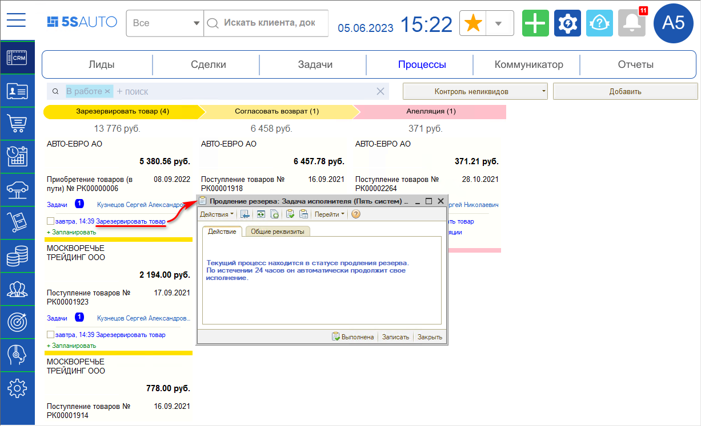

Для исполнения задачи “Зарезервировать товар” следует открыть форму бизнес-процесса, перейти в Заказ покупателя и зарезервировать повторно этот товар – тогда бизнес-процесс автоматически завершится.

### Пример № 2. Продление резерва по заказу с предоплатой

Бизнес-процесс запускается, если превышен срок хранения детали на складе, по которой была внесена предоплата.

#### Задача “Продление резерва”

При открытии задачи из карточки канбана отображается карточка задачи со следующим пояснением:

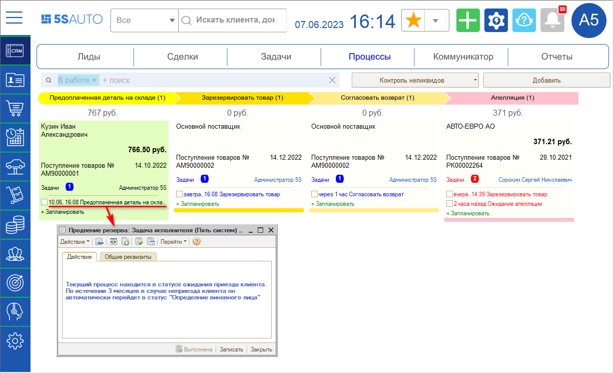

Форма бизнес-процесса выглядит следующим образом:

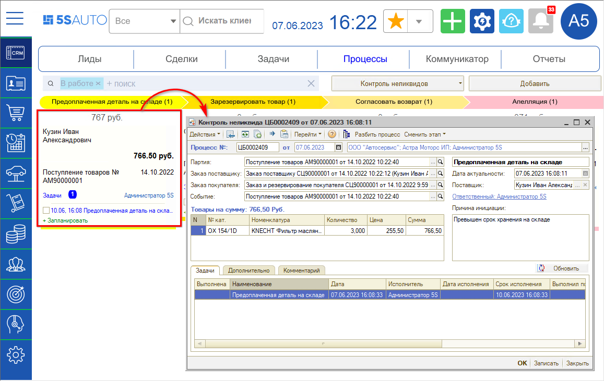

Для исполнения задачи следует открыть заказ покупателя и создать на его основании новый документ “Резервирование заказа покупателя”:

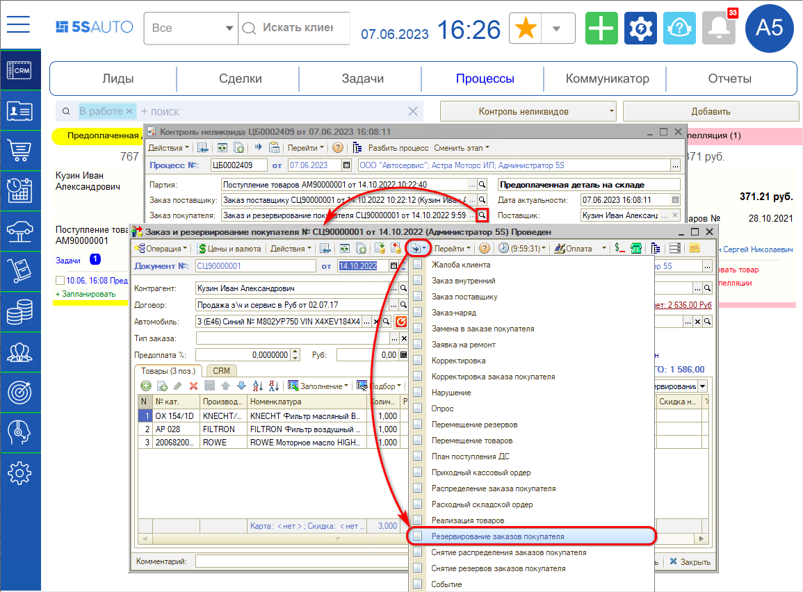

### Пример № 3. Возврат поставщику

#### Задача “Согласовать возврат”

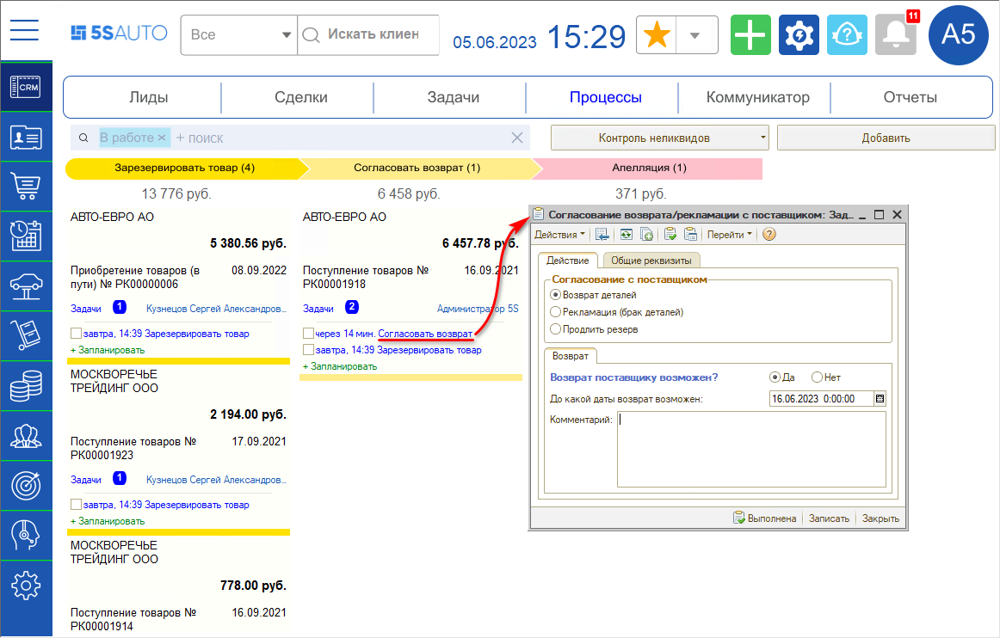

***Варианты согласования с поставщиком:***

1. ***Возврат деталей*** – данный вариант используется, если деталь исправная, и есть возможность вернуть ее поставщику. При выборе данного варианта бизнес-процесс перейдет на этап по подготовке документов на возврат – “Документы на возврат”, создается [задача “Документы на возврат”](#задача-документы-на-возврат).

2. ***Рекламация*** – вариант для бракованных деталей: рассматривается возможность возврата поставщику неисправной запчасти.

   *Рекламация* – это претензия, предъявляемая поставщику по поводу ненадлежащего качества или количества поставляемого товара, обнаруженного в период действия гарантийных обязательств, требование об устранении недостатков, снижении цены, возмещении убытков. 
   Процесс в данном случае ведет, как правило, юрист или другой сотрудник, который может грамотно оформить претензию поставщику в письменном виде. 
   Если деталь заменили – бизнес-процесс переходит на этап “Произведен обмен”. Создаются новые документы, либо просто заменяется деталь. 
   Если брак не удалось вернуть, процесс переходит на этап “Подготовить списание” – деталь просто списывается на убытки. Необходимо подготовить документы на списание. В данном случае процесс завершается этапом “Списан на убытки”.

3. ***Продлить резерв*** – вариант выбирается в случае принятия решения не возвращать деталь поставщику, а оставить на пополнение своего склада.

При переключении между данными вариантами изменяется нижняя часть формы задачи "Согласовать возврат".

При выборе варианта возврата деталей поставщику создается задача “Документы на возврат”.

#### Задача “Документы на возврат”

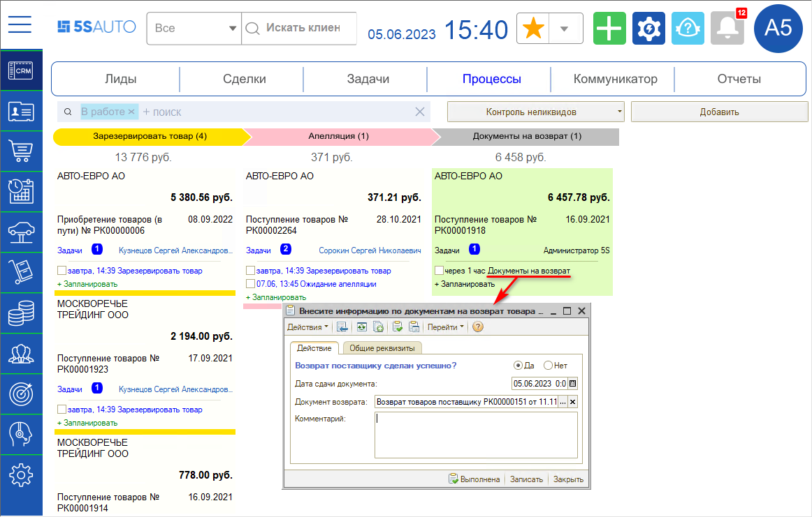

В форме задачи следует сделать отметку, удалось ли вернуть деталь, ввести даты сдачи документа, выбрать документ возврата, при необходимости написать комментарий и нажать кнопку “Выполнена”.

Процесс переходит на этап “Возврат денег” – поставщик может вернуть деньги, либо зачесть их за другой товар.

#### Задача “Возврат денег”

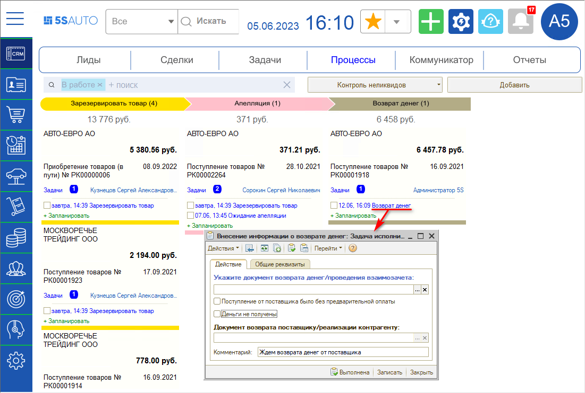

Возврат денег отслеживает, как правило, бухгалтер. При необходимости создается акт сверки взаиморасчетов с поставщиком.

Если сделать возврат поставщику невозможно, процесс переходит на этап *определения виновного лица* (см. [далее](#пример--4-вручение-виновному-лицу)).

### Пример № 4. Вручение виновному лицу

Если сделать возврат поставщику невозможно, процесс переходит на этап *определения виновного лица.*

#### Задача “Определение виновных лиц”

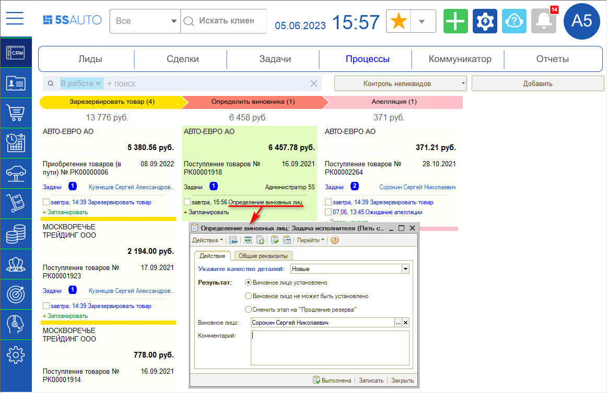

Необходимо указать качество детали – новая, б/у или брак, результат – возможно ли установить виновное лицо, если да – выбрать виновное лицо.

Также можно выбрать результат *“Сменить этап на “Продление резерва””* – если найдено применение детали, но она еще не реализована. При продлении резерва потом будет создан новый бизнес-процесс.

В случае установления виновного лица при выполнении задачи создается апелляция – процесс переходит на сотрудника, указанного виновным.

#### Задача “Ожидание апелляции”

Сотрудник, которого указали виновным лицом, имеет возможность подать апелляцию. Для этого ему необходимо исполнить задачу:

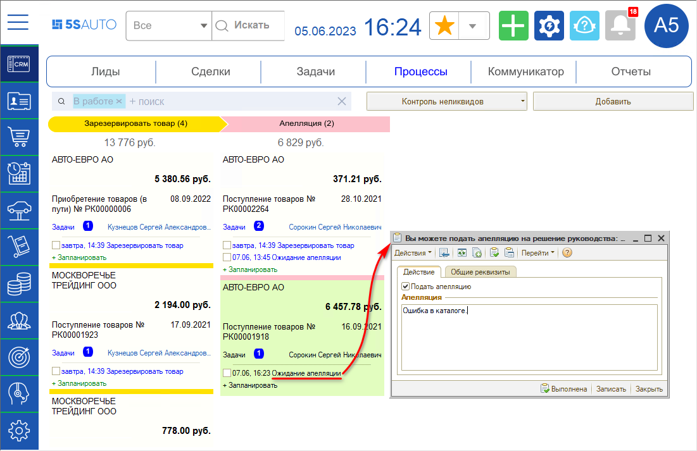

Если сотрудник подал апелляцию, то бизнес-процесс возвращается на этап определения виновного лица.

#### Задача “Определение виновных лиц - Апелляция”

При подаче апелляции сотрудником в карточке задачи "Определение виновных лиц" появляется вкладка “Апелляция”:

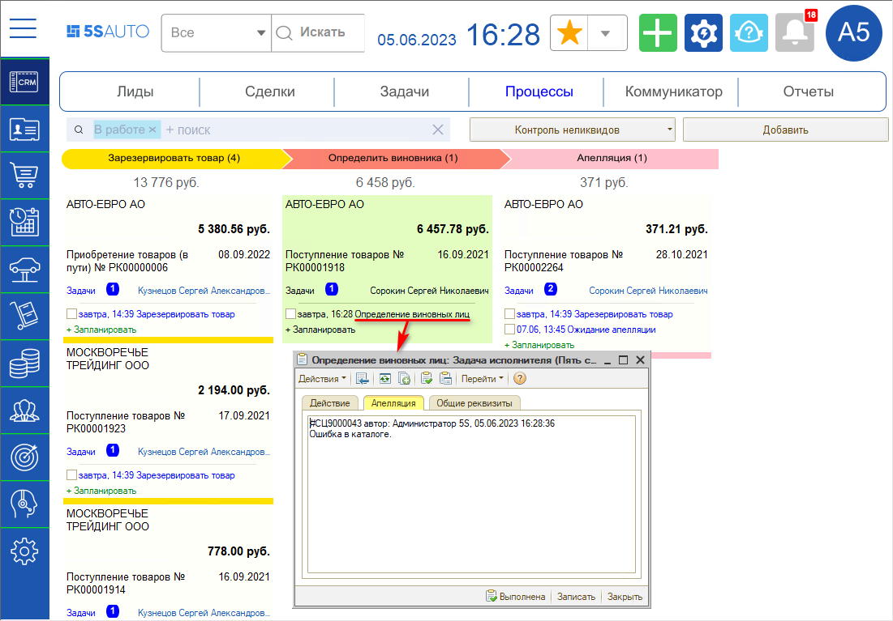

Сотрудник может ещё раз подать апелляцию. Если после этого снова указать его виновным лицом и выполнить задачу, то бизнес-процесс переходит на этап “Передать виновнику” и создается задача “Вручение виновному лицу”.

Следует указать документ реализации виновному лицу и выполнить задачу – происходит переход на этап “Удержать с виновника”.

#### Задача “Внесение информации об оплате виновным лицом”

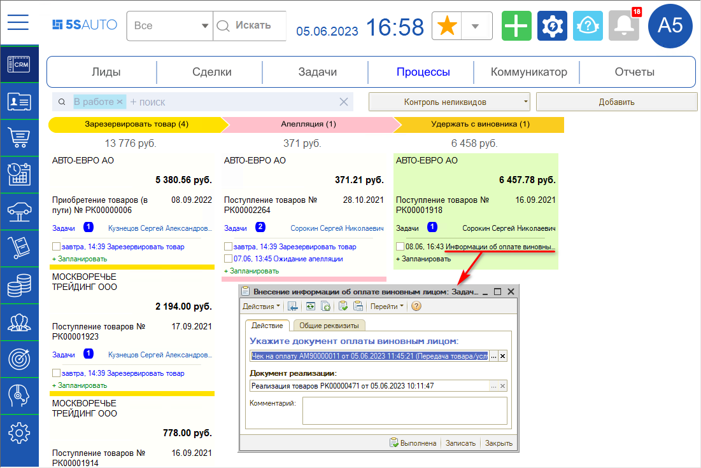

Выполнение задачи осуществляется бухгалтером через кассу: принятие оплаты за деталь от сотрудника либо списание с зарплаты.

После выполнения задачи процесс переходит на завершающий этап “Вручен виновному лицу” и пропадает с рабочего канбана – переносится в “Закрытые”.

Если сотрудник не подает апелляцию, то в течение заданного срока бизнес-процесс сразу переходит на этап вручения виновному лицу.

---

**Теги:** контроль неликвидов, неликвиды, этапы процесса, резерв, возврат поставщику, задачи
