# Инвентаризация кодов маркировки

<table><tr><td><b>Время чтения:</b> 13 мин.</td><td><b>Обновлено:</b> 21.05.2026</td></tr></table>

Источник: https://www.5systems.ru/help/inventarizaciya-kodov-markirovki

> *Актуально начиная с версии релиза 5S AUTO **2.8.3.50**.*

## Содержание

1. [Введение](#введение)
2. [Работа с документом](#работа-с-документом)
   - [1. Создание](#1-создание)
   - [2. Заполнение](#2-заполнение)
   - [3. Отбор по расхождениям](#3-отбор-по-расхождениям)
   - [4. Отбор по номенклатуре (коду GTIN)](#4-отбор-по-номенклатуре-коду-gtin)
   - [5. История состояний](#5-история-состояний)
   - [6. Корректировка расхождений](#6-корректировка-расхождений)

## Введение

При работе с [маркированными товарами](../Маркировка%20товаров/markirovka-tovarov.md) возникает задача *сверки данных* внутреннего учета программы 5S AUTO с данными ГИС МТ «Честный знак». В идеале они должны совпадать, но на практике возникают расхождения.

Несоответствия данных могут появляться по разным причинам:

- отсутствие проверки кодов маркировки при приемке и отгрузке товаров;
- несвоевременное утверждение документов в ЭДО другим участником оборота (при передаче маркированных товаров);
- продажа товаров через кассу без отражения выбытия кода маркировки (без передачи сведений в ГИС МТ);
- некорректное считывание сканером кода маркировки и др.

Расхождения в данных могут привести к ошибкам при проверке кодов маркировки на кассе, накоплению на балансе компании кодов по уже проданным товарам, а также нарушениям законодательства и штрафам. Чтобы избежать этих рисков, сверку данных между внутренней системой учета и ГИС МТ важно проводить регулярно.

Для этих целей в программе служит документ ***“Инвентаризация кодов маркировки”**:*

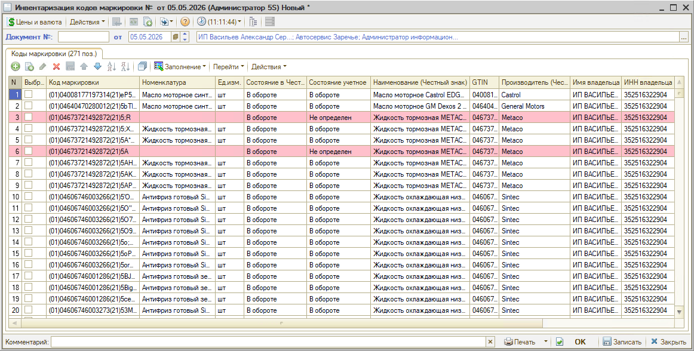

*Документ “Инвентаризация кодов маркировки” позволяет:*

- получить актуальный список всех кодов маркировки, числящихся в обороте за компанией;
- проверить, все ли коды числятся в «Честном знаке» за вашей организацией в корректном статусе;
- выявить расхождения между ГИС МТ и внутренней учетной базой 5S AUTO и создать корректирующие документы.

В результате инвентаризации кодов маркировки учет в программе и в ГИС МТ приводится к единообразию, компания получает точные данные, какие коды маркировки числятся за ней в «Честном знаке», и может списать коды, если они есть в системе, но физически эти товары отсутствуют.

Сверку данных рекомендуется проводить в следующих случаях:

- при первом внедрении маркировки в компании – для исключения ошибок в начале работы;
- после крупных поставок – для проверки корректности приемки;
- при получении уведомлений о расхождениях в ЛК «Честного знака» – для выявления причин и корректировки данных;
- перед проведением акций и распродаж – чтобы убедиться, что весь товар готов к продаже;
- перед введением обязательной маркировки по истечении переходного периода – чтобы заранее навести порядок;
- регулярно (например, раз в месяц или в квартал) – для поддержания актуальности данных на складах.

*Примечание:* Документ “Инвентаризация кодов маркировки” не отменяет необходимости проведения обычной плановой *инвентаризации товаров* (см. статью “[Инвентаризация](../../Склад%20и%20запчасти/Инвентаризация/inventarizaciya.md)”), которая решает задачу сверки учетного количества маркированных товаров в программе с фактическими остатками на складе или в магазине.

*Также рекомендуются для изучения статьи в разделе “[Маркировка](../)”:*

- [Маркировка товаров](../Маркировка%20товаров/markirovka-tovarov.md);
- [Операции с кодами маркировки](../Операции%20с%20кодами%20маркировки/operacii-s-kodami-markirovki.md);
- [Вывод кодов маркировки из оборота](../Вывод%20кодов%20маркировки%20из%20оборота/vyvod-kodov-markirovki-iz-oborota.md) и другие.

## Работа с документом

### 1. Создание

Реестр документов “Инвентаризация кодов маркировки” находится в меню интерфейса программы в разделе *“Запчасти и склад → Снабжение → Маркировка товаров”:*

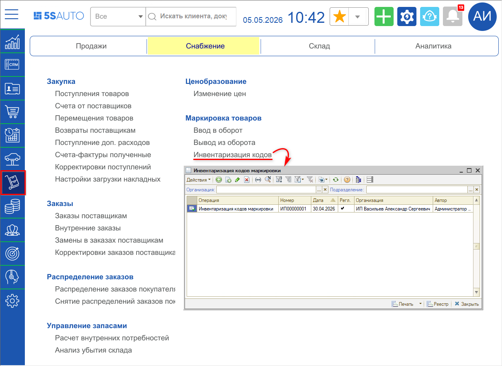

Для создания документа следует нажать кнопку *“Создать”:*

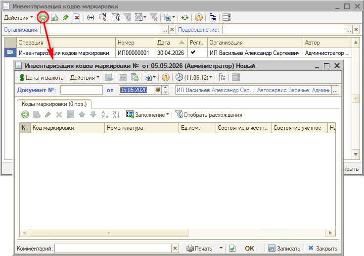

### 2. Заполнение

Для загрузки данных в таблицу документа следует нажать кнопку *“Заполнение → Загрузить коды маркировки”.* В открывшемся окне “Загрузка кодов маркировки в обороте” следует нажать кнопку *“Загрузить”:*

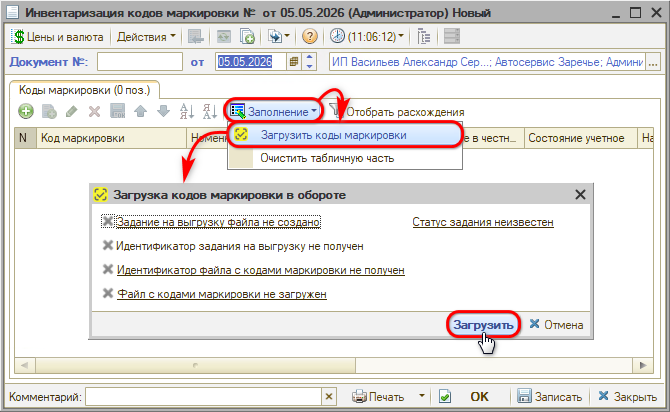

Обработка позволяет загрузить актуальные данные по кодам маркировки из Личного кабинета “Честного знака” и из внутренней базы. Загружается информация только по кодам маркировки, которые имеют статус *“В обороте”* (в любой из систем учета).

Происходит формирование файла для выгрузки. Время ожидания может быть разным в зависимости от объема данных – от нескольких секунд до минут:

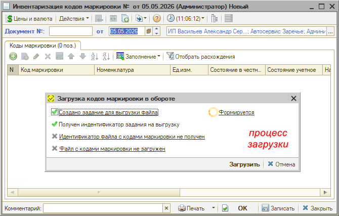

После завершения загрузки напротив каждого пункта появляются “зеленые галочки”, выводится уведомление об успешной загрузке данных, а также служебное сообщение о загрузке файла и список всех загруженных в таблицу документа кодов маркировки:

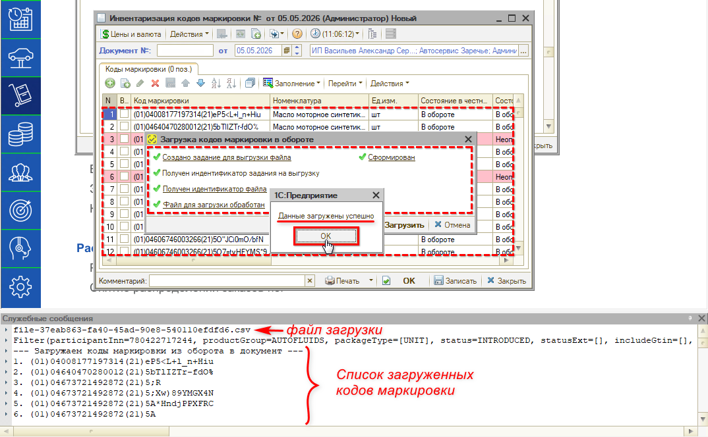

В таблицу загружаются данные о кодах маркировки из ЛК “Честного знака”:

- Код маркировки и GTIN;
- Состояние в Честном знаке;
- Наименование;
- Производитель;
- Имя и ИНН владельца.

Также производится поиск этих кодов маркировки во внутренней базе и подгружаются следующие данные:

- Номенклатура;
- Единицы измерения;
- Учетное состояние.

Кроме того, в таблицу добавляется информация из базы по кодам маркировки, которые во внутреннем учете числятся “В обороте”. Если эти коды маркировки в “Честном знаке” имеют другой статус, то информация по ним из Личного кабинета не загрузится, а в колонке “Состояние в Честном знаке” будет значение “Не определен”:

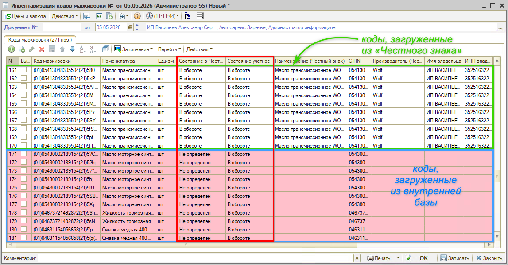

*Примечание:* Документ “Инвентаризация кодов маркировки” не создает движений, он служит только для сравнения данных по наличию кодов и выявления расхождений.

***Цветовая индикация:***

В случае если *состояния* кодов маркировки в “Честном знаке” и во внутренней учетной системе *совпадают* (т.е. оба “В обороте”), то строка с этим кодом *белая* (без выделения).

В случае если состояния *не совпадают,* например, в “Честном знаке” код числится в обороте, а во внутренней учетной системе “Не определен” (или наоборот), то строка с этим кодом маркировки выделяется *красным цветом.* Подсветка означает, что *требуется обработка* выявленных расхождений.

### 3. Отбор по расхождениям

Для дальнейшей работы требуется отобрать коды, по которым есть расхождения. Для этого нужно нажать на кнопку *“Действия → Отобрать расхождения”* – при этом устанавливается отбор по красным строкам:

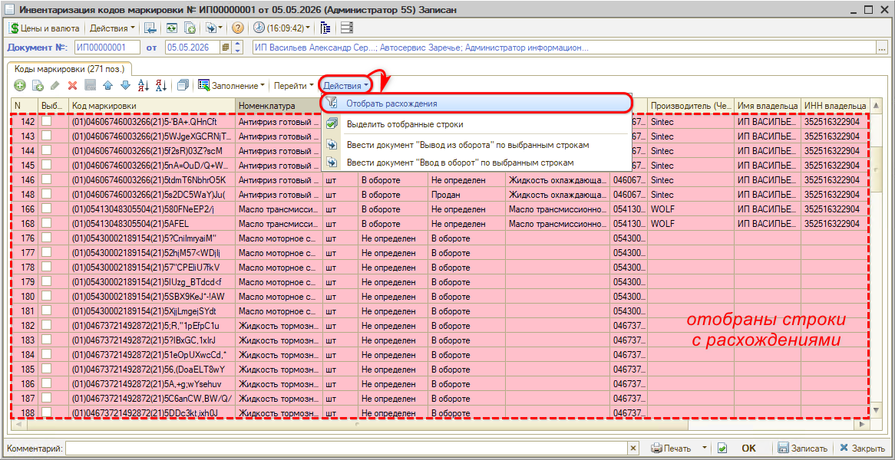

Снять отбор можно повторным нажатием на ту же кнопку.

### 4. Отбор по номенклатуре (коду GTIN)

Есть возможность отобрать для анализа коды маркировки по конкретному товару – для этого рекомендуется использовать отбор по коду GTIN.

Для установки отбора следует выделить нужное значение в колонке “GTIN”, кликнуть правой клавишей мыши и нажать кнопку *“Отбор по значению в текущей колонке”.* После этого в таблице останутся все коды маркировки, относящиеся к этой номенклатуре:

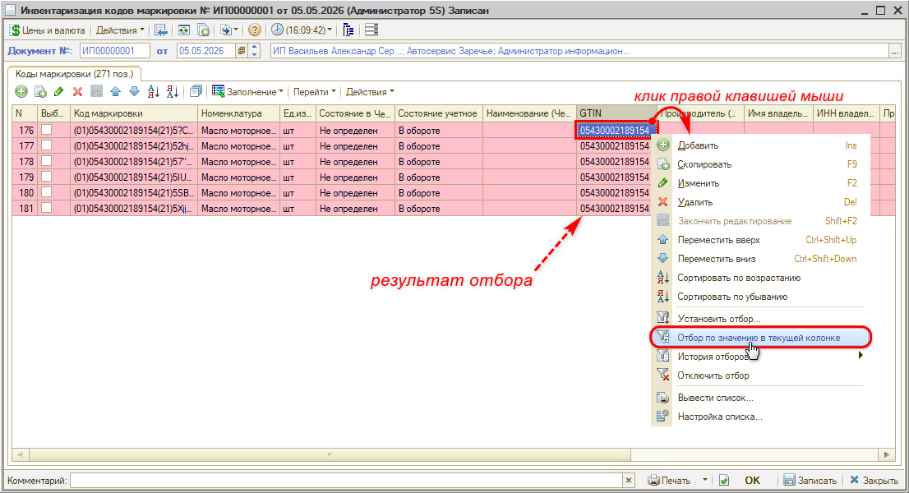

### 5. История состояний

Для просмотра истории изменений состояния кода в программе есть возможность перейти в регистр “Состояния кодов маркировки” – для этого следует выделить строку с нужным кодом и нажать кнопку *“Перейти → История состояний”:*

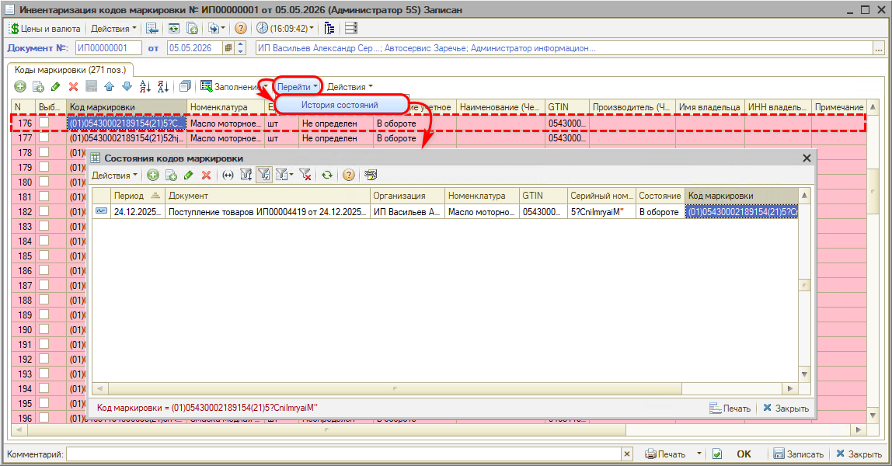

Данный регистр позволяет отследить изменение состояний кода маркировки во внутреннем учете и просмотреть связанные документы в программе.

### 6. Корректировка расхождений

В результате сравнения данных внутреннего учета программы с данными ГИС МТ «Честный знак» могут быть выявлены, например, следующие расхождения:

- по данным «Честного знака» код имеет статус “В обороте”, по данным внутреннего учета – “Выбыл”;
- согласно данным «Честного знака» код выбыл из оборота, а во внутренней системе – “В обороте”;
- владельцем кода маркировки по данным внутреннего учета является другой участник оборота маркированных товаров (например, поставщик или импортер), и др.

Причинами расхождения данных могут быть сбои синхронизации систем учета, ручные корректировки документов без выгрузки данных в «Честный знак», ошибки в документообороте и т.д.

Состояния кодов маркировки требуется привести к общему значению, чтобы учетное состояние соответствовало данным в ЛК “Честного знака”.

***Варианты действий по корректировке данных***

Исходя из полученных данных, возможны различные варианты действий по их корректировке:

1. Если в «Честном знаке» состояние “В обороте”, а в учетной системе “Не определен” или “Продан”, физически товар в наличии – требуется оформить документ “Ввод в оборот” в программе и не выгружать его в «Честный знак»;
2. Если в «Честном знаке» состояние “В обороте”, а в учетной системе “Не определен” или “Продан”, товара по факту нет – требуется списать эти коды маркировки, для этого нужно оформить документ “[Вывод из оборота](../Вывод%20кодов%20маркировки%20из%20оборота/vyvod-kodov-markirovki-iz-oborota.md)” с указанием причины (например, “Утрата или повреждение”) и выгрузить его в ГИС МТ;
3. Если в «Честном знаке» состояние “Не определен”, а в учетной системе “В обороте”, товара физически нет – требуется оформить документ “Вывод из оборота” в программе без выгрузки его в ГИС МТ;
4. Если в «Честном знаке» состояние “Не определен”, а в учетной системе “В обороте”, товар в наличии – требуется оформить документ ввода в оборот в программе и отправить сведения в ГИС МТ.

*Примечание:* В некоторых случаях выгружать созданные корректирующие документы в «Честный знак» не требуется, они нужны только для корректировки данных в своей программе для приведения внутреннего учета в соответствие с ГИС МТ. Иногда наоборот: требуется выгрузить в «Честный знак» актуальные данные о статусе маркированных товаров.

***Создание корректирующих документов***

**Шаг 1.** *Установка отбора по состоянию*

Для создания корректирующих документов сначала требуется отобрать строки по состоянию – для этого следует выделить курсором нужное значение *состояния* и установить *отбор по значению:*

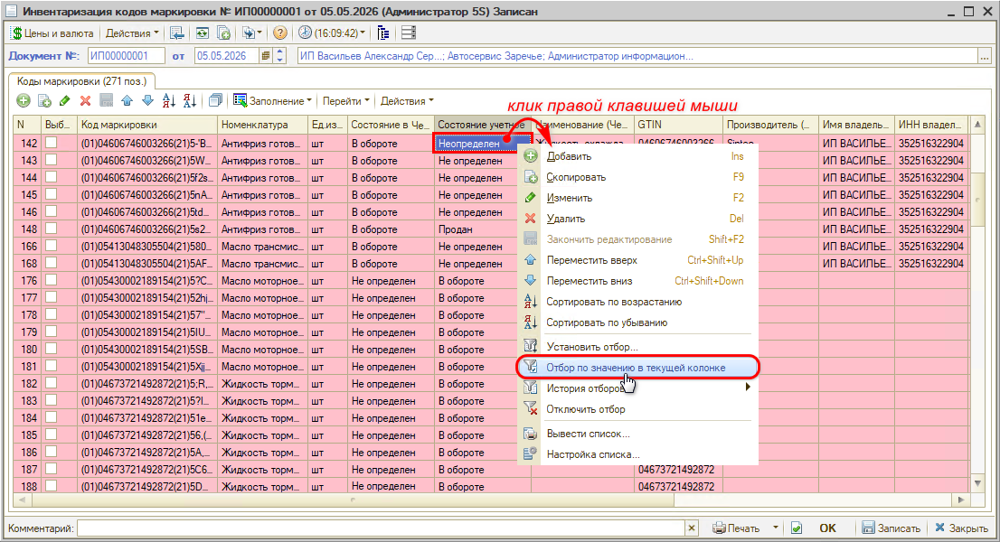

**Шаг 2.** *Выделение строк*

Далее требуется *выделить отобранные строки* – для этого следует нажать кнопку *“Действия → Выделить отобранные строки”* либо установить отметки вручную:

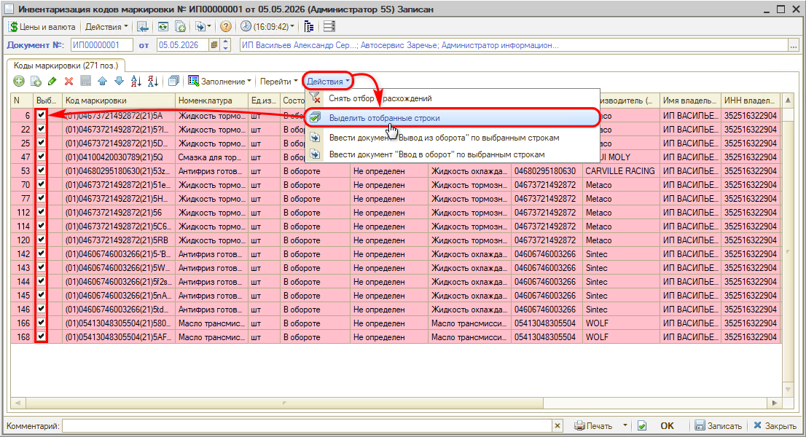

*Примечание:* Снять выделение можно нажатием на ту же кнопку.

**Шаг 3.** *Ввод документа*

Далее на основании отобранных строк следует создать нужный документ – “Ввод в оборот” либо “[Вывод из оборота](../Вывод%20кодов%20маркировки%20из%20оборота/vyvod-kodov-markirovki-iz-oborota.md)” (в зависимости от варианта расхождений – см. [выше](#6-корректировка-расхождений)):

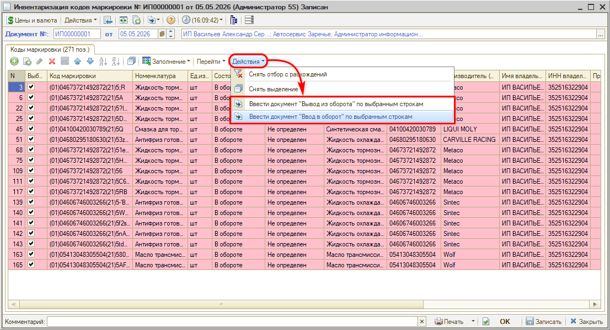

Система создаст новый документ на основании выбранных строк – следует его проверить и записать:

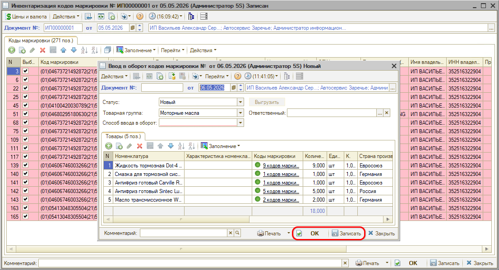

В зависимости от ситуации (см. [выше](#6-корректировка-расхождений)), может потребоваться *выгрузка* созданного документа в систему «Честный знак».

**Шаг 4.** *Добавление комментария*

Затем рекомендуется вернуться к документу “Инвентаризация кодов маркировки” и в столбце “Примечание” напротив отработанных строк с расхождениями добавить комментарии о произведенной корректировке:

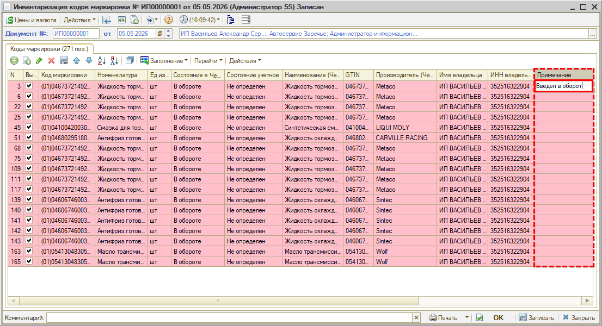

**Шаг 5.** *Обработка других статусов*

Далее следует *снять текущий отбор* строк и *повторить действия* для остальных статусов.

---

**Теги:** маркировка, инвентаризация, коды маркировки, расхождения, честный знак
