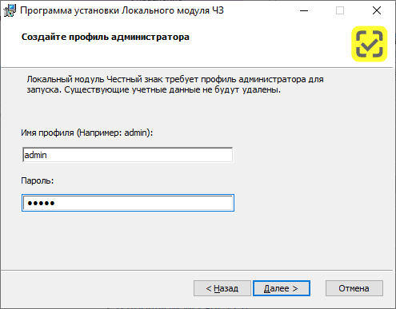
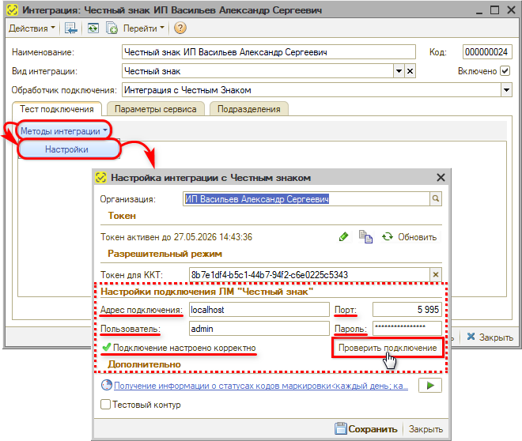
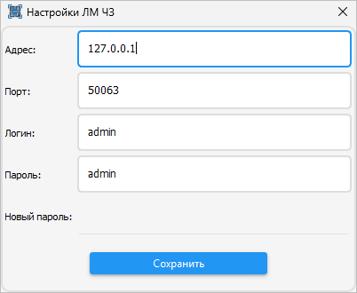

# Установка Локального модуля Честного знака

<table><tr><td><b>Время чтения:</b> 8 мин.</td><td><b>Обновлено:</b> 09.09.2026</td></tr></table>

Источник: https://www.5systems.ru/help/ustanovka-lokalnogo-modulya-chestnogo-znaka

> *Актуально начиная с версии релиза 5S AUTO **2.8.3.58**.*

## Содержание

- [Введение](#введение)
- [Шаг 1. Скачивание и установка](#шаг-1-скачивание-и-установка)
- [Шаг 2. Инициализация модуля](#шаг-2-инициализация-модуля)
  - [Вариант 1. Инициализация из программы](#вариант-1-инициализация-из-программы)
  - [Вариант 2. Инициализация через утилиту](#вариант-2-инициализация-через-утилиту)
- [Шаг 3. Проверка подключения ЕСМ к ЛМ ЧЗ](#шаг-3-проверка-подключения-есм-к-лм-чз)

## Введение

ЛМ ЧЗ, или Локальный модуль «Честный знак», — это утилита для поддержки офлайн-режима проверки кодов маркировки. Его [обязательно](https://markirovka.ru/knowledge/tovarnye-gruppy/molochnaya-produkciya/trebovaniya-k-uchastniku-dlya-realizatsii-zapretitelnogo-rezhima-onlayn-oflayn) должны установить и использовать все розничные участники оборота. ЛМ ЧЗ позволяет проверять при продаже товары, подлежащие обязательной маркировке, в ситуациях, когда онлайн-ответ временно недоступен.

ЛМ ЧЗ представляет собой служебный модуль, который подключается к кассовой программе. Основные функции локального модуля:

- хранит актуальный список запрещенных к продаже кодов маркировки;
- позволяет проверять коды маркировки, если в рамках интервала проверки не был получен ответ из ГИС МТ, например при временном отсутствии интернета;
- автоматически синхронизирует данные с системой «Честный знак» при восстановлении соединения.

Подробнее см. материалы на сайте «Честного знака»: [«Офлайн проверка на кассах. Локальный модуль ЧЗ»](https://markirovka.ru/community/rezhim-proverok-na-kassakh/oflayn-proverka-na-kassakh-lokalnyy-modul-chz), [«Требования для реализации разрешительного режима онлайн / офлайн»](https://markirovka.ru/knowledge/tovarnye-gruppy/molochnaya-produkciya/trebovaniya-k-uchastniku-dlya-realizatsii-zapretitelnogo-rezhima-onlayn-oflayn), а также статью на сайте ЕСП: [«Локальный модуль "Честный знак"»](https://ao-esp.ru/base/product/lm_chz).

Установку ЛМ ЧЗ следует выполнять после [установки Единого Сервисного Модуля (ЕСМ)](../%D0%A3%D1%81%D1%82%D0%B0%D0%BD%D0%BE%D0%B2%D0%BA%D0%B0%20%D0%95%D0%B4%D0%B8%D0%BD%D0%BE%D0%B3%D0%BE%20%D0%A1%D0%B5%D1%80%D0%B2%D0%B8%D1%81%D0%BD%D0%BE%D0%B3%D0%BE%20%D0%9C%D0%BE%D0%B4%D1%83%D0%BB%D1%8F%20%28%D0%95%D0%A1%D0%9C%29/ustanovka-edinogo-servisnogo-modulya-esm.md). Общий порядок настройки описан в статье [«Настройка интеграции с ТС ПИоТ»](../%D0%9D%D0%B0%D1%81%D1%82%D1%80%D0%BE%D0%B9%D0%BA%D0%B0%20%D0%B8%D0%BD%D1%82%D0%B5%D0%B3%D1%80%D0%B0%D1%86%D0%B8%D0%B8%20%D1%81%20%D0%A2%D0%A1%20%D0%9F%D0%98%D0%BE%D0%A2/nastroyka-integracii-s-ts-piot.md).

## Шаг 1. Скачивание и установка

Для установки Локального модуля следует [скачать дистрибутив ЛМ ЧЗ](https://xn--80ajghhoc2aj1c8b.xn--p1ai/local-module/) на сайте «Честного знака» и выполнить установку согласно прилагающейся инструкции.

Установку модуля следует выполнять на том же компьютере, на котором установлен модуль ЕСМ. В случае если в компании используется несколько касс, то можно выполнить установку только на одном компьютере или сервере.

В процессе установки на этапе создания профиля администратора требуется задать имя профиля и пароль — эти данные затем нужно будет использовать для инициализации модуля в программе (см. [ниже](#шаг-2-инициализация-модуля)), поэтому их необходимо сохранить. По умолчанию автоматически заполняются значения `admin` — `admin`:

После установки следует проверить, что модуль работает и «видит» кассу.

Более подробные инструкции по установке и настройке модуля — в файле, который скачивается вместе с программой [в личном кабинете ЕСМ](https://lk.ao-esp.ru/).

## Шаг 2. Инициализация модуля

После установки необходимо инициализировать модуль.

### Вариант 1. Инициализация из программы

Если программа запущена на компьютере, находящемся в одной сети с компьютером, где установлен ЛМ ЧЗ, то инициализацию можно выполнить из программы.

Для этого нужно перейти в окно настройки [интеграции с «Честным знаком»](../../Настройка%20интеграции%20с%20Честным%20знаком/nastroyka-integracii-s-chestnym-znakom.md#2-создание-интеграции-с-честным-знаком) → вкладка «Тест подключения» → **Методы интеграции** → **Настройки**.

1. В поле «Разрешительный режим» необходимо заполнить токен ККТ из ЛК «Честного знака» — подробнее см. в статье [«Настройка интеграции с Честным знаком» → «Токен для ККТ»](../../Настройка%20интеграции%20с%20Честным%20знаком/nastroyka-integracii-s-chestnym-znakom.md#4-токен-для-ккт).

2. В поле «Настройки подключения ЛМ "Честный знак"» требуется заполнить следующие параметры:

   - **Адрес подключения** — значение `localhost` либо адрес сервера;
   - **Порт** — значение по умолчанию `5995` (если не заполнить, будет установлено автоматически);
   - **Пользователь** и **Пароль** — значения параметров «Имя профиля» и «Пароль» из настроек в установщике ЛМ ЧЗ (см. [шаг 1](#шаг-1-скачивание-и-установка), по умолчанию `admin` — `admin`).

   

После заполнения параметров следует нажать кнопку «Проверить подключение» — должен появиться индикатор «зеленая галочка» и статус «Подключение настроено корректно».

### Вариант 2. Инициализация через утилиту

Можно воспользоваться утилитой [`local_module_chz_init.zip`](attachments/local_module_chz_init.zip). Файл требуется разархивировать и запустить с помощью PowerShell (кликнуть правой клавишей мыши и выбрать в меню вариант «Выполнить с помощью PowerShell»).

При запуске утилиты необходимо ввести [токен ККТ](../../Настройка%20интеграции%20с%20Честным%20знаком/nastroyka-integracii-s-chestnym-znakom.md#4-токен-для-ккт) из ЛК «Честного знака», а также логин и пароль из [шага 1](#шаг-1-скачивание-и-установка) (по умолчанию `admin` — `admin`).

> **Комментарий.** API-интерфейс ЛМ ЧЗ по умолчанию работает на порту `5995`. Инициализация модуля выполняется через POST-запрос к ресурсу `http://localhost:5995/api/v2/init`.

## Шаг 3. Проверка подключения ЕСМ к ЛМ ЧЗ

Между ЛМ ЧЗ и ЕСМ обязательно должна быть настроена связь — без этого ЛМ ЧЗ не включится. Для проверки связи между модулями следует зайти в интерфейс ЕСМ и проверить, что отображается информация об ЛМ ЧЗ в соответствующем блоке (см. [в статье](../Настройка%20интеграции%20с%20ТС%20ПИоТ/nastroyka-integracii-s-ts-piot.md#statusy_podkl)).

Нажатием на кнопку «Настроить адрес» можно посмотреть настройки (а также изменить при необходимости):

При отсутствии подключения к ЛМ ЧЗ в ЕСМ следует проверить, был ли вместе с ЕСМ установлен компонент контроллера ЛМ ЧЗ (см. [в статье](../Установка%20Единого%20Сервисного%20Модуля%20%28ЕСМ%29/ustanovka-edinogo-servisnogo-modulya-esm.md#шаг-4-установка-есм)). В случае если контроллер ЛМ ЧЗ не установлен, необходимо из дистрибутива, скачанного для установки ЕСМ (см. [в статье](../Установка%20Единого%20Сервисного%20Модуля%20%28ЕСМ%29/ustanovka-edinogo-servisnogo-modulya-esm.md#шаг-2-скачивание-дистрибутива-есм)), запустить файл вида `esm-lm-controller_<версия>-windows-setup.exe`. Далее следовать инструкциям «Мастера установки».

После установки и настройки ЕСМ и ЛМ ЧЗ следует перейти в программу 5S AUTO для [настройки оборудования](../%D0%9D%D0%B0%D1%81%D1%82%D1%80%D0%BE%D0%B9%D0%BA%D0%B0%20%D0%B8%D0%BD%D1%82%D0%B5%D0%B3%D1%80%D0%B0%D1%86%D0%B8%D0%B8%20%D1%81%20%D0%A2%D0%A1%20%D0%9F%D0%98%D0%BE%D0%A2/nastroyka-integracii-s-ts-piot.md#настройка-оборудования-в-программе).

## Файл для скачивания

- [local_module_chz_init.zip](attachments/local_module_chz_init.zip) (.zip, 1 КБ)

---

**Теги:** Маркировка, Торговое оборудование, Честный знак, локальный модуль, ЛМ ЧЗ, установка, инициализация, ЕСМ
