

# Маркировка товаров

<table><tr><td><b>Время чтения:</b> 28 мин.</td><td><b>Обновлено:</b> 09.06.2026</td></tr></table>

Источник: https://www.5systems.ru/help/markirovka-tovarov

> *Актуально начиная с версии релиза 5S AUTO **2.8.3.1**. Функционал индикации проверки "криптохвостов" – начиная с релиза **2.8.3.26**, обновлено в релизе **2.8.3.58**.*

## Содержание

1. [Введение](#введение)
2. [Структура кода маркировки](#структура-кода-маркировки)
3. [Способы ввода кодов маркировки в систему](#способы-ввода-кодов-маркировки-в-систему)
4. [Маркировка в номенклатурных справочниках](#маркировка-в-номенклатурных-справочниках)
5. [Сканирование кодов маркировки](#сканирование-кодов-маркировки)
   - [Сканирование кодов маркировки в документе](#сканирование-кодов-маркировки-в-документе)
   - [Статусы проверки кодов](#статусы-проверки-кодов)
   - [Проверка криптохвоста кода маркировки](#проверка-криптохвоста-кода-маркировки)
   - [Действия с кодами маркировки](#действия-с-кодами-маркировки)
   - [Состояния кодов маркировки в реестре документов](#состояния-кодов-маркировки-в-реестре-документов)
6. [Добавление товарных групп в ЛК Честного знака](#добавление-товарных-групп-в-лк-честного-знака)

## Введение

***Маркировка*** представляет собой нанесение специального *кода* на упаковку, при сканировании которого покупатели могут проверить подлинность товара и получить всю информацию о нем: изготовитель, место, дата и время производства или продажи, срок годности, артикул, номер стандарта. Данные хранятся в государственной информационной системе *"Честный знак"[\*](#snoska),* также называемой "Информационная система маркировки и прослеживания" (ИС МП), или "Государственная информационная система маркировки товаров" (ГИС МТ).

Именно в ИС МП хранится информация о текущем владельце и статусы кода маркируемой продукции. Программа лишь получает эти данные от ИС МП. Изменение владельца и статуса происходит также на стороне ИС МП на основе переданных ей данных, причем они могут передаваться непосредственно из 1С или опосредованно, через оператора электронного документооборота (ЭДО) или оператора фискальных данных (ОФД).

Подлежат маркировке, в частности, следующие товары:

- *Шины:* маркировка появилась в 2020 году, обязательная проверка в разрешительном режиме – с 1 ноября 2024 года.
- *Смазочные материалы и автожидкости:* обязательная регистрация в системе маркировки стартовала с 1 марта 2025 г., обязательная маркировка для производителей и импортеров – с 1 сентября 2025 года, маркировка остатков – по 31 октября 2025 года, обязательная передача сведений о выводе из оборота при продаже в розницу – с 1 апреля 2026 года, обязательная проверка в разрешительном режиме – [с 1 октября 2026 года](https://честныйзнак.рф/business/projects/autofluids/checkout/).
- *Автозапчасти:* запущен эксперимент с 25 февраля 2025 года по 31 августа 2026 года (даты старта обязательной маркировки запчастей на момент написания текущей статьи неизвестны). Данный эксперимент затрагивает автостекла, фильтры и свечи зажигания.

Каждая организация, осуществляющая продажу маркированных товаров, должна иметь регистрацию в [личном кабинете на сайте Честного знака](https://markirovka.crpt.ru/login-kep): см. [инструкцию](https://markirovka.ru/knowledge/fast_start/start/sistema-markirovki-chestnyy-znak-kak-zaregistrirovatsya) по регистрации, [пошаговую инструкцию](https://xn--80ajghhoc2aj1c8b.xn--p1ai/business/doc/?id=%D0%98%D0%BD%D1%81%D1%82%D1%80%D1%83%D0%BA%D1%86%D0%B8%D1%8F_%D0%BF%D0%BE_%D0%BC%D0%B0%D1%80%D0%BA%D0%B8%D1%80%D0%BE%D0%B2%D0%BA%D0%B5_%D1%82%D0%B3_%D0%BC%D0%BE%D1%82%D0%BE%D1%80%D0%BD%D1%8B%D0%B5_%D0%BC%D0%B0%D1%81%D0%BB%D0%B0.html) по работе в системе, [документацию](https://docs.crpt.ru/gismt/) по работе с функционалом, а такие другие инструкции на сайте[ честныйзнак.рф](https://xn--80ajghhoc2aj1c8b.xn--p1ai/) и в разделе "Помощь" в [ЛК](https://markirovka.crpt.ru/login-kep). Также имеются [видеоинструкции](https://markirovka.ru/video_instructions/) по всем вопросам и процессам системы маркировки.

*Примечание 1:* Если автосервис приобретает смазочные материалы и жидкости не для последующей реализации, а исключительно *для оказания услуг* клиентам (стоимость товара включена в стоимость услуги), он не является участником системы маркировки, и регистрация не требуется (см. [пояснение 1](https://markirovka.ru/knowledge/tovarnye-gruppy/motornye-masla/organizatsiya-priobretet-motornye-masla-dlya-sobstvennykh-nuzhd-dolzhna-li-ona-registrirovatsya-i-vy), [пояснение 2](https://markirovka.ru/knowledge/tovarnye-gruppy/motornye-masla/kto-dolzhen-registrirovatsya-v-sisteme-markirovki-po-motornym-maslam), [вопрос 1](https://markirovka.ru/community/markirovka-motornykh-masel/avtoservis-i-markirovka-masel-i-zapchastey) и [вопрос 2](https://markirovka.ru/community/markirovka-motornykh-masel/top-5-voprosov-po-markirovke-motornykh-masel#comment-58455) на сайте "Честного знака", а также статью [Кто должен регистрироваться в системе маркировки по моторным маслам?](https://markirovka.ru/knowledge/tovarnye-gruppy/motornye-masla/kto-dolzhen-registrirovatsya-v-sisteme-markirovki-po-motornym-maslam))

*Примечание 2:* Рассматривается [проект постановления](https://regulation.gov.ru/projects/166682/) "О внесении изменений в постановление Правительства Российской Федерации от 30 ноября 2024 г. № 1683", в рамках которого СТО будут приравнены к участникам оборота товаров вне зависимости от вида осуществляемой деятельности.

Общая схема работы системы маркировки и прослеживаемости:

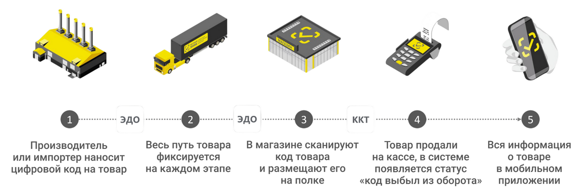

1. Производитель заказывает уникальные коды маркировки в системе “Честный знак”, наносит двумерный код Data Matrix наносят на упаковку товара и вводит в оборот.
2. Весь путь товара фиксируется в системе на каждом этапе: продажа, перемещение, приемка. Каждый раз, когда продукцию передают между участниками оборота, об этом отчитываются в Честный знак с помощью ЭДО.
3. Продавец сканирует полученный от поставщика товар, сверяя фактические коды маркировки с информацией в УПД, и размещает товар на полках в магазине или на складе.
4. При продаже товара конечному покупателю кассир сканирует код Data Matrix, далее происходит получение разрешения на продажу, после передачи чека в ОФД система фиксирует, что товар выведен из оборота.
5. Вся информация о коде маркировки товара отображается в мобильном приложении и доступна для проверки покупателем.

Отсутствие необходимой маркировки, а также ошибки, выявленные при проверке соответствия кода, приводят к [запрету продажи товара](http://publication.pravo.gov.ru/document/0001202311270058?index=45)[\*](#snoska). Попытка реализовать продукцию с проблемной маркировкой может привести к [штрафам](https://xn--80ajghhoc2aj1c8b.xn--p1ai/penalties/) и конфискации. Поэтому важно чтобы товар проходил проверку при вводе в систему с момента приемки.

*\*Примечание:* Программа не блокирует проведение документов и печать чеков без сканирования кодов маркировки (за исключением разрешительного режима для шин), но только уведомляет продавца о проблемах с кодами маркировки в документе.

Система предусматривает обеспечение ***прослеживаемости товаров**.* Прослеживаемость обеспечивается рядом механизмов, в том числе, передачей в систему информации о смене собственника маркированного товара с использованием УПД в электронном виде.

*Схема прослеживаемости товара при использовании ЭДО:*

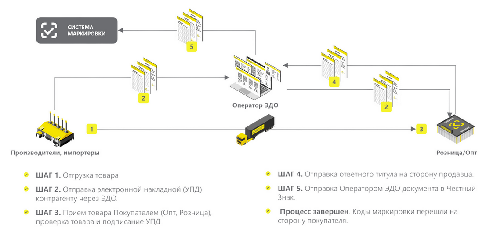

Также некоторым компаниям может потребоваться *маркировка остатков склада* – подробнее о реализации данного функционала в 5S AUTO см. <u>статью</u> *(в разработке).*

Перед началом работы необходимо иметь следующие доступы и оборудование:

- электронная подпись (см. в статье “[Регистрация в системе Честный знак](../Регистрация%20в%20системе%20Честный%20знак/registraciya-v-sisteme-chestnyy-znak.md#2-подключение-эп)”);
- личный кабинет на портале “Честный знак” (см. в статье “[Регистрация в системе Честный знак](../Регистрация%20в%20системе%20Честный%20знак/registraciya-v-sisteme-chestnyy-znak.md)”);
- электронный документооборот (ЭДО);
- контрольно-кассовый аппарат с ФФД 1.2 (обязательное требование) и договор с ОФД – оператором фискальных данных;
- сканер штрих-кода 2D (рекомендуется в режиме COM-порта).

См. другие материалы по теме *“Маркированные товары”* в специальном [разделе Базы знаний](https://www.5systems.ru/taxonomy/term/240):

- [Операции с кодами маркировки](../Операции%20с%20кодами%20маркировки/operacii-s-kodami-markirovki.md)
- [Регистрация в системе Честный знак](../Регистрация%20в%20системе%20Честный%20знак/registraciya-v-sisteme-chestnyy-znak.md)
- [Настройка интеграции с Честным знаком](../Настройка%20интеграции%20с%20Честным%20знаком/nastroyka-integracii-s-chestnym-znakom.md)
- [Получение токена доступа к API Честного знака](../Получение%20токена%20доступа%20к%20API%20Честного%20знака/poluchenie-tokena-dostupa-k-api-chestnogo-znaka.md)
- [Вывод кодов маркировки из оборота](../Вывод%20кодов%20маркировки%20из%20оборота/vyvod-kodov-markirovki-iz-oborota.md)
- [Инвентаризация кодов маркировки](../Инвентаризация%20кодов%20маркировки/inventarizaciya-kodov-markirovki.md)
- <u>Маркировка остатков склада</u> *(в разработке)*
- [Подключение ТС ПИоТ](../Настройка%20интеграции%20с%20ТС%20ПИоТ/nastroyka-integracii-s-ts-piot.md)
- [Частичное выбытие маркированного товара](../Частичное%20выбытие%20маркированного%20товара/chastichnoe-vybytie-markirovannogo-tovara.md) *(функционал дорабатывается)*
- [Работа с приложением 5S TSD](../../Склад%20и%20запчасти/Работа%20с%20приложением%205S%20TSD/rabota-s-prilozheniem-5s-tsd.md)

## Структура кода маркировки

***Код маркировки*** представляет собой уникальную последовательность буквенно-числовых символов, и наносится на товар в формате двумерного штрих-кода Data Matrix.

Производитель или импортер получают код через систему “Честный знак” и наносят на каждую единицу товара. Код маркировки является ключевым элементом системы: его сканируют на всех этапах пути движения товара от производителя до покупателя, что делает товар легко прослеживаемым. Если товар подлежит обязательной маркировке, а ее нет, он считается контрафактным.

Пример, как выглядит код маркировки:

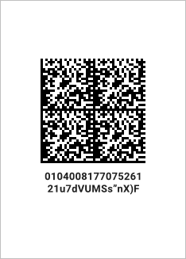

Код маркировки индивидуален для каждого товара, он включает в себя 4 группы данных, из которых первая и вторая группы образуют код идентификации, третья и четвертая группа образуют код проверки, а также 4 идентификатора применения.

***Структура кода маркировки:***

1. Код идентификации:  
   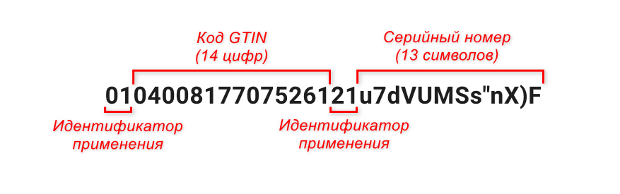  
   **1)** специальный символ, идентификатор применения “01”; 
   **2)** GTIN (Global Trade Item Number) – код товара из 14 цифр, который хранится в международной базе [GS1](https://www.gs1ru.org/aboutus/uniscan_gs1rus/) и описывает несколько параметров товара (цвет, страну происхождения, название и т.д.); 
   **3)** специальный символ, идентификатор применения “21”; 
   **4)** индивидуальный серийный номер из 13 символов, может включать идентификатор страны (в случае маркировки продукции на территории стран ЕАЭС, одна цифра или буква в начале кода);
2. Код проверки (“криптохвост”):  
   **1)** специальный символ, идентификатор применения “91”; 
   **2)** ключ для проверки подлинности – состоит из 4 символов; 
   **3)** специальный символ, идентификатор применения “92”; 
   **4)** код для проверки подлинности кода маркировки – состоит из 44 символов.  
   *Примечание:* Для масел и запчастей также может быть использована укороченная структура кода маркировки (идентификатор применения “93” и крипточасть из 4-х символов) – см. [описание](https://markirovka.ru/knowledge/tovarnye-gruppy/motornye-masla/sostav-koda-markirovki-motornye-masla).

*Пример полного кода маркировки:*   **01**04008177075261**21**u7dVUMSs”nX)F **91**FFD0 **92**dGVzdOGARIfU/e6ka7FT/trzWwGsD7DWMxzr2ZswXZ0=

- 2 символа “01” – идентификатор применения;
- 14 символов “04008177075261” – код товара, GTIN;
- 2 символа “21” – идентификатор применения;
- 13 символов “u7dVUMSs”nX)F” – уникальный серийный номер;
- 1 символ “ “ – Group separator, разделитель, непечатаемый машиночитаемый символ, имеющий код 29 в таблице символов ASCII;
- 2 символа “91” – идентификатор применения;
- 4 символа “FFD0” – ключ проверки;
- 1 символ “ “ – Group separator;
- 2 символа “92” – идентификатор применения;
- 44 символа “dGVzdOGARIfU/e6ka7FT/trzWwGsD7DWMxzr2ZswXZ0=” – код проверки.

Для работы с маркированными товарами к кассе обязательно должен быть подключен *сканер,* считывающий двумерные штрих-коды, к которым относится код DataMatrix. На официальном сайте "Честного знака" можно ознакомиться с [инструкциями по настройке ряда моделей сканеров](https://xn--80ajghhoc2aj1c8b.xn--p1ai/barcode/), со [списком рекомендуемых производителей сканеров](https://xn--80ajghhoc2aj1c8b.xn--p1ai/business/partners/autofluids/retail/scanner_manual/), а также с [инструкцией по проверке сканера](https://markirovka.ru/knowledge/fast_start/start/proverka-skanera-data-matrix-instruktsiya).

## Способы ввода кодов маркировки в систему

Коды маркировки могут быть введены в программу следующими способами:

1. Загрузка документов с маркированными товарами от поставщика через систему ЭДО – это основной способ. Далее требуется проверка этих кодов через сканирование.
2. Сканирование кодов маркировки 2D-сканером в процессе работы с документами в программе.
3. Сканирование кодов маркировки через веб-приложение [5S TSD](../../Склад%20и%20запчасти/Работа%20с%20приложением%205S%20TSD/rabota-s-prilozheniem-5s-tsd.md).

*Внимание!* Вручную ввести *полный* код маркировки в программу невозможно – только его часть, поэтому пробить на кассе такой код не получится – выйдет ошибка 211 "Код товара не распознан". В случае продажи товаров с обязательной маркировкой с использованием разрешительного режима ККТ вводить код вручную недопустимо.

## Маркировка в номенклатурных справочниках

Для учета маркированного товара в программе обязательно должен быть предварительно настроен *Тип номенклатуры* и корректно указан в карточках номенклатуры для каждого маркированного товара:

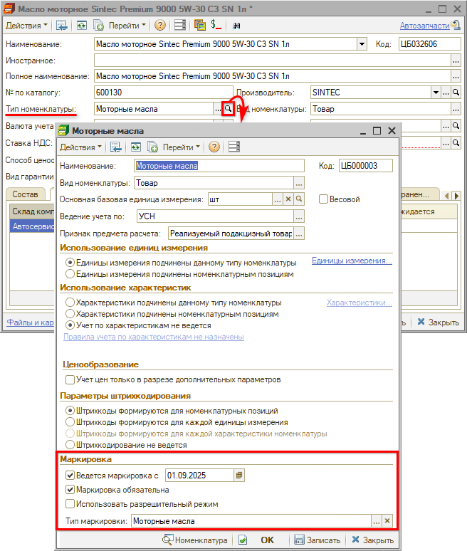

Настройка параметров в карточке “Типа номенклатуры” производится в разделе *“Маркировка”.* Также следует обращать внимание на корректное указание *основной базовой единицы измерения* – например, "штуки" для фасованного масла или "литры" для масла в бочках на розлив.

Подробно о создании и настройке типов номенклатуры для маркированных товаров см. в статье “[Настройка интеграции с Честным знаком](../Настройка%20интеграции%20с%20Честным%20знаком/nastroyka-integracii-s-chestnym-znakom.md#1-настройка-справочников-номенклатуры)”.

## Сканирование кодов маркировки

### Сканирование кодов маркировки в документе

Процесс сканирования кодов маркировки в документе рассмотрен ниже на примере поступления товаров. Подробнее о работе с кодами маркировки в документах программы см. в статье "[Операции с кодами маркировки](../Операции%20с%20кодами%20маркировки/operacii-s-kodami-markirovki.md)".

Основной способ ввода кодов маркировки в программу – это загрузка документов через ЭДО. Вместе с товарами от поставщика по ЭДО приходит универсальный передаточный документ, который содержит коды маркировки. Требуется проверить данный документ на предмет расхождений с фактическими кодами на продукции.

Для сверки следует просканировать коды на товаре – при этом автоматически производится их сравнение с кодами, полученными в электронном УПД.

В случае если в документе “Поступление товаров”, “Реализация товаров” либо “Перемещение товаров в производство” есть маркированные товары, то отображается колонка “Коды маркировки” с их количеством и индикацией проверки:

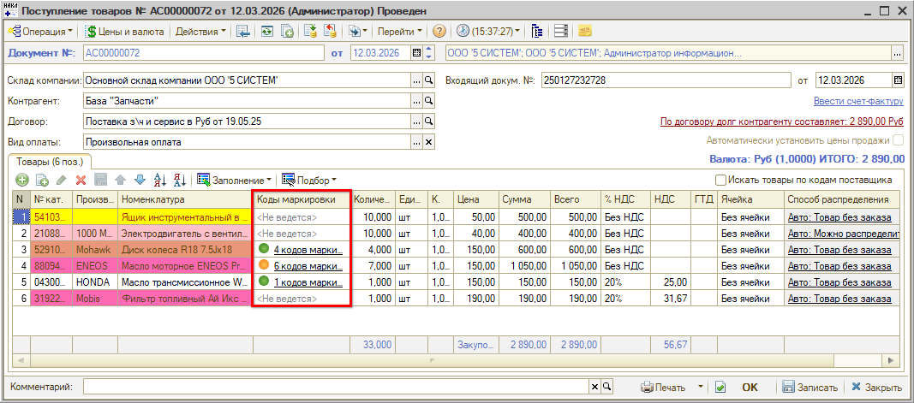

*Примечание:* Для маркированных товаров в карточке номенклатуры обязательно должен быть выбран тип номенклатуры с настроенными признаками ведения учета маркировки (см. [выше](#сканирование-кодов-маркировки)), иначе столбец “Коды маркировки” не будет отображаться.

*Индикаторы проверки кодов маркировки в документе* свидетельствуют о соответствии количества и корректности статусов заполненных кодов:

 - Отсканированы все коды маркировки в соответствии с количеством товара в документе, проверка выполнена успешно, состояние кодов в “Честном знаке” совпадает с состоянием в системе учета;  - Кодов маркировки отсканировано меньше, чем количество товара по документу;  - Кодов маркировки по факту отсканировано больше, чем количество товара в документе;  - Требуется проверка сканером – отсутствуют фактические коды маркировки;  - Не выполнена проверка кодов маркировки в Честном знаке – не получен статус;  - Проверка в “Честном знаке” не прошла – состояние кода маркировки не определено, т.к. проверка отклонена;  - Ошибка при проверке кодов маркировки – не совпадают состояния в базе и в “Честном знаке”.

В случае если по одной номенклатурной позиции в документе содержится *несколько штук маркированных товаров,* т.е. несколько кодов маркировки (см. пример на скриншоте [ниже](#tabl_km)), то *индикатор в документе* устанавливается согласно следующим *приоритетам:*

1. Соответствие количества ожидаемого и отсканированного товара
2. Наличие отклоненных кодов маркировки
3. Наличие не проверенных сканером кодов маркировки
4. Наличие кодов маркировки с незаполненным статусом “Честного знака”
5. Наличие кодов маркировки с несовпадающими статусами в базе со статусами в “Честном знаке”

*Примечание:* Индикаторы ошибок *не указывают* на блокировку документа. Система проверки кодов маркировки через “Честный знак” будет работать, только если активен [токен доступа к API](../Получение%20токена%20доступа%20к%20API%20Честного%20знака/poluchenie-tokena-dostupa-k-api-chestnogo-znaka.md), но если токен не активен, то документы можно будет проводить независимо от результата проверки. Однако для товаров с обязательной маркировкой *необходимо отслеживать статусы проверки* на этапе поступления, чтобы у всех маркированных товаров в документе стоял зеленый индикатор, т.к. реализовать можно будет только товар с корректными кодами маркировки.

При клике на ячейку “Коды маркировки” в строке товара открывается таблица “Коды маркировки” с информацией обо всех кодах маркировки по данной товарной позиции:

Коды маркировки содержатся в 2-х регистрах:

1. *Плановые коды (“По документу”)* – это коды, полученные от поставщика через УПД через электронный документооборот. Получаемые через ЭДО коды маркировки не содержат крипточасть и не привязаны к номенклатуре – сопоставление с номенклатурой в программе производится при сканировании.
2. *Фактические коды (“Отсканировано”)* – коды, отсканированные по факту при получении товара.

Плановые и фактические коды и их статусы должны совпадать между собой, от этого будет зависеть статус кода маркировки (см. [ниже](#состояния-кодов-маркировки-в-реестре-документов)).

***Сканирование кодов маркировки*** *производится из открытой формы таблицы “Коды маркировки”* – при этом заполняются значения в колонках “Отсканировано” и “Состояние Честный знак”. В случае если фактический код маркировки не соответствует плановому, в таблицу добавляется новая строка, в которой заполняются сразу все колонки.

После проведения документа, в котором были отсканированы коды маркировки, в свойствах номенклатуры в разделе “Штрих-коды” появляется строка с GTIN:

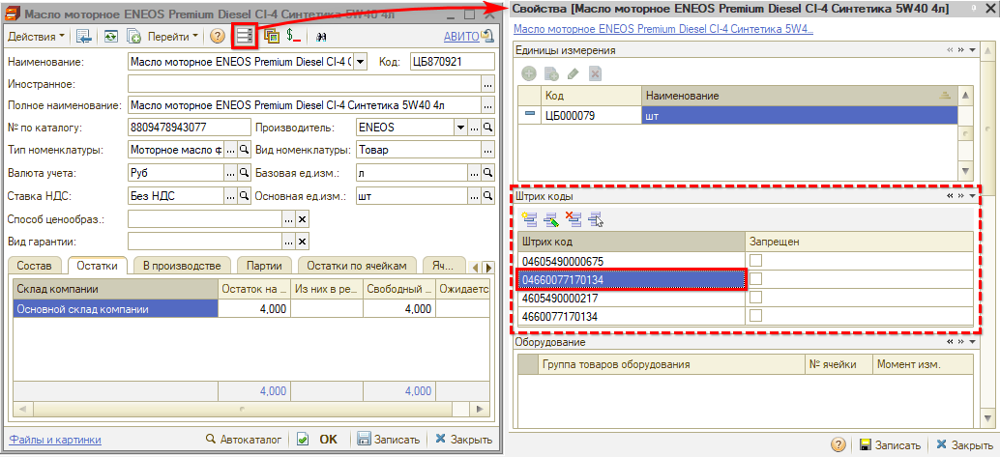

Считанный код записывается в регистр “Штрих-коды” с отметкой “Да” в колонке “GTIN”:

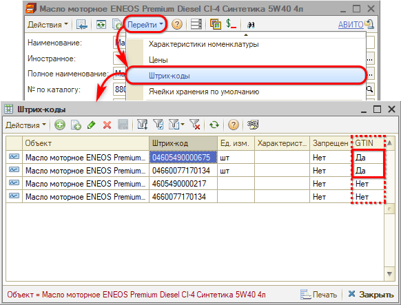

### Статусы проверки кодов

В результате сканирования должны совпадать коды маркировки “По документу” и “Отсканированный”, а также состояния кода маркировки в системе учета с состоянием в “Честном знаке”.

Статусы проверки обозначаются в столбце “Проверка” следующей индикацией *совпадения кодов маркировки* по документу и фактически отсканированного:

 - Код маркировки проверен сканером, состояние кода в “Честном знаке” совпадает с состоянием в системе учета;  - Требуется проверка сканером – отсутствует фактический код маркировки;  - Не выполнена проверка кода маркировки в “Честном знаке” – не получен статус через API “Честного знака”;  - Проверка в “Честном знаке” не прошла – состояние кода маркировки не определено, т.к. проверка через API отклонена;  - Ошибка при проверке кода маркировки – не совпадают состояния в базе и в “Честном знаке”.

***Значения состояний кодов маркировки***

По каждому коду маркировки возможны следующие состояния учета в программе:

- В обороте (Введен в оборот)
- Выбыл (Выведен из оборота)
- Продан

При проверке кода маркировки через API Честного знака дополнительно к этим статусам могут быть получены статусы:

- Эмитирован
- В обороте / Принадлежит другой организации
- Разагрегирован
- Не определен

### Проверка криптохвоста кода маркировки

*Функционал доступен начиная с релиза 2.8.3.26.*

При сканировании кодов маркировки через форму "Коды маркировки" в таблице отображается индикация проверки крипточасти кода ("криптохвоста"):

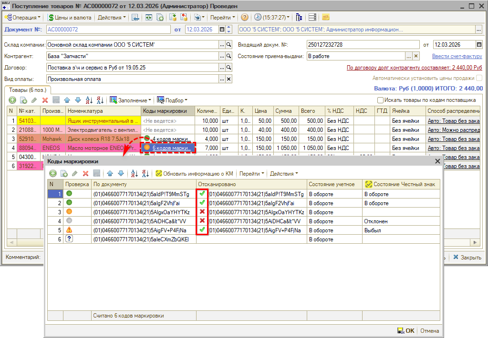

Возможны два варианта индикации:

-  – проверка пройдена успешно;
-  – криптохвост не проверен или проверка не прошла.

Проверка производится автоматически путем срабатывания регламентного задания "[Получение информации о статусах кодов маркировки](../Настройка%20интеграции%20с%20Честным%20знаком/nastroyka-integracii-s-chestnym-znakom.md#5-получение-информации-о-статусах)". Также есть возможность проверить криптохвост вручную нажатием кнопки *"Действия → Проверить все коды маркировки"* – см. [ниже](#knopka_prover_kryptohvost).

Важно отслеживать товары с некорректными кодами маркировки на этапе поступления и не принимать их у поставщиков, чтобы не было проблем с дальнейшей реализацией. В случае если впоследствии в документе продажи будут ошибочные или непроверенные коды, при пробитии чека программа выведет окно с предупреждением:

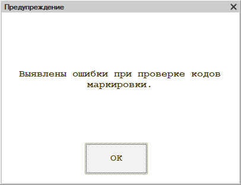

Подробнее см. в статье "[Операции с кодами маркировки](../Операции%20с%20кодами%20маркировки/operacii-s-kodami-markirovki.md#пробитие-чека-с-маркированными-товарами)".

### Действия с кодами маркировки

***Типовые действия***

Есть возможность *редактировать* коды маркировки в таблице, *удалять* или *добавлять новые.*

***Обновление состояния***

Нажатием на кнопку *“Обновить информацию о КМ”* в колонку “Состояние Честный знак” подтягивается актуальное состояние из "Честного знака" по коду маркировки в выделенной строке таблицы через API:

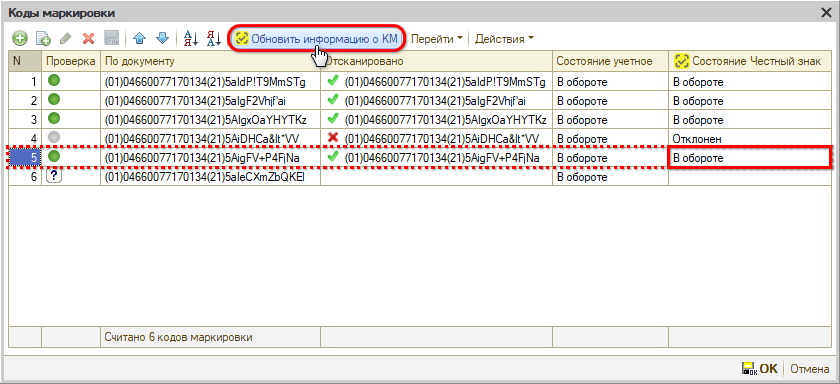

*Важно!* Данное действие работает, только если *товарная группа,* к которой относится в "Честном знаке" номенклатура, в контексте которой открыта таблица кодов маркировки, подключена в Личном Кабинете компании в "Честном Знаке". Если товарная группа в ЛК не подключена, обновление статуса работать не будет. Как подключить новую товарную группу – см. [ниже](#добавление-товарных-групп-в-лк-честного-знака). 
*Пример:* Некоторые стеклоомыватели могут относиться в системе "Честный Знак" не к группе "Моторные масла", а к группе "Косметика, бытовая химия и товары личной гигиены".

Также есть возможность сделать *групповое* обновление информации *по всем кодам* в таблице – см. [ниже](#knopka_obnov_sost_po_vsem).

***Переход в регистры***

По кнопке *“Перейти”* есть возможность перейти в регистры с подробной информацией о кодах маркировки:

1. при нажатии *“Перейти → История состояний”* открывается регистр “Состояния кодов маркировки”:

   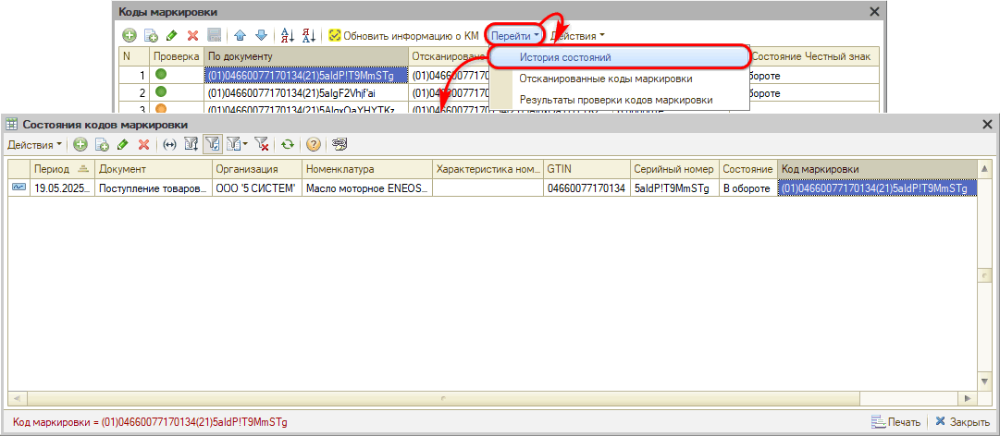

   В данном регистре отображается подробная информация о кодах маркировки, полученных от системы “Честный знак” через API.

2. при нажатии *“Перейти → Отсканированные коды маркировки”* открывается регистр “Считанные коды маркировки”:

   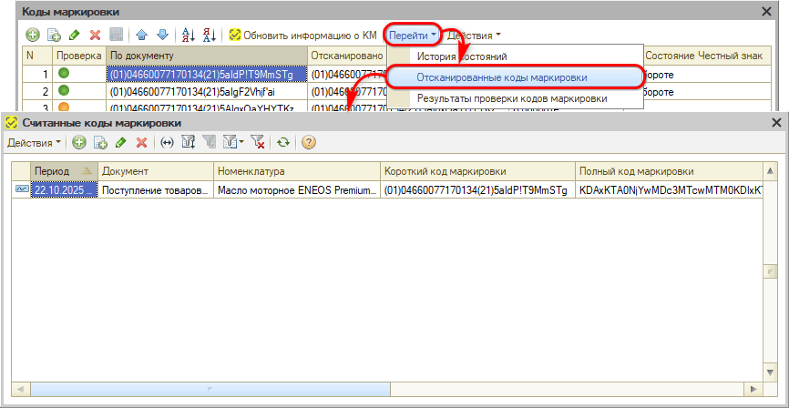

   В данном регистре отображается подробная информация об отсканированных в программе кодах маркировки.

3. при нажатии *“Перейти → Результаты проверки кодов маркировки”* открывается регистр “Состояния кодов маркировки API Честный знак”:

   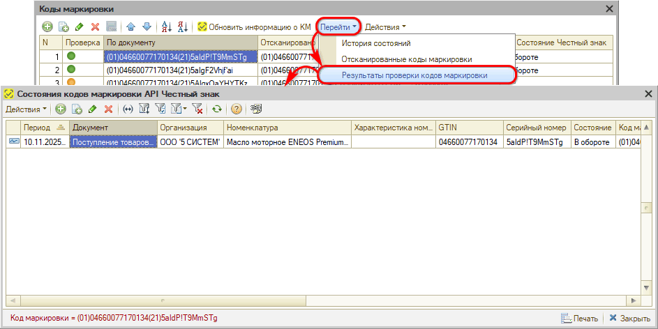

***Дополнительные действия***

Также возможны следующие *дополнительные действия* с кодами маркировки при нажатии кнопок выпадающего меню, открывающегося по кнопке *"Действия":*

1. *Ввести код:*

   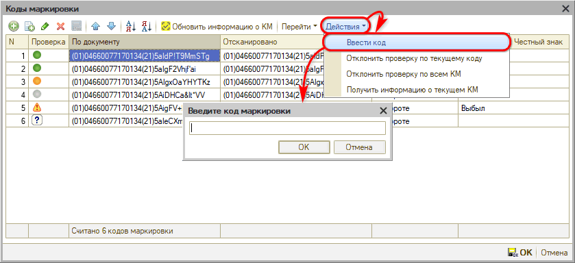

   Данное действие предусмотрено для ввода кода маркировки клавиатурным сканером.

2. *Отклонить проверку по коду:*

   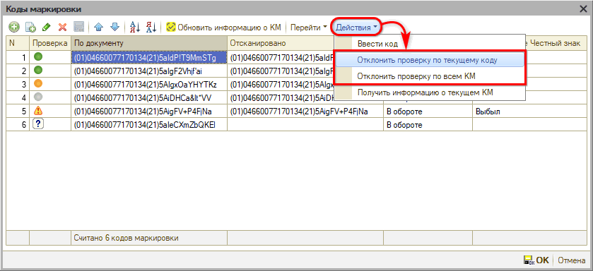

   Если по каким-либо причинам нет возможности проверить код маркировки, то есть возможность пометить код как отклоненный от проверки.

   Например, это актуально в случае, когда владелец кода маркировки уже сменился на другую организацию.

   Есть возможность отклонить проверку:

   - по текущему коду маркировки;
   - по всем кодам маркировки.

3. *Получить информацию о текущем КМ:*

   При нажатии на данную кнопку открывается таблица с подробной информацией о коде маркировки, например, можно получить сведения о владельце, дате и времени выпуска кода и т.д.:

   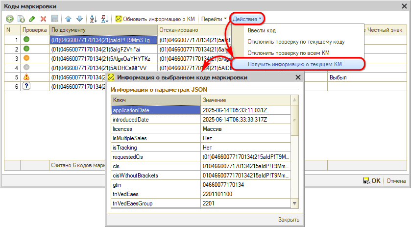

   

4. *Обновить информацию о всех КМ*

   *Функционал доступен начиная с релиза 2.8.3.26.*

   При нажатии кнопки *"Обновить информацию о всех КМ"* в колонку “Состояние Честный знак” подтягиваются актуальные состояния кодов маркировки из Честного знака через API по всем кодам в таблице – по аналогии с работой кнопки "Обновить информацию о КМ" построчно (см. [выше](#obnovl_sost)):

   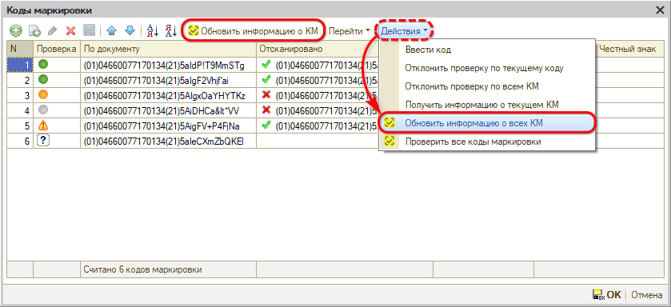

   *Важно!* Данное действие работает, только если *товарная группа,* к которой относится в "Честном знаке" номенклатура, в контексте которой открыта таблица кодов маркировки, подключена в Личном Кабинете компании в "Честном знаке". Если товарная группа в ЛК не подключена, обновление статусов работать не будет (см. пример [выше](#obnovl_sost)). Как подключить новую товарную группу – см. [ниже](#добавление-товарных-групп-в-лк-честного-знака).

   

5. *Проверить все коды маркировки*

   *Функционал доступен начиная с релиза 2.8.3.26.*

   При нажатии на данную кнопку производится проверка крипточасти ("криптохвоста") кодов маркировки в текущей таблице (подробнее см. [выше](#проверка-криптохвоста-кода-маркировки)):

   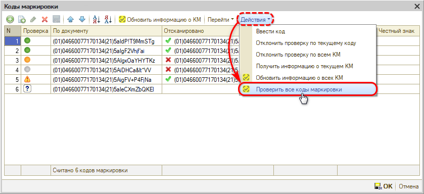

### Состояния кодов маркировки в реестре документов

В списках документов “Поступление товаров”, “Реализация товаров” и “Перемещение товаров в производство” отображается колонка *“Состояния кодов маркировки”,* в которой содержатся статусы соответствия состояний кодов маркировки:

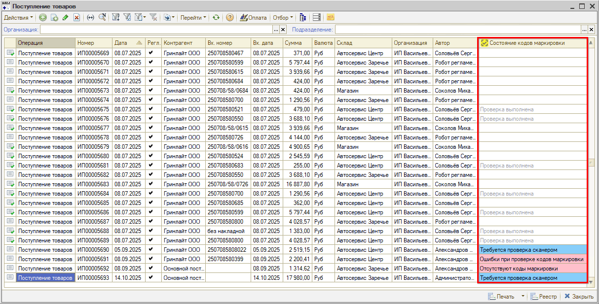

***Возможные статусы:***

1. *Проверка выполнена* – коды маркировки (полученный от поставщика и отсканированный в программе), а также состояния кодов маркировки в системе учета и в “Честном знаке” заполнены и совпадают;
2. *Ошибки при проверке кодов маркировки* – не совпадают статусы в базе и в “Честном знаке”;
3. *Отклонена проверка через API* – состояние кода маркировки не определено, т.к. проверка через API не прошла;
4. *Не выполнена проверка через API, токен не активен* – не получен статус проверки кода маркировки через “Честный знак”, т.к. не активен токен;
5. *Требуется проверка сканером* – отсутствуют фактические коды маркировки;
6. *Отсутствуют коды маркировки* – не заполнены плановые коды маркировки (получаемые от поставщика через ЭДО).

В случае если в таблице документа присутствуют *несколько* маркированных товаров *с разными статусами,* то *статус всего документа* устанавливается согласно следующим *приоритетам:*

1. Отсутствие кодов маркировки у товара
2. Отклонена проверка через API
3. Требуется проверка сканером
4. Не выполнена проверка через API
5. Ошибки при проверке кодов маркировки
6. Проверка выполнена

Необходимо начиная с этапа приемки отслеживать, чтобы статусы по всем документам с маркированными товарами были “Проверка выполнена”, иначе, если затем будет выявлен проблемный товар, продать его будет невозможно.

Для удобства работы с документами с маркированными товарами есть возможность устанавливать *отборы по статусу документов* – см. в статье "[Операции с кодами маркировки](../Операции%20с%20кодами%20маркировки/operacii-s-kodami-markirovki.md#отборы-по-статусам)".

## Добавление товарных групп в ЛК Честного знака

В некоторых ситуациях может потребоваться добавление товарных групп в Личном Кабинете "Честного знака" для корректной работы функционала: например, для обновления информации о состоянии кодов маркировки через API – см. [выше](#obnovl_sost).

*Пример:* Некоторые стеклоомыватели могут относиться в системе "Честный Знак" не к группе "Моторные масла", а к группе "Косметика, бытовая химия и товары личной гигиены". В случае если данная *товарная группа не подключена* в Личном кабинете компании, то при нажатии кнопки *“Обновить информацию о КМ”* в таблице "Коды маркировки" по такому товару состояние из "Честного знака" подтягиваться не будет:

Для того, чтобы добавить новую товарную группу, следует в Личном кабинете "Честного знака" в разделе "Ваши товарные группы" нажать кнопку *"Подключить новую":*

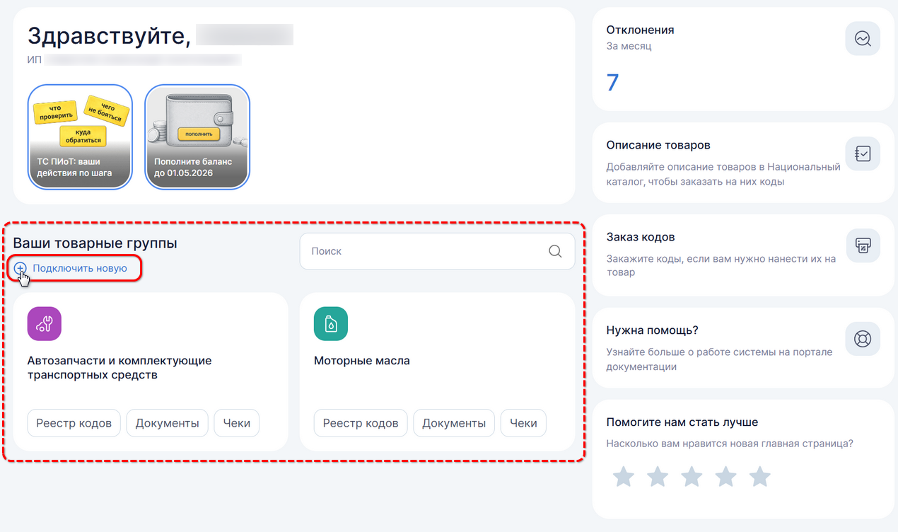

В разделе "Данные участника" [https://markirovka.crpt.ru/profile](https://markirovka.crpt.ru/profile) в блоке "Товарные группы и роли" следует выбрать нужную товарную группу и указать свой [тип участника](https://markirovka.ru/knowledge/tovarnye-gruppy/obschie-voprosy-gis/kakoy-tip-uchastnika-ukazat-pri-registratsii-v-sisteme-markirovki-ne-horeca) (или несколько типов) оборота маркированных товаров в соответствии с внутренней документацией организации:

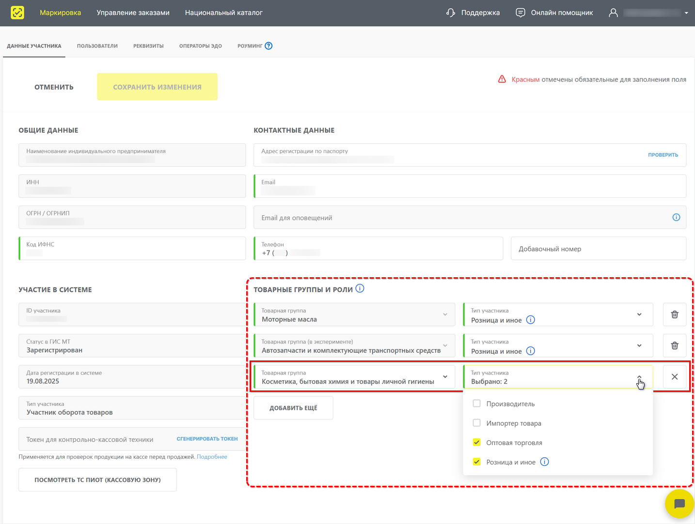

Также см. инструкцию на сайте "Честного знака" "[Как добавить новую товарную группу?](https://markirovka.ru/knowledge/tovarnye-gruppy/obschie-voprosy-gis/kak-dobavit-novuyu-tovarnuyu-gruppu)".

---

**Теги:** маркировка, коды маркировки, честный знак, сканирование, gtin, криптохвост, статусы кодов

