

# Настройка интеграции с Честным знаком

<table><tr><td><b>Время чтения:</b> 16 мин.</td><td><b>Обновлено:</b> 08.06.2026</td></tr></table>

Источник: https://www.5systems.ru/help/nastroyka-integracii-s-chestnym-znakom

>  **<u>Статья для опытных пользователей</u>!**

> *Актуально начиная с версии релиза 5S AUTO **2.8.3.1**, обновление формы дополнительных настроек – начиная с релиза **2.8.3.42**.*

## Содержание

1. [Введение](#введение)
2. [Настройка интеграции в программе](#настройка-интеграции-в-программе)
   - [1. Настройка справочников номенклатуры](#1-настройка-справочников-номенклатуры)
   - [2. Создание интеграции с Честным знаком](#2-создание-интеграции-с-честным-знаком)
   - [3. API токен](#3-api-токен)
      - [1) Получение токена](#1-получение-токена)
      - [2) Изменение токена](#2-изменение-токена)
   - [4. Токен для ККТ](#4-токен-для-ккт)
   - [5. Получение информации о статусах](#5-получение-информации-о-статусах)
   - [6. Настройка права](#6-настройка-права)

## Введение

См. основную статью "[Маркировка товаров](../Маркировка%20товаров/markirovka-tovarov.md)", а также другие статьи в разделе Базы знаний "[Маркированные товары](../)".

*Предварительно должны быть сделаны следующие настройки:*

1. Настройка интеграции с [API 5S AUTO](../../Администрирование%20и%20настройка%20системы/API%205S%20AUTO/api-5s-auto.md), в рамках которой обязательно должно быть выполнено:
   - [публикация](https://infostart.ru/1c/articles/646384/) http-сервисов базы 1С на web-сервере;
   - настройка разрешений на подключение к этому URL-адресу с серверов компании 5SYSTEMS (IP-адреса см. *[в статье](../../Администрирование%20и%20настройка%20системы/API%205S%20AUTO/api-5s-auto.md#ip-адреса-компании-5systems))*;
   - настройка внешнего подключения (см. в [статье](../../Администрирование%20и%20настройка%20системы/API%205S%20AUTO/api-5s-auto.md#2-настройка-внешнего-подключения)).
2. Настройка пользователя [5S Cloud](../../Администрирование%20и%20настройка%20системы/Создание%20и%20редактирование%20пользователей%205S%20Cloud/sozdanie-i-redaktirovanie-polzovateley-5s-cloud.md) – для доступа в приложение 5S Sign.
3. Регистрация в системе “Честный знак” – см. [статью](../Регистрация%20в%20системе%20Честный%20знак/registraciya-v-sisteme-chestnyy-znak.md).

## Настройка интеграции в программе

### 1. Настройка справочников номенклатуры

Для учета маркированного товара в программе требуется создать новые [типы номенклатуры](../../Склад%20и%20запчасти/Номенклатура/nomenklatura.md#типы-номенклатуры), либо настроить существующие.

Для каждой группы маркированных товаров рекомендуется создать отдельный тип номенклатуры, а также разделять фасованные товары и в бочках и учитывать, является ли товар подакцизным:

- моторные масла;
- технические жидкости;
- шины; 
  и прочие при необходимости.

Создать новый тип номенклатуры можно путем добавления нового элемента в справочнике “Типы номенклатуры” или копирования имеющегося:

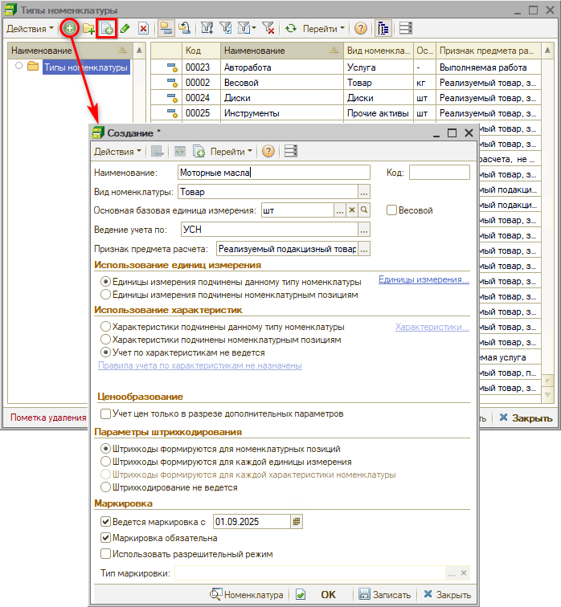

***Основные параметры***

В создаваемом типе номенклатуры следует заполнить все основные параметры:

- *Наименование* – заполнить наименование типа номенклатуры. Для моторных масел можно уточнить, например, фасованное / на розлив.
- *Вид номенклатуры* – выбрать подходящий вид: для шин есть специальный вид “Шины”, для масел и запчастей следует выбрать вид “Товар”,
- *Основная базовая единица измерения* – например, штуки для фасованного масла или литры для масла в бочках на розлив. Необходимо корректно указывать значение данного параметра.
- *Ведение учета по* – например, в случае наличия *патента* у организации продажу подакцизных товаров по нему проводить нельзя, поэтому для моторных масел нужно будет указать систему учета “УСН” или ”ОСНО”. В то же время для продажи запчастей может быть выбран “ПСН”;
- *Единицы измерения* – требуется заполнить.

***Признак предмета расчета***

Для маркированного товара предусмотрено несколько вариантов признака предмета расчета – необходимо выбрать подходящий:

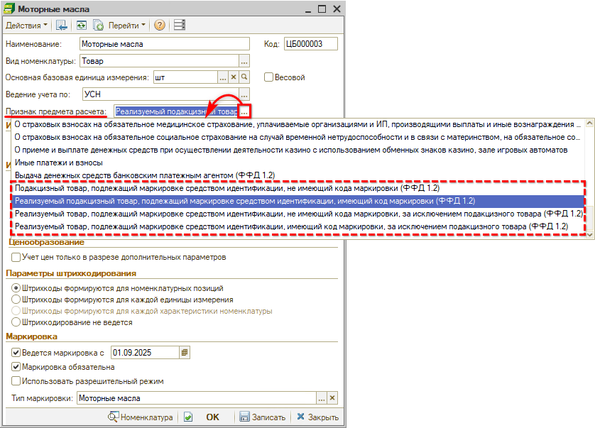

<table><tr><td colspan="3"><b><i>Признаки предмета расчета для маркированных товаров:</i></b></td></tr><tr><td><b>Значение реквизита  (тег 1212)</b></td><td><b>Реквизит “наименование предмета расчета”  (тег 1030)</b></td><td><b>Формат данных реквизита ФД  в печатной форме</b></td></tr><tr><td colspan="3"><i>Для <b>моторных масел</b> и других <a href="../../Практики/Особенности%20реализации%20подакцизных%20товаров/osobennosti-realizacii-podakciznykh-tovarov.md">подакцизных товаров</a>:</i></td></tr><tr><td>31</td><td>реализуемый подакцизный товар, подлежащий маркировке средством идентификации, имеющий код маркировки</td><td>АТМ</td></tr><tr><td colspan="3"><i>Для <b>шин</b> и других товаров, НЕ являющихся подакцизными:</i></td></tr><tr><td>33</td><td>реализуемый товар, подлежащий маркировке средством идентификации, имеющий код маркировки, за исключением подакцизного товара</td><td>ТМ</td></tr></table>

Подробнее см. [приложение № 2 Приказа ФНС России от 14.09.2020 № ЕД-7-20/662@](https://www.consultant.ru/document/cons_doc_LAW_362322/cc1e361ee41688e67fe65c4740a242a10c265c86/) ("Форматы фискальных документов, обязательных к использованию").

***Маркировка***

Далее необходимо произвести настройки в разделе *“Маркировка”:*

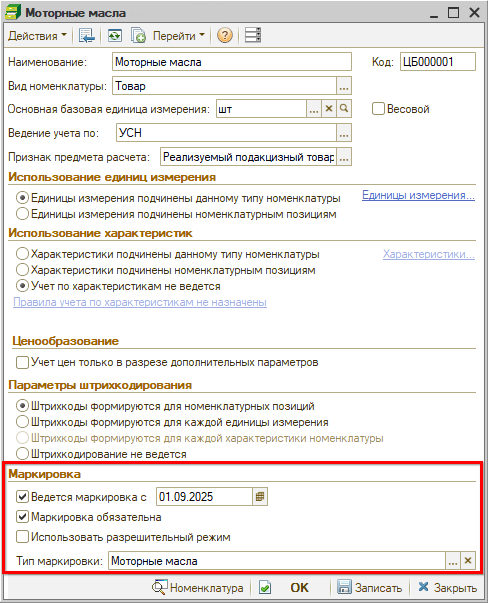

1. *Ведется маркировка* – признак ведения учета по маркировкам для данного типа номенклатуры с указанием даты начала (текущая дата начала работы в базе с маркированными товарами);
2. *Маркировка обязательна* – признак требует обязательного наличия кодов маркировки для всего количества товара (активирует сверку количества кодов маркировки с количеством товара).

   

3. *Использовать разрешительный режим* – признак включает разрешительный режим онлайн проверки кодов маркировки перед пробитием чека и активирует запрос данных сервиса ГИС МТ “Честный знак” при продаже маркированного товара данного типа (с ноября 2024 г. обязательно для шин – см. [статью](../Операции%20с%20кодами%20маркировки/operacii-s-kodami-markirovki.md#разрешительный-режим)):

   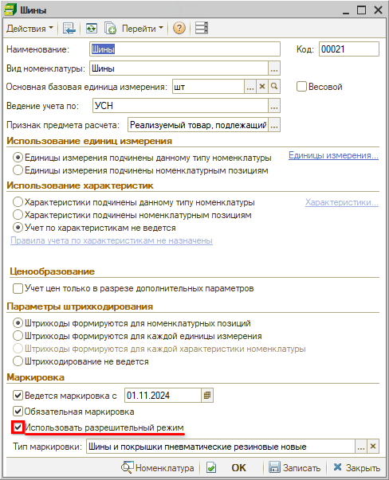

   Также признак активирует видимость колонки "Состояние проверки разрешительного режима" на форме "Проверка кодов маркировки" — подробнее см. в [статье](../Операции%20с%20кодами%20маркировки/operacii-s-kodami-markirovki.md#forma_proverki).

4. *Тип маркировки* – выбор категории маркируемого товара, активируется при установке признака "Ведется маркировка", используется для корректной передачи кода в кассовый аппарат.

Тип номенклатуры обязательно должен быть корректно указан в карточках номенклатуры для каждого маркированного товара:

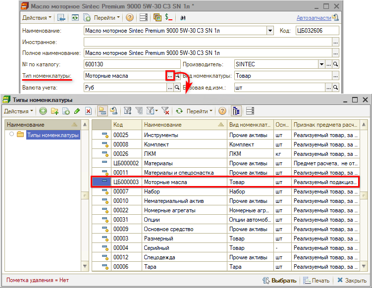

Столбцы с кодами маркировки в документах (см. в [статье](../Маркировка%20товаров/markirovka-tovarov.md#сканирование-кодов-маркировки-в-документе)) будут отображаться только при корректной настройке типа номенклатуры и указании правильного типа в карточке товара.

*Примечание:* В начале работы с функционалом учета маркированного товара требуется корректно настроить номенклатуру в программе. В случае если для масел и автожидкостей уже были созданы соответствующие типы номенклатуры, следует просто настроить их – установить признаки в разделе “Маркировка” и выбрать корректное значение параметра “Признак предмета расчета”. В случае если ранее в своей учетной системе тип номенклатуры был указан некорректно, *рекомендуется* сначала списать остатки склада, затем создать, настроить и заменить типы номенклатуры в карточках товаров, затем оприходовать данные товары заново.

### 2. Создание интеграции с Честным знаком

Для обмена данными с Честным знаком необходимо добавить и настроить интеграцию:

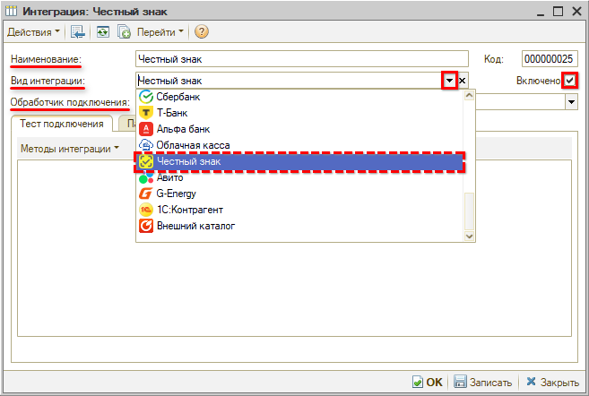

Требуется заполнить *реквизиты:*

- *Наименование* – будет заполнено автоматически при записи;
- *Вид интеграции* – выбрать “Честный знак”;
- *Обработчик подключения* – “Интеграция с Честным Знаком”.

Далее следует установить отметку *“Включено”* и *записать* созданную интеграцию.

*При записи интеграции* в программе автоматически создаются:

- действие “Ссылка для получения токена Честный знак”;
- добавляется обработка "[Обновление токена API Честный знак](../Получение%20токена%20доступа%20к%20API%20Честного%20знака/poluchenie-tokena-dostupa-k-api-chestnogo-znaka.md)" в меню интерфейса.

Далее на вкладке *“Параметры сервиса”* требуется заполнить интеграцию с [API 5S AUTO](../../Администрирование%20и%20настройка%20системы/API%205S%20AUTO/api-5s-auto.md):

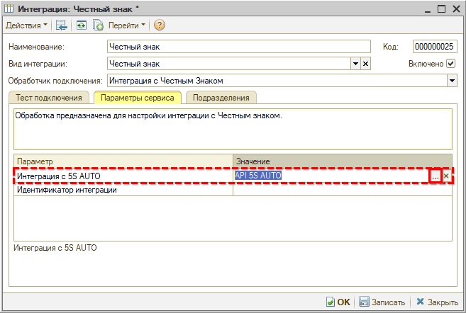

Затем необходимо перейти на вкладку *“Подразделения”* и заполнить подразделения, которые будут работать с интеграцией:

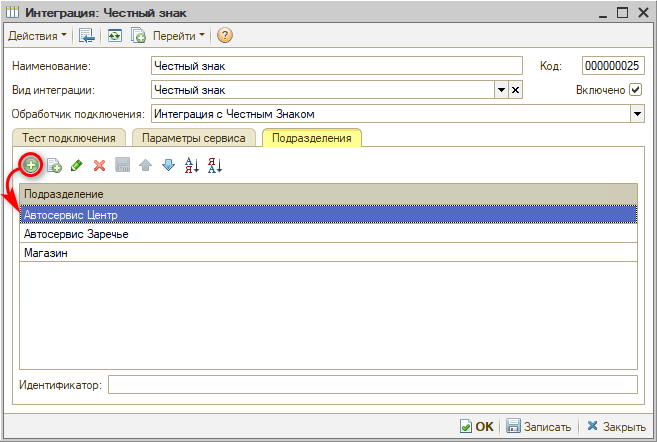

*Примечание:* Указанные подразделения обязательно должны принадлежать *одной организации.* В случае если у компании несколько организаций, которые являются участниками оборота маркированных товаров и у которых есть ЛК в “Честном Знаке”, то необходимо создавать отдельную интеграцию с “Честным знаком” для каждой организации.

Если подразделения, указанные на вкладке “Подразделения” будут принадлежать разным организациям, при переходе к настройкам подключения (см. [ниже](#podkl)) будет выходить предупреждение программы:

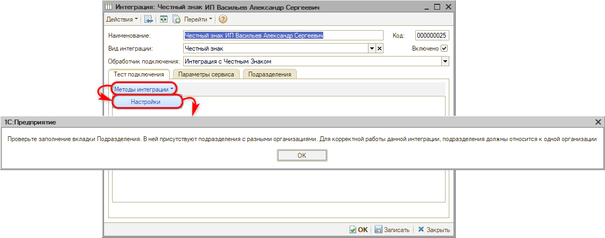

Далее следует перейти на вкладку *“Методы интеграции → Настройки”:*

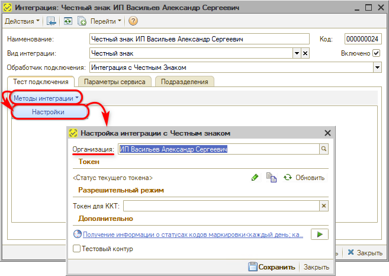

В параметр *“Организация”* при записи подтягивается организация, которой принадлежат подразделения, указанные на вкладке “Подразделения” в настройке интеграции – см. [выше](#podr). Выбрать вручную организацию нельзя.

При записи интеграция переименовывается в формате *“Честный знак + Название организации”:*

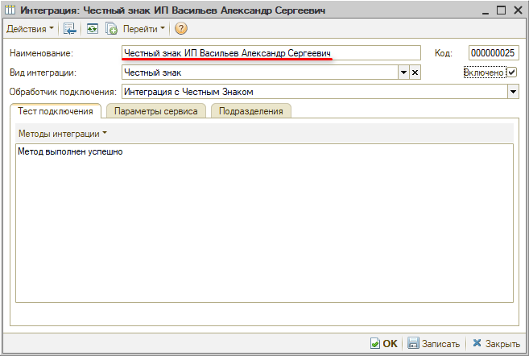

### 3. API токен

В поле ***“Токен”*** отображается информация об активности текущего *токена для интеграции с API “Честного знака”* для проверки кодов маркировки.

***API токен*** – это временный пароль, с помощью которого можно взаимодействовать с API Честного знака от имени сотрудника организации.

В программе настроено получение токена через расширение КриптоПро браузера. Для подписания токена используется приложение *5S Sign* ([sign.5systems.ru](http://sign.5systems.ru)). Для этого в формируемую ссылку передается кодовая строка, полученная в “Честном знаке”, после ее подписания сертификатом происходит получение токена.

*Примечание:* Работа с маркировками в программе возможна без получения токена путем сканирования кода маркировки как на этапе приемки, так и на этапе выдачи товара.

После получения токена открываются следующие *возможности* в программе:

1. Проверка состояния кода маркировки
2. Получение информации
3. Расшифровка кода
4. Выгрузка в "Честный Знак" информации о выводе кодов маркировки из оборота

#### 1) Получение токена

***Через браузер***

Нажатием на кнопку *“Обновить → Через браузер”* открывается окно “Обновление токена” с QR-кодом. Следует скопировать ссылку и открыть ее в браузере:

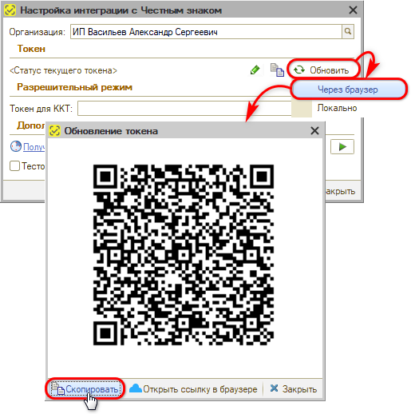

*Важные комментарии:*

1. Рекомендуется использовать Яндекс-браузер.
2. В браузере должно быть установлено расширение КриптоПро (см. в статье “[Регистрация в системе Честный знак](../Регистрация%20в%20системе%20Честный%20знак/registraciya-v-sisteme-chestnyy-znak.md#3-установка-криптопровайдера-криптопро)”).
3. Необходима учетная запись в [5S Cloud](../../Администрирование%20и%20настройка%20системы/Создание%20и%20редактирование%20пользователей%205S%20Cloud/sozdanie-i-redaktirovanie-polzovateley-5s-cloud.md).

При открытии ссылки в браузере производится переход к авторизации в 5S Cloud:

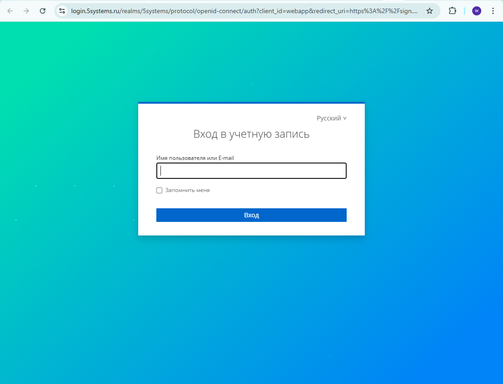

Необходимо ввести учетные данные [пользователя 5S Cloud](../../Администрирование%20и%20настройка%20системы/Создание%20и%20редактирование%20пользователей%205S%20Cloud/sozdanie-i-redaktirovanie-polzovateley-5s-cloud.md) – имя и пароль. При этом открывается приложение 5S Sign. На странице “Создание подписи” следует выбрать сертификат и нажать кнопку "Создать подпись":

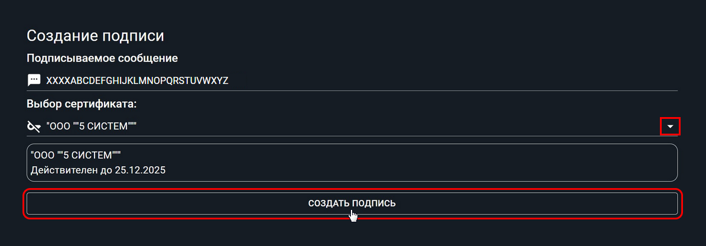

При этом появляется строка подписи. Информация о новом токене ***автоматически*** приходит в программу и отображается на форме настройки интеграции в поле *“Токен”:*

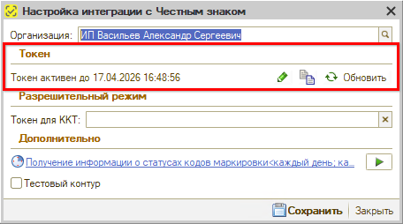

*Важно:* Токен обновляется на 8 часов – это срок его действия.

***Через программу***

Есть возможность настроить локальное обновление токена с подписанием через КриптоПро в программе. Данный способ позволяет обновлять токен напрямую через программу, минуя шаг получения ссылки и перехода по ней в браузере.

Для использования данного способа требуется предварительная настройка – установка отпечатка сертификата. Для корректной работы должна быть установлена последняя версия КриптоПро. Также к компьютеру должен быть подключен носитель с сертификатом.

Для обновления токена с подписанием через программу следует нажать кнопку *“Обновить → Локально”:*

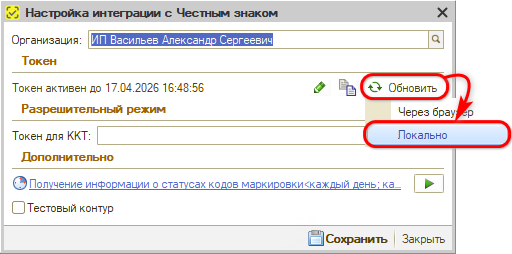

При первой попытке локального обновления токена выходит сообщение программы о необходимости установки отпечатка сертификата:

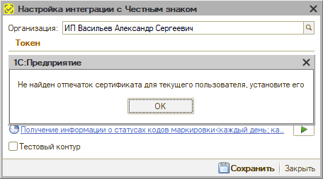

При нажатии кнопки “ОК” открывается обработка “Установка данных о сертификате Честный Знак”:

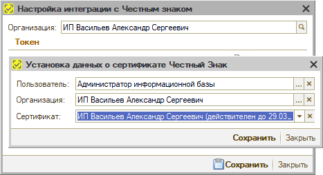

Необходимо заполнить данные:

- *Пользователь* – текущий пользователь, подтягивается автоматически;
- *Организация* – организация также подтягивается автоматически по пользователю;
- *Сертификат* – требуется выбрать сертификат из списка.

После заполнения параметров нажать кнопку “Сохранить”.

После установки отпечатка сертификата для обновления токена будет достаточно нажимать кнопку *“Обновить → Локально”* без необходимости получения ссылки и перехода в браузер. Информация об обновлении токена сразу отображается на форме настройки:

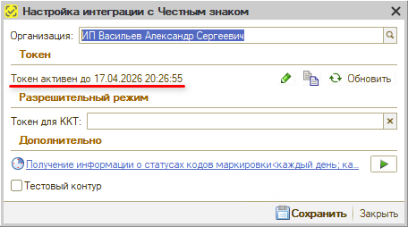

Получить токен можно также через специальную *обработку* – см. в статье “[Получение токена доступа к API Честного знака](../Получение%20токена%20доступа%20к%20API%20Честного%20знака/poluchenie-tokena-dostupa-k-api-chestnogo-znaka.md)”.

#### 2) Изменение токена

Полученный токен при необходимости можно изменить – для этого нужно нажать кнопку *“Изменить текущий токен Честного знака”:*

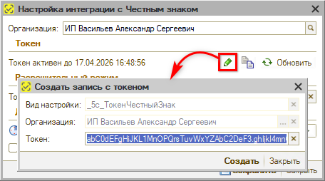

Также есть возможность *скопировать* токен, например, для проверки его с помощью сторонних программ – для этого используется кнопка *“Скопировать”:*

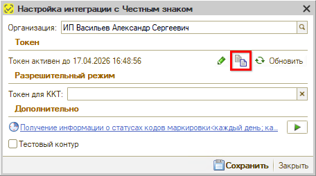

### 4. Токен для ККТ

В случае использования [разрешительного режима для проверки кодов маркировки](../Операции%20с%20кодами%20маркировки/operacii-s-kodami-markirovki.md#разрешительный-режим) (для продажи шин и других товарных групп, обязательных для проверки в разрешительном режиме) необходимо в разделе *“Разрешительный режим”* заполнить параметр *“Токен для ККТ”:*

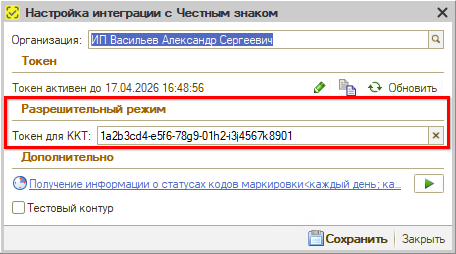

*Токен для ККТ* – это ключ доступа для проверки кодов маркировки в разрешительном режиме. Его следует получить в личном кабинете на сайте “Честного знака” (“Профиль” → “Данные участника” → “Участие в системе” → в поле “Токен для контрольно-кассовой техники” нажать кнопку “Сгенерировать токен” – см. [инструкцию](https://markirovka.ru/knowledge/tovarnye-gruppy/tabachniye-izdeliya/kak-poluchit-klyuch-dostupa-dlya-razreshitelnogo-rezhima-proverok-na-kkt)):

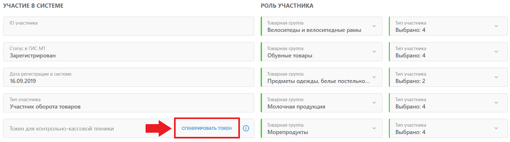

Если в базе больше одной организации, то на каждую организацию необходимо создать отдельную интеграцию. Для каждой организации должен быть получен свой токен для ККТ из ЛК «Честного знака».

### 5. Получение информации о статусах

В блоке *“Дополнительно”* производится настройка регламентного задания *“Получение информации о статусах кодов маркировки”:*

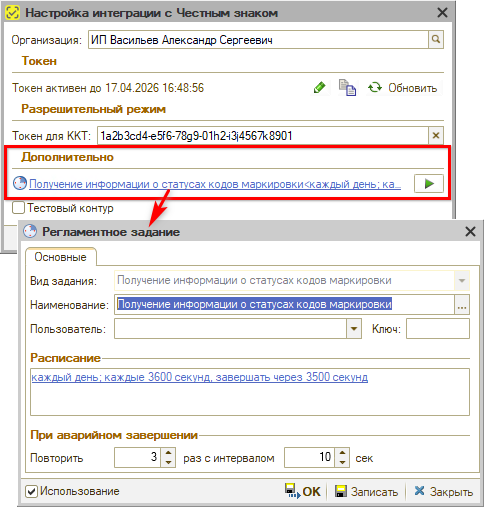

Также в блоке *"Дополнительно"* расположен признак *“Тестовый контур”,* который используется для тестирования интеграции с сервисом – при его установке будет использоваться другой сервер.

### 6. Настройка права

*Функционал редактируется*

Включение режима проверки кодов маркировки регулируется правом *"Разрешить пробивать чек с ошибочными или непроверенными кодами маркировки",* право устанавливается на компанию:

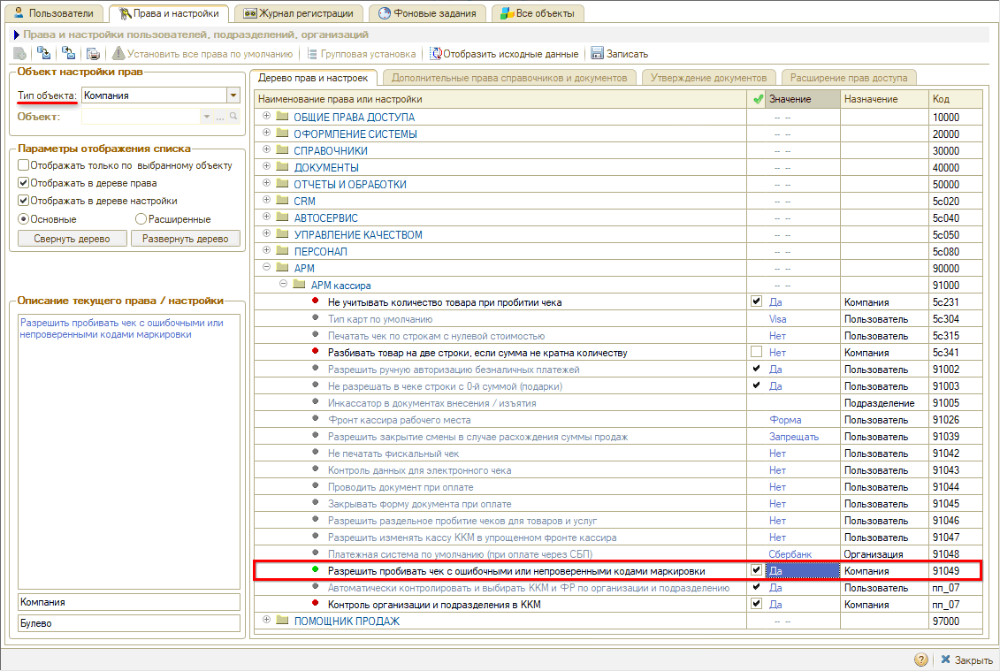

При установке в значение “Да” в случае обнаружения непроверенных или ошибочных кодов маркировки при пробитии чека будет открываться окно с предупреждением о выявлении ошибок при проверке кодов маркировки. При нажатии кнопки "ОК" будет открываться форма проверки кодов маркировки — подробнее см. *[в статье](../Операции%20с%20кодами%20маркировки/operacii-s-kodami-markirovki.md#predupr).*

При установке права в значение “Нет” чек пробиваться не будет, будет выходить сообщение об ошибке:

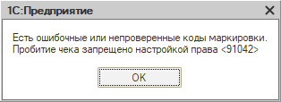

---

**Теги:** маркировка, честный знак, интеграция, api токен, токен ккт, настройка

