

# Операции с кодами маркировки

<table><tr><td><b>Время чтения:</b> 29 мин.</td><td><b>Обновлено:</b> 09.06.2026</td></tr></table>

Источник: https://www.5systems.ru/help/operacii-s-kodami-markirovki

> *Актуально начиная с версии релиза 5S AUTO **2.8.3**. Функционал индикации проверки "криптохвостов" – начиная с релиза **2.8.3.26**. Разрешительный режим — начиная с релиза **2.8.1**, реализация ТС ПИоТ — в релизе **2.8.3.58**. Функционал дорабатывается.*

## Содержание

1. [Введение](#введение)
2. [Работа с функционалом](#работа-с-функционалом)
   - [1. Поступление товаров](#1-поступление-товаров)
      - [1) Загрузка документа через ЭДО](#1-загрузка-документа-через-эдо)
      - [2) Сканирование кодов маркировки в документе](#2-сканирование-кодов-маркировки-в-документе)
      - [3) Статусы в списке документов](#3-статусы-в-списке-документов)
   - [2. Продажа маркированных товаров](#2-продажа-маркированных-товаров)
      - [1) Розничная реализация конечному покупателю (физлицу)](#1-розничная-реализация-конечному-покупателю-физлицу)
         - [Сканирование товаров](#сканирование-товаров)
         - [Пробитие чека с маркированными товарами](#пробитие-чека-с-маркированными-товарами)
         - [Разрешительный режим](#разрешительный-режим)
         - [Учет маркированных товаров в рамках заказ-наряда](#учет-маркированных-товаров-в-рамках-заказ-наряда)
         - [Возврат маркированных товаров](#возврат-маркированных-товаров)
      - [2) Продажа другому участнику оборота маркированных товаров](#2-продажа-другому-участнику-оборота-маркированных-товаров)
      - [3) Продажа организации или ИП для собственных нужд](#3-продажа-организации-или-ип-для-собственных-нужд)
   - [3. Вывод кодов маркировки из оборота](#3-вывод-кодов-маркировки-из-оборота)

## Введение

См. основную статью "[Маркировка товаров](../Маркировка%20товаров/markirovka-tovarov.md)", а также другие статьи в разделе Базы знаний "[Маркированные товары](../)".

Коды маркировки могут быть внесены в программу путем загрузки документов от поставщика через систему ЭДО, либо путем сканирования 2D-сканером или через веб-приложение [5S TSD](../../Склад%20и%20запчасти/Работа%20с%20приложением%205S%20TSD/rabota-s-prilozheniem-5s-tsd.md).

Сканирование кодов маркировки в программе предусмотрено на следующих этапах:

1. *Приемка товара от поставщика* – сканирование производится в документе “Поступление товаров” для сверки кодов маркировки, полученных через ЭДО и фактически поступивших. Когда покупатель подписывает УПД электронной подписью, документ автоматически отправляется в систему “Честный знак” оператором ЭДО, маркированные товары при этом меняют собственника – переходят на баланс покупателя.
2. *Реализация маркированных товаров покупателю* – сканирование производится в документах “Реализация товаров” или “Перемещение товаров в производство” (при реализации маркированных товаров через заказ-наряд) для избежания нарушений законодательства. В момент продажи маркированного товара конечному покупателю коды маркировки автоматически выводятся из оборота.

Отсутствие необходимой маркировки, а также ошибки, выявленные при проверке соответствия кода, приводят к [запрету продажи товара](http://publication.pravo.gov.ru/document/0001202311270058?index=45)[\*](#snoska-1). Попытка реализовать продукцию с проблемной маркировкой может привести к [штрафам](https://xn--80ajghhoc2aj1c8b.xn--p1ai/penalties/) и конфискации. Поэтому важно чтобы товар проходил проверку при вводе в систему с момента приемки.

*\*Примечание:* Программа не блокирует проведение документов и печать чеков без сканирования кодов маркировки (за исключением [разрешительного режима](#разрешительный-режим)), но только уведомляет продавца о проблемах с кодами маркировки в документе.

## Работа с функционалом

### 1. Поступление товаров

#### 1) Загрузка документа через ЭДО

Основной способ ввода кодов маркировки в программу – это загрузка документов через ЭДО.

Вместе с товарами от поставщика по ЭДО приходит универсальный передаточный документ (УПД), который содержит коды маркировки. Требуется проверить данный документ на предмет расхождений с фактическими кодами на продукции и, в зависимости от результатов проверки, утвердить или отклонить поступление.

*Примечание:* Документ с расхождениями можно согласовать и впоследствии сформировать универсальный корректировочный документ.

Когда покупатель подписывает УПД электронной подписью, документ автоматически отправляется в систему “Честный знак” оператором ЭДО, маркированные товары при этом меняют собственника – переходят на баланс покупателя.

#### 2) Сканирование кодов маркировки в документе

Для сверки требуется просканировать коды на товаре и сравнить с теми, которые получены в электронном УПД от поставщика – сравнение производится автоматически.

В случае если в документе "Поступление товаров" есть маркированные товары, то отображается колонка “Коды маркировки” с их количеством и индикацией проверки:

*Примечание:* Для маркированных товаров в карточке номенклатуры обязательно должен быть выбран тип номенклатуры с настроенными признаками ведения учета маркировки (см. в [статье](../Маркировка%20товаров/markirovka-tovarov.md#маркировка-в-номенклатурных-справочниках)), иначе столбец “Коды маркировки” не будет отображаться.

Индикаторы проверки кодов маркировки в документе свидетельствуют о соответствии количества и корректности статусов заполненных кодов – описание см. в статье “[Маркировка товаров](../Маркировка%20товаров/markirovka-tovarov.md#сканирование-кодов-маркировки-в-документе)”.

При клике на ячейку “Коды маркировки” в строке товара открывается таблица “Коды маркировки” с информацией обо всех кодах маркировки по данной товарной позиции:

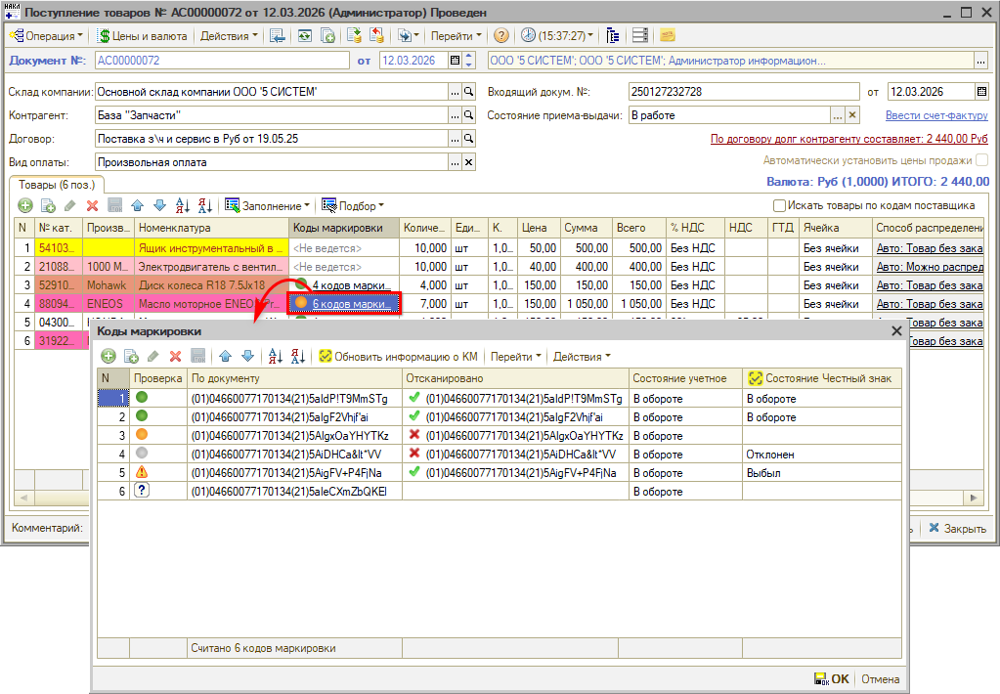

Плановые и фактические коды и их статусы должны совпадать между собой, от этого будет зависеть статус кода маркировки (см. в [статье](../Маркировка%20товаров/markirovka-tovarov.md#статусы-проверки-кодов)).

***Сканирование кодов маркировки*** *производится из открытой формы таблицы “Коды маркировки”* – при этом заполняются значения в колонках “Отсканировано” и “Состояние Честный знак”. В случае если фактический код маркировки не соответствует плановому, в таблицу добавляется новая строка, в которой заполняются сразу все колонки.

Также производится ***проверка крипточасти ("криптохвостов")*** кодов маркировки: в зависимости от результата проверки устанавливается индикатор   либо   *(начиная с версии релиза 2.8.3.26)* в столбце "Отсканировано" – см. в [статье](../Маркировка%20товаров/markirovka-tovarov.md#проверка-криптохвоста-кода-маркировки).

Подробнее см. в статье “[Маркировка товаров](../Маркировка%20товаров/markirovka-tovarov.md#сканирование-кодов-маркировки-в-документе)”.

#### 3) Статусы в списке документов

##### Состояния кодов маркировки

В реестре документов “Поступление товаров” отображается колонка “Состояния кодов маркировки”, в которой содержатся статусы соответствия состояний кодов маркировки:

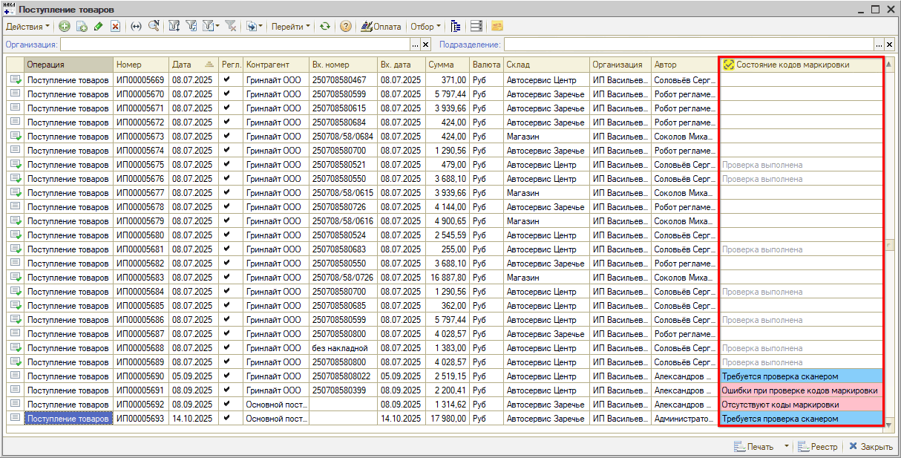

##### Отборы по статусам

Для удобства работы с документами с маркированными товарами есть возможность устанавливать *отборы по статусу документов:*

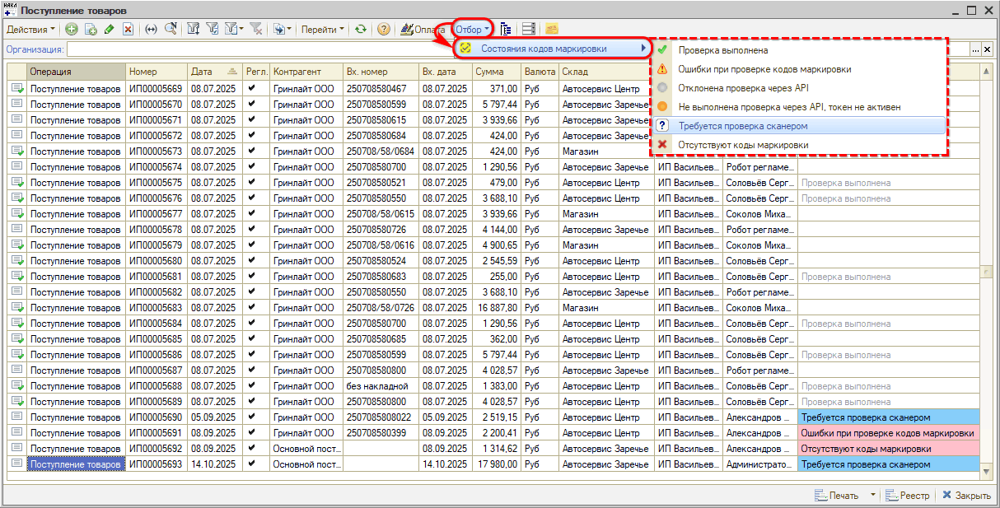

При установке отбора выводятся только документы с маркированными товарами, соответствующие указанному состоянию, при этом на кнопке установки отборов появляется отметка *"Отбор установлен":*

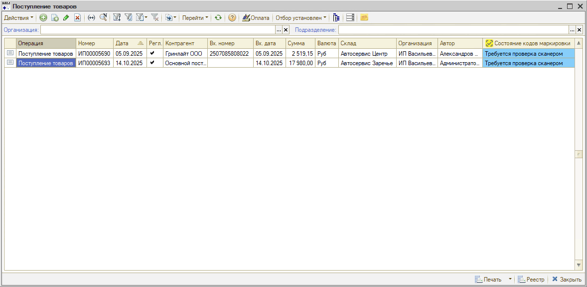

Для *снятия отбора* нужно снова нажать на ту же кнопку отбора либо на кнопку *"Отключить отбор":*

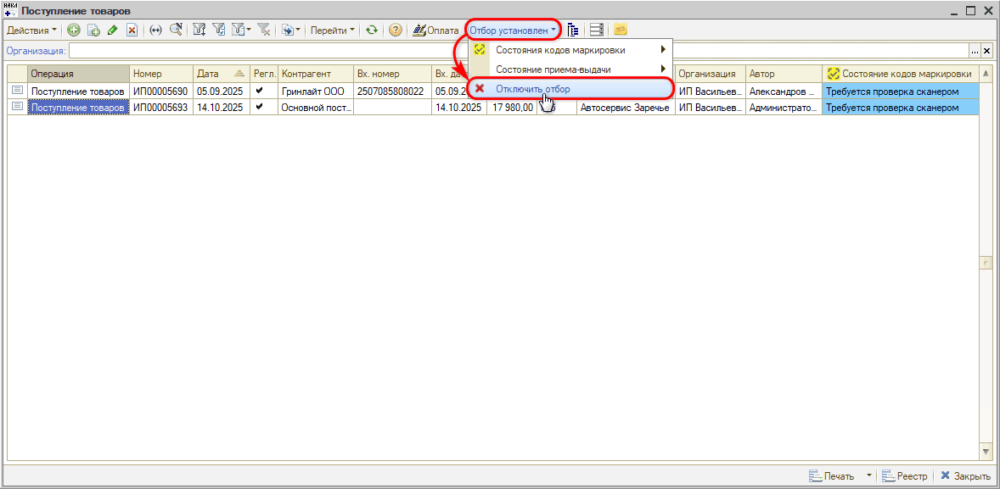

### 2. Продажа маркированных товаров

Коды маркировок в документах программы указываются только при операциях, списывающих товар со склада: например, при оформлении заказа покупателя или резервирования товаров коды НЕ указываются, они указываются только при фактической продаже и выдаче товара на руки клиенту или отправки товаров заказчику – например, в документе “Реализация товаров”.

#### 1) Розничная реализация конечному покупателю (физлицу)

В случае продажи товара через кассу конечному розничному покупателю товары автоматически списываются через ККТ и ОФД с использованием специального режима онлайн-проверки кодов маркировки.

Если по данным из системы маркировки продажа товара разрешена, то пробивается чек, а если запрещена, то программа уведомляет об этом продавца[\*](#snoska-2). В случае успешного пробития чека с кодами маркировки они автоматически фиксируются в “Честном знаке” как проданные, маркированный товар выбывает из оборота.

*\*Примечание:* Программа не запрещает проведение документов и пробитие чека без проверки кодов маркировки (за исключением [разрешительного режима](#разрешительный-режим) для шин).

##### Сканирование товаров

В случае продажи маркированных товаров физическим лицам используются документы “Заказ покупателя” и “Реализация товаров”. Для оформления документа “Заказ покупателя” на маркированные товары заполнение кодов маркировки не требуется.

Работа с кодами маркировки производится в документе “Реализация товаров”:

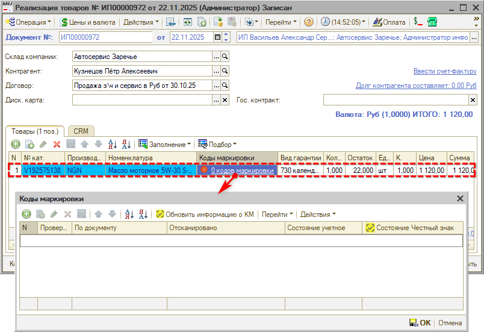

При сканировании кода маркировки товара в таблицу “Коды маркировки” добавляется новая строка с заполненными значениями в колонках “По документу” и “Отсканировано”, а также через API подтягивается статус в колонку “Состояние Честный знак”.

После проведения реализации заполняется *“Состояние учетное”:* значение “Продан”.

Так же, как при работе с документами поступления товаров, в "Реализации" устанавливаются следующие *статусы проверки кодов маркировки:*

- индикаторы проверки кодов маркировки в документе – см. в [статье](../Маркировка%20товаров/markirovka-tovarov.md#сканирование-кодов-маркировки-в-документе);
- статусы проверки в таблице “Коды маркировки” – см. в [статье](../Маркировка%20товаров/markirovka-tovarov.md#статусы-проверки-кодов);
- состояния кодов маркировки в реестре документов – см. [выше](#3-статусы-в-списке-документов).

*Действия с кодами маркировки* в таблице “Коды маркировки” также аналогичны работе с поступлениями – см. в [статье](../Маркировка%20товаров/markirovka-tovarov.md#действия-с-кодами-маркировки): есть возможность редактировать, удалять коды маркировок или добавлять новые.

Если количество отсканированных кодов маркировки будет больше, чем количество товара, указанное в документе, то после завершения редактирования кодов маркировки количество товара будет установлено по количеству кодов маркировки.

При повторном сканировании той же самой маркировки будет выведено предупреждение, и список кодов маркировки останется без изменений.

##### Пробитие чека с маркированными товарами

***Проверка кодов маркировки на ККТ***

Во время приема оплаты по документу, в котором присутствуют маркированные товары, в [упрощенном Фронте кассира](../../Касса/Упрощенный%20Фронт%20кассира/uproschennyy-front-kassira.md) в *проекте чеков на оплату* отображается логотип “Честного знака”. В случае если в документе продажи содержатся коды с *непроверенными или ошибочными криптохвостами* (индикатор ), при пробитии чека программа выведет окно с предупреждением:

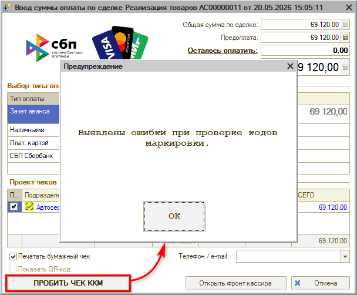

При нажатии кнопки "ОК" открывается форма проверки кодов маркировки со списком непроверенных или ошибочных кодов:

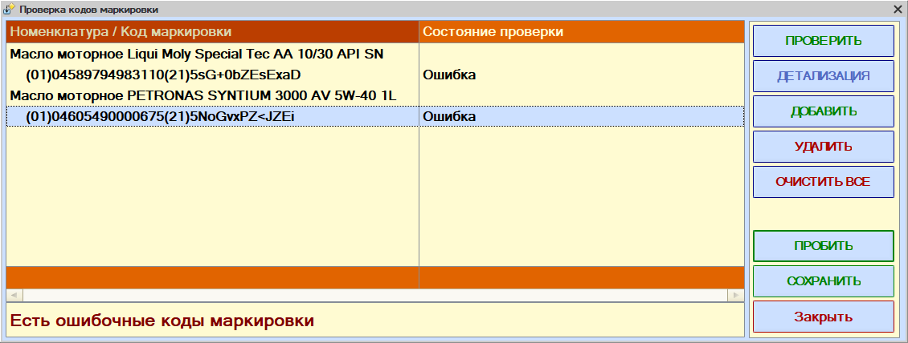

Результат проверки на ККТ отображается в колонке "Состояние проверки". Для повторного запуска проверки кодов можно нажать кнопку *“Проверить”.* Есть возможность посмотреть расшифровку результата – для этого нужно нажать кнопку *“Детализация”.* После этого рекомендуется закрыть данную форму, вернуться на шаг назад и по возможности устранить проблемы с ошибочными кодами в документах продажи.

***Документ Чек на оплату***

При успешном *пробитии чека на передачу товара* из документа “Реализация товаров” формируется документ “Чек на оплату”. В документе отображаются маркированные товары, по которым принимается оплата:

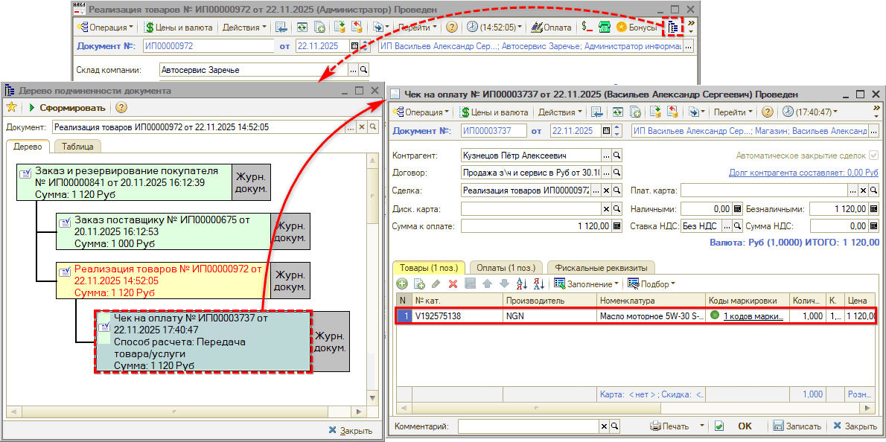

*Внимание!* Индикация в чеке на оплату устанавливается только по соответствию количества введенных кодов в таблице “Коды маркировки”. При этом коды могут быть не проверены сканером, либо с несовпадающими состояниями – в этом случае документы в программе могут быть проведены, но при печати чека выйдет ошибка.

*Примечание:* В чеке на *предоплату* маркировка товара не указывается. Товары остаются в обороте до тех пор, пока не будет выбит *кассовый чек передачи товаров.* Т.е. продажа маркированных товаров фиксируется в программе, если на вкладке “Фискальные реквизиты” указан способ расчета “Передача товара/услуги”:

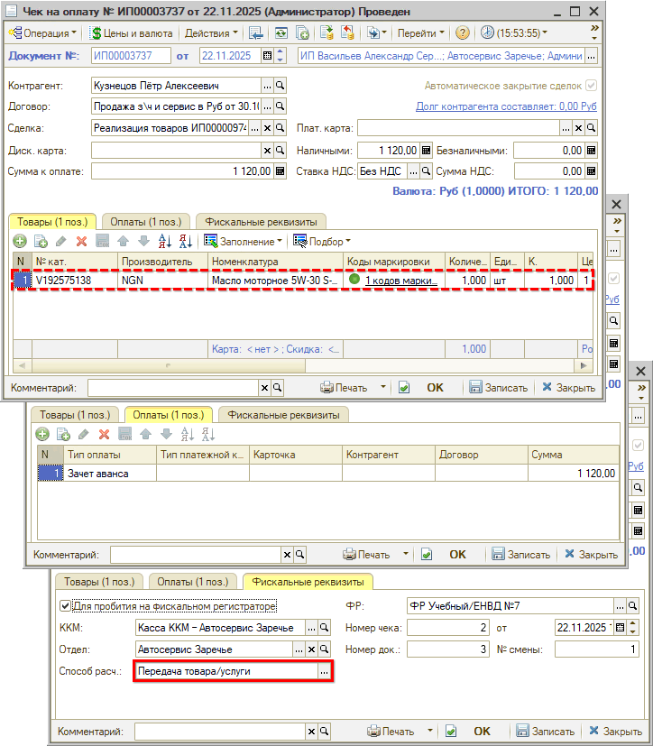

В случае зачета предоплаты на вкладке “Оплаты” при пробитии чека должен быть отражен зачет аванса на всю сумму предоплаты.

В кассовом чеке будут распечатаны коды маркировок, внесенные в документе реализации.

***Маркировка в кассовом чеке***

В печатном чеке ККМ обозначение [М] указывает на то, что товар подлежит обязательной маркировке.

Значения в чеках могут быть следующими:

- [М+] означает, что проверка в системе маркировки прошла успешно.
- [М] означает, что проверка не была выполнена в ГИС МТ.
- [М-] означает, что товар прошел проверку с отрицательным результатом.

Данные обозначения введены в соответствии с приказом ФНС России от 14.09.2020 [N ЕД-7-20/662@](http://publication.pravo.gov.ru/Document/View/0001202012100013).

*Примечание:* Обязательно должен быть ФФД 1.2.

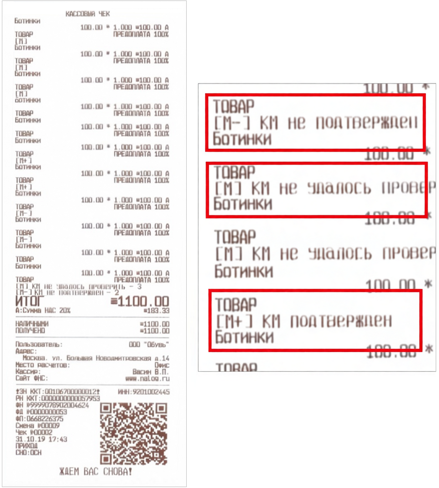

Проверка производится по следующим этапам:

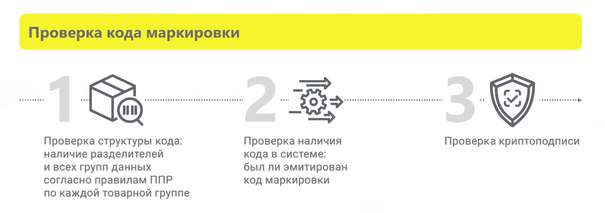

1. Проверка структуры кода маркировки;
2. Проверка наличия кода в системе (был ли эмитирован);
3. Проверка криптоподписи.

Если хотя бы одно условие не выполнено, то код маркировки считается некорректным.

*Внимание!* В случае если код маркировки прошел проверку (успешно выполнены все этапы), то система маркировки всегда считает, что статус товара верный.

*Расшифровка обозначений:*

**[М+]**: Успешная проверка. Это означает, что проверки прошли успешно и код маркировки подтвержден системой "Честный ЗНАК".

*Примечание:* При этом товар может быть: без нанесения, не введен в оборот, выведен из оборота, заблокирован по решению органа власти или с истекшим сроком годности.

**[М]**: Проверить код не удалось или проверка не проводилась (либо запрос на проверку не был отправлен, либо ответ на запрос не был получен, иначе был бы М+ или М-). Такое может произойти, если касса временно не имела подключения к интернету для связи с системой маркировки.

**[М-]**: Отрицательный результат проверки, значит минимум 1 из 3 проверок завершилась неуспешно. Показатель наличия технических проблем, в результате которых статус товара вернулся с ошибкой – например, отсутствие интернета, подключения к сервису ОФД или проблемы со сканером.

Код маркировки в кассовом чеке со значением [М–] НЕ означает, что товар проблемный или нелегальный, а указывает, что нужно исправить ошибку:

1) Проверить, переведен ли сканер в режим COM-порта и подключен ли через драйвер 
2) Проверить связь с ОИСМ 
3) Проверить подключение к ОФД и т.д.

##### Разрешительный режим

***Разрешительный режим*** – это обязательная онлайн/офлайн проверка кода маркировки в системе “Честный знак” при продаже товара на кассе перед пробитием чека на ККТ. С 1 ноября 2024 г. *онлайн-проверка* в разрешительном режиме *обязательна* при продаже *шин* (в соответствии с требованием [ПП РФ от 21.11.2023 № 1944](http://publication.pravo.gov.ru/document/0001202311270058)). С 1 октября 2026 г. — становится [обязательной](https://xn--80ajghhoc2aj1c8b.xn--p1ai/business/projects/autofluids/checkout/) для *моторных масел* (автомобильных жидкостей и смазочных материалов).

*Примечание:* Проверить сроки введения обязательной проверки для товарных групп можно на [сайте «Честного знака»](https://xn--80ajghhoc2aj1c8b.xn--p1ai/) *(→ блок “Что необходимо маркировать” → перейти в нужную категорию товаров → найти вкладку “Разрешительный режим”),* а также на сайте сообщества «Честный знак» в разделе “[Разрешительный режим на кассах](https://markirovka.ru/community/rezhim-proverok-na-kassakh/rezhim-proverok-na-kassakh)”.

С 1 марта 2025 г. также [обязательна](https://markirovka.ru/knowledge/tovarnye-gruppy/molochnaya-produkciya/trebovaniya-k-uchastniku-dlya-realizatsii-zapretitelnogo-rezhima-onlayn-oflayn) проверка в *офлайн-режиме* — в ситуациях, когда онлайн-связь с ГИС МТ временно недоступна (см. материалы на сайте «Честного знака»: [Офлайн проверка на кассах. ЛМ ЧЗ](https://markirovka.ru/community/rezhim-proverok-na-kassakh/oflayn-proverka-na-kassakh-lokalnyy-modul-chz), [Требования для реализации разрешительного режима онлайн / офлайн](https://markirovka.ru/knowledge/tovarnye-gruppy/molochnaya-produkciya/trebovaniya-k-uchastniku-dlya-realizatsii-zapretitelnogo-rezhima-onlayn-oflayn)). В этом случае решение о продаже товара с маркировкой принимается на основании информации из локальной базы данных, при восстановлении связи данные автоматически отправляются ОФД и в «Честный знак».

Ранее разрешительный режим в 5S AUTO был реализован через API с использованием *токена ККТ.* С 28 декабря 2025 г. (согласно ППР № [515](https://xn--80ajghhoc2aj1c8b.xn--p1ai/upload/1201905060041.pdf) и [303](https://xn--80ajghhoc2aj1c8b.xn--p1ai/upload/1202003230014.pdf)) введено требование установки единого ПО — ***ТС ПИоТ*** (см. статью "[Подключение ТС ПИоТ](../Настройка%20интеграции%20с%20ТС%20ПИоТ,%20ЕСМ%20и%20ЛМ%20ЧЗ/Настройка%20интеграции%20с%20ТС%20ПИоТ/nastroyka-integracii-s-ts-piot.md)"). До 1 июля 2026 г. [работает переходный период](https://xn--80ajghhoc2aj1c8b.xn--p1ai/info/news/vazhno-obyazatelno-ustanovite-modul-ts-piot/).

***Как работает разрешительный режим***

В разрешительном режиме кассовое ПО обращается к системе «Честный Знак» по каждому коду маркировки перед пробитием чека. Если по данным из системы маркировки продажа товара разрешена, то пробивается чек, а если запрещена, то программное обеспечение уведомляет об этом продавца, и касса блокирует продажу.

Как выглядит продажа товара с разрешительным режимом:

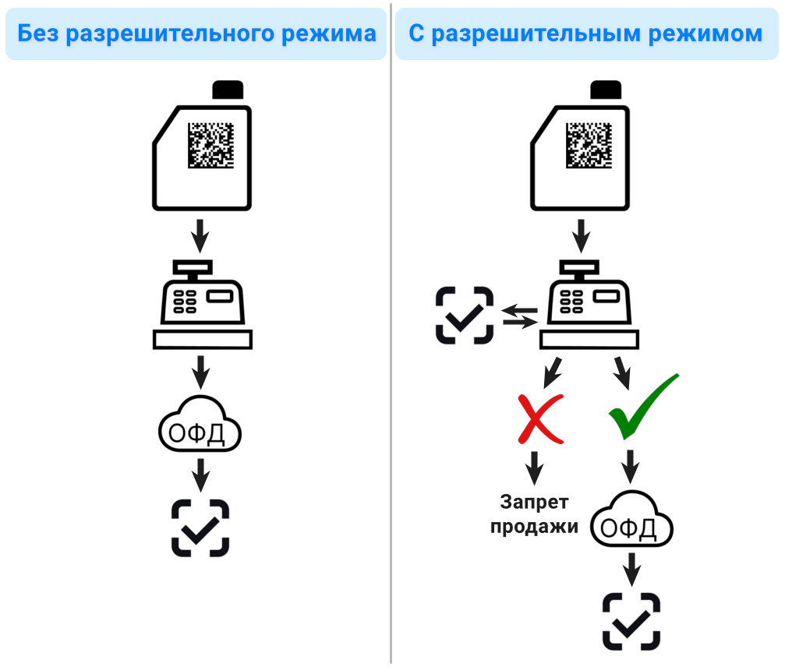

1. Продавец сканирует код маркировки
2. Касса отправляет данные в “Честный знак” (или сверяет со своей офлайн-базой, если онлайн-проверка невозможна по техническим причинам)
3. Система проверяет код
4. Если код не прошел проверку – запрет продажи. Если проверка пройдена – пробивается кассовый чек
5. Касса отправляет сведения о продаже оператору фискальных данных
6. ОФД информирует “Честный знак”. Код маркировки выбывает из оборота

Проверка в разрешительном режиме работает в программе только для товаров с признаком "*Использовать разрешительный режим"* в типе номенклатуры (см. в [статье](../Настройка%20интеграции%20с%20Честным%20знаком/nastroyka-integracii-s-chestnym-znakom.md#razresh_rezh)). Также должны быть установлены признаки "Ведется маркировка с" и "Обязательная маркировка".

*Важно!* Коды маркировки товаров необходимо вносить в программу исключительно путем их сканирования. При ручном введении кода затирается криптохвост, и проверка от «Честного знака» становится неосуществимой.

В случае если при пробитии чека код маркировки не прошел проверку, выходит окно с предупреждением о выявленных ошибках:

При нажатии кнопки "ОК" открывается форма проверки кодов маркировки со списком непроверенных или ошибочных кодов. На нижней панели отображается статус – “Есть непроверенные коды маркировки” или "Есть ошибочные коды маркировки":

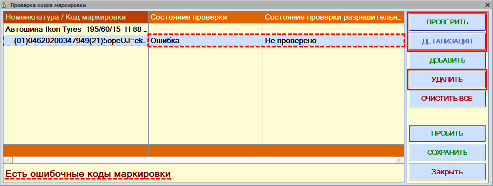

Результат проверки отображается в двух колонках:

1. *“Состояние проверки”* – результат проверки *на ККТ* (результат “Ошибка”).
2. *“Состояние проверки разрешительного режима”* – результат проверки по “Честному знаку”. Данная колонка отображается только для товаров с *признаком "Использовать разрешительный режим"* в *типе номенклатуры* (см. в [статье](../Настройка%20интеграции%20с%20Честным%20знаком/nastroyka-integracii-s-chestnym-znakom.md#uchet_markir)).

Для повторного запуска проверки кодов можно нажать кнопку *“Проверить”.* Есть возможность посмотреть расшифровку результата – для этого нужно нажать кнопку *“Детализация”.* После этого рекомендуется закрыть данную форму, вернуться на шаг назад и по возможности устранить проблемы с ошибочными кодами в документах продажи. При обнаружении ошибок пробить чек будет невозможно.

Продажа товаров с маркировкой запрещается в следующих случаях:

- в системе маркировки отсутствует информация о коде маркировки на товаре;
- в системе отсутствует информация о нанесении кода маркировки на товар, а также о вводе в оборот;
- товар с таким кодом маркировки ранее уже был выведен из оборота;
- истек срок годности товара;
- товар заблокирован по решению органа государственной власти;
- некорректный результат проверки криптографической подписи (кода проверки).

В результате выявления данных ошибок следует сначала объяснить покупателю, что продать данный товар невозможно и предложить замену. Затем следует самостоятельно, с привлечением поставщика, либо с помощью поддержки “Честного знака” постараться решить проблему.

##### Учет маркированных товаров в рамках заказ-наряда

В случае использования в заказ-наряде маркированных товаров сканирование кодов маркировки производится в документе “Перемещение товаров в производство”, который создается на основании заказ-наряда:

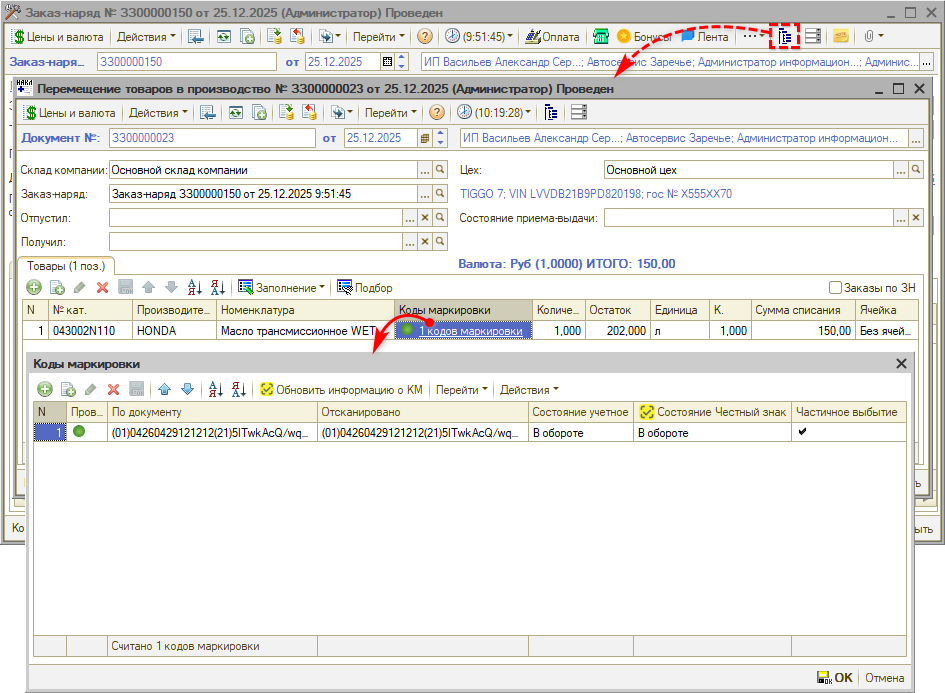

Работа с кодами маркировки производится в таблице “Коды маркировки” аналогично документу “Реализация товаров” – см. [выше](#сканирование-товаров).

Так же, как при работе с документами поступления товаров и реализации, в документе “Перемещение товаров в производство” устанавливаются следующие *статусы проверки кодов маркировки:*

- индикаторы проверки кодов маркировки в документе – см. в [статье](../Маркировка%20товаров/markirovka-tovarov.md#сканирование-кодов-маркировки-в-документе);
- статусы проверки в таблице “Коды маркировки” – см. в [статье](../Маркировка%20товаров/markirovka-tovarov.md#статусы-проверки-кодов);
- состояния кодов маркировки в реестре документов – см. [выше](#3-статусы-в-списке-документов).

*Действия с кодами маркировки* в таблице “Коды маркировки” также аналогичны работе с поступлениями и реализациями – см. в [статье](../Маркировка%20товаров/markirovka-tovarov.md#действия-с-кодами-маркировки): есть возможность редактировать, удалять коды маркировок или добавлять новые.

При перемещении маркированных товаров между заказ-нарядами в документе “Перемещение незавершенного производства” следует указывать коды маркировок этих товаров. При возврате маркированных товаров на склад в документе “Извлечение товаров из производства” также требуются коды маркировки. При проведении этих документов осуществляется проверка того, что товары с указанными кодами маркировок были перемещены в производство ранее.

В самом документе “Заказ-наряд” колонка “Коды маркировки” выводится *для справки.* Есть возможность открыть форму “Коды маркировки” для просмотра, но она заблокирована для редактирования, сканирование кодов маркировки из заказ-наряда не производится:

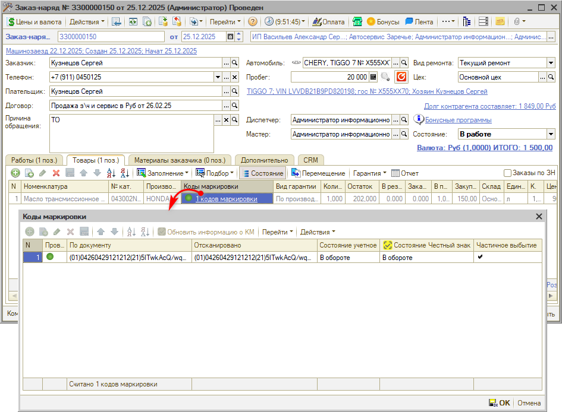

##### Возврат маркированных товаров

Оформление возврата маркированного товара от клиента производится с помощью документов “Возврат товаров от покупателя” или “Корректировка реализации”, вводимых на основании “Реализации товаров” или “Заказ-наряда”. Кроме этого, возможно пробитие возврата напрямую из Чека на оплату. Также см. раздел “[Возврат](../../Касса/Порядок%20работы%20с%20кассами%20ККМ/poryadok-raboty-s-kassami-kkm.md#возврат)” в статье “[Порядок работы с кассами ККМ](../../Касса/Порядок%20работы%20с%20кассами%20ККМ/poryadok-raboty-s-kassami-kkm.md)”.

Перед возвратом маркированного товара в оборот необходимо проверять, был ли данный код на балансе Вашей компании: при пробитии возврата программа предупредит, если данного кода не было в чеке на оплату. Например, товар с некорректным кодом может возвращать покупатель по ошибке либо недобросовестный участник оборота кодов маркировки. Осуществление возврата в оборот товара, который ранее не принадлежал компании, может привести к *штрафу* (см. статью *“[За что можно получить штрафы](https://xn--80ajghhoc2aj1c8b.xn--p1ai/penalties/)” → п. 11* на сайте Честного знака).

Процесс возврата в оборот маркированного товара зависит от состояния кода маркировки на упаковке:

1. если код сохранился, то при возврате его сканируют и возвращают товар в оборот;
2. если код не сохранился, то возврат от покупателя производится без указания маркировки, затем выполняется процедура перемарикровки, и товар возвращается в оборот.

**1. Маркировка на упаковке товара сохранилась**

Если код маркировки на товаре читаемый, и его можно будет снова отсканировать при продаже товара, то при оформлении возврата следует в документе “Возврат товаров от покупателя” отсканировать код маркировки. По данному документу следует пробить чек возврата со способом расчета “Передача товара/услуги”.

При пробитии чека формируется документ “Возврат по чеку на оплату” с кодом маркировки, товар автоматически возвращается в оборот, информацию о возврате маркировки в оборот ОФД передает в ГИС МТ.

Сканирование производится в таблице “Коды маркировки”, открытой через документ возврата или через Фронт кассира:

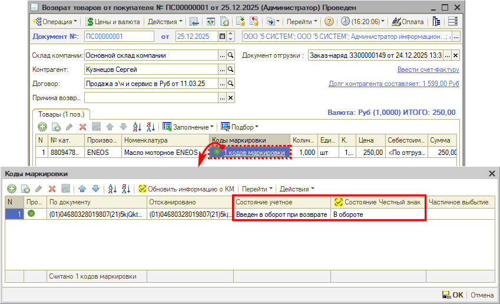

После проведения возврата и пробития чека заполняются состояния кодов маркировки: учетное – *“Введен в оборот при возврате”,* состояние Честный знак – *“В обороте”.*

При пробитии возврата производится *проверка корректности кода маркировки.* В момент сканирования кода программа проверяет, был ли такой код маркировки в Чеке на оплату, на основании которого вводится возврат. Если такого кода в чеке не было – выходит *предупреждение программы,* ввести некорректный код для пробития возврата не получится:

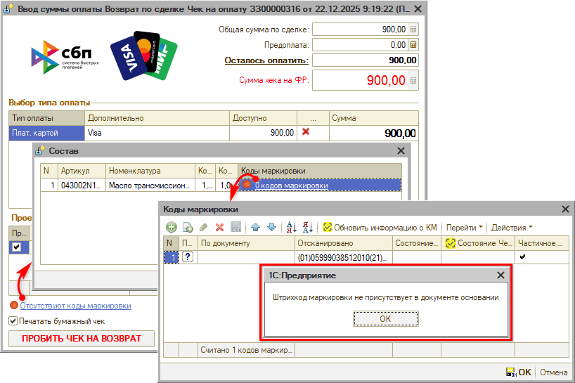

**2. Маркировка на упаковке товара не сохранилась**

В этом случае возврат товаров производится без указания маркировки. Для возврата в оборот маркированного товара необходимо заказать новый код маркировки через личный кабинет в системе “Честный знак” и осуществить перемаркировку.

Также см. статьи на сайте Честного знака:

- [Возврат маркированного товара](https://markirovka.ru/knowledge/fast_start/start/vozvrat-markirovannogo-tovara)
- [Инструкция по предоставлению сведений о возврате товаров в оборот в ГИС МТ](https://xn--80ajghhoc2aj1c8b.xn--p1ai/business/doc/?id=%D0%92%D0%BE%D0%B7%D0%B2%D1%80%D0%B0%D1%82_%D0%B2_%D0%BE%D0%B1%D0%BE%D1%80%D0%BE%D1%82.html)

#### 2) Продажа другому участнику оборота маркированных товаров

В случае, если покупатель – юр. лицо или ИП – является участником оборота маркированных товаров, и приобретает маркированные товары для дальнейшей реализации данной продукции (не для производственных или личных нужд), то коды маркировок не выбывают из оборота, а меняют собственника. Передача маркированных товаров на баланс другой компании должна быть зафиксирована в системе “Честный знак”.

Могут быть следующие варианты продажи маркированных товаров между двумя компаниями и/или ИП:

1. *Продажа через безналичный банковский перевод*

   В данном случае вместе с документом “Заказ-наряд” или “Реализация товаров” оформляется электронный УПД (универсальный передаточный документ) с маркированными товарами и передается через ЭДО контрагенту.

   В момент второй подписи УПД клиентом-юридическим лицом маркированные товары списываются с баланса продавца и передаются на баланс компании-покупателя.

   На портале ГИС МТ будет автоматически сформирован документ “ЭДО Исходящие” (“ЭДО Входящие” у получателя соответственно).

   После передачи маркированных товаров покупатель-юридическое лицо может их впоследствии перепродавать другим организациям или физическим лицам. Также покупатель-юридическое лицо может использовать маркированные товары для собственных нужд, и в этом случае обязанность корректно оформлять списание товаров остается за покупателем.

2. *Продажа через кассу*

   В случае продажи маркированного товара юр. лицу или ИП через кассу для дальнейшей реализации необходимо, чтобы в кассовом чеке был заполнен реквизит “ИНН покупателя (клиента)”. Тогда при пробитии чека будет зафиксирована передача кодов маркировки на баланс другого участника оборота.

*Примечание:* Вывод маркированного товара из оборота при этом не осуществляется, продукция переходит в собственность покупателя для дальнейшей реализации. При этом если оптовая продажа осуществляется посредством ККТ, то формирование УПД необязательно.

#### 3) Продажа организации или ИП для собственных нужд

В случае если покупатель-юридическое лицо является участником оборота, имеет смысл передавать клиенту товары в собственность с помощью ЭДО (см. [выше](#2-продажа-другому-участнику-оборота-маркированных-товаров)). В данном случае клиент самостоятельно отвечает за последующий корректный вывод маркированных товаров из оборота, как для перепродажи, так и для собственных нужд.

В случае, если покупатель – юр. лицо или ИП – *не является участником оборота* маркированных товаров, и приобретает маркированные товары для производственных или личных нужд (а не для дальнейшей реализации), т.е. является конечным потребителем, то маркированные товары должны быть выведены из оборота при продаже, а не передаваться на баланс компании-покупателя.

В данном случае могут быть следующие варианты продажи маркированных товаров:

1. *Продажа через безналичный банковский перевод*

   В данном случае должен быть оформлен УПД, в котором указывается причина выбытия “Использование для собственных нужд”.

   *Примечание:* В УПД должен быть заполнен признак выбытия в поле <СвВыбытияМАРК>, на основании чего в ГИС МТ фиксируется перемещение кодов от продавца на покупателя и вывод кодов из оборота. Если поле <СвВыбытияМАРК> не заполнено, то при поступлении УПД осуществляется только перемещение кодов на покупателя, вывод кодов из оборота не осуществляется.

   УПД с выводом из оборота можно направить участнику, не зарегистрированному в системе, с помощью стороннего ЭДО. Для покупателя регистрация в “Честном знаке” не обязательна, главное, чтобы УПД был подписан покупателем в ЭДО.

2. *Продажа через кассу*

   При продаже маркированных товаров через кассу в случае, если компания-покупатель не является участником оборота маркированных товаров, или если товары приобретаются для собственных или производственных нужд компании (а не для дальнейшей реализации), указывать ИНН покупателя в чеке не нужно.

Для отражения в программе продажи с выводом кодов маркировки на собственные нужды покупателя требуется в документе продажи (Заказ-наряде или Реализации товаров) перейти на вкладку *“Дополнительно”* и в разделе *“Маркировка товаров”* указать причину вывода *“Использование для собственных нужд”.* Также необходимо проверить, чтобы у [контрагента](../../Работа%20с%20клиентами/Контрагенты%20и%20контакты/kontragenty-i-kontakty.md) был заполнен ИНН:

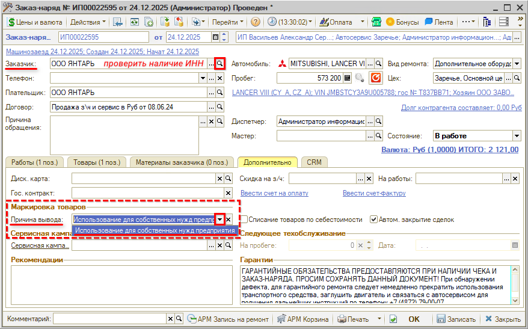

При закрытии заказ-наряда будет создаваться документ *“Вывод из оборота”,* в который будет подтягиваться указанная причина вывода (см. в статье "[Вывод кодов маркировки из оборота](../Вывод%20кодов%20маркировки%20из%20оборота/vyvod-kodov-markirovki-iz-oborota.md#причины-вывода-в-документе-продажи)").

### 3. Вывод кодов маркировки из оборота

Основные способы *выбытия товаров с кодом маркировки* с баланса компании – это продажа через ККМ конечному покупателю или передача через ЭДО другому участнику оборота.

В *остальных случаях* продавец должен *самостоятельно отражать **выбытие кодов маркировки из оборота**.* Например, в случае использования товара для собственных нужд, продажи без отражения товара в чеке ККМ или передачи через ЭДО, утилизации товара, списания "зависших" в переходный период кодов маркировки и др. Сведения о выводе маркированных товаров из оборота при этом должны быть переданы в систему ГИС МТ не позднее 3 рабочих дней, следующих за днем выбытия (в соответствии с [ППРФ от 30.11.2024 №1683](https://xn--80ajghhoc2aj1c8b.xn--p1ai/upload/%D0%9F%D0%9F%D0%A0%D0%A4%20%D0%BE%D1%82%2030%20%D0%BD%D0%BE%D1%8F%D0%B1%D1%80%D1%8F%202024%20%E2%84%96%201683.pdf), п. 112-113).

Для отражения таких операций во внутреннем учете, а также для автоматизации отражения выбытия маркированных товаров из оборота в системе “Честный Знак” в программе предусмотрен *документ **“Вывод из оборота”**,* который можно выгрузить в “Честный Знак” через API либо путем формирования файла.

Подробнее см. в *отдельной статье "[Вывод кодов маркировки из оборота](../Вывод%20кодов%20маркировки%20из%20оборота/vyvod-kodov-markirovki-iz-oborota.md)".*

---

**Теги:** маркировка, коды маркировки, честный знак, поступление, реализация, возврат, эдо

