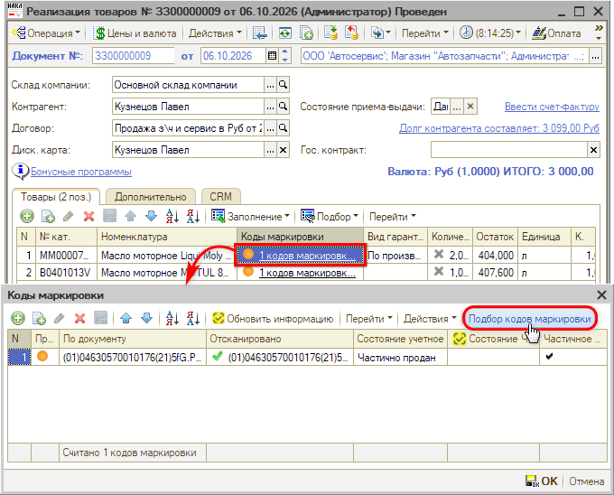
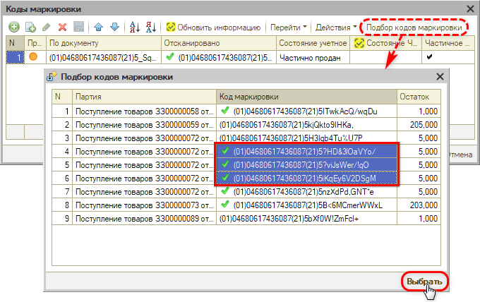
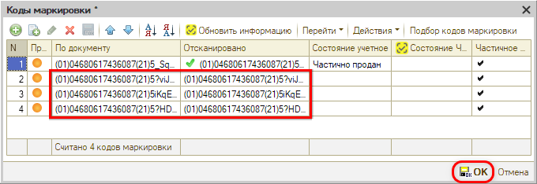
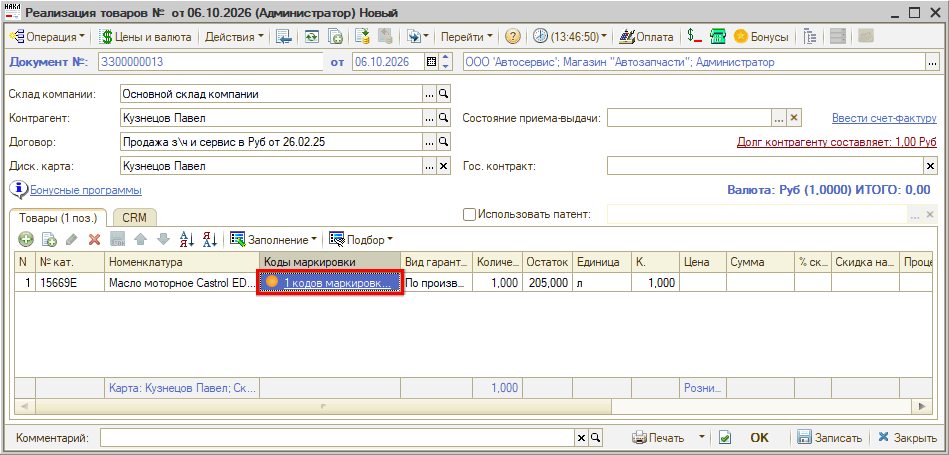
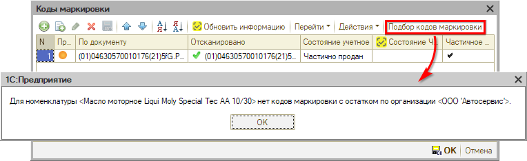

# Подбор и автоподстановка кодов маркировки

<table><tr><td><b>Время чтения:</b> 8 мин.</td><td><b>Создано:</b> 07.10.2026</td></tr></table>

> *Актуально начиная с версии релиза 5S AUTO **2.8.5**.*

> *Статья редактируется, релиз готовится к выходу.*

## Содержание

- [Введение](#введение)
- [Настройки](#настройки)
- [Подбор кодов маркировки](#подбор-кодов-маркировки)
  - [Какие коды попадают в подбор](#какие-коды-попадают-в-подбор)
- [Автоподстановка кода маркировки](#автоподстановка-кода-маркировки)
- [Ограничения и сообщения программы](#ограничения-и-сообщения-программы)

## Введение

Если маркированный товар уже принят и его коды маркировки числятся в программе за организацией, то при расходе товара коды можно не сканировать повторно:

- ***подбор кодов маркировки*** – код выбирается из списка кодов маркировки номенклатуры, которые есть в остатке по организации документа;
- ***автоподстановка кода маркировки*** – если у номенклатуры есть ровно один доступный код, программа сама подставит его в строку документа.

Подбор работает в документах *«Реализация товаров»*, *«Перемещение товаров в производство»* и *«Вывод из оборота»*, автоподстановка – в этих документах и в *«Заказ-наряде»*. В заказ-наряде форма «Коды маркировки» открывается только для просмотра (см. статью «[Операции с кодами маркировки → Учет маркированных товаров в рамках заказ-наряда](../Операции%20с%20кодами%20маркировки/operacii-s-kodami-markirovki.md#учет-маркированных-товаров-в-рамках-заказ-наряда)»). Данные берутся из программы – запросы в «Честный знак» при этом не выполняются.

Прежний способ – сканирование кодов маркировки – сохраняется и работает как раньше (см. статью «[Маркировка товаров → Сканирование кодов маркировки](https://kb.5systems.ru/articles/5s-auto/markirovka/markirovka-tovarov#сканирование-кодов-маркировки)»).

*Также рекомендуем для изучения статьи:*

- [Операции с кодами маркировки](https://kb.5systems.ru/articles/5s-auto/markirovka/operacii-s-kodami-markirovki);
- [Вывод кодов маркировки из оборота](https://kb.5systems.ru/articles/5s-auto/markirovka/vyvod-kodov-markirovki-iz-oborota);
- [Частичное выбытие маркированного товара](https://kb.5systems.ru/articles/5s-auto/markirovka/chastichnoe-vybytie-markirovannogo-tovara).

## Настройки

Отдельных настроек и прав для подбора и автоподстановки нет – они доступны всем пользователям, которые могут редактировать коды маркировки в документе.

Для работы функционала необходимо:

- в карточке номенклатуры указан тип номенклатуры с признаком *«Ведется маркировка»* (см. статью «[Настройка интеграции с Честным знаком → Настройка справочников номенклатуры](https://kb.5systems.ru/articles/5s-auto/markirovka/nastroyka-integracii-s-chestnym-znakom#1-настройка-справочников-номенклатуры)»);
- в документе заполнена *организация*;
- для автоподстановки – заполнен *склад компании:* по нему проверяется остаток товара на дату документа (движения самого документа в остатке не учитываются). В документе «Вывод из оборота» склада нет, поэтому остаток проверяется по всем складам организации документа.

Для товаров с *частичным выбытием* (например, масло на розлив) доступность кода определяется по остатку в упаковке – по настройкам частичного выбытия в карточке номенклатуры (см. статью «[Частичное выбытие маркированного товара → Настройки](https://kb.5systems.ru/articles/5s-auto/markirovka/chastichnoe-vybytie-markirovannogo-tovara#настройки)»).

## Подбор кодов маркировки

**1.** Откройте документ «Реализация товаров», «Перемещение товаров в производство» или «Вывод из оборота», заполните шапку и табличную часть *«Товары»*.

**2.** Запишите документ. Если документ еще не записан, при открытии формы кодов маркировки программа предложит его записать: *«Перед вводом кодов маркировки необходимо записать документ. Записать?»*.

**3.** В строке маркированного товара нажмите на ссылку в колонке *«Коды маркировки»* – откроется форма «Коды маркировки».

**4.** Нажмите кнопку ***«Подбор кодов маркировки»*** на панели формы «Коды маркировки»:

**5.** В открывшейся форме *«Подбор кодов маркировки»* отметьте нужные коды – можно выбрать несколько, удерживая клавишу ***Ctrl*** или ***Shift***:

В форме «Подбор кодов маркировки» отображаются:

- ***Партия*** – документ, которым код введен в оборот по организации документа, чаще всего «Поступление товаров». Может быть пустой, если документ поступления по этой организации не найден;
- ***Код маркировки*** – код без криптохвоста, вида *(01)GTIN(21)серийный номер*;
- ***Остаток*** – сколько товара числится по этому коду: для штучного товара обычно 1, для упаковки с частичным выбытием – остаток в упаковке.

Зеленая галочка у кода означает, что проверка криптохвоста кода пройдена успешно (см. статью «[Маркировка товаров → Проверка криптохвоста кода маркировки](https://kb.5systems.ru/articles/5s-auto/markirovka/markirovka-tovarov#проверка-криптохвоста-кода-маркировки)»).

**6.** Нажмите ***«Выбрать»*** или дважды щелкните по строке – форма подбора закроется, и коды добавятся в форму «Коды маркировки»:

**7.** Нажмите ***«ОК»*** в форме «Коды маркировки», затем запишите или проведите документ.

Колонка *«Отсканировано»* заполняется только для кодов, которые раньше сканировали, например, при поступлении товара.

> [!NOTE]
> Если подобранный код уже есть в колонке *«По документу»*, строка не дублируется.

> 🛠 Комментарий для черновика: *Полный код маркировки с криптохвостом хранится в колонках «По документу (base64)» и «Отсканировано (base64)» (на скриншотах не видны), в колонках «По документу» и «Отсканировано» – короткий код вида (01)GTIN(21)серийный номер. При подборе «Отсканировано» и «Отсканировано (base64)» заполняются, только если код раньше сканировали.*

### Какие коды попадают в подбор

В списке подбора показываются только коды маркировки номенклатуры из текущей строки, которые поступили по организации документа и по которым есть остаток (движения самого документа в остатке не учитываются). Коды, уже добавленные в форму «Коды маркировки», в подбор не попадают.

В документах *«Поступление товаров»* и *«Ввод в оборот»* команда «Подбор кодов маркировки» видна, но недоступна: коды по этим документам еще не введены в оборот. Также команда недоступна, если форма «Коды маркировки» открыта только для просмотра.

## Автоподстановка кода маркировки

Автоподстановка срабатывает сама, отдельной кнопки нет. При добавлении маркированной номенклатуры в табличную часть «Товары» – выбором в ячейке, через кнопку *«Подбор»* или сканированием штрихкода товара – программа проверяет, есть ли у номенклатуры по организации документа ровно один доступный код маркировки. Если такой код один, он подставляется в строку. В момент подстановки сообщение не выводится – код просто появляется в строке.

Значок в ячейке показывает результат проверки кода: например, зеленый – кодов столько же, сколько товара, и состояние кода в программе совпадает с состоянием в «Честном знаке». Значения всех значков – в статье «[Маркировка товаров → Сканирование кодов маркировки в документе](https://kb.5systems.ru/articles/5s-auto/markirovka/markirovka-tovarov#сканирование-кодов-маркировки-в-документе)».

Подставленный код сохраняется в программе только при записи документа. Если закрыть документ без записи, код не сохранится. При записи программа сообщает, сколько кодов подставлено: *«Автоматически подставлено кодов маркировки: 1. Сканером они не проверялись.»*

Для товаров с [частичным выбытием](https://kb.5systems.ru/articles/5s-auto/markirovka/chastichnoe-vybytie-markirovannogo-tovara) код подставляется, если:

- в упаковке есть остаток;
- в партии один код маркировки;
- код маркировки находится в обороте.

Автоподстановка ***не срабатывает***, если:

- номенклатура не маркируемая;
- в документе не заполнена организация;
- в строке уже есть коды маркировки;
- товар уже есть в документе – при повторном добавлении увеличивается количество в существующей строке;
- на складе нет остатка товара;
- доступных кодов нет или их больше одного;
- табличная часть заполняется автоматически – при вводе на основании, заполнении по заказу и т. п.;
- сканируется сам код маркировки – в этом случае в строку попадает отсканированный код.

В этих случаях код маркировки вводится как обычно – в форме «Коды маркировки» по ссылке в строке товара.

***Заказ-наряд.*** В заказ-наряде подставленный код сохраняется при записи документа, его можно посмотреть в форме «Коды маркировки» заказ-наряда. При создании на основании заказ-наряда документа «Перемещение товаров в производство» в него переносятся коды заказ-наряда, которые еще не перемещены в производство, – сканировать их в перемещении не нужно. В самом перемещении, введенном на основании, автоподстановка не срабатывает. Если для кода в перемещении нет подходящей строки товаров, выводится сообщение: *«Код маркировки <…> товара <…> не перенесён в перемещение: нет подходящей строки товаров или её количество исчерпано.»*

*Примечание:* Ошибки автоподстановки на экран не выводятся – они записываются в журнал регистрации (событие «Маркировка.Автоподстановка КМ»).

## Ограничения и сообщения программы

> [!IMPORTANT]
> Полный код маркировки с криптохвостом есть в программе не всегда. Если товар принимали без 2D-сканера, в документ при подборе или автоподстановке попадет только короткий код, и такой код не пройдет проверку в «Честном знаке». Документ с коротким кодом проведется, но вывод такого кода из оборота в «Честном знаке» не пройдет.

При записи документа программа напоминает, что автоматически подставленные коды сканером не проверялись (см. [выше](#автоподстановка-кода-маркировки)).

Для товаров с [частичным выбытием](https://kb.5systems.ru/articles/5s-auto/markirovka/chastichnoe-vybytie-markirovannogo-tovara) проверка наличия кодов маркировки теперь выполняется *только при проведении* документа, а не при каждой записи. Текст ошибки: *«В строке <номер строки> табличной части Товары отсутствуют коды маркировки.»*

На проверку кодов маркировки при записи и проведении документов также влияют права пользователя:

- ***«Проверка заполнения справочников и документов»*** – если право отключено, коды маркировки не проверяются;
- ***«Контролировать заполнение только при проведении»*** – если право включено, проверка выполняется только при проведении.

Права можно задать как общие, так и отдельно для вида документа, поэтому у одного пользователя проверка может быть включена для одного документа и отключена для другого.

Права настраиваются через меню интерфейса *Администрирование → Сервис → Пользователи и права → Установка прав и настроек* (см. статью «[Установка прав и настроек пользователя](https://kb.5systems.ru/articles/5s-auto/polzovateli-i-prava/ustanovka-prav-i-nastroek-polzovatelya)»).

***Сообщения при подборе:***

- *«Не определена номенклатура строки, подбор кодов маркировки невозможен.»*
- *«В документе не заполнена организация, подбор кодов маркировки невозможен.»*
- *«Для номенклатуры <наименование> нет кодов маркировки с остатком по организации <наименование>.»*
- *«Не выбрано ни одного кода маркировки.»*

***Сообщения при добавлении кода в форму «Коды маркировки»:***

- *«Перед вводом кодов маркировки необходимо записать документ. Записать?»*
- *«Код маркировки введен без GS-разделителей, они восстановлены по структуре кода. Полного кода в базе нет, проверьте результат в Честном Знаке.»*
- *«Код маркировки введен без криптохвоста, восстановить его не удалось. Он не пройдет проверку в Честном Знаке.»*
- *«Считанный код <код> не является кодом маркировки!»*

Предупреждение об отсутствии криптохвоста при подборе не выводится, если код раньше не сканировали: для такого кода отсутствие криптохвоста ожидаемо. Подробнее о восстановлении кода см. в статье «[Маркировка товаров → Сканирование клавиатурным сканером](../Маркировка%20товаров/markirovka-tovarov.md#сканирование-клавиатурным-сканером)».

---

**Теги:** маркировка, коды маркировки, подбор кодов маркировки, автоподстановка, реализация товаров, перемещение товаров в производство, вывод из оборота, Честный знак
