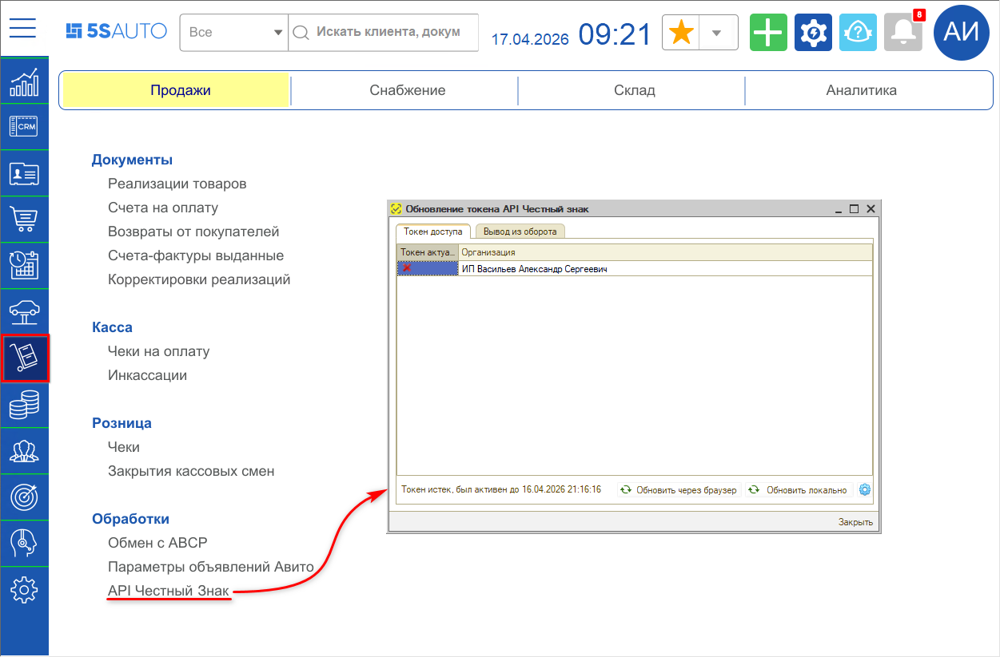
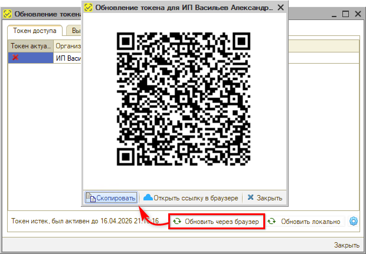
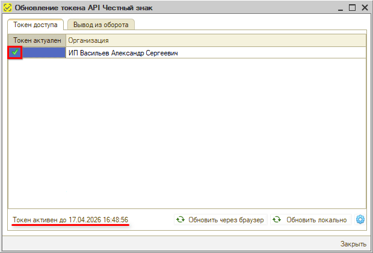
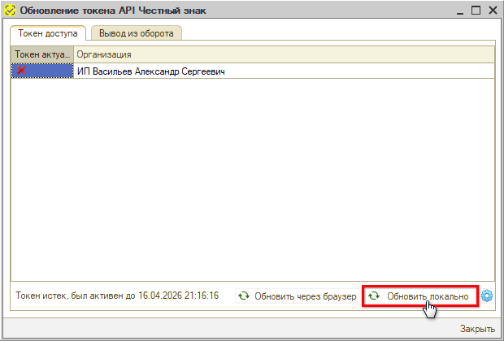
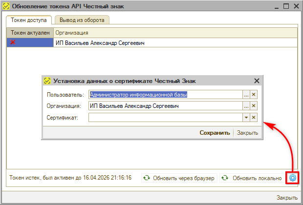

# Получение токена доступа к API Честного знака

<table><tr><td><b>Время чтения:</b> 6 мин.</td><td><b>Обновлено:</b> 27.04.2026</td></tr></table>

Источник: https://www.5systems.ru/help/poluchenie-tokena-dostupa-k-api-chestnogo-znaka

> *Актуально начиная с версии релиза 5S AUTO **2.8.3**, новая форма обработки и локальное обновление – начиная с релиза **2.8.3.42**.*

## Содержание

1. [Введение](#введение)
2. [Обновление токена API Честный знак](#обновление-токена-api-честный-знак)

## Введение

***API токен*** – это временный пароль, с помощью которого можно взаимодействовать с API Честного знака от имени сотрудника организации.

В программе настроено получение токена через расширение КриптоПро браузера. Для подписания токена используется приложение *5S Sign* ([sign.5systems.ru](http://sign.5systems.ru)). Для этого в формируемую ссылку передается кодовая строка, полученная в “Честном знаке”, после ее подписания сертификатом происходит получение токена.

*Примечание:* Работа с маркировками в программе возможна без получения токена путем сканирования кода маркировки как на этапе приемки, так и на этапе выдачи товара.

После получения токена открываются следующие *возможности* в программе:

1. Проверка состояния кода маркировки
2. Получение информации
3. Расшифровка кода
4. Выгрузка в "Честный Знак" информации о выводе кодов маркировки из оборота

Для возможности получения токена предварительно должен быть выполнен ряд настроек в программе – подробности см. в статье "[Настройка интеграции с Честным знаком](../Настройка%20интеграции%20с%20Честным%20знаком/nastroyka-integracii-s-chestnym-znakom.md)".

## Обновление токена API Честный знак

*Обработка “Обновление токена API Честный знак”* появляется после [записи интеграции](../Настройка%20интеграции%20с%20Честным%20знаком/nastroyka-integracii-s-chestnym-znakom.md#2-создание-интеграции-с-честным-знаком) в меню программы в разделе *Запчасти и склад → Продажи → Обработки → API Честный Знак:*

В таблицу на форму обработки выводятся те организации, у которых есть интеграция с “Честным знаком”. Организации определяются автоматически по подразделениям из настроек интеграции – см. в [статье](../Настройка%20интеграции%20с%20Честным%20знаком/nastroyka-integracii-s-chestnym-znakom.md#podr).

При выделении курсором строки с организацией на нижней панели отображается информация об активности токена с датой и временем окончания его действия.

**Обновление через браузер**

Для обновления токена через браузер следует нажать кнопку *“Обновить через браузер”:*

Открывается QR-код со ссылкой для перехода к странице получения токена. Следует скопировать ссылку нажатием на кнопку "Скопировать" и открыть ее в браузере.

*Важные комментарии:*

1. Рекомендуется использовать Яндекс-браузер.
2. В браузере должно быть установлено расширение КриптоПро (см. в статье “[Регистрация в системе Честный знак](../Регистрация%20в%20системе%20Честный%20знак/registraciya-v-sisteme-chestnyy-znak.md#3-установка-криптопровайдера-криптопро)”).
3. Необходима учетная запись в [5S Cloud](../../Администрирование%20и%20настройка%20системы/Создание%20и%20редактирование%20пользователей%205S%20Cloud/sozdanie-i-redaktirovanie-polzovateley-5s-cloud.md).

При открытии ссылки в браузере производится переход к авторизации в 5S Cloud:

Необходимо ввести учетные данные [пользователя 5S Cloud](../../Администрирование%20и%20настройка%20системы/Создание%20и%20редактирование%20пользователей%205S%20Cloud/sozdanie-i-redaktirovanie-polzovateley-5s-cloud.md) – имя и пароль. При этом открывается приложение 5S Sign. На странице “Создание подписи” следует выбрать сертификат и нажать кнопку "Создать подпись":

При этом появляется строка подписи. Информация о новом токене ***автоматически*** приходит в программу и отображается на нижней панели формы обработки обновления токена:

*Важно:* Токен обновляется на 8 часов – это срок его действия.

**Обновление локально через программу**

Есть возможность настроить локальное обновление токена с подписанием через КриптоПро в программе. Данный способ позволяет обновлять токен напрямую через программу, минуя шаг получения ссылки и перехода по ней в браузере.

Для использования данного способа требуется предварительная настройка – установка отпечатка сертификата. Для корректной работы должна быть установлена последняя версия КриптоПро. Также к компьютеру должен быть подключен носитель с сертификатом.

Для обновления токена с подписанием через программу следует только нажать кнопку *“Обновить → Локально”:*

Информация об обновлении токена сразу отображается на форме настройки:

Для того, чтобы обновлять токен локально, предварительно необходимо установить отпечаток сертификата – для этого нужно нажать кнопку с шестеренкой на нижней панели формы, в открывшемся окне выбрать сертификат (параметры "Пользователь" и "Организация" подтягиваются автоматически) и сохранить:

В случае если сертификат не установлен, при первой попытке локального обновления токена выходит сообщение программы о необходимости установки отпечатка сертификата, затем также открывается окно установки данных о сертификате.

Получить токен можно также через форму настройки интеграции с API – см. в статье "[Настройка интеграции с Честным Знаком](../Настройка%20интеграции%20с%20Честным%20знаком/nastroyka-integracii-s-chestnym-znakom.md#3-api-токен)".

---

**Теги:** маркировка, честный знак, api токен, доступ, обновление токена

