# Частичное выбытие маркированного товара

<table><tr><td><b>Время чтения:</b> 19 мин.</td><td><b>Обновлено:</b> 28.04.2026</td></tr></table>

Источник: https://www.5systems.ru/help/chastichnoe-vybytie-markirovannogo-tovara

> *Актуально начиная с версии релиза 5S AUTO **2.8.3.1**. Функционал дорабатывается.*

## Содержание

1. [Введение](#введение)
2. [Операции в документах](#операции-в-документах)
   - [1. Поступление товара](#1-поступление-товара)
   - [2. Реализация](#2-реализация)
   - [3. Вывод из оборота](#3-вывод-из-оборота)
3. [Отражение частичной реализации в чеках](#отражение-частичной-реализации-в-чеках)
   - [1. В чеках ЛК Честного знака](#1-в-чеках-лк-честного-знака)
   - [2. В печатном чеке ККТ](#2-в-печатном-чеке-ккт)
4. [Настройки](#настройки)
   - [Вариант 1. Единицы измерения подчиняются типу номенклатуры](#вариант-1-единицы-измерения-подчиняются-типу-номенклатуры)
   - [Вариант 2. Единицы измерения подчиняются номенклатурным позициям](#вариант-2-единицы-измерения-подчиняются-номенклатурным-позициям)

## Введение

Для некоторых категорий [маркируемой продукции](../Маркировка%20товаров/markirovka-tovarov.md) предполагается *частичная продажа* в пределах одной потребительской упаковки, например, реализация моторных масел на розлив из бочек.

Такой способ реализации также подлежит *обязательному регулированию* в части маркировки: данные о продаже подлежат передаче в ГИС МТ (“Честный знак”), а соответствующая информация о маркировке должна отражаться в кассовом чеке.

В сравнении с [реализацией маркированного товара](../Операции%20с%20кодами%20маркировки/operacii-s-kodami-markirovki.md#2-продажа-маркированных-товаров) в потребительской упаковке, при частичной продаже имеются свои *особенности* как при оформлении приемки от поставщика, так и при фиксации продажи доли маркированного товара, включая ее отражение в печатной форме чека.

В процессе реализации продавец сканирует код маркировки, нанесенный на бочку, и указывает объем реализуемой части товара. Информация о частичном выводе КИ из оборота передается в ГИС МТ посредством фискальных чеков, направляемых через оператора фискальных данных (ОФД).

Реализация частичного выбытия продукции из упаковки по одному КИ производится без выбытия кода из ГИС МТ – код остается в обороте и выбывает только после реализации последней доли товара.

Общий объем проданной или списанной жидкости из одной бочки должен соответствовать объему тары. Расхождения в цифрах могут помешать вывести бочку из оборота.

Подробнее см. [документацию](https://docs.crpt.ru/gismt/%D0%98%D0%BD%D1%81%D1%82%D1%80%D1%83%D0%BA%D1%86%D0%B8%D1%8F_%D0%BF%D0%BE_%D1%80%D0%B0%D0%B1%D0%BE%D1%82%D0%B5_%D1%81_%D1%87%D0%B5%D0%BA%D0%B0%D0%BC%D0%B8/#_%D1%87%D0%B5%D0%BA%D0%B8_%D1%81_%D1%87%D0%B0%D1%81%D1%82%D0%B8%D1%87%D0%BD%D0%BE%D0%B9_%D1%80%D0%B5%D0%B0%D0%BB%D0%B8%D0%B7%D0%B0%D1%86%D0%B8%D0%B5%D0%B9) Честного знака [о работе с чеками с частичной реализацией в ГИС МТ](https://docs.crpt.ru/gismt/%D0%98%D0%BD%D1%81%D1%82%D1%80%D1%83%D0%BA%D1%86%D0%B8%D1%8F_%D0%BF%D0%BE_%D1%80%D0%B0%D0%B1%D0%BE%D1%82%D0%B5_%D1%81_%D1%87%D0%B5%D0%BA%D0%B0%D0%BC%D0%B8/#_%D1%87%D0%B5%D0%BA%D0%B8_%D1%81_%D1%87%D0%B0%D1%81%D1%82%D0%B8%D1%87%D0%BD%D0%BE%D0%B9_%D1%80%D0%B5%D0%B0%D0%BB%D0%B8%D0%B7%D0%B0%D1%86%D0%B8%D0%B5%D0%B9), а также [требования для успешной обработки чеков с частичной реализацией](https://docs.crpt.ru/gismt/%D0%98%D0%BD%D1%81%D1%82%D1%80%D1%83%D0%BA%D1%86%D0%B8%D1%8F_%D0%BF%D0%BE_%D1%80%D0%B0%D0%B1%D0%BE%D1%82%D0%B5_%D1%81_%D1%87%D0%B5%D0%BA%D0%B0%D0%BC%D0%B8/#trebovaniya_dlya_uspeshnoj_obrabotki_chekov_chastichnoj_realizaczii).

*Примечание:* Министерством промышленности и торговли рассматривается [проект постановления](https://regulation.gov.ru/projects/166682/) "О внесении изменений в постановление Правительства Российской Федерации от 30 ноября 2024 г. № 1683", в рамках которого планируется упразднение процедуры частичного выбытия (см. [информацию](https://markirovka.ru/knowledge/tovarnye-gruppy/motornye-masla/fasovka-motornykh-masel-nuzhno-li-markirovat-motornye-masla-prodavaemye-na-rozliv) на сайте "Честного Знака").

## Операции в документах

### 1. Поступление товара

*Приходование* маркированного товара для последующей *реализации по частям* (например, бочки масла для продажи на розлив) производится *стандартным способом* – см. статью “[Операции с кодами маркировки](../Операции%20с%20кодами%20маркировки/operacii-s-kodami-markirovki.md#1-поступление-товаров)”.

Особенностью является указание в документах поступления специально настроенных *единиц измерения* – например, “бочка”, также будет отображаться *коэффициент,* указанный в настройках единиц измерения (см. [ниже](#koeff_v_bochke)):

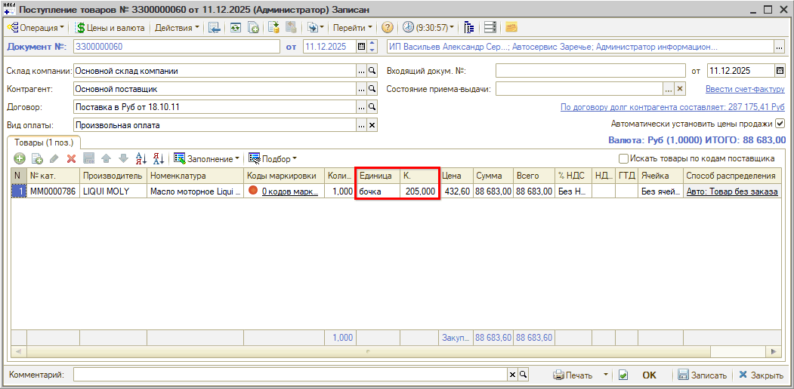

В таблице “Коды маркировки” производится сканирование кода маркировки на упаковке товара, при проведении документа его состояние в системе учета становится “В обороте”, а в ГИС МТ фиксируется информация о его переходе на баланс компании:

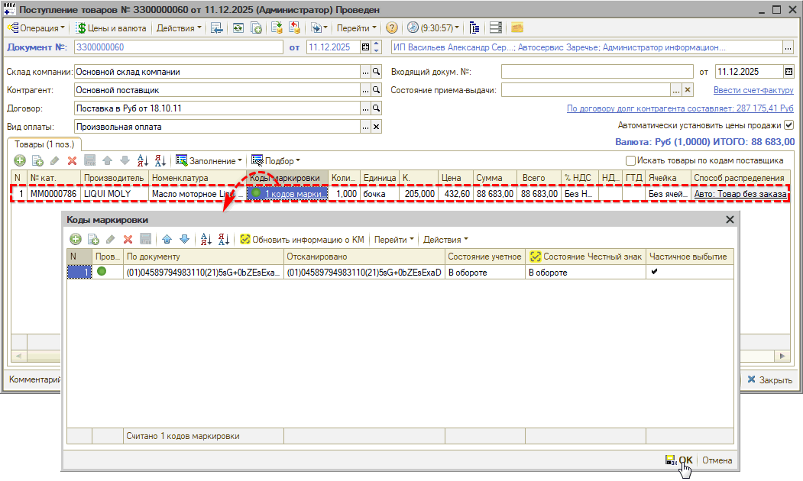

### 2. Реализация

В документе “Реализация товаров” в случае продажи, например, нескольких литров масла на розлив из бочки, в качестве *единиц измерения* следует выбрать “литры”, а также указать их *количество:*

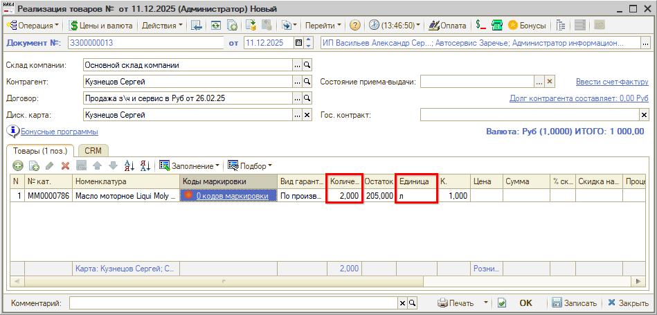

Производится сканирование *одного кода маркировки* на *общей упаковке* (например, бочке):

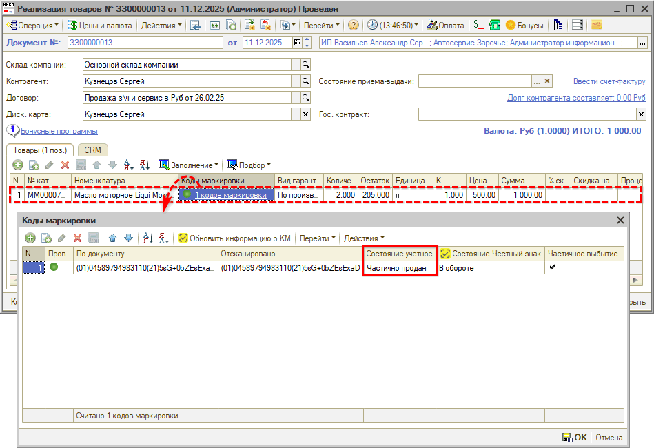

Проверка на соответствие количества отсканированных кодов количеству товара *не производится.* При проведении документа код *не выбывает из оборота,* учетное состояние становится *“Частично продан”.* Информация о частичной продаже маркированного товара передается в ГИС МТ при пробитии чека.

В случае реализации товара через *заказ-наряд* частичная продажа масла оформляется аналогично, через документ "Перемещение товаров в производство" (описание типовой операции см. в [статье](../Операции%20с%20кодами%20маркировки/operacii-s-kodami-markirovki.md#учет-маркированных-товаров-в-рамках-заказ-наряда)).

*Примечание:* В случае реализации всей упаковки маркированного товара разом (например, всей бочки), т.е. если единицы измерения соответствуют потребительской упаковке, следует в качестве единиц измерения указывать соответствующее значение (например, “бочка”). В этом случае будет работать проверка на сканирование полного количества кодов маркировок перед проведением документа. Т.е. реализация оформляется стандартным способом – см. в статье “[Операции с кодами маркировки](../Операции%20с%20кодами%20маркировки/operacii-s-kodami-markirovki.md#2-продажа-маркированных-товаров)”.

### 3. Вывод из оборота

*Раздел редактируется*

Для отражения выбытия из оборота маркированного товара в случае реализации по частям, например, моторного масла на розлив из бочки, следует выводить всю бочку при достижения минимального остатка, не подлежащего дальнейшей реализации, т.е. при продаже последней порции масла. Требуется создать вручную документ вывода из оборота, отсканировать код маркировки на бочке, затем отправить данные в “Честный Знак”.

*Примечание:* При использовании настроек [автоматического создания документов выбытия](../Вывод%20кодов%20маркировки%20из%20оборота/vyvod-kodov-markirovki-iz-oborota.md#особенности-вывода-из-оборота-кодов-маркировки-при-продаже) маркированных товаров в эти документы *не попадают* маркировки по товарам с частичным выбытием, поэтому их потребуется заполнять вручную.

На основании документа продажи (Реализации или Заказ-наряда) следует создать документ “[Вывод из оборота](../Вывод%20кодов%20маркировки%20из%20оборота/vyvod-kodov-markirovki-iz-oborota.md)”. Часть параметров подтягиваются из документа-основания, остальные следует дозаполнить – товарную группу, причину выбытия, вид первичного документа:

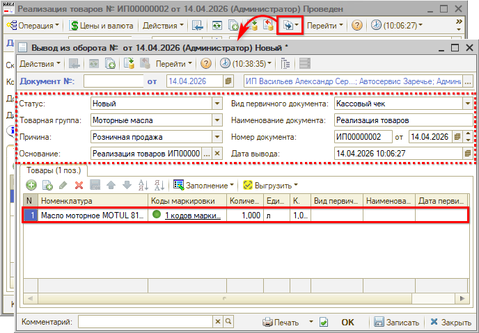

*Примечание:* В таблице при необходимости можно удалить лишние строки.

Документ необходимо записать и провести, затем [выгрузить](../Вывод%20кодов%20маркировки%20из%20оборота/vyvod-kodov-markirovki-iz-oborota.md#выгрузка-документа-вывод-из-оборота-в-систему-честный-знак) данные в “Честный Знак”.

Подробнее см. статью "[Вывод кодов маркировки из оборота](../Вывод%20кодов%20маркировки%20из%20оборота/vyvod-kodov-markirovki-iz-oborota.md)".

## Отражение частичной реализации в чеках

### 1. В чеках ЛК Честного знака

Просмотр чеков в ЛК “Честного знака” доступен через профиль участника оборота товаров, указанного в чеке в качестве продавца. В разделе “Чеки” также доступен быстрый переход к формированию отчета по ошибкам (подробнее см. в [инструкции](https://xn--80ajghhoc2aj1c8b.xn--p1ai/business/doc/?id=%D0%98%D0%BD%D1%81%D1%82%D1%80%D1%83%D0%BA%D1%86%D0%B8%D1%8F_%D0%A1%D0%B5%D1%80%D0%B2%D0%B8%D1%81_%D0%B2%D1%8B%D0%B3%D1%80%D1%83%D0%B7%D0%BE%D0%BA.html) на сайте “Честного знака”):

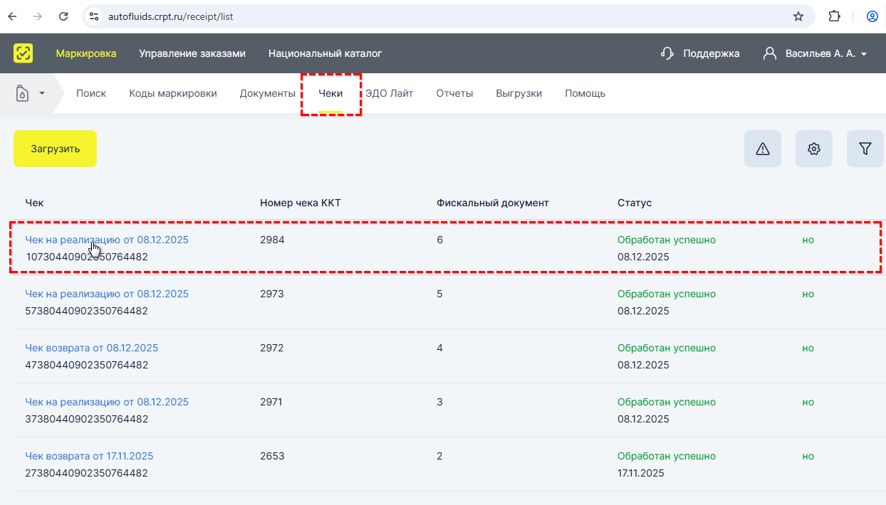

При переходе к просмотру отдельного чека в колонке “Частичная реализация” отображается, сколько литров из бочки продано:

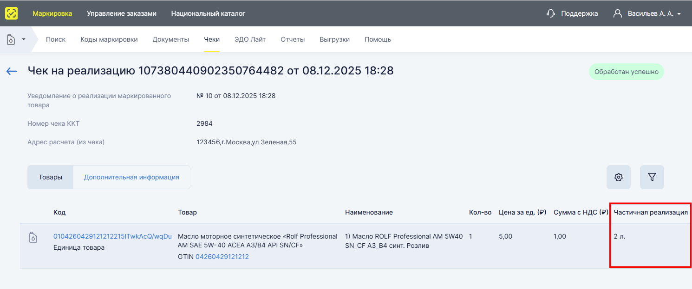

### 2. В печатном чеке ККТ

В печатной форме чека ККТ в поле "Количество" всегда указывается "1", согласно требованиям формата фискальных данных (ФФД) (утв. [приказом ФНС России от 14.09.2020 № ЕД-7-20/662@](https://www.nalog.gov.ru/rn77/about_fts/docs/10020801/)), при этом *количество единиц товара* в случае частичного выбытия и цена за единицу в чеке указываются справочно, *в наименовании товара.* Таким образом, цена и сумма равняются стоимости всех единиц товара в случае частичного выбытия.

Например, при продаже 2-х литров из бочки в чеке будет указано:

*"Масло моторное (2 л, цена 500 руб. / л), 1 х 1000.00"*

Для учета частичной реализации единиц товаров для физических лиц через ККТ в чеке должен быть указан код идентификации с упаковки и реализуемый объем/вес.

*Примечание:* Если переменная характеристика товара (объем/вес) в чеке отличается от значения, указанного в карточке товара Национального каталога, то произойдёт полное выбытие кода идентификации (см. [описание](https://xn--80ajghhoc2aj1c8b.xn--p1ai/info/releasenotes/chto-novogo-v-sisteme-s-01-12-2025-po-05-12-2025/#11) на сайте Честного знака).

Подробнее о работе с чеками читайте в [документации](https://docs.crpt.ru/gismt/%D0%98%D0%BD%D1%81%D1%82%D1%80%D1%83%D0%BA%D1%86%D0%B8%D1%8F_%D0%BF%D0%BE_%D1%80%D0%B0%D0%B1%D0%BE%D1%82%D0%B5_%D1%81_%D1%87%D0%B5%D0%BA%D0%B0%D0%BC%D0%B8/#_%D1%87%D0%B5%D0%BA%D0%B8_%D1%81_%D1%87%D0%B0%D1%81%D1%82%D0%B8%D1%87%D0%BD%D0%BE%D0%B9_%D1%80%D0%B5%D0%B0%D0%BB%D0%B8%D0%B7%D0%B0%D1%86%D0%B8%D0%B5%D0%B9) Честного знака.

## Настройки

**Существует два варианта настройки:**

1. *Единицы измерения подчиняются **типу номенклатуры***

   Данный вариант рекомендуется использовать в случае работы с *большим количеством различных номенклатурных позиций,* для которых актуально частичное выбытие. Например, если на розлив продается масло от разных производителей, в бочках различного объема (по 100 л, 200 л и т.д.) и т.д., удобнее задать единицы измерения на уровне типа номенклатуры.

2. *Единицы измерения подчиняются конкретным **номенклатурным позициям***

   Этот вариант целесообразен, если частичное выбытие используется только для нескольких отдельных номенклатурных позиций. В данном случае настройка единиц измерения выполняется индивидуально *для каждой номенклатурной единицы* (например, для каждой конкретной бочки).

   *Примечание:* При большом количестве таких товаров процесс настройки может оказаться трудоемким, а справочник единиц измерения – чрезмерно большим, поскольку каждая единица будет привязана к отдельной номенклатурной позиции. Поэтому для настройки большого количества товаров для частичной реализации рекомендуется использовать первый вариант – с привязкой единиц измерения к типу номенклатуры.

### Вариант 1. Единицы измерения подчиняются типу номенклатуры

#### 1. Настройка типа номенклатуры

В карточке типа номенклатуры должны быть настроены следующие параметры:

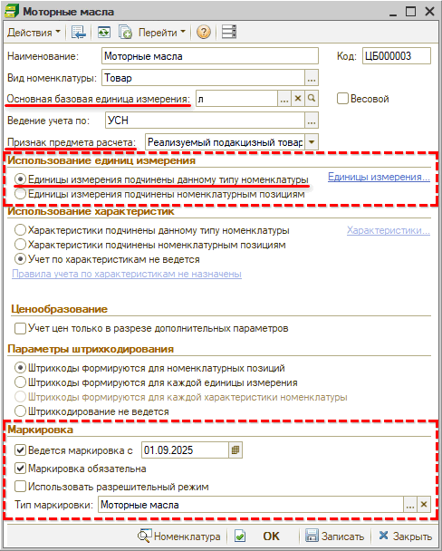

1. Основная базовая единица измерения: *“литры”*

   *Примечание:* В карточке базовой единицы измерения для параметра *"Мера количества ККТ"* должно быть указано значение *"Литр",* а не "Иные единицы измерения" – это важно для корректного отражения частичного выбытия через чеки ККТ (для некоторых касс требуется обязательно):

   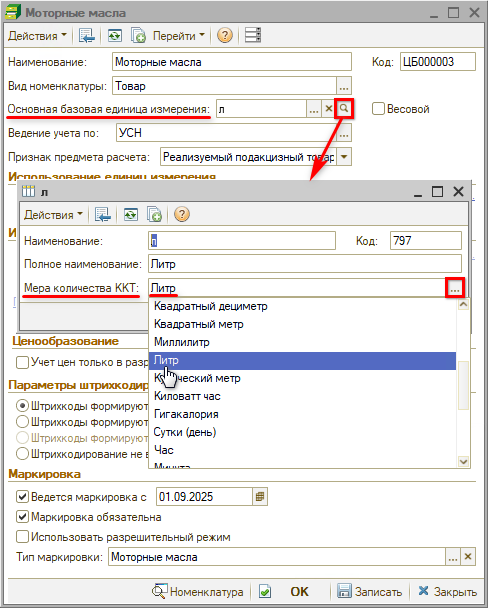

2. Признак предмета расчета: *Реализуемый подакцизный товар, подлежащий маркировке средством идентификации, имеющий код маркировки (ФФД 1.2)*
3. Использование единиц измерения: *Единицы измерения **подчинены данному типу номенклатуры**.*

   Далее необходимо *заполнить справочник* *“Единицы измерения”:*

   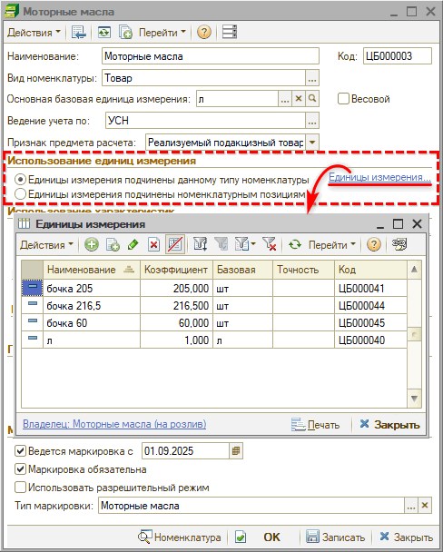

   Следует добавить единицы измерения:

   - 1\) *Литры* – для продажи на розлив:

     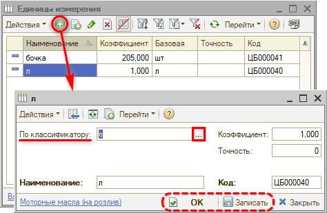

     

   - 2\) *Бочки* – для приходования товара и продажи всей упаковки:

     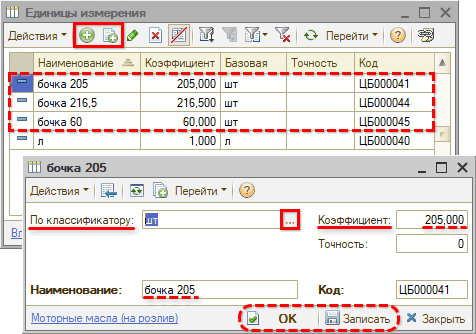

     В параметре *“Коэффициент”* следует указать *количество* литров в бочке.

     Следует создать единицы измерения для всех наиболее часто используемых объемов бочек, по которым будет производиться частичная реализация:

     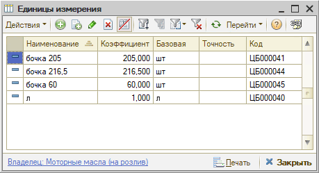

     Впоследствии можно будет добавлять в справочник новые значения при необходимости.

     *Сохранить изменения* нажатием на кнопку *“Записать”* или *“ОК”.*

4. Параметры в разделе *“Маркировка”* – стандартные настройки согласно статье “[Настройка интеграции с Честным знаком](../Настройка%20интеграции%20с%20Честным%20знаком/nastroyka-integracii-s-chestnym-znakom.md#uchet_markir)”.

#### 2. Настройки в карточке номенклатуры

В карточке номенклатуры помимо стандартных реквизитов необходимо заполнить следующие параметры:

1. Выбрать ранее настроенный *тип номенклатуры* (см. [выше](#1-настройка-типа-номенклатуры)) – обязательно сразу корректно (иначе потом будет очень сложно перенастраивать).

   После выбора типа номенклатуры с признаками ведения учета маркировки активируется кнопка настройки параметров частичного выбытия – см. [ниже](#param_chast_vyb).

2. *Базовая единица измерения* – подтягивается значение “л” (литры) из параметров типа номенклатуры:

   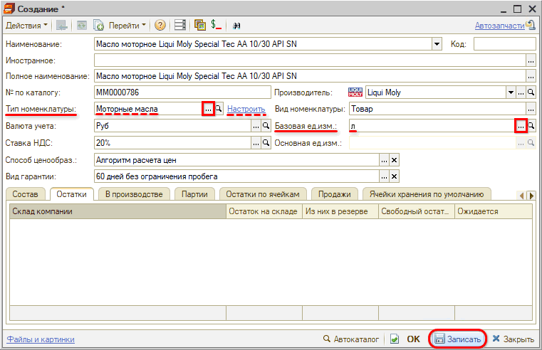

   *Примечание:* В карточке базовой единицы измерения для параметра *"Мера количества ККТ"* должно быть указано значение *"Литр",* а не "Иные единицы измерения" (см. [примечание](#bazovaya_ed_izm) выше):

   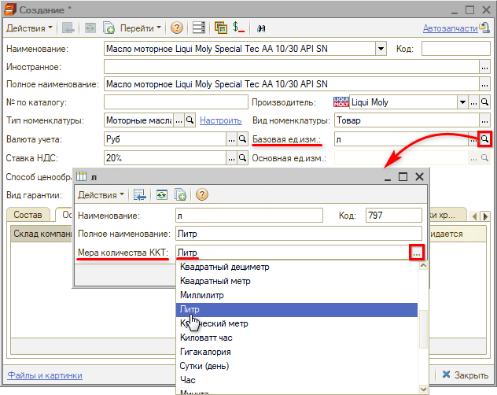

   После этого создаваемую карточку номенклатуры следует ***записать**.*

3. *Основная единица измерения* – при записи карточки подтягивается значение "л" из ранее заполненного справочника "Единицы измерения" (если справочник не был ранее заполнен, элемент создается при записи автоматически в соответствии с базовой единицей измерения).

   

4. *Настройка параметров частичного выбытия:*

   После выбора типа номенклатуры с признаками ведения учета маркировки активируется кнопка настройки параметров частичного выбытия – в открывшемся окне следует установить следующие параметры:

   - 1\) Установить признак *“Поддерживается частичное выбытие”* – без установки данного признака учет частичного выбытия использоваться не будет.
   - 2\) Для параметра *“Маркируемая потребительская упаковка”* установить вариант *“Соответствует упаковке номенклатуры”* и выбрать нужное значение из ранее заполненного справочника единиц измерения:

     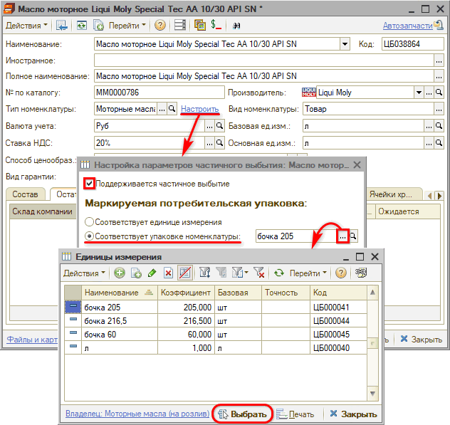

     *Примечание:* В случае выбора варианта, когда маркируемая потребительская упаковка соответствует единице измерения, частичное выбытие не будет отображаться в учете.

     Настроенные параметры необходимо записать нажатием кнопки *“ОК”.*

### Вариант 2. Единицы измерения подчиняются номенклатурным позициям

#### 1. Настройка типа номенклатуры

В карточке типа номенклатуры должны быть настроены следующие параметры:

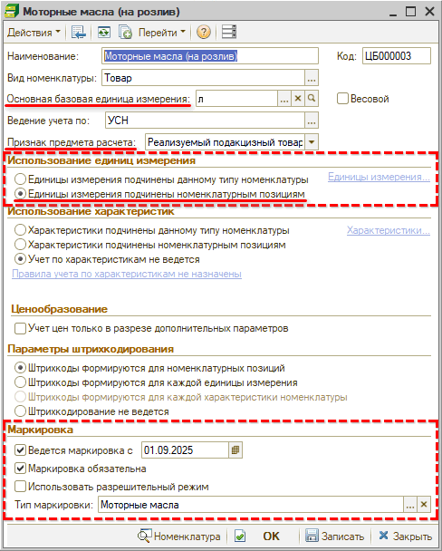

1. Основная базовая единица измерения: *“литры”*

   *Примечание:* В карточке базовой единицы измерения для параметра *"Мера количества ККТ"* должно быть указано значение *"Литр",* а не "Иные единицы измерения" – это важно для корректного отражения частичного выбытия через чеки ККТ (для некоторых касс требуется обязательно):

   

2. Признак предмета расчета: *Реализуемый подакцизный товар, подлежащий маркировке средством идентификации, имеющий код маркировки (ФФД 1.2)*
3. Использование единиц измерения: *Единицы измерения **подчинены номенклатурным позициям**.*
4. Параметры в разделе *“Маркировка”:* стандартные настройки согласно статье “[Настройка интеграции с Честным знаком](../Настройка%20интеграции%20с%20Честным%20знаком/nastroyka-integracii-s-chestnym-znakom.md#uchet_markir)”.

#### 2. Настройки в карточке номенклатуры

В карточке номенклатуры помимо стандартных реквизитов необходимо заполнить следующие параметры:

1. Выбрать ранее настроенный *тип номенклатуры* (см. [выше](#1-настройка-типа-номенклатуры-1)) – обязательно сразу корректно (иначе потом будет сложно перенастраивать).

   После выбора типа номенклатуры с признаками ведения учета маркировки активируется кнопка настройки параметров частичного выбытия – см. [ниже](#param_chast_vyb_2).

2. *Базовая единица измерения* – подтягивается значение “л” (литры) из типа номенклатуры:

   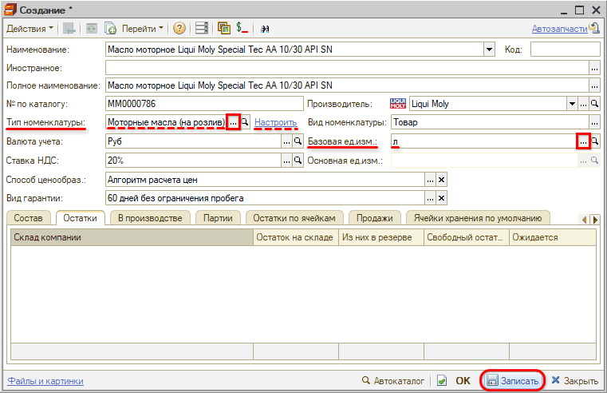

   *Примечание:* В карточке базовой единицы измерения для параметра *"Мера количества ККТ"* должно быть указано значение *"Литр",* а не "Иные единицы измерения" (см. [примечание](#bazovaya_ed_izm_2) выше):

   

   После этого создаваемую карточку номенклатуры следует ***записать**.*

   

3. *Основная единица измерения* – при записи нового элемента справочника "Номенклатура" создается автоматически на основании базовой единицы измерения (в рассматриваемом примере значение “л”). Данное значение записывается в справочник "Единицы измерения" с привязкой к созданной карточке номенклатуры. Далее этот справочник необходимо дозаполнить – см. [ниже](#zap_e_i).

   

4. *Заполнение справочника "Единицы измерения"*

   Для заполнения справочника следует нажать кнопку *“Перейти → Единицы измерения”:*

   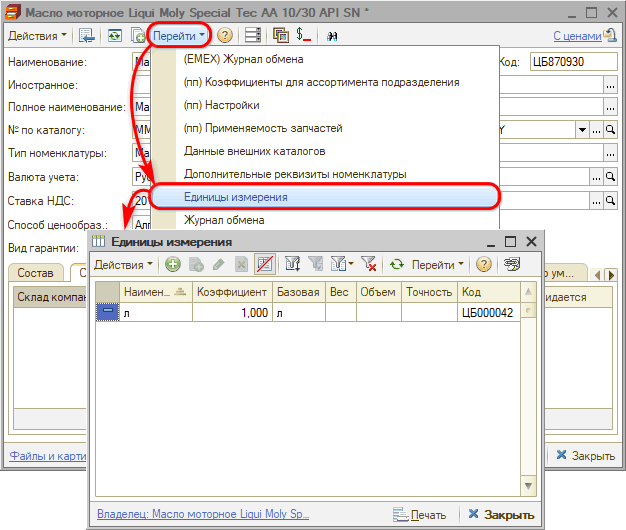

   В справочнике уже содержится один элемент, добавленный автоматически при записи карточки номенклатуры с базовой единицей в типе номенклатуры ("л") – см. [выше](#osn_e_i):

   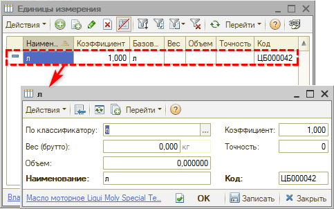

   Следует добавить единицы измерения для настройки частичного выбытия, для рассматриваемого примера – *бочку:*

   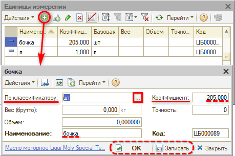

   В параметре *“Коэффициент”* следует указать *количество* литров в бочке.

   Сохранить изменения нажатием на кнопку *“Записать”* или *“ОК”.*

   

5. *Настройка параметров частичного выбытия:*

   После выбора типа номенклатуры с признаками ведения учета маркировки активируется кнопка настройки параметров частичного выбытия – в открывшемся окне следует установить следующие параметры:

   - 1\) Установить признак *“Поддерживается частичное выбытие”* – без установки данного признака учет частичного выбытия использоваться не будет.
   - 2\) Для параметра *“Маркируемая потребительская упаковка”* установить вариант *“Соответствует упаковке номенклатуры”* и выбрать значение из ранее заполненного справочника единиц измерения – например, “бочка”:

     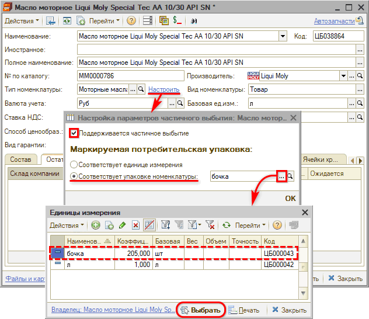

     *Примечание:* В случае выбора варианта, когда маркируемая потребительская упаковка соответствует единице измерения, частичное выбытие не будет отображаться в учете.

     Настроенные параметры необходимо записать нажатием кнопки *“ОК”.*

---

**Теги:** маркировка, частичное выбытие, единицы измерения, честный знак, чек ккт
