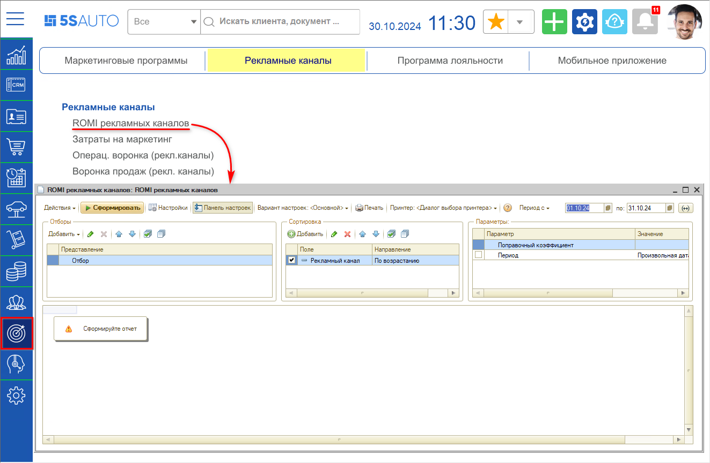
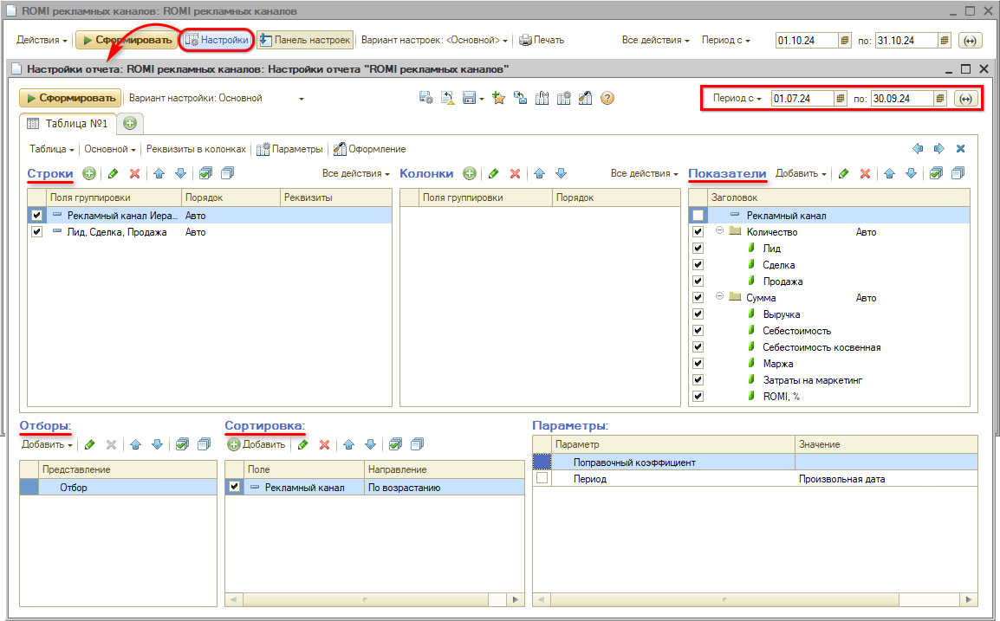
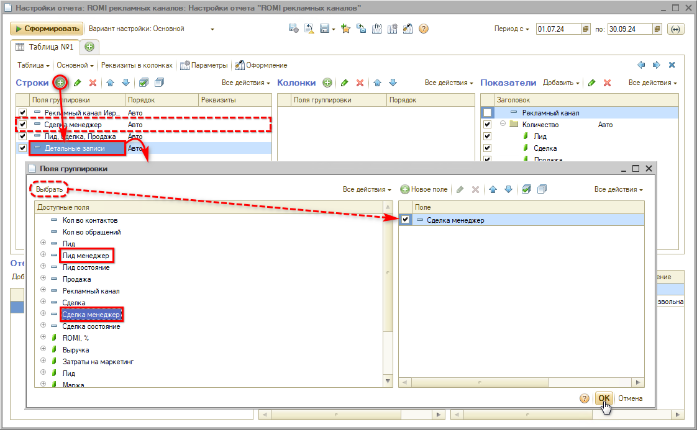
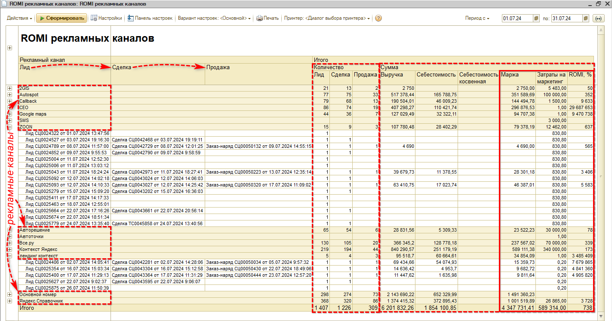
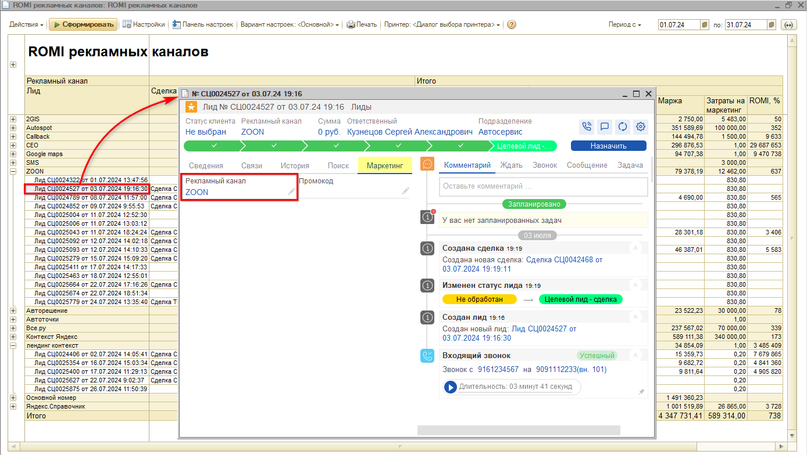
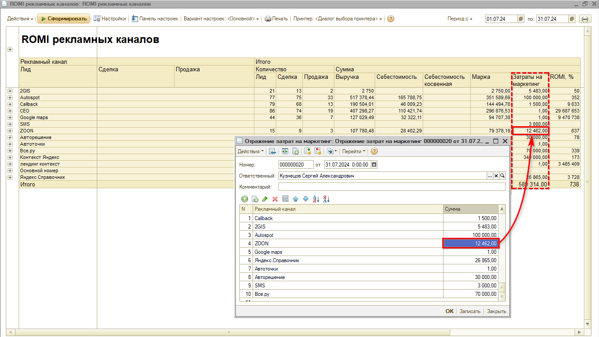
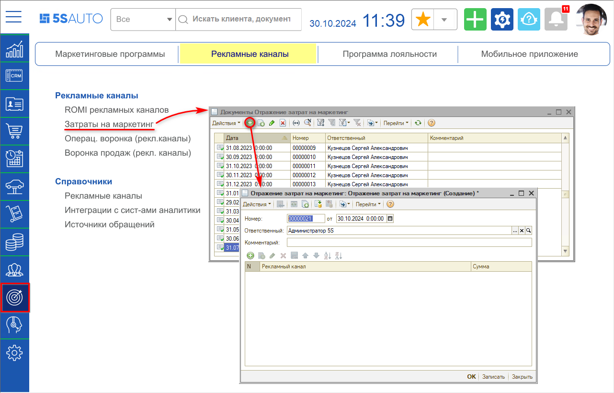

# Отчет "ROMI рекламных каналов"

<table><tr><td><b>Время чтения:</b> 9 мин.</td><td><b>Обновлено:</b> 30.10.2024</td></tr></table>

Источник: https://www.5systems.ru/help/otchet-romi-reklamnykh-kanalov

> *Актуально начиная с версии релиза 5S AUTO **2.8.1**.*

## Содержание

1. [Введение](#введение)
2. [Переход к отчету](#переход-к-отчету)
3. [Настройки отчета](#настройки-отчета)
4. [Работа с отчетом](#работа-с-отчетом)
   - [Основные показатели отчета](#основные-показатели-отчета)
   - [Рекламные каналы](#рекламные-каналы)
   - [Отражение затрат на маркетинг](#отражение-затрат-на-маркетинг)

## Введение

***ROMI** (Return On Marketing Investment* – дословно можно перевести как “возврат маркетинговых инвестиций”) – это показатель, отражающий окупаемость затрат на маркетинг. ROMI учитывает только маркетинговые затраты, и не включает затраты на оказание услуг, содержание помещения, зарплаты сотрудников и т.д.

*Отчет "ROMI рекламных каналов"* позволяет наглядно определить, какие из рекламных каналов и маркетинговых кампаний окупаются, какие приносят прибыль, а какие из них убыточны. Оценка эффективности инструментов продвижения помогает более грамотно распределить вложения в рекламу. Для работы с отчетом предварительно должны быть настроены рекламные каналы – см. *[ниже](#рекламные-каналы).*

ROMI определяется как отношение прибыли, полученной от маркетинговой кампании, к затратам на ее проведение:

*ROMI = Доходы от рекламы / Затраты на рекламу \* 100%*

Например, если в рекламу вложили 10 000 рублей, а на выходе получили 20 000 рублей, то рентабельность инвестиций составит 200%, то есть, вернулось все вложенное и дополнительно получили столько же, сколько вложили. Подробнее см. *[ниже](#оценка-показателей).*

Рассчитать показатель ROMI можно как для всех вложений в маркетинг в целом, так и для одной рекламной кампании.

Показатель будет более достоверным, если уже собрана статистика – нет смысла вычислять ROMI сразу после запуска рекламной кампании.

Обычно показатель рассчитывается за определенный период – квартал или год. Это относительный показатель, который зависит от целей и стратегии компании и может меняться со временем. Лучше отслеживать ROMI в динамике, например, за несколько месяцев. Чем длительнее период расчета и больше накопленных данных, тем точнее результаты.

Показатели отчета могут быть использованы:

- маркетологом – для оценки эффективности рекламных каналов и принятия решения о перераспределении вложений либо иных действиях по корректировке маркетинговой активности;
- руководителем – для прослеживания конверсии и выручки, а также оценки эффективности работы сотрудников.

## Переход к отчету

Перейти к отчету можно через меню программы *Маркетинг → вкладка “Рекламные каналы” → раздел “Рекламные каналы” → ROMI рекламных каналов[\*](#snoska):*

*\*Примечание: В случае если данного пункта меню нет на рабочем столе, можно добавить его вручную – см. статью "[Настройка рабочего стола](../../Администрирование%20и%20настройка%20системы/Настройка%20рабочего%20стола/nastroyka-rabochego-stola.md#настройки-разделов-и-пунктов-рабочего-стола)".*

## Настройки отчета

Следует задать период, за который требуется оценить прибыльность рекламы:

Также есть возможность добавлять дополнительные группировки строк, показатели, либо убирать лишние, устанавливать отборы, изменять сортировку.

Например, можно вывести дополнительно *группировку по ответственному* в лиде или сделке для оценки эффективности работы отдельных сотрудников – для этого используются показатели “Лид менеджер” и “Сделка менеджер”:

Также можно дополнительно группировать лиды и/или сделки *по этапу воронки* – для этого используется показатели “Лид состояние” и “Сделка состояние”.

## Работа с отчетом

### Основные показатели отчета

Пример сформированного отчета:

1. *Лид → Сделка → Продажа:*

   Лиды и сделки попадают в отчет, если в них указан *рекламный канал* – см. *[ниже](#рекламные-каналы),* и группируются по этим рекламным каналам.

   Первые 3 колонки отчета – *“Лид → Сделка → Продажа”* – отражают конверсию воронки продаж, т.е. перешел ли Лид в Сделку, и был ли оформлен по Сделке *документ продажи.* Для расчета показателя ROMI учитывается сумма из документа продажи, которая отображается в колонке “Выручка”.

2. *Группа показателей “Итого – Количество”:*

   В группе показателей *“Итого → Количество”* отображается количество лидов, сделок и продаж по ним.

3. *Группа показателей “Итого – Сумма”:*
   - *Выручка* – сумма документа продажи, например, Заказ-наряда или Реализации товаров.
   - *Себестоимость* – это себестоимость запчастей, указанных в документе продажи.
   - *Маржа* – сумма выручки минус себестоимость запчастей, т.е.: *Маржа = Выручка – Себестоимость.*
   - *Затраты на маркетинг* – показатель рассчитывается на основании суммы, указанной в документе “Отражение затрат на маркетинг” – см. *[ниже](#отражение-затрат-на-маркетинг). *
  Значение по каждому рекламному каналу распределяется поровну на все лиды, входящие в группу.
   - *ROMI* – итоговый показатель отчета, рассчитывается по формуле: *ROMI = Маржа / Затраты на маркетинг \* 100%*

#### Оценка показателей

Значение ROMI рассчитывается в процентах:

- Показатель ROMI должен быть *больше 100%* – это значит, что реклама приносит прибыль, вложенные средства не только полностью возвращаются, но и приносят доход.
- ROMI, *равный 100%* – это точка безубыточности: такой показатель говорит о том, что вложенные инвестиции возвращаются, но без дохода. Однако в реальности такая позиция приносит убыток, т.к. формула учитывает не все расходы.
- Показатель ROMI *меньше 100%* говорит о том, что вложения в маркетинг не окупаются, затраты на рекламу больше, чем прибыль от нее. В данном случае маркетинговая активность нуждается в пересмотре.

В приведенном выше примере общий показатель ROMI указывает на то, что в целом маркетинговая активность компании приносит прибыль в размере 738%. То есть, в целом реклама приносит на каждый потраченный на нее рубль 7,4 рубля.

В то же время, показатели по каждому отдельному рекламному каналу указывают на то, что вложения в некоторые из них нерентабельны, и маркетинговая активность нуждается в пересмотре.

### Рекламные каналы

Лиды и сделки попадают в отчет ROMI, если в них указан *рекламный канал:*

Рекламный канал, с которого поступило обращение клиента, подтягивается на вкладку “Маркетинг”. Для этого предварительно должен быть настроен справочник “Рекламные каналы”. Подробнее см. статью *[Настройка рекламных каналов](../../Аналитика/Настройка%20рекламных%20каналов/nastroyka-reklamnykh-kanalov.md).*

### Отражение затрат на маркетинг

Для того, чтобы колонка отчета *"Затраты на маркетинг"* заполнялась данными, необходимо предварительно заполнять специальный документ *"Отражение затрат на маркетинг":*

К документу можно перейти через меню программы *Маркетинг → вкладка "Рекламные каналы" → раздел "Рекламные каналы" → Затраты на маркетинг:*

Рекомендуется периодически (например, раз в месяц или в квартал) создавать новый документ “Отражение затрат на маркетинг” и вносить в него суммы затрат на рекламу по каждому каналу. Это обеспечит максимально корректный расчет показателя ROMI.

---

**Теги:** отчеты, romi, рекламные каналы, маркетинг, затраты на рекламу
