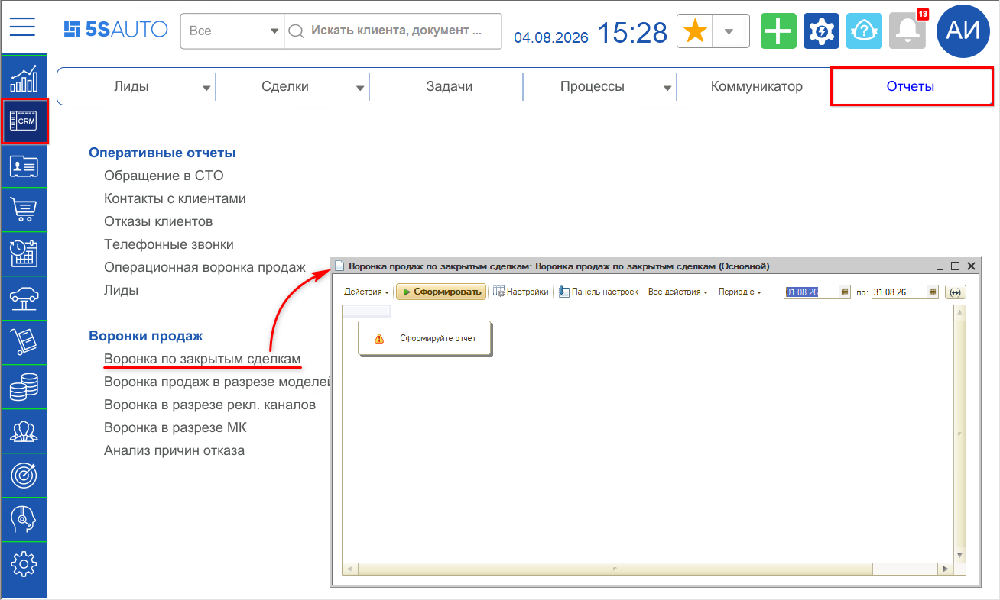
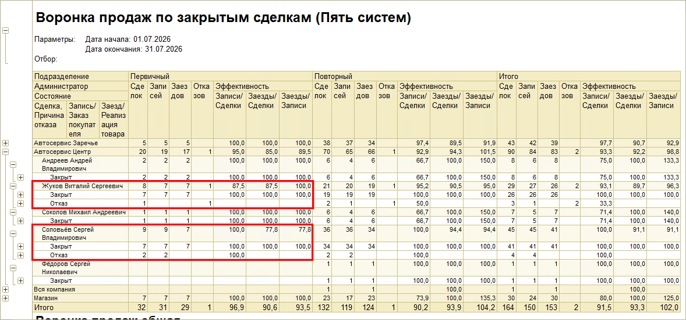
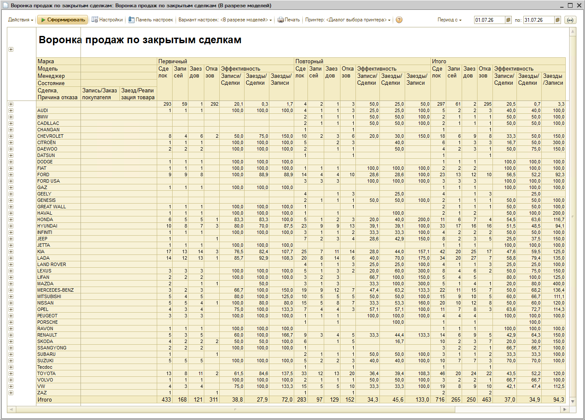
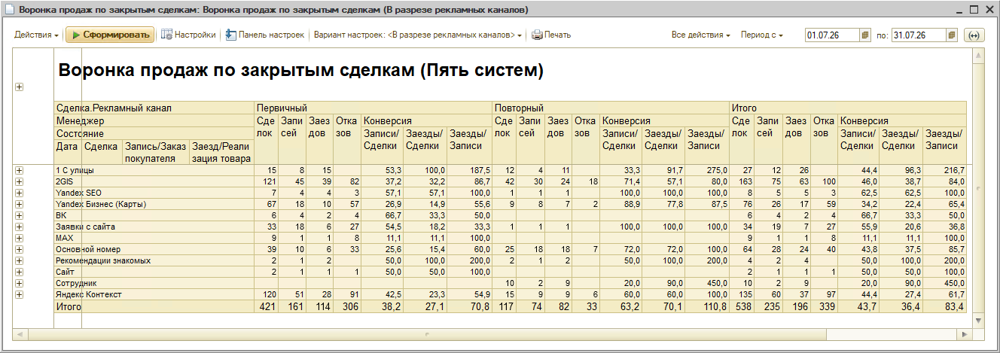
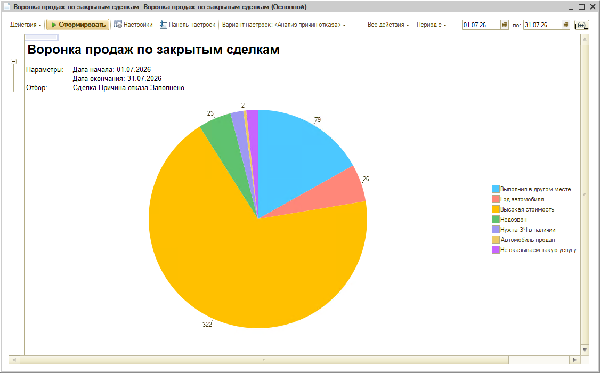
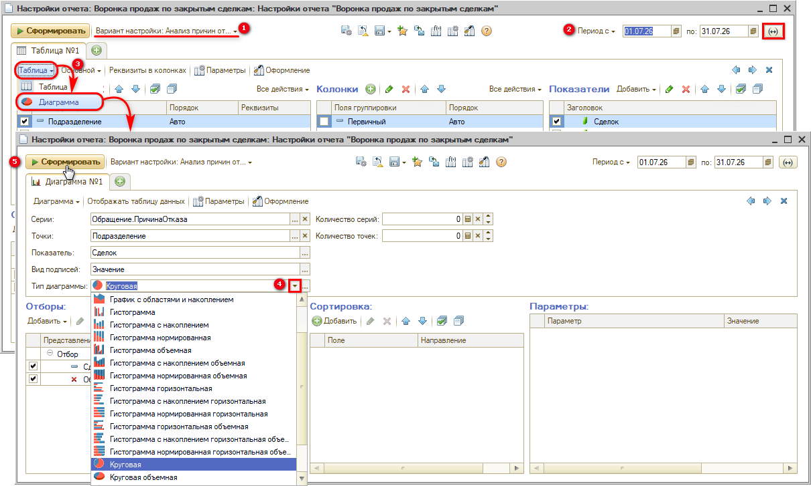

# Отчет "Воронка продаж по закрытым сделкам"

<table><tr><td><b>Время чтения:</b> 9 мин.</td><td><b>Обновлено:</b> 04.08.2026</td></tr></table>

Источник: https://www.5systems.ru/help/otchet-voronka-prodazh-po-zakrytym-sdelkam

## Содержание

1. [Введение](#введение)
2. [Как перейти](#как-перейти)
3. [Работа с отчетом](#работа-с-отчетом)
   - [Описание итоговых показателей отчета](#описание-итоговых-показателей-отчета)
   - [Интерпретация отчета на примере](#интерпретация-отчета-на-примере)
   - [Варианты представления отчета](#варианты-представления-отчета)
      - [1) Воронка продаж в разрезе моделей](#1-воронка-продаж-в-разрезе-моделей)
      - [2) Воронка продаж в разрезе рекламных каналов](#2-воронка-продаж-в-разрезе-рекламных-каналов)
      - [3) Анализ причин отказа](#3-анализ-причин-отказа)

## Введение

Отчет отражает *воронку продаж[\*](#snoska-1) по закрытым сделкам,* где под закрытыми сделками подразумеваются сделки с клиентами, у которых есть результат: либо успешная продажа, либо зафиксированный отказ.

*\* Примечание: 'Воронка продаж' представляет собой принцип распределения клиентов по всем стадиям бизнес-процесса. Она отражает количество клиентов, находящихся на определенных этапах взаимоотношений с менеджерами и мастерами-консультантами – начиная с обращения клиента и заканчивая закрытием сделки. С каждым этапом количество потенциальных клиентов уменьшается, поэтому на выходе число закрытых сделок гораздо меньше, чем количество принятых сотрудником звонков. На основании данной статистики можно проанализировать, сколько клиентов отсеивается на каждом из этапов или какая доля клиентов переходит в следующий этап бизнес-процесса.*

Отчет "Воронка продаж по закрытым сделкам" является одним из самых важных отчетов для управления компанией, так как с помощью него можно проанализировать эффективность работы.

Отчет позволяет:

- Получить анализ каждого этапа сделки, чтобы отследить на каком из этапов и в каком количестве происходит уход потенциальных клиентов.
- Оценить эффективность работы мастеров-консультантов/менеджеров по продаже.
- Оценить эффективность работы рекламного канала.
- Построить планы продаж, проработать схему устранения выявленных узких мест.

Отчет формируется по дате закрытия сделки (продажи) и, по сравнению с отчетом [«Операционная воронка продаж»](../Отчет%20Операционная%20воронка%20продаж/otchet-operacionnaya-voronka-prodazh.md), дает более показательную информацию – с отсеиванием незавершенных бизнес-процессов.

## Как перейти

Переход к отчету осуществляется через меню интерфейса *CRM → вкладка "Отчеты" → Воронки продаж[\*](#snoska-2):*

*\*Примечание: В случае если данного пункта меню нет на рабочем столе, можно добавить его вручную – см. статью "[Настройка рабочего стола](../../Администрирование%20и%20настройка%20системы/Настройка%20рабочего%20стола/nastroyka-rabochego-stola.md#настройки-разделов-и-пунктов-рабочего-стола)".*

В меню выведены несколько вариантов данного отчета — можно сразу выбрать нужный вариант, либо открыть основной и затем задать нужный вариант в настройках. Особенности вариантов настройки отчета рассмотрены далее в рамках данной статьи.

## Работа с отчетом

Сначала следует задать настройки отчета: выбрать вариант настроек, период, также можно при необходимости задать группировку и отборы и нажать кнопку "Сформировать". Для удобства работы с данными рекомендуется использовать *уровни группировки строк* (свернуть на уровень 1, 2 или 3).

*Пример сформированного отчета в разрезе подразделений и мастеров-консультантов (Воронка продаж в разрезе МК):*

Вертикальная группировка в данном примере отчета строится по:

- подразделениям (в случае необходимости такой группировки требуется добавить ее в настройках);
- администраторам (сотрудник, который обслуживал клиента в рамках сделки: автор заявки на ремонт, специалист по запчастям либо сотрудник, который принял звонок при создании сделки);
- состояниям (в данный отчет попадают только "Закрыт" – успешно завершенная сделка, или "Отказ");
- сделкам — конечный уровень группировки, где можно посмотреть бизнес-процессы, заявки на ремонт, заказ-наряды, на основе которых рассчитаны итоговые строки, а также причину отказа клиента.

Горизонтальная группировка итоговых значений строится признаку *"Первичный/Повторный".*

### Описание итоговых показателей отчета

<table><tr><th><b>Показатель</b></th><th><b>Описание</b></th></tr><tr><td><b>Сделок</b></td><td>Количество обработанных сделок</td></tr><tr><td><b>Записей</b></td><td>Количество записей на ремонт из обработанных обращений</td></tr><tr><td><b>Заездов</b></td><td>Количество заездов из обработанных обращений</td></tr><tr><td><b>Отказов</b></td><td>Количество сделок, переведенных в отказ</td></tr><tr><td colspan="2"><b><i>Эффективность</i></b></td></tr><tr><td><b>Записи/Сделки</b></td><td>Соотношение показателей: &lt;Записей&gt;/&lt;Сделок&gt;</td></tr><tr><td><b>Заезды/Сделки</b></td><td>Соотношение показателей: &lt;Заездов&gt;/&lt;Сделок&gt;</td></tr><tr><td><b>Заезды/Записи</b></td><td>Соотношение показателей: &lt;Заездов&gt;/&lt;Записей&gt;</td></tr><tr><td colspan="2"><b><i>Финансовые показатели</i></b></td></tr><tr><td><b>Маржа</b></td><td>Выручка за вычетом себестоимости запчастей</td></tr><tr><td><b>Продажи</b></td><td>Выручка</td></tr><tr><td><b>Рентабельность, %</b></td><td>Показатель эффективности, рассчитанный как соотношение прибыли (маржи) к выручке</td></tr><tr><td><b>Средний чек</b></td><td>Сумма продаж за определенный период времени, деленная на количество чеков за тот же период</td></tr></table>

### Интерпретация отчета на примере

Рассмотрим данные отчета на примере работы отдельных сотрудников (администраторов) с первичными обращениями:

В отчете видно, что администратор Жуков В. С. принял за месяц 8 первичных обращений (показатель "Сделок" в группе первичных), из них было сделано 7 предварительных записей (показатель "Записей") и 1 сделка ушла в отказ. Из 7 предварительно записанных клиентов заехало также 7 (показатель "Заездов").

В случае следующего администратора (Соловьева С. В.) было принято 9 первичных обращений, из них было сделано 9 записей на ремонт, но 2 клиента отказались от заезда, и заехало в итоге 7 клиентов. В колонку "Отказов" данные 2 клиента не попадают, т.к. отказ был зафиксирован из записи — из документа "Заявка на ремонт", из планировщика либо из Заказ-наряда, — а не из Сделки (причина отказа при этом также не фиксируется).

*Примечание: Ф. И. О. сотрудников в приведенном примере являются вымышленными.*

### Варианты представления отчета

Отчет можно рассматривать в следующих преднастроенных вариантах:

- Воронка продаж (основной)
- Воронка продаж в разрезе мастеров-консультантов (пример рассмотрен выше)
- Воронка продаж в разрезе моделей
- Воронка продаж в разрезе рекламных каналов
- Анализ причин отказа

Перейти к другим вариантам настроек отчета можно также через меню программы (см. [выше](#как-перейти)) либо выбрать их в настройках отчета.

Подстроить отчет под свой бизнес позволяют гибкие настройки отчета (см. статью [*Настройка отчетов на СКД*](../Настройка%20отчетов%20на%20СКД/nastroyka-otchetov-na-skd.md)).

#### 1) Воронка продаж в разрезе моделей

Информация по моделям (маркам) автомобиля строится исходя из указанных значений в поле "Автомобиль" в Сделке. Анализ в разрезе марок автомобиля позволяет понять, по каким маркам автомобиля больше всего обращений и конверсий в продажу:

#### 2) Воронка продаж в разрезе рекламных каналов

Информация по рекламным каналам строится исходя из указанных значений в поле "Рекламный канал" в Сделке (см. [*Настройка рекламных каналов*](../../Аналитика/Настройка%20рекламных%20каналов/nastroyka-reklamnykh-kanalov.md)). Анализ в разрезе рекламных каналов позволяет понять, по каким рекламным каналам больше всего обращений, конверсий в продажу, а также оценить экономическую эффективность с помощью финансовых показателей (см. *[Описание итоговых показателей отчета](#описание-итоговых-показателей-отчета)):*

#### 3) Анализ причин отказа

При выборе варианта настройки *"Анализ причин отказа"* в отчет попадают только переведенные в отказ сделки с заполненными причинами отказа. Отказы из записи или из заказ-наряда сюда не попадают.

*Важно!* Причины отказов должны быть предварительно заполнены в специальном справочнике в программе и каждый раз выбираться сотрудниками при переводе сделок в отказ.

Есть возможность сделать графическое представление данных:

Для этого следует:

1. выбрать нужный вариант настройки отчета,
2. задать период,
3. переключиться с режима таблицы на диаграмму,
4. выбрать тип диаграммы,
5. при необходимости задать другие нужные настройки и нажать кнопку "Сформировать":

---

**Теги:** отчеты, воронка продаж, закрытые сделки, crm, конверсия

