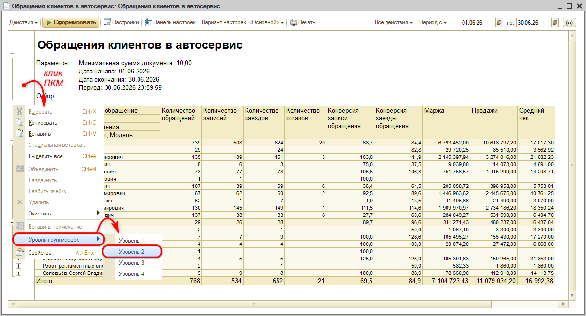
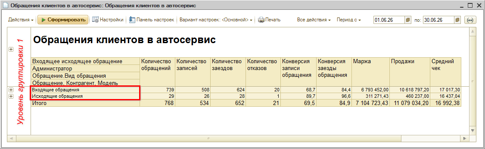
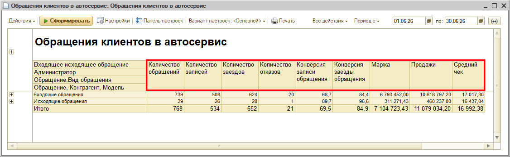
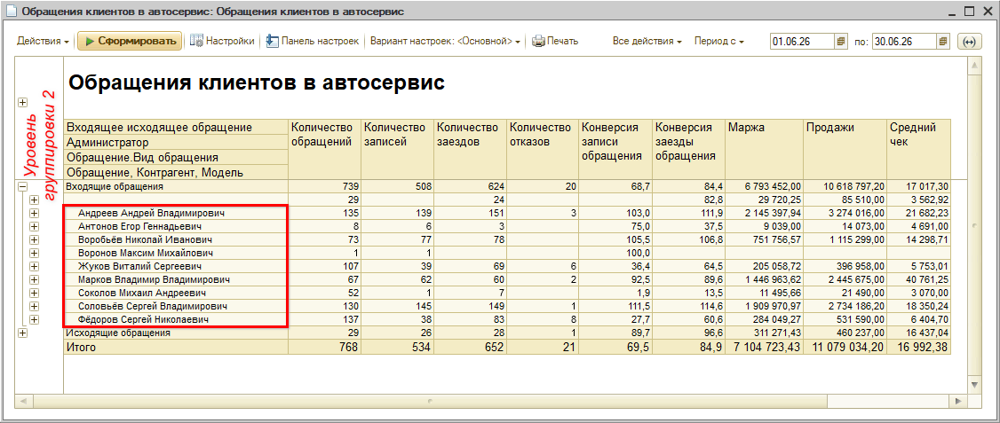
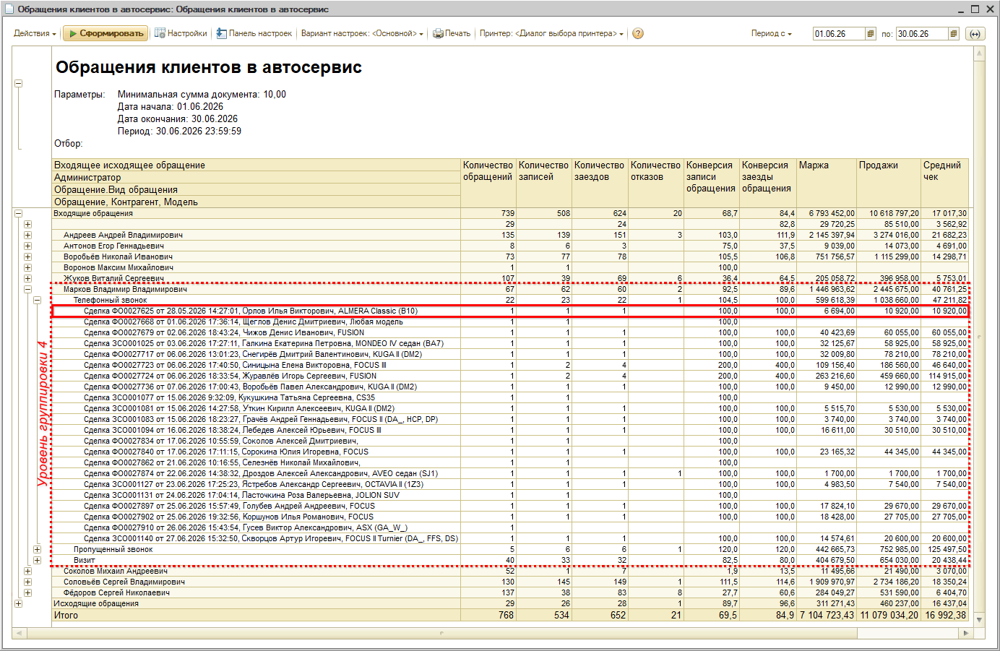
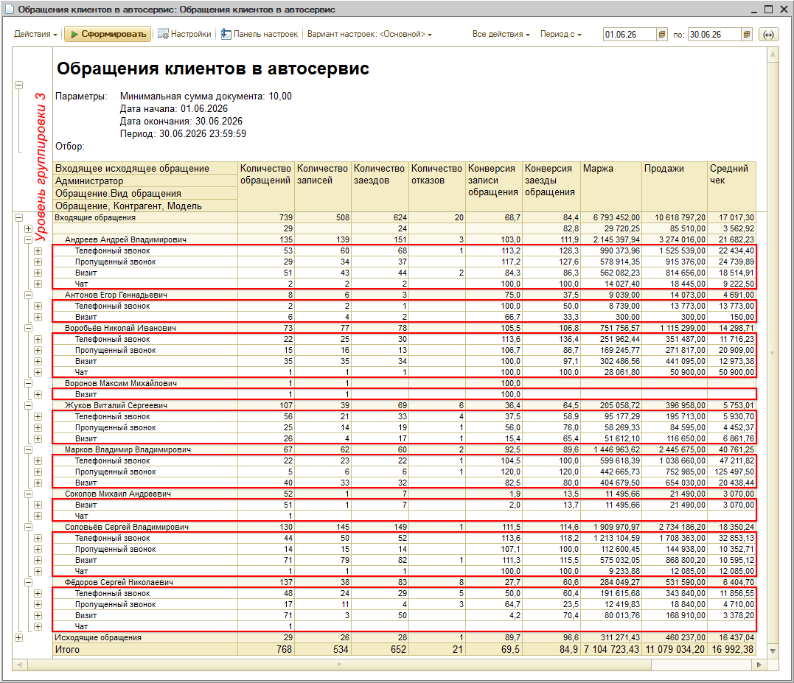
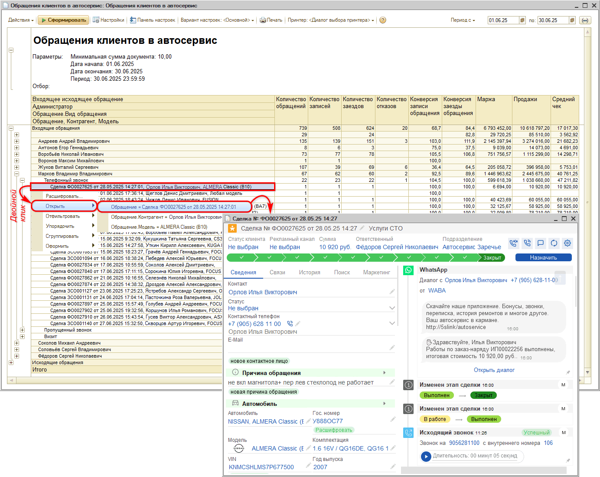
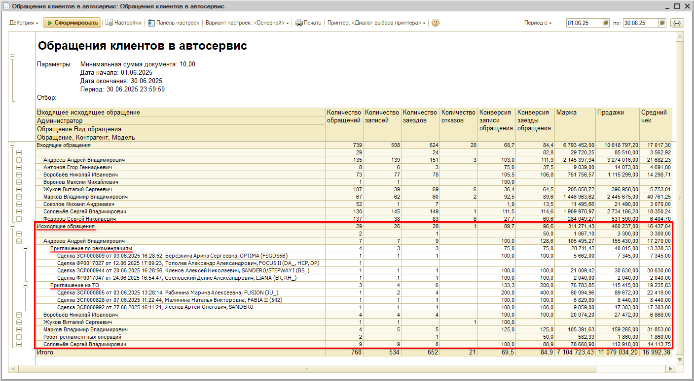
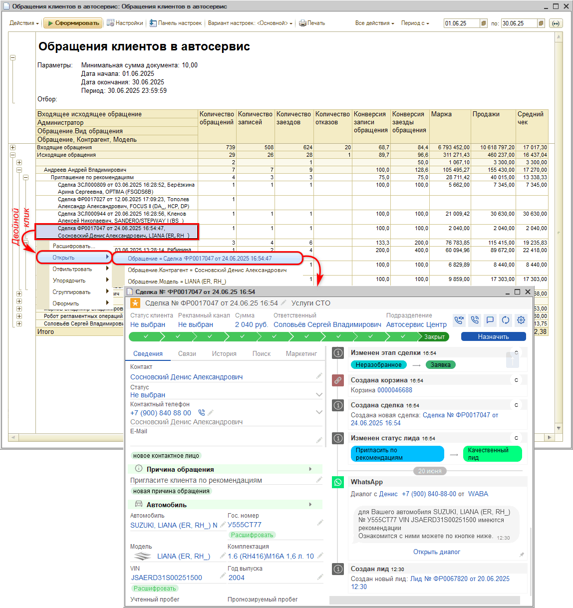

# Отчет “Обращения клиентов в автосервис”

<table><tr><td><b>Время чтения:</b> 9 мин.</td><td><b>Обновлено:</b> 17.08.2026</td></tr></table>

Источник: https://www.5systems.ru/help/otchet-obrascheniya-klientov-v-avtoservis

## Содержание

- [Введение](#введение)
- [Работа с отчетом](#работа-с-отчетом)
  - [Формирование отчета](#формирование-отчета)
  - [Общая логика построения отчета](#общая-логика-построения-отчета)
  - [Показатели отчета](#показатели-отчета)
  - [Входящие обращения](#входящие-обращения)
    - [Источники обращений](#источники-обращений)
    - [Отбор по причинам отказа](#отбор-по-причинам-отказа)
  - [Исходящие обращения](#исходящие-обращения)

## Введение

Отчет ***“Обращения клиентов в автосервис”*** формирует свод данных по [сделкам](../../CRM/Работа%20со%20сделкой/rabota-so-sdelkoy.md) (зафиксированным обращениям клиентов) и позволяет анализировать воронку продаж в разрезе источников обращений: входящих звонков, визитов, заявок с сайта, обращений через мессенджеры или мобильное приложение.

Отчет позволяет оценить количество клиентов, обратившихся за определенный период, конверсию на каждом этапе воронки продаж и доход от заездов. Есть возможность отследить всю цепочку:

     ●   сколько поступило целевых обращений,
     ●   сколько из них завершилось записью,
     ●   сколько клиентов реально приехали в автосервис,
     ●   на какую сумму были выполнены работы и/или реализованы товары по каждому заезду.

Также отчет можно использовать как инструмент для анализа отказов.

Для компаний с call-центрами или операторами, работающими по системе оплаты по числу заездов, отчет помогает выстраивать систему мотивации: например, количество заездов умножается на заданный коэффициент, и на основе этого рассчитывается заработная плата сотрудника.

## Работа с отчетом

### Формирование отчета

Расположение отчета в типовом меню: *CRM → Все операции → Отчеты → Обращения клиентов в автосервис.*

Сначала отчет требуется сформировать. Предварительно в настройках установить нужный период:

Также есть возможность задать отбор, например, сделки с какими причинами отказа не должны попадать в отчет (подробнее см. раздел [ниже](#отбор-по-причинам-отказа)).

Для работы с разными данными отчета удобно использовать *уровни группировки строк:*

### Общая логика построения отчета

Отчет строится по сделкам на основании даты изменения [этапа сделки](../../CRM/Канбан%20сделок/kanban-sdelok.md#сделка-и-ее-этапы).

На первом уровне группировки строк сделки выводятся в разбивке на входящие и исходящие обращения (подробнее см. [ниже](#входящие-обращения)):

### Показатели отчета

Отчет включает следующие показатели:

     ●   *Количество обращений* – всего входящих обращений клиентов за указанный период.
     ●   *Количество записей* – сколько записалось из общего количества обратившихся.
     ●   *Количество заездов* – сколько заехало фактически.
     ●   *Количество отказов* – клиенты, которые были записаны, но не заехали.
     ●   *Конверсия записи обращения* – отношение количества записей к количеству обращений в %.
     ●   *Конверсия заезды обращения* – отношение количества заездов к количеству обращений в %.
     ●   *Маржа* – доход от заездов клиентов за минусом себестоимости работ и запасных частей (разница между ценой и себестоимостью).
     ●   *Продажи* – общая валовая сумма вместе с себестоимостью и запасными частями, т.е. сколько продано работ и запасных частей.
     ●   *Средний чек* – сумма всех совершенных клиентами покупок за определенный период времени, деленная на количество чеков за тот же период.

### Входящие обращения

На 2 уровне строки отчета группируются по администраторам. Администратор – это сотрудник, который последним обслуживал клиента в рамках данной сделки: автор заявки на ремонт, специалист по запчастям либо сотрудник, который принял звонок при создании сделки.

В отчете можно отследить по каждому сотруднику показатели по каждому обращению (на последнем уровне группировки строк):

Например: было зафиксировано обращение клиента – создана сделка, клиента записали, он заехал и оставил 6694,00 рублей (по марже, за вычетом себестоимости запчастей; если запчастей не было – в столбцах “Маржа” и “Продажи” будут стоять одинаковые суммы).

#### Источники обращений

Уровень группировки 3 позволяет увидеть отчет в разрезе источников обращений:

Источник обращения определяется автоматически на основании причины создания [сделки](../../CRM/Работа%20со%20сделкой/rabota-so-sdelkoy.md):

     ●   *Телефонный звонок* – это входящий звонок, когда оператор взял трубку и пообщался с клиентом.
     ●   *Пропущенный звонок* – показатель попадает в этот раздел, если звонок, на основании которого была создана сделка, был [пропущен](../../Телефония/Работа%20с%20пропущенными%20звонками/rabota-s-propushchennymi-zvonkami.md) (даже если позже по этому звонку перезвонил оператор и записал клиента).
     ●   *Мобильное приложение* – обращение клиента через мобильное приложение [5S LINK](https://www.5systems.ru/help/nastroyka-prilozheniya-5s-link-v2).
     ●   *Заявка с сайта* – обращение клиента через сайт (форма обратного звонка на сайте автосервиса).
     ●   *Визит* – когда клиент пришел без звонка (сделка [создана вручную](https://www.5systems.ru/help/sozdanie-sdelki)).
     ●   *Чат* – обращение через [мессенджеры](https://www.5systems.ru/taxonomy/term/157).

Для детализации обращений можно развернуть нужную категорию, например, "Телефонный звонок", и в ней открыть любую из сделок:

В [событиях сделки](../../CRM/События%20сделки/sobytiya-sdelki.md) можно посмотреть всю историю общения с клиентом по данному обращению, перейти к переписке, прослушать звонок, увидеть, с кем из сотрудников общался клиент и т.д.

#### Отбор по причинам отказа

Обращения клиентов в компанию могут быть целевыми и нецелевыми. Целевые – это обращения по профилю автосервиса или магазина, которые переходят в качественную сделку, по которой ведется дальнейшая работа. Нецелевые – например, если ошиблись номером или обратились по непрофильным работам, которые компания не оказывает, или непрофильным автомобилям, с которыми компания не работает.

В случае использования [режима работы CRM](../../CRM/Режимы%20работы%20CRM/rezhimy-raboty-crm.md) *лиды + сделки* нецелевые обращения не становятся лидами, они отсеиваются на этапе перевода лида в сделку, следовательно в данный отчет не попадают, попадают только целевые обращения.

В случае использования *простого* [режима работы CRM](../../CRM/Режимы%20работы%20CRM/rezhimy-raboty-crm.md) *(без лидов)* сделка создается сразу и сначала попадает в “неразобранные”: на данном этапе могут быть нецелевые обращения, а также те, которые уйдут “в отказ” после созвона с клиентом. Чтобы нецелевые сделки не попадали в отчет и не портили статистику, имеет смысл сделать следующие настройки.

Предварительно следует вручную заполнить справочник ***“причины отказа”*** – добавить несколько основных возможных причин. Затем настроить в отчете отбор: какие причины отказа будут считаться уважительными для автосервиса – они будут отфильтровываться, а какие неуважительными – они будут отражаться в отчете. Таким образом, в отчет будут попадать только целевые сделки для более корректной аналитики.

Как установить фильтр по причинам отказа – см. выше в разделе “[Формирование отчета](#формирование-отчета)”.

### Исходящие обращения

В число исходящих обращений попадают сделки, обращения по которым были инициированы сотрудниками компании путем механизмов “[Приглашения по рекомендациям](../../Автосервис/Работа%20с%20рекомендациями/rabota-s-rekomendaciyami.md#приглашение-по-рекомендациям)” и “[Приглашения на ТО](../../CRM/Приглашения%20на%20ТО/priglasheniya-na-to.md)”:

Для просмотра истории обращения также можно перейти к конкретной сделке:

---

**Теги:** Отчеты, CRM, обращения клиентов, входящие обращения, исходящие обращения, воронка продаж, конверсия, заезды, источники обращений

