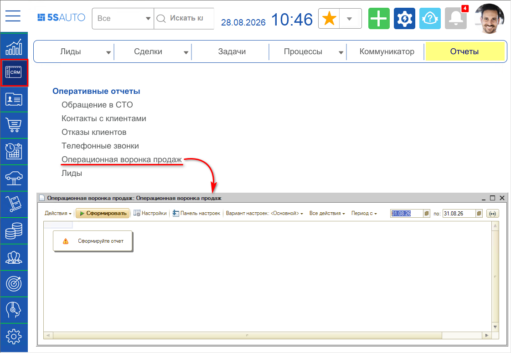
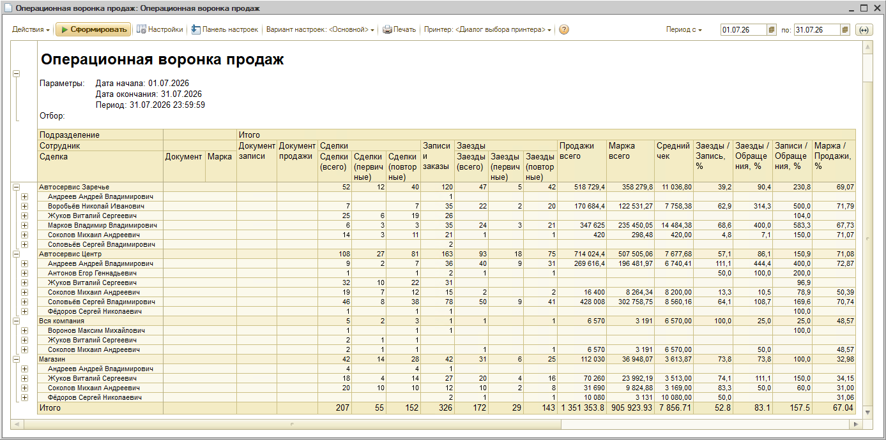
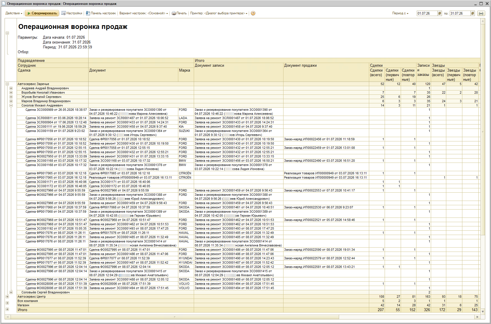

# Отчет «Операционная воронка продаж»

<table><tr><td><b>Время чтения:</b> 11 мин.</td><td><b>Обновлено:</b> 31.08.2026</td></tr></table>

Источник: https://www.5systems.ru/help/otchet-operacionnaya-voronka-prodazh

## Содержание

1. [Введение](#введение)
2. [Как перейти](#как-перейти)
3. [Описание](#описание)
   - [Группировка](#группировка)
   - [Колонки отчета](#колонки-отчета)
4. [Видео по теме](#видео-по-теме)

## Введение

*Воронка продаж* – принцип распределения клиентов по всем стадиям бизнес-процесса. Она отражает количество клиентов, находящихся на определенных этапах взаимоотношений с менеджерами и мастерами-консультантами – начиная с обращения клиента и заканчивая закрытием сделки.

В отличие от «[Воронки продаж по закрытым сделкам](../Отчет%20Воронка%20продаж%20по%20закрытым%20сделкам/otchet-voronka-prodazh-po-zakrytym-sdelkam.md)», которая формируется по дате закрытия сделки (дате закрытия Заказ-наряда, Реализации товаров, либо зафиксированного отказа), «Операционная (или оперативная) воронка продаж» формируется по текущей деятельности, то есть, на основании Документов записи (Заявка на ремонт/Заказ покупателя) и Документов продажи (Заявка на ремонт/Реализация товара) за заданный период. В отчете отражается количество текущих Сделок, Записей, Заездов и Продаж, при этом количество Заказ-нарядов отражает документы, сформированные по «вчерашним» Записям. В отчет попадают и закрытые, и открытые сделки (которые пока неизвестно, чем закончатся). По одной Сделке может быть несколько Записей. В отчет могут попадать «старые» Обращения, документы по которым созданы в текущем периоде.

Таким образом, *Операционная воронка продаж* отражает текущую статистику в процессе работы и служит для контроля достаточного количества обращений и сделок.

## Как перейти

В меню интерфейса *CRM → Отчеты → Операционная воронка продаж:*

## Описание

Пример сформированного отчета «Операционная воронка продаж» (уровень группировки 2):

Отчет позволяет анализировать показатели продаж по подразделениям и по каждому сотруднику: сколько было сделок у сотрудника, сколько их них стали записью, сколько из обращений стали заездами.

Видны конверсии[\*](#snoska):

- Заезды / Запись,
- Заезды / Обращения,
- Запись / Обращения,
- Маржа / Продажи.

*\* Конверсия – это показатель эффективности того или иного уровня воронки продаж. Чтобы измерить конверсию воронки, нужно показатель нижестоящего уровня разделить на показатель вышестоящего. То есть, если разделить количество заездов на количество обращений, мы получим конкретный показатель конверсии. Например: 1%. Значит, конверсия, или эффективность уровня «Запись / Обращения», равна 1%.*

Конкретные показатели отчета будут зависеть от того, как построен бизнес-процесс в организации. Данные по конверсиям будут более показательны для тех сервисов, где всю работу делает менеджер. Если должности разделены, то будет видна аналитика для тех, кто принимает звонок. Видна эффективность – сколько первичных обращений принял сотрудник кол-центра, и сколько из этих обращений превратились в записи и в заезды.

### Группировка

Вертикальная группировка в отчете по умолчанию строится по следующим показателям:

- Уровень 1: Подразделения,
- Уровень 2: Сотрудники,
- Уровень 3: Сделка, Документ, Марка - конечный уровень группировки.

Пример сформированного отчета, уровень группировки 3.

### Колонки отчета

<table><tr><th>Показатель</th><th>Описание</th></tr><tr><td><b>Сделка</b></td><td>– зафиксированное обращение клиента.</td></tr><tr><td><b>Документ записи</b></td><td>– заявка на ремонт или заказ покупателя, которые были оформлены по результатам обращения в рамках Сделки.</td></tr><tr><td><b>Документ продажи</b></td><td>– заказ-наряд или реализация товаров, оформленные по результатам обращения в рамках Сделки.</td></tr><tr><td colspan="2"><b><i>Сделки</i></b></td></tr><tr><td><b>Сделки (всего)</b></td><td>– количество сделок, документы по которым созданы в указанный период.</td></tr><tr><td><b>Сделки (первичные)</b></td><td>– количество сделок по <i>первичным</i> обращениям, документы по которым созданы в указанный период.</td></tr><tr><td><b>Сделки (повторные)</b></td><td>– количество сделок по <i>повторным</i> обращениям, документы по которым созданы в указанный период.</td></tr><tr><td><b>Запись и заказы</b></td><td>– количество заявок на ремонт и заказов покупателей за текущий период.</td></tr><tr><td colspan="2"><b><i>Заезды</i></b></td></tr><tr><td><b>Заезды и продажи</b></td><td>– количество заказ-нарядов и реализаций товаров за текущий период.</td></tr><tr><td><b>Заезды (первичные)</b></td><td>– количество заказ-нарядов и реализаций товаров по первичным клиентам.</td></tr><tr><td><b>Заезды (повторные)</b></td><td>– количество заказ-нарядов и реализаций товаров по повторным клиентам.</td></tr><tr><td colspan="2"><b><i>Эффективность</i></b></td></tr><tr><td><b>Заезды / Запись (%)</b></td><td>– отношение количества документов продажи к количеству документов записи (заявки на ремонт и заказы покупателя) в процентах.</td></tr><tr><td><b>Заезды / Обращения (%)</b></td><td>– отношение количества документов продажи к количеству сделок в процентах.</td></tr><tr><td><b>Записи / Обращения (%)</b></td><td>– отношение количества документов записи (заявки на ремонт и заказы покупателя) к количеству сделок в процентах.</td></tr><tr><td colspan="2"><b><i>Финансовые показатели</i></b></td></tr><tr><td><b>Продажи всего</b></td><td>– общая сумма продаж за период.</td></tr><tr><td><b>Маржа всего</b></td><td>– сумма продаж минус себестоимость товаров и авторабот.</td></tr><tr><td><b>Средний чек</b></td><td>– сумма продаж за определенный период времени, деленная на количество документов продажи за этот же период.</td></tr><tr><td><b>Маржа / Продажи (%)</b></td><td>– отношение суммы маржи к сумме продаж.</td></tr></table>

*Воронка продаж* – это идеальный инструмент анализа эффективности работы как всего отдела продаж, так и отдельно взятых менеджеров. С её помощью можно определить, на каких этапах отсеивается больше всего потенциальных клиентов: значит там есть проблемы, и можно предпринять действия по их устранению.

Дополнением к отчету «Операционная воронка продаж» является *[отчет «Обращения клиентов в автосервис»](../Отчет%20Обращение%20клиентов%20в%20автосервис/ARTICLE.md)*.

Также отчет «Операционная воронка продаж» используется для работы с *[системой аналитики Roistat](../../Аналитика/Настройка%20интеграции%20с%20системой%20аналитики%20Roistat/nastroyka-integracii-s-sistemoy-analitiki-roistat.md)*.

## Видео по теме

Вебинар по теме «Базовый курс по отчетам 5S AUTO» от 02.12.2020, [43:16](https://youtu.be/ET2pTaWQVHw?t=2596) – отчет «Операционная воронка продаж»:

---

**Теги:** отчеты, операционная воронка продаж, сделки, crm, конверсия
