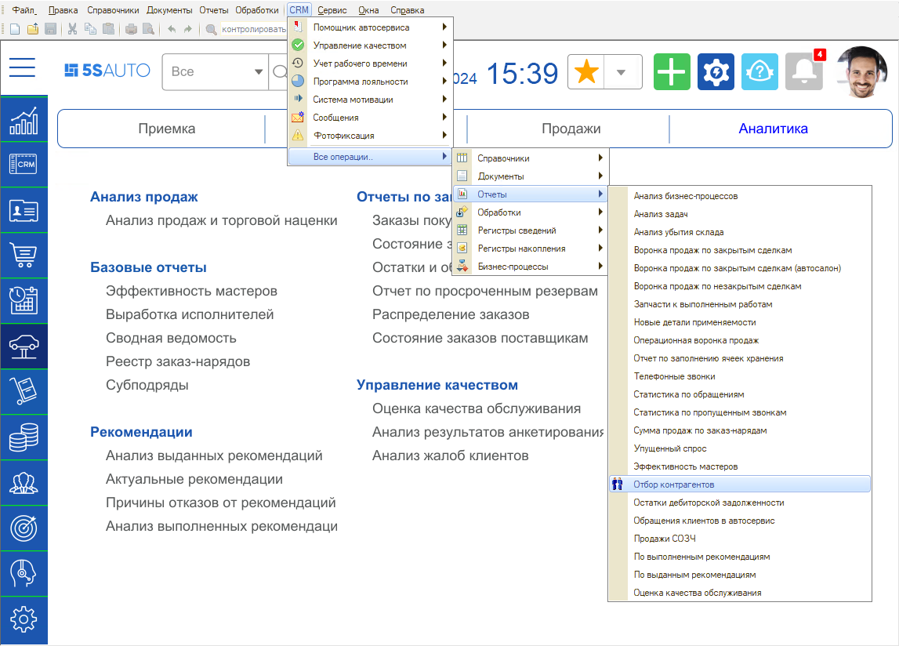
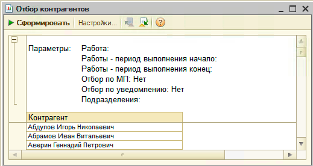
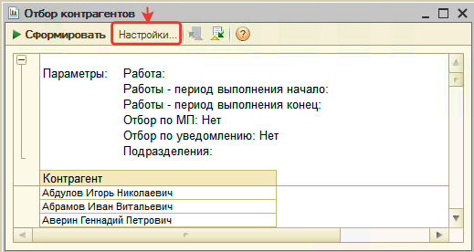
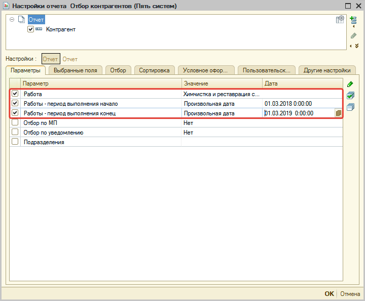
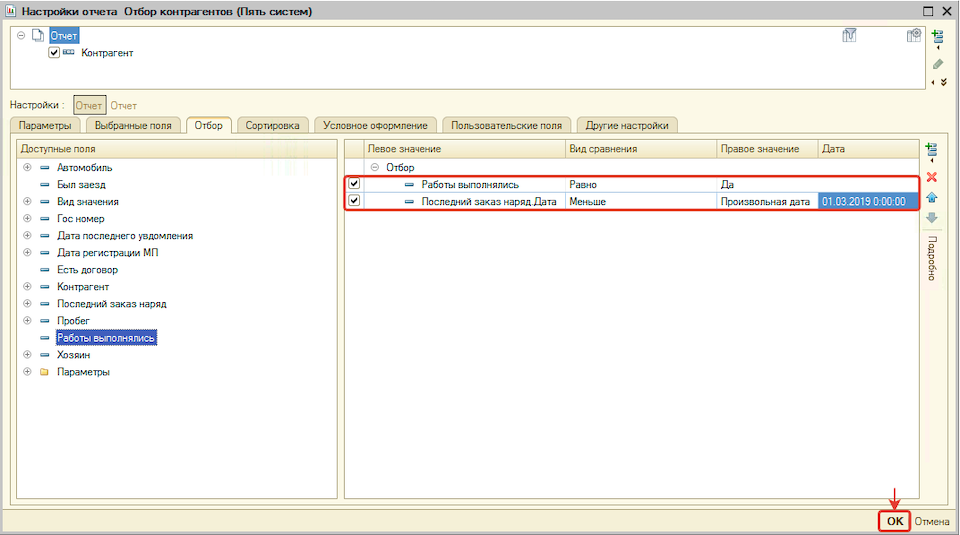
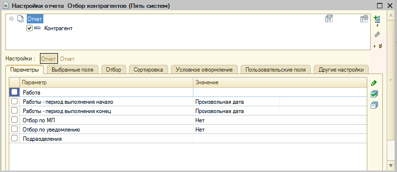
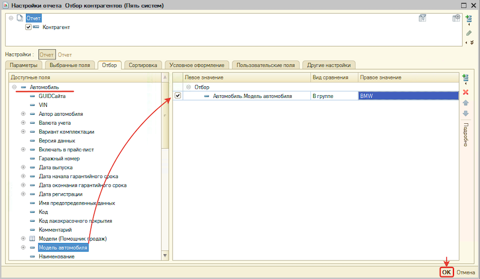
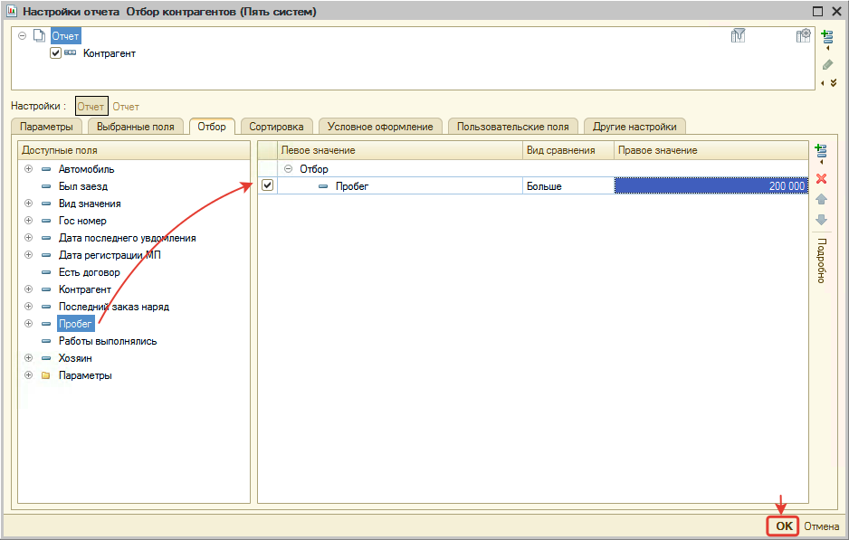

# Отчет "Отбор по контрагентам"

<table><tr><td><b>Время чтения:</b> 12 мин.</td><td><b>Обновлено:</b> 28.06.2022</td></tr></table>

Источник: https://www.5systems.ru/help/otchet-otbor-po-kontragentam

## Содержание

1. [Введение](#введение)
2. [Как перейти](#как-перейти)
3. [Описание](#описание)
   - [Примеры настройки отборов](#примеры-настройки-отборов)
      - [Отбор по выполненным работам более года назад](#отбор-по-выполненным-работам-более-года-назад)
      - [Отбор по модели автомобиля](#отбор-по-модели-автомобиля)
      - [Отбор по пробегу автомобиля](#отбор-по-пробегу-автомобиля)

## Введение

Отчет позволяет отобразить список контрагентов, отобранных по различным критериям. Список контрагентов можно использовать для формирования рассылок в рамках маркетинговых кампаний.

Во встроенном в программу *[механизме рассылки](../../Сообщения/Массовая%20рассылка%20сообщений%20по%20выборке%20клиентов/massovaya-rassylka-soobscheniy-po-vyborke-klientov.md)* отчет используется для заполнения списка рассылки (выборка клиентов).

## Как перейти

## Описание

По умолчанию отчет выводит список всех контрагентов:

Для отбора перейдите в настройки отбора:

### Примеры настройки отборов

#### Отбор по выполненным работам более года назад

Предположим, что мы хотим отобрать клиентов, которые более года назад сделали у нас химчистку салона и с тех пор больше не приезжали, с целью предложить им повторную химчистку со скидкой. Для этого в настройках отбора:

- На вкладке "Параметры":
  - Выбираем работу "Химчистка и реставрация салона", которая выполнялась клиенту,
  - Устанавливаем период выполнения работы за прошлый год.  
    
- На вкладке "Отбор":
  - Устанавливаем отбор по полю "Работы выполнялись" *Равно* "Да",
  - Устанавливаем отбор по полю "Последний заказ наряд.Дата" *Меньше* текущей даты (01.03.2020) на один год.  
    

#### Отбор по модели автомобиля

Предположим, что мы хотим отобрать клиентов, у которых марка автомобиля BMW, чтобы предложить им техосмотр со скидкой. Для этого:

- на вкладке "Параметры" снимаем все отборы:  
  
- переходим на вкладку "Отбор" и устанавливаем отбор по полю "Автомобиль.Модель автомобиля" *В группе* "BMW":  
  

#### Отбор по пробегу автомобиля

Предположим, что мы хотим отобрать клиентов, у которых большой пробег автомобиля, чтобы предложить им техосмотр со скидкой. Для этого:

- на вкладке "Параметры" снимаем все отборы:  
  
- переходим на вкладку "Отбор" и устанавливаем отбор по полю "Пробег" *Больше* 200 000:  
  

---

**Теги:** отчеты, отбор по контрагентам, контрагенты, выборка клиентов, рассылка
