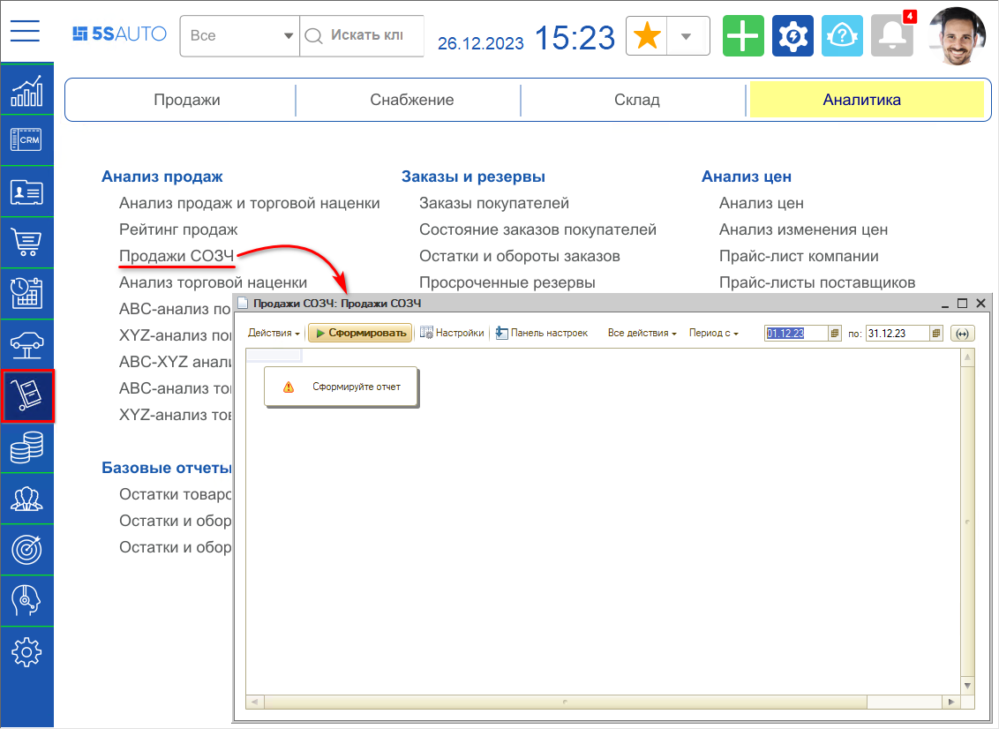
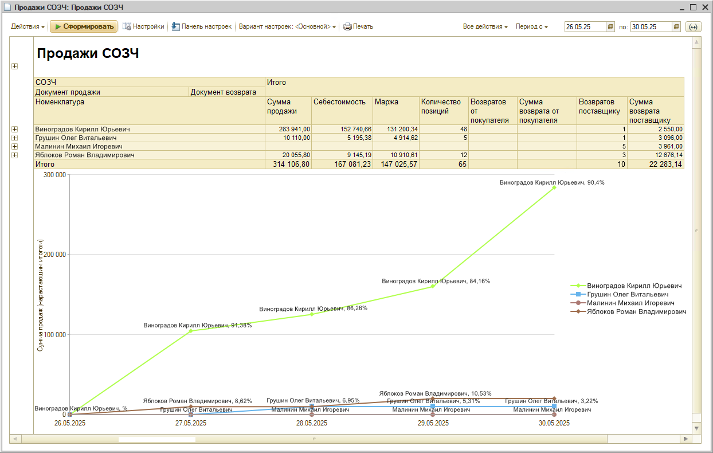

# Отчет "Продажи СОЗЧ"

<table><tr><td><b>Время чтения:</b> 5 мин.</td><td><b>Обновлено:</b> 26.12.2023</td></tr></table>

Источник: https://www.5systems.ru/help/otchet-prodazhi-sozch

## Содержание

1. [Введение](#введение)
2. [Как перейти](#как-перейти)
3. [Работа с отчетом](#работа-с-отчетом)
   - [Таблица](#таблица)
   - [График](#график)

## Введение

Продажи СОЗЧ = Продажи сотрудников отдела запчастей.

Отчет позволяет проанализировать ключевые показатели продажи запчастей сотрудниками компании, которые подбирают запчасти или участвуют в реализации запчастей, с целью оценки эффективности их работы.

## Как перейти

Перейти в отчет можно через меню интерфейса *Запчасти и склад → вкладка "Аналитика" → Анализ продаж:*

## Работа с отчетом

### Таблица

Таблица по умолчанию имеет 4 уровня группировки:

1. СОЗЧ.Подразделение - подразделение сотрудника.
2. СОЗЧ - сотрудник.
3. Документ:
   - 1\. Документ продажи - документ "Поступление товаров", "Реализация товаров" или "Заказ-наряд".
   - 2\. Документ возврата - документ "Возврат покупателя", "Возврат товаров поставщику".
4. Номенклатура - позиция номенклатуры, которая была реализована в Документе продажи.

В отчете выводятся ключевые показатели продаж в разрезе сотрудников (СОЗЧ), данные по продажам сотрудника берутся из:

- поле "Менеджер" документа "Реализация товаров" или "Поступление товаров",
- колонка "Подобрал з/ч" табличной части "Товары" Заказ-наряда в состоянии "Закрыт" (см. [*Учет выработки специалистов по запчастям в Заказ-нарядах*](../../Практики/Учет%20выработки%20специалистов%20по%20запчастям%20в%20Заказ-нарядах/uchet-vyrabotki-specialistov-po-zapchastyam-v-zakaz-naryadakh.md)).

***Ключевые показатели*:**

1. *Сумма продажи* - сумма продажи из Документа продажи за вычетом Суммы возврата.
2. *Себестоимость* - себестоимость проданных товаров (возвраты учитываются).
3. *Маржа* - выручка с продаж (Сумма продажи - Себестоимость).
4. *Количество позиций* - количество проданных позиций (возвраты учитываются).
5. *Возвратов от покупателя* - количество позиций, по которым был возврат от покупателя.
6. *Сумма возврата от покупателя* - сумма, которую вернули покупателям.
7. *Возвратов поставщику* - количество позиций, по которым был возврат поставщику.
8. *Сумма возвратов поставщику* - сумма, которую вернули поставщикам.

### График

График по умолчанию отражает *Маржу (нарастающим итогом)* по сотрудникам (СОЗЧ). С помощью настроек отчета можно вывести вместо показателя *Маржа (нарастающим итогом)* показатель *Сумма продаж (нарастающим итогом)*

---

**Теги:** отчеты, продажи созч, специалист по запчастям, выработка, запчасти

