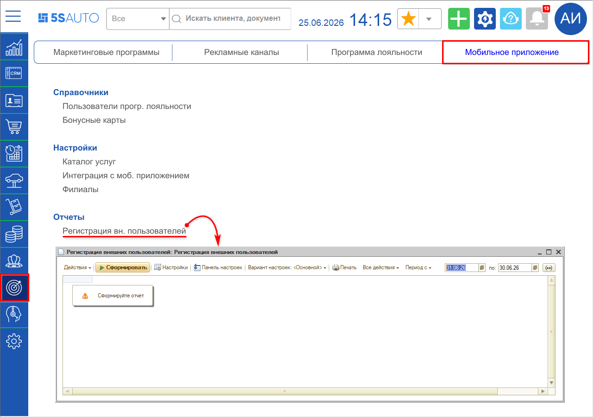
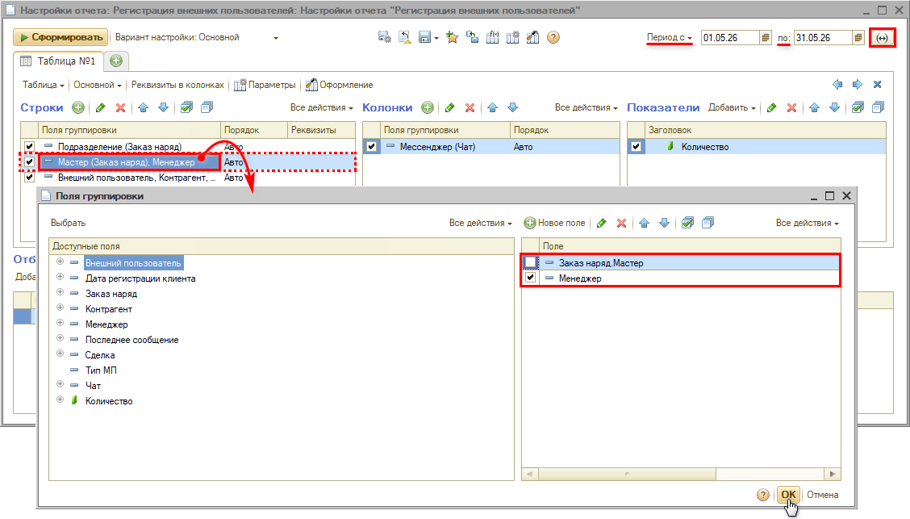
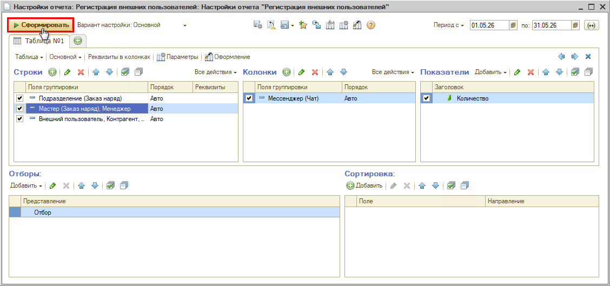
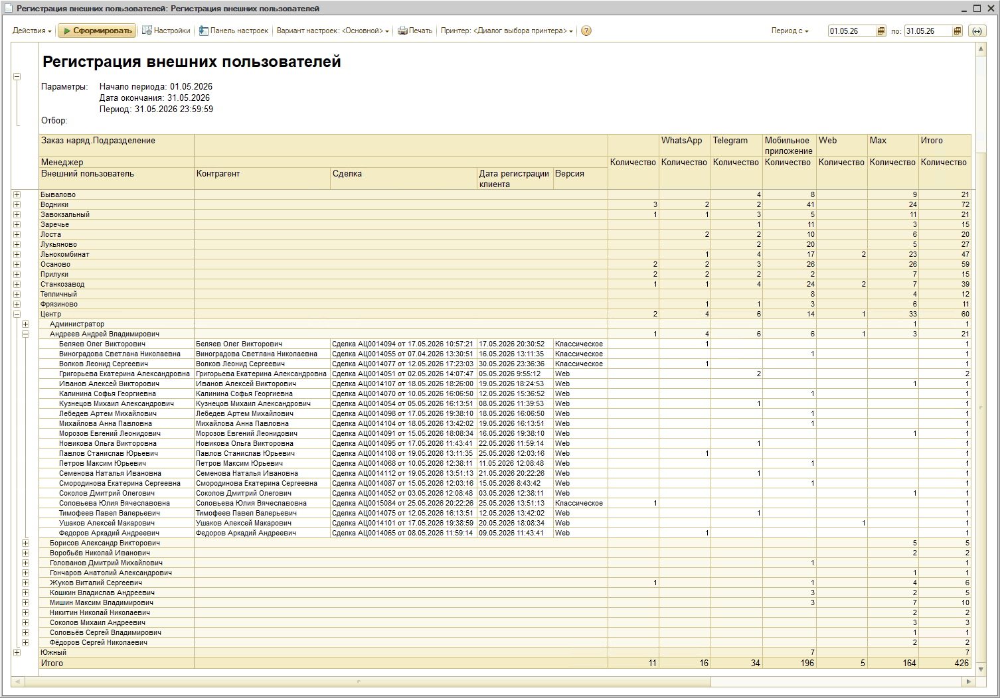
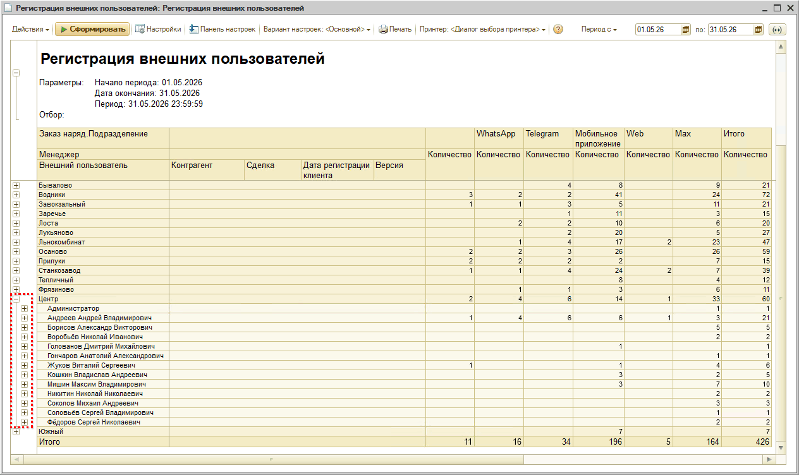

# Отчет “Регистрация внешних пользователей”

<table><tr><td><b>Время чтения:</b> 6 мин.</td><td><b>Обновлено:</b> 02.07.2026</td></tr></table>

Источник: https://www.5systems.ru/help/otchet-registraciya-vneshnikh-polzovateley

## Содержание

1. [Введение](#введение)
2. [Переход к отчету](#переход-к-отчету)
3. [Настройки отчета](#настройки-отчета)
4. [Работа с отчетом](#работа-с-отчетом)
   - [1. Строки отчета](#1-строки-отчета)
   - [2. Показатели отчета](#2-показатели-отчета)
   - [3. Анализ результатов](#3-анализ-результатов)

> *Доступно начиная с релиза **2.8.4**.*

## Введение

***Отчет “Регистрация внешних пользователей”*** позволяет получить список клиентов, зарегистрированных в приложении [5S LINK](../../Приложение%205S%20LINK/Настройка%20приложения%205S%20LINK%20v2/nastroyka-prilozheniya-5s-link-v2.md), с возможностью анализа данных с детализацией по сотрудникам, подразделениям и каналам связи. Отчет позволяет наглядно определить, через кого из сотрудников больше клиентов подключаются к ботам компании в мессенджерах и регистрируются в мобильном приложении.

*Регистрация клиента в приложении* или *авторизация у бота компании* – это ключевой этап вовлечения: такие клиенты чаще возвращаются, требуют меньше времени и ручных действий для обработки заявки и остаются на связи с бизнесом.

Привлечение клиентов к регистрации в приложении – это важная работа, которая приводит к автоматизации взаимодействия, экономии времени, получению данных для маркетинга и аналитики, росту конверсии и выручки компании. Отчет помогает оценить вклад каждого сотрудника в этот процесс и определить наиболее эффективные каналы привлечения.

Полученные данные отчета можно использовать для:

➱  мотивации сотрудников; 
➱  оптимизации маркетинговых активностей; 
➱  оценки эффективности каналов коммуникации.

*Также рекомендуются для изучения статьи:*

- [Настройка приложения 5S LINK v2](../../Приложение%205S%20LINK/Настройка%20приложения%205S%20LINK%20v2/nastroyka-prilozheniya-5s-link-v2.md);
- [Мобильное приложение 5S LINK v1](../../Приложение%205S%20LINK/Мобильное%20приложение%205S%20LINK%20v1/);
- [Внешние пользователи](../../Приложение%205S%20LINK/Внешние%20пользователи/vneshnie-polzovateli.md).

## Переход к отчету

Перейти к отчету можно через меню программы – *Маркетинг → вкладка Мобильное приложение → Отчеты → Регистрация внешних пользователей:*

*Примечание:* В случае если данного пункта меню нет на рабочем столе, можно добавить его вручную – см. статью "[Настройка рабочего стола](../../Администрирование%20и%20настройка%20системы/Настройка%20рабочего%20стола/nastroyka-rabochego-stola.md#настройки-разделов-и-пунктов-рабочего-стола)".

## Настройки отчета

Для формирования отчета требуется:

1. Задать нужный *период.*
2. Выбрать *вариант группировки строк* – по мастеру Заказ-наряда или по менеджеру (ответственному) в Сделке.  
   Выбор зависит от того, по сотрудникам какой должности требуется получить статистику. Например, для автосервиса логичнее смотреть данные по мастеру Заказ-наряда, а для магазина – по ответственному в Сделке (т.к. в документе “Реализация товаров” нет мастера).  
   Для выбора варианта группировки следует открыть форму поля группировки строк *“Мастер (Заказ-наряд), Менеджер”.* По умолчанию установлены обе галочки – нужно снять лишнюю и нажать кнопку “ОК”:  
   
3. Нажать кнопку *“Сформировать”:*  
   

## Работа с отчетом

### 1. Строки отчета

В отчет попадают *внешние пользователи,* прошедшие регистрацию в приложении 5S LINK в выбранный период, на которых были оформлены заказ-наряды или открыты сделки.  [Строки отчета](../Настройка%20отчетов%20на%20СКД/nastroyka-otchetov-na-skd.md#область-строки) выводятся в разбивке по мастерам / менеджерам с группировкой по подразделениям. Мастера подтягиваются из заказ-нарядов (поле “[Мастер](../../Автосервис/Работа%20с%20Заказ-нарядами/Заказ-наряды/zakaz-naryady.md#данные-о-ремонте)”), менеджеры – из сделок (“[Ответственный](../../CRM/Работа%20со%20сделкой/rabota-so-sdelkoy.md#1-верхняя-панель)” по Сделке).

В отчет попадают данные о регистрации как в классическом приложении [5S LINK v1](../../Приложение%205S%20LINK/Мобильное%20приложение%205S%20LINK%20v1/), так и в веб-приложении [5S LINK v2](../../Приложение%205S%20LINK/Настройка%20приложения%205S%20LINK%20v2/nastroyka-prilozheniya-5s-link-v2.md).

*Пример сформированного отчета:*

***Колонки отчета:***

1. *Внешний пользователь* – пользователь мобильного приложения, в значение подтягивается ФИО из карточки справочника “[Внешние пользователи](../../Приложение%205S%20LINK/Внешние%20пользователи/vneshnie-polzovateli.md)”, которая создается в момент регистрации клиента в приложении 5S LINK.
2. *Контрагент* – клиент в программе, значение подтягивается из карточки [контрагента](../../Работа%20с%20клиентами/Контрагенты%20и%20контакты/kontragenty-i-kontakty.md), с которым связан данный внешний пользователь.
3. *Дата регистрации клиента* – дата регистрации пользователя в мобильном приложении.
4. *Версия* – версия мобильного приложения: классическое или web.

### 2. Показатели отчета

В области [показателей отчета](../Настройка%20отчетов%20на%20СКД/nastroyka-otchetov-na-skd.md#область-показатели) выводится количество пользователей, зарегистрировавшихся в приложении в рамках заданного периода, в разбивке по каналам связи:

1. *Telegram / Max /* *WhatsApp –* значение попадает в один из этих столбцов, если клиент написал сообщение в боте соответствующего мессенджера.
2. *Мобильное приложение –* клиент попадает в данный столбец, если он написал сообщение или оставил заявку *в самом приложении*.
3. *Web –* клиент попадет в этот столбец, если он оформил заявку через *форму записи на сайте.*
4. *Первый столбец с пустым наименованием –* значение попадет в данный столбец в том случае, если клиент только *зарегистрировался* в приложении, но ничего не писал в нем или в чатах.

*Примечание:* Если у клиента несколько чатов, то значение попадет в столбец с *последним* каналом связи, из которого писал клиент.

### 3. Анализ результатов

Отчет позволяет проводить анализ работы мастеров / менеджеров – кто из сотрудников привлекает больше клиентов к регистрации в приложении и авторизации в ботах компании.

Мастера / менеджеры выводятся в разбивке по подразделениям.

Для удобства просмотра результатов отчета можно свернуть *уровень группировки строк:*

- уровень 1 = подразделения;
- уровень 2 = менеджеры / мастера:

Анализ показателей в разбивке по каналам связи позволяет наглядно определить наиболее эффективные каналы коммуникации с клиентами и использовать полученные данные для оптимизации маркетинговых активностей.

---

**Теги:** отчеты, внешние пользователи, регистрация, 5s link, мобильное приложение
