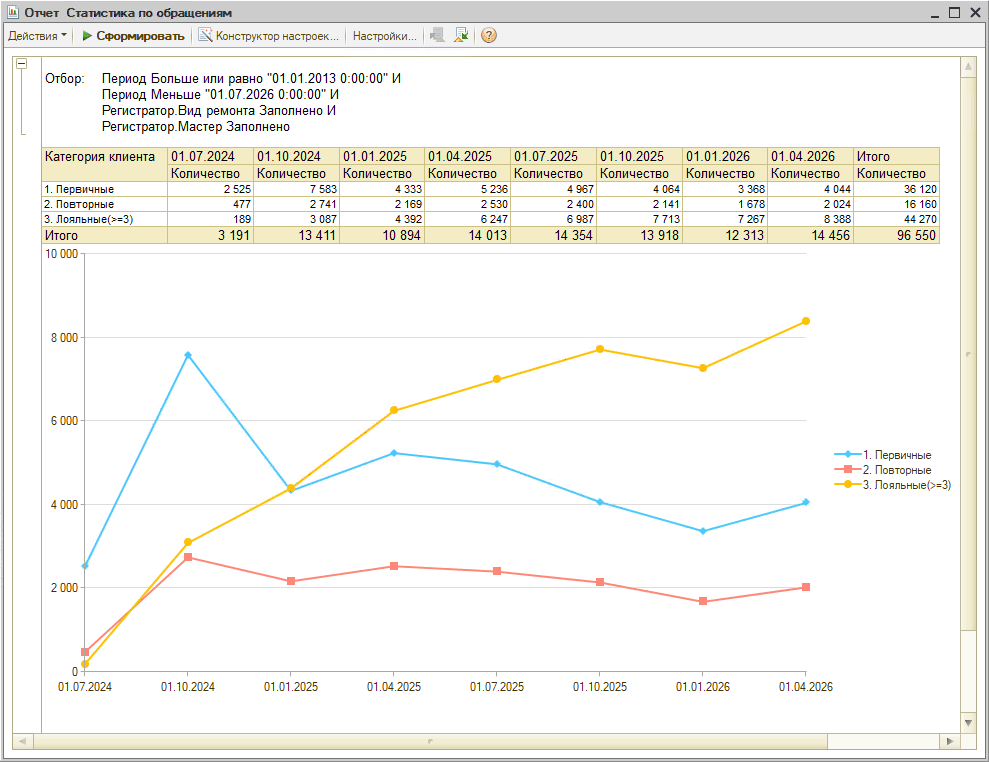
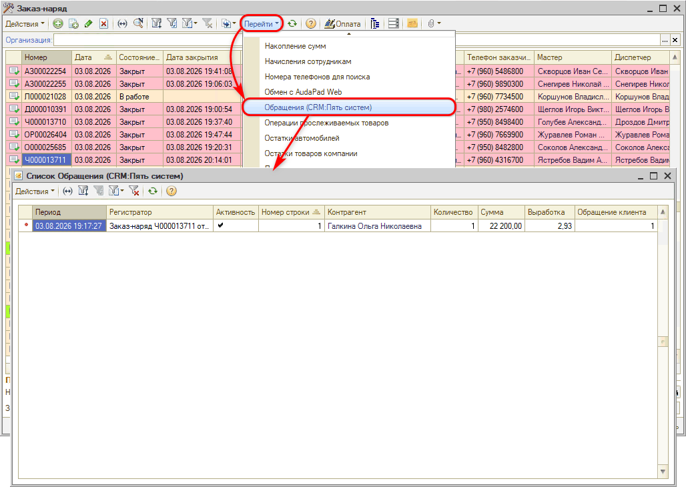

# Отчет "Статистика по обращениям"

<table><tr><td><b>Время чтения:</b> 5 мин.</td><td><b>Обновлено:</b> 04.08.2026</td></tr></table>

Источник: https://www.5systems.ru/help/otchet-statistika-po-obrascheniyam-zaezdam

## Содержание

1. [Введение](#введение)
2. [Как перейти](#как-перейти)
3. [Описание](#описание)

## Введение

Отчет позволяет руководителям сервиса провести анализ динамики обращений (заездов) клиентов по категориям:

1. *Первичные клиенты* - клиенты, которые за определенный период приобрели запчасти или заехали первый раз.
2. *Повторные клиенты* - клиенты, которые за определенный период приобрели запчасти или заехали второй раз.
3. *Лояльные клиенты* - клиенты, которые за определенный период приобрели запчасти или заехали третий и более раз.

На основе этих данных можно понять:

- динамику привлечения новых клиентов за счет проводимых маркетинговых кампаний,
- процент удержания клиентов.

## Как перейти

Перейти к отчету можно через типовое меню: *CRM → Все операции → Отчеты → Статистика по обращениям.*

## Описание

Данные отчета выводятся в виде таблицы и графика, период задан весь по умолчанию — при необходимости можно задать нужный период через настройки:

Отчет по умолчанию группирует данные по категории клиентов за квартал. При желании можно изменить период, например, на месяц:

По умолчанию в отчет выводится количество обращений (заездов) клиентов, можно настроить также следующие параметры:

- Сумма,
- Выработка,
- Сумма запчастей,
- Сумма работ.

Данные по количеству заездов или количеству покупок запчастей формируются через регистр накопления "Обращения (CRM:Пять систем)", где после закрытия заказ-наряда или проведения документа "Реализация товаров" появляется запись с количеством обращений (заездов) в колонке "Обращение клиента":

Для просмотра полного списка регистра следует снять отбор, в контексте которого открыт регистр, нажатием на кнопку , либо можно открыть данный регистр через *CRM → Все операции → Регистры накопления → Обращения.*

---

**Теги:** отчеты, статистика по обращениям, заезды, обращения клиентов
